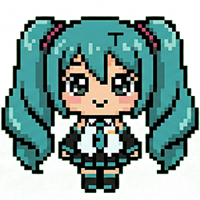

# PixelRunner Code Flat Pack for Gemini

Generated from: `C:\Users\TSUNE\Desktop\PixelRunner重构\PixelRunner`
Generated at: `2026-05-31 23:48:20 +08:00`

Included files: `63`
Approx included bytes: `1495918`

Scope: current PixelRunner source tree plus top-level README/LICENSE/plans.
Excluded: release snapshots, dependency folders, build/cache folders, lock files, binary/media/font/archive files, and generated space-fx atlas assets.

## File Index

- `PixelRunner\app.css` (106518 bytes)
- `PixelRunner\app.html` (69840 bytes)
- `PixelRunner\assets\space-fx\README.md` (821 bytes)
- `PixelRunner\docs\当前状态.md` (6337 bytes)
- `PixelRunner\docs\辉光重构2技术方案.md` (22670 bytes)
- `PixelRunner\icons\flat-empty.svg` (402 bytes)
- `PixelRunner\icons\flat-settings.svg` (494 bytes)
- `PixelRunner\icons\flat-tools.svg` (469 bytes)
- `PixelRunner\icons\flat-upload.svg` (301 bytes)
- `PixelRunner\icons\flat-workspace.svg` (525 bytes)
- `PixelRunner\index.html` (705 bytes)
- `PixelRunner\manifest.json` (4201 bytes)
- `PixelRunner\package.json` (912 bytes)
- `PixelRunner\pages\runninghub-guide.html` (41916 bytes)
- `PixelRunner\scripts\build-space-fx-assets.ps1` (10775 bytes)
- `PixelRunner\scripts\build.mjs` (1602 bytes)
- `PixelRunner\scripts\check-dist-sync.mjs` (2296 bytes)
- `PixelRunner\scripts\package-test.mjs` (2943 bytes)
- `PixelRunner\sound-player.html` (1933 bytes)
- `PixelRunner\src\host-entry.js` (57 bytes)
- `PixelRunner\src\host\bridge.js` (1061 bytes)
- `PixelRunner\src\host\main.js` (6626 bytes)
- `PixelRunner\src\host\photoshop-bridge.js` (2037 bytes)
- `PixelRunner\src\host\photoshop.js` (405 bytes)
- `PixelRunner\src\host\photoshop\blend-match.js` (166347 bytes)
- `PixelRunner\src\host\photoshop\commands.js` (5598 bytes)
- `PixelRunner\src\host\photoshop\deps.js` (1444 bytes)
- `PixelRunner\src\host\photoshop\document.js` (6037 bytes)
- `PixelRunner\src\host\photoshop\service.js` (44947 bytes)
- `PixelRunner\src\host\photoshop\tool-actions.js` (69786 bytes)
- `PixelRunner\src\host\runninghub-parser.js` (44089 bytes)
- `PixelRunner\src\host\runninghub.js` (45684 bytes)
- `PixelRunner\src\host\shell.js` (4427 bytes)
- `PixelRunner\src\host\third-party-grs.js` (29655 bytes)
- `PixelRunner\src\webview-entry.js` (907 bytes)
- `PixelRunner\src\webview\ai-optimize.js` (47985 bytes)
- `PixelRunner\src\webview\apps.js` (54262 bytes)
- `PixelRunner\src\webview\blend-match.js` (43977 bytes)
- `PixelRunner\src\webview\blend-match\gpu\webgl-blend-preview.js` (22133 bytes)
- `PixelRunner\src\webview\glow-cpu.js` (1063 bytes)
- `PixelRunner\src\webview\glow\compositor.js` (11710 bytes)
- `PixelRunner\src\webview\glow\gpu\capabilities.js` (2338 bytes)
- `PixelRunner\src\webview\glow\gpu\webgl-compositor.js` (27774 bytes)
- `PixelRunner\src\webview\glow\gpu\webgl-pyramid-blur.js` (18265 bytes)
- `PixelRunner\src\webview\glow\gpu\webgl-source-mask.js` (22371 bytes)
- `PixelRunner\src\webview\glow\presets.js` (10722 bytes)
- `PixelRunner\src\webview\glow\preview-engine.js` (15960 bytes)
- `PixelRunner\src\webview\glow\pyramid-blur.js` (8794 bytes)
- `PixelRunner\src\webview\glow\source-mask.js` (11876 bytes)
- `PixelRunner\src\webview\main.js` (2061 bytes)
- `PixelRunner\src\webview\quick-entries.js` (11470 bytes)
- `PixelRunner\src\webview\runtime.js` (9328 bytes)
- `PixelRunner\src\webview\settings.js` (52156 bytes)
- `PixelRunner\src\webview\sound.js` (5480 bytes)
- `PixelRunner\src\webview\space-fx.js` (74075 bytes)
- `PixelRunner\src\webview\state.js` (22514 bytes)
- `PixelRunner\src\webview\templates.js` (72870 bytes)
- `PixelRunner\src\webview\ui.js` (64305 bytes)
- `PixelRunner\src\webview\workspace.js` (130141 bytes)
- `PixelRunner\style.css` (1415 bytes)
- `plans\add-blend-color-match-tool.md` (21871 bytes)
- `README.md` (12897 bytes)
- `LICENSE` (11338 bytes)

## Files

---

### `PixelRunner\app.css`

```css
:root {
  color-scheme: dark;
  --bg-top: #111822;
  --bg-mid: #18212d;
  --bg-bottom: #0c1219;
  --panel: #18222d;
  --panel-soft: #1f2b37;
  --panel-strong: #243342;
  --surface-rgb: 31, 45, 59;
  --surface-soft-rgb: 35, 49, 62;
  --control-rgb: 68, 96, 121;
  --control-edge: #35506a;
  --control-ink: #203648;
  --surface-alpha: 0.96;
  --surface-soft-alpha: 0.9;
  --surface-glass-alpha: 0.62;
  --theme-image-opacity: 0;
  --theme-image-overlay: rgba(8, 12, 18, 0.48);
  --border: rgba(169, 194, 214, 0.14);
  --border-strong: rgba(169, 194, 214, 0.26);
  --ink: #304150;
  --text: #d8e5f0;
  --text-strong: #f6fbf8;
  --muted: #9eb0bf;
  --muted-soft: #8092a3;
  --accent: #63d67b;
  --accent-strong: #28c45b;
  --accent-soft: rgba(99, 214, 123, 0.16);
  --accent-wash: rgba(99, 214, 123, 0.09);
  --cta: #a9def2;
  --cta-strong: #8ac6df;
  --lavender: #c7c3ff;
  --warm: #ffb8a7;
  --sun: #ffd56a;
  --mint: #41d67b;
  --sky: #9fdcff;
  --shadow: 0 8px 0 rgba(20, 27, 36, 0.62), 0 18px 28px rgba(0, 0, 0, 0.14);
  --shadow-soft: 0 4px 0 rgba(20, 27, 36, 0.72), 0 12px 20px rgba(0, 0, 0, 0.18);
  --shadow-float: 0 10px 0 rgba(20, 27, 36, 0.7), 0 18px 32px rgba(0, 0, 0, 0.2);
  --press-ease: cubic-bezier(0.22, 1, 0.36, 1);
  --radius-xl: 16px;
  --radius-lg: 12px;
  --radius-md: 10px;
  --radius-sm: 8px;
  --font-ui: "DM Sans", "Nunito Sans", "Segoe UI", "PingFang SC", "Microsoft YaHei UI", sans-serif;
  --font-mono: "Cascadia Code", "Consolas", monospace;
}

* {
  box-sizing: border-box;
}

[hidden] {
  display: none !important;
}

title {
  display: none;
}

header,
nav,
main,
section,
article {
  display: block;
}

html,
body {
  margin: 0;
  height: 100%;
  min-height: 100%;
  background:
    radial-gradient(circle at 0% 0%, rgba(127, 180, 255, 0.14), transparent 22%),
    radial-gradient(circle at 92% 8%, rgba(143, 216, 195, 0.12), transparent 24%),
    linear-gradient(180deg, var(--bg-top) 0%, var(--bg-mid) 30%, var(--bg-bottom) 100%);
  color: var(--text);
  font-family: var(--font-ui);
}

body {
  position: relative;
  padding: 4px;
  overflow: hidden;
}

body::before {
  content: "";
  position: fixed;
  inset: 0;
  z-index: 0;
  background-image: var(--theme-image);
  background-size: cover;
  background-position: center;
  opacity: var(--theme-image-opacity);
  transition: opacity 220ms ease;
}

body.has-custom-theme-image::before {
  --theme-image-opacity: 1;
}

body.has-custom-theme-image {
  background:
    linear-gradient(180deg, rgba(9, 13, 18, 0.06), rgba(9, 13, 18, 0.16)),
    var(--theme-image),
    linear-gradient(180deg, var(--bg-top), var(--bg-bottom));
  background-size: cover;
  background-position: center;
}

body.has-custom-theme-image::after {
  content: "";
  position: fixed;
  inset: 0;
  z-index: 0;
  pointer-events: none;
  background:
    linear-gradient(90deg, rgba(8, 12, 18, 0.12), rgba(8, 12, 18, 0.03) 45%, rgba(8, 12, 18, 0.16)),
    radial-gradient(circle at 72% 14%, rgba(255, 255, 255, 0.1), transparent 28%);
}

.app-shell,
.overlay-modal {
  position: relative;
  z-index: 1;
}

body.has-glass-theme .view-nav,
body.has-glass-theme .panel-header-strip,
body.has-glass-theme .overlay-card,
body.has-glass-theme .workspace-app-card,
body.has-glass-theme .workspace-input-card,
body.has-glass-theme .workspace-run-card,
body.has-glass-theme .log-card,
body.has-glass-theme .input-zone,
body.has-glass-theme .picker-list,
body.has-glass-theme .summary-strip,
body.has-glass-theme .selection-meta,
body.has-glass-theme .diagnostic-box,
body.has-glass-theme .field-input,
body.has-glass-theme .picker-item,
body.has-glass-theme .list-item,
body.has-glass-theme .tool-item {
  background-color: rgba(var(--surface-rgb), var(--surface-glass-alpha));
  backdrop-filter: blur(18px) saturate(1.18);
  -webkit-backdrop-filter: blur(18px) saturate(1.18);
}

body.has-glass-theme .surface-card {
  background:
    linear-gradient(180deg, rgba(255, 255, 255, 0.075), rgba(255, 255, 255, 0.025));
}

body.has-glass-theme .field-input,
body.has-glass-theme .log-window {
  background-color: rgba(var(--surface-soft-rgb), var(--surface-glass-alpha));
}

body.has-glass-theme .overlay-card {
  background:
    linear-gradient(180deg, rgba(var(--surface-rgb), var(--surface-alpha)), rgba(var(--surface-soft-rgb), var(--surface-glass-alpha)));
}

body.has-glass-theme .workspace-app-card,
body.has-glass-theme .workspace-input-card,
body.has-glass-theme .workspace-run-card,
body.has-glass-theme .log-card {
  background:
    linear-gradient(180deg, rgba(var(--surface-rgb), var(--surface-alpha)), rgba(var(--surface-soft-rgb), var(--surface-glass-alpha)));
}

body.has-custom-theme-image .view-nav,
body.has-custom-theme-image .panel-header-strip,
body.has-custom-theme-image .overlay-card,
body.has-custom-theme-image .workspace-app-card,
body.has-custom-theme-image .workspace-input-card,
body.has-custom-theme-image .workspace-run-card,
body.has-custom-theme-image .log-card,
body.has-custom-theme-image .selection-meta,
body.has-custom-theme-image .diagnostic-box,
body.has-custom-theme-image .list-shell,
body.has-custom-theme-image .picker-list,
body.has-custom-theme-image .input-zone,
body.has-custom-theme-image .field-input,
body.has-custom-theme-image .summary-strip,
body.has-custom-theme-image .picker-item,
body.has-custom-theme-image .list-item,
body.has-custom-theme-image .tool-item {
  background-color: rgba(10, 18, 26, 0.34);
  background-image: linear-gradient(180deg, rgba(255, 255, 255, 0.08), rgba(255, 255, 255, 0.025));
  backdrop-filter: blur(14px) saturate(1.18);
  -webkit-backdrop-filter: blur(14px) saturate(1.18);
}

body.has-custom-theme-image .workspace-app-card,
body.has-custom-theme-image .workspace-input-card,
body.has-custom-theme-image .workspace-run-card,
body.has-custom-theme-image .log-card,
body.has-custom-theme-image .overlay-card {
  background:
    linear-gradient(180deg, rgba(12, 20, 29, 0.48), rgba(12, 20, 29, 0.28));
  backdrop-filter: blur(18px) saturate(1.2);
  -webkit-backdrop-filter: blur(18px) saturate(1.2);
}

body.has-glass-theme .workspace-input-card,
body.has-glass-theme .workspace-run-card,
body.has-custom-theme-image .workspace-input-card,
body.has-custom-theme-image .workspace-run-card {
  background: transparent;
  background-color: transparent;
  background-image: none;
  backdrop-filter: none;
  -webkit-backdrop-filter: none;
}

body.has-custom-theme-image .input-zone,
body.has-custom-theme-image .field-input,
body.has-custom-theme-image .workspace-app-meta,
body.has-custom-theme-image .image-capture-stage,
body.has-custom-theme-image .image-capture-preview {
  background:
    linear-gradient(180deg, rgba(8, 14, 21, 0.4), rgba(8, 14, 21, 0.26));
  backdrop-filter: blur(10px) saturate(1.14);
  -webkit-backdrop-filter: blur(10px) saturate(1.14);
}

body.has-custom-theme-image .view-nav,
body.has-custom-theme-image .panel-header-strip {
  background-color: rgba(12, 20, 29, 0.38);
  backdrop-filter: blur(16px) saturate(1.2);
  -webkit-backdrop-filter: blur(16px) saturate(1.2);
}

body.has-custom-theme-image .primary-btn,
body.has-custom-theme-image .secondary-btn,
body.has-custom-theme-image .mini-btn,
body.has-custom-theme-image .ghost-btn,
body.has-custom-theme-image .nav-tab {
  backdrop-filter: none;
  -webkit-backdrop-filter: none;
}

body.has-custom-theme-image .panel-main {
  background: transparent;
}

/* 修复自定义背景下 select 下拉框背景过白、选项文字不可见的问题 */
body.has-custom-theme-image select.field-input {
  background: rgba(12, 20, 29, 0.85);
  color: var(--text-strong);
}

select.field-input option {
  background: #1a2533;
  color: #d8e5f0;
}

body.is-browser-preview {
  font-size: 14px;
}

body.is-browser-preview .view-nav,
body.is-browser-preview .panel-header-strip,
body.is-browser-preview .overlay-card,
body.is-browser-preview .input-zone,
body.is-browser-preview .selection-meta,
body.is-browser-preview .diagnostic-box,
body.is-browser-preview .list-shell,
body.is-browser-preview .picker-list,
body.is-browser-preview .field-input,
body.is-browser-preview .tool-item,
body.is-browser-preview .list-item,
body.is-browser-preview .log-window {
  box-shadow: none;
}

body.is-browser-preview .metric-pill:hover,
body.is-browser-preview .tool-item:hover,
body.is-browser-preview .list-item:hover,
body.is-browser-preview .input-zone:hover,
body.is-browser-preview .picker-item:hover {
  transform: none;
  box-shadow: none;
}

body.is-browser-preview .tool-item:hover,
body.is-browser-preview .list-item:hover {
  border-color: #395066;
  background: linear-gradient(180deg, rgba(48, 66, 84, 0.46), rgba(30, 42, 54, 0.36));
}

body.is-browser-preview .input-zone:hover {
  border-color: #3c5166;
  background: linear-gradient(180deg, rgba(43, 59, 75, 0.34), rgba(25, 35, 46, 0.24));
}

button,
input,
textarea {
  font: inherit;
}

input,
textarea,
select {
  -webkit-user-select: text;
  user-select: text;
}

button {
  cursor: pointer;
}

.skip-link {
  position: absolute;
  left: 12px;
  top: -40px;
  z-index: 20;
  padding: 8px 10px;
  border-radius: 8px;
  background: #ffffff;
  color: #111827;
}

.skip-link:focus {
  top: 10px;
}

.app-shell {
  display: flex;
  flex-direction: column;
  gap: 6px;
  width: 100%;
  height: calc(100vh - 8px);
  min-height: calc(100vh - 10px);
  overflow: hidden;
}

.modal-open {
  overflow: hidden;
}

.view-nav,
.panel-header-strip,
.overlay-card {
  border: 2px solid var(--ink);
  background: rgba(var(--surface-rgb), var(--surface-alpha));
  box-shadow: 0 3px 0 rgba(20, 27, 36, 0.42);
}

.surface-card {
  border: 0;
  border-top: 1px solid rgba(72, 91, 111, 0.72);
  background: transparent;
  box-shadow: none;
}

.version-text,
.status-chip,
.metric-pill,
.summary-strip {
  border: 1px solid rgba(58, 75, 92, 0.95);
  background: rgba(var(--surface-soft-rgb), 0.42);
}

.version-text {
  border: 0;
  background: transparent;
  color: var(--muted);
  font-size: 12px;
}

.ghost-btn,
.mini-btn,
.secondary-btn,
.primary-btn {
  --btn-edge: #2c3d50;
  --btn-shadow: #2c3d50;
  min-height: 28px;
  border-radius: 13px;
  border: 2px solid var(--btn-edge);
  position: relative;
  overflow: hidden;
  box-shadow: 3px 4px 0 var(--btn-shadow);
  font-weight: 800;
  letter-spacing: 0.01em;
  white-space: nowrap;
  transition:
    transform 170ms var(--press-ease),
    box-shadow 170ms var(--press-ease),
    border-color 170ms ease,
    background 170ms ease,
    filter 170ms ease;
}

.api-visibility-btn {
  min-width: 42px;
  padding-inline: 0;
  display: inline-flex;
  align-items: center;
  justify-content: center;
}

.api-visibility-icon {
  display: inline-flex;
  width: 16px;
  height: 16px;
}

.api-visibility-icon svg {
  width: 16px;
  height: 16px;
  stroke: currentColor;
  fill: none;
  stroke-width: 1.8;
  stroke-linecap: round;
  stroke-linejoin: round;
}

.api-visibility-btn[data-visible="true"] .eye-off-line {
  display: none;
}

.api-visibility-btn[data-visible="false"] .eye-pupil {
  opacity: 0.55;
}

.ghost-btn::before,
.mini-btn::before,
.secondary-btn::before,
.primary-btn::before,
.nav-tab::before {
  display: none;
}

.ghost-btn::after,
.mini-btn::after,
.secondary-btn::after,
.primary-btn::after,
.nav-tab::after {
  content: "";
  position: absolute;
  inset: 0;
  border-radius: inherit;
  background: linear-gradient(180deg, rgba(255, 255, 255, 0.08), rgba(255, 255, 255, 0.03) 52%, rgba(255, 255, 255, 0));
  pointer-events: none;
  transition: opacity 170ms ease;
}

.ghost-btn,
.mini-btn,
.secondary-btn {
  --btn-edge: var(--control-edge);
  --btn-shadow: var(--control-edge);
  background: rgb(var(--control-rgb));
  color: var(--text-strong);
}

.primary-btn {
  --btn-edge: var(--accent-strong);
  --btn-shadow: var(--accent-strong);
  background: var(--accent);
  color: var(--control-ink);
}

.ghost-btn:hover,
.mini-btn:hover,
.secondary-btn:hover,
.primary-btn:hover,
.nav-tab:hover {
  transform: translateY(-1px);
  border-color: var(--cta-strong);
  box-shadow: 0 5px 0 var(--btn-edge);
  filter: brightness(1.02);
}

.ghost-btn:active,
.mini-btn:active,
.secondary-btn:active,
.primary-btn:active,
.nav-tab:active {
  transform: translateY(2px);
  box-shadow: 0 2px 0 var(--btn-edge);
  filter: brightness(0.99);
}

.ghost-btn:disabled,
.mini-btn:disabled,
.secondary-btn:disabled,
.primary-btn:disabled {
  cursor: not-allowed;
  opacity: 0.58;
  transform: none;
  box-shadow: 1px 1px 0 rgba(44, 61, 80, 0.5);
}

.ghost-btn,
.mini-btn {
  padding: 0 9px;
}

.secondary-btn,
.primary-btn {
  flex: 1;
  padding: 0 9px;
}

.view-nav {
  display: flex;
  align-items: stretch;
  gap: 1px;
  padding: 0;
  border-radius: 12px;
  flex-wrap: nowrap;
  overflow: hidden;
  flex: 0 0 auto;
}

.nav-tab {
  --btn-edge: var(--ink);
  --btn-shadow: var(--ink);
  display: flex;
  flex: 1 1 0;
  min-width: 0;
  flex-shrink: 1;
  align-items: center;
  justify-content: center;
  height: 28px;
  min-height: 28px;
  gap: 2px;
  padding: 0 8px;
  border-radius: 9px;
  border: 2px solid var(--btn-edge);
  background: rgba(var(--surface-rgb), 0.96);
  color: var(--muted);
  text-align: center;
  position: relative;
  overflow: hidden;
  box-shadow: 3px 4px 0 var(--btn-shadow);
  transition:
    transform 170ms var(--press-ease),
    box-shadow 170ms var(--press-ease),
    border-color 170ms ease,
    background 170ms ease,
    color 170ms ease,
    filter 170ms ease;
}

.nav-tab.active {
  --btn-edge: var(--cta-strong);
  --btn-shadow: var(--cta-strong);
  background: rgb(var(--control-rgb));
  border-color: var(--btn-edge);
  color: var(--text-strong);
  box-shadow: 3px 4px 0 var(--btn-shadow);
}

.nav-tab-label {
  display: block;
  font-size: 10px;
  font-weight: 700;
  line-height: 1;
  white-space: nowrap;
}

.panel-main {
  display: block;
  flex: 1 1 auto;
  min-height: 0;
  overflow-y: auto;
  overflow-x: hidden;
  padding-top: 2px;
  padding-right: 2px;
  scrollbar-width: thin;
  scrollbar-color: #5c7389 rgba(255, 255, 255, 0.04);
}

.panel-main::-webkit-scrollbar {
  width: 10px;
}

.panel-main::-webkit-scrollbar-track {
  background: rgba(255, 255, 255, 0.04);
  border-radius: 999px;
}

.panel-main::-webkit-scrollbar-thumb {
  background: linear-gradient(180deg, #6a859e, #486074);
  border-radius: 999px;
  border: 2px solid rgba(15, 22, 30, 0.7);
}

.panel-main::-webkit-scrollbar-thumb:hover {
  background: linear-gradient(180deg, #7b9ab7, #587287);
}

.panel-view {
  display: flex;
  flex-direction: column;
  gap: 6px;
}

.panel-view.is-hidden {
  display: none;
}

.subtle-note,
.tool-item p,
.list-item span,
.empty-panel p,
.diagnostic-box p {
  margin: 0;
  color: var(--muted);
  line-height: 1.55;
}

.panel-header-strip {
  display: flex;
  align-items: center;
  justify-content: space-between;
  gap: 4px;
  padding: 6px 9px;
  border-radius: var(--radius-xl);
  margin-bottom: 0;
  overflow: hidden;
  flex: 0 0 auto;
}

.panel-header-main {
  display: flex;
  align-items: center;
  gap: 4px;
  min-width: 0;
}

.panel-heading-group {
  display: flex;
  flex-direction: column;
  gap: 0;
  min-width: 0;
}

.panel-header-side {
  display: flex;
  align-items: center;
  gap: 2px;
  flex-wrap: wrap;
}

.sound-toggle-btn {
  width: 34px;
  min-width: 34px;
  min-height: 34px;
  padding: 0;
  display: inline-flex;
  align-items: center;
  justify-content: center;
  border-radius: 12px;
  background: rgb(var(--control-rgb));
  border-color: var(--control-edge);
  box-shadow: 3px 4px 0 var(--control-edge);
  color: var(--text-strong);
}

.sound-toggle-btn:hover {
  border-color: var(--cta-strong);
  box-shadow: 0 5px 0 var(--control-edge);
}

.sound-toggle-btn[data-enabled="false"] {
  background: rgba(var(--surface-soft-rgb), var(--surface-soft-alpha));
  color: var(--muted);
}

.sound-toggle-btn[data-enabled="false"] .sound-wave,
.sound-toggle-btn[data-enabled="false"] .sound-wave-outer {
  opacity: 0;
}

.sound-toggle-btn[data-enabled="true"] .sound-off-line {
  opacity: 0;
}

.sound-toggle-icon {
  display: inline-flex;
  align-items: center;
  justify-content: center;
}

.sound-toggle-icon svg {
  width: 16px;
  height: 16px;
  stroke: currentColor;
  fill: none;
  stroke-width: 1.9;
  stroke-linecap: round;
  stroke-linejoin: round;
}

.sound-toggle-icon .sound-body {
  fill: currentColor;
  stroke: currentColor;
}

.sound-player-frame {
  position: absolute;
  width: 0;
  height: 0;
  border: 0;
  opacity: 0;
  pointer-events: none;
  inset: auto;
}

.panel-eyebrow {
  margin: 0;
  color: var(--accent);
  font-size: 8px;
  font-weight: 700;
  letter-spacing: 0.04em;
  line-height: 1;
}

.panel-title {
  margin: 0;
  font-size: 14px;
  font-weight: 800;
  color: var(--text-strong);
  line-height: 1.1;
  overflow-wrap: anywhere;
}

.account-summary {
  display: flex;
  gap: 3px;
  flex-wrap: wrap;
}

.metric-pill {
  display: flex;
  align-items: center;
  gap: 3px;
  min-height: 22px;
  padding: 0 7px;
  border-radius: var(--radius-sm);
  box-shadow: none;
}

.metric-pill:hover {
  border-color: rgba(143, 216, 195, 0.24);
  background: rgba(143, 216, 195, 0.08);
  transform: none;
  box-shadow: none;
}

.metric-label {
  color: var(--muted);
  font-size: 9px;
}

.metric-value {
  color: var(--text-strong);
  font-size: 10px;
  font-weight: 700;
}

.workspace-grid,
.tool-group-grid,
.settings-grid {
  display: flex;
  flex-direction: column;
  gap: 6px;
}

#viewTools {
  gap: 6px;
}

.workspace-grid-classic {
  gap: 12px;
}

.surface-card {
  display: flex;
  flex-direction: column;
  gap: 4px;
  padding: 6px 8px 7px;
  border-radius: 0;
  position: relative;
  overflow: hidden;
  background-image: linear-gradient(180deg, rgba(255, 255, 255, 0.015), rgba(255, 255, 255, 0));
}

.workspace-grid > .surface-card:first-child,
.tool-group-grid > .surface-card:first-child,
.settings-grid > .surface-card:first-child {
  border-top-left-radius: 14px;
  border-top-right-radius: 14px;
}

.workspace-grid > .surface-card:last-child,
.tool-group-grid > .surface-card:last-child,
.settings-grid > .surface-card:last-child {
  border-bottom-left-radius: 14px;
  border-bottom-right-radius: 14px;
}

.surface-card::before {
  display: none;
}

.card-head {
  display: flex;
  align-items: flex-start;
  justify-content: space-between;
  gap: 4px;
}

.inline-actions,
.action-row,
.dual-grid {
  display: flex;
  gap: 3px;
}

.card-title {
  font-size: 12px;
  font-weight: 800;
  line-height: 1.15;
}

.selection-meta,
.input-zone,
.summary-strip,
.diagnostic-box,
.list-shell,
.picker-list {
  border-radius: var(--radius-md);
}

.selection-meta,
.diagnostic-box,
.list-shell,
.picker-list {
  padding: 6px 8px;
  background: rgba(var(--surface-soft-rgb), var(--surface-soft-alpha));
  border: 2px solid var(--ink);
  color: var(--muted);
  border-radius: 12px;
  box-shadow: 2px 3px 0 rgba(29, 40, 54, 0.72);
}

.input-zone {
  padding: 0;
  border: 2px solid var(--ink);
  background: rgba(var(--surface-soft-rgb), var(--surface-soft-alpha));
  border-radius: 12px;
  box-shadow: 2px 3px 0 rgba(29, 40, 54, 0.72);
  transition:
    transform 170ms var(--press-ease),
    box-shadow 170ms var(--press-ease),
    border-color 170ms ease,
    background 170ms ease;
}

.workspace-header-strip {
  margin-bottom: 4px;
}

.workspace-header-side {
  display: grid;
  grid-template-columns: minmax(0, 1fr) auto;
  align-items: center;
  gap: 4px 8px;
  min-width: 0;
}

.workspace-header-side .account-summary {
  justify-content: flex-end;
  min-width: 0;
}

.workspace-header-actions {
  display: flex;
  align-items: center;
  justify-content: flex-end;
  gap: 4px;
  min-width: 0;
}

.workspace-header-actions .ghost-btn {
  flex: 0 0 auto;
}

.workspace-header-actions .version-text {
  flex: 0 0 auto;
  line-height: 1;
  white-space: nowrap;
}

.workspace-app-card,
.workspace-input-card,
.workspace-run-card {
  gap: 10px;
  padding: 10px 12px 12px;
  border-radius: 18px;
  border: 1px solid rgba(92, 117, 140, 0.58);
  background:
    linear-gradient(180deg, rgba(var(--surface-rgb), var(--surface-alpha)) 0%, rgba(var(--surface-soft-rgb), var(--surface-soft-alpha)) 100%);
  box-shadow:
    inset 0 1px 0 rgba(255, 255, 255, 0.03),
    0 0 0 1px rgba(25, 36, 48, 0.5);
}

.workspace-input-card,
.workspace-run-card {
  padding: 0;
  border: 0;
  border-radius: 0;
  background: transparent;
  box-shadow: none;
}

.workspace-input-card:hover,
.workspace-run-card:hover {
  transform: none;
  border-color: transparent;
  background: transparent;
  box-shadow: none;
}

.workspace-app-toolbar {
  display: flex;
  align-items: center;
  justify-content: space-between;
  gap: 12px;
}

.workspace-app-label {
  color: var(--text-strong);
  font-size: 12px;
  font-weight: 800;
  white-space: nowrap;
}

.workspace-app-meta {
  min-height: 40px;
  display: flex;
  align-items: center;
  padding: 8px 12px;
  border-radius: 10px;
  background: rgba(var(--surface-rgb), var(--surface-alpha));
  border: 1px solid rgba(84, 108, 130, 0.72);
  box-shadow: inset 0 0 0 1px rgba(255, 255, 255, 0.02);
  color: #d7e3ee;
  font-size: 13px;
}

.workspace-app-summary {
  display: flex;
  align-items: center;
  gap: 8px;
  min-width: 0;
}

.workspace-app-placeholder {
  color: var(--muted);
  font-size: 13px;
  line-height: 1.45;
}

.workspace-app-name {
  color: var(--text-strong);
  font-size: 15px;
  font-weight: 800;
  line-height: 1.2;
  white-space: nowrap;
  overflow: hidden;
  text-overflow: ellipsis;
}

.workspace-app-actions {
  align-items: center;
}

.workspace-app-actions .mini-btn {
  min-width: 88px;
  min-height: 40px;
  border-radius: 12px;
  font-size: 12px;
}

.workspace-app-actions #btnCreateQuickEntry {
  min-width: 56px;
}

.workspace-app-actions .mini-btn.is-selected {
  border-color: var(--accent-strong);
  background: var(--accent);
  color: var(--control-ink);
  box-shadow: 0 4px 0 var(--accent-strong);
}

.workspace-quick-count {
  flex: 0 0 auto;
  color: var(--muted);
  font-size: 11px;
  font-weight: 700;
}

.quick-entry-panel {
  padding: 6px 8px;
}

.quick-entry-list {
  display: grid;
  grid-template-columns: repeat(auto-fit, minmax(220px, 1fr));
  gap: 4px;
}

.quick-entry-card {
  display: grid;
  grid-template-columns: minmax(0, 1fr) auto;
  align-items: center;
  gap: 6px;
  min-height: 42px;
  padding: 4px 6px;
  border-radius: 8px;
  border: 1px solid var(--control-edge);
  background: rgba(var(--surface-rgb), var(--surface-soft-alpha));
}

.quick-entry-main {
  display: flex;
  flex-direction: column;
  gap: 0;
  min-width: 0;
}

.quick-entry-main strong {
  display: block;
  color: var(--text-strong);
  font-size: 11px;
  line-height: 1.1;
  overflow: hidden;
  text-overflow: ellipsis;
  white-space: nowrap;
}

.quick-entry-main span {
  display: block;
  color: var(--muted);
  font-size: 9px;
  line-height: 1.15;
  overflow: hidden;
  text-overflow: ellipsis;
  white-space: nowrap;
}

.quick-entry-actions {
  flex: 0 0 auto;
  align-items: center;
  flex-wrap: nowrap;
  justify-content: flex-end;
  gap: 2px;
}

.quick-entry-run-btn {
  --btn-edge: var(--accent-strong);
  --btn-shadow: var(--accent-strong);
  background: var(--accent);
  color: var(--control-ink);
  border-color: var(--accent-strong);
  box-shadow: 2px 2px 0 var(--accent-strong);
}

.quick-entry-name-card {
  width: min(92vw, 420px);
}

.quick-entry-notice-card {
  width: min(92vw, 460px);
}

.quick-entry-notice-hint {
  white-space: pre-line;
}

.quick-entry-notice-actions {
  justify-content: flex-end;
}

.workspace-section-head {
  display: flex;
  align-items: flex-end;
  justify-content: space-between;
  gap: 12px;
}

.workspace-section-title-group {
  display: flex;
  flex-direction: column;
  gap: 0;
}

.workspace-section-kicker {
  color: var(--muted);
  font-size: 10px;
  font-weight: 700;
  letter-spacing: 0.02em;
}

.workspace-input-card .input-zone {
  border-radius: 18px;
}

.workspace-input-card #imageInputContainer,
.workspace-input-card #dynamicInputContainer {
  overflow: hidden;
}

.workspace-input-card .empty-panel,
.workspace-input-card .dynamic-form,
.workspace-input-card .image-capture-shell,
.workspace-input-card .image-binding-card {
  padding: 10px 12px;
}

.workspace-input-card .field-input {
  min-height: 38px;
  padding: 6px 10px;
  border-radius: 10px;
  font-size: 14px;
}

.workspace-input-card .field-textarea {
  min-height: 110px;
}

.workspace-input-card .field-label {
  font-size: 12px;
}

.workspace-input-card .empty-panel h4,
.workspace-input-card .tool-item h4 {
  font-size: 14px;
}

.workspace-input-card .empty-panel p,
.workspace-input-card .tool-item p,
.workspace-input-card .summary-strip,
.workspace-input-card .selection-meta,
.workspace-input-card .prompt-length-hint {
  font-size: 12px;
}

.workspace-input-card .image-preview-frame img {
  max-height: 240px;
}

.workspace-input-card .image-meta-pill {
  padding: 4px 10px;
  font-size: 11px;
}

.workspace-input-card .mini-btn,
.workspace-input-card .secondary-btn {
  min-height: 34px;
  padding: 0 12px;
  border-radius: 10px;
  font-size: 12px;
}

.workspace-input-card .quick-entry-actions .mini-btn {
  min-width: 30px;
  min-height: 24px;
  padding: 0 6px;
  border-radius: 8px;
  font-size: 9px;
  box-shadow: 2px 2px 0 var(--btn-shadow);
}

.workspace-input-card .quick-entry-actions .quick-entry-run-btn {
  min-width: 38px;
  box-shadow: 2px 2px 0 var(--accent-strong);
}

.workspace-input-card #imageInputContainer[hidden] {
  display: none !important;
}

.workspace-run-card {
  gap: 8px;
}

.workspace-run-head {
  align-items: center;
}

.workspace-run-actions {
  align-items: stretch;
  gap: 8px;
}

.workspace-run-btn {
  width: 100%;
  min-height: 42px;
  border-radius: 14px;
  font-size: 13px;
}

.workspace-run-card .summary-strip {
  min-height: 34px;
  display: flex;
  align-items: center;
  padding: 7px 10px;
  font-size: 12px;
}

.running-task-list {
  display: flex;
  flex-direction: column;
  gap: 6px;
}

.running-task-item {
  display: flex;
  align-items: flex-start;
  justify-content: space-between;
  gap: 8px;
  padding: 10px;
  border-radius: 12px;
  border: 1px solid var(--control-edge);
  background: rgba(var(--surface-rgb), var(--surface-soft-alpha));
}

.running-task-main {
  display: flex;
  flex-direction: column;
  gap: 4px;
  flex: 1 1 auto;
  min-width: 0;
}

.running-task-topline {
  display: flex;
  align-items: center;
  justify-content: space-between;
  gap: 8px;
}

.running-task-topline-actions {
  display: flex;
  align-items: center;
  gap: 6px;
  flex: 0 0 auto;
  flex-wrap: wrap;
  justify-content: flex-end;
}

.running-task-title {
  color: var(--text-strong);
  font-size: 12px;
  font-weight: 700;
  line-height: 1.2;
}

.running-task-meta {
  color: var(--muted);
  font-size: 10px;
  line-height: 1.35;
}

.running-task-detail {
  color: var(--text);
  font-size: 11px;
  line-height: 1.45;
}

.running-task-status-chip {
  flex: 0 0 auto;
}

.running-task-inline-btn {
  flex: 0 0 auto;
  min-width: 42px;
  max-width: 64px;
  min-height: 28px;
  border-radius: 10px;
  padding: 0 8px;
  font-size: 11px;
}

.running-task-detail-btn {
  --btn-edge: var(--control-edge);
  --btn-shadow: var(--control-edge);
  background: rgba(var(--surface-soft-rgb), 0.86);
  color: var(--text);
}

.running-task-detail-btn:hover {
  border-color: var(--cta-strong);
  color: var(--text-strong);
}

.running-task-empty {
  padding: 10px 12px;
  border-radius: 14px;
  border: 1px dashed rgba(93, 116, 138, 0.7);
  color: var(--muted);
  font-size: 12px;
}

.input-zone:hover {
  border-color: var(--cta-strong);
  background: rgba(var(--surface-rgb), var(--surface-alpha));
  transform: translateY(-1px);
  box-shadow: 0 4px 0 rgba(29, 40, 54, 0.78);
}

.empty-panel {
  padding: 6px 8px;
}

.empty-panel h4,
.tool-item h4 {
  margin: 0 0 2px;
  color: var(--text-strong);
  font-size: 11px;
  font-weight: 700;
}

.status-chip {
  display: inline-flex;
  align-items: center;
  min-height: 24px;
  padding: 0 9px;
  border-radius: 12px;
  border: 2px solid var(--control-edge);
  color: var(--text);
  font-size: 10px;
  font-weight: 700;
  white-space: nowrap;
  background: rgba(var(--control-rgb), var(--surface-soft-alpha));
  box-shadow: 2px 3px 0 rgba(29, 40, 54, 0.72);
  transition:
    transform 170ms var(--press-ease),
    box-shadow 170ms var(--press-ease),
    border-color 170ms ease,
    filter 170ms ease;
}

.status-chip[data-status="success"] {
  color: #dffbea;
  border-color: rgba(66, 183, 113, 0.65);
  background: rgba(45, 112, 71, 0.34);
}

.status-chip[data-status="error"] {
  color: #ffe3df;
  border-color: rgba(205, 109, 109, 0.7);
  background: rgba(113, 49, 49, 0.36);
}

.status-chip[data-status="warn"] {
  color: #fff2cf;
  border-color: rgba(214, 171, 83, 0.7);
  background: rgba(111, 85, 29, 0.36);
}

.status-chip[data-status="info"] {
  color: #e8f2ff;
}

.status-chip:hover {
  transform: translateY(-1px);
  border-color: var(--cta-strong);
  box-shadow: 0 4px 0 rgba(29, 40, 54, 0.78);
  filter: brightness(1.02);
}

.summary-strip {
  padding: 6px 8px;
  border-radius: var(--radius-sm);
  color: var(--text);
  font-size: 10px;
  line-height: 1.35;
}

.summary-strip[data-status="success"] {
  color: #dffbea;
  border-color: rgba(66, 183, 113, 0.65);
  background: rgba(45, 112, 71, 0.34);
}

.summary-strip[data-status="error"] {
  color: #ffe3df;
  border-color: rgba(205, 109, 109, 0.7);
  background: rgba(113, 49, 49, 0.36);
}

.summary-strip[data-status="warn"] {
  color: #fff2cf;
  border-color: rgba(214, 171, 83, 0.7);
  background: rgba(111, 85, 29, 0.36);
}

.summary-strip[data-status="pending"],
.summary-strip[data-status="info"] {
  color: #e8f2ff;
}

.log-window {
  width: 100%;
  min-height: 52px;
  resize: vertical;
  padding: 6px 8px;
  border-radius: var(--radius-sm);
  border: 2px solid #585246;
  background: rgba(10, 14, 20, 0.94);
  color: #edf8f3;
  font-family: var(--font-mono);
  font-size: 10px;
  line-height: 1.35;
  box-shadow: 2px 3px 0 rgba(57, 52, 42, 0.58);
}

.empty-panel p,
.tool-item p,
.list-item span,
.summary-strip,
.selection-meta {
  line-height: 1.4;
}

.tool-list,
.form-stack {
  display: flex;
  flex-direction: column;
  gap: 4px;
}

.result-panel {
  display: flex;
  flex-direction: column;
  gap: 6px;
  padding-top: 2px;
}

.tool-glow-card {
  gap: 6px;
  padding: 8px 10px;
  border-radius: 12px;
  border: 1px solid rgba(98, 128, 152, 0.62);
  background:
    radial-gradient(circle at top right, rgba(159, 220, 255, 0.1), transparent 36%),
    radial-gradient(circle at left center, rgba(255, 213, 106, 0.08), transparent 30%),
    linear-gradient(180deg, rgba(31, 45, 59, 0.98) 0%, rgba(24, 34, 45, 0.99) 100%);
  box-shadow:
    inset 0 1px 0 rgba(255, 255, 255, 0.04),
    0 0 0 1px rgba(25, 36, 48, 0.42);
}

.tool-glow-launcher {
  display: flex;
  align-items: center;
  flex-direction: row;
  gap: 8px;
}

.tool-glow-summary-main {
  display: flex;
  flex-direction: column;
  gap: 2px;
  min-width: 0;
}

.tool-glow-header-line {
  display: flex;
  align-items: center;
  justify-content: flex-start;
  gap: 6px;
}

.glow-open-btn {
  flex: 0 0 auto;
  width: auto;
  min-width: 104px;
  min-height: 30px;
  padding-inline: 14px;
}

.tool-space-fx-card {
  gap: 6px;
  padding: 8px 10px;
  border-radius: 12px;
  border: 1px solid rgba(117, 216, 199, 0.48);
  background:
    radial-gradient(circle at top right, rgba(255, 213, 106, 0.12), transparent 34%),
    radial-gradient(circle at left center, rgba(120, 185, 255, 0.12), transparent 32%),
    linear-gradient(180deg, rgba(25, 43, 48, 0.98) 0%, rgba(22, 28, 39, 0.99) 100%);
  box-shadow:
    inset 0 1px 0 rgba(255, 255, 255, 0.04),
    0 0 0 1px rgba(13, 31, 34, 0.46);
}

.tool-space-fx-launcher {
  display: flex;
  align-items: center;
  flex-direction: row;
  gap: 8px;
}

.tool-space-fx-summary-main {
  display: flex;
  flex-direction: column;
  gap: 2px;
  min-width: 0;
}

.tool-space-fx-header-line {
  display: flex;
  align-items: center;
  justify-content: flex-start;
  gap: 6px;
}

.space-fx-open-btn {
  flex: 0 0 auto;
  width: auto;
  min-width: 104px;
  min-height: 30px;
  padding-inline: 14px;
}

.tool-blend-match-card {
  gap: 6px;
  padding: 8px 10px;
  border-radius: 12px;
  border: 1px solid rgba(147, 197, 153, 0.5);
  background:
    radial-gradient(circle at top right, rgba(255, 221, 134, 0.12), transparent 34%),
    radial-gradient(circle at left center, rgba(137, 205, 170, 0.1), transparent 32%),
    linear-gradient(180deg, rgba(28, 45, 38, 0.98) 0%, rgba(25, 31, 38, 0.99) 100%);
  box-shadow:
    inset 0 1px 0 rgba(255, 255, 255, 0.04),
    0 0 0 1px rgba(17, 34, 28, 0.42);
}

.tool-blend-match-launcher {
  display: flex;
  align-items: center;
  flex-direction: row;
  gap: 8px;
}

.tool-blend-match-summary-main {
  display: flex;
  flex-direction: column;
  gap: 2px;
  min-width: 0;
}

.tool-blend-match-header-line {
  display: flex;
  align-items: center;
  justify-content: flex-start;
  gap: 6px;
}

.blend-match-open-btn {
  flex: 0 0 auto;
  width: auto;
  min-width: 118px;
  min-height: 30px;
  padding-inline: 14px;
}

.blend-match-auto-field {
  min-height: 30px;
  border-color: rgba(126, 200, 154, 0.4);
  background: rgba(9, 25, 21, 0.28);
}

.overlay-card.blend-match-modal-card {
  width: min(94vw, 640px);
}

.blend-match-status-panel,
.blend-match-options,
.blend-match-preview-panel {
  display: flex;
  flex-direction: column;
  gap: 6px;
  padding: 8px;
  border-radius: 10px;
  border: 1px solid rgba(137, 205, 170, 0.28);
  background: rgba(13, 26, 22, 0.22);
}

.blend-match-preview-toolbar,
.blend-match-preview-meta {
  display: flex;
  align-items: center;
  justify-content: space-between;
  gap: 8px;
}

.blend-match-preview-toolbar-actions {
  display: flex;
  align-items: center;
  gap: 6px;
}

.blend-match-preview-frame {
  position: relative;
  display: grid;
  place-items: center;
  min-height: 260px;
  height: clamp(260px, 38vh, 520px);
  aspect-ratio: 16 / 9;
  border-radius: 10px;
  border: 1px solid rgba(147, 197, 153, 0.34);
  background: rgba(8, 14, 18, 0.42);
  overflow: hidden;
  cursor: grab;
  touch-action: none;
  user-select: none;
}

.blend-match-preview-frame.is-panning {
  cursor: grabbing;
}

#blendMatchPreviewCanvas {
  display: block;
  width: 100%;
  height: 100%;
  object-fit: contain;
  transform-origin: center center;
  transition: transform 120ms ease-out;
  pointer-events: none;
  will-change: transform;
}

.blend-match-preview-frame.is-panning #blendMatchPreviewCanvas {
  transition: none;
}

.blend-match-preview-split {
  position: absolute;
  inset: auto 14px 12px 14px;
  z-index: 3;
  width: calc(100% - 28px);
  accent-color: #63d67b;
}

.blend-match-preview-split:not(.is-active) {
  display: none;
}

.blend-match-preview-tools {
  position: absolute;
  right: 10px;
  top: 10px;
  z-index: 4;
  display: flex;
  gap: 6px;
  padding: 5px;
  border-radius: 999px;
  border: 1px solid rgba(147, 197, 153, 0.56);
  background: rgba(8, 15, 23, 0.86);
  box-shadow: 0 8px 22px rgba(0, 0, 0, 0.28);
}

.blend-match-preview-tool-btn {
  width: 28px;
  min-width: 28px;
  height: 28px;
  padding: 0;
  border-radius: 999px;
  font-size: 16px;
  line-height: 1;
}

.blend-match-preview-empty {
  position: absolute;
  inset: 0;
  display: grid;
  place-items: center;
  padding: 16px;
  color: var(--muted);
  text-align: center;
  pointer-events: none;
}

.blend-match-preview-frame.has-preview .blend-match-preview-empty {
  display: none;
}

.blend-match-preview-meta {
  color: var(--muted);
  font-size: 12px;
}

.blend-match-controls {
  display: grid;
  grid-template-columns: repeat(2, minmax(0, 1fr));
  gap: 8px;
}

.blend-match-field {
  min-width: 0;
}

.blend-match-actions {
  display: grid;
  grid-template-columns: minmax(0, 0.8fr) minmax(0, 0.8fr) minmax(0, 1.2fr);
  gap: 8px;
}

@media (max-width: 720px) {
  .tool-blend-match-launcher {
    align-items: stretch;
    flex-direction: column;
  }

  .blend-match-open-btn {
    width: 100%;
  }

  .blend-match-controls,
  .blend-match-actions {
    grid-template-columns: 1fr;
  }
}

.overlay-card.space-fx-modal-card {
  width: min(96vw, 1440px);
  min-height: min(86vh, 920px);
  overflow-y: auto;
  overflow-x: hidden;
}

.space-fx-modal-hero {
  padding: 10px 12px;
  border-radius: 14px;
  border: 1px solid rgba(117, 216, 199, 0.48);
  background:
    radial-gradient(circle at top left, rgba(255, 213, 106, 0.1), transparent 34%),
    radial-gradient(circle at right center, rgba(121, 191, 255, 0.14), transparent 38%),
    linear-gradient(180deg, rgba(31, 52, 57, 0.95), rgba(20, 30, 42, 0.98));
}

.space-fx-modal-badges {
  display: flex;
  flex-wrap: wrap;
  gap: 6px;
}

.space-fx-workbench {
  display: flex;
  flex-direction: column;
  gap: 14px;
  align-items: stretch;
  min-height: 0;
}

.space-fx-workbench.is-side-by-side {
  display: grid;
  grid-template-columns: minmax(0, 1fr) minmax(300px, 340px);
}

.space-fx-inline-preview {
  display: flex;
  flex-direction: column;
  flex: 0 0 auto;
  gap: 8px;
  padding: 10px;
  border-radius: 8px;
  border: 1px solid rgba(117, 216, 199, 0.42);
  background:
    linear-gradient(135deg, rgba(6, 15, 18, 0.74), rgba(18, 39, 45, 0.88)),
    repeating-linear-gradient(45deg, rgba(255, 255, 255, 0.03) 0 8px, transparent 8px 16px);
  min-width: 0;
  min-height: 0;
  overflow: hidden;
}

.space-fx-lab-grid {
  display: grid;
  grid-template-columns: 1fr;
  gap: 8px;
}

.space-fx-lab-tile {
  display: flex;
  flex-direction: column;
  min-width: 0;
  min-height: 0;
  margin: 0;
  overflow: hidden;
  border-radius: 8px;
  border: 1px solid rgba(117, 216, 199, 0.34);
  background: rgba(6, 12, 16, 0.94);
}

.space-fx-lab-tile-wide {
  min-height: 240px;
  height: clamp(260px, 42vh, 620px);
}

.space-fx-workbench.is-side-by-side .space-fx-lab-tile-wide {
  height: clamp(280px, 48vh, 620px);
}

.space-fx-workbench:not(.is-side-by-side) .space-fx-lab-tile-wide {
  height: clamp(260px, 36vh, 460px);
}

.space-fx-preview-viewport {
  position: relative;
  flex: 1 1 auto;
  min-height: 0;
  height: 100%;
  overflow: hidden;
  background:
    linear-gradient(135deg, rgba(0, 0, 0, 0.32), rgba(13, 22, 30, 0.28)),
    repeating-linear-gradient(45deg, rgba(255, 255, 255, 0.025) 0 8px, transparent 8px 16px);
  cursor: crosshair;
  touch-action: none;
  user-select: none;
}

.space-fx-preview-viewport.is-panning {
  cursor: grabbing;
}

.space-fx-preview-viewport.is-drawing {
  cursor: crosshair;
}

.space-fx-base-image,
.space-fx-lab-image {
  position: absolute;
  inset: 0;
  width: 100%;
  height: 100%;
  object-fit: contain;
  transform-origin: center center;
  transition: transform 120ms ease-out;
  pointer-events: none;
  will-change: transform;
}

.space-fx-base-image {
  z-index: 0;
}

.space-fx-lab-image {
  z-index: 1;
}

.space-fx-base-image:not([src]),
.space-fx-lab-image:not(.is-active) {
  display: none;
}

.space-fx-control-overlay {
  position: absolute;
  inset: 0;
  z-index: 2;
  pointer-events: none;
  transform-origin: center center;
  transition: transform 120ms ease-out;
  will-change: transform;
}

.space-fx-control-center {
  position: absolute;
  width: 14px;
  height: 14px;
  margin: -7px 0 0 -7px;
  border: 2px solid rgba(255, 236, 172, 0.98);
  border-radius: 999px;
  background: rgba(255, 213, 106, 0.25);
  box-shadow: 0 0 0 3px rgba(0, 0, 0, 0.38), 0 0 16px rgba(255, 213, 106, 0.68);
}

.space-fx-control-line {
  position: absolute;
  height: 2px;
  width: 150px;
  margin-top: -1px;
  transform-origin: left center;
  background: linear-gradient(90deg, rgba(255, 236, 172, 0.96), rgba(117, 216, 199, 0.1));
  box-shadow: 0 0 12px rgba(117, 216, 199, 0.6);
}

.space-fx-control-range {
  position: absolute;
  width: 180px;
  height: 120px;
  margin: -60px 0 0 -90px;
  border: 1px solid rgba(117, 216, 199, 0.58);
  border-radius: 999px;
  box-shadow: inset 0 0 24px rgba(117, 216, 199, 0.08), 0 0 20px rgba(117, 216, 199, 0.22);
}

.space-fx-draw-overlay {
  position: absolute;
  inset: 0;
  width: 100%;
  height: 100%;
  overflow: visible;
  pointer-events: none;
}

.space-fx-draw-overlay path {
  fill: none;
  stroke: rgba(255, 236, 172, 0.98);
  stroke-width: var(--space-fx-draw-stroke, 7);
  stroke-linecap: round;
  stroke-linejoin: round;
  filter: drop-shadow(0 0 8px rgba(117, 216, 199, 0.82)) drop-shadow(0 0 2px rgba(0, 0, 0, 0.85));
}

.space-fx-preview-tools {
  position: absolute;
  right: 10px;
  top: 10px;
  z-index: 3;
  display: flex;
  gap: 6px;
  padding: 5px;
  border-radius: 999px;
  border: 1px solid rgba(117, 216, 199, 0.62);
  background: rgba(7, 17, 22, 0.88);
  box-shadow: 0 8px 22px rgba(0, 0, 0, 0.3);
  backdrop-filter: blur(10px);
  -webkit-backdrop-filter: blur(10px);
}

.space-fx-preview-tool-btn {
  width: 34px;
  min-width: 34px;
  height: 30px;
  min-height: 30px;
  padding: 0;
  border-radius: 999px;
  font-size: 14px;
  font-weight: 800;
  line-height: 1;
  color: rgba(238, 255, 250, 0.96);
  background: rgba(36, 111, 116, 0.9);
}

.space-fx-lab-tile figcaption {
  flex: 0 0 auto;
  padding: 6px 7px;
  border-top: 1px solid rgba(117, 216, 199, 0.24);
  font-size: 10px;
  line-height: 1.3;
  color: rgba(218, 239, 236, 0.82);
  background: rgba(12, 24, 30, 0.92);
}

.space-fx-preview-meta {
  min-height: 26px;
  padding: 5px 7px;
  border-radius: 8px;
  background: rgba(8, 18, 23, 0.5);
  font-size: 10px;
  line-height: 1.5;
  color: rgba(204, 229, 226, 0.76);
}

.space-fx-controls-panel {
  position: sticky;
  top: 0;
  display: flex;
  flex-direction: column;
  flex: 0 0 auto;
  gap: 12px;
  min-width: 0;
  max-height: calc(100vh - 128px);
  overflow: auto;
  padding: 10px;
  border-radius: 8px;
  border: 1px solid rgba(117, 216, 199, 0.34);
  background: rgba(11, 27, 33, 0.58);
}

.space-fx-preset-row {
  display: grid;
  grid-template-columns: repeat(3, minmax(0, 1fr));
  gap: 8px;
}

.space-fx-draw-actions {
  display: grid;
  grid-template-columns: repeat(2, minmax(0, 1fr));
  gap: 8px;
}

.space-fx-draw-btn {
  min-height: 36px;
}

.space-fx-draw-btn.is-active,
.space-fx-draw-btn[aria-pressed="true"] {
  color: var(--text-strong);
  border-color: rgba(255, 213, 106, 0.9);
  box-shadow: 3px 4px 0 rgba(151, 110, 31, 0.82);
  background: rgba(114, 88, 34, 0.92);
}

.space-fx-preset-btn {
  min-width: 0;
}

.space-fx-preset-btn.is-selected {
  color: var(--text-strong);
  border-color: rgba(117, 216, 199, 0.9);
  box-shadow: 3px 4px 0 rgba(33, 117, 120, 0.82);
  background: rgba(33, 98, 101, 0.92);
}

.space-fx-slider-stack {
  display: grid;
  grid-template-columns: repeat(2, minmax(0, 1fr));
  gap: 10px;
}

.space-fx-slider-field {
  flex: 1 1 auto;
  gap: 6px;
  padding: 8px;
  border-radius: 8px;
  background: rgba(15, 36, 43, 0.54);
}

.space-fx-color-field {
  background:
    linear-gradient(135deg, rgba(19, 48, 59, 0.78), rgba(22, 36, 47, 0.58)),
    radial-gradient(circle at 78% 28%, rgba(125, 223, 255, 0.18), transparent 42%);
}

.space-fx-modal-actions .secondary-btn,
.space-fx-modal-actions .primary-btn {
  min-height: 38px;
}

@media (max-width: 980px) {
  .overlay-card.space-fx-modal-card {
    width: min(96vw, 860px);
    min-height: auto;
  }

  .space-fx-controls-panel {
    position: static;
    max-height: none;
    overflow: visible;
  }

  .space-fx-workbench {
    display: flex;
    flex-direction: column;
  }

  .space-fx-lab-tile-wide {
    min-height: 220px;
    height: clamp(240px, 36vh, 420px);
  }

  .space-fx-inline-preview {
    min-height: 0;
  }
}

@media (max-width: 760px) {
  .overlay-card.space-fx-modal-card {
    width: calc(100vw - 20px);
  }

  .space-fx-lab-tile-wide {
    min-height: 220px;
    height: 220px;
  }

  .space-fx-preview-viewport {
    min-height: 0;
    height: 100%;
  }

  .space-fx-slider-stack {
    grid-template-columns: 1fr;
  }

  .space-fx-preset-row {
    grid-template-columns: 1fr;
  }
}

.overlay-card.glow-modal-card {
  width: min(96vw, 1440px);
  min-height: min(86vh, 920px);
  overflow-y: auto;
  overflow-x: hidden;
}

.glow-modal-hero {
  padding: 10px 12px;
  border-radius: 14px;
  border: 1px solid rgba(98, 128, 152, 0.55);
  background:
    radial-gradient(circle at top left, rgba(255, 213, 106, 0.1), transparent 34%),
    radial-gradient(circle at right center, rgba(159, 220, 255, 0.12), transparent 38%),
    linear-gradient(180deg, rgba(34, 48, 63, 0.96), rgba(26, 36, 48, 0.98));
}

.glow-modal-hero-copy {
  display: flex;
  flex-direction: column;
  gap: 8px;
}

.glow-modal-badges {
  display: flex;
  flex-wrap: wrap;
  gap: 6px;
}

.glow-workbench {
  display: flex;
  flex-direction: column;
  gap: 14px;
  align-items: stretch;
  min-height: 0;
}

.glow-workbench.is-side-by-side {
  display: grid;
  grid-template-columns: minmax(0, 1fr) minmax(300px, 340px);
}

.glow-inline-preview {
  display: flex;
  flex-direction: column;
  flex: 0 0 auto;
  gap: 8px;
  padding: 10px;
  border-radius: 8px;
  border: 1px solid rgba(98, 128, 152, 0.46);
  background:
    linear-gradient(135deg, rgba(9, 14, 21, 0.72), rgba(30, 44, 57, 0.88)),
    repeating-linear-gradient(45deg, rgba(255, 255, 255, 0.035) 0 8px, transparent 8px 16px);
  min-width: 0;
  min-height: 0;
  overflow: hidden;
}

.glow-lab-grid {
  display: grid;
  grid-template-columns: minmax(0, 1fr);
  gap: 8px;
}

.glow-debug-grid {
  display: grid;
  grid-template-columns: repeat(3, minmax(0, 1fr));
  gap: 8px;
  padding-top: 8px;
}

.glow-lab-tile {
  display: flex;
  flex-direction: column;
  min-width: 0;
  min-height: 0;
  margin: 0;
  overflow: hidden;
  border-radius: 8px;
  border: 1px solid rgba(116, 144, 166, 0.35);
  background: rgba(7, 12, 18, 0.92);
}

.glow-lab-tile-wide {
  min-height: 240px;
  height: clamp(260px, 42vh, 620px);
}

.glow-workbench.is-side-by-side .glow-lab-tile-wide {
  height: clamp(280px, 48vh, 620px);
}

.glow-workbench:not(.is-side-by-side) .glow-lab-tile-wide {
  height: clamp(260px, 36vh, 460px);
}

.glow-preview-viewport {
  position: relative;
  flex: 1 1 auto;
  min-height: 0;
  height: 100%;
  overflow: hidden;
  background: rgba(0, 0, 0, 0.28);
  cursor: grab;
  touch-action: none;
  user-select: none;
}

.glow-preview-viewport.is-panning {
  cursor: grabbing;
}

.glow-base-image,
.glow-overlay-image,
#glowPreviewResultImage,
#glowPreviewResultCanvas {
  position: absolute;
  inset: 0;
  width: 100%;
  height: 100%;
  object-fit: contain;
  transform-origin: center center;
  transition: transform 120ms ease-out;
  pointer-events: none;
  will-change: transform;
}

.glow-base-image {
  z-index: 0;
}

.glow-overlay-image {
  z-index: 1;
  mix-blend-mode: plus-lighter;
  opacity: 1;
}

.glow-base-image:not([src]),
.glow-overlay-image:not([src]),
#glowPreviewResultImage:not(.is-active),
#glowPreviewResultCanvas:not(.is-active) {
  display: none;
}

.glow-lab-image {
  display: block;
  width: 100%;
  height: 100%;
  min-height: 0;
  max-height: none;
  object-fit: contain;
  transform-origin: center center;
  transition: transform 120ms ease-out;
  pointer-events: none;
  will-change: transform;
}

#glowPreviewResultImage,
#glowPreviewResultCanvas {
  z-index: 1;
}

.glow-preview-tools {
  position: absolute;
  right: 10px;
  top: 10px;
  z-index: 2;
  display: flex;
  gap: 6px;
  padding: 5px;
  border-radius: 999px;
  border: 1px solid rgba(157, 194, 221, 0.62);
  background: rgba(8, 15, 23, 0.86);
  box-shadow: 0 8px 22px rgba(0, 0, 0, 0.28);
  backdrop-filter: blur(10px);
  -webkit-backdrop-filter: blur(10px);
}

.glow-preview-tool-btn {
  width: 34px;
  min-width: 34px;
  height: 30px;
  min-height: 30px;
  padding: 0;
  border-radius: 999px;
  font-size: 14px;
  font-weight: 800;
  line-height: 1;
  color: rgba(238, 247, 255, 0.96);
  background: rgba(70, 105, 135, 0.9);
}

.glow-lab-tile figcaption {
  flex: 0 0 auto;
  padding: 6px 7px;
  border-top: 1px solid rgba(116, 144, 166, 0.25);
  font-size: 10px;
  line-height: 1.3;
  color: rgba(218, 230, 240, 0.82);
  background: rgba(16, 25, 34, 0.92);
}

.glow-preview-meta {
  min-height: 26px;
  padding: 5px 7px;
  border-radius: 8px;
  background: rgba(10, 18, 27, 0.48);
  font-size: 10px;
  line-height: 1.5;
  color: rgba(207, 221, 233, 0.72);
}

.glow-debug-panel {
  border-radius: 8px;
  border: 1px solid rgba(116, 144, 166, 0.28);
  background: rgba(10, 18, 27, 0.52);
}

.glow-debug-summary {
  min-height: 34px;
  padding: 8px 10px;
  cursor: pointer;
  list-style: none;
  font-size: 11px;
  font-weight: 600;
  color: rgba(218, 230, 240, 0.84);
}

.glow-debug-summary::-webkit-details-marker {
  display: none;
}

.glow-debug-summary::after {
  content: "展开";
  float: right;
  font-weight: 500;
  color: rgba(194, 208, 220, 0.72);
}

.glow-debug-panel[open] {
  padding: 0 8px 8px;
}

.glow-debug-panel[open] .glow-debug-summary {
  margin: 0 -8px;
  border-bottom: 1px solid rgba(116, 144, 166, 0.24);
}

.glow-debug-panel[open] .glow-debug-summary::after {
  content: "收起";
}

.glow-slider-stack {
  display: grid;
  grid-template-columns: repeat(2, minmax(0, 1fr));
  gap: 10px;
}

.glow-controls-panel {
  position: sticky;
  top: 0;
  display: flex;
  flex-direction: column;
  flex: 0 0 auto;
  gap: 12px;
  min-width: 0;
  max-height: calc(100vh - 128px);
  overflow: auto;
  padding: 10px;
  border-radius: 8px;
  border: 1px solid rgba(98, 128, 152, 0.38);
  background: rgba(14, 24, 34, 0.58);
}

.glow-param-line {
  display: flex;
  align-items: center;
  justify-content: space-between;
  gap: 12px;
  color: rgba(229, 235, 243, 0.86);
}

.glow-control-grid {
  display: flex;
  align-items: stretch;
  gap: 8px;
}

.glow-modal-actions .secondary-btn,
.glow-modal-actions .primary-btn {
  min-height: 38px;
}

.glow-slider-field {
  flex: 1 1 auto;
  gap: 6px;
  padding: 8px;
  border-radius: 8px;
  background: rgba(16, 27, 38, 0.52);
}

.glow-field-hint {
  display: block;
  margin-top: 2px;
  font-size: 10px;
  line-height: 1.45;
  color: rgba(207, 221, 233, 0.78);
}

.glow-style-field .field-input {
  min-height: 32px;
}

.glow-strength-slider {
  min-height: 24px;
  padding: 0;
  border-radius: 999px;
}

.glow-inline-control {
  display: inline-flex;
  align-items: center;
  justify-content: flex-end;
  gap: 7px;
  min-width: 0;
}

.glow-inline-control input[type="checkbox"] {
  width: 16px;
  height: 16px;
  margin: 0;
  accent-color: #75d8c7;
}

.glow-color-picker {
  width: 28px;
  height: 22px;
  min-height: 22px;
  padding: 0;
  border: 1px solid rgba(168, 190, 208, 0.48);
  border-radius: 5px;
  background: transparent;
}

.glow-advanced-panel {
  padding: 0;
  overflow: hidden;
  border-radius: 14px;
  border-color: rgba(98, 128, 152, 0.48);
  background:
    linear-gradient(180deg, rgba(35, 48, 62, 0.88), rgba(27, 37, 49, 0.94));
}

.glow-advanced-summary {
  cursor: pointer;
  list-style: none;
  padding: 11px 12px;
  font-size: 12px;
  font-weight: 600;
  color: rgba(233, 241, 247, 0.92);
}

.glow-advanced-summary::-webkit-details-marker {
  display: none;
}

.glow-advanced-summary::after {
  content: "展开";
  float: right;
  font-size: 10px;
  font-weight: 500;
  color: rgba(194, 208, 220, 0.72);
}

.glow-advanced-panel[open] .glow-advanced-summary {
  border-bottom: 1px solid rgba(98, 128, 152, 0.35);
}

.glow-advanced-panel[open] .glow-advanced-summary::after {
  content: "收起";
}

.glow-advanced-field {
  padding: 10px 12px 12px;
}

.glow-run-btn {
  width: 100%;
  min-height: 38px;
}

@media (min-width: 821px) {
  .glow-style-field {
    grid-column: 1 / -1;
  }
}

@media (max-width: 980px) {
  .overlay-card.glow-modal-card {
    width: min(96vw, 860px);
    min-height: auto;
  }

  .glow-controls-panel {
    position: static;
    max-height: none;
    overflow: visible;
  }

  .glow-slider-stack {
    grid-template-columns: repeat(2, minmax(0, 1fr));
  }

  .glow-lab-tile-wide {
    min-height: 220px;
    height: clamp(240px, 36vh, 420px);
  }

  .glow-inline-preview {
    min-height: 0;
  }
}

@media (max-width: 760px) {
  .overlay-card.glow-modal-card {
    width: calc(100vw - 20px);
  }

  .glow-lab-tile-wide {
    min-height: 220px;
    height: 220px;
  }

  .glow-preview-viewport {
    min-height: 0;
    height: 100%;
  }

  .glow-slider-stack {
    grid-template-columns: 1fr;
  }

}

#viewTools .tool-list {
  display: grid;
  grid-template-columns: repeat(2, minmax(0, 1fr));
  gap: 5px;
}

#viewTools .tool-item {
  min-height: 54px;
  align-items: center;
  gap: 5px;
  padding: 6px 7px;
}

#viewTools .tool-item > div {
  min-width: 0;
  width: auto;
}

#viewTools .tool-item .mini-btn {
  align-self: center;
  min-width: 52px;
  min-height: 28px;
  padding-inline: 10px;
}

#viewTools .tool-item h4 {
  margin-bottom: 1px;
  overflow: hidden;
  text-overflow: ellipsis;
  white-space: nowrap;
}

#viewTools .tool-item p,
#viewTools .tool-glow-card .subtle-note,
#viewTools .tool-space-fx-card .subtle-note {
  display: -webkit-box;
  overflow: hidden;
  line-height: 1.35;
  -webkit-box-orient: vertical;
  -webkit-line-clamp: 1;
}

#viewTools .summary-strip {
  padding-block: 4px;
  overflow: hidden;
  text-overflow: ellipsis;
  white-space: nowrap;
}

#viewTools .card-head {
  align-items: center;
}

#viewTools .status-chip {
  min-height: 20px;
  padding-inline: 7px;
  border-width: 1px;
  box-shadow: 1px 2px 0 rgba(29, 40, 54, 0.68);
}

.freq-sep-modal-card {
  width: min(94vw, 720px);
}

.freq-sep-description,
.freq-sep-preview-hint {
  padding: 0 2px;
}

.freq-sep-params,
.freq-sep-layer-options {
  display: flex;
  flex-direction: column;
  gap: 8px;
  padding: 10px;
  background: rgba(255, 255, 255, 0.03);
  border: 1px solid rgba(255, 255, 255, 0.06);
  border-radius: 8px;
}

.freq-sep-slider-field {
  gap: 6px;
}

.freq-sep-param-line {
  display: flex;
  align-items: center;
  gap: 6px;
}

.freq-sep-param-value {
  min-width: 24px;
  text-align: right;
  font-size: 13px;
  font-weight: 700;
  color: var(--accent);
}

.freq-sep-unit {
  font-size: 10px;
  color: var(--muted);
}

.freq-sep-check-field {
  display: flex;
  align-items: flex-start;
  gap: 8px;
  font-size: 12px;
  line-height: 1.45;
  color: var(--text);
  cursor: pointer;
}

.freq-sep-check-field input[type="checkbox"] {
  flex: 0 0 auto;
  margin: 2px 0 0;
}

.freq-sep-check-field.compact {
  align-items: center;
  white-space: nowrap;
}

.freq-sep-check-field.compact input[type="checkbox"] {
  margin: 0;
}

.freq-sep-preview-panel {
  display: flex;
  flex-direction: column;
  gap: 8px;
  padding: 10px;
  background: rgba(255, 255, 255, 0.035);
  border: 1px solid rgba(255, 255, 255, 0.07);
  border-radius: 8px;
}

.freq-sep-preview-toolbar,
.freq-sep-preview-footer {
  display: flex;
  align-items: center;
  justify-content: space-between;
  gap: 8px;
}

.freq-sep-preview-modes {
  display: inline-flex;
  gap: 4px;
  flex-wrap: wrap;
  justify-content: flex-end;
}

.freq-sep-preview-modes .mini-btn {
  min-width: 50px;
}

.freq-sep-preview-modes .mini-btn.active {
  color: var(--accent);
  border-color: color-mix(in srgb, var(--accent) 45%, transparent);
  background: color-mix(in srgb, var(--accent) 14%, transparent);
}

.freq-sep-preview-frame {
  position: relative;
  display: grid;
  place-items: center;
  min-height: 280px;
  max-height: 52vh;
  overflow: hidden;
  background:
    linear-gradient(45deg, rgba(255, 255, 255, 0.035) 25%, transparent 25%),
    linear-gradient(-45deg, rgba(255, 255, 255, 0.035) 25%, transparent 25%),
    linear-gradient(45deg, transparent 75%, rgba(255, 255, 255, 0.035) 75%),
    linear-gradient(-45deg, transparent 75%, rgba(255, 255, 255, 0.035) 75%),
    rgba(0, 0, 0, 0.22);
  background-position: 0 0, 0 8px, 8px -8px, -8px 0;
  background-size: 16px 16px;
  border: 1px solid rgba(255, 255, 255, 0.075);
  border-radius: 6px;
}

.freq-sep-preview-frame canvas {
  display: block;
  width: 100%;
  height: 100%;
  max-height: 52vh;
  object-fit: contain;
}

.freq-sep-preview-empty {
  position: absolute;
  inset: 0;
  display: grid;
  place-items: center;
  padding: 18px;
  text-align: center;
  font-size: 12px;
  color: var(--muted);
  pointer-events: none;
}

.freq-sep-preview-empty.is-hidden {
  display: none;
}

.freq-sep-preview-meta {
  min-width: 0;
  flex: 1 1 auto;
  overflow: hidden;
  color: var(--muted);
  font-size: 10px;
  text-align: right;
  text-overflow: ellipsis;
  white-space: nowrap;
}

.freq-sep-actions {
  justify-content: flex-end;
}

@media (max-width: 560px) {
  .freq-sep-preview-toolbar,
  .freq-sep-preview-footer {
    align-items: stretch;
    flex-direction: column;
  }

  .freq-sep-preview-modes {
    justify-content: stretch;
  }

  .freq-sep-preview-modes .mini-btn,
  #btnFreqSepRefreshPreview {
    flex: 1 1 auto;
  }

  .freq-sep-preview-frame {
    min-height: 220px;
  }

  .freq-sep-preview-meta {
    width: 100%;
    text-align: left;
  }
}

@media (min-width: 460px) {
  #viewTools .tool-list {
    grid-template-columns: repeat(2, minmax(0, 1fr));
  }

  #viewTools .tool-item {
    min-width: 0;
  }
}

.picker-toolbar {
  display: flex;
  align-items: center;
  justify-content: space-between;
  gap: 6px;
}

.app-picker-view {
  display: flex;
  flex-direction: column;
  gap: 8px;
  min-height: 0;
}

.app-picker-view[hidden] {
  display: none !important;
}

.picker-topbar {
  display: grid;
  grid-template-columns: minmax(0, 1fr) auto;
  align-items: end;
  gap: 8px;
}

.app-picker-search-field {
  min-width: 0;
}

.picker-caption,
.picker-stats {
  font-size: 9px;
  color: var(--muted);
}

.picker-list {
  display: flex;
  flex-direction: column;
  gap: 6px;
  min-height: 220px;
  max-height: min(56vh, 460px);
  overflow: auto;
}

#appPickerList {
  display: grid;
  grid-template-columns: repeat(auto-fill, minmax(132px, 1fr));
  align-content: start;
  gap: 8px;
  min-height: 320px;
  max-height: min(62vh, 560px);
  padding: 1px 2px 8px;
}

.picker-item,
.picker-empty {
  width: 100%;
  padding: 8px 10px;
  border-radius: var(--radius-sm);
  border: 2px solid var(--control-edge);
  background: rgba(var(--surface-rgb), var(--surface-soft-alpha));
}

.picker-item {
  display: flex;
  flex-direction: column;
  align-items: flex-start;
  gap: 4px;
  color: var(--text);
  text-align: left;
}

.app-picker-card {
  display: grid;
  grid-template-columns: 58px minmax(0, 1fr) auto;
  align-items: center;
  gap: 8px;
  padding: 7px;
}

#appPickerList .app-picker-tile {
  position: relative;
  grid-template-columns: 1fr;
  align-items: stretch;
  gap: 6px;
  min-width: 0;
  min-height: 142px;
  padding: 7px;
  border-width: 1px;
  border-radius: 10px;
  background:
    linear-gradient(180deg, rgba(var(--surface-soft-rgb), 0.92), rgba(var(--surface-rgb), 0.86));
  box-shadow: none;
}

#appPickerList .app-picker-tile:hover {
  transform: translateY(-1px);
  border-color: var(--cta-strong);
  background:
    linear-gradient(180deg, rgba(var(--control-rgb), 0.78), rgba(var(--surface-rgb), 0.9));
}

#appPickerList .app-picker-tile.active {
  border-color: var(--accent);
  background:
    linear-gradient(180deg, var(--accent-wash), rgba(var(--surface-rgb), 0.9));
  box-shadow: inset 0 0 0 1px rgba(99, 214, 123, 0.42);
}

#appPickerList .picker-empty {
  grid-column: 1 / -1;
}

.app-picker-card-main {
  display: flex;
  min-width: 0;
  flex-direction: column;
  align-items: flex-start;
  gap: 4px;
  padding: 0;
  border: 0;
  background: transparent;
  color: inherit;
  text-align: left;
}

#appPickerList .app-picker-tile .app-picker-card-main {
  width: 100%;
  gap: 4px;
  cursor: pointer;
}

.app-picker-card-main:hover {
  color: var(--text-strong);
}

.app-picker-card-actions {
  display: flex;
  flex: 0 0 auto;
  flex-direction: column;
  gap: 4px;
}

#appPickerList .app-picker-tile .app-picker-card-actions {
  position: absolute;
  right: 6px;
  bottom: 6px;
  flex-direction: row;
  gap: 4px;
  opacity: 0.72;
}

#appPickerList .app-picker-tile:hover .app-picker-card-actions,
#appPickerList .app-picker-tile:focus-within .app-picker-card-actions {
  opacity: 1;
}

.app-picker-icon-btn {
  width: 22px;
  min-width: 22px;
  height: 22px;
  padding: 0;
  border-radius: 7px;
  font-size: 13px;
  line-height: 1;
}

.app-card-thumb {
  position: relative;
  width: 58px;
  height: 44px;
  flex: 0 0 auto;
  overflow: hidden;
  border-radius: 8px;
  border: 1px solid rgba(122, 154, 184, 0.42);
  background:
    linear-gradient(135deg, rgba(99, 214, 123, 0.16), rgba(169, 222, 242, 0.12)),
    rgba(var(--surface-soft-rgb), var(--surface-soft-alpha));
}

#appPickerList .app-picker-tile .app-card-thumb {
  width: 100%;
  height: auto;
  aspect-ratio: 16 / 9;
  border-radius: 8px;
  border-color: rgba(122, 154, 184, 0.36);
}

.app-card-thumb img {
  position: absolute;
  inset: 0;
  width: 100%;
  height: 100%;
  object-fit: cover;
}

.app-card-thumb span {
  position: absolute;
  inset: 0;
  display: none;
  align-items: center;
  justify-content: center;
  color: var(--text-strong);
  font-size: 10px;
  font-weight: 800;
  letter-spacing: 0;
}

#appPickerList .app-picker-tile .app-card-thumb span {
  font-size: 12px;
}

.app-card-thumb.is-empty img {
  display: none;
}

.app-card-thumb.is-empty span {
  display: flex;
}

.app-card-thumb-small {
  width: 38px;
  height: 30px;
  border-radius: 6px;
}

.app-card-thumb-small span {
  font-size: 8px;
}

.is-draggable {
  cursor: grab;
}

.is-draggable:active,
.is-draggable.is-dragging {
  cursor: grabbing;
}

.is-dragging {
  opacity: 0.58;
}

.is-drag-over {
  border-color: var(--accent);
  box-shadow: inset 0 0 0 1px var(--accent);
}

.drag-handle {
  flex: 0 0 auto;
  width: 14px;
  color: var(--muted);
  font-size: 13px;
  line-height: 1;
  cursor: grab;
}

.picker-item:hover {
  transform: translateY(-1px);
  border-color: var(--cta-strong);
  background: rgba(var(--control-rgb), var(--surface-soft-alpha));
}

.picker-item-special {
  position: relative;
  padding-left: 14px;
  border-color: var(--accent);
  background:
    linear-gradient(180deg, var(--accent-wash), rgba(var(--surface-rgb), var(--surface-soft-alpha)));
  box-shadow: 2px 3px 0 var(--accent-strong);
}

.picker-item-special::before {
  content: "";
  position: absolute;
  left: 7px;
  top: 8px;
  bottom: 8px;
  width: 3px;
  border-radius: 3px;
  background: var(--accent);
}

.picker-item-special:hover {
  border-color: var(--accent-strong);
  background:
    linear-gradient(180deg, var(--accent-soft), rgba(var(--control-rgb), var(--surface-soft-alpha)));
}

.picker-item-special .picker-item-title {
  color: var(--text-strong);
  font-size: 12px;
}

.picker-item-special .picker-item-meta {
  color: var(--text);
}

.picker-item.active {
  background: rgba(var(--control-rgb), var(--surface-soft-alpha));
  border-color: var(--cta-strong);
}

.picker-item-special.active {
  border-color: var(--accent-strong);
  background:
    linear-gradient(180deg, var(--accent-soft), var(--accent-wash));
  box-shadow: 0 4px 0 var(--accent-strong);
}

.picker-item-title {
  font-size: 11px;
  font-weight: 700;
}

#appPickerList .app-picker-tile .picker-item-title {
  display: -webkit-box;
  min-height: 30px;
  max-width: 100%;
  overflow: hidden;
  color: var(--text-strong);
  font-size: 11px;
  line-height: 1.35;
  -webkit-box-orient: vertical;
  -webkit-line-clamp: 2;
}

.picker-item-meta {
  display: flex;
  flex-wrap: wrap;
  gap: 6px;
  color: var(--muted);
  font-size: 9px;
}

#appPickerList .app-picker-tile .picker-item-meta {
  display: block;
  width: calc(100% - 52px);
  overflow: hidden;
  font-size: 9px;
  line-height: 1.2;
  text-overflow: ellipsis;
  white-space: nowrap;
}

#appPickerList .app-picker-special-card {
  min-height: 96px;
  justify-content: center;
}

.picker-item-desc {
  display: block;
  max-width: 100%;
  overflow: hidden;
  color: var(--muted);
  font-size: 9px;
  line-height: 1.35;
  text-overflow: ellipsis;
  white-space: nowrap;
}

.app-picker-editor-view .field-textarea {
  min-height: 76px;
}

.app-picker-advanced-field[hidden] {
  display: none !important;
}

.app-picker-confirm-view {
  justify-content: center;
  min-height: 220px;
}

.confirm-title {
  margin: 0;
  color: var(--text-strong);
  font-size: 13px;
}

@media (max-width: 560px) {
  .picker-topbar {
    grid-template-columns: 1fr;
  }

  .app-picker-card {
    grid-template-columns: 52px minmax(0, 1fr);
  }

  .app-picker-card-actions {
    grid-column: 2;
    flex-direction: row;
    flex-wrap: wrap;
  }

  .app-card-thumb {
    width: 52px;
    height: 40px;
  }
}

.picker-empty {
  color: var(--muted);
}

.overlay-modal {
  display: none;
  position: fixed;
  inset: 0;
  z-index: 40;
}

.overlay-modal.is-open {
  display: block;
}

.overlay-backdrop {
  position: absolute;
  inset: 0;
  background: rgba(8, 12, 18, 0.44);
  backdrop-filter: blur(6px);
}

.overlay-card {
  position: relative;
  display: flex;
  flex-direction: column;
  gap: 10px;
  width: min(92vw, 520px);
  max-height: calc(100vh - 32px);
  margin: 16px auto;
  padding: 10px;
  border-radius: 16px;
  border: 2px solid var(--ink);
  background: linear-gradient(180deg, rgba(var(--surface-rgb), var(--surface-alpha)) 0%, rgba(var(--surface-soft-rgb), var(--surface-alpha)) 100%);
  box-shadow: 0 8px 24px rgba(0, 0, 0, 0.24);
  overflow: auto;
}

.resizable-overlay-card {
  height: min(78vh, 820px);
  max-height: calc(100vh - 32px);
  min-height: 360px;
  resize: vertical;
  overflow: hidden;
}

.resizable-overlay-card > .field,
.resizable-overlay-card > .app-picker-view,
.resizable-overlay-card > .dual-grid,
.resizable-overlay-card > .summary-strip,
.resizable-overlay-card > .picker-toolbar,
.resizable-overlay-card > .action-row,
.resizable-overlay-card > .card-head {
  flex: 0 0 auto;
}

.resizable-overlay-card > .app-picker-view {
  flex: 1 1 0;
}

.resizable-overlay-card > .picker-list {
  height: auto;
  flex: 1 1 0;
  min-height: 0;
  max-height: none;
}

.app-picker-view > .picker-list,
.resizable-overlay-card .app-picker-view > #appPickerList {
  height: auto;
  flex: 1 1 0;
  min-height: 0;
  max-height: none;
}

.card-kicker {
  margin: 0 0 2px;
  color: var(--muted);
  font-size: 10px;
  font-weight: 700;
  line-height: 1;
}

.donation-overlay-card {
  width: min(92vw, 560px);
}

.template-form-card {
  width: min(92vw, 520px);
}

.template-form-card[data-mode="confirm"],
.template-form-card[data-mode="menu"] {
  width: min(92vw, 420px);
}

.template-form-message {
  line-height: 1.45;
}

.template-form-actions {
  justify-content: flex-end;
}

.template-form-actions .primary-btn[data-tone="warn"] {
  --btn-edge: #b85b52;
  --btn-shadow: #8d3f38;
  background: #d96b5f;
  color: #1e1110;
}

.template-action-menu {
  display: flex;
  flex-direction: column;
  gap: 7px;
}

.template-action-menu-item {
  display: flex;
  min-height: 48px;
  flex-direction: column;
  align-items: flex-start;
  justify-content: center;
  gap: 3px;
  padding: 8px 10px;
  border-radius: 10px;
  border: 1px solid var(--control-edge);
  background: rgba(var(--surface-soft-rgb), 0.5);
  color: var(--text-strong);
  text-align: left;
  transition:
    border-color 170ms ease,
    background 170ms ease,
    transform 170ms var(--press-ease);
}

.template-action-menu-item:hover {
  transform: translateY(-1px);
  border-color: var(--cta-strong);
  background: rgba(var(--control-rgb), 0.62);
}

.template-action-menu-item span {
  font-size: 12px;
  font-weight: 900;
}

.template-action-menu-item small {
  color: var(--muted);
  font-size: 9px;
}

.template-action-menu-item.is-danger {
  border-color: rgba(255, 143, 128, 0.55);
  color: #ffd5ce;
}

.donation-shortcuts {
  display: flex;
  gap: 8px;
}

.donation-grid {
  display: grid;
  grid-template-columns: repeat(2, minmax(0, 1fr));
  gap: 10px;
}

.donation-card {
  display: flex;
  flex-direction: column;
  align-items: center;
  justify-content: center;
  gap: 10px;
  padding: 14px 12px;
  border-radius: 14px;
  border: 2px solid var(--control-edge);
  background: rgba(var(--surface-soft-rgb), var(--surface-soft-alpha));
  box-shadow: 2px 3px 0 var(--control-edge);
  color: var(--text-strong);
  transition:
    transform 170ms var(--press-ease),
    box-shadow 170ms var(--press-ease),
    border-color 170ms ease,
    background 170ms ease;
}

.donation-card:hover {
  transform: translateY(-1px);
  border-color: var(--cta-strong);
  background: rgba(var(--control-rgb), var(--surface-soft-alpha));
  box-shadow: 0 4px 0 var(--cta-strong);
}

.donation-card img {
  width: 136px;
  height: 136px;
  object-fit: contain;
  border-radius: 10px;
  background: #ffffff;
}

.donation-label {
  font-size: 12px;
  font-weight: 800;
}

.donation-status {
  min-height: 34px;
}

.donation-tip {
  color: var(--muted);
  font-size: 12px;
  line-height: 1.5;
}

.tool-item,
.list-item {
  display: flex;
  align-items: center;
  justify-content: space-between;
  gap: 6px;
  padding: 6px 8px;
  border-radius: var(--radius-sm);
  border: 2px solid var(--control-edge);
  background: rgba(var(--surface-soft-rgb), var(--surface-soft-alpha));
  box-shadow: 2px 3px 0 var(--control-edge);
  transition:
    transform 170ms var(--press-ease),
    box-shadow 170ms var(--press-ease),
    border-color 170ms ease,
    background 170ms ease;
}

.tool-item:hover,
.list-item:hover {
  transform: translateY(-1px);
  border-color: var(--cta-strong);
  background: rgba(var(--control-rgb), var(--surface-soft-alpha));
  box-shadow: 0 4px 0 var(--cta-strong);
}

.ghost-btn.is-pressed,
.mini-btn.is-pressed,
.secondary-btn.is-pressed,
.primary-btn.is-pressed,
.nav-tab.is-pressed {
  transform: translateY(2px);
  box-shadow: 0 2px 0 var(--btn-edge);
}

.ghost-btn.is-pressed::after,
.mini-btn.is-pressed::after,
.secondary-btn.is-pressed::after,
.primary-btn.is-pressed::after,
.nav-tab.is-pressed::after {
  opacity: 0.68;
}

.ghost-btn.is-pressed::before,
.mini-btn.is-pressed::before,
.secondary-btn.is-pressed::before,
.primary-btn.is-pressed::before,
.nav-tab.is-pressed::before {
  display: none;
}

.field {
  display: flex;
  flex-direction: column;
  gap: 3px;
}

.is-hidden {
  display: none !important;
}

.settings-manage-card {
  gap: 8px;
}

#viewSettings > .settings-grid > .surface-card:first-child,
.bundle-transfer-card {
  padding: 12px 14px 14px;
  border: 1px solid rgba(67, 92, 116, 0.92);
  border-radius: 14px;
  background:
    linear-gradient(180deg, rgba(var(--surface-soft-rgb), 0.38), rgba(var(--surface-rgb), 0.18));
  box-shadow:
    inset 0 0 0 1px rgba(255, 255, 255, 0.025),
    0 2px 0 rgba(22, 31, 43, 0.5);
}

.settings-section-head {
  display: flex;
  align-items: center;
  justify-content: space-between;
  gap: 10px;
}

.settings-section-checkbox {
  width: 16px;
  height: 16px;
  border: 2px solid var(--cta-strong);
  border-radius: 6px;
  background: rgba(var(--surface-soft-rgb), var(--surface-alpha));
  box-shadow: inset 0 0 0 1px rgba(255, 255, 255, 0.04);
}

.api-profile-list {
  display: flex;
  flex-wrap: wrap;
  gap: 5px;
}

.api-profile-chip {
  display: inline-flex;
  align-items: center;
  gap: 6px;
  min-height: 28px;
  max-width: 100%;
  padding: 4px 8px;
  border-radius: 10px;
  border: 1px solid var(--control-edge);
  background: rgba(var(--surface-soft-rgb), var(--surface-soft-alpha));
  color: var(--text);
  cursor: pointer;
  box-shadow: 1px 2px 0 rgba(29, 40, 54, 0.68);
}

.api-profile-chip.is-active {
  border-color: var(--accent-strong);
  background: var(--accent-wash);
  color: var(--text-strong);
}

.api-profile-chip span,
.api-profile-chip small {
  overflow: hidden;
  text-overflow: ellipsis;
  white-space: nowrap;
}

.api-profile-chip span {
  max-width: 150px;
  font-size: 10px;
  font-weight: 800;
}

.api-profile-chip small,
.api-profile-empty {
  color: var(--muted);
  font-size: 9px;
}

.api-profile-empty {
  padding: 4px 2px;
}

.compact-list-shell {
  max-height: 240px;
  overflow-y: auto;
}

.compact-card {
  align-items: center;
  padding: 8px 10px;
}

.compact-card-main {
  gap: 3px;
}

.compact-card-actions {
  flex-shrink: 0;
}

.settings-collapsible {
  padding: 0;
  border: 1px solid rgba(58, 78, 98, 0.78);
  border-radius: 12px;
  background: rgba(var(--surface-soft-rgb), 0.16);
  transition:
    border-color 170ms ease,
    background 170ms ease;
}

.settings-collapse-summary {
  display: flex;
  align-items: center;
  justify-content: space-between;
  gap: 8px;
  list-style: none;
  cursor: pointer;
  font-size: 12px;
  font-weight: 800;
  color: var(--text-strong);
  padding: 13px 14px;
  border-radius: 11px;
  background:
    linear-gradient(180deg, rgba(var(--surface-soft-rgb), 0.32), rgba(var(--surface-rgb), 0.08));
  transition:
    color 170ms ease,
    background 170ms ease;
}

.settings-collapse-summary::after {
  content: "展开";
  display: inline-flex;
  align-items: center;
  justify-content: center;
  min-width: 48px;
  min-height: 24px;
  padding: 2px 9px;
  border-radius: 999px;
  border: 1px solid var(--control-edge);
  background: rgba(var(--surface-soft-rgb), 0.48);
  color: var(--muted);
  font-size: 10px;
  font-weight: 800;
  box-shadow: 1px 2px 0 rgba(29, 40, 54, 0.62);
}

.settings-collapse-summary:hover {
  color: var(--accent);
  background:
    linear-gradient(180deg, rgba(var(--control-rgb), 0.36), rgba(var(--surface-rgb), 0.12));
}

.settings-collapsible[open],
.settings-collapsible:hover {
  border-color: var(--cta-strong);
}

.settings-collapse-summary::-webkit-details-marker {
  display: none;
}

.settings-collapsible[open] .settings-collapse-summary {
  border-bottom-right-radius: 0;
  border-bottom-left-radius: 0;
  border-bottom: 1px solid rgba(72, 91, 111, 0.72);
}

.settings-collapsible[open] .settings-collapse-summary::after {
  content: "收起";
  border-color: var(--accent-strong);
  background: var(--accent-wash);
  color: var(--text-strong);
}

.bundle-transfer-card {
  gap: 7px;
}

.bundle-transfer-card .card-head {
  align-items: flex-start;
}

.bundle-transfer-card .subtle-note {
  margin-top: 4px;
  color: var(--muted);
  font-size: 10px;
  line-height: 1.45;
}

.bundle-guide {
  display: grid;
  grid-template-columns: repeat(3, minmax(0, 1fr));
  gap: 5px;
}

.bundle-guide span {
  min-height: 30px;
  padding: 6px 7px;
  border-radius: 8px;
  border: 1px solid rgba(72, 91, 111, 0.72);
  background: rgba(var(--surface-soft-rgb), 0.36);
  color: var(--text);
  font-size: 10px;
  line-height: 1.35;
}

.template-category-manager {
  display: grid;
  grid-template-columns: minmax(0, 1fr) auto;
  align-items: start;
  gap: 6px;
}

.template-category-tabs {
  display: flex;
  flex-wrap: wrap;
  gap: 5px;
  min-width: 0;
}

.template-category-tab-wrap {
  position: relative;
  display: inline-flex;
  flex: 0 0 auto;
}

.template-category-tab {
  position: relative;
  display: inline-flex;
  align-items: center;
  justify-content: center;
  gap: 5px;
  flex: 0 0 auto;
  min-width: 58px;
  max-width: 156px;
  min-height: 30px;
  padding: 5px 9px;
  border-radius: 10px;
  border: 1px solid var(--control-edge);
  background: rgba(var(--surface-soft-rgb), 0.45);
  color: var(--text);
  box-shadow: 1px 2px 0 rgba(29, 40, 54, 0.62);
  transition:
    border-color 170ms ease,
    background 170ms ease,
    transform 170ms var(--press-ease);
}

.template-category-tab:hover {
  transform: translateY(-1px);
  border-color: var(--cta-strong);
}

.template-category-tab.is-active {
  border-color: var(--accent-strong);
  background: var(--accent-wash);
  color: var(--text-strong);
}

.template-category-tab span {
  display: block;
  overflow: visible;
  max-width: 108px;
  min-width: 0;
  text-overflow: clip;
  white-space: normal;
  overflow-wrap: anywhere;
  word-break: break-word;
  font-size: 11px;
  font-weight: 800;
  line-height: 1.16;
}

.template-category-tab small {
  flex: 0 0 auto;
  min-width: 16px;
  color: var(--muted);
  font-size: 9px;
  font-weight: 800;
}

.template-category-actions {
  flex-wrap: nowrap;
}

.template-category-actions .secondary-btn {
  min-width: 44px;
  padding-inline: 8px;
}

.template-picker-topbar {
  display: grid;
  grid-template-columns: minmax(180px, 0.9fr) minmax(0, 1.1fr);
  align-items: end;
  gap: 8px;
}

.template-picker-category-block {
  min-width: 0;
}

.template-picker-category-tabs {
  flex-wrap: wrap;
  align-content: flex-start;
  overflow: visible;
  padding: 1px 2px 2px;
}

.template-picker-stats,
.template-picker-selection-info {
  min-height: 26px;
  padding-block: 4px;
  overflow: hidden;
  text-overflow: ellipsis;
  white-space: nowrap;
}

.template-preset-grid {
  display: grid;
  grid-template-columns: repeat(auto-fill, minmax(142px, 1fr));
  align-content: start;
  gap: 6px;
  padding: 6px;
  overflow-x: hidden;
}

.template-preset-tile {
  position: relative;
  min-height: 86px;
  padding: 0;
  border-width: 1px;
  border-radius: 9px;
  box-shadow: none;
  overflow: visible;
  isolation: isolate;
}

.template-preset-select {
  display: grid;
  grid-template-rows: minmax(32px, 1fr) auto;
  width: 100%;
  min-height: 84px;
  align-items: stretch;
  gap: 6px;
  padding: 10px 25px 8px 10px;
  border: 0;
  background: transparent;
  color: inherit;
  overflow: hidden;
  text-align: left;
}

.template-preset-create {
  border-style: dashed;
  border-color: rgba(99, 214, 123, 0.7);
  background: rgba(99, 214, 123, 0.08);
}

.template-preset-create .picker-item-title {
  color: var(--accent);
}

.template-preset-tile .picker-item-title {
  align-self: start;
  width: 100%;
  white-space: normal;
  color: var(--text-strong);
  font-size: 14px;
  font-weight: 900;
  line-height: 1.15;
  display: -webkit-box;
  overflow: hidden;
  -webkit-box-orient: vertical;
  -webkit-line-clamp: 3;
}

.template-preset-tile .picker-item-meta {
  display: grid;
  grid-template-rows: repeat(2, minmax(10px, auto));
  gap: 2px;
  width: 100%;
  min-width: 0;
  color: var(--muted);
  font-size: 9px;
  line-height: 1.22;
}

.template-preset-tile .picker-item-meta span {
  display: block;
  min-width: 0;
  overflow: hidden;
  text-overflow: ellipsis;
  white-space: nowrap;
}

.template-card-menu {
  position: absolute;
  top: 5px;
  right: 5px;
  display: inline-grid;
  place-items: center;
  width: 21px;
  height: 19px;
  border-radius: 7px;
  border: 1px solid rgba(156, 176, 196, 0.32);
  background: rgba(8, 12, 18, 0.52);
  color: var(--text-strong);
  font-size: 11px;
  font-weight: 900;
  line-height: 1;
  opacity: 0;
  cursor: pointer;
  z-index: 4;
  transition:
    opacity 150ms ease,
    transform 150ms ease,
    background 150ms ease;
}

.template-category-tab .template-card-menu {
  top: 3px;
  right: 4px;
  width: 20px;
  height: 18px;
  border-radius: 7px;
  font-size: 9px;
}

.template-category-tab.has-menu {
  padding-right: 28px;
}

.template-preset-tile:hover .template-card-menu,
.template-preset-tile.has-open-menu .template-card-menu,
.template-category-tab-wrap.has-open-menu .template-card-menu,
.template-category-tab-wrap:hover .template-card-menu,
.template-category-tab:hover .template-card-menu,
.template-card-menu:focus-visible {
  opacity: 1;
}

.template-card-menu:hover {
  transform: scale(1.05);
  background: rgba(var(--control-rgb), 0.84);
}

.template-inline-menu {
  position: absolute;
  top: 27px;
  right: 4px;
  z-index: 12;
  display: flex;
  width: max-content;
  min-width: 94px;
  max-width: min(150px, calc(100vw - 24px));
  flex-direction: column;
  gap: 0;
  padding: 7px 0;
  border: 1px solid rgba(156, 176, 196, 0.45);
  border-radius: 8px;
  background: rgba(11, 12, 13, 0.96);
  box-shadow: 0 8px 18px rgba(0, 0, 0, 0.28);
}

.template-category-tab-wrap .template-inline-menu {
  top: 28px;
}

.template-inline-menu-item {
  min-height: 30px;
  padding: 5px 14px;
  border: 0;
  background: transparent;
  color: var(--text-strong);
  font-size: 11px;
  font-weight: 800;
  line-height: 1.2;
  text-align: left;
  white-space: nowrap;
  cursor: pointer;
}

.template-inline-menu-item:hover {
  background: rgba(var(--control-rgb), 0.34);
}

.template-inline-menu-item.is-danger {
  color: #ff7f8f;
}

.template-picker-inline-empty {
  min-height: 86px;
  border-style: dashed;
}

@media (max-width: 560px) {
  .bundle-guide {
    grid-template-columns: 1fr;
  }

  .template-category-manager,
  .template-picker-topbar {
    grid-template-columns: 1fr;
  }

  .template-category-actions {
    flex-wrap: wrap;
  }

  .template-preset-grid {
    grid-template-columns: repeat(2, minmax(0, 1fr));
  }

  .template-preset-select {
    min-height: 78px;
  }
}

@media (max-width: 390px) {
  .template-preset-grid {
    grid-template-columns: 1fr;
  }
}

.theme-preset-grid {
  display: grid;
  grid-template-columns: repeat(5, minmax(0, 1fr));
  gap: 6px;
}

.theme-swatch {
  display: flex;
  min-width: 0;
  flex-direction: column;
  align-items: center;
  justify-content: center;
  gap: 5px;
  min-height: 58px;
  padding: 7px 5px;
  border-radius: 10px;
  border: 2px solid #334556;
  background: rgba(255, 255, 255, 0.04);
  color: var(--text-strong);
  cursor: pointer;
}

.theme-swatch span {
  width: 20px;
  height: 20px;
  border-radius: 50%;
  border: 2px solid rgba(255, 255, 255, 0.32);
}

.theme-swatch strong {
  font-size: 10px;
}

.theme-swatch.is-selected {
  border-color: var(--accent);
  background: var(--accent-wash);
}

.collapsible-body {
  padding: 8px;
}

.field-label {
  font-size: 9px;
  color: var(--muted);
}

.prompt-field .field-label {
  display: flex;
  align-items: center;
  justify-content: space-between;
  gap: 8px;
}

.prompt-action-group {
  display: inline-flex;
  align-items: center;
  gap: 6px;
}

.template-trigger-btn {
  min-width: 56px;
}

.ai-optimize-trigger-btn {
  min-width: 72px;
}

.field-input {
  appearance: none;
  -webkit-appearance: none;
  min-height: 30px;
  width: 100%;
  padding: 5px 8px;
  border-radius: 12px;
  border: 2px solid var(--ink);
  background: rgba(var(--surface-soft-rgb), var(--surface-soft-alpha));
  color: var(--text-strong);
  box-shadow: 2px 3px 0 rgba(29, 40, 54, 0.72);
  transition:
    transform 170ms var(--press-ease),
    box-shadow 170ms var(--press-ease),
    border-color 170ms ease,
    background 170ms ease;
}

.field-input::placeholder {
  color: rgba(158, 176, 191, 0.75);
}

.field-input:-webkit-autofill,
.field-input:-webkit-autofill:hover,
.field-input:-webkit-autofill:focus {
  -webkit-text-fill-color: var(--text-strong);
  -webkit-box-shadow: 0 0 0 1000px rgb(var(--surface-rgb)) inset;
}

.field-input:focus,
.ghost-btn:focus-visible,
.mini-btn:focus-visible,
.secondary-btn:focus-visible,
.primary-btn:focus-visible,
.nav-tab:focus-visible {
  outline: 2px solid rgba(127, 180, 255, 0.48);
  outline-offset: 2px;
}

.field-input:focus {
  border-color: var(--cta-strong);
  background: rgba(var(--surface-rgb), var(--surface-alpha));
  transform: translate(-1px, -1px);
  box-shadow:
    0 0 0 2px rgba(143, 216, 195, 0.08),
    3px 4px 0 rgba(29, 40, 54, 0.78);
}

.field-textarea {
  min-height: 88px;
  resize: vertical;
  line-height: 1.45;
  font-family: var(--font-mono);
  -webkit-user-select: text;
  user-select: text;
}

.saved-app-item {
  align-items: flex-start;
}

.saved-app-item.is-active {
  border-color: var(--accent-strong);
  background: var(--accent-wash);
  box-shadow: 0 4px 0 var(--accent-strong);
}

.saved-app-item.is-editing,
.saved-template-item.is-editing {
  border-color: var(--cta-strong);
  background: rgba(var(--control-rgb), var(--surface-soft-alpha));
  box-shadow: 0 4px 0 var(--cta-strong);
}

.saved-app-main {
  display: flex;
  flex-direction: column;
  gap: 2px;
  min-width: 0;
}

.saved-template-item {
  align-items: flex-start;
}

.saved-template-main {
  display: flex;
  flex-direction: column;
  gap: 2px;
  min-width: 0;
}

.compact-card-main {
  width: 100%;
}

.compact-card-topline {
  display: flex;
  align-items: flex-start;
  justify-content: space-between;
  gap: 8px;
  width: 100%;
}

.compact-card-topline strong {
  flex: 1 1 auto;
  min-width: 0;
  overflow: hidden;
  text-overflow: ellipsis;
}

.compact-card-topline .compact-card-actions {
  display: flex;
  align-items: center;
  gap: 6px;
  flex: 0 0 auto;
}

.saved-item-heading {
  display: flex;
  align-items: center;
  gap: 6px;
  flex-wrap: wrap;
}

.saved-item-badge {
  display: inline-flex;
  align-items: center;
  min-height: 18px;
  padding: 0 7px;
  border-radius: 999px;
  border: 1px solid rgba(255, 255, 255, 0.16);
  background: rgba(255, 255, 255, 0.08);
  color: var(--text-strong);
  font-size: 9px;
  font-weight: 700;
}

.saved-item-badge.is-current {
  border-color: var(--accent-strong);
  background: var(--accent-wash);
}

.saved-item-badge.is-editing {
  border-color: var(--cta-strong);
  background: rgba(var(--control-rgb), 0.5);
}

.dynamic-form {
  display: flex;
  flex-direction: column;
  gap: 6px;
  padding: 6px 8px;
}

.dynamic-field {
  width: 100%;
}

.field-required {
  margin-left: 4px;
  color: #ffb8a7;
}

.prompt-length-hint {
  color: var(--muted);
  font-size: 9px;
  line-height: 1.35;
}

.prompt-length-hint.is-warning {
  color: var(--sun);
}

.checkbox-line {
  display: inline-flex;
  align-items: center;
  gap: 8px;
  color: var(--text);
}

.result-checkbox-line {
  padding: 2px 0 0;
}

.checkbox-line input {
  width: 16px;
  height: 16px;
}

.image-placeholder {
  min-height: 92px;
}

.image-capture-shell,
.image-binding-card {
  display: flex;
  flex-direction: column;
  gap: 4px;
  padding: 6px;
}

.image-field {
  margin-bottom: 2px;
}

.image-capture-field-card {
  cursor: pointer;
  gap: 4px;
  padding: 0;
  background: transparent;
}

.image-capture-field-card:hover {
  background: transparent;
}

.image-capture-clear-btn {
  flex: 0 0 auto;
}

.image-capture-stage {
  min-height: 224px;
  display: flex;
  align-items: center;
  justify-content: center;
  position: relative;
  border: 2px dashed var(--control-edge);
  border-radius: 14px;
  background: rgba(var(--surface-rgb), var(--surface-soft-alpha));
  overflow: hidden;
}

.image-capture-stage-empty {
  color: var(--text-strong);
  text-align: center;
}

.image-capture-stage-empty-inner {
  display: flex;
  flex-direction: column;
  gap: 10px;
  align-items: center;
  justify-content: center;
}

.image-capture-stage-filled {
  border-style: solid;
}

.image-capture-stage-corners {
  position: absolute;
  top: 12px;
  left: 12px;
  right: 12px;
  display: flex;
  align-items: flex-start;
  justify-content: space-between;
  gap: 8px;
  z-index: 2;
  pointer-events: none;
}

.image-capture-stage-corners .mini-btn {
  pointer-events: auto;
}

.image-capture-corner-label {
  display: inline-flex;
  align-items: center;
  min-height: 24px;
  max-width: calc(100% - 88px);
  padding: 0 10px;
  border-radius: 999px;
  background: rgba(var(--control-rgb), var(--surface-soft-alpha));
  border: 1px solid var(--control-edge);
  color: var(--text-strong);
  font-size: 11px;
  font-weight: 700;
  line-height: 1.2;
  overflow: hidden;
  text-overflow: ellipsis;
  white-space: nowrap;
}

.image-capture-stage-icon {
  width: 48px;
  height: 48px;
  display: inline-flex;
  align-items: center;
  justify-content: center;
  border-radius: 10px;
  border: 2px solid var(--control-edge);
  background: rgba(var(--control-rgb), var(--surface-soft-alpha));
  font-size: 24px;
  line-height: 1;
}

.image-capture-stage-text {
  font-size: 13px;
  font-weight: 700;
}

.image-capture-stage-note {
  color: var(--muted);
  font-size: 10px;
  line-height: 1.3;
}

.image-capture-preview {
  width: 100%;
  height: 100%;
  min-height: 224px;
  border: 0;
  border-radius: 0;
  background: rgba(13, 18, 24, 0.82);
  overflow: hidden;
}

.image-capture-preview img {
  display: block;
  width: 100%;
  max-height: 224px;
  object-fit: contain;
}

.image-capture-stage-actions {
  position: absolute;
  left: 12px;
  bottom: 12px;
  display: flex;
  align-items: center;
  justify-content: flex-start;
  gap: 8px;
  pointer-events: none;
  z-index: 2;
}

.image-capture-stage-actions .mini-btn {
  pointer-events: auto;
}

.image-capture-primary-btn,
.image-capture-clear-btn {
  min-height: 32px;
  padding: 0 12px;
  border-radius: 10px;
}

.image-input-overview {
  padding: 8px 10px;
}

.image-preview-frame {
  border: 2px solid #304457;
  border-radius: 12px;
  background: rgba(13, 18, 24, 0.82);
  overflow: hidden;
}

.image-preview-frame img {
  display: block;
  width: 100%;
  max-height: 180px;
  object-fit: contain;
}

.ai-optimize-modal-card {
  width: min(96vw, 920px);
  max-height: min(92vh, 920px);
  padding: 14px;
}

.ai-optimize-modal-grid {
  display: grid;
  grid-template-columns: minmax(320px, 0.86fr) minmax(0, 1.14fr);
  gap: 10px;
}

.ai-optimize-block {
  display: flex;
  flex-direction: column;
  gap: 8px;
  min-width: 0;
}

.ai-optimize-block-head {
  display: flex;
  align-items: center;
  justify-content: space-between;
}

.ai-optimize-block-head .card-title,
.ai-optimize-modal-card .field-label {
  color: #f4fbff;
}

.ai-optimize-image-card {
  display: flex;
  flex-direction: column;
  gap: 8px;
}

.ai-optimize-image-preview {
  display: block;
  width: 100%;
  max-height: 150px;
  min-height: 150px;
  border-radius: 12px;
  border: 2px solid #304457;
  background: rgba(var(--surface-rgb), var(--surface-alpha));
  object-fit: contain;
}

.ai-optimize-guide {
  line-height: 1.55;
  color: #e8f4ff;
}

.ai-optimize-subhead {
  align-items: center;
}

.ai-optimize-image-picker-wrap {
  display: flex;
  flex-direction: column;
  gap: 8px;
}

.ai-optimize-image-mode {
  flex-wrap: wrap;
}

.ai-optimize-image-mode .mini-btn.is-selected {
  border-color: #6fb98b;
  background: rgba(58, 90, 72, 0.9);
  box-shadow: 0 4px 0 #4b8e67;
}

.ai-optimize-image-picker {
  min-height: 0;
  max-height: 112px;
}

.ai-optimize-field-hint {
  display: block;
  margin-top: 2px;
  font-size: 10px;
  line-height: 1.45;
  color: rgba(231, 242, 252, 0.96);
}

.ai-optimize-modal-card .summary-strip {
  color: #dbeaf7;
}

.ai-optimize-image-picker-wrap .summary-strip,
.ai-optimize-image-card .summary-strip {
  color: #edf7ff;
}

.ai-optimize-result-input {
  min-height: 248px;
}

.ai-optimize-modal-actions {
  margin-top: 0;
}

.ai-optimize-run-actions {
  gap: 0;
  flex-wrap: nowrap;
}

.ai-optimize-task-item {
  min-height: 74px;
}

.ai-optimize-task-item .running-task-item {
  padding: 8px 10px;
}

.ai-optimize-task-item .running-task-main {
  gap: 2px;
}

.ai-optimize-task-item .running-task-detail {
  line-height: 1.35;
}

.ai-optimize-result-actions {
  gap: 6px;
  flex-wrap: wrap;
  justify-content: flex-end;
}

.ai-optimize-result-actions .secondary-btn {
  flex: 0 0 auto;
  min-width: 112px;
  min-height: 32px;
  padding: 0 10px;
}

#btnStartAiOptimize {
  flex: 0 0 auto;
  min-width: 164px;
}

#aiOptimizeStatus {
  min-height: 30px;
  padding: 6px 10px;
}

.ai-optimize-modal-card::-webkit-scrollbar,
.ai-optimize-result-input::-webkit-scrollbar,
.ai-optimize-image-picker::-webkit-scrollbar {
  width: 10px;
}

.ai-optimize-modal-card::-webkit-scrollbar-track,
.ai-optimize-result-input::-webkit-scrollbar-track,
.ai-optimize-image-picker::-webkit-scrollbar-track {
  background: rgba(255, 255, 255, 0.04);
  border-radius: 999px;
}

.ai-optimize-modal-card::-webkit-scrollbar-thumb,
.ai-optimize-result-input::-webkit-scrollbar-thumb,
.ai-optimize-image-picker::-webkit-scrollbar-thumb {
  background: linear-gradient(180deg, #6a859e, #486074);
  border-radius: 999px;
  border: 2px solid rgba(15, 22, 30, 0.7);
}

.image-meta-grid {
  display: flex;
  flex-wrap: wrap;
  gap: 6px;
  color: var(--muted);
  font-size: 10px;
}

.image-meta-pill {
  padding: 2px 8px;
  border: 1px solid rgba(95, 125, 149, 0.72);
  border-radius: 999px;
  background: rgba(255, 255, 255, 0.04);
}

#btnDonate,
#btnDonateTools,
#btnDonateSettings {
  --btn-edge: var(--accent-strong);
  background: var(--accent);
  color: #ffffff;
  border-color: var(--accent-strong);
  box-shadow: 3px 4px 0 var(--accent-strong);
}

#btnDonate:hover,
#btnDonateTools:hover,
#btnDonateSettings:hover {
  border-color: var(--accent-strong);
  box-shadow: 0 5px 0 var(--accent-strong);
}

#btnDonate:active,
#btnDonateTools:active,
#btnDonateSettings:active,
#btnDonate.is-pressed,
#btnDonateTools.is-pressed,
#btnDonateSettings.is-pressed {
  box-shadow: 0 2px 0 var(--accent-strong);
}

#btnOpenAppPicker,
#btnRefreshWorkspaceApps,
#btnCreateQuickEntry,
#btnClearLog,
#appPickerModalClose {
  --btn-edge: var(--cta-strong);
  background: var(--cta);
  color: #203648;
  border-color: var(--cta-strong);
  box-shadow: 3px 4px 0 var(--cta-strong);
}

#btnOpenAppPicker:hover,
#btnRefreshWorkspaceApps:hover,
#btnCreateQuickEntry:hover,
#btnClearLog:hover,
#appPickerModalClose:hover {
  border-color: var(--cta-strong);
  box-shadow: 0 5px 0 var(--cta-strong);
}

#btnOpenAppPicker:active,
#btnRefreshWorkspaceApps:active,
#btnCreateQuickEntry:active,
#btnClearLog:active,
#appPickerModalClose:active,
#btnOpenAppPicker.is-pressed,
#btnRefreshWorkspaceApps.is-pressed,
#btnCreateQuickEntry.is-pressed,
#btnClearLog.is-pressed,
#appPickerModalClose.is-pressed {
  box-shadow: 0 2px 0 var(--cta-strong);
}

#btnOpenGlowPanel,
#btnGlowPreviewApply,
#btnGlowPreviewCancel,
#btnStamp,
#btnSelectAndMask,
#btnObserver,
#btnNeutralGray,
#btnGaussianBlur,
#btnSharpen,
#btnHighPass,
#btnContentAwareFill {
  --btn-edge: var(--control-edge);
  border-color: var(--control-edge);
  box-shadow: 3px 4px 0 var(--control-edge);
  background: rgb(var(--control-rgb));
}

#btnOpenGlowPanel:hover,
#btnGlowPreviewApply:hover,
#btnGlowPreviewCancel:hover,
#btnStamp:hover,
#btnSelectAndMask:hover,
#btnObserver:hover,
#btnNeutralGray:hover,
#btnGaussianBlur:hover,
#btnSharpen:hover,
#btnHighPass:hover,
#btnContentAwareFill:hover {
  border-color: var(--control-edge);
  box-shadow: 0 5px 0 var(--control-edge);
}

#btnOpenGlowPanel:active,
#btnGlowPreviewApply:active,
#btnGlowPreviewCancel:active,
#btnStamp:active,
#btnSelectAndMask:active,
#btnObserver:active,
#btnNeutralGray:active,
#btnGaussianBlur:active,
#btnSharpen:active,
#btnHighPass:active,
#btnContentAwareFill:active,
#btnGlowPreviewApply:active,
#btnStamp.is-pressed,
#btnOpenGlowPanel.is-pressed,
#btnGlowPreviewApply.is-pressed,
#btnGlowPreviewCancel.is-pressed,
#btnSelectAndMask.is-pressed,
#btnObserver.is-pressed,
#btnNeutralGray.is-pressed,
#btnGaussianBlur.is-pressed,
#btnSharpen.is-pressed,
#btnHighPass.is-pressed,
#btnContentAwareFill.is-pressed,
#btnGlowPreviewApply.is-pressed {
  box-shadow: 0 2px 0 var(--control-edge);
}

#btnOpenGlowPanel,
#btnGlowPreviewApply {
  --btn-edge: var(--accent-strong);
  background: linear-gradient(180deg, var(--accent), var(--accent-strong));
  color: #2b1f07;
  border-color: var(--accent-strong);
  box-shadow: 3px 4px 0 var(--accent-strong);
}

#btnOpenGlowPanel:hover,
#btnGlowPreviewApply:hover {
  border-color: var(--accent-strong);
  box-shadow: 0 5px 0 var(--accent-strong);
}

#btnGlowPreviewCancel {
  --btn-edge: var(--control-edge);
  background: rgb(var(--control-rgb));
  color: #edf6ff;
  border-color: var(--control-edge);
  box-shadow: 3px 4px 0 var(--control-edge);
}

#btnGlowPreviewCancel:hover {
  border-color: var(--control-edge);
  box-shadow: 0 5px 0 var(--control-edge);
}

#btnRun {
  --btn-edge: var(--accent-strong);
  background: var(--accent);
  border-color: var(--accent-strong);
  box-shadow: 3px 4px 0 var(--accent-strong);
}

#btnRun:hover {
  border-color: var(--accent-strong);
  box-shadow: 0 5px 0 var(--accent-strong);
}

#btnRun:active,
#btnRun.is-pressed {
  box-shadow: 0 2px 0 var(--accent-strong);
}

#btnOpenAppPicker,
#btnRefreshWorkspaceApps,
#btnCreateQuickEntry,
#btnClearLog,
#appPickerModalClose,
#glowModalClose,
#btnOpenGlowPanel,
#btnGlowPreviewApply,
#btnGlowPreviewCancel,
#btnStamp,
#btnSelectAndMask,
#btnObserver,
#btnNeutralGray,
#btnGaussianBlur,
#btnSharpen,
#btnHighPass,
#btnContentAwareFill,
#btnDonate,
#btnDonateTools,
#btnDonateSettings,
#btnRun {
  min-height: 28px;
}

@media (max-width: 640px) {
  body {
    padding: 4px;
  }

  .workspace-header-strip {
    gap: 6px;
    padding: 6px 8px;
  }

  .workspace-header-side {
    grid-template-columns: minmax(0, 1fr) auto;
    gap: 4px 6px;
    width: 100%;
  }

  .workspace-header-side .account-summary {
    gap: 4px;
  }

  .workspace-header-side .metric-pill {
    min-height: 20px;
    padding: 0 6px;
  }

  .workspace-header-side .metric-label {
    font-size: 8px;
  }

  .workspace-header-side .metric-value {
    font-size: 9px;
  }

  .workspace-header-actions {
    gap: 4px;
  }

  .workspace-header-actions .ghost-btn {
    min-height: 26px;
    padding: 0 8px;
    border-radius: 11px;
    box-shadow: 2px 3px 0 var(--btn-shadow);
    font-size: 11px;
  }

  .workspace-header-actions .version-text {
    font-size: 11px;
  }

  .workspace-header-side .sound-toggle-btn {
    width: 30px;
    min-width: 30px;
    min-height: 30px;
    border-radius: 10px;
    box-shadow: 2px 3px 0 #35506a;
  }

  .workspace-header-side .sound-toggle-icon svg {
    width: 14px;
    height: 14px;
  }

  .workspace-app-toolbar {
    flex-wrap: nowrap;
    align-items: center;
    gap: 8px;
  }

  .workspace-app-actions {
    width: auto;
    flex: 0 0 auto;
    gap: 6px;
  }

  .workspace-app-actions .mini-btn {
    flex: 0 0 auto;
    min-width: 54px;
    min-height: 30px;
    padding: 0 8px;
    border-radius: 10px;
    font-size: 11px;
  }

  .workspace-app-actions #btnCreateQuickEntry {
    min-width: 46px;
  }

  .workspace-app-meta {
    min-height: 36px;
    padding: 7px 10px;
  }

  .workspace-app-name,
  .workspace-app-placeholder {
    font-size: 12px;
  }

  .workspace-input-card .empty-panel,
  .workspace-input-card .dynamic-form,
  .workspace-input-card .image-capture-shell,
  .workspace-input-card .image-binding-card {
    padding: 8px 10px;
  }

  .image-capture-stage {
    min-height: 136px;
    border-radius: 12px;
  }

  .image-capture-preview {
    min-height: 136px;
  }

  .image-capture-preview img {
    max-height: 136px;
  }

  .image-capture-stage-corners {
    top: 10px;
    left: 10px;
    right: 10px;
  }

  .image-capture-stage-actions {
    left: 10px;
    bottom: 10px;
  }

  .image-capture-primary-btn,
  .image-capture-clear-btn {
    min-height: 28px;
    padding: 0 10px;
    font-size: 11px;
  }

  .image-capture-stage-note {
    font-size: 9px;
  }

  .workspace-section-head,
  .workspace-run-actions {
    flex-direction: column;
    align-items: stretch;
  }

  .running-task-item {
    flex-direction: column;
  }

  .quick-entry-card {
    grid-template-columns: minmax(0, 1fr) auto;
  }

  .quick-entry-actions {
    justify-content: flex-end;
  }

  .running-task-topline {
    align-items: flex-start;
  }

  .running-task-topline-actions {
    width: auto;
    justify-content: flex-start;
  }

  .running-task-inline-btn {
    width: auto;
    max-width: none;
  }

  .saved-app-item,
  .saved-template-item {
    flex-direction: row;
    align-items: flex-start;
  }

  .compact-card {
    padding: 7px 8px;
  }

  .compact-card-topline {
    gap: 6px;
  }

  .compact-card-topline strong {
    font-size: 12px;
    line-height: 1.2;
  }

  .compact-card-topline .compact-card-actions {
    gap: 4px;
  }

  .compact-card-topline .mini-btn {
    min-width: 42px;
    min-height: 26px;
    padding: 0 8px;
    border-radius: 9px;
    font-size: 10px;
  }

  .saved-app-main span,
  .saved-template-main span {
    font-size: 10px;
    line-height: 1.3;
  }

  #viewTools .tool-list {
    grid-template-columns: 1fr;
  }

  #viewTools .tool-item {
    width: 100%;
  }

  .glow-control-grid {
    flex-direction: column;
    align-items: stretch;
  }

  .glow-lab-grid {
    grid-template-columns: 1fr;
  }

  .glow-debug-grid {
    grid-template-columns: repeat(2, minmax(0, 1fr));
  }

  .glow-lab-tile-wide {
    grid-column: auto;
  }

  .glow-run-btn {
    width: 100%;
  }

  .tool-item,
  .list-item,
  .dual-grid {
    flex-direction: column;
  }

  .ai-optimize-modal-grid {
    grid-template-columns: 1fr;
  }

  .ai-optimize-run-actions {
    flex-direction: column;
    align-items: stretch;
  }

  .ai-optimize-result-actions {
    width: 100%;
    justify-content: stretch;
  }

  .ai-optimize-result-actions .secondary-btn,
  #btnStartAiOptimize {
    width: 100%;
    min-width: 0;
  }

  .ai-optimize-result-input {
    min-height: 210px;
  }

  .ai-optimize-image-picker {
    max-height: 100px;
  }

  .hero-card {
    grid-template-columns: 1fr;
  }

  .overlay-card {
    width: calc(100vw - 20px);
    margin: 10px auto;
    max-height: calc(100vh - 20px);
  }

  .donation-grid {
    grid-template-columns: 1fr;
  }

  .panel-header-strip {
    align-items: center;
  }

  .panel-header-main,
  .panel-header-side,
  .card-head,
  .action-row {
    width: 100%;
  }

  .panel-header-main,
  .card-head,
  .action-row {
    align-items: center;
  }

  .card-head {
    flex-wrap: wrap;
  }

  .panel-header-side {
    justify-content: flex-end;
  }
}

@media (max-width: 460px) {
  .workspace-header-strip {
    align-items: stretch;
  }

  .workspace-header-strip .panel-header-main {
    width: 100%;
  }

  .workspace-header-strip .panel-eyebrow {
    font-size: 7px;
  }

  .workspace-header-strip .panel-title {
    font-size: 12px;
    line-height: 1.02;
  }

  .workspace-header-side {
    grid-template-columns: minmax(0, 1fr) auto;
    align-items: start;
  }

  .workspace-header-side .account-summary {
    justify-content: flex-start;
  }
}

@media (prefers-reduced-motion: reduce) {
  *,
  *::before,
  *::after {
    scroll-behavior: auto !important;
    transition: none !important;
  }
}
```

---

### `PixelRunner\app.html`

```html
<!DOCTYPE html>
<html lang="zh-CN">
<head>
  <meta charset="utf-8" />
  <meta name="viewport" content="width=device-width, initial-scale=1" />
  <title>PixelRunner</title>
  <link rel="stylesheet" href="app.css" />
</head>
<body>
  <a class="skip-link" href="#appMain">跳到主要内容</a>

  <div class="app-shell">
    <nav class="view-nav">
      <button id="tabWorkspace" class="nav-tab active" type="button">
        <span class="nav-tab-label">工作台</span>
      </button>
      <button id="tabTools" class="nav-tab" type="button">
        <span class="nav-tab-label">工具箱</span>
      </button>
      <button id="tabSettings" class="nav-tab" type="button">
        <span class="nav-tab-label">设置</span>
      </button>
    </nav>

    <main id="appMain" class="panel-main">
      <section id="viewWorkspace" class="panel-view active">
        <div class="panel-header-strip workspace-header-strip">
          <div class="panel-header-main">
            <div class="panel-heading-group">
              <p class="panel-eyebrow">任务工作台</p>
              <h2 class="panel-title">RunningHub 任务工作台</h2>
            </div>
          </div>
          <div class="panel-header-side workspace-header-side">
            <div id="accountSummary" class="account-summary is-empty">
              <div class="metric-pill">
                <span class="metric-label">余额</span>
                <strong id="accountBalanceValue" class="metric-value">--</strong>
              </div>
              <div class="metric-pill">
                <span class="metric-label">RH 币</span>
                <strong id="accountCoinsValue" class="metric-value">--</strong>
              </div>
            </div>
            <button id="btnSoundToggle" class="mini-btn sound-toggle-btn" type="button" aria-pressed="true" title="任务完成提示音已开启" aria-label="切换任务完成提示音">
              <span class="sound-toggle-icon" aria-hidden="true">
                <svg viewBox="0 0 24 24" focusable="false">
                  <path class="sound-wave" d="M14.5 8.5a5 5 0 0 1 0 7"></path>
                  <path class="sound-wave sound-wave-outer" d="M17.5 6a8.5 8.5 0 0 1 0 12"></path>
                  <path class="sound-body" d="M4 14V10h3.4L12 6.5v11l-4.6-3.5z"></path>
                  <path class="sound-off-line" d="M5 5l14 14"></path>
                </svg>
              </span>
            </button>
            <div class="workspace-header-actions">
              <button id="btnDonate" class="ghost-btn" type="button">支持项目</button>
              <span class="version-text">v2.5.1</span>
            </div>
          </div>
        </div>

        <div class="workspace-grid workspace-grid-classic">
          <section class="surface-card workspace-app-card">
            <div class="workspace-app-toolbar">
              <div class="workspace-app-label">选择应用</div>
              <div class="inline-actions workspace-app-actions">
                <button id="btnOpenAppPicker" class="mini-btn" type="button">切换</button>
                <button id="btnRefreshWorkspaceApps" class="mini-btn" type="button">刷新</button>
                <button id="btnCreateQuickEntry" class="mini-btn" type="button" title="把当前应用和参数保存为快捷入口">快捷</button>
              </div>
            </div>
            <div id="appPickerMeta" class="selection-meta workspace-app-meta">暂未选择应用</div>
          </section>

          <section id="workspaceInputArea" class="surface-card workspace-input-card">
            <div id="imageInputContainer" class="input-zone input-zone-image" hidden></div>

            <div id="dynamicInputContainer" class="input-zone input-zone-form">
              <div class="empty-panel">
                <h4>动态表单区</h4>
                <p>这里会根据应用输入结构渲染文本、图像、布尔和枚举字段。</p>
              </div>
            </div>
          </section>

          <section class="surface-card workspace-run-card">
            <div class="action-row workspace-run-actions">
              <button id="btnRun" class="primary-btn workspace-run-btn" type="button" disabled>开始运行</button>
            </div>
            <div id="runningTaskList" class="running-task-list">
              <div class="running-task-empty">当前没有进行中的任务。</div>
            </div>
            <div id="taskStatusSummary" class="summary-strip">后台任务：暂时空闲</div>
          </section>

          <section class="surface-card log-card">
            <div class="card-head">
              <div>
                <h3 class="card-title">运行日志</h3>
              </div>
              <button id="btnClearLog" class="mini-btn" type="button">清空</button>
            </div>
            <textarea id="logWindow" class="log-window" readonly>[系统] PixelRunner 2.5.1 已启动，等待选择应用并提交任务。</textarea>
          </section>
        </div>
      </section>

      <section id="viewTools" class="panel-view is-hidden">
        <div class="panel-header-strip">
          <div class="panel-header-main">
            <div class="panel-heading-group">
              <p class="panel-eyebrow">常用工具</p>
              <h2 class="panel-title">工具箱</h2>
            </div>
          </div>
          <div class="panel-header-side">
            <button id="btnDonateTools" class="ghost-btn" type="button">支持项目</button>
            <span class="version-text">v2.5.1</span>
          </div>
        </div>

        <section class="surface-card tool-glow-card">
          <div class="tool-glow-launcher">
            <div class="tool-glow-summary-main">
              <div class="tool-glow-header-line">
                <h3 class="card-title">辉光</h3>
                <span id="glowStrengthValue" class="status-chip">自然 47%</span>
              </div>
              <p class="subtle-note">点击打开独立预览面板，实时调节高光辉光，再确认生成最终结果层。</p>
            </div>
            <button id="btnOpenGlowPanel" class="primary-btn glow-open-btn" type="button">打开辉光面板</button>
          </div>
          <div id="glowQuickHint" class="summary-strip">默认参数已切换为当前这组更自然的高光辉光手感。</div>
        </section>

        <section class="surface-card tool-space-fx-card">
          <div class="tool-space-fx-launcher">
            <div class="tool-space-fx-summary-main">
              <div class="tool-space-fx-header-line">
                <h3 class="card-title">空间特效</h3>
                <span id="spaceFxPresetBadge" class="status-chip">热浪</span>
              </div>
              <p class="subtle-note">生成热浪、气流、刀光等本地空间扭曲效果，实时预览后输出可编辑结果层。</p>
            </div>
            <button id="btnOpenSpaceFxPanel" class="primary-btn space-fx-open-btn" type="button">打开空间特效</button>
          </div>
          <div id="spaceFxQuickHint" class="summary-strip">点击预览图放置特效中心，滚轮可放大预览，拖动可查看局部。</div>
        </section>

        <section class="surface-card tool-blend-match-card">
          <div class="tool-blend-match-launcher">
            <div class="tool-blend-match-summary-main">
              <div class="tool-blend-match-header-line">
                <h3 class="card-title">融合校色</h3>
                <span id="blendMatchModeBadge" class="status-chip">均衡</span>
              </div>
              <p class="subtle-note">隐藏当前返图图层后采样原图参考，生成更匹配明度、色彩和边缘过渡的融合结果层。</p>
            </div>
            <button id="btnOpenBlendMatchPanel" class="primary-btn blend-match-open-btn" type="button">打开融合校色</button>
          </div>
          <div id="blendMatchQuickHint" class="summary-strip">模式 均衡 / 强度 78% / 羽化 16px</div>
          <label class="freq-sep-check-field blend-match-auto-field">
            <input id="blendMatchAutoToggle" type="checkbox" />
            <span>AI 返图后立即融合校色</span>
          </label>
          <div id="blendMatchStatus" class="summary-strip">等待选择返图图层</div>
        </section>

        <div class="tool-group-grid">
          <section class="surface-card">
            <div class="card-head">
              <h3 class="card-title">图层辅助</h3>
              <span class="status-chip">3 项预置</span>
            </div>
            <div class="tool-list">
              <article class="tool-item">
                <div>
                  <h4>黑白观察层</h4>
                  <p>用于快速检查明暗和反差。</p>
                </div>
                <button id="btnObserver" class="mini-btn" type="button">创建</button>
              </article>
              <article class="tool-item">
                <div>
                  <h4>中性灰图层</h4>
                  <p>预留 50% 灰加柔光的修图入口。</p>
                </div>
                <button id="btnNeutralGray" class="mini-btn" type="button">创建</button>
              </article>
              <article class="tool-item">
                <div>
                  <h4>高低频</h4>
                  <p>分离为纹理层和颜色层，便于精修。</p>
                </div>
                <button id="btnFreqSep" class="mini-btn" type="button">创建</button>
              </article>
            </div>
          </section>

          <section class="surface-card">
            <div class="card-head">
              <h3 class="card-title">滤镜与修复</h3>
              <span class="status-chip">4 项预置</span>
            </div>
            <div class="tool-list">
              <article class="tool-item">
                <div>
                  <h4>高斯模糊</h4>
                  <p>保留系统滤镜对话框入口。</p>
                </div>
                <button id="btnGaussianBlur" class="mini-btn" type="button">运行</button>
              </article>
              <article class="tool-item">
                <div>
                  <h4>锐化</h4>
                  <p>快速执行常用锐化动作。</p>
                </div>
                <button id="btnSharpen" class="mini-btn" type="button">运行</button>
              </article>
              <article class="tool-item">
                <div>
                  <h4>高反差保留</h4>
                  <p>为精修流程预留可配置入口。</p>
                </div>
                <button id="btnHighPass" class="mini-btn" type="button">运行</button>
              </article>
              <article class="tool-item">
                <div>
                  <h4>内容识别填充</h4>
                  <p>与选区上下文联动的修复动作。</p>
                </div>
                <button id="btnContentAwareFill" class="mini-btn" type="button">运行</button>
              </article>
            </div>
          </section>
          <section class="surface-card">
            <div class="card-head">
              <h3 class="card-title">合并操作</h3>
              <span class="status-chip">2 项预置</span>
            </div>
            <div class="tool-list">
              <article class="tool-item">
                <div>
                  <h4>选择并遮住</h4>
                  <p>打开 Photoshop 原生面板，需先存在选区。</p>
                </div>
                <button id="btnSelectAndMask" class="mini-btn" type="button">运行</button>
              </article>
              <article class="tool-item">
                <div>
                  <h4>盖印图层</h4>
                  <p>高频合并动作的快捷入口。</p>
                </div>
                <button id="btnStamp" class="mini-btn" type="button">执行</button>
              </article>
            </div>
          </section>
        </div>
      </section>

      <section id="viewSettings" class="panel-view is-hidden">
        <div class="panel-header-strip">
          <div class="panel-header-main">
            <div class="panel-heading-group">
              <p class="panel-eyebrow">运行设置</p>
              <h2 class="panel-title">设置</h2>
            </div>
          </div>
          <div class="panel-header-side">
            <button id="btnDonateSettings" class="ghost-btn" type="button">支持项目</button>
          <span class="version-text">v2.5.1</span>
          </div>
        </div>

        <div class="settings-grid">
          <section class="surface-card">
            <div class="card-head">
              <h3 class="card-title">API 设置</h3>
            </div>
            <div class="form-stack">
              <label class="field">
                <span class="field-label">RunningHub API Key</span>
                <input id="settingsApiKeyInput" class="field-input" type="password" placeholder="保存在宿主本地存储中" />
              </label>
              <label class="field">
                <span class="field-label">API 档案名称</span>
                <input id="settingsApiProfileNameInput" class="field-input" type="text" placeholder="例如：主账号、客户项目 A" />
              </label>
              <label class="field">
                <span class="field-label">当前使用</span>
                <select id="settingsApiProfileSelect" class="field-input">
                  <option value="">尚未保存 API 档案</option>
                </select>
              </label>
              <div class="action-row">
                <button id="btnResetSettings" class="secondary-btn api-visibility-btn" type="button" aria-label="显示 API Key" title="显示 API Key" aria-pressed="false">
                  <span class="api-visibility-icon" aria-hidden="true">
                    <svg viewBox="0 0 24 24" focusable="false">
                      <path class="eye-outline" d="M2.5 12s3.6-6 9.5-6 9.5 6 9.5 6-3.6 6-9.5 6-9.5-6-9.5-6Z"></path>
                      <circle class="eye-pupil" cx="12" cy="12" r="3.2"></circle>
                      <path class="eye-off-line" d="M4.5 4.5 19.5 19.5"></path>
                    </svg>
                  </span>
                </button>
                <button id="btnNewApiProfile" class="secondary-btn" type="button">新增</button>
                <button id="btnDeleteApiProfile" class="secondary-btn" type="button">删除</button>
                <button id="btnSaveSettings" class="primary-btn" type="button">保存设置</button>
              </div>
              <div id="apiProfileList" class="api-profile-list"></div>
              <div id="settingsStatusSummary" class="summary-strip">设置尚未加载</div>
            </div>
          </section>

          <section class="surface-card bundle-transfer-card">
            <div class="card-head">
              <div>
                <h3 class="card-title">资料包导入导出</h3>
                <p class="subtle-note">资料包会打包应用、提示词分类、提示词预设和快捷入口。导入旧版资料包时，旧提示词会自动进入“默认分类”。</p>
              </div>
            </div>
            <div class="bundle-guide">
              <span>导出用于备份或分享当前配置</span>
              <span>导入会按名称合并，已有内容优先覆盖更新</span>
              <span>新版分类完全兼容旧模板 JSON</span>
            </div>
            <div class="action-row">
              <button id="btnExportTemplatesJson" class="secondary-btn" type="button">导出资料包</button>
              <button id="btnImportTemplatesJson" class="primary-btn" type="button">导入资料包</button>
            </div>
          </section>

          <details class="surface-card settings-manage-card settings-collapsible app-management-collapsible">
            <summary class="settings-collapse-summary">AI 应用管理（高级）</summary>
            <div class="form-stack">
              <label class="field">
                <span class="field-label">应用 ID / URL</span>
                <input id="appEditorAppIdInput" class="field-input" type="text" placeholder="例如：123456 或 RunningHub 应用链接" />
              </label>
              <div class="action-row">
                <button id="btnParseApp" class="secondary-btn" type="button">解析</button>
              </div>
              <label class="field">
                <span class="field-label">应用名称</span>
                <input id="appEditorNameInput" class="field-input" type="text" placeholder="例如：SDXL 风格化" />
              </label>
              <label class="field is-hidden">
                <span class="field-label">说明</span>
                <textarea id="appEditorDescriptionInput" class="field-input field-textarea" rows="2"></textarea>
              </label>
              <label class="field">
                <span class="field-label">预览图 URL / 路径</span>
                <input id="appEditorPreviewImageInput" class="field-input" type="text" placeholder="可选：RunningHub 封面、图片 URL、plugin:/ 或 data:image" />
              </label>
              <label class="field is-hidden">
                <span class="field-label">输入结构 JSON</span>
                <textarea id="appEditorInputsInput" class="field-input field-textarea" rows="8"></textarea>
              </label>
              <div id="appEditorSchemaSummary" class="summary-strip is-hidden">输入结构摘要</div>
              <div id="appEditorStatus" class="summary-strip">输入应用 ID 或链接后解析，确认名称后保存。</div>
              <div class="action-row">
                <button id="btnDeleteEditingApp" class="secondary-btn" type="button" hidden>删除当前应用</button>
                <button id="btnSaveEditingApp" class="primary-btn" type="button">保存应用</button>
              </div>
              <div class="dual-grid">
                <label class="field">
                  <span class="field-label">搜索应用</span>
                  <input id="appManagerSearchInput" class="field-input" type="search" placeholder="按名称、ID 或说明搜索" />
                </label>
                <label class="field">
                  <span class="field-label">排序方式</span>
                  <select id="appManagerSortInput" class="field-input">
                    <option value="manual" selected>手动排序</option>
                    <option value="updated_desc">最近更新优先</option>
                    <option value="created_desc">最近创建优先</option>
                    <option value="name_asc">名称 A-Z</option>
                    <option value="name_desc">名称 Z-A</option>
                  </select>
                </label>
              </div>
              <div id="savedAppsSummary" class="summary-strip">应用列表尚未加载</div>
              <div id="savedAppsList" class="list-shell compact-list-shell"></div>
              <textarea id="appTransferInput" class="field-input field-textarea is-hidden" rows="6" hidden></textarea>
            </div>
          </details>

          <details class="surface-card settings-manage-card settings-collapsible" id="templateSettingsDetails">
            <summary class="settings-collapse-summary">提示词模板</summary>
            <div class="form-stack">
              <div class="template-category-manager">
                <div id="templateCategoryTabs" class="template-category-tabs"></div>
                <div class="action-row template-category-actions">
                  <button id="btnAddTemplateCategory" class="secondary-btn" type="button">新增分类</button>
                  <button id="btnRenameTemplateCategory" class="secondary-btn" type="button">改名</button>
                  <button id="btnDeleteTemplateCategory" class="secondary-btn" type="button">删除</button>
                </div>
              </div>
              <label class="field">
                <span class="field-label">所属分类</span>
                <select id="templateCategorySelect" class="field-input"></select>
              </label>
              <label class="field">
                <span class="field-label">模板标题</span>
                <input id="templateTitleInput" class="field-input" type="text" placeholder="例如：高质量二次元" />
              </label>
              <label class="field">
                <span class="field-label">模板内容</span>
                <textarea id="templateContentInput" class="field-input field-textarea" rows="5" placeholder="输入模板文本"></textarea>
              </label>
              <div id="templateLengthHint" class="summary-strip">提示：插件本地不会截断模板内容。</div>
              <div id="templateStatusSummary" class="summary-strip">填写标题和内容后即可保存模板。</div>
              <div class="action-row">
                <button id="btnResetTemplateEditor" class="secondary-btn" type="button">创建模板</button>
                <button id="btnSaveTemplate" class="primary-btn" type="button">保存模板</button>
              </div>
              <div class="dual-grid">
                <label class="field">
                  <span class="field-label">搜索模板</span>
                  <input id="templateManagerSearchInput" class="field-input" type="search" placeholder="按标题或内容关键词搜索" />
                </label>
                <label class="field">
                  <span class="field-label">排序方式</span>
                  <select id="templateManagerSortInput" class="field-input">
                    <option value="manual" selected>手动排序</option>
                    <option value="updated_desc">最近更新优先</option>
                    <option value="created_desc">最近创建优先</option>
                    <option value="title_asc">标题 A-Z</option>
                    <option value="title_desc">标题 Z-A</option>
                  </select>
                </label>
              </div>
              <div id="savedTemplatesSummary" class="summary-strip">模板列表尚未加载</div>
              <div id="savedTemplatesList" class="list-shell compact-list-shell"></div>
              <textarea id="templateTransferInput" class="field-input field-textarea is-hidden" rows="6" hidden></textarea>
            </div>
          </details>
          <details class="surface-card settings-collapsible">
            <summary class="settings-collapse-summary">高级设置</summary>
            <div class="form-stack collapsible-body">
              <div class="dual-grid">
                <label class="field">
                  <span class="field-label">轮询间隔（秒）</span>
                  <input id="settingsPollIntervalInput" class="field-input" type="number" min="1" max="15" placeholder="1-15 秒" />
                </label>
                <label class="field">
                  <span class="field-label">任务超时（秒）</span>
                  <input id="settingsTimeoutInput" class="field-input" type="number" min="10" max="600" placeholder="10-600 秒" />
                </label>
                <label class="field">
                  <span class="field-label">最大并发任务数</span>
                  <input id="settingsMaxConcurrentTasksInput" class="field-input" type="number" min="1" max="100" placeholder="1-100" />
                </label>
              </div>
              <label class="field">
                <span class="field-label">AI 优化应用 ID</span>
                <input id="settingsAiOptimizeAppIdInput" class="field-input" type="text" placeholder="填写 RunningHub AI优化应用 ID" />
              </label>
              <div class="action-row">
                <button id="btnResetAiOptimizeAppId" class="secondary-btn" type="button">恢复默认</button>
              </div>
            </div>
          </details>

          <details class="surface-card settings-collapsible">
            <summary class="settings-collapse-summary">主题设置</summary>
            <div class="form-stack collapsible-body">
              <div class="theme-preset-grid" id="themePresetGrid">
                <button class="theme-swatch is-selected" type="button" data-theme-preset="classic">
                  <span style="background:#63d67b"></span><strong>经典</strong>
                </button>
                <button class="theme-swatch" type="button" data-theme-preset="aurora">
                  <span style="background:#74d8c7"></span><strong>极光</strong>
                </button>
                <button class="theme-swatch" type="button" data-theme-preset="graphite">
                  <span style="background:#9ab0c6"></span><strong>石墨</strong>
                </button>
                <button class="theme-swatch" type="button" data-theme-preset="rose">
                  <span style="background:#ff9bb4"></span><strong>玫瑰</strong>
                </button>
                <button class="theme-swatch" type="button" data-theme-preset="studio">
                  <span style="background:#ffd56a"></span><strong>影棚</strong>
                </button>
              </div>
              <label class="field">
                <span class="field-label">自定义背景照片</span>
                <input id="themeImageInput" class="field-input" type="file" accept="image/*" />
              </label>
              <div class="action-row">
                <button id="btnClearThemeImage" class="secondary-btn" type="button">移除照片</button>
              </div>
              <div id="themeStatusSummary" class="summary-strip">选择主题后会立即预览并保存。</div>
            </div>
          </details>

          <details class="surface-card settings-collapsible">
            <summary class="settings-collapse-summary">第三方支持</summary>
            <div class="form-stack collapsible-body">
              <label class="field toggle-field">
                <span class="field-label">启用第三方 API</span>
                <label class="checkbox-line">
                  <input id="thirdPartyEnabledInput" type="checkbox" />
                  <span>在工作台应用切换中显示“第三方 API”卡片</span>
                </label>
              </label>
              <div class="dual-grid">
                <label class="field">
                  <span class="field-label">GRS API URL</span>
                  <input id="thirdPartyGrsApiUrlInput" class="field-input" type="url" placeholder="https://grsaiapi.com" />
                </label>
                <label class="field">
                  <span class="field-label">GRS API Key</span>
                  <input id="thirdPartyGrsApiKeyInput" class="field-input" type="password" placeholder="保存在宿主本地存储中" />
                </label>
              </div>
              <div class="dual-grid">
                <label class="field">
                  <span class="field-label">生图模型列表</span>
                  <input id="thirdPartyGrsImageModelsInput" class="field-input" type="text" placeholder="gpt-image-2, nano-banana-pro" />
                </label>
                <label class="field">
                  <span class="field-label">AI 优化文本模型</span>
                  <input id="thirdPartyGrsChatModelInput" class="field-input" type="text" placeholder="gpt-5.5" />
                </label>
              </div>
              <div class="dual-grid">
                <label class="field">
                  <span class="field-label">默认模型</span>
                  <select id="thirdPartyGrsDefaultModelInput" class="field-input"></select>
                </label>
                <label class="field">
                  <span class="field-label">默认比例</span>
                  <select id="thirdPartyGrsDefaultRatioInput" class="field-input">
                    <option value="auto">auto</option>
                    <option value="1:1">1:1</option>
                    <option value="16:9">16:9</option>
                    <option value="9:16">9:16</option>
                    <option value="4:3">4:3</option>
                    <option value="3:4">3:4</option>
                    <option value="3:2">3:2</option>
                    <option value="2:3">2:3</option>
                    <option value="21:9">21:9</option>
                    <option value="9:21">9:21</option>
                    <option value="1024x1024">1024x1024</option>
                    <option value="1536x1024">1536x1024</option>
                    <option value="1024x1536">1024x1536</option>
                    <option value="1774x887">1774x887</option>
                    <option value="887x1774">887x1774</option>
                  </select>
                </label>
              </div>
              <div class="dual-grid">
                <label class="field">
                  <span class="field-label">默认分辨率</span>
                  <select id="thirdPartyGrsDefaultResolutionInput" class="field-input">
                    <option value="1K">1K</option>
                    <option value="2K">2K</option>
                    <option value="4K">4K</option>
                    <option value="1024x1024">1024x1024</option>
                    <option value="1536x1024">1536x1024</option>
                    <option value="1024x1536">1024x1536</option>
                  </select>
                </label>
                <label class="field">
                  <span class="field-label">请求适配器</span>
                  <select id="thirdPartyGrsAdapterInput" class="field-input">
                    <option value="grs-image-generate">GRS 原生图片生成</option>
                    <option value="grs-image-openai">GRS OpenAI 图片兼容</option>
                  </select>
                </label>
              </div>
              <div class="action-row">
                <button id="btnScanThirdPartyGrsModels" class="secondary-btn" type="button">扫描 GRS 模型</button>
              </div>
              <div id="thirdPartyStatusSummary" class="summary-strip">启用后，工作台应用切换中会出现固定的第三方 API 卡片。</div>
            </div>
          </details>
        </div>
      </section>
    </main>
  </div>

  <div id="appPickerModal" class="overlay-modal">
    <div id="appPickerBackdrop" class="overlay-backdrop"></div>
    <section class="overlay-card resizable-overlay-card">
      <div class="card-head">
        <div>
          <p class="card-kicker">工作台</p>
          <h3 id="appPickerTitle" class="card-title">选择与管理应用</h3>
        </div>
        <button id="appPickerModalClose" class="mini-btn" type="button">关闭</button>
      </div>

      <div id="appPickerListView" class="app-picker-view">
        <div class="picker-topbar">
          <label class="field app-picker-search-field">
            <span class="field-label">搜索应用</span>
            <input id="appPickerSearchInput" class="field-input" type="search" placeholder="输入应用名称或应用 ID 进行筛选" />
          </label>
          <button id="btnAppPickerAddApp" class="secondary-btn" type="button">添加应用</button>
        </div>

        <div class="picker-toolbar">
          <span class="picker-caption">已保存应用</span>
          <span id="appPickerStats" class="picker-stats">0 / 0</span>
        </div>

        <div id="appPickerList" class="picker-list"></div>
      </div>

      <div id="appPickerEditorView" class="app-picker-view app-picker-editor-view" hidden>
        <label class="field">
          <span class="field-label">应用 ID / URL</span>
          <input id="appPickerEditorAppIdInput" class="field-input" type="text" placeholder="例如：123456 或 RunningHub 应用链接" />
        </label>
        <div class="action-row">
          <button id="btnParsePickerApp" class="secondary-btn" type="button">解析</button>
        </div>
        <label class="field">
          <span class="field-label">应用名称</span>
          <input id="appPickerEditorNameInput" class="field-input" type="text" placeholder="例如：SDXL 风格化" />
        </label>
        <label class="field app-picker-advanced-field" hidden>
          <span class="field-label">说明</span>
          <textarea id="appPickerEditorDescriptionInput" class="field-input field-textarea" rows="2"></textarea>
        </label>
        <label class="field app-picker-advanced-field" hidden>
          <span class="field-label">预览图 URL / 路径</span>
          <input id="appPickerEditorPreviewImageInput" class="field-input" type="text" placeholder="可选：RunningHub 封面、图片 URL、plugin:/ 或 data:image" />
        </label>
        <label class="field app-picker-advanced-field" hidden>
          <span class="field-label">输入结构 JSON</span>
          <textarea id="appPickerEditorInputsInput" class="field-input field-textarea" rows="7"></textarea>
        </label>
        <div id="appPickerEditorSchemaSummary" class="summary-strip app-picker-advanced-field" hidden>输入结构摘要</div>
        <div id="appPickerEditorStatus" class="summary-strip">输入应用 ID 或链接后解析，确认名称后保存。</div>
        <div class="action-row">
          <button id="btnCancelPickerAppEditor" class="secondary-btn" type="button">取消</button>
          <button id="btnSavePickerAppEditor" class="primary-btn" type="button">保存应用</button>
        </div>
      </div>

      <div id="appPickerConfirmView" class="app-picker-view app-picker-confirm-view" hidden>
        <h4 id="appPickerConfirmTitle" class="confirm-title">确认操作</h4>
        <div id="appPickerConfirmMessage" class="summary-strip">确定继续吗？</div>
        <div class="action-row">
          <button id="btnCancelAppPickerConfirm" class="secondary-btn" type="button">取消</button>
          <button id="btnConfirmAppPickerAction" class="primary-btn" type="button">确认</button>
        </div>
      </div>
    </section>
  </div>

  <div id="quickEntryNameModal" class="overlay-modal">
    <div id="quickEntryNameBackdrop" class="overlay-backdrop"></div>
    <section class="overlay-card quick-entry-name-card">
      <div class="card-head">
        <div>
          <p class="card-kicker">工作台</p>
          <h3 id="quickEntryNameTitle" class="card-title">添加到快捷入口</h3>
        </div>
        <button id="quickEntryNameModalClose" class="mini-btn" type="button">关闭</button>
      </div>

      <label class="field">
        <span class="field-label">名称</span>
        <input id="quickEntryNameInput" class="field-input" type="text" placeholder="例如：一键磨皮" />
      </label>
      <div id="quickEntryNameHint" class="summary-strip">将保存当前应用和全部非图片参数。运行时会要求先框选 Photoshop 区域。</div>
      <div class="action-row">
        <button id="btnCancelQuickEntryName" class="secondary-btn" type="button">取消</button>
        <button id="btnSaveQuickEntryName" class="primary-btn" type="button">保存</button>
      </div>
    </section>
  </div>

  <div id="quickEntryDeleteModal" class="overlay-modal">
    <div id="quickEntryDeleteBackdrop" class="overlay-backdrop"></div>
    <section class="overlay-card quick-entry-name-card">
      <div class="card-head">
        <div>
          <p class="card-kicker">工作台</p>
          <h3 class="card-title">删除快捷入口</h3>
        </div>
        <button id="quickEntryDeleteModalClose" class="mini-btn" type="button">关闭</button>
      </div>

      <div id="quickEntryDeleteHint" class="summary-strip">确定删除这个快捷入口吗？</div>
      <div class="action-row">
        <button id="btnCancelQuickEntryDelete" class="secondary-btn" type="button">取消</button>
        <button id="btnConfirmQuickEntryDelete" class="primary-btn" type="button">删除</button>
      </div>
    </section>
  </div>

  <div id="quickEntryNoticeModal" class="overlay-modal">
    <div id="quickEntryNoticeBackdrop" class="overlay-backdrop"></div>
    <section class="overlay-card quick-entry-notice-card">
      <div class="card-head">
        <div>
          <p id="quickEntryNoticeKicker" class="card-kicker">快捷入口</p>
          <h3 id="quickEntryNoticeTitle" class="card-title">运行前需要选区</h3>
        </div>
        <button id="quickEntryNoticeModalClose" class="mini-btn" type="button">关闭</button>
      </div>

      <div id="quickEntryNoticeHint" class="summary-strip quick-entry-notice-hint">请先在 Photoshop 中框选要处理的区域，再运行快捷入口。</div>
      <div class="action-row quick-entry-notice-actions">
        <button id="btnConfirmQuickEntryNotice" class="primary-btn" type="button">知道了</button>
      </div>
    </section>
  </div>

  <div id="templatePickerModal" class="overlay-modal">
    <div id="templatePickerBackdrop" class="overlay-backdrop"></div>
    <section class="overlay-card resizable-overlay-card">
      <div class="card-head">
        <div>
          <p class="card-kicker">工作台</p>
          <h3 id="templatePickerTitle" class="card-title">选择提示词模板</h3>
        </div>
        <button id="templatePickerModalClose" class="mini-btn" type="button">关闭</button>
      </div>

      <div class="template-picker-topbar">
        <label class="field">
          <span class="field-label">搜索模板</span>
          <input id="templatePickerSearchInput" class="field-input" type="search" placeholder="输入标题或内容关键词筛选" />
        </label>
        <div class="template-picker-category-block">
          <div id="templatePickerCategoryTabs" class="template-category-tabs template-picker-category-tabs"></div>
        </div>
      </div>

      <div id="templatePickerStats" class="summary-strip template-picker-stats">默认分类 · 0 / 0 · 替换写入</div>
      <div id="templatePickerSelectionInfo" class="summary-strip template-picker-selection-info">已选择 0 / 5</div>
      <div id="templatePickerList" class="picker-list template-preset-grid"></div>

      <div class="action-row">
        <button id="btnApplyTemplateSelection" class="primary-btn" type="button">应用模板</button>
      </div>
    </section>
  </div>

  <div id="templateFormModal" class="overlay-modal">
    <div id="templateFormBackdrop" class="overlay-backdrop"></div>
    <section class="overlay-card template-form-card">
      <div class="card-head">
        <div>
          <p id="templateFormKicker" class="card-kicker">提示词预设</p>
          <h3 id="templateFormTitle" class="card-title">编辑预设</h3>
        </div>
        <button id="templateFormClose" class="mini-btn" type="button">关闭</button>
      </div>
      <div id="templateFormMessage" class="summary-strip template-form-message" hidden></div>
      <div id="templateFormBody" class="form-stack"></div>
      <div class="action-row template-form-actions">
        <button id="templateFormCancel" class="secondary-btn" type="button">取消</button>
        <button id="templateFormSubmit" class="primary-btn" type="button">保存</button>
      </div>
    </section>
  </div>

  <div id="aiOptimizeModal" class="overlay-modal">
    <div id="aiOptimizeBackdrop" class="overlay-backdrop"></div>
    <section class="overlay-card ai-optimize-modal-card">
      <div class="card-head">
        <div>
          <p class="card-kicker">工作台辅助工具</p>
          <h3 class="card-title">AI优化提示词</h3>
        </div>
        <button id="aiOptimizeModalClose" class="mini-btn" type="button">关闭</button>
      </div>

      <div id="aiOptimizeGuide" class="summary-strip ai-optimize-guide">请先在当前应用中导入图片并填写主提示词，然后再使用 AI优化。</div>

      <div class="ai-optimize-modal-grid">
        <section class="ai-optimize-block">
          <div class="ai-optimize-block-head">
            <h4 class="card-title">当前内容</h4>
          </div>
          <div class="ai-optimize-image-card">
            
            <div id="aiOptimizeImageMeta" class="summary-strip">未检测到可用图片输入</div>
          </div>
          <div class="ai-optimize-image-picker-wrap">
            <div class="ai-optimize-block-head ai-optimize-subhead">
              <h5 class="card-title">参考图片</h5>
              <div id="aiOptimizeImageMode" class="inline-actions ai-optimize-image-mode"></div>
            </div>
            <div id="aiOptimizeImageModeHint" class="summary-strip">当前会使用你选中的这张图作为 AI优化参考图。</div>
            <div id="aiOptimizeImagePicker" class="picker-list ai-optimize-image-picker"></div>
          </div>
          <label class="field">
            <span class="field-label">原始提示词</span>
            <span class="field-hint ai-optimize-field-hint">这里会自动带入当前应用主 prompt。运行前可以微调，但不会自动覆盖原字段。</span>
            <textarea id="aiOptimizePromptInput" class="field-input field-textarea" rows="5" placeholder="这里会自动带入当前主 prompt"></textarea>
          </label>
          <label class="field">
            <span class="field-label">附加优化要求</span>
            <span class="field-hint ai-optimize-field-hint">这里用于补充你希望 AI 重点优化的方向，例如保留主体、强化光影、控制风格等。</span>
            <textarea id="aiOptimizeExtraInput" class="field-input field-textarea" rows="3" placeholder="例如：保留主体姿态，强化 3D 效果，减少背景杂乱"></textarea>
          </label>
        </section>

        <section class="ai-optimize-block">
          <div class="ai-optimize-block-head">
            <h4 class="card-title">运行状态</h4>
          </div>
          <div class="action-row ai-optimize-modal-actions ai-optimize-run-actions">
            <button id="btnStartAiOptimize" class="primary-btn" type="button">开始优化</button>
          </div>
          <div id="aiOptimizeTaskCard"></div>
          <div id="aiOptimizeStatus" class="summary-strip">点击“开始优化”后，这里会显示 AI 返回的优化提示词。</div>

          <div class="ai-optimize-block-head">
            <h4 class="card-title">优化结果</h4>
            <div class="inline-actions ai-optimize-result-actions">
              <button id="btnAiOptimizeAppend" class="secondary-btn" type="button" disabled>追加到当前</button>
              <button id="btnAiOptimizeReplace" class="secondary-btn" type="button" disabled>替换当前</button>
            </div>
          </div>
          <label class="field">
            <span class="field-label">结果文本</span>
            <span class="field-hint ai-optimize-field-hint">这里显示 RunningHub 返回的 `.txt` 内容。确认没问题后，再手动选择“替换当前”或“追加到当前”。</span>
            <textarea id="aiOptimizeResultInput" class="field-input field-textarea ai-optimize-result-input" rows="10" placeholder="点击“开始优化”后，这里会显示 AI 返回的优化提示词。"></textarea>
          </label>
        </section>
      </div>
    </section>
  </div>

  <div id="donationModal" class="overlay-modal">
    <div id="donationBackdrop" class="overlay-backdrop"></div>
    <section class="overlay-card donation-overlay-card">
      <div class="card-head">
        <div>
          <p class="card-kicker">支持项目</p>
          <h3 class="card-title">感谢支持 PixelRunner</h3>
        </div>
        <button id="donationModalClose" class="mini-btn" type="button">关闭</button>
      </div>

      <div class="action-row donation-shortcuts">
        <button id="btnOpenRunningHubSite" class="secondary-btn" type="button">打开 RunningHub</button>
        <button id="btnOpenTutorialSite" class="secondary-btn" type="button">打开教程</button>
      </div>

      <div class="donation-grid">
        <button id="donationWxCard" class="donation-card" type="button" data-donation-url="wxp://f2f0xp-V9KpvqacwxxGZ3zXDCGI_z11NO-xT2ukCb4JHZyI">
          
          <span class="donation-label">微信赞助</span>
        </button>
        <button id="donationZfbCard" class="donation-card" type="button" data-donation-url="https://qr.alipay.com/fkx12142r0sdwj4kizujk2f">
          
          <span class="donation-label">支付宝赞助</span>
        </button>
      </div>

      <div id="donationStatusHint" class="summary-strip donation-status">二维码已就绪，可点击二维码尝试打开链接。</div>
      <div class="donation-tip">感谢支持。可直接手机扫码；如果当前环境支持，也可以点击二维码尝试唤起对应链接。</div>
    </section>
  </div>

  <div id="spaceFxModal" class="overlay-modal">
    <div id="spaceFxBackdrop" class="overlay-backdrop"></div>
    <section class="overlay-card space-fx-modal-card">
      <div class="card-head">
        <div>
          <p class="card-kicker">工具箱</p>
          <h3 class="card-title">空间特效</h3>
        </div>
        <button id="spaceFxModalClose" class="mini-btn" type="button">关闭</button>
      </div>

      <div class="space-fx-modal-hero">
        <div class="space-fx-modal-badges">
          <span id="spaceFxStateBadge" class="status-chip">等待捕获</span>
          <span id="spaceFxTypeBadge" class="status-chip">热浪</span>
          <span id="spaceFxIntensityBadge" class="status-chip">强度 34%</span>
          <span id="spaceFxGlowBadge" class="status-chip">光效 12%</span>
        </div>
        <p class="subtle-note">可点击定位，也可以开启手绘路径，让刀光和气流沿着你画出的轨迹生成。</p>
      </div>

      <div class="space-fx-workbench">
        <div id="spaceFxInlinePreview" class="space-fx-inline-preview" hidden>
          <div class="space-fx-lab-grid">
            <figure class="space-fx-lab-tile space-fx-lab-tile-wide">
              <div id="spaceFxPreviewViewport" class="space-fx-preview-viewport">
                
                <canvas id="spaceFxResultCanvas" class="space-fx-lab-image is-active" aria-label="空间特效预览结果"></canvas>
                <div id="spaceFxControlOverlay" class="space-fx-control-overlay" aria-hidden="true">
                  <span class="space-fx-control-center"></span>
                  <span class="space-fx-control-line"></span>
                  <span class="space-fx-control-range"></span>
                  <svg id="spaceFxDrawOverlay" class="space-fx-draw-overlay" viewBox="0 0 1000 1000" preserveAspectRatio="none" focusable="false" aria-hidden="true">
                    <path id="spaceFxDrawPath" d=""></path>
                  </svg>
                </div>
                <div class="space-fx-preview-tools" aria-label="预览缩放控制">
                  <button class="mini-btn space-fx-preview-tool-btn" type="button" data-space-fx-zoom="out" title="缩小预览">−</button>
                  <button class="mini-btn space-fx-preview-tool-btn" type="button" data-space-fx-zoom="reset" title="重置预览">⟲</button>
                  <button class="mini-btn space-fx-preview-tool-btn" type="button" data-space-fx-zoom="in" title="放大预览">+</button>
                </div>
              </div>
              <figcaption>空间特效预览</figcaption>
            </figure>
          </div>
          <div id="spaceFxPreviewMeta" class="space-fx-preview-meta">打开面板后会捕获当前图像。</div>
        </div>

        <div class="space-fx-controls-panel">
          <div class="space-fx-preset-row" aria-label="空间特效模板">
            <button class="mini-btn space-fx-preset-btn is-selected" type="button" data-space-fx-preset="heat">热浪</button>
            <button class="mini-btn space-fx-preset-btn" type="button" data-space-fx-preset="airflow">气流</button>
            <button class="mini-btn space-fx-preset-btn" type="button" data-space-fx-preset="slash">刀光</button>
          </div>

          <div class="space-fx-draw-actions">
            <button id="btnSpaceFxDraw" class="secondary-btn space-fx-draw-btn" type="button" aria-pressed="false">手绘路径</button>
            <button id="btnSpaceFxClearPath" class="secondary-btn space-fx-draw-btn" type="button" disabled>清除路径</button>
          </div>

          <div class="space-fx-slider-stack">
            <label class="field space-fx-slider-field">
              <span class="glow-param-line"><span class="field-label">效果强度</span><span id="spaceFxIntensityValue">34</span></span>
              <input id="spaceFxIntensityInput" class="field-input glow-strength-slider" type="range" min="0" max="100" step="1" value="34" />
            </label>
            <label class="field space-fx-slider-field">
              <span class="glow-param-line"><span class="field-label">影响范围</span><span id="spaceFxRangeValue">62</span></span>
              <input id="spaceFxRangeInput" class="field-input glow-strength-slider" type="range" min="10" max="100" step="1" value="62" />
            </label>
            <label class="field space-fx-slider-field">
              <span class="glow-param-line"><span class="field-label">边缘柔和</span><span id="spaceFxFeatherValue">48</span></span>
              <input id="spaceFxFeatherInput" class="field-input glow-strength-slider" type="range" min="0" max="100" step="1" value="48" />
            </label>
            <label class="field space-fx-slider-field">
              <span class="glow-param-line"><span class="field-label">方向</span><span id="spaceFxAngleValue">90°</span></span>
              <input id="spaceFxAngleInput" class="field-input glow-strength-slider" type="range" min="-180" max="180" step="1" value="90" />
            </label>
            <label class="field space-fx-slider-field">
              <span class="glow-param-line"><span class="field-label">纹理细节</span><span id="spaceFxDetailValue">58</span></span>
              <input id="spaceFxDetailInput" class="field-input glow-strength-slider" type="range" min="0" max="100" step="1" value="58" />
            </label>
            <label class="field space-fx-slider-field">
              <span class="glow-param-line"><span class="field-label">光效强度</span><span id="spaceFxGlowValue">12</span></span>
              <input id="spaceFxGlowInput" class="field-input glow-strength-slider" type="range" min="0" max="100" step="1" value="12" />
            </label>
            <label class="field space-fx-slider-field space-fx-color-field">
              <span class="glow-param-line">
                <span class="field-label">光效颜色</span>
                <span class="glow-inline-control">
                  <input id="spaceFxGlowColorEnabledInput" type="checkbox" checked />
                  <input id="spaceFxGlowColorPickerInput" class="glow-color-picker" type="color" value="#7ddfff" />
                  <span id="spaceFxGlowColorValue">64</span>
                </span>
              </span>
              <input id="spaceFxGlowColorInput" class="field-input glow-strength-slider" type="range" min="0" max="100" step="1" value="64" />
            </label>
            <label class="field space-fx-slider-field">
              <span class="glow-param-line"><span class="field-label">画笔粗细</span><span id="spaceFxBrushValue">42</span></span>
              <input id="spaceFxBrushInput" class="field-input glow-strength-slider" type="range" min="8" max="120" step="1" value="42" />
            </label>
          </div>

          <div class="glow-control-grid space-fx-modal-actions">
            <button id="btnSpaceFxRecapture" class="secondary-btn" type="button">重新捕获</button>
            <button id="btnSpaceFxMap" class="secondary-btn" type="button" disabled>生成置换图</button>
            <button id="btnSpaceFxApply" class="primary-btn" type="button" disabled>应用特效</button>
          </div>
        </div>
      </div>

      <div id="spaceFxHint" class="summary-strip">空间特效使用本地 Canvas 位移纹理生成，不依赖 AI 模型或 Photoshop 原生置换对话框。</div>
    </section>
  </div>

  <div id="glowModal" class="overlay-modal">
    <div id="glowBackdrop" class="overlay-backdrop"></div>
    <section class="overlay-card glow-modal-card">
      <div class="card-head">
        <div>
          <p class="card-kicker">工具箱</p>
          <h3 class="card-title">辉光预览面板</h3>
        </div>
        <button id="glowModalClose" class="mini-btn" type="button">关闭</button>
      </div>

      <div class="glow-modal-hero">
        <div class="glow-modal-hero-copy">
          <div class="glow-modal-badges">
            <span id="glowPreviewState" class="status-chip">实时预览</span>
            <span id="glowStyleBadge" class="status-chip">风格 黑柔</span>
            <span id="glowRadiusValue" class="status-chip">扩散 20</span>
            <span id="glowThresholdValue" class="status-chip">阈值 0.20</span>
          </div>
          <p class="subtle-note">拖动滑杆只更新插件内预览，确认应用时才写回 Photoshop，减少大图层来回交换。</p>
        </div>
      </div>

      <div class="glow-workbench">
        <div id="glowInlinePreview" class="glow-inline-preview" hidden>
          <div class="glow-lab-grid">
            <figure class="glow-lab-tile glow-lab-tile-wide">
              <div id="glowPreviewViewport" class="glow-preview-viewport">
                
                
                <canvas id="glowPreviewResultCanvas" class="glow-lab-image" aria-label="辉光测试台结果图"></canvas>
                
                <div class="glow-preview-tools" aria-label="预览缩放控制">
                  <button class="mini-btn glow-preview-tool-btn" type="button" data-glow-zoom="out" title="缩小预览">−</button>
                  <button class="mini-btn glow-preview-tool-btn" type="button" data-glow-zoom="reset" title="重置预览">⟲</button>
                  <button class="mini-btn glow-preview-tool-btn" type="button" data-glow-zoom="in" title="放大预览">+</button>
                </div>
              </div>
              <figcaption>预览结果</figcaption>
            </figure>
          </div>
          <div id="glowPreviewMeta" class="glow-preview-meta">Glow Lab 等待捕获图像</div>
        </div>

        <div class="glow-controls-panel">
          <div class="glow-slider-stack">
            <label class="field glow-slider-field glow-style-field">
              <span class="glow-param-line"><span class="field-label">风格</span></span>
              <select id="glowStyleInput" class="field-input">
                <option value="none">无</option>
                <option value="darkSoft">黑柔</option>
                <option value="whiteSoft">白柔</option>
                <option value="shine" selected>辉光</option>
              </select>
            </label>
            <label class="field glow-slider-field">
              <span class="glow-param-line"><span class="field-label">强度</span><span id="glowStrengthParamValue">40</span></span>
              <input id="glowStrengthInput" class="field-input glow-strength-slider" type="range" min="0" max="100" step="1" value="40" />
            </label>
            <label class="field glow-slider-field">
              <span class="glow-param-line"><span class="field-label">扩散</span><span id="glowRadiusParamValue">20</span></span>
              <input id="glowRadiusInput" class="field-input glow-strength-slider" type="range" min="1" max="500" step="1" value="20" />
            </label>
            <label class="field glow-slider-field">
              <span class="glow-param-line"><span class="field-label">阈值</span><span id="glowThresholdParamValue">0.20</span></span>
              <input id="glowThresholdInput" class="field-input glow-strength-slider" type="range" min="0" max="100" step="1" value="20" />
            </label>
            <label class="field glow-slider-field">
              <span class="glow-param-line"><span class="field-label">曝光</span><span id="glowExposureParamValue">0</span></span>
              <input id="glowBrightnessBiasInput" class="field-input glow-strength-slider" type="range" min="-100" max="100" step="1" value="0" />
            </label>
            <label class="field glow-slider-field glow-color-field">
              <span class="glow-param-line">
                <span class="field-label">高光颜色</span>
                <span class="glow-inline-control">
                  <input id="glowColorEnabledInput" type="checkbox" />
                  <input id="glowColorPickerInput" class="glow-color-picker" type="color" value="#ffd27a" />
                  <span id="glowColorParamValue">0</span>
                </span>
              </span>
              <input id="glowColorAmountInput" class="field-input glow-strength-slider" type="range" min="0" max="100" step="1" value="0" />
            </label>
            <label class="field glow-slider-field">
              <span class="glow-param-line">
                <span class="field-label">色散</span>
                <span class="glow-inline-control">
                  <input id="glowChromaticEnabledInput" type="checkbox" />
                  <span id="glowChromaticParamValue">0</span>
                </span>
              </span>
              <input id="glowChromaticInput" class="field-input glow-strength-slider" type="range" min="0" max="100" step="1" value="0" />
            </label>
          </div>

          <div class="glow-control-grid glow-modal-actions">
            <button id="btnGlowPreviewCancel" class="secondary-btn glow-cancel-btn" type="button">取消预览</button>
            <button id="btnGlowPreviewApply" class="primary-btn glow-run-btn" type="button">应用辉光</button>
          </div>
        </div>
      </div>

      <div id="glowHint" class="summary-strip">打开面板后会捕获当前图像，在插件内生成 CPU 辉光预览。</div>
    </section>
  </div>

  <div id="freqSepModal" class="overlay-modal">
    <div id="freqSepBackdrop" class="overlay-backdrop"></div>
    <section class="overlay-card freq-sep-modal-card">
      <div class="card-head">
        <div>
          <p class="card-kicker">工具箱</p>
          <h3 class="card-title">高低频分离</h3>
        </div>
        <button id="freqSepModalClose" class="mini-btn" type="button">关闭</button>
      </div>

      <div class="freq-sep-description">
        <p class="subtle-note">将当前图层分离为低频（颜色/光影）和高频（纹理/细节），便于分别精修。</p>
      </div>

      <div class="freq-sep-params">
        <label class="field freq-sep-slider-field">
          <span class="freq-sep-param-line">
            <span class="field-label">分离半径</span>
            <span id="freqSepRadiusValue" class="freq-sep-param-value">10</span>
            <span class="freq-sep-unit">px</span>
          </span>
          <input id="freqSepRadiusInput" class="field-input" type="range" min="1" max="50" step="1" value="10" />
        </label>
      </div>

      <div id="freqSepPreviewPanel" class="freq-sep-preview-panel">
        <div class="freq-sep-preview-toolbar">
          <span id="freqSepPreviewState" class="status-chip">等待捕获</span>
          <div class="freq-sep-preview-modes" aria-label="高低频预览模式">
            <button class="mini-btn active" type="button" data-freq-sep-preview-mode="split">分离</button>
            <button class="mini-btn" type="button" data-freq-sep-preview-mode="low">低频</button>
            <button class="mini-btn" type="button" data-freq-sep-preview-mode="high">高频</button>
          </div>
        </div>
        <div class="freq-sep-preview-frame">
          <canvas id="freqSepPreviewCanvas" aria-label="高低频分离预览"></canvas>
          <div id="freqSepPreviewEmpty" class="freq-sep-preview-empty">打开面板后会捕获当前图像</div>
        </div>
        <div class="freq-sep-preview-footer">
          <button id="btnFreqSepRefreshPreview" class="mini-btn" type="button">刷新预览</button>
          <label class="freq-sep-check-field compact">
            <input id="freqSepVisualBoostToggle" type="checkbox" checked />
            <span>视觉增强</span>
          </label>
          <span id="freqSepPreviewMeta" class="freq-sep-preview-meta">低频 &lt;- 预览 -&gt; 高频</span>
        </div>
      </div>

      <div class="freq-sep-layer-options">
        <span class="field-label">附加图层</span>
        <label class="freq-sep-check-field">
          <input id="freqSepColorAdjustToggle" type="checkbox" checked />
          <span>创建颜色辅助层（颜色混合层 + 颜色覆盖层）</span>
        </label>
      </div>

      <div class="freq-sep-preview-hint">
        <p class="subtle-note">半径越大，低频承接更宽的颜色/光影，高频只留下更粗的纹理边缘。建议值 5-15px。</p>
      </div>

      <div class="action-row freq-sep-actions">
        <button id="btnFreqSepCancel" class="secondary-btn" type="button">取消</button>
        <button id="btnFreqSepApply" class="primary-btn" type="button">创建高低频</button>
      </div>
    </section>
  </div>

  <div id="blendMatchModal" class="overlay-modal">
    <div id="blendMatchBackdrop" class="overlay-backdrop"></div>
    <section class="overlay-card blend-match-modal-card">
      <div class="card-head">
        <div>
          <p class="card-kicker">工具箱</p>
          <h3 class="card-title">融合校色</h3>
        </div>
        <button id="blendMatchModalClose" class="mini-btn" type="button">关闭</button>
      </div>

      <div class="blend-match-status-panel">
        <span id="blendMatchPanelStatus" class="status-chip">当前图层：使用 Photoshop 当前活动图层</span>
        <p class="subtle-note">执行时会临时隐藏当前图层采样参考画面，完成或失败都会恢复图层状态。</p>
      </div>

      <div class="blend-match-preview-panel">
        <div class="blend-match-preview-toolbar">
          <span id="blendMatchPreviewState" class="status-chip">等待预览</span>
          <div class="blend-match-preview-toolbar-actions">
            <button id="btnBlendMatchRefreshPreview" class="mini-btn" type="button">刷新预览</button>
          </div>
        </div>
        <div id="blendMatchPreviewFrame" class="blend-match-preview-frame">
          <canvas id="blendMatchPreviewCanvas" aria-label="融合校色边界预览"></canvas>
          <input id="blendMatchPreviewSplitInput" class="blend-match-preview-split" type="range" min="0" max="100" step="1" value="50" aria-label="融合前后对比位置" />
          <div class="blend-match-preview-tools" aria-label="预览缩放工具">
            <button class="mini-btn blend-match-preview-tool-btn" type="button" data-blend-match-zoom="out" title="缩小预览">−</button>
            <button class="mini-btn blend-match-preview-tool-btn" type="button" data-blend-match-zoom="reset" title="重置预览">⟲</button>
            <button class="mini-btn blend-match-preview-tool-btn" type="button" data-blend-match-zoom="in" title="放大预览">+</button>
          </div>
          <div id="blendMatchPreviewEmpty" class="blend-match-preview-empty">打开面板后刷新当前图层边界预览</div>
        </div>
        <div id="blendMatchPreviewMeta" class="blend-match-preview-meta">左侧融合前 / 右侧融合后 / 青色边界 / 绿色羽化范围</div>
      </div>

      <div class="blend-match-controls">
        <label class="field blend-match-field">
          <span class="glow-param-line"><span class="field-label">模式</span></span>
          <select id="blendMatchModeInput" class="field-input">
            <option value="natural">自然</option>
            <option value="balanced" selected>均衡</option>
            <option value="strong">强融合</option>
            <option value="colorOnly">仅校色</option>
            <option value="edgeOnly">仅边缘</option>
          </select>
        </label>

        <label class="field blend-match-field">
          <span class="glow-param-line"><span class="field-label">总强度</span><span id="blendMatchTotalValue">78</span></span>
          <input id="blendMatchTotalInput" class="field-input glow-strength-slider" type="range" min="0" max="100" step="1" value="78" />
        </label>
        <label class="field blend-match-field">
          <span class="glow-param-line"><span class="field-label">明暗匹配</span><span id="blendMatchToneValue">78</span></span>
          <input id="blendMatchToneInput" class="field-input glow-strength-slider" type="range" min="0" max="100" step="1" value="78" />
        </label>
        <label class="field blend-match-field">
          <span class="glow-param-line"><span class="field-label">色彩匹配</span><span id="blendMatchColorMatchValue">76</span></span>
          <input id="blendMatchColorMatchInput" class="field-input glow-strength-slider" type="range" min="0" max="100" step="1" value="76" />
        </label>
        <label class="field blend-match-field">
          <span class="glow-param-line"><span class="field-label">羽化半径</span><span><span id="blendMatchFeatherValue">16</span> px</span></span>
          <input id="blendMatchFeatherInput" class="field-input glow-strength-slider" type="range" min="0" max="64" step="1" value="16" />
        </label>
        <label class="field blend-match-field">
          <span class="glow-param-line"><span class="field-label">最大对齐</span><span><span id="blendMatchAlignValue">12</span> px</span></span>
          <input id="blendMatchAlignInput" class="field-input glow-strength-slider" type="range" min="1" max="24" step="1" value="12" />
        </label>
        <label class="field blend-match-field">
          <span class="glow-param-line"><span class="field-label">形变余量</span><span id="blendMatchAlignmentFlexValue">63</span></span>
          <input id="blendMatchAlignmentFlexInput" class="field-input glow-strength-slider" type="range" min="0" max="100" step="1" value="63" />
        </label>
      </div>

      <div class="blend-match-options">
        <label class="freq-sep-check-field">
          <input id="blendMatchBackupToggle" type="checkbox" checked />
          <span>保留原返图图层作为隐藏备份</span>
        </label>
        <label class="freq-sep-check-field">
          <input id="blendMatchAlignmentToggle" type="checkbox" checked />
          <span>启用快速对齐</span>
        </label>
      </div>

      <div class="summary-strip">默认使用插件内部融合路径；颜色匹配和快速对齐在插件内完成，Photoshop 仅保留可编辑羽化蒙版。</div>

      <div class="action-row blend-match-actions">
        <button id="btnBlendMatchReset" class="secondary-btn" type="button">重置</button>
        <button id="btnBlendMatchCancel" class="secondary-btn" type="button">取消</button>
        <button id="btnBlendMatchApply" class="primary-btn" type="button">分析并融合</button>
      </div>
    </section>
  </div>

  <iframe
    id="soundPlayerFrame"
    class="sound-player-frame"
    src="sound-player.html"
    title="提示音播放器"
    aria-hidden="true"
    tabindex="-1"
    allow="autoplay">
  </iframe>

  <script src="dist/app.bundle.js"></script>
</body>
</html>
```

---

### `PixelRunner\assets\space-fx\README.md`

````markdown
# Space FX Built-In Assets

This folder contains optional runtime assets for the Space FX panel.

## Generated Smoke Atlas

`generated/smoke-atlas.png` is a transparent PNG atlas converted from a black-background smoke/fluid reference sheet.

`generated/smoke-atlas.json` stores detected frame rectangles. The webview loads these files lazily when the airflow effect is rendered. If the files are missing, Space FX falls back to the procedural airflow algorithm.

## Rebuild

From the plugin root:

```powershell
powershell -ExecutionPolicy Bypass -File scripts/build-space-fx-assets.ps1 -Source "E:\ps素材\波动纹理及流体.jpg"
```

The script downsizes the source sheet, converts black to alpha, detects smoke islands, and writes the atlas plus frame metadata to `assets/space-fx/generated/`.
````

---

### `PixelRunner\docs\当前状态.md`

````markdown
# PixelRunner 当前状态与下一步交接

更新时间：2026-04-19

## 当前结论

PixelRunner 当前项目目录已整理为 `PixelRunner`，插件开发版本已推进到 `2.5.0`。

当前架构已经完成从旧混合式写法到 `UXP Host Shell + WebView UI` 的切换，正式源码入口保持为：

- `src/host-entry.js`
- `src/webview-entry.js`
- `src/host`
- `src/webview`

后续开发不要回到 `legacy/root-src`，不要直接修改 `dist/*.bundle.js`，需要改源码后重新构建。

## 已完成事项

- `release/PixelRunnerV2.4.0` 发布包已删除。
- 当前 `release` 目录只保留 `PixelRunnerV2.4.2`。
- `package.json` 与 `manifest.json` 当前版本均为 `2.4.2`。
- `npm run build` 相关构建脚本已能生成 `dist/app.bundle.js` 和 `dist/host.bundle.js`。
- `package:release` 会按 manifest 版本生成 `release/PixelRunnerV2.4.2`。
- 源码级 JS 语法检查已通过：`node --check` 未发现语法断裂。

## 当前功能状态

### 工作台

工作台已支持：

- 选择已保存 RunningHub 应用
- 根据应用输入结构动态渲染参数表单
- 图像字段点击捕获 Photoshop 当前选区或当前文档
- 必填校验
- 提交 RunningHub 任务
- 多任务并发状态展示
- 逐个取消进行中任务
- 本地等待超时后后台追踪任务状态
- 任务完成后自动贴回 Photoshop

仍需继续验证：

- 源文档关闭后的自动贴回行为
- 跨文档贴回是否稳定
- Photoshop 正处于模态状态时，返图队列重试是否可靠
- 透明 PNG、选区蒙版、全图贴回三类边界

### 设置页

设置页已支持：

- RunningHub API Key 保存
- 轮询间隔、任务超时、最大并发任务数
- AI 优化应用 ID
- 账户余额读取
- 应用 ID / URL 解析
- 应用保存、删除、搜索、排序
- 提示词模板保存、删除、搜索、排序、导入、导出
- 最近一次应用解析调试读取

仍需优化：

- 应用解析失败时的用户提示
- 解析结果展示方式
- 发布前权限配置审计

### 工具箱

工具箱已支持：

- 黑白观察层
- 中性灰图层
- 盖印图层
- 高斯模糊
- 锐化
- 高反差保留
- 内容识别填充
- 选择并遮住
- 辉光预览面板

仍需验证：

- 辉光预览取消后临时层是否总能清理
- 辉光在多文档切换下是否会误清理或误提交
- 原生 PS 菜单命令在不同 Photoshop 版本下的可用性

## 当前最高优先级：先把 AI 优化做顺

下一轮开发优先不要扩散，先集中处理 `src/webview/ai-optimize.js`。

### 已知问题

`src/webview/ai-optimize.js` 仍存在真实乱码，且部分乱码会进入提交给 RunningHub 的优化提示词内容，不只是界面显示问题。

已发现位置：

- `src/webview/ai-optimize.js:257`
- `src/webview/ai-optimize.js:259`
- `src/webview/ai-optimize.js:307`
- `src/webview/ai-optimize.js:319`
- `src/webview/ai-optimize.js:327`
- `src/webview/ai-optimize.js:337`
- `src/webview/ai-optimize.js:369`

其中 `buildAiOptimizePromptText()` 当前会拼出类似 `??? prompt?`、`???????` 的内容，这会污染 AI 优化工作流输入，必须优先修。

### 第一阶段目标

先让 AI 优化完整、稳定、可理解：

- 清理 `ai-optimize.js` 中所有 `????` 乱码。
- 修正提交给 RunningHub 的优化文本结构。
- 明确提示词格式，例如：
  - 当前主 prompt
  - 附加优化要求
  - 输出要求
- 保持结果只展示在弹窗里，不自动覆盖当前 prompt。
- 确认“替换当前”和“追加到当前”写回逻辑稳定。
- 确认没有图片、没有 prompt、没有 API Key、没有 AI 优化应用 ID 时，提示清楚。

### 第二阶段目标

在第一阶段稳定后，再考虑增强：

- 优化结果一键保存为提示词模板
- AI 优化结果历史记录
- 支持负向提示词独立优化
- 支持多候选优化结果
- 支持多图参考模式
- AI 优化失败时显示更清晰的原因分类

## 发布前需要处理的风险

### 1. 关闭正式包 Inspector

`index.html` 当前仍有：

```html
uxpAllowInspector="true"
```

开发期可以保留，但正式 release 建议关闭，或让打包脚本按 test/release 自动切换。

### 2. 收紧 manifest 权限

`manifest.json` 当前权限偏宽：

- `localFileSystem: fullAccess`
- `webview.enableMessageBridge: localAndRemote`
- `webview.domains: all`

如果后续确认 WebView 只加载本地 `app.html`，建议在发布前收紧权限。

### 3. 清理发布包调试日志

当前 Host、RunningHub、Photoshop 捕获链路中仍有多处 `console.log`。

建议后续做一个 debug 开关：

- 开发模式输出详细日志
- 发布模式只保留 `warn/error`

### 4. 增加 release preflight

建议新增发布前检查脚本，自动拦截：

- `????`
- `uxpAllowInspector="true"`
- 源码与 `dist` 未同步
- manifest/package 版本不一致
- release 包里出现旧版本目录
- 不应进入发布包的 docs、src、legacy、node_modules

## 开发约束

后续所有功能修改都遵守：

- 复杂 UI、状态、表单、交互放在 `src/webview`
- Bridge、存储、RunningHub、Photoshop 能力放在 `src/host`
- 不直接修改 `dist`
- 不直接修改 `release`
- 改源码后执行：

```bash
npm.cmd run build
npm.cmd run package:test
```

正式发包时执行：

```bash
npm.cmd run build
npm.cmd run package:release
```

## 建议下一步顺序

1. 修复 `src/webview/ai-optimize.js` 的乱码和提交 prompt 结构。
2. 构建并确认 `dist/app.bundle.js` 中不再包含 `????`。
3. 在真实 Photoshop 插件环境测试 AI 优化：
   - 无图
   - 有图无 prompt
   - 有图有 prompt
   - 取消任务
   - 任务失败
   - 任务成功并写回 prompt
4. 再处理 release 安全项：
   - Inspector
   - manifest 权限
   - 调试日志
5. 最后补 release preflight 脚本。

## 当前不要做的事

- 不要重构整体架构。
- 不要把 WebView 逻辑塞回 Host。
- 不要回到 `legacy/root-src`。
- 不要只修 `dist` 或 `release`。
- 不要在 AI 优化没稳定前继续堆新功能。
````

---

### `PixelRunner\docs\辉光重构2技术方案.md`

````markdown
# PixelRunner 辉光重构2技术方案

更新时间：2026-05-13

## 结论

当前 Glow Lab 的主要问题不是参数不够强，而是算法定义不够纯。现有管线把“原图颜色乘以软遮罩”送入 blur pyramid，导致 Glow 图层里出现主体暗部、衣服褶皱、头发、背景人物和普通边缘纹理。这样的图层再用 Photoshop Screen 混合，会天然产生灰雾、脏边、描边感和主体整块泛白。

本轮重构目标是把辉光从“模糊后的原图局部”改成“干净的光能层”：

```text
旧逻辑：
原图颜色 * source mask -> 多尺度模糊 -> 复杂保护合成 -> Screen

新逻辑：
sRGB 转线性光 -> emission source 提取 -> 多尺度 bloom -> 简洁 tone map -> 输出 Glow 光能层 -> Photoshop Screen
```

最关键的验收标准：单独查看 `Glow` 图层时，它应该像黑底上的光源和柔和光晕，而不是一张被压暗、描边、模糊过的人像。

## 现状问题

### 1. Source layer 不是真正的发光源

当前 `source-mask.js` / `webgl-source-mask.js` 的本质是：

```text
sourceLayer = originalColor * softMask
```

只要 `sourceMask` 有少量授权，原图颜色和纹理就会进入辉光层。之后 pyramid blur 会把这些非光源内容扩散开，最终形成灰雾。

典型现象：

- Glow 图层中能看见完整人物轮廓。
- 皮肤、头发、衣服暗褶皱进入辉光。
- 背景人物和普通边缘也出现低亮灰光。
- 强度越高，画面越像一层灰白滤镜，而不是高光更亮。

正确方向：

```text
sourceLayer = emissionColor * emissionEnergy
```

其中 `emissionEnergy` 只来自高光、近过曝区域、强反射和很少量受亮度约束的 rim source。

### 2. 局部对比权重过高，导致描边感

当前 source mask 使用了 `contrastScore`、`specularScore`、`detailBoost`、`edgeSource` 等信号。它们能让边缘更容易发光，但也会把普通图像细节误判成光源。

问题不在于使用局部对比，而在于局部对比没有被足够严格的亮度 gate 限制。

后续原则：

```text
普通边缘不能发光。
亮边缘可以少量发光。
近过曝/高反射区域才是主要光源。
```

### 3. sRGB 空间做 bloom 会让光变灰

当前大部分计算直接使用 `data / 255`，也就是 gamma 编码后的 sRGB 值。游戏引擎 bloom 通常在 linear/HDR 空间处理。

sRGB 空间做 threshold、blur、screen 会导致：

- 高光能量不够集中。
- 中间调被错误抬高。
- 大范围 halo 像雾，不像光。
- 彩色高光容易脏、发灰。
- 强度提高时更像雾变厚，而不是光变亮。

重构方向：

```text
输入 sRGB -> linear
linear 空间提取 emission
linear float 空间做 pyramid blur
linear 空间做 intensity / tone map
输出 Glow PNG 前转回 sRGB
```

### 4. Composite 阶段承担了过多职责

当前 `compositor.js` / `webgl-compositor.js` 中的 `splitCoreAndHalo`、`protectGain`、`sourceAnchor` 等逻辑在 blur 之后继续塑形辉光。这些逻辑原本是为了防止主体刷白，但会让 halo 再次贴回主体形状，形成描边和脏轮廓。

新的职责划分：

```text
source 阶段：决定什么能发光，负责保护皮肤、白衣、暗部、普通纹理。
blur 阶段：决定光怎么扩散。
composite 阶段：只做强度、颜色、tone map 和输出。
```

如果 source 足够干净，composite 可以明显简化。

## 新算法目标

### 视觉目标

- 高光核心有汇聚感，不是一片平灰。
- 外部 halo 柔和、干净、不脏、不显著描边。
- 强度 10-70 有明显、可控的光能变化。
- 强度 100 是明显过量上限。
- 扩散 50-120：贴高光局部，核心明显。
- 扩散 150-250：局部 bloom 和周围柔和过渡平衡。
- 扩散 300+：外扩明显，但高光核心仍在。
- 不通过扩大 source mask 制造辉光。
- 不恢复主体整块刷白或亮度范围变大的问题。

### 工程目标

- 保持处理长边 1000，不提高处理分辨率。
- 不增加昂贵 pass。
- CPU 和 WebGL 路径必须保持一致。
- Glow Lab 预览和 Photoshop Screen 应用尽量一致。
- Glow 图层保持完整画布、alpha 255，用 RGB 表达光能。

## 目标管线

```text
capture full document
  -> resize/process max dimension 1000
  -> buildEmissionSource
      - sRGB -> linear
      - brightness / peak / local mean / protection metrics
      - bright pass + soft knee
      - specular residual
      - brightness-gated rim source
      - skin / white flat / dark protect
      - output emissionLayer + debug masks
  -> buildMultiScaleGlow
      - downsample pyramid
      - weighted upsample combine
      - near/mid/far mip energy distribution
  -> renderGlowLayer
      - color shift / tint / chromatic
      - intensity
      - soft shoulder / tone map
      - linear -> sRGB
      - alpha 255
  -> buildScreenPreview(base, glowLayer)
  -> Photoshop place glowLayerDataUrl with Screen
```

## Emission Source 设计

### 输入指标

建议在 CPU/GPU 中保持一致的指标：

```text
linearR, linearG, linearB
linearLuma
linearPeak = max(linearR, linearG, linearB)
linearMin
saturation = (linearPeak - linearMin) / max(linearPeak, epsilon)
localMeanLuma
localMeanPeak
contrast = max(linearLuma - localMeanLuma, 0)
specular = max(linearPeak - localMeanPeak, 0)
```

### Bright pass

亮度主通道必须是主光源：

```text
brightness = max(linearLuma * 0.45 + linearPeak * 0.55, linearPeak * 0.86)
brightPass = softKneeThreshold(brightness, threshold, knee)
```

注意：threshold UI 仍可沿用 0-100，但内部映射应基于 linear brightness 重新标定。

### Specular pass

高反射和近过曝区域应该被保留：

```text
specularPass =
  smoothstep(specularLow, specularHigh, specular) *
  smoothstep(0.45, 0.92, brightness)
```

`specularPass` 只能补充高光，不应该让普通暗边缘发光。

### Rim pass

边缘光只能作为很窄、很弱的补充：

```text
rimPass =
  smoothstep(contrastLow, contrastHigh, contrast) *
  smoothstep(0.58, 0.95, brightness) *
  rimAmount
```

初始建议：

```text
rimAmount = 0.08 ~ 0.18
```

不要再让普通 contrast 大面积进入 source。

### Protection

保护仍然重要，但应该主要作用在 source 阶段：

```text
whiteFlatProtect：抑制低对比、低饱和的大面积白衣/白墙。
skinProtect：抑制肤色中间调。
darkProtect：禁止暗部和暗边缘成为光源。
nearClipException：真正接近 clipping 的白色高光可以突破一部分 whiteFlatProtect。
```

建议：

```text
protection = whiteFlat * whiteProtect + skinLike * skinProtect + dark * darkProtect
highlightException = smoothstep(0.88, 1.0, linearPeak)
effectiveProtect = protection * (1 - highlightException * 0.55)
```

### Emission energy

初版公式建议：

```text
emissionEnergy =
  brightPass * 0.9 +
  specularPass * 0.35 +
  rimPass * 0.12

emissionEnergy *= 1 - effectiveProtect * 0.85
emissionEnergy = max(emissionEnergy - lowEnergyCutoff, 0)
```

`lowEnergyCutoff` 非常关键，可以避免 Glow 图层出现大片 0.03-0.12 的灰雾。

初始建议：

```text
lowEnergyCutoff = 0.015 ~ 0.035
```

### Emission color

不要直接使用原图颜色。建议根据光能和饱和度混合成发光色：

```text
whiteEnergyColor = vec3(linearPeak)
sourceColor = linearRGB
chromaKeep = clamp(0.16 + saturation * 0.48 - brightPass * 0.18, 0.08, 0.58)
emissionColor = mix(whiteEnergyColor, sourceColor, chromaKeep)
emissionLayer = emissionColor * emissionEnergy
```

效果：

- 近白高光更像白光。
- 彩色反光仍保留颜色。
- 暗部原图颜色不再进入 Glow 图层。

## Pyramid Blur 设计

上一轮已经修正了一个关键问题：`mipWeights` 必须真正参与 upsample-combine。后续继续沿用这个方向。

目标是用现有 pyramid 实现双频 bloom：

```text
near mips：核心、贴高光、清晰亮边。
far mips：柔和外扩、空气感。
```

原则：

- 大扩散也保留近场 mip floor。
- 远场 mip 只负责 halo，不替代核心。
- 不通过扩大 source mask 制造聚集。
- 不增加处理分辨率，不增加昂贵 pass。

## Composite / Glow Layer 设计

重构后 `renderGlowLayer` 应尽量简单：

```text
glowLinear = blurredEmission * intensity
glowLinear = applySaturationAndTint(glowLinear)
glowLinear = softShoulder(glowLinear, shoulder)
glowSrgb = linearToSrgb(glowLinear)
alpha = 255
```

可以保留：

- warmth
- saturation
- color shift
- tint
- chromatic fringe
- shoulder / tone map

应减少或移除：

- blur 后按 baseLuma 大幅 gate
- blur 后按 sourceMask 重新描边
- 让 protectMask 在 composite 阶段重新塑造主体轮廓

保护逻辑应该前移到 emission source。

## Debug / 验收视图

建议新增或复用 debug 面板，显示：

```text
Emission Source
Source Mask
Protect Mask
Glow Layer
Final Screen Preview
```

其中 `Emission Source` 是最重要的新诊断图。

合格的 `Emission Source` 应该满足：

- 大部分区域接近黑。
- 白手套、头顶白球、裙摆高光、金发强高光明显。
- 绿色/青色反光有少量彩色光源。
- 脸部、皮肤普通亮面、头发暗部基本不发光。
- 背景人物和普通背景边缘基本不发光。
- 看不到完整主体暗轮廓。

如果 `Emission Source` 已经脏，后面的 blur 和 composite 不应继续调参掩盖问题。

## 分阶段实施计划

### 阶段 1：重写 emission source

修改范围：

```text
src/webview/glow/source-mask.js
src/webview/glow/gpu/webgl-source-mask.js
可选：preview-engine.js debug 输出字段
可选：ui.js debug 显示
```

目标：

- Glow 图层不再像暗人像。
- 主体暗部和普通纹理不再进入辉光。
- CPU/GPU source 输出保持一致。

不做：

- 不改 Photoshop 回贴。
- 不改 UI 主流程。
- 不大改 compositor。

### 阶段 2：linear-light bloom

修改范围：

```text
source-mask.js
webgl-source-mask.js
pyramid-blur.js
webgl-pyramid-blur.js
compositor.js
webgl-compositor.js
```

目标：

- 内部光能在 linear 空间处理。
- 输出前转回 sRGB。
- 强度变化更像光能增强，不像灰雾变厚。

### 阶段 3：重标定 mip / strength / radius

修改范围：

```text
presets.js
pyramid-blur.js
webgl-pyramid-blur.js
```

目标：

- 50-120：核心强、扩散短。
- 150-250：局部 bloom 和柔和过渡平衡。
- 300+：外扩明显但核心不丢。
- 10-70 强度阶梯明显，100 过量。

### 阶段 4：简化 compositor 并校准预览一致性

修改范围：

```text
compositor.js
webgl-compositor.js
preview-engine.js
```

目标：

- Glow layer 是纯光能层。
- Glow Lab final simulation 与 Photoshop Screen 应用一致。
- 保留 alpha 255，避免 Photoshop PNG alpha 二次削弱。

## 每轮验证要求

每次修改后运行：

```text
npm run build
npm run check:dist
npm run package:release
```

release 包路径：

```text
PixelRunner/release/PixelRunnerV2.4.5
```

人工验收建议：

```text
1. 单独查看 Glow 图层。
2. 查看 Glow Lab 预览。
3. 应用到 Photoshop 后用 Screen 混合查看。
4. 分别测试强度 10 / 30 / 70 / 100。
5. 分别测试扩散 80 / 180 / 320。
6. 检查白衣、皮肤、背景人物是否被误刷亮。
```

## 风险

- source 变干净后，旧 intensity 可能显得偏弱，需要重新标定。
- linear-light 输出如果 tone map 不稳，可能出现过曝或强度过猛。
- GPU shader 与 CPU JS 的 soft threshold、gamma、protect 公式必须严格同步。
- 如果 debug 视图仍使用旧 source mask 名称，容易误判真实送入 blur 的内容，因此建议新增明确的 `Emission Source`。

## 当前优先级

第一优先级不是继续调 `haloBoost`、`coreSuppression` 或 `colorProtect`，而是重定义 source layer：

```text
从 originalColor * softMask
改为 emissionColor * emissionEnergy
```

这一步完成前，blur 和 compositor 的任何调参都只是补救，无法从根上解决灰雾和脏轮廓问题。

## 2026-05-13 实测截图复盘：阈值、强度、扩散的控制问题

### 截图参数组

本轮截图集中在同一张人像/舞台图上，主要观察 `辉光` 风格下的以下参数组合：

```text
组 A：
强度 0
扩散 146
阈值 0.95（滑块 97）
曝光 0
颜色 关
色散 关

组 B：
强度 31
扩散 146
阈值 0.95（滑块 97）
曝光 0
颜色 关
色散 关

组 C：
强度 71
扩散 146
阈值 0.95（滑块 97）
曝光 0
颜色 关
色散 关

组 D：
强度 23
扩散 312
阈值 0.95（滑块 97）
曝光 0
颜色 关
色散 关

组 E：
强度 52
扩散 69
阈值 0.04（滑块 17）
曝光 0
颜色 关
色散 关
```

### 观察结论

#### 1. 阈值 0.95 时仍然出现大面积辉光，说明阈值没有真正控制 source 范围

组 A 中 `强度 0 / 阈值 0.95` 看起来接近原图，这是正常的。

但组 B/C/D 中，在 `阈值 0.95` 这种极高阈值下，人物手臂、白裙、手套、头饰白球、胸前白色布料仍然大面积参与辉光。尤其：

- 组 B（强度 31）已经出现整片手臂和白裙的雾化。
- 组 C（强度 71）手臂、上半身、裙摆变成大块白色光团。
- 组 D（扩散 312）在较低强度 23 下仍有大面积白雾覆盖人物主体。

这说明当前 `threshold` 对 source extraction 的限制仍然不够硬，或者还有其他通道绕过了 threshold。

可能绕过路径：

```text
brightPass 虽受 threshold 影响
specularPass / rimPass / contrastScore 仍可能补充 source
nearClip exception 仍可能让白衣/手套突破 protection
whiteFlatProtect 对有褶皱的白色服装不够强
compositor 端 sourceAnchor / glowAnchor 又把已有低能 halo 放大
```

高阈值期望语义：

```text
阈值 0.8~1.0：
只允许接近 clipping 的小面积高光、强 specular、高亮反光成为 source。
白裙、普通手臂亮面、白手套暗部褶皱不应整片进入 source。
```

当前实际表现更像：

```text
阈值 0.95：
仍然把大面积高亮白布/皮肤亮面当作 source。
```

#### 2. 强度不是“光能增长”，而是在放大已经固定的大面积 source/halo

组 B 到组 C 的变化尤其明显：

```text
强度 31 -> 强度 71
扩散 146 不变
阈值 0.95 不变
```

视觉变化不是“高光核心更亮、halo 更厚”，而是：

- 已经存在的大面积白色区域整体被推亮。
- 人物左侧手臂和裙摆扩大成连续白块。
- 服装细节和肤色被吞掉。
- 画面更像局部曝光/白色遮罩，而不是辉光。

这说明当前强度控制仍然主要作用在 composite/output 阶段，放大了固定形状的 `glowLayer`。如果 source 面积已经过大，强度只能把错误 source 放大。

理想强度曲线应满足：

```text
强度 0：
完全无 glow。

强度 10~30：
只有真正高光核心和很短 halo 可见。
source 范围不应突然扩大。

强度 40~70：
高光核心变强，halo 厚度和亮度增加。
仍然保留人物皮肤、白衣褶皱和裙摆层次。

强度 80~100：
允许过量，但过量应集中在真实高光附近。
不能把完整人物主体刷成白块。
```

当前表现更接近：

```text
source/halo 形状先固定
strength 只是把固定形状整体抬亮
```

#### 3. 扩散和强度耦合不合理：大扩散低强度仍然产生全身雾化

组 D：

```text
强度 23
扩散 312
阈值 0.95
```

按预期，大扩散应该扩大远场 halo，但在强度较低且阈值极高时，应该只围绕少数高光产生淡 halo。

实际截图中：

- 人物整体被柔雾覆盖。
- 白裙、手臂、头部附近形成大面积乳白雾。
- 背景和人物边缘的分离感变弱。

这说明扩散当前会把较宽的 source/low-energy glow 拉成全身 veil。问题不一定在 pyramid 本身，而在于 source 低能尾部和 composite 可见门槛没有按阈值/强度约束好。

扩散的正确职责：

```text
扩散只决定光传播半径和多尺度分配。
扩散不应该决定“什么可以发光”。
扩散更不应该把人物主体变成发光体。
```

#### 4. 低阈值下颜色和主体保护进一步恶化

组 E：

```text
强度 52
扩散 69
阈值 0.04
```

这组低阈值下出现：

- 脸部、手臂、胸口和裙摆大面积发白。
- 青绿色蝴蝶结仍有颜色，但周围白色光雾过强，导致彩色高光被白雾吞没。
- 白衣和皮肤层次明显下降。
- 主体更像被一层半透明白色柔光盖住，而不是真实高光 bloom。

说明低阈值确实会放大 source，但 source 保护不足。尤其低阈值不能简单等价于“整张亮部都可发光”，仍应有：

```text
亮度 gate
local contrast/specular gate
skin/cloth protection
low-energy cutoff
color-preserving emission
```

#### 5. 当前 Glow 仍有“主体刷白”倾向，核心问题回到 source 纯度

这些截图共同说明，当前最主要的问题仍然不是 intensity 数值，也不是单纯 haloBoost 大小，而是：

```text
source 仍然把大面积白衣、手臂、皮肤亮面、白裙褶皱授权为 emission。
```

一旦 source 脏了，后面的 blur/pyramid/compositor 调参只能在两种坏结果之间摆动：

```text
调弱：
辉光不明显，像浅雾。

调强：
人物主体整片发白，像白色遮罩。
```

因此下一轮不应优先继续调 `intensity` 或 `haloBoost`，而应先重新验证 `sourceMask / emissionSource / Glow layer` 单独视图。

### 关键技术判断

#### 判断 1：threshold 应该作用于 source，而不是只作用于输出强度

当前高阈值仍出现大面积辉光，说明 threshold 在 source 阶段的控制权不足。

建议下一步检查：

```text
src/webview/glow/source-mask.js
src/webview/glow/gpu/webgl-source-mask.js
```

重点检查：

```text
brightPass 是否随 threshold 明显收窄
specularPass 是否在高阈值下仍过宽
rimPass 是否绕过 threshold
nearClip exception 是否过度放行白衣/手套
whiteFlat / neutralClothReject 是否对有褶皱白布失效
lowEnergyCutoff 是否太低导致大面积低能 source 保留
```

高阈值期望公式方向：

```text
thresholdGate = smoothstep(thresholdLow, thresholdHigh, brightness)

specularPass *= thresholdGate 或至少 *= smoothstep(thresholdLow * 0.8, thresholdHigh, brightness)
rimPass *= thresholdGate * rimAmount
nearClipException 只允许 peak 接近 1 且 specular/contrast 足够时突破 protection
```

#### 判断 2：strength 不应该改变 source 面积，也不应该把 core 推成白遮罩

强度应该主要控制：

```text
光能 intensity
halo visibility
tone map shoulder
过量上限
```

强度不应该：

```text
扩大 source mask
降低 protection
让白衣/皮肤进入 emission
让 core 区域直接 clamp 到白
```

下一轮应检查：

```text
composite.intensity
composite.coreCeiling
composite.coreSuppression
composite.haloBoost
composite.haloMix
softShoulder
splitCoreAndHalo
```

但这些只能在 source 干净后调，否则会继续放大错误 source。

#### 判断 3：扩散应只改变多尺度能量，不应恢复主体轮廓

组 D 说明大扩散会把人物主体雾化。下一轮应检查：

```text
pyramid mip weights 是否过多保留低能大面积 source
far mips 是否在 source 脏时形成全身 veil
compositor 是否用 base/source/halo mask 再次塑形
```

扩散正确行为：

```text
小扩散：核心贴近高光。
中扩散：高光周围柔和 bloom。
大扩散：少量真实高光向外扩散。
```

错误行为：

```text
大扩散：主体整块发雾。
```

### 下一轮优先排查顺序

#### 1. 先看 debug 视图，而不是最终预览

必须分别查看：

```text
Emission Source / sourceLayer
sourceMask / emissionEnergy
protectMask
Glow layer 单独视图
Final Screen Preview
```

如果 `Emission Source` 中已经能看到大面积白裙、手臂、脸部、完整人物轮廓，则后续 compositor 不应继续调参，应回到 source。

#### 2. 高阈值验收用例

固定：

```text
阈值 0.95
扩散 146
强度 31 / 71
```

合格表现：

```text
只有头饰白球、手套最亮点、强反光边缘有辉光。
手臂、脸、白裙主体不应大面积发光。
强度从 31 到 71 只增强这些真实高光和周围 halo。
```

不合格表现：

```text
手臂和裙摆变成白色光团。
人物主体被整片雾化。
```

#### 3. 低阈值验收用例

固定：

```text
阈值 0.04
扩散 69
强度 52
```

合格表现：

```text
辉光范围比高阈值更宽。
彩色反光更明显。
但脸部、白衣和皮肤层次仍保留。
```

不合格表现：

```text
人物主体像被白色半透明层盖住。
彩色反光被白雾吞掉。
```

#### 4. 大扩散验收用例

固定：

```text
阈值 0.95
扩散 312
强度 23
```

合格表现：

```text
只有少数真实高光产生较远、较淡 halo。
人物主体不应整体变雾。
```

不合格表现：

```text
全身白雾。
背景和人物边界被低能 halo 洗平。
```

### 当前结论

从本轮截图看，当前算法仍未达到“干净光能层”的目标。最可能的根因排序：

```text
1. source extraction 仍然过宽，尤其高阈值下白衣/手臂/白裙仍进入 source。
2. specular/rim/nearClip exception 绕过 threshold 或 protection。
3. compositor 强度仍会把固定 source/halo 形状整体抬亮。
4. 大扩散会放大 source 低能尾部，形成主体 veil。
```

下一轮应优先回到 `source-mask.js` 和 `webgl-source-mask.js`，用上述截图参数作为验收基准，先让高阈值下的 `Emission Source` 足够干净，再重新标定 strength/radius/compositor。
````

---

### `PixelRunner\icons\flat-empty.svg`

```xml
<svg width="16" height="16" viewBox="0 0 16 16" fill="none" xmlns="http://www.w3.org/2000/svg">
  <path d="M3 1.5H10.5L13 4V14.5H3V1.5Z" stroke="#8EA0B6"/>
  <path d="M10.5 1.5V4H13" stroke="#8EA0B6"/>
  <rect x="5" y="6" width="6" height="1.25" fill="#4FA4FF"/>
  <rect x="5" y="8.5" width="6" height="1.25" fill="#3B4758"/>
  <rect x="5" y="11" width="4" height="1.25" fill="#3B4758"/>
</svg>
```

---

### `PixelRunner\icons\flat-settings.svg`

```xml
<svg width="16" height="16" viewBox="0 0 16 16" fill="none" xmlns="http://www.w3.org/2000/svg">
  <rect x="2" y="3" width="12" height="1.5" fill="#8EA0B6"/>
  <rect x="2" y="7.25" width="12" height="1.5" fill="#8EA0B6"/>
  <rect x="2" y="11.5" width="12" height="1.5" fill="#8EA0B6"/>
  <rect x="4" y="2.25" width="2.5" height="3" fill="#4FA4FF"/>
  <rect x="9.5" y="6.5" width="2.5" height="3" fill="#4FA4FF"/>
  <rect x="6.75" y="10.75" width="2.5" height="3" fill="#4FA4FF"/>
</svg>
```

---

### `PixelRunner\icons\flat-tools.svg`

```xml
<svg width="16" height="16" viewBox="0 0 16 16" fill="none" xmlns="http://www.w3.org/2000/svg">
  <rect x="2" y="2" width="5" height="5" rx="1" fill="#4FA4FF"/>
  <rect x="9" y="2" width="5" height="5" rx="1" fill="#3B4758"/>
  <rect x="2" y="9" width="5" height="5" rx="1" fill="#3B4758"/>
  <path d="M10 9L14 13" stroke="#8EA0B6" stroke-width="1.5" stroke-linecap="square"/>
  <path d="M13.5 8.5L14.5 9.5L12.5 11.5L11.5 10.5L13.5 8.5Z" fill="#4FA4FF"/>
</svg>
```

---

### `PixelRunner\icons\flat-upload.svg`

```xml
<svg width="16" height="16" viewBox="0 0 16 16" fill="none" xmlns="http://www.w3.org/2000/svg">
  <rect x="2" y="11.5" width="12" height="3" fill="#3B4758"/>
  <path d="M8 2L11 5H9.25V10H6.75V5H5L8 2Z" fill="#4FA4FF"/>
  <rect x="3.25" y="12.75" width="9.5" height="0.75" fill="#8EA0B6"/>
</svg>
```

---

### `PixelRunner\icons\flat-workspace.svg`

```xml
<svg width="16" height="16" viewBox="0 0 16 16" fill="none" xmlns="http://www.w3.org/2000/svg">
  <rect x="1.5" y="1.5" width="13" height="13" rx="1.5" stroke="#8EA0B6"/>
  <rect x="3.25" y="3.25" width="4.75" height="3.5" fill="#4FA4FF"/>
  <rect x="8.75" y="3.25" width="4" height="3.5" fill="#3B4758"/>
  <rect x="3.25" y="7.5" width="9.5" height="1.5" fill="#8EA0B6"/>
  <rect x="3.25" y="9.75" width="3.75" height="2.75" fill="#3B4758"/>
  <rect x="7.75" y="9.75" width="5" height="2.75" fill="#4FA4FF"/>
</svg>
```

---

### `PixelRunner\index.html`

```html
<!DOCTYPE html>
<html lang="zh-CN">
<head>
  <meta charset="utf-8" />
  <meta name="viewport" content="width=device-width, initial-scale=1" />
  <title>PixelRunner（小T修图助手） Host</title>
  <link rel="stylesheet" href="style.css" />
</head>
<body>
  <div class="host-shell">
    <div id="hostStatus" class="host-status">PixelRunner（小T修图助手）</div>
    <div class="webview-mount">
      <webview
        id="pixelrunnerWebview"
        class="host-webview"
        width="100%"
        height="100%"
        src="plugin:/app.html"
        uxpAllowInspector="true"></webview>
    </div>
  </div>

  <script src="dist/host.bundle.js"></script>
</body>
</html>
```

---

### `PixelRunner\manifest.json`

```json
{
  "id": "com.tsune.pixelrunner",
  "name": "PixelRunner（小T修图助手）",
  "version": "2.5.1",
  "main": "index.html",
  "manifestVersion": 5,
  "entrypoints": [
    {
      "type": "panel",
      "id": "mainPanel",
      "label": {
        "default": "PixelRunner（小T修图助手）"
      },
      "minimumSize": {
        "width": 280,
        "height": 420
      },
      "maximumSize": {
        "width": 900,
        "height": 1400
      },
      "preferredDockedSize": {
        "width": 340,
        "height": 700
      },
      "preferredFloatingSize": {
        "width": 380,
        "height": 760
      },
      "icons": [
        {
          "width": 23,
          "height": 23,
          "path": "icons/toolbar.png",
          "scale": [1],
          "theme": ["darkest", "dark", "medium"]
        },
        {
          "width": 23,
          "height": 23,
          "path": "icons/toolbar@1x.png",
          "scale": [1],
          "theme": ["darkest", "dark", "medium"]
        },
        {
          "width": 23,
          "height": 23,
          "path": "icons/toolbar@2x.png",
          "scale": [2],
          "theme": ["darkest", "dark", "medium"]
        },
        {
          "width": 23,
          "height": 23,
          "path": "icons/toolbar.png",
          "scale": [1],
          "theme": ["lightest", "light"]
        },
        {
          "width": 23,
          "height": 23,
          "path": "icons/toolbar@1x.png",
          "scale": [1],
          "theme": ["lightest", "light"]
        },
        {
          "width": 23,
          "height": 23,
          "path": "icons/toolbar@2x.png",
          "scale": [2],
          "theme": ["lightest", "light"]
        }
      ]
    }
  ],
  "host": {
    "app": "PS",
    "minVersion": "26.0.0"
  },
  "icons": [
    {
      "width": 24,
      "height": 24,
      "path": "icons/plugin.png",
      "scale": [1],
      "theme": ["darkest", "dark", "medium"],
      "species": ["pluginList", "generic"]
    },
    {
      "width": 24,
      "height": 24,
      "path": "icons/plugin@1x.png",
      "scale": [1],
      "theme": ["darkest", "dark", "medium"],
      "species": ["pluginList", "generic"]
    },
    {
      "width": 24,
      "height": 24,
      "path": "icons/plugin@2x.png",
      "scale": [2],
      "theme": ["darkest", "dark", "medium"],
      "species": ["pluginList", "generic"]
    },
    {
      "width": 24,
      "height": 24,
      "path": "icons/plugin.png",
      "scale": [1],
      "theme": ["lightest", "light"],
      "species": ["pluginList", "generic"]
    },
    {
      "width": 24,
      "height": 24,
      "path": "icons/plugin@1x.png",
      "scale": [1],
      "theme": ["lightest", "light"],
      "species": ["pluginList", "generic"]
    },
    {
      "width": 24,
      "height": 24,
      "path": "icons/plugin@2x.png",
      "scale": [2],
      "theme": ["lightest", "light"],
      "species": ["pluginList", "generic"]
    }
  ],
  "requiredPermissions": {
    "localFileSystem": "fullAccess",
    "launchProcess": {
      "schemes": ["https", "file"],
      "extensions": [".html", ".htm"]
    },
    "webview": {
      "allow": "yes",
      "allowLocalRendering": "yes",
      "enableMessageBridge": "localAndRemote",
      "domains": "all"
    },
    "network": {
      "domains": [
        "https://www.runninghub.cn",
        "https://runninghub.cn",
        "https://rh-images.xiaoyaoyou.com",
        "https://grsaiapi.com",
        "https://grsai.dakka.com.cn",
        "https://grsai.ai",
        "https://file1.aitohumanize.com",
        "https://file2.aitohumanize.com",
        "https://file3.aitohumanize.com",
        "https://file4.aitohumanize.com",
        "https://file5.aitohumanize.com",
        "https://file6.aitohumanize.com",
        "https://file7.aitohumanize.com",
        "https://file8.aitohumanize.com",
        "https://upload.qiniup.com",
        "https://upload-z2.qiniup.com",
        "https://up.qiniup.com",
        "https://up-z2.qiniup.com"
      ]
    }
  }
}
```

---

### `PixelRunner\package.json`

```json
{
  "name": "pixelrunner-uxp",
  "version": "2.5.1",
  "description": "A Photoshop UXP plugin that connects RunningHub image workflows with a practical retouching workspace.",
  "license": "Apache-2.0",
  "author": "XIAOTsune",
  "homepage": "https://github.com/XIAOTsune/PixelRunner#readme",
  "repository": {
    "type": "git",
    "url": "git+https://github.com/XIAOTsune/PixelRunner.git"
  },
  "bugs": {
    "url": "https://github.com/XIAOTsune/PixelRunner/issues"
  },
  "type": "module",
  "scripts": {
    "build": "node ./scripts/build.mjs",
    "build:watch": "node ./scripts/build.mjs --watch",
    "check:dist": "node ./scripts/check-dist-sync.mjs",
    "package:test": "npm run check:dist && node ./scripts/package-test.mjs",
    "package:release": "npm run check:dist && node ./scripts/package-test.mjs --release"
  },
  "devDependencies": {
    "esbuild": "^0.25.3"
  }
}
```

---

### `PixelRunner\pages\runninghub-guide.html`

```html
<!doctype html>
<html lang="zh-CN">
<head>
  <meta charset="utf-8" />
  <meta name="viewport" content="width=device-width, initial-scale=1" />
  <title>PixelRunner RunningHub 使用文档</title>
  <style>
    :root {
      --bg: #f5f7fb;
      --surface: #ffffff;
      --surface-soft: #f8fafc;
      --text: #152033;
      --muted: #5b6678;
      --subtle: #7b8798;
      --line: #d9e1ec;
      --line-strong: #bfccd9;
      --primary: #2563eb;
      --primary-dark: #1d4ed8;
      --primary-soft: #e8f0ff;
      --green: #10805f;
      --green-soft: #e6f6ef;
      --amber: #a15c00;
      --amber-soft: #fff3d8;
      --red: #c2413d;
      --red-soft: #fff0ee;
      --shadow: 0 18px 45px rgba(15, 31, 56, 0.09);
      --radius: 8px;
      --radius-sm: 6px;
      --content: 1180px;
      --nav-width: 260px;
    }

    * {
      box-sizing: border-box;
    }

    html {
      scroll-behavior: smooth;
    }

    body {
      margin: 0;
      min-height: 100vh;
      color: var(--text);
      background:
        linear-gradient(180deg, rgba(37, 99, 235, 0.07), transparent 310px),
        var(--bg);
      font: 15px/1.75 "Segoe UI", "Microsoft YaHei UI", "PingFang SC", Arial, sans-serif;
    }

    a {
      color: inherit;
      text-decoration: none;
    }

    code {
      padding: 2px 6px;
      border-radius: 5px;
      background: #eef2f7;
      color: #0f172a;
      font-family: Consolas, "SFMono-Regular", monospace;
      font-size: 0.92em;
    }

    .skip-link {
      position: absolute;
      left: 12px;
      top: -48px;
      z-index: 20;
      padding: 8px 12px;
      border-radius: var(--radius-sm);
      background: var(--primary);
      color: #fff;
      transition: top 160ms ease;
    }

    .skip-link:focus {
      top: 12px;
    }

    .page {
      width: min(var(--content), calc(100vw - 32px));
      margin: 0 auto;
      padding: 28px 0 56px;
    }

    .hero {
      display: grid;
      grid-template-columns: minmax(0, 1fr) 340px;
      gap: 22px;
      align-items: stretch;
      margin-bottom: 18px;
    }

    .hero-main,
    .hero-aside,
    .doc-card,
    .side-nav,
    .quick-help,
    .notice,
    .callout,
    .check-item,
    .issue-card,
    .flow-step {
      border: 1px solid var(--line);
      border-radius: var(--radius);
      background: var(--surface);
      box-shadow: var(--shadow);
    }

    .hero-main {
      padding: 34px;
    }

    .eyebrow {
      margin: 0 0 10px;
      color: var(--primary-dark);
      font-size: 12px;
      font-weight: 700;
      letter-spacing: 0.08em;
      text-transform: uppercase;
    }

    h1,
    h2,
    h3,
    p {
      margin-top: 0;
    }

    h1 {
      max-width: 820px;
      margin-bottom: 14px;
      font-size: clamp(32px, 5vw, 52px);
      line-height: 1.08;
      letter-spacing: 0;
    }

    h2 {
      margin-bottom: 14px;
      font-size: clamp(24px, 3vw, 34px);
      line-height: 1.2;
      letter-spacing: 0;
    }

    h3 {
      margin-bottom: 8px;
      font-size: 18px;
      line-height: 1.35;
      letter-spacing: 0;
    }

    .lead {
      max-width: 760px;
      margin-bottom: 22px;
      color: var(--muted);
      font-size: 17px;
    }

    .hero-actions,
    .inline-actions {
      display: flex;
      flex-wrap: wrap;
      gap: 10px;
      align-items: center;
    }

    .btn {
      display: inline-flex;
      align-items: center;
      justify-content: center;
      gap: 8px;
      min-height: 40px;
      padding: 9px 14px;
      border: 1px solid var(--line-strong);
      border-radius: var(--radius-sm);
      background: var(--surface);
      color: var(--text);
      font-weight: 700;
      cursor: pointer;
      transition: background 160ms ease, border-color 160ms ease, color 160ms ease, box-shadow 160ms ease;
    }

    .btn:hover,
    .btn:focus-visible {
      border-color: var(--primary);
      box-shadow: 0 0 0 3px rgba(37, 99, 235, 0.14);
      outline: none;
    }

    .btn.primary {
      border-color: var(--primary);
      background: var(--primary);
      color: #fff;
    }

    .btn.primary:hover,
    .btn.primary:focus-visible {
      background: var(--primary-dark);
    }

    .icon {
      width: 18px;
      height: 18px;
      flex: 0 0 auto;
      fill: none;
      stroke: currentColor;
      stroke-width: 2;
      stroke-linecap: round;
      stroke-linejoin: round;
    }

    .hero-aside {
      padding: 22px;
      background: linear-gradient(180deg, var(--surface), #f8fbff);
    }

    .status-list,
    .plain-list {
      list-style: none;
      margin: 0;
      padding: 0;
    }

    .status-list {
      display: grid;
      gap: 10px;
      margin-top: 14px;
    }

    .status-list li {
      display: flex;
      gap: 10px;
      align-items: flex-start;
      padding: 10px;
      border: 1px solid var(--line);
      border-radius: var(--radius-sm);
      background: var(--surface-soft);
    }

    .dot {
      width: 10px;
      height: 10px;
      margin-top: 8px;
      border-radius: 999px;
      background: var(--primary);
      box-shadow: 0 0 0 4px var(--primary-soft);
      flex: 0 0 auto;
    }

    .layout {
      display: grid;
      grid-template-columns: var(--nav-width) minmax(0, 1fr);
      gap: 18px;
      align-items: start;
    }

    .side-nav {
      position: sticky;
      top: 18px;
      padding: 14px;
      box-shadow: none;
    }

    .side-nav-title {
      margin: 0 0 10px;
      color: var(--subtle);
      font-size: 12px;
      font-weight: 800;
      letter-spacing: 0.08em;
      text-transform: uppercase;
    }

    .side-nav a {
      display: flex;
      align-items: center;
      gap: 8px;
      min-height: 34px;
      padding: 7px 9px;
      border-radius: var(--radius-sm);
      color: var(--muted);
      font-weight: 650;
      transition: background 160ms ease, color 160ms ease;
    }

    .side-nav a:hover,
    .side-nav a.active {
      background: var(--primary-soft);
      color: var(--primary-dark);
    }

    .content {
      display: grid;
      gap: 18px;
      min-width: 0;
    }

    .doc-card {
      padding: 26px;
      scroll-margin-top: 18px;
    }

    .section-head {
      display: flex;
      justify-content: space-between;
      gap: 16px;
      align-items: flex-start;
      margin-bottom: 18px;
    }

    .tag {
      display: inline-flex;
      align-items: center;
      gap: 7px;
      min-height: 28px;
      padding: 4px 9px;
      border: 1px solid var(--line);
      border-radius: 999px;
      background: var(--surface-soft);
      color: var(--muted);
      font-size: 12px;
      font-weight: 800;
      white-space: nowrap;
    }

    .quick-grid,
    .cards-grid,
    .problem-grid {
      display: grid;
      gap: 12px;
    }

    .quick-grid {
      grid-template-columns: repeat(4, minmax(0, 1fr));
    }

    .cards-grid {
      grid-template-columns: repeat(2, minmax(0, 1fr));
    }

    .problem-grid {
      grid-template-columns: repeat(3, minmax(0, 1fr));
    }

    .quick-help {
      padding: 16px;
      box-shadow: none;
      transition: border-color 160ms ease, transform 160ms ease;
    }

    .quick-help:hover {
      border-color: var(--primary);
      transform: translateY(-1px);
    }

    .quick-help strong {
      display: block;
      margin-bottom: 5px;
      font-size: 15px;
    }

    .quick-help span,
    .muted {
      color: var(--muted);
    }

    .flow {
      display: grid;
      gap: 12px;
      counter-reset: step;
    }

    .flow-step {
      display: grid;
      grid-template-columns: 46px minmax(0, 1fr);
      gap: 14px;
      padding: 16px;
      box-shadow: none;
      background: var(--surface);
    }

    .flow-step::before {
      counter-increment: step;
      content: counter(step);
      display: flex;
      align-items: center;
      justify-content: center;
      width: 36px;
      height: 36px;
      border-radius: var(--radius-sm);
      background: var(--primary-soft);
      color: var(--primary-dark);
      font-weight: 900;
    }

    .flow-step p:last-child,
    .notice p:last-child,
    .callout p:last-child,
    .issue-card p:last-child,
    .quick-help p:last-child {
      margin-bottom: 0;
    }

    .plain-list {
      display: grid;
      gap: 8px;
      margin: 10px 0 0;
    }

    .plain-list li {
      position: relative;
      padding-left: 18px;
      color: var(--muted);
    }

    .plain-list li::before {
      content: "";
      position: absolute;
      left: 0;
      top: 0.78em;
      width: 6px;
      height: 6px;
      border-radius: 999px;
      background: var(--primary);
    }

    .notice,
    .callout {
      padding: 14px 16px;
      box-shadow: none;
    }

    .notice {
      margin: 14px 0;
      background: var(--amber-soft);
      border-color: #f2c66d;
      color: #563300;
    }

    .notice.success {
      background: var(--green-soft);
      border-color: #9edcc4;
      color: #083d2f;
    }

    .notice.danger {
      background: var(--red-soft);
      border-color: #f2b1ad;
      color: #6f1d1a;
    }

    .callout {
      background: var(--primary-soft);
      border-color: #b8ccff;
    }

    .checklist {
      display: grid;
      grid-template-columns: repeat(2, minmax(0, 1fr));
      gap: 10px;
      margin-top: 12px;
    }

    .check-item {
      display: flex;
      gap: 10px;
      align-items: flex-start;
      padding: 12px;
      box-shadow: none;
      background: var(--surface-soft);
    }

    .check-mark {
      display: inline-flex;
      align-items: center;
      justify-content: center;
      width: 22px;
      height: 22px;
      border-radius: 999px;
      background: var(--green-soft);
      color: var(--green);
      flex: 0 0 auto;
    }

    .issue-card {
      padding: 16px;
      box-shadow: none;
      background: var(--surface-soft);
    }

    .issue-card[data-level="warn"] {
      border-color: #f2c66d;
      background: var(--amber-soft);
    }

    .issue-card[data-level="error"] {
      border-color: #f2b1ad;
      background: var(--red-soft);
    }

    .issue-card[data-level="ok"] {
      border-color: #9edcc4;
      background: var(--green-soft);
    }

    .table-wrap {
      overflow-x: auto;
      border: 1px solid var(--line);
      border-radius: var(--radius);
      background: var(--surface);
    }

    table {
      width: 100%;
      min-width: 680px;
      border-collapse: collapse;
    }

    th,
    td {
      padding: 12px 14px;
      border-bottom: 1px solid var(--line);
      text-align: left;
      vertical-align: top;
    }

    th {
      background: var(--surface-soft);
      color: var(--text);
      font-size: 13px;
    }

    tr:last-child td {
      border-bottom: 0;
    }

    .kbd {
      display: inline-flex;
      min-height: 24px;
      align-items: center;
      padding: 1px 7px;
      border: 1px solid var(--line-strong);
      border-bottom-width: 2px;
      border-radius: 5px;
      background: #fff;
      font-weight: 800;
      font-size: 12px;
    }

    .footer {
      margin-top: 18px;
      padding: 18px 0;
      color: var(--muted);
      text-align: center;
    }

    .toast {
      position: fixed;
      left: 50%;
      top: 18px;
      z-index: 50;
      padding: 10px 14px;
      border-radius: var(--radius-sm);
      background: #10213a;
      color: #fff;
      box-shadow: var(--shadow);
      opacity: 0;
      transform: translate(-50%, -16px);
      pointer-events: none;
      transition: opacity 180ms ease, transform 180ms ease;
    }

    .toast.show {
      opacity: 1;
      transform: translate(-50%, 0);
    }

    .progress {
      position: fixed;
      left: 0;
      top: 0;
      z-index: 40;
      height: 3px;
      width: 0;
      background: var(--primary);
    }

    @media (max-width: 980px) {
      .hero,
      .layout {
        grid-template-columns: 1fr;
      }

      .side-nav {
        position: static;
      }

      .side-nav .nav-links {
        display: grid;
        grid-template-columns: repeat(2, minmax(0, 1fr));
        gap: 4px;
      }

      .quick-grid,
      .problem-grid {
        grid-template-columns: repeat(2, minmax(0, 1fr));
      }
    }

    @media (max-width: 680px) {
      .page {
        width: min(100% - 20px, var(--content));
        padding-top: 14px;
      }

      .hero-main,
      .hero-aside,
      .doc-card {
        padding: 18px;
      }

      .section-head {
        display: block;
      }

      .tag {
        margin-top: 8px;
      }

      .quick-grid,
      .cards-grid,
      .problem-grid,
      .checklist,
      .side-nav .nav-links {
        grid-template-columns: 1fr;
      }

      .flow-step {
        grid-template-columns: 1fr;
      }

      .flow-step::before {
        width: 32px;
        height: 32px;
      }
    }

    @media (prefers-reduced-motion: reduce) {
      html {
        scroll-behavior: auto;
      }

      *,
      *::before,
      *::after {
        transition-duration: 1ms !important;
        animation-duration: 1ms !important;
      }
    }
  </style>
</head>
<body>
  <div class="progress" id="progress"></div>
  <a class="skip-link" href="#main">跳到正文</a>
  <div class="toast" id="toast">已复制</div>

  <main class="page" id="main">
    <header class="hero">
      <section class="hero-main">
        <p class="eyebrow">PixelRunner 本地帮助中心</p>
        <h1>RunningHub 从第一次配置到保存查看，一页讲清楚</h1>
        <p class="lead">
          这份文档按真实使用顺序整理：先保存 API Key，再添加应用，接着在 Photoshop 里捕获图片、运行任务、查看返图。后面也放了资料包备份、快捷入口和常见失败排查，适合新手上手，也适合出问题时快速查。
        </p>
        <div class="hero-actions">
          <a class="btn primary" href="#first-run">
            <svg class="icon" viewBox="0 0 24 24" aria-hidden="true"><path d="M5 12h14"></path><path d="m13 6 6 6-6 6"></path></svg>
            按步骤开始
          </a>
          <a class="btn" href="#save-view">
            <svg class="icon" viewBox="0 0 24 24" aria-hidden="true"><path d="M19 21H5a2 2 0 0 1-2-2V5a2 2 0 0 1 2-2h11l5 5v11a2 2 0 0 1-2 2Z"></path><path d="M17 21v-8H7v8"></path><path d="M7 3v5h8"></path></svg>
            保存和查看
          </a>
          <a class="btn" href="#troubleshooting">
            <svg class="icon" viewBox="0 0 24 24" aria-hidden="true"><path d="M12 9v4"></path><path d="M12 17h.01"></path><path d="m10.29 3.86-8.04 14A2 2 0 0 0 4 21h16a2 2 0 0 0 1.75-3.14l-8.04-14a2 2 0 0 0-3.42 0Z"></path></svg>
            运行失败排查
          </a>
        </div>
      </section>

      <aside class="hero-aside">
        <h2>先确认这 4 件事</h2>
        <ul class="status-list">
          <li><span class="dot"></span><span><strong>RunningHub 账号</strong><br />需要能登录官网，并能拿到自己的 API Key。</span></li>
          <li><span class="dot"></span><span><strong>钱包有余额</strong><br />任务消耗 RunningHub 钱包余额或 RH 币，余额不足会直接失败。</span></li>
          <li><span class="dot"></span><span><strong>Photoshop 已打开文档</strong><br />需要捕获当前文档或选区时，必须先打开图像。</span></li>
          <li><span class="dot"></span><span><strong>关闭代理加速器</strong><br />RunningHub 是国内服务，代理环境可能导致请求失败。</span></li>
        </ul>
      </aside>
    </header>

    <div class="layout">
      <nav class="side-nav" aria-label="文档目录">
        <p class="side-nav-title">目录</p>
        <div class="nav-links">
          <a href="#quick-answer">快速定位</a>
          <a href="#first-run">首次配置</a>
          <a href="#daily-use">日常运行</a>
          <a href="#save-view">保存查看</a>
          <a href="#templates">提示词模板</a>
          <a href="#quick-entry">快捷入口</a>
          <a href="#troubleshooting">常见失败</a>
          <a href="#contact">继续求助</a>
        </div>
      </nav>

      <div class="content">
        <section class="doc-card" id="quick-answer">
          <div class="section-head">
            <div>
              <p class="eyebrow">Quick Find</p>
              <h2>不知道该看哪？先点这里</h2>
              <p class="muted">把用户最常遇到的问题放在最前面，后续遇到保存、查看、失败、返图异常时不用从头翻。</p>
            </div>
            <span class="tag">新手优先</span>
          </div>

          <div class="quick-grid">
            <a class="quick-help" href="#api-key">
              <strong>API Key 怎么保存？</strong>
              <span>设置页填写 Key、档案名称，点击保存设置。</span>
            </a>
            <a class="quick-help" href="#app-add">
              <strong>怎么添加 AI 应用？</strong>
              <span>工作台点切换，添加应用，输入应用 ID 或链接。</span>
            </a>
            <a class="quick-help" href="#result-view">
              <strong>任务结果去哪看？</strong>
              <span>看任务卡片、运行日志、Photoshop 自动贴回图层。</span>
            </a>
            <a class="quick-help" href="#backup">
              <strong>配置怎么备份？</strong>
              <span>设置页导出资料包，备份应用、模板、快捷入口。</span>
            </a>
          </div>
        </section>

        <section class="doc-card" id="first-run">
          <div class="section-head">
            <div>
              <p class="eyebrow">First Run</p>
              <h2>第一次使用：按这个顺序做</h2>
              <p class="muted">第一次配置不要跳步。只要 API Key、余额、应用三件事通了，后面就是正常填参数运行。</p>
            </div>
            <span class="tag">约 5 分钟</span>
          </div>

          <div class="flow">
            <article class="flow-step" id="api-key">
              <div>
                <h3>在 RunningHub 获取 API Key</h3>
                <p>打开 RunningHub 官网，登录账号，在个人设置或开放接口相关页面找到 API Key。复制时注意不要多复制空格。</p>
                <ul class="plain-list">
                  <li>如果你刚注册账号，先确认账号能正常登录。</li>
                  <li>如果 API Key 失效，回官网重新生成或复制新的 Key。</li>
                  <li>API Key 属于敏感信息，不建议发到公开群聊或截图里。</li>
                </ul>
                <div class="inline-actions" style="margin-top: 12px;">
                  <a class="btn" href="https://www.runninghub.cn" target="_blank" rel="noreferrer">
                    <svg class="icon" viewBox="0 0 24 24" aria-hidden="true"><path d="M18 13v6a2 2 0 0 1-2 2H5a2 2 0 0 1-2-2V8a2 2 0 0 1 2-2h6"></path><path d="M15 3h6v6"></path><path d="m10 14 11-11"></path></svg>
                    打开 RunningHub
                  </a>
                </div>
              </div>
            </article>

            <article class="flow-step">
              <div>
                <h3>充值或确认钱包余额</h3>
                <p>任务会消耗 RunningHub 钱包余额或 RH 币。建议第一次运行前先在官网确认余额，避免插件里看起来提交了，但云端直接因为余额不足失败。</p>
                <div class="notice">
                  <strong>经验判断：</strong>如果一点击运行就很快失败，优先查余额和 API Key；如果等了很久才失败，再看应用拥挤、网络或内容审核。
                </div>
              </div>
            </article>

            <article class="flow-step">
              <div>
                <h3>在插件设置里保存 API Key</h3>
                <p>回到 PixelRunner，打开 <span class="kbd">设置</span>。在 <strong>API 设置</strong> 中填写 <strong>RunningHub API Key</strong> 和 <strong>API 档案名称</strong>，然后点击 <strong>保存设置</strong>。</p>
                <ul class="plain-list">
                  <li>有多个账号时，可以用“新增”创建多个 API 档案，例如“主账号”“客户项目 A”。</li>
                  <li>保存后，工作台右上角会尝试显示余额和 RH 币。</li>
                  <li>看不到余额时，先确认 Key 是否正确，再确认网络是否能访问 RunningHub。</li>
                </ul>
                <div class="notice success">
                  <strong>保存在哪里：</strong>插件会把 API 档案保存在 Photoshop 插件宿主的本地存储中。换电脑、重装插件、清理宿主数据后，需要重新导入资料包或重新填写。
                </div>
              </div>
            </article>

            <article class="flow-step" id="app-add">
              <div>
                <h3>添加第一个 RunningHub 应用</h3>
                <p>进入 <span class="kbd">工作台</span>，在“选择应用”区域点击 <strong>切换</strong>，再点击弹窗里的 <strong>添加应用</strong>。把 RunningHub 应用 ID 或完整应用链接粘进去，点击 <strong>解析</strong>，确认名称后点击 <strong>保存应用</strong>。</p>
                <ul class="plain-list">
                  <li>应用 ID 可以是纯数字，也可以是 RunningHub 应用链接。</li>
                  <li>解析成功后，应用会出现在“已保存应用”列表中。</li>
                  <li>应用保存后会自动切换到工作台，表单会按该应用的输入项生成。</li>
                </ul>
                <div class="notice danger">
                  <strong>解析失败先看三件事：</strong>API Key 是否已保存，应用 ID 是否复制错，当前网络是否走了代理或加速器。
                </div>
              </div>
            </article>
          </div>
        </section>

        <section class="doc-card" id="daily-use">
          <div class="section-head">
            <div>
              <p class="eyebrow">Daily Workflow</p>
              <h2>日常运行：从 Photoshop 到返图</h2>
              <p class="muted">这部分对应你每天最常用的流程。核心是先选应用，再给图片字段捕获当前文档或选区，最后开始运行。</p>
            </div>
            <span class="tag">工作台</span>
          </div>

          <div class="cards-grid">
            <article class="callout">
              <h3>1. 先打开 Photoshop 文档</h3>
              <p>需要处理哪张图，就先在 Photoshop 中打开它。如果只想处理局部，先用选区工具框选区域；插件会尽量按源文档或选区把结果自动贴回。</p>
            </article>
            <article class="callout">
              <h3>2. 选择已保存应用</h3>
              <p>工作台左上“选择应用”区域点击 <strong>切换</strong>。你可以搜索应用、添加应用、编辑应用，或拖动应用卡片调整顺序。</p>
            </article>
            <article class="callout">
              <h3>3. 填写动态表单</h3>
              <p>表单会根据应用结构显示图片、文本、数字、开关、选项等字段。必填项没填时，开始运行会被拦下并提示缺少哪些字段。</p>
            </article>
            <article class="callout">
              <h3>4. 点击图片字段捕获</h3>
              <p>图片输入字段通常可以点击捕获 Photoshop 当前文档或当前选区。捕获成功后，日志会显示“已捕获并写入字段”。</p>
            </article>
            <article class="callout">
              <h3>5. 点击开始运行</h3>
              <p>点击 <strong>开始运行</strong> 后，任务卡片会显示提交、运行、完成或失败状态。插件会按设置里的轮询间隔和超时时间等待 RunningHub 返回结果。</p>
            </article>
            <article class="callout" id="result-view">
              <h3>6. 查看返图和日志</h3>
              <p>任务完成后，插件会记录结果地址，并尝试自动贴回 Photoshop。若 Photoshop 正忙，插件会排队稍后重试；如果贴回失败，可以从运行日志或任务卡片里继续排查。</p>
            </article>
          </div>

          <div class="checklist">
            <div class="check-item">
              <span class="check-mark"><svg class="icon" viewBox="0 0 24 24" aria-hidden="true"><path d="m20 6-11 11-5-5"></path></svg></span>
              <span><strong>运行前检查</strong><br /><span class="muted">已保存 API Key、已选择应用、必填项已填、Photoshop 文档已打开。</span></span>
            </div>
            <div class="check-item">
              <span class="check-mark"><svg class="icon" viewBox="0 0 24 24" aria-hidden="true"><path d="m20 6-11 11-5-5"></path></svg></span>
              <span><strong>局部处理检查</strong><br /><span class="muted">先在 Photoshop 做选区，再捕获图片字段，返图会尽量按原选区贴回。</span></span>
            </div>
            <div class="check-item">
              <span class="check-mark"><svg class="icon" viewBox="0 0 24 24" aria-hidden="true"><path d="m20 6-11 11-5-5"></path></svg></span>
              <span><strong>并发检查</strong><br /><span class="muted">达到最大并发数时，需要等部分任务完成后再继续发送。</span></span>
            </div>
            <div class="check-item">
              <span class="check-mark"><svg class="icon" viewBox="0 0 24 24" aria-hidden="true"><path d="m20 6-11 11-5-5"></path></svg></span>
              <span><strong>网络检查</strong><br /><span class="muted">RunningHub 任务建议关闭代理、加速器或异常网络转发。</span></span>
            </div>
          </div>
        </section>

        <section class="doc-card" id="save-view">
          <div class="section-head">
            <div>
              <p class="eyebrow">Save And Review</p>
              <h2>保存、查看、备份分别在哪里</h2>
              <p class="muted">用户最容易混淆的是“保存设置”“保存应用”“保存模板”“导出资料包”。这几个保存的是不同东西。</p>
            </div>
            <span class="tag">重点查阅</span>
          </div>

          <div class="table-wrap">
            <table>
              <thead>
                <tr>
                  <th>你想保存什么</th>
                  <th>在哪里操作</th>
                  <th>保存后怎么查看</th>
                  <th>注意事项</th>
                </tr>
              </thead>
              <tbody>
                <tr>
                  <td>RunningHub API Key</td>
                  <td>设置 / API 设置 / 保存设置</td>
                  <td>API 档案下拉框、API 档案标签、工作台余额</td>
                  <td>本地存储。换电脑或清理数据后要重新填写。</td>
                </tr>
                <tr>
                  <td>AI 应用</td>
                  <td>工作台 / 切换 / 添加应用 / 保存应用，也可在设置的“AI 应用管理（高级）”里保存</td>
                  <td>工作台“切换”弹窗的已保存应用列表，或设置页应用列表</td>
                  <td>解析依赖 API Key 和网络。保存后不会影响 RunningHub 官网应用本身。</td>
                </tr>
                <tr>
                  <td>提示词模板</td>
                  <td>设置 / 提示词模板 / 保存模板，或工作台模板弹窗中新建预设</td>
                  <td>工作台提示词字段的模板选择器、设置页模板列表</td>
                  <td>建议按分类整理，标题写清用途，方便搜索。</td>
                </tr>
                <tr>
                  <td>快捷入口</td>
                  <td>工作台选好应用并填好非图片参数后，点击“快捷”</td>
                  <td>工作台应用选择器中的“快捷入口”模式</td>
                  <td>快捷入口运行时仍需要先在 Photoshop 中框选区域。</td>
                </tr>
                <tr id="backup">
                  <td>整套配置备份</td>
                  <td>设置 / 资料包导入导出 / 导出资料包</td>
                  <td>导出的 JSON 文件可以再用“导入资料包”恢复</td>
                  <td>用于换电脑、分享配置、恢复应用和模板最方便。</td>
                </tr>
              </tbody>
            </table>
          </div>

          <div class="notice success">
            <strong>推荐备份习惯：</strong>每次整理完一批应用或提示词模板后，去设置页点一次 <strong>导出资料包</strong>。这比只记应用 ID 更稳，因为它会一起保存应用、提示词分类、提示词预设和快捷入口。
          </div>
        </section>

        <section class="doc-card" id="templates">
          <div class="section-head">
            <div>
              <p class="eyebrow">Prompt Templates</p>
              <h2>提示词模板：少重复输入，多复用</h2>
              <p class="muted">如果同一套风格、修图要求、负面词经常用，就把它保存成模板。以后从工作台直接选择，比每次复制粘贴稳很多。</p>
            </div>
            <span class="tag">效率工具</span>
          </div>

          <div class="flow">
            <article class="flow-step">
              <div>
                <h3>创建模板</h3>
                <p>进入 <span class="kbd">设置</span>，展开 <strong>提示词模板</strong>。选择所属分类，填写模板标题和模板内容，点击 <strong>保存模板</strong>。</p>
              </div>
            </article>
            <article class="flow-step">
              <div>
                <h3>在工作台使用模板</h3>
                <p>当当前应用存在提示词字段时，工作台会提供模板选择入口。选择一个或多个模板后，点击应用模板写入当前字段。</p>
              </div>
            </article>
            <article class="flow-step">
              <div>
                <h3>从当前字段保存为预设</h3>
                <p>如果你在工作台临时写出了一段好用的提示词，可以在模板弹窗中新建预设，把当前字段内容保存下来。</p>
              </div>
            </article>
          </div>

          <div class="callout">
            <h3>命名建议</h3>
            <p>模板标题建议写成“用途 + 风格 + 版本”，比如 <code>人像精修-自然皮肤-v2</code>、<code>电商图-白底增强</code>。后期模板多了以后，搜索会轻松很多。</p>
          </div>
        </section>

        <section class="doc-card" id="quick-entry">
          <div class="section-head">
            <div>
              <p class="eyebrow">Quick Entry</p>
              <h2>快捷入口：把常用流程变成一键动作</h2>
              <p class="muted">快捷入口会保存当前应用和全部非图片参数。适合固定风格、固定应用、每天重复跑的工作。</p>
            </div>
            <span class="tag">高频工作</span>
          </div>

          <div class="cards-grid">
            <article class="callout">
              <h3>怎么创建</h3>
              <p>在工作台选择应用，填好提示词、选项、强度等非图片参数，点击“选择应用”区域右侧的 <strong>快捷</strong>，输入名称并保存。</p>
            </article>
            <article class="callout">
              <h3>怎么运行</h3>
              <p>先在 Photoshop 中框选要处理的区域，再在应用选择器中切换到 <strong>快捷入口</strong>，点击对应入口运行。</p>
            </article>
            <article class="callout">
              <h3>为什么要求选区</h3>
              <p>快捷入口会自动捕获当前选区作为图片输入。如果没有打开文档或没有选区，插件会提示先打开文档或先框选区域。</p>
            </article>
            <article class="callout">
              <h3>什么时候重建</h3>
              <p>如果应用 ID 改了、字段结构变了、提示词参数大幅调整，建议重新保存快捷入口，避免引用旧字段。</p>
            </article>
          </div>
        </section>

        <section class="doc-card" id="troubleshooting">
          <div class="section-head">
            <div>
              <p class="eyebrow">Troubleshooting</p>
              <h2>运行失败时按这个顺序排查</h2>
              <p class="muted">不要一失败就重装插件。大部分问题可以从余额、Key、应用拥挤、图片内容、网络环境这几项定位。</p>
            </div>
            <span class="tag">故障恢复</span>
          </div>

          <div class="problem-grid">
            <article class="issue-card" data-level="error">
              <h3>余额不足</h3>
              <p>工作台右上余额为空或过低时，先去 RunningHub 官网确认钱包。余额不足是最常见的失败原因之一。</p>
            </article>
            <article class="issue-card" data-level="error">
              <h3>API Key 未保存或失效</h3>
              <p>报错里出现 API Key missing、param apikey is required，回设置页重新粘贴 Key 并保存设置。</p>
            </article>
            <article class="issue-card" data-level="warn">
              <h3>热门应用拥挤</h3>
              <p>全能图片 Pro / 2 等热门应用在高峰时段可能排队、超时或偶发失败。可以稍后重试或换轻量应用。</p>
            </article>
            <article class="issue-card" data-level="warn">
              <h3>图片内容被审核拦截</h3>
              <p>如果参数没问题但任务稳定失败，尝试换一张图片。云端审核拦截通常不是插件本地能解决的。</p>
            </article>
            <article class="issue-card" data-level="warn">
              <h3>代理、加速器或网络转发</h3>
              <p>关闭代理、加速器、异常 DNS 或网络转发后重试。国内服务在代理环境下更容易请求失败。</p>
            </article>
            <article class="issue-card" data-level="ok">
              <h3>Photoshop 正忙导致返图延迟</h3>
              <p>如果任务已完成但没有马上贴回，可能是 Photoshop 正在液化、保存或其他模态操作。插件会尝试稍后自动重试。</p>
            </article>
          </div>

          <div class="flow" style="margin-top: 14px;">
            <article class="flow-step">
              <div>
                <h3>先看工作台任务卡片</h3>
                <p>任务卡片会显示提交中、运行中、后台追踪、完成、失败、取消等状态。失败时先看卡片上的简短原因。</p>
              </div>
            </article>
            <article class="flow-step">
              <div>
                <h3>再看运行日志</h3>
                <p>工作台下方的运行日志会记录捕获、提交、任务 ID、结果地址、贴回状态等信息。排查时可以把关键日志复制给维护者。</p>
              </div>
            </article>
            <article class="flow-step">
              <div>
                <h3>最后去 RunningHub 官网核对</h3>
                <p>如果插件显示任务 ID，但本地等待超时，说明远端任务可能还在运行。可以去 RunningHub 的调用记录或任务记录里搜索任务状态。</p>
              </div>
            </article>
          </div>
        </section>

        <section class="doc-card" id="contact">
          <div class="section-head">
            <div>
              <p class="eyebrow">Need Help</p>
              <h2>仍然解决不了时，带这些信息求助</h2>
              <p class="muted">信息越完整，越容易快速判断是 Key、余额、应用、网络、图片审核，还是插件贴回问题。</p>
            </div>
            <span class="tag">QQ 1078517474</span>
          </div>

          <div class="checklist">
            <div class="check-item">
              <span class="check-mark"><svg class="icon" viewBox="0 0 24 24" aria-hidden="true"><path d="m20 6-11 11-5-5"></path></svg></span>
              <span><strong>任务 ID</strong><br /><span class="muted">如果日志里有“任务已提交”，请带上任务 ID。</span></span>
            </div>
            <div class="check-item">
              <span class="check-mark"><svg class="icon" viewBox="0 0 24 24" aria-hidden="true"><path d="m20 6-11 11-5-5"></path></svg></span>
              <span><strong>应用名称或应用 ID</strong><br /><span class="muted">说明你用的是哪个 RunningHub 应用。</span></span>
            </div>
            <div class="check-item">
              <span class="check-mark"><svg class="icon" viewBox="0 0 24 24" aria-hidden="true"><path d="m20 6-11 11-5-5"></path></svg></span>
              <span><strong>运行日志关键行</strong><br /><span class="muted">复制失败前后的几行日志，不要发 API Key。</span></span>
            </div>
            <div class="check-item">
              <span class="check-mark"><svg class="icon" viewBox="0 0 24 24" aria-hidden="true"><path d="m20 6-11 11-5-5"></path></svg></span>
              <span><strong>当前网络和余额情况</strong><br /><span class="muted">说明是否开了代理，官网余额是否充足。</span></span>
            </div>
          </div>

          <div class="inline-actions" style="margin-top: 16px;">
            <button class="btn primary" type="button" id="copyQq">
              <svg class="icon" viewBox="0 0 24 24" aria-hidden="true"><rect x="9" y="9" width="13" height="13" rx="2"></rect><path d="M5 15H4a2 2 0 0 1-2-2V4a2 2 0 0 1 2-2h9a2 2 0 0 1 2 2v1"></path></svg>
              复制 QQ 群号 1078517474
            </button>
            <a class="btn" href="#troubleshooting">
              <svg class="icon" viewBox="0 0 24 24" aria-hidden="true"><path d="M3 12a9 9 0 1 0 3-6.7"></path><path d="M3 3v6h6"></path></svg>
              回到排查清单
            </a>
          </div>
        </section>
      </div>
    </div>

    <footer class="footer">
      <p>这是一份随 PixelRunner 一起打包的本地文档。教程按钮会打开本页，遇到问题时可以先按目录快速定位。</p>
    </footer>
  </main>

  <script>
    const progress = document.getElementById("progress");
    const toast = document.getElementById("toast");
    const navLinks = Array.from(document.querySelectorAll(".side-nav a"));
    const sections = navLinks
      .map((link) => document.querySelector(link.getAttribute("href")))
      .filter(Boolean);

    function updateProgress() {
      const max = document.documentElement.scrollHeight - window.innerHeight;
      const ratio = max > 0 ? window.scrollY / max : 0;
      progress.style.width = `${Math.max(0, Math.min(1, ratio)) * 100}%`;
    }

    function updateActiveNav() {
      let activeId = "";
      for (const section of sections) {
        if (window.scrollY >= section.offsetTop - 120) {
          activeId = section.id;
        }
      }
      navLinks.forEach((link) => {
        link.classList.toggle("active", link.getAttribute("href") === `#${activeId}`);
      });
    }

    async function copyText(text) {
      if (navigator.clipboard && window.isSecureContext) {
        await navigator.clipboard.writeText(text);
        return;
      }
      const input = document.createElement("textarea");
      input.value = text;
      input.setAttribute("readonly", "");
      input.style.position = "fixed";
      input.style.left = "-9999px";
      document.body.appendChild(input);
      input.select();
      document.execCommand("copy");
      input.remove();
    }

    function showToast(message) {
      toast.textContent = message;
      toast.classList.add("show");
      window.setTimeout(() => toast.classList.remove("show"), 1800);
    }

    document.getElementById("copyQq").addEventListener("click", async () => {
      try {
        await copyText("1078517474");
        showToast("已复制 QQ 群号");
      } catch (_) {
        showToast("复制失败，请手动复制 1078517474");
      }
    });

    window.addEventListener("scroll", () => {
      updateProgress();
      updateActiveNav();
    }, { passive: true });

    updateProgress();
    updateActiveNav();
  </script>
</body>
</html>
```

---

### `PixelRunner\scripts\build-space-fx-assets.ps1`

```powershell
param(
  [Parameter(Mandatory = $true)]
  [string]$Source,

  [string]$OutputDir = "",

  [int]$MaxWidth = 2400
)

Add-Type -AssemblyName System.Drawing

$sourcePath = [System.IO.Path]::GetFullPath($Source)
if ([string]::IsNullOrWhiteSpace($OutputDir)) {
  $OutputDir = Join-Path $PSScriptRoot "..\assets\space-fx\generated"
}
$outputPath = [System.IO.Path]::GetFullPath($OutputDir)
[System.IO.Directory]::CreateDirectory($outputPath) | Out-Null

$csharp = @"
using System;
using System.Collections.Generic;
using System.Drawing;
using System.Drawing.Drawing2D;
using System.Drawing.Imaging;
using System.Globalization;
using System.IO;
using System.Text;

public static class SpaceFxAssetBuilder
{
    private sealed class Frame
    {
        public int X;
        public int Y;
        public int W;
        public int H;
        public int Area;
        public double Energy;
        public string Type;
    }

    public static void Build(string sourcePath, string outputDir, int maxWidth)
    {
        using (var source = new Bitmap(sourcePath))
        {
            double scale = Math.Min(1.0, Math.Max(256.0, maxWidth) / Math.Max(1.0, source.Width));
            int width = Math.Max(1, (int)Math.Round(source.Width * scale));
            int height = Math.Max(1, (int)Math.Round(source.Height * scale));
            using (var scaled = new Bitmap(width, height, PixelFormat.Format32bppArgb))
            {
                using (var graphics = Graphics.FromImage(scaled))
                {
                    graphics.Clear(Color.Transparent);
                    graphics.CompositingQuality = CompositingQuality.HighQuality;
                    graphics.InterpolationMode = InterpolationMode.HighQualityBicubic;
                    graphics.SmoothingMode = SmoothingMode.HighQuality;
                    graphics.PixelOffsetMode = PixelOffsetMode.HighQuality;
                    graphics.DrawImage(source, 0, 0, width, height);
                }

                var frames = DetectFrames(scaled);
                using (var atlas = BuildTransparentAtlas(scaled))
                {
                    string atlasPath = Path.Combine(outputDir, "smoke-atlas.png");
                    atlas.Save(atlasPath, ImageFormat.Png);
                }

                string jsonPath = Path.Combine(outputDir, "smoke-atlas.json");
                File.WriteAllText(jsonPath, BuildJson(width, height, scale, frames), Encoding.UTF8);
                Console.WriteLine("Built smoke atlas: " + Path.Combine(outputDir, "smoke-atlas.png"));
                Console.WriteLine("Built smoke metadata: " + jsonPath);
                Console.WriteLine("Frames: " + frames.Count.ToString(CultureInfo.InvariantCulture));
            }
        }
    }

    private static Bitmap BuildTransparentAtlas(Bitmap source)
    {
        int width = source.Width;
        int height = source.Height;
        var output = new Bitmap(width, height, PixelFormat.Format32bppArgb);
        for (int y = 0; y < height; y++)
        {
            for (int x = 0; x < width; x++)
            {
                Color color = source.GetPixel(x, y);
                double luminance = color.R * 0.2126 + color.G * 0.7152 + color.B * 0.0722;
                double alphaNorm = SmoothStep(10.0, 92.0, luminance);
                alphaNorm = Math.Pow(alphaNorm, 0.82);
                int alpha = ClampToByte(alphaNorm * 255.0);
                int value = ClampToByte(luminance * 1.35 + 18.0);
                output.SetPixel(x, y, Color.FromArgb(alpha, value, value, value));
            }
        }
        return output;
    }

    private static List<Frame> DetectFrames(Bitmap source)
    {
        int width = source.Width;
        int height = source.Height;
        int stride = width;
        bool[] active = new bool[width * height];
        bool[] visited = new bool[width * height];
        for (int y = 0; y < height; y++)
        {
            for (int x = 0; x < width; x++)
            {
                Color color = source.GetPixel(x, y);
                double luminance = color.R * 0.2126 + color.G * 0.7152 + color.B * 0.0722;
                if (luminance > 24.0) active[y * stride + x] = true;
            }
        }

        active = Dilate(active, width, height, 2);
        active = Erode(active, width, height, 1);

        var frames = new List<Frame>();
        var queue = new Queue<int>();
        for (int y = 0; y < height; y++)
        {
            for (int x = 0; x < width; x++)
            {
                int start = y * stride + x;
                if (!active[start] || visited[start]) continue;
                int minX = x, maxX = x, minY = y, maxY = y, area = 0;
                double energy = 0.0;
                visited[start] = true;
                queue.Enqueue(start);
                while (queue.Count > 0)
                {
                    int current = queue.Dequeue();
                    int cx = current % stride;
                    int cy = current / stride;
                    area++;
                    if (cx < minX) minX = cx;
                    if (cx > maxX) maxX = cx;
                    if (cy < minY) minY = cy;
                    if (cy > maxY) maxY = cy;
                    Color color = source.GetPixel(cx, cy);
                    energy += color.R * 0.2126 + color.G * 0.7152 + color.B * 0.0722;
                    Enqueue(cx - 1, cy, width, height, active, visited, queue);
                    Enqueue(cx + 1, cy, width, height, active, visited, queue);
                    Enqueue(cx, cy - 1, width, height, active, visited, queue);
                    Enqueue(cx, cy + 1, width, height, active, visited, queue);
                }

                int boxW = maxX - minX + 1;
                int boxH = maxY - minY + 1;
                bool touchesBorder = minX < 24 || minY < 24 || maxX > width - 25 || maxY > height - 25;
                if (touchesBorder || area < 90 || boxW < 18 || boxH < 18 || boxW > width * 0.32 || boxH > height * 0.32) continue;
                int pad = Math.Max(10, Math.Min(48, (int)Math.Round(Math.Max(boxW, boxH) * 0.18)));
                minX = Math.Max(0, minX - pad);
                minY = Math.Max(0, minY - pad);
                maxX = Math.Min(width - 1, maxX + pad);
                maxY = Math.Min(height - 1, maxY + pad);
                boxW = maxX - minX + 1;
                boxH = maxY - minY + 1;
                string type = boxW > boxH * 1.45 ? "streak" : boxH > boxW * 1.35 ? "column" : "cloud";
                frames.Add(new Frame {
                    X = minX,
                    Y = minY,
                    W = boxW,
                    H = boxH,
                    Area = area,
                    Energy = energy / Math.Max(1, area),
                    Type = type
                });
            }
        }

        frames.Sort((a, b) => {
            int row = a.Y.CompareTo(b.Y);
            if (Math.Abs(a.Y - b.Y) > 24) return row;
            return a.X.CompareTo(b.X);
        });
        return frames;
    }

    private static void Enqueue(int x, int y, int width, int height, bool[] active, bool[] visited, Queue<int> queue)
    {
        if (x < 0 || y < 0 || x >= width || y >= height) return;
        int index = y * width + x;
        if (!active[index] || visited[index]) return;
        visited[index] = true;
        queue.Enqueue(index);
    }

    private static bool[] Dilate(bool[] source, int width, int height, int radius)
    {
        var output = new bool[source.Length];
        for (int y = 0; y < height; y++)
        {
            for (int x = 0; x < width; x++)
            {
                bool any = false;
                for (int dy = -radius; dy <= radius && !any; dy++)
                {
                    int yy = y + dy;
                    if (yy < 0 || yy >= height) continue;
                    for (int dx = -radius; dx <= radius; dx++)
                    {
                        int xx = x + dx;
                        if (xx < 0 || xx >= width) continue;
                        if (source[yy * width + xx]) { any = true; break; }
                    }
                }
                output[y * width + x] = any;
            }
        }
        return output;
    }

    private static bool[] Erode(bool[] source, int width, int height, int radius)
    {
        var output = new bool[source.Length];
        for (int y = 0; y < height; y++)
        {
            for (int x = 0; x < width; x++)
            {
                bool all = true;
                for (int dy = -radius; dy <= radius && all; dy++)
                {
                    int yy = y + dy;
                    if (yy < 0 || yy >= height) { all = false; break; }
                    for (int dx = -radius; dx <= radius; dx++)
                    {
                        int xx = x + dx;
                        if (xx < 0 || xx >= width || !source[yy * width + xx]) { all = false; break; }
                    }
                }
                output[y * width + x] = all;
            }
        }
        return output;
    }

    private static string BuildJson(int width, int height, double scale, List<Frame> frames)
    {
        var builder = new StringBuilder();
        builder.Append("{\n");
        builder.AppendFormat(CultureInfo.InvariantCulture, "  \"image\": \"smoke-atlas.png\",\n  \"width\": {0},\n  \"height\": {1},\n  \"sourceScale\": {2:0.######},\n  \"frames\": [\n", width, height, scale);
        for (int i = 0; i < frames.Count; i++)
        {
            Frame f = frames[i];
            builder.AppendFormat(CultureInfo.InvariantCulture,
                "    {{ \"id\": \"smoke-{0:00}\", \"x\": {1}, \"y\": {2}, \"w\": {3}, \"h\": {4}, \"type\": \"{5}\", \"energy\": {6:0.###} }}{7}\n",
                i + 1, f.X, f.Y, f.W, f.H, f.Type, f.Energy, i == frames.Count - 1 ? "" : ",");
        }
        builder.Append("  ]\n}\n");
        return builder.ToString();
    }

    private static double SmoothStep(double edge0, double edge1, double value)
    {
        double x = Math.Max(0.0, Math.Min(1.0, (value - edge0) / Math.Max(0.00001, edge1 - edge0)));
        return x * x * (3.0 - 2.0 * x);
    }

    private static int ClampToByte(double value)
    {
        if (value < 0.0) return 0;
        if (value > 255.0) return 255;
        return (int)Math.Round(value);
    }
}
"@

Add-Type -TypeDefinition $csharp -ReferencedAssemblies System.Drawing
[SpaceFxAssetBuilder]::Build($sourcePath, $outputPath, $MaxWidth)
```

---

### `PixelRunner\scripts\build.mjs`

```javascript
import { build, context } from "esbuild";
import { mkdir } from "node:fs/promises";
import path from "node:path";
import { fileURLToPath } from "node:url";

const __filename = fileURLToPath(import.meta.url);
const __dirname = path.dirname(__filename);
const rootDir = path.resolve(__dirname, "..");
const distDir = path.join(rootDir, "dist");
const watchMode = process.argv.includes("--watch");

const sharedOptions = {
  bundle: true,
  sourcemap: true,
  charset: "utf8",
  target: ["chrome114"],
  logLevel: "info"
};

const webviewConfig = {
  ...sharedOptions,
  entryPoints: [path.join(rootDir, "src", "webview-entry.js")],
  outfile: path.join(distDir, "app.bundle.js"),
  format: "iife",
  globalName: "PixelRunnerWebviewBundle"
};

const hostConfig = {
  ...sharedOptions,
  entryPoints: [path.join(rootDir, "src", "host-entry.js")],
  outfile: path.join(distDir, "host.bundle.js"),
  format: "iife",
  globalName: "PixelRunnerHostBundle",
  platform: "browser",
  external: ["photoshop", "uxp"]
};

async function runBuild() {
  await mkdir(distDir, { recursive: true });

  if (watchMode) {
    const webviewContext = await context(webviewConfig);
    const hostContext = await context(hostConfig);
    await webviewContext.watch();
    await hostContext.watch();
    console.log("Watching PixelRunner bundles...");
    return;
  }

  await build(webviewConfig);
  await build(hostConfig);
  console.log("PixelRunner bundles built successfully.");
}

runBuild().catch((error) => {
  console.error(error);
  process.exitCode = 1;
});
```

---

### `PixelRunner\scripts\check-dist-sync.mjs`

```javascript
import { build } from "esbuild";
import { mkdtemp, readFile, rm } from "node:fs/promises";
import os from "node:os";
import path from "node:path";
import { fileURLToPath } from "node:url";

const __filename = fileURLToPath(import.meta.url);
const __dirname = path.dirname(__filename);
const rootDir = path.resolve(__dirname, "..");

const sharedOptions = {
  bundle: true,
  sourcemap: true,
  charset: "utf8",
  target: ["chrome114"],
  logLevel: "silent"
};

function normalizeBundleText(text) {
  return text.replace(/\r\n/g, "\n");
}

async function readNormalized(filePath) {
  return normalizeBundleText(await readFile(filePath, "utf8"));
}

async function assertBundleMatches({ name, entryPoint, outfile, buildOptions }) {
  const tempDir = await mkdtemp(path.join(os.tmpdir(), "pixelrunner-dist-sync-"));
  const tempOutfile = path.join(tempDir, path.basename(outfile));

  try {
    await build({
      ...sharedOptions,
      ...buildOptions,
      entryPoints: [entryPoint],
      outfile: tempOutfile
    });

    const currentText = await readNormalized(outfile);
    const generatedText = await readNormalized(tempOutfile);

    if (currentText !== generatedText) {
      throw new Error(
        `${name} is out of sync. Update source files under src/ and run npm run build before packaging.`
      );
    }
  } finally {
    await rm(tempDir, { recursive: true, force: true });
  }
}

async function main() {
  await assertBundleMatches({
    name: "dist/app.bundle.js",
    entryPoint: path.join(rootDir, "src", "webview-entry.js"),
    outfile: path.join(rootDir, "dist", "app.bundle.js"),
    buildOptions: {
      format: "iife",
      globalName: "PixelRunnerWebviewBundle"
    }
  });

  await assertBundleMatches({
    name: "dist/host.bundle.js",
    entryPoint: path.join(rootDir, "src", "host-entry.js"),
    outfile: path.join(rootDir, "dist", "host.bundle.js"),
    buildOptions: {
      format: "iife",
      globalName: "PixelRunnerHostBundle",
      platform: "browser",
      external: ["photoshop", "uxp"]
    }
  });

  console.log("PixelRunner dist bundles are in sync with src.");
}

main().catch((error) => {
  console.error(error.message || error);
  process.exitCode = 1;
});
```

---

### `PixelRunner\scripts\package-test.mjs`

```javascript
import { cp, mkdir, readFile, rm, writeFile } from "node:fs/promises";
import path from "node:path";
import { fileURLToPath } from "node:url";

const __filename = fileURLToPath(import.meta.url);
const __dirname = path.dirname(__filename);
const rootDir = path.resolve(__dirname, "..");
const releaseRoot = path.join(rootDir, "release");

async function readManifestVersion() {
  const manifestPath = path.join(rootDir, "manifest.json");
  const manifestText = await readFile(manifestPath, "utf8");
  const manifest = JSON.parse(manifestText);
  return String(manifest.version || "0.0.0");
}

function getBuildChannel() {
  return process.argv.includes("--release") ? "release" : "test";
}

function getIncludedEntries(version, channel) {
  return {
    packageDirName: channel === "release" ? `PixelRunnerV${version}` : `PixelRunnerV${version}-test`,
    entries: [
      "manifest.json",
      "index.html",
      "app.html",
      "sound-player.html",
      "style.css",
      "app.css",
      "dist",
      "icons",
      "assets",
      "pages",
      "video"
    ]
  };
}

function buildReadme(version, packageDirName, entries, channel) {
  const fileList = entries.map((entry) => `- ${entry}`).join("\n");
  const packageLabel = channel === "release" ? "Release" : "Test";
  return `# PixelRunner ${packageLabel} Package

Version: ${version}
Folder: ${packageDirName}

This package contains only the runtime files required by the Photoshop UXP plugin shell and the bundled WebView UI.

Included:
${fileList}

Not included:
- docs/
- legacy/
- scripts/
- src/
- node_modules/
- package.json
- package-lock.json

Why:
- The plugin runtime loads \`index.html\` as the panel entry.
- \`index.html\` and \`app.html\` both load bundled files from \`dist/\`.
- Icons and \`manifest.json\` are required for UXP installation and display.
`;
}

async function main() {
  const version = await readManifestVersion();
  const channel = getBuildChannel();
  const { packageDirName, entries } = getIncludedEntries(version, channel);
  const packageDir = path.join(releaseRoot, packageDirName);
  const readmeFileName = channel === "release" ? "README-RELEASE-PACKAGE.txt" : "README-TEST-PACKAGE.txt";

  await mkdir(releaseRoot, { recursive: true });
  await rm(packageDir, { recursive: true, force: true });
  await mkdir(packageDir, { recursive: true });

  for (const entry of entries) {
    const sourcePath = path.join(rootDir, entry);
    const targetPath = path.join(packageDir, entry);
    await cp(sourcePath, targetPath, { recursive: true });
  }

  await writeFile(
    path.join(packageDir, readmeFileName),
    buildReadme(version, packageDirName, entries, channel),
    "utf8"
  );

  console.log(`PixelRunner ${channel} package created at: ${packageDir}`);
}

main().catch((error) => {
  console.error(error);
  process.exitCode = 1;
});
```

---

### `PixelRunner\sound-player.html`

```html
<!DOCTYPE html>
<html lang="zh-CN">
<head>
  <meta charset="utf-8" />
  <meta name="viewport" content="width=device-width, initial-scale=1" />
  <title>PixelRunner Sound Player</title>
</head>
<body>
  <audio id="completionSound" preload="auto" playsinline>
    <source src="./video/提示音.MP3" type="audio/mpeg" />
  </audio>
  <script>
    (function initSoundPlayer() {
      const audio = document.getElementById("completionSound");
      const state = { enabled: true };

      function post(message) {
        try {
          window.parent.postMessage(message, "*");
        } catch (_) {}
      }

      async function playSound(reason) {
        if (!state.enabled || !audio) return;
        try {
          audio.pause();
          audio.currentTime = 0;
          await audio.play();
          post({ type: "pixelrunner.sound.playback", ok: true, reason: String(reason || "queue-empty") });
        } catch (error) {
          post({
            type: "pixelrunner.sound.playback",
            ok: false,
            reason: String(reason || "queue-empty"),
            message: error && error.message ? error.message : String(error || "playback failed")
          });
        }
      }

      window.addEventListener("message", (event) => {
        const payload = event && event.data;
        if (!payload || typeof payload !== "object") return;
        if (payload.type === "pixelrunner.sound.config") {
          state.enabled = payload.enabled !== false;
          if (!state.enabled && audio) {
            try {
              audio.pause();
              audio.currentTime = 0;
            } catch (_) {}
          }
          return;
        }
        if (payload.type === "pixelrunner.sound.play") {
          void playSound(payload.reason);
        }
      });

      post({ type: "pixelrunner.sound.ready" });
    })();
  </script>
</body>
</html>
```

---

### `PixelRunner\src\host-entry.js`

```javascript
import "./host/photoshop.js";
import "./host/main.js";
```

---

### `PixelRunner\src\host\bridge.js`

```javascript
export function getById(id) {
  return document.getElementById(id);
}

export function registerListener(target, type, listener) {
  if (!target || typeof target.addEventListener !== "function") {
    return () => {};
  }

  target.addEventListener(type, listener);
  return () => {
    try {
      target.removeEventListener(type, listener);
    } catch (_) {
      // Ignore listener cleanup failures in the thin host shell.
    }
  };
}

export function setHostStatus(message, level = "info") {
  const statusEl = getById("hostStatus");
  if (!statusEl) return;

  statusEl.textContent = String(message || "");
  statusEl.classList.remove("is-info", "is-success", "is-warning");
  statusEl.classList.add(`is-${level}`);
}

export function createBridgeResponse(message, result, error) {
  return {
    id: message && message.id,
    result: error ? null : result,
    error: error
      ? {
          message: String(error && error.message ? error.message : error || "Unknown bridge error")
        }
      : null
  };
}
```

---

### `PixelRunner\src\host\main.js`

```javascript
import { createBridgeResponse, getById, registerListener, setHostStatus } from "./bridge.js";
import {
  cancelRunningHubTask,
  fetchRunningHubTaskStatus,
  fetchRunningHubAccountStatus,
  pollRunningHubTask,
  runAiOptimizeTask,
  submitRunningHubTask
} from "./runninghub.js";
import {
  cancelThirdPartyGrsTask,
  fetchThirdPartyGrsTaskStatus,
  listThirdPartyGrsModels,
  pollThirdPartyGrsTask,
  runThirdPartyGrsPromptOptimize,
  submitThirdPartyGrsTask
} from "./third-party-grs.js";
import { fetchRunningHubAppPreview, parseRunningHubApp } from "./runninghub-parser.js";
import { openExternalUrl, openLocalPath, resolveTutorialPath } from "./shell.js";
import {
  capturePhotoshopDocumentPreview,
  getPhotoshopDocumentInfo,
  placeResultIntoPhotoshop,
  runPhotoshopToolAction
} from "./photoshop-bridge.js";

function readHostStorage(key) {
  try {
    return localStorage.getItem(key);
  } catch (_) {
    return null;
  }
}

function writeHostStorage(key, value) {
  try {
    localStorage.setItem(key, value);
    return true;
  } catch (_) {
    return false;
  }
}

async function handleBridgeRequest(message, webviewEl) {
  if (!message || typeof message !== "object" || !message.method) return;
  if (!webviewEl || typeof webviewEl.postMessage !== "function") return;

  try {
    console.log("[PixelRunner/Host] bridge request", message.method, message.id || "");
    let result = null;

    switch (message.method) {
      case "host.ping":
        result = {
          runtime: "uxp-host",
          userAgent: typeof navigator !== "undefined" ? navigator.userAgent : ""
        };
        break;
      case "storage.getItem":
        result = readHostStorage(message.args && message.args[0]);
        break;
      case "storage.setItem":
        result = writeHostStorage(message.args && message.args[0], message.args && message.args[1]);
        break;
      case "runninghub.submitTask":
        result = await submitRunningHubTask(message.args);
        break;
      case "runninghub.pollTask":
        result = await pollRunningHubTask(message.args);
        break;
      case "runninghub.fetchTaskStatus":
        result = await fetchRunningHubTaskStatus(message.args);
        break;
      case "runninghub.cancelTask":
        result = await cancelRunningHubTask(message.args);
        break;
      case "runninghub.fetchAccountStatus":
        result = await fetchRunningHubAccountStatus(message.args);
        break;
      case "runninghub.runAiOptimize":
        result = await runAiOptimizeTask(message.args);
        break;
      case "runninghub.parseApp":
        result = await parseRunningHubApp(message.args);
        break;
      case "runninghub.fetchAppPreview":
        result = await fetchRunningHubAppPreview(message.args);
        break;
      case "thirdParty.grs.submitTask":
        result = await submitThirdPartyGrsTask(message.args);
        break;
      case "thirdParty.grs.pollTask":
        result = await pollThirdPartyGrsTask(message.args);
        break;
      case "thirdParty.grs.fetchTaskStatus":
        result = await fetchThirdPartyGrsTaskStatus(message.args);
        break;
      case "thirdParty.grs.cancelTask":
        result = await cancelThirdPartyGrsTask(message.args);
        break;
      case "thirdParty.grs.listModels":
        result = await listThirdPartyGrsModels(message.args);
        break;
      case "thirdParty.grs.optimizePrompt":
        result = await runThirdPartyGrsPromptOptimize(message.args);
        break;
      case "photoshop.getActiveDocumentInfo":
        result = await getPhotoshopDocumentInfo();
        break;
      case "photoshop.captureDocumentPreview":
        result = await capturePhotoshopDocumentPreview(message.args);
        break;
      case "photoshop.runToolAction":
        result = await runPhotoshopToolAction(message.args);
        break;
      case "photoshop.placeResultFromUrl":
        result = await placeResultIntoPhotoshop(message.args);
        break;
      case "shell.openExternal":
        result = await openExternalUrl(message.args);
        break;
      case "shell.openPath":
        result = await openLocalPath(message.args);
        break;
      case "shell.resolveTutorialPath":
        result = await resolveTutorialPath();
        break;
      default:
        throw new Error(`Unknown bridge method: ${message.method}`);
    }

    console.log("[PixelRunner/Host] bridge success", message.method, {
      id: message.id || "",
      hasResult: result !== null && result !== undefined
    });
    webviewEl.postMessage(createBridgeResponse(message, result, null));
  } catch (error) {
    console.error("[PixelRunner/Host] bridge error", message.method, error);
    webviewEl.postMessage(createBridgeResponse(message, null, error));
  }
}

function mountWebView() {
  const nextWebview = getById("pixelrunnerWebview");
  if (!nextWebview) {
    setHostStatus("WebView element not found in host shell.", "warning");
    return;
  }

  const onMessage = (event) => {
    const payload = event && event.data;
    if (!payload || typeof payload !== "object") return;

    if (payload.type === "pixelrunner.webview.ready") {
      setHostStatus("PixelRunner（小T修图助手） WebView ready", "success");
      document.body.classList.add("webview-ready");
      return;
    }

    if (payload.type === "pixelrunner.webview.log") {
      if (payload.level === "error") {
        console.error("[PixelRunner/WebView]", payload.message || payload);
      } else {
        console.log("[PixelRunner/WebView]", payload.message || payload);
      }
      return;
    }

    if (typeof payload.method === "string" && "id" in payload) {
      handleBridgeRequest(payload, nextWebview);
    }
  };

  registerListener(window, "message", onMessage);
  registerListener(nextWebview, "message", onMessage);

  setHostStatus("PixelRunner（小T修图助手） WebView mounted, waiting for ready signal...", "info");
}

document.addEventListener("DOMContentLoaded", () => {
  const looksLikeBrowserPreview =
    typeof window !== "undefined" &&
    typeof location !== "undefined" &&
    String(location.protocol || "").toLowerCase() === "file:";

  if (looksLikeBrowserPreview) {
    setHostStatus("This is the UXP host shell. Open app.html in a browser for UI preview.", "warning");
    return;
  }

  setHostStatus("Mounting PixelRunner（小T修图助手） WebView...", "info");
  mountWebView();
});
```

---

### `PixelRunner\src\host\photoshop-bridge.js`

```javascript
function getPhotoshopService() {
  const photoshopService =
    typeof window !== "undefined" &&
    window.PixelRunnerHost &&
    window.PixelRunnerHost.photoshop;

  if (!photoshopService) {
    throw new Error("Photoshop host service is unavailable");
  }

  return photoshopService;
}

export async function getPhotoshopDocumentInfo() {
  const photoshopService = getPhotoshopService();
  if (typeof photoshopService.getActiveDocumentInfo !== "function") {
    throw new Error("Photoshop host service is unavailable");
  }

  return photoshopService.getActiveDocumentInfo();
}

export async function capturePhotoshopDocumentPreview(args = []) {
  const payload = args && args[0] && typeof args[0] === "object" ? args[0] : {};
  const photoshopService = getPhotoshopService();
  if (typeof photoshopService.captureDocumentPreview !== "function") {
    throw new Error("Photoshop host service is unavailable");
  }

  return photoshopService.captureDocumentPreview(payload);
}

export async function runPhotoshopToolAction(args = []) {
  const payload = args && args[0] && typeof args[0] === "object" ? args[0] : {};
  const photoshopService = getPhotoshopService();
  if (typeof photoshopService.runToolAction !== "function") {
    throw new Error("Photoshop host service is unavailable");
  }

  return photoshopService.runToolAction(payload);
}

export async function placeResultIntoPhotoshop(args = []) {
  const payload = args && args[0] && typeof args[0] === "object" ? args[0] : {};
  const url = String(payload.url || "").trim();
  const dataUrl = String(payload.dataUrl || "").trim();
  const base64 = String(payload.base64 || "").trim();
  if (!url && !dataUrl && !base64) {
    throw new Error("Result image is missing");
  }

  const photoshopService = getPhotoshopService();
  if (typeof photoshopService.placeImageFromUrl !== "function") {
    throw new Error("Photoshop host service is unavailable");
  }

  return photoshopService.placeImageFromUrl(payload);
}
```

---

### `PixelRunner\src\host\photoshop.js`

```javascript
import {
  captureDocumentPreview,
  getActiveDocumentInfo,
  placeImageFromUrl,
  runToolAction
} from "./photoshop/service.js";

(function initPixelRunnerHostPhotoshop(global) {
  global.PixelRunnerHost = global.PixelRunnerHost || {};
  global.PixelRunnerHost.photoshop = {
    getActiveDocumentInfo,
    captureDocumentPreview,
    runToolAction,
    placeImageFromUrl
  };
})(window);
```

---

### `PixelRunner\src\host\photoshop\blend-match.js`

```javascript
import { activateDocument, getDocumentInfo, normalizeBounds } from "./document.js";
import { ensureDeps } from "./deps.js";

const DEFAULT_BLEND_MATCH_CONFIG = {
  mode: "balanced",
  totalStrength: 78,
  luminanceStrength: 82,
  colorStrength: 76,
  saturationStrength: 62,
  contrastStrength: 58,
  featherRadius: 16,
  createBackupLayer: true,
  pixelPipelineEnabled: true,
  alignmentEnabled: true,
  alignmentMaxOffset: 12,
  alignmentScaleEnabled: true,
  alignmentMaxScale: 2.5,
  alignmentMaxRotation: 1.75,
  alignmentMaxStretch: 2.5,
  localAlignmentEnabled: true,
  localMeshStrength: 0.58,
  localMeshMaxOffset: 6,
  localMeshMaxEdge: 1536,
  previewMaxEdge: 512
};

function clampNumber(value, min, max, fallback) {
  const parsed = Number(value);
  if (!Number.isFinite(parsed)) return fallback;
  return Math.min(max, Math.max(min, parsed));
}

function parseLayerBounds(bounds) {
  return normalizeBounds(bounds);
}

function getActiveLayer(app) {
  return app && app.activeDocument && app.activeDocument.activeLayers && app.activeDocument.activeLayers[0];
}

function getLayerName(layer) {
  return String((layer && layer.name) || "AI 返图").trim() || "AI 返图";
}

function getLayerId(layer) {
  return Number(layer && layer.id) || 0;
}

function isUnsupportedBitsPerChannel(docInfo) {
  const bits = String(docInfo && (docInfo.bitsPerChannel || docInfo.bitsPerChannelLabel) || "").trim().toUpperCase();
  return bits === "THIRTYTWO" || bits === "32 位" || bits === "32BIT" || bits === "32-BIT" || bits === "32" || bits === "ONE" || bits === "1 位" || bits === "1";
}

function buildUnsupportedBitsError(docInfo) {
  const bitsLabel = String(docInfo && docInfo.bitsPerChannelLabel) || "当前位深";
  return new Error(`融合校色支持 8 位和 16 位 RGB 文档，当前文档为 ${bitsLabel}，请切换到 8 位或 16 位后再使用。`);
}

function getBlendMatchConfig(payload = {}) {
  const mode = String(payload.mode || DEFAULT_BLEND_MATCH_CONFIG.mode).trim() || DEFAULT_BLEND_MATCH_CONFIG.mode;
  const modeBoost = mode === "strong" ? 1.16 : mode === "natural" ? 0.82 : 1;
  const edgeOnly = mode === "edgeOnly";
  const colorOnly = mode === "colorOnly";
  return {
    mode,
    totalStrength: clampNumber(payload.totalStrength, 0, 100, DEFAULT_BLEND_MATCH_CONFIG.totalStrength),
    luminanceStrength: edgeOnly || colorOnly ? 0 : clampNumber(payload.luminanceStrength, 0, 100, DEFAULT_BLEND_MATCH_CONFIG.luminanceStrength) * modeBoost,
    colorStrength: edgeOnly ? 0 : clampNumber(payload.colorStrength, 0, 100, DEFAULT_BLEND_MATCH_CONFIG.colorStrength) * modeBoost,
    saturationStrength: edgeOnly ? 0 : clampNumber(payload.saturationStrength, -100, 100, DEFAULT_BLEND_MATCH_CONFIG.saturationStrength) * modeBoost,
    contrastStrength: edgeOnly || colorOnly ? 0 : clampNumber(payload.contrastStrength, 0, 100, DEFAULT_BLEND_MATCH_CONFIG.contrastStrength) * modeBoost,
    featherRadius: clampNumber(payload.featherRadius, 0, 64, DEFAULT_BLEND_MATCH_CONFIG.featherRadius),
    createBackupLayer: payload.createBackupLayer !== false,
    pixelPipelineEnabled: payload.pixelPipelineEnabled !== false && payload.pixelCorrectionEnabled !== false,
    alignmentEnabled: payload.alignmentEnabled !== false,
    alignmentMaxOffset: clampNumber(payload.alignmentMaxOffset, 1, 24, DEFAULT_BLEND_MATCH_CONFIG.alignmentMaxOffset),
    alignmentScaleEnabled: payload.alignmentScaleEnabled !== false,
    alignmentMaxScale: clampNumber(payload.alignmentMaxScale, 0, 4, DEFAULT_BLEND_MATCH_CONFIG.alignmentMaxScale),
    alignmentMaxRotation: clampNumber(payload.alignmentMaxRotation, 0, 3, DEFAULT_BLEND_MATCH_CONFIG.alignmentMaxRotation),
    alignmentMaxStretch: clampNumber(payload.alignmentMaxStretch, 0, 4, DEFAULT_BLEND_MATCH_CONFIG.alignmentMaxStretch),
    localAlignmentEnabled: payload.localAlignmentEnabled !== false,
    localMeshStrength: clampNumber(payload.localMeshStrength, 0, 1, DEFAULT_BLEND_MATCH_CONFIG.localMeshStrength),
    localMeshMaxOffset: clampNumber(payload.localMeshMaxOffset, 1, 12, DEFAULT_BLEND_MATCH_CONFIG.localMeshMaxOffset),
    localMeshMaxEdge: clampNumber(payload.localMeshMaxEdge, 512, 2048, DEFAULT_BLEND_MATCH_CONFIG.localMeshMaxEdge),
    previewMaxEdge: clampNumber(payload.previewMaxEdge, 256, 768, DEFAULT_BLEND_MATCH_CONFIG.previewMaxEdge)
  };
}

function clampBoundsToDocument(bounds, docInfo) {
  const width = Math.max(1, Number(docInfo && docInfo.width) || 1);
  const height = Math.max(1, Number(docInfo && docInfo.height) || 1);
  const source = bounds || { left: 0, top: 0, right: width, bottom: height };
  const left = Math.max(0, Math.min(width - 1, Math.floor(Number(source.left) || 0)));
  const top = Math.max(0, Math.min(height - 1, Math.floor(Number(source.top) || 0)));
  const right = Math.max(left + 1, Math.min(width, Math.ceil(Number(source.right) || width)));
  const bottom = Math.max(top + 1, Math.min(height, Math.ceil(Number(source.bottom) || height)));
  return { left, top, right, bottom };
}

function getSamplingTargetSize(bounds, maxEdge = 768) {
  const width = Math.max(1, Number(bounds.right) - Number(bounds.left));
  const height = Math.max(1, Number(bounds.bottom) - Number(bounds.top));
  const longEdge = Math.max(width, height);
  if (longEdge <= maxEdge) return { width, height };
  const scale = maxEdge / longEdge;
  return {
    width: Math.max(1, Math.round(width * scale)),
    height: Math.max(1, Math.round(height * scale))
  };
}

function buildDataUrl(mimeType, base64) {
  return base64 ? `data:${mimeType};base64,${base64}` : "";
}

function arrayBufferToBase64(buffer) {
  if (!(buffer instanceof ArrayBuffer) || buffer.byteLength === 0) return "";
  const bytes = new Uint8Array(buffer);
  let binary = "";
  const chunkSize = 0x8000;
  for (let index = 0; index < bytes.length; index += chunkSize) {
    binary += String.fromCharCode(...bytes.subarray(index, index + chunkSize));
  }
  return btoa(binary);
}

function concatUint8Arrays(parts) {
  const totalLength = parts.reduce((sum, part) => sum + part.length, 0);
  const out = new Uint8Array(totalLength);
  let offset = 0;
  parts.forEach((part) => {
    out.set(part, offset);
    offset += part.length;
  });
  return out;
}

async function deflateBytes(bytes) {
  if (!bytes || !bytes.length) return null;
  if (typeof CompressionStream === "function") {
    try {
      const stream = new Blob([bytes]).stream().pipeThrough(new CompressionStream("deflate"));
      const buffer = await new Response(stream).arrayBuffer();
      return new Uint8Array(buffer);
    } catch (_) {}
  }
  return buildStoredZlibStream(bytes);
}

function adler32(bytes) {
  let a = 1;
  let b = 0;
  for (let index = 0; index < bytes.length; index += 1) {
    a = (a + bytes[index]) % 65521;
    b = (b + a) % 65521;
  }
  return ((b << 16) | a) >>> 0;
}

function buildStoredZlibStream(bytes) {
  if (!bytes || !bytes.length) return null;
  const blockSize = 0xffff;
  const blockCount = Math.ceil(bytes.length / blockSize);
  const out = new Uint8Array(2 + blockCount * 5 + bytes.length + 4);
  let offset = 0;
  out[offset++] = 0x78;
  out[offset++] = 0x01;
  for (let block = 0; block < blockCount; block += 1) {
    const start = block * blockSize;
    const chunk = bytes.subarray(start, Math.min(bytes.length, start + blockSize));
    const finalBlock = block === blockCount - 1;
    const len = chunk.length;
    const nlen = (~len) & 0xffff;
    out[offset++] = finalBlock ? 0x01 : 0x00;
    out[offset++] = len & 0xff;
    out[offset++] = (len >>> 8) & 0xff;
    out[offset++] = nlen & 0xff;
    out[offset++] = (nlen >>> 8) & 0xff;
    out.set(chunk, offset);
    offset += len;
  }
  const checksum = adler32(bytes);
  out[offset++] = (checksum >>> 24) & 0xff;
  out[offset++] = (checksum >>> 16) & 0xff;
  out[offset++] = (checksum >>> 8) & 0xff;
  out[offset++] = checksum & 0xff;
  return out;
}

const PNG_CRC_TABLE = (() => {
  const table = new Uint32Array(256);
  for (let n = 0; n < 256; n += 1) {
    let c = n;
    for (let k = 0; k < 8; k += 1) {
      c = c & 1 ? 0xedb88320 ^ (c >>> 1) : c >>> 1;
    }
    table[n] = c >>> 0;
  }
  return table;
})();

function crc32(bytes) {
  let c = 0xffffffff;
  for (let index = 0; index < bytes.length; index += 1) {
    c = PNG_CRC_TABLE[(c ^ bytes[index]) & 0xff] ^ (c >>> 8);
  }
  return (c ^ 0xffffffff) >>> 0;
}

function asciiBytes(value) {
  return Uint8Array.from(String(value).split("").map((char) => char.charCodeAt(0)));
}

function uint32Bytes(value) {
  const out = new Uint8Array(4);
  new DataView(out.buffer).setUint32(0, value >>> 0);
  return out;
}

function buildPngChunk(type, data = new Uint8Array()) {
  const typeBytes = asciiBytes(type);
  return concatUint8Arrays([uint32Bytes(data.length), typeBytes, data, uint32Bytes(crc32(concatUint8Arrays([typeBytes, data])))]);
}

async function encodeRgbaPng(width, height, rgba) {
  const safeWidth = Math.max(1, Math.floor(Number(width) || 1));
  const safeHeight = Math.max(1, Math.floor(Number(height) || 1));
  if (!rgba || rgba.length < safeWidth * safeHeight * 4) return null;
  const bytesPerLine = safeWidth * 4;
  const scanlines = new Uint8Array((bytesPerLine + 1) * safeHeight);
  for (let y = 0; y < safeHeight; y += 1) {
    const rowOffset = y * (bytesPerLine + 1);
    scanlines[rowOffset] = 0;
    scanlines.set(rgba.subarray(y * bytesPerLine, (y + 1) * bytesPerLine), rowOffset + 1);
  }
  const compressed = await deflateBytes(scanlines);
  if (!compressed) return null;
  const ihdr = new Uint8Array(13);
  const view = new DataView(ihdr.buffer);
  view.setUint32(0, safeWidth >>> 0);
  view.setUint32(4, safeHeight >>> 0);
  ihdr[8] = 8;
  ihdr[9] = 6;
  return concatUint8Arrays([
    Uint8Array.from([0x89, 0x50, 0x4e, 0x47, 0x0d, 0x0a, 0x1a, 0x0a]),
    buildPngChunk("IHDR", ihdr),
    buildPngChunk("IDAT", compressed),
    buildPngChunk("IEND")
  ]).buffer;
}

function isFullDocumentBounds(bounds, docInfo, tolerance = 1) {
  if (!bounds || !docInfo) return false;
  const width = Math.max(1, Number(docInfo.width) || 1);
  const height = Math.max(1, Number(docInfo.height) || 1);
  return (
    Math.abs(Number(bounds.left) || 0) <= tolerance &&
    Math.abs(Number(bounds.top) || 0) <= tolerance &&
    Math.abs((Number(bounds.right) || 0) - width) <= tolerance &&
    Math.abs((Number(bounds.bottom) || 0) - height) <= tolerance
  );
}

function getDocumentPixelSize(doc) {
  return {
    width: Math.max(1, Number(doc && doc.width && (doc.width._value ?? doc.width.value ?? doc.width)) || 1),
    height: Math.max(1, Number(doc && doc.height && (doc.height._value ?? doc.height.value ?? doc.height)) || 1)
  };
}

function getDocumentResolutionValue(doc) {
  const raw = doc && doc.resolution;
  const parsed = Number(raw && (raw._value ?? raw.value ?? raw));
  return Number.isFinite(parsed) && parsed > 0 ? parsed : 72;
}

async function createTransparentTempDocument(app, action, name, size, resolution) {
  const width = Math.max(1, Math.floor(Number(size && size.width) || 1));
  const height = Math.max(1, Math.floor(Number(size && size.height) || 1));
  const safeResolution = Math.max(1, Number(resolution) || 72);
  if (app && app.documents && typeof app.documents.add === "function") {
    try {
      const doc = await app.documents.add({
        width,
        height,
        resolution: safeResolution,
        name,
        mode: "RGBColorMode",
        fill: "transparent"
      });
      if (doc) return doc;
    } catch (_) {}
  }
  await action.batchPlay([{
    _obj: "make",
    new: { _class: "document" },
    using: {
      _obj: "document",
      name,
      mode: { _class: "RGBColorMode" },
      width: { _unit: "pixelsUnit", _value: width },
      height: { _unit: "pixelsUnit", _value: height },
      resolution: { _unit: "densityUnit", _value: safeResolution },
      pixelScaleFactor: 1,
      fill: { _enum: "fill", _value: "transparent" }
    },
    _options: { dialogOptions: "dontDisplay" }
  }], {});
  const doc = app && app.activeDocument ? app.activeDocument : null;
  if (!doc) throw new Error("无法创建融合校色临时文档。");
  return doc;
}

async function closeDocumentWithoutSaving(action, docRef) {
  if (!docRef) return;
  if (typeof docRef.closeWithoutSaving === "function") {
    await docRef.closeWithoutSaving();
    return;
  }
  await action.batchPlay([{
    _obj: "close",
    _target: [{ _ref: "document", _id: Number(docRef.id) }],
    saving: { _enum: "yesNo", _value: "no" },
    _options: { dialogOptions: "dontDisplay" }
  }], {});
}

async function duplicateDocumentForIsolation(app, action, docRef, name) {
  if (!docRef) throw new Error("原 Photoshop 文档不可用，无法创建隔离采样临时文档。");
  if (typeof docRef.duplicate === "function") {
    const duplicated = await docRef.duplicate(name, false);
    if (duplicated) return duplicated;
  }
  await activateDocument(app, action, Number(docRef.id));
  await action.batchPlay([{
    _obj: "duplicate",
    _target: [{ _ref: "document", _id: Number(docRef.id) }],
    name,
    merged: false,
    _options: { dialogOptions: "dontDisplay" }
  }], {});
  const duplicated = app && app.activeDocument ? app.activeDocument : null;
  if (!duplicated) throw new Error("Photoshop 未返回隔离采样临时文档。");
  return duplicated;
}

function listChildLayers(layerOrDocument) {
  const layers = layerOrDocument && layerOrDocument.layers;
  if (!layers) return [];
  if (Array.isArray(layers)) return layers;
  if (typeof layers.length === "number") return Array.from(layers);
  if (typeof layers.forEach === "function") {
    const out = [];
    layers.forEach((item) => out.push(item));
    return out;
  }
  return [];
}

function branchContainsLayerId(layer, targetLayerId) {
  if (!layer) return false;
  if (Number(layer.id) === Number(targetLayerId)) return true;
  return listChildLayers(layer).some((child) => branchContainsLayerId(child, targetLayerId));
}

async function setOnlyLayerVisibleInDocument(action, docRef, targetLayerId) {
  const targetId = Number(targetLayerId) || 0;
  if (!(targetId > 0)) throw new Error("隔离采样缺少临时 source 图层 ID。");
  const visit = async (layer) => {
    const layerId = Number(layer && layer.id) || 0;
    if (!(layerId > 0)) return;
    const containsTarget = branchContainsLayerId(layer, targetId);
    await setLayerVisible(action, layerId, containsTarget);
    const children = listChildLayers(layer);
    for (const child of children) {
      if (containsTarget) {
        await visit(child);
      } else {
        const childId = Number(child && child.id) || 0;
        if (childId > 0) await setLayerVisible(action, childId, false);
      }
    }
  };
  const roots = listChildLayers(docRef);
  if (!roots.length) throw new Error("隔离采样临时文档没有可枚举图层。");
  for (const layer of roots) {
    await visit(layer);
  }
}

function extractEncodedBase64(encoded) {
  const value = typeof encoded === "string" ? encoded : String((encoded && (encoded.base64 || encoded.data)) || "");
  const commaIndex = value.indexOf(",");
  return commaIndex >= 0 ? value.slice(commaIndex + 1) : value;
}

async function getPixelsWithFallback(imaging, options) {
  try {
    return await imaging.getPixels(options);
  } catch (_) {
    const fallbackOptions = { ...options };
    delete fallbackOptions.componentSize;
    return imaging.getPixels(fallbackOptions);
  }
}

async function getImageDataBytes(imageData) {
  if (!imageData) return null;
  if (typeof imageData.getData === "function") {
    try {
      const data = await imageData.getData({ chunky: true, fullRange: true });
      if (data) return data;
    } catch (_) {}
    try {
      const data = await imageData.getData({ chunky: true });
      if (data) return data;
    } catch (_) {}
    try {
      const data = await imageData.getData();
      if (data) return data;
    } catch (_) {}
  }
  if (imageData.data) return imageData.data;
  return null;
}

function getImageDataLength(data) {
  if (!data) return 0;
  if (typeof data.length === "number") return data.length;
  if (typeof data.byteLength === "number") return data.byteLength;
  return 0;
}

function getImageDataComponentSize(imageData, data) {
  const candidates = [
    imageData && imageData.componentSize,
    imageData && imageData.bitsPerComponent,
    imageData && imageData.bitsPerChannel,
    imageData && imageData.depth
  ];
  for (const value of candidates) {
    const parsed = Number(value && (value._value ?? value.value ?? value));
    if (Number.isFinite(parsed) && parsed > 0) return parsed;
  }
  if (data instanceof Uint16Array || data instanceof Int16Array) return 16;
  if (data instanceof Float32Array || data instanceof Float64Array) return 32;
  if (data instanceof Uint8Array || data instanceof Uint8ClampedArray || data instanceof Int8Array) return 8;
  return 8;
}

function getImageDataComponents(imageData, data, pixelCount) {
  const declared = Number(imageData && imageData.components);
  if (Number.isFinite(declared) && declared > 0) return Math.max(1, Math.floor(declared));
  const length = getImageDataLength(data);
  if (!length || !pixelCount) return 4;
  const componentSize = getImageDataComponentSize(imageData, data);
  if (data instanceof ArrayBuffer) {
    return Math.max(1, Math.floor(length / Math.max(1, Math.ceil(componentSize / 8)) / Math.max(1, pixelCount)));
  }
  return Math.max(1, Math.floor(length / Math.max(1, pixelCount)));
}

function getImageDataValueReader(imageData, data) {
  if (!data) return () => 0;
  const componentSize = getImageDataComponentSize(imageData, data);
  const maxValue = componentSize > 8 ? Math.pow(2, Math.min(16, componentSize)) - 1 : 255;
  let source = data;
  if (data instanceof ArrayBuffer) {
    source = componentSize > 8 ? new Uint16Array(data) : new Uint8Array(data);
  }
  if (source instanceof Float32Array || source instanceof Float64Array) {
    return (index) => {
      const value = Number(source[index]) || 0;
      return Math.max(0, Math.min(255, Math.round((value <= 1 ? value * 255 : value))));
    };
  }
  if (componentSize > 8 || source instanceof Uint16Array || source instanceof Int16Array) {
    return (index) => {
      const value = Number(source[index]) || 0;
      return Math.max(0, Math.min(255, Math.round(value * 255 / maxValue)));
    };
  }
  return (index) => Math.max(0, Math.min(255, Number(source[index]) || 0));
}

function normalizeImageDataToRgba(imageData, data, width, height) {
  const safeWidth = Math.max(1, Number(width) || Number(imageData && imageData.width) || 1);
  const safeHeight = Math.max(1, Number(height) || Number(imageData && imageData.height) || 1);
  const pixelCount = safeWidth * safeHeight;
  const components = getImageDataComponents(imageData, data, pixelCount);
  const pixelFormat = String((imageData && imageData.pixelFormat) || (components === 4 ? "RGBA" : components === 3 ? "RGB" : components === 2 ? "GrayscaleAlpha" : "Grayscale"));
  const out = new Uint8Array(pixelCount * 4);
  if (!data || getImageDataLength(data) < pixelCount * components) return out;
  const readValue = getImageDataValueReader(imageData, data);

  for (let pixel = 0; pixel < pixelCount; pixel += 1) {
    const sourceIndex = pixel * components;
    const targetIndex = pixel * 4;
    if (pixelFormat === "RGBA" || components >= 4) {
      out[targetIndex] = readValue(sourceIndex);
      out[targetIndex + 1] = readValue(sourceIndex + 1);
      out[targetIndex + 2] = readValue(sourceIndex + 2);
      out[targetIndex + 3] = readValue(sourceIndex + 3);
    } else if (pixelFormat === "RGB" || components === 3) {
      out[targetIndex] = readValue(sourceIndex);
      out[targetIndex + 1] = readValue(sourceIndex + 1);
      out[targetIndex + 2] = readValue(sourceIndex + 2);
      out[targetIndex + 3] = 255;
    } else if (pixelFormat === "GrayscaleAlpha" || components === 2) {
      const gray = readValue(sourceIndex);
      out[targetIndex] = gray;
      out[targetIndex + 1] = gray;
      out[targetIndex + 2] = gray;
      out[targetIndex + 3] = readValue(sourceIndex + 1);
    } else {
      const gray = readValue(sourceIndex);
      out[targetIndex] = gray;
      out[targetIndex + 1] = gray;
      out[targetIndex + 2] = gray;
      out[targetIndex + 3] = 255;
    }
  }
  return out;
}

async function sampleCompositeStats(imaging, doc, bounds) {
  const targetSize = getSamplingTargetSize(bounds);
  let pixels = null;
  try {
    pixels = await getPixelsWithFallback(imaging, {
      documentID: Number(doc.id),
      sourceBounds: bounds,
      targetSize,
      componentSize: 8,
      applyAlpha: false
    });
    const data = await getImageDataBytes(pixels && pixels.imageData);
    if (!data || data.length < 4) throw new Error("Photoshop 未返回可读取的像素数据。");
    const rgba = normalizeImageDataToRgba(pixels && pixels.imageData, data, targetSize.width, targetSize.height);
    return buildStatsFromRgba(rgba);
  } finally {
    try {
      pixels && pixels.imageData && typeof pixels.imageData.dispose === "function" && pixels.imageData.dispose();
    } catch (_) {}
  }
}

async function captureCompositeSample(imaging, doc, bounds, maxEdge = 512, encode = false, allowEmptyStats = false) {
  const targetSize = getSamplingTargetSize(bounds, maxEdge);
  let pixels = null;
  try {
    pixels = await getPixelsWithFallback(imaging, {
      documentID: Number(doc.id),
      sourceBounds: bounds,
      targetSize,
      componentSize: 8,
      applyAlpha: false
    });
    const data = await getImageDataBytes(pixels && pixels.imageData);
    if (!data || data.length < 4) throw new Error("Photoshop 未返回可读取的像素数据。");
    const copy = normalizeImageDataToRgba(pixels && pixels.imageData, data, targetSize.width, targetSize.height);
    let base64 = "";
    let mimeType = "image/jpeg";
    if (encode && typeof imaging.encodeImageData === "function") {
      try {
        const encoded = await imaging.encodeImageData({
          imageData: pixels.imageData,
          base64: true,
          format: "jpeg",
          quality: 78
        });
        base64 = extractEncodedBase64(encoded);
      } catch (_) {
        base64 = "";
      }
    }
    let stats = null;
    try {
      stats = buildStatsFromRgba(copy);
    } catch (error) {
      if (!allowEmptyStats) throw error;
      stats = {
        count: 0,
        meanR: 0,
        meanG: 0,
        meanB: 0,
        weightedMeanR: 0,
        weightedMeanG: 0,
        weightedMeanB: 0,
        weightedMeanLuma: 0,
        weightedMeanSat: 0,
        meanLuma: 0,
        stdLuma: 0,
        meanSat: 0,
        detailEnergy: 0,
        statsError: error.message || "empty-stats"
      };
    }
    if (encode && !base64) {
      const pngBuffer = await encodeRgbaPng(targetSize.width, targetSize.height, copy);
      base64 = arrayBufferToBase64(pngBuffer);
      mimeType = "image/png";
    }
    return {
      width: targetSize.width,
      height: targetSize.height,
      scaleX: (Math.max(1, Number(bounds.right) - Number(bounds.left))) / Math.max(1, targetSize.width),
      scaleY: (Math.max(1, Number(bounds.bottom) - Number(bounds.top))) / Math.max(1, targetSize.height),
      data: copy,
      sourceComponents: Number(pixels && pixels.imageData && pixels.imageData.components) || Math.floor(data.length / Math.max(1, targetSize.width * targetSize.height)) || 0,
      sourcePixelFormat: String((pixels && pixels.imageData && pixels.imageData.pixelFormat) || ""),
      stats,
      base64,
      mimeType,
      dataUrl: buildDataUrl(mimeType, base64)
    };
  } finally {
    try {
      pixels && pixels.imageData && typeof pixels.imageData.dispose === "function" && pixels.imageData.dispose();
    } catch (_) {}
  }
}

async function captureIsolatedLayerSample(imaging, app, action, originalDocument, sourceLayerId, bounds, maxEdge = 512) {
  const docSize = getDocumentPixelSize(originalDocument);
  const resolution = getDocumentResolutionValue(originalDocument);
  const originalDocumentId = Number(originalDocument && originalDocument.id) || 0;
  let tempDoc = null;
  try {
    tempDoc = await createTransparentTempDocument(
      app,
      action,
      "PixelRunner Blend Match Source Temp",
      docSize,
      resolution
    );
    await activateDocument(app, action, originalDocumentId);
    await selectLayerById(action, sourceLayerId);
    const sourceLayer = getActiveLayer(app);
    if (!sourceLayer || typeof sourceLayer.duplicate !== "function") {
      throw new Error("当前返图图层无法复制到临时文档。");
    }
    await sourceLayer.duplicate(tempDoc);
    await activateDocument(app, action, Number(tempDoc.id));
    return await captureCompositeSample(imaging, tempDoc, bounds, maxEdge, false);
  } finally {
    try {
      await activateDocument(app, action, originalDocumentId);
    } catch (_) {}
    if (tempDoc) {
      try {
        await closeDocumentWithoutSaving(action, tempDoc);
      } catch (_) {}
      try {
        await activateDocument(app, action, originalDocumentId);
      } catch (_) {}
    }
  }
}

async function captureIsolatedSourceSampleV2(imaging, app, action, originalDocument, sourceLayerId, bounds, maxEdge = 1536) {
  const originalDocumentId = Number(originalDocument && originalDocument.id) || 0;
  let tempDoc = null;
  try {
    await activateDocument(app, action, originalDocumentId);
    await selectLayerById(action, sourceLayerId);
    tempDoc = await duplicateDocumentForIsolation(app, action, originalDocument, "PixelRunner Pixel Align Source Isolation");
    await activateDocument(app, action, Number(tempDoc.id));
    const tempSourceLayer = getActiveLayer(app);
    const tempSourceLayerId = getLayerId(tempSourceLayer);
    if (!(tempSourceLayerId > 0)) {
      throw new Error("隔离文档未保留活动 source 图层。");
    }
    await setOnlyLayerVisibleInDocument(action, tempDoc, tempSourceLayerId);
    await selectLayerById(action, tempSourceLayerId);
    const sample = await captureCompositeSample(imaging, tempDoc, bounds, maxEdge, false, true);
    sample.captureMethod = "document-duplicate-hide-others";
    sample.tempLayerId = tempSourceLayerId;
    return sample;
  } finally {
    try {
      await activateDocument(app, action, originalDocumentId);
    } catch (_) {}
    if (tempDoc) {
      try {
        await closeDocumentWithoutSaving(action, tempDoc);
      } catch (_) {}
      try {
        await activateDocument(app, action, originalDocumentId);
      } catch (_) {}
    }
  }
}

async function captureReferenceSample(imaging, app, action, originalDocument, sourceLayerId, bounds, maxEdge, sourceWasVisible) {
  const originalDocumentId = Number(originalDocument && originalDocument.id) || 0;
  let restoredVisibility = false;
  try {
    await activateDocument(app, action, originalDocumentId);
    await selectLayerById(action, sourceLayerId);
    await setLayerVisible(action, sourceLayerId, false);
    const sample = await captureCompositeSample(imaging, originalDocument, bounds, maxEdge, false, true);
    sample.captureMethod = "original-document-source-hidden-composite";
    await setLayerVisible(action, sourceLayerId, sourceWasVisible);
    restoredVisibility = true;
    return sample;
  } finally {
    if (!restoredVisibility) {
      try {
        await activateDocument(app, action, originalDocumentId);
        await setLayerVisible(action, sourceLayerId, sourceWasVisible);
      } catch (_) {}
    }
  }
}

function buildStatsFromRgba(data) {
  const sums = { r: 0, g: 0, b: 0, luma: 0, sat: 0, detail: 0, count: 0 };
  const weighted = { r: 0, g: 0, b: 0, luma: 0, sat: 0, weight: 0 };
  const lumas = [];
  const length = Math.floor(data.length / 4) * 4;
  const step = Math.max(4, Math.floor(length / (4 * 180000)) * 4);
  let previousLuma = -1;
  for (let index = 0; index < length; index += step) {
    const alpha = Number(data[index + 3]);
    if (alpha <= 4) continue;
    const r = Number(data[index]);
    const g = Number(data[index + 1]);
    const b = Number(data[index + 2]);
    const max = Math.max(r, g, b);
    const min = Math.min(r, g, b);
    const luma = 0.2126 * r + 0.7152 * g + 0.0722 * b;
    const sat = max <= 0 ? 0 : (max - min) / max;
    sums.r += r;
    sums.g += g;
    sums.b += b;
    sums.luma += luma;
    sums.sat += sat;
    const localDetail = previousLuma >= 0 ? Math.abs(luma - previousLuma) : 0;
    if (previousLuma >= 0) sums.detail += localDetail;
    const midtoneWeight = 1 - Math.min(1, Math.abs(luma - 128) / 150);
    const chromaWeight = Math.min(1.8, sat * 2.4);
    const detailWeight = Math.min(1.2, localDetail / 24);
    const pixelWeight = 0.28 + midtoneWeight * 0.42 + chromaWeight * 0.58 + detailWeight * 0.28;
    weighted.r += r * pixelWeight;
    weighted.g += g * pixelWeight;
    weighted.b += b * pixelWeight;
    weighted.luma += luma * pixelWeight;
    weighted.sat += sat * pixelWeight;
    weighted.weight += pixelWeight;
    previousLuma = luma;
    sums.count += 1;
    lumas.push(luma);
  }

  if (!sums.count) throw new Error("当前区域没有可用于融合校色的有效像素。");

  const meanLuma = sums.luma / sums.count;
  let variance = 0;
  for (let index = 0; index < lumas.length; index += 1) {
    const diff = lumas[index] - meanLuma;
    variance += diff * diff;
  }
  variance /= Math.max(1, lumas.length);

  return {
    count: sums.count,
    meanR: sums.r / sums.count,
    meanG: sums.g / sums.count,
    meanB: sums.b / sums.count,
    weightedMeanR: weighted.weight > 0 ? weighted.r / weighted.weight : sums.r / sums.count,
    weightedMeanG: weighted.weight > 0 ? weighted.g / weighted.weight : sums.g / sums.count,
    weightedMeanB: weighted.weight > 0 ? weighted.b / weighted.weight : sums.b / sums.count,
    weightedMeanLuma: weighted.weight > 0 ? weighted.luma / weighted.weight : meanLuma,
    weightedMeanSat: weighted.weight > 0 ? weighted.sat / weighted.weight : sums.sat / sums.count,
    meanLuma,
    stdLuma: Math.sqrt(variance),
    meanSat: sums.sat / sums.count,
    detailEnergy: sums.detail / Math.max(1, sums.count - 1)
  };
}

function buildCorrections(sourceStats, referenceStats, config) {
  const total = config.totalStrength / 100;
  const luminanceAmount = total * (config.luminanceStrength / 100);
  const contrastAmount = total * (config.contrastStrength / 100);
  const colorAmount = total * (config.colorStrength / 100);
  const saturationAmount = total * (config.saturationStrength / 100);
  const sourceLuma = Number(sourceStats.weightedMeanLuma) || sourceStats.meanLuma;
  const referenceLuma = Number(referenceStats.weightedMeanLuma) || referenceStats.meanLuma;
  const sourceSat = Number(sourceStats.weightedMeanSat) || sourceStats.meanSat;
  const referenceSat = Number(referenceStats.weightedMeanSat) || referenceStats.meanSat;
  const lumaDelta = referenceLuma - sourceLuma;
  const stdRatio = sourceStats.stdLuma > 1 ? referenceStats.stdLuma / sourceStats.stdLuma : 1;
  const detailRatio = sourceStats.detailEnergy > 0.5 ? referenceStats.detailEnergy / sourceStats.detailEnergy : 1;
  const rgbDelta = {
    r: referenceStats.meanR - sourceStats.meanR,
    g: referenceStats.meanG - sourceStats.meanG,
    b: referenceStats.meanB - sourceStats.meanB
  };
  const weightedRgbDelta = {
    r: (Number(referenceStats.weightedMeanR) || referenceStats.meanR) - (Number(sourceStats.weightedMeanR) || sourceStats.meanR),
    g: (Number(referenceStats.weightedMeanG) || referenceStats.meanG) - (Number(sourceStats.weightedMeanG) || sourceStats.meanG),
    b: (Number(referenceStats.weightedMeanB) || referenceStats.meanB) - (Number(sourceStats.weightedMeanB) || sourceStats.meanB)
  };
  const avgDelta = (weightedRgbDelta.r + weightedRgbDelta.g + weightedRgbDelta.b) / 3;
  const colorBias = {
    r: weightedRgbDelta.r - avgDelta,
    g: weightedRgbDelta.g - avgDelta,
    b: weightedRgbDelta.b - avgDelta
  };
  const directColorBias = {
    r: weightedRgbDelta.r - lumaDelta * 0.36,
    g: weightedRgbDelta.g - lumaDelta * 0.36,
    b: weightedRgbDelta.b - lumaDelta * 0.36
  };
  const finalColorBias = {
    r: colorBias.r * 0.68 + directColorBias.r * 0.32,
    g: colorBias.g * 0.68 + directColorBias.g * 0.32,
    b: colorBias.b * 0.68 + directColorBias.b * 0.32
  };

  return {
    brightness: clampNumber(Math.round(lumaDelta * 0.78 * luminanceAmount), -45, 45, 0),
    contrast: clampNumber(Math.round((((stdRatio - 1) * 0.72) + ((detailRatio - 1) * 0.28)) * 86 * contrastAmount), -35, 35, 0),
    saturation: clampNumber(Math.round((referenceSat - sourceSat) * 170 * saturationAmount), -35, 35, 0),
    colorBalance: {
      cyanRed: clampNumber(Math.round(finalColorBias.r * 0.72 * colorAmount), -32, 32, 0),
      magentaGreen: clampNumber(Math.round(finalColorBias.g * 0.72 * colorAmount), -32, 32, 0),
      yellowBlue: clampNumber(Math.round(finalColorBias.b * 0.72 * colorAmount), -32, 32, 0)
    },
    raw: {
      lumaDelta,
      stdRatio,
      detailRatio,
      saturationDelta: referenceSat - sourceSat,
      rgbDelta,
      weightedRgbDelta,
      colorBias: finalColorBias
    }
  };
}

function clampByte(value) {
  return Math.max(0, Math.min(255, Math.round(Number(value) || 0)));
}

function lerp(a, b, t) {
  return a * (1 - t) + b * t;
}

function getSamplePixelCount(sample) {
  return Math.max(1, (Number(sample && sample.width) || 1) * (Number(sample && sample.height) || 1));
}

function copyRgba(data) {
  const out = new Uint8Array(data.length);
  out.set(data);
  return out;
}

function getAlphaStats(data) {
  const length = Math.floor((data && data.length ? data.length : 0) / 4);
  if (!length) return { count: 0, opaqueRatio: 0, transparentRatio: 1, minAlpha: 0, maxAlpha: 0 };
  let opaque = 0;
  let transparent = 0;
  let minAlpha = 255;
  let maxAlpha = 0;
  for (let index = 3; index < data.length; index += 4) {
    const alpha = Number(data[index]) || 0;
    if (alpha >= 250) opaque += 1;
    if (alpha <= 4) transparent += 1;
    minAlpha = Math.min(minAlpha, alpha);
    maxAlpha = Math.max(maxAlpha, alpha);
  }
  return {
    count: length,
    opaqueRatio: opaque / length,
    transparentRatio: transparent / length,
    minAlpha,
    maxAlpha
  };
}

function boxBlurFloat(input, width, height, radius) {
  const r = Math.max(0, Math.round(Number(radius) || 0));
  if (r <= 0) {
    const copy = new Float32Array(input.length);
    copy.set(input);
    return copy;
  }
  const temp = new Float32Array(input.length);
  const out = new Float32Array(input.length);
  const diameter = r * 2 + 1;

  for (let y = 0; y < height; y += 1) {
    const row = y * width;
    let acc = 0;
    for (let x = -r; x <= r; x += 1) {
      acc += input[row + Math.max(0, Math.min(width - 1, x))];
    }
    for (let x = 0; x < width; x += 1) {
      temp[row + x] = acc / diameter;
      acc -= input[row + Math.max(0, x - r)];
      acc += input[row + Math.min(width - 1, x + r + 1)];
    }
  }

  for (let x = 0; x < width; x += 1) {
    let acc = 0;
    for (let y = -r; y <= r; y += 1) {
      acc += temp[Math.max(0, Math.min(height - 1, y)) * width + x];
    }
    for (let y = 0; y < height; y += 1) {
      out[y * width + x] = acc / diameter;
      acc -= temp[Math.max(0, y - r) * width + x];
      acc += temp[Math.min(height - 1, y + r + 1) * width + x];
    }
  }

  return out;
}

function buildYuvChannels(data, width, height) {
  const length = width * height;
  const y = new Float32Array(length);
  const u = new Float32Array(length);
  const v = new Float32Array(length);
  const alpha = new Float32Array(length);
  const saturation = new Float32Array(length);
  for (let pixel = 0, index = 0; pixel < length; pixel += 1, index += 4) {
    const r = Number(data[index]) || 0;
    const g = Number(data[index + 1]) || 0;
    const b = Number(data[index + 2]) || 0;
    const a = Math.max(0, Math.min(1, (Number(data[index + 3]) || 0) / 255));
    const luma = 0.299 * r + 0.587 * g + 0.114 * b;
    const max = Math.max(r, g, b);
    const min = Math.min(r, g, b);
    y[pixel] = luma;
    u[pixel] = b - luma;
    v[pixel] = r - luma;
    alpha[pixel] = a;
    saturation[pixel] = max <= 0 ? 0 : (max - min) / max;
  }
  return { y, u, v, alpha, saturation };
}

function buildBlendWeights(sourceChannels, referenceChannels, width, height) {
  const length = width * height;
  const weights = new Float32Array(length);
  const sourceGrad = buildSobelMagnitude(sourceChannels.y, width, height);
  const refGrad = buildSobelMagnitude(referenceChannels.y, width, height);
  for (let i = 0; i < length; i += 1) {
    const alpha = Math.max(0, Math.min(1, sourceChannels.alpha[i]));
    if (alpha <= 0.02) {
      weights[i] = 0;
      continue;
    }
    const luma = sourceChannels.y[i];
    const midtone = 1 - Math.min(1, Math.abs(luma - 128) / 150);
    const sat = Math.max(sourceChannels.saturation[i], referenceChannels.saturation[i]);
    const texture = Math.min(1, Math.max(sourceGrad[i], refGrad[i]) / 42);
    weights[i] = alpha * (0.32 + midtone * 0.32 + Math.min(1, sat * 2.2) * 0.24 + texture * 0.28);
  }
  return weights;
}

function buildSubjectAwareColorWeights(sourceChannels, referenceChannels, width, height) {
  const length = width * height;
  const weights = new Float32Array(length);
  const sourceGrad = buildSobelMagnitude(sourceChannels.y, width, height);
  const refGrad = buildSobelMagnitude(referenceChannels.y, width, height);
  const centerX = (width - 1) / 2;
  const centerY = (height - 1) / 2;
  const maxDistance = Math.max(1, Math.hypot(centerX, centerY));
  for (let y = 0; y < height; y += 1) {
    for (let x = 0; x < width; x += 1) {
      const i = y * width + x;
      const alpha = Math.max(0, Math.min(1, sourceChannels.alpha[i]));
      if (alpha <= 0.04) {
        weights[i] = 0;
        continue;
      }
      const sourceY = sourceChannels.y[i];
      const refY = referenceChannels.y[i];
      const diffY = Math.abs(sourceY - refY);
      const diffChroma = Math.hypot(sourceChannels.u[i] - referenceChannels.u[i], sourceChannels.v[i] - referenceChannels.v[i]);
      const sourceEdge = sourceGrad[i];
      const refEdge = refGrad[i];
      const edge = Math.max(sourceEdge, refEdge);
      const edgeAgreement = Math.min(sourceEdge, refEdge) / Math.max(1, edge);
      const midtone = 1 - Math.min(1, Math.abs(sourceY - 132) / 132);
      const saturation = Math.max(sourceChannels.saturation[i], referenceChannels.saturation[i]);
      const distance = Math.hypot(x - centerX, y - centerY) / maxDistance;
      const centerBias = 1 - Math.min(1, distance * 0.82);
      const differenceCue = Math.min(1, (diffY * 0.72 + diffChroma * 0.45) / 48);
      const edgeCue = Math.min(1, edge / 42) * (0.45 + edgeAgreement * 0.55);
      const colorCue = Math.min(1, saturation * 2.4);
      const highlightPenalty = smoothstep(222, 252, Math.max(sourceY, refY)) * 0.68;
      const shadowPenalty = (1 - smoothstep(12, 38, Math.min(sourceY, refY))) * 0.62;
      const flatBackgroundPenalty = edge < 6 && diffY < 7 && diffChroma < 7 ? 0.58 : 0;
      let weight = alpha * (
        0.08 +
        differenceCue * 0.42 +
        edgeCue * 0.36 +
        colorCue * 0.18 +
        midtone * 0.24 +
        centerBias * 0.16
      );
      weight *= 1 - Math.min(0.82, highlightPenalty + shadowPenalty + flatBackgroundPenalty);
      weights[i] = Math.max(0, weight);
    }
  }
  return weights;
}

function weightedStats(values, weights) {
  let sum = 0;
  let sumSq = 0;
  let weight = 0;
  for (let i = 0; i < values.length; i += 1) {
    const w = weights ? Number(weights[i]) || 0 : 1;
    if (w <= 0) continue;
    const value = Number(values[i]) || 0;
    sum += value * w;
    sumSq += value * value * w;
    weight += w;
  }
  if (weight <= 0) return { mean: 0, std: 1, weight: 0 };
  const mean = sum / weight;
  return {
    mean,
    std: Math.sqrt(Math.max(0.0001, sumSq / weight - mean * mean)),
    weight
  };
}

function smoothstep(edge0, edge1, value) {
  const t = Math.max(0, Math.min(1, (Number(value) - edge0) / Math.max(0.0001, edge1 - edge0)));
  return t * t * (3 - 2 * t);
}

function weightedStatsWhere(values, weights, predicate) {
  let sum = 0;
  let sumSq = 0;
  let weight = 0;
  for (let i = 0; i < values.length; i += 1) {
    if (predicate && !predicate(i)) continue;
    const w = weights ? Number(weights[i]) || 0 : 1;
    if (w <= 0) continue;
    const value = Number(values[i]) || 0;
    sum += value * w;
    sumSq += value * value * w;
    weight += w;
  }
  if (weight <= 0) return { mean: 0, std: 1, weight: 0 };
  const mean = sum / weight;
  return {
    mean,
    std: Math.sqrt(Math.max(0.0001, sumSq / weight - mean * mean)),
    weight
  };
}

function transformChannelStats(source, reference, weights, amount, options = {}) {
  const sourceStats = weightedStats(source, weights);
  const referenceStats = weightedStats(reference, weights);
  const stdRatio = sourceStats.std > 0.01 ? Math.max(0.45, Math.min(2.25, referenceStats.std / sourceStats.std)) : 1;
  const meanDelta = Math.max(-options.maxMeanDelta || -255, Math.min(options.maxMeanDelta || 255, referenceStats.mean - sourceStats.mean));
  const ratioDelta = Math.max(-options.maxStdDelta || -1.2, Math.min(options.maxStdDelta || 1.2, stdRatio - 1));
  return {
    sourceMean: sourceStats.mean,
    referenceMean: referenceStats.mean,
    sourceStd: sourceStats.std,
    referenceStd: referenceStats.std,
    meanDelta,
    stdRatio,
    amount,
    apply(value) {
      return sourceStats.mean + (value - sourceStats.mean) * (1 + ratioDelta * amount) + meanDelta * amount;
    }
  };
}

function yuvToRgb(y, u, v) {
  const r = y + v;
  const b = y + u;
  const g = (y - 0.299 * r - 0.114 * b) / 0.587;
  return [r, g, b];
}

function applySaturationToRgb(r, g, b, factor) {
  const y = 0.2126 * r + 0.7152 * g + 0.0722 * b;
  return [
    y + (r - y) * factor,
    y + (g - y) * factor,
    y + (b - y) * factor
  ];
}

function buildEdgeBlendMask(sourceChannels, width, height, radius, amount) {
  const length = width * height;
  const mask = new Float32Array(length);
  const r = Math.max(1, Math.round(Number(radius) || 0));
  const maxAmount = Math.max(0, Math.min(0.5, Number(amount) || 0));
  if (maxAmount <= 0) return mask;
  for (let y = 0; y < height; y += 1) {
    for (let x = 0; x < width; x += 1) {
      const i = y * width + x;
      const alpha = sourceChannels.alpha[i];
      if (alpha <= 0.02) continue;
      const borderDistance = Math.min(x, y, width - 1 - x, height - 1 - y);
      let edge = Math.max(0, 1 - borderDistance / r);
      if (alpha < 0.98) edge = Math.max(edge, 1 - alpha);
      mask[i] = Math.min(maxAmount, edge * edge * maxAmount);
    }
  }
  return mask;
}

function applyGlobalAndLocalWarp(sample, alignment, alignmentSample) {
  if (!sample || !sample.data) return null;
  const width = Math.max(1, Number(sample.width) || 1);
  const height = Math.max(1, Number(sample.height) || 1);
  const out = new Uint8Array(width * height * 4);
  const hasGlobal = Boolean(alignment && alignment.applied);
  const local = alignment && alignment.local && alignment.local.applied ? alignment.local : null;
  const sourceWidth = Math.max(1, Number(alignmentSample && alignmentSample.width) || width);
  const sourceHeight = Math.max(1, Number(alignmentSample && alignmentSample.height) || height);
  const dxScale = width / sourceWidth;
  const dyScale = height / sourceHeight;
  const cx = width / 2;
  const cy = height / 2;
  const scaleX = Math.max(0.92, Math.min(1.08, Number(alignment && alignment.sampleScaleX) || 1));
  const scaleY = Math.max(0.92, Math.min(1.08, Number(alignment && alignment.sampleScaleY) || 1));
  const rotation = ((Number(alignment && alignment.sampleRotation) || 0) * Math.PI) / 180;
  const cos = Math.cos(-rotation);
  const sin = Math.sin(-rotation);
  const globalDx = (Number(alignment && alignment.sampleDx) || 0) * dxScale;
  const globalDy = (Number(alignment && alignment.sampleDy) || 0) * dyScale;
  const mesh = local ? buildDenseMeshGrid(local, width, height, dxScale, dyScale) : null;
  const localStrength = local ? Math.max(0, Math.min(1, Number(local.strength) || DEFAULT_BLEND_MATCH_CONFIG.localMeshStrength)) : 0;

  for (let y = 0; y < height; y += 1) {
    for (let x = 0; x < width; x += 1) {
      const offset = (y * width + x) * 4;
      let sampleX = x;
      let sampleY = y;
      if (hasGlobal) {
        const localX = x - cx;
        const localY = y - cy;
        sampleX = cx + ((localX * cos - localY * sin) / scaleX) + globalDx;
        sampleY = cy + ((localX * sin + localY * cos) / scaleY) + globalDy;
      }
      if (mesh) {
        const flow = interpolateMeshOffset(mesh, x, y);
        sampleX += flow.dx * localStrength;
        sampleY += flow.dy * localStrength;
      }
      sampleRgbaBilinear(sample.data, width, height, sampleX, sampleY, out, offset);
    }
  }

  return {
    width,
    height,
    data: out,
    globalApplied: hasGlobal,
    localApplied: Boolean(local),
    localStrength,
    validTiles: Number(local && local.validTiles) || 0,
    totalTiles: Number(local && local.totalTiles) || 0,
    maxDistance: Number(local && local.maxDistance) || 0
  };
}

function processBlendMatchPixels(sourceSample, referenceSample, config, alignment, alignmentSample, options = {}) {
  if (!sourceSample || !referenceSample || !sourceSample.data || !referenceSample.data) {
    throw new Error("像素样本不完整。");
  }
  const width = Math.max(1, Number(sourceSample.width) || 1);
  const height = Math.max(1, Number(sourceSample.height) || 1);
  if (width !== Number(referenceSample.width) || height !== Number(referenceSample.height)) {
    throw new Error("source/reference 像素尺寸不一致。");
  }

  const warped = applyGlobalAndLocalWarp(sourceSample, alignment, alignmentSample || sourceSample);
  const sourceData = warped && warped.data ? warped.data : copyRgba(sourceSample.data);
  const sourceChannels = buildYuvChannels(sourceData, width, height);
  const referenceChannels = buildYuvChannels(referenceSample.data, width, height);
  const weights = buildBlendWeights(sourceChannels, referenceChannels, width, height);
  const total = Math.max(0, Math.min(1, Number(config.totalStrength) / 100 || 0));
  const luminanceAmount = total * Math.max(0, Math.min(1.25, Number(config.luminanceStrength) / 100 || 0));
  const colorAmount = total * Math.max(0, Math.min(1.35, Number(config.colorStrength) / 100 || 0));
  const contrastAmount = total * Math.max(0, Math.min(1.25, Number(config.contrastStrength) / 100 || 0));
  const saturationAmount = total * Math.max(-1, Math.min(1.25, Number(config.saturationStrength) / 100 || 0));
  const longEdge = Math.max(width, height);
  const lowRadius = Math.max(7, Math.min(48, Math.round(longEdge / 36)));
  const midRadius = Math.max(2, Math.min(16, Math.round(longEdge / 130)));
  const edgeRadius = Math.max(2, Math.min(80, Math.round((Number(config.featherRadius) || 0) / Math.max(sourceSample.scaleX || 1, sourceSample.scaleY || 1))));

  const srcLowY = boxBlurFloat(sourceChannels.y, width, height, lowRadius);
  const refLowY = boxBlurFloat(referenceChannels.y, width, height, lowRadius);
  const srcMidBaseY = boxBlurFloat(sourceChannels.y, width, height, midRadius);
  const refMidBaseY = boxBlurFloat(referenceChannels.y, width, height, midRadius);
  const srcLowU = boxBlurFloat(sourceChannels.u, width, height, lowRadius);
  const refLowU = boxBlurFloat(referenceChannels.u, width, height, lowRadius);
  const srcLowV = boxBlurFloat(sourceChannels.v, width, height, lowRadius);
  const refLowV = boxBlurFloat(referenceChannels.v, width, height, lowRadius);
  const srcMidBaseU = boxBlurFloat(sourceChannels.u, width, height, midRadius);
  const refMidBaseU = boxBlurFloat(referenceChannels.u, width, height, midRadius);
  const srcMidBaseV = boxBlurFloat(sourceChannels.v, width, height, midRadius);
  const refMidBaseV = boxBlurFloat(referenceChannels.v, width, height, midRadius);

  const length = getSamplePixelCount(sourceSample);
  const srcMidY = new Float32Array(length);
  const refMidY = new Float32Array(length);
  const srcMidU = new Float32Array(length);
  const refMidU = new Float32Array(length);
  const srcMidV = new Float32Array(length);
  const refMidV = new Float32Array(length);
  for (let i = 0; i < length; i += 1) {
    srcMidY[i] = srcMidBaseY[i] - srcLowY[i];
    refMidY[i] = refMidBaseY[i] - refLowY[i];
    srcMidU[i] = srcMidBaseU[i] - srcLowU[i];
    refMidU[i] = refMidBaseU[i] - refLowU[i];
    srcMidV[i] = srcMidBaseV[i] - srcLowV[i];
    refMidV[i] = refMidBaseV[i] - refLowV[i];
  }

  const lowYAdjust = transformChannelStats(srcLowY, refLowY, weights, luminanceAmount * 0.86 + contrastAmount * 0.16, { maxMeanDelta: 42, maxStdDelta: 0.38 });
  const midYAdjust = transformChannelStats(srcMidY, refMidY, weights, contrastAmount * 0.72 + luminanceAmount * 0.18, { maxMeanDelta: 10, maxStdDelta: 0.52 });
  const lowUAdjust = transformChannelStats(srcLowU, refLowU, weights, colorAmount * 0.96, { maxMeanDelta: 34, maxStdDelta: 0.45 });
  const lowVAdjust = transformChannelStats(srcLowV, refLowV, weights, colorAmount * 0.96, { maxMeanDelta: 34, maxStdDelta: 0.45 });
  const midUAdjust = transformChannelStats(srcMidU, refMidU, weights, colorAmount * 0.56, { maxMeanDelta: 12, maxStdDelta: 0.35 });
  const midVAdjust = transformChannelStats(srcMidV, refMidV, weights, colorAmount * 0.56, { maxMeanDelta: 12, maxStdDelta: 0.35 });
  const sourceSatStats = weightedStats(sourceChannels.saturation, weights);
  const referenceSatStats = weightedStats(referenceChannels.saturation, weights);
  const saturationFactor = Math.max(0.58, Math.min(1.55, 1 + (referenceSatStats.mean - sourceSatStats.mean) * 1.55 * saturationAmount));
  const edgeBlend = buildEdgeBlendMask(sourceChannels, width, height, edgeRadius, total * 0.34);
  const out = new Uint8Array(width * height * 4);

  for (let i = 0, index = 0; i < length; i += 1, index += 4) {
    const alpha = sourceData[index + 3];
    if (alpha <= 0) {
      out[index] = 0;
      out[index + 1] = 0;
      out[index + 2] = 0;
      out[index + 3] = 0;
      continue;
    }
    const highY = sourceChannels.y[i] - srcMidBaseY[i];
    const highU = sourceChannels.u[i] - srcMidBaseU[i];
    const highV = sourceChannels.v[i] - srcMidBaseV[i];
    const y = lowYAdjust.apply(srcLowY[i]) + midYAdjust.apply(srcMidY[i]) + highY * (1 + contrastAmount * 0.08);
    const u = lowUAdjust.apply(srcLowU[i]) + midUAdjust.apply(srcMidU[i]) + highU * (1 - colorAmount * 0.08);
    const v = lowVAdjust.apply(srcLowV[i]) + midVAdjust.apply(srcMidV[i]) + highV * (1 - colorAmount * 0.08);
    let [r, g, b] = yuvToRgb(y, u, v);
    [r, g, b] = applySaturationToRgb(r, g, b, saturationFactor);
    const edge = edgeBlend[i];
    if (edge > 0) {
      r = lerp(r, referenceSample.data[index], edge);
      g = lerp(g, referenceSample.data[index + 1], edge);
      b = lerp(b, referenceSample.data[index + 2], edge);
    }
    out[index] = clampByte(r);
    out[index + 1] = clampByte(g);
    out[index + 2] = clampByte(b);
    out[index + 3] = options.forceOpaque === true ? 255 : alpha;
  }

  return {
    width,
    height,
    data: out,
    alignment: {
      globalApplied: Boolean(warped && warped.globalApplied),
      localApplied: Boolean(warped && warped.localApplied),
      validTiles: Number(warped && warped.validTiles) || 0,
      totalTiles: Number(warped && warped.totalTiles) || 0,
      maxDistance: Number(warped && warped.maxDistance) || 0,
      localStrength: Number(warped && warped.localStrength) || 0
    },
    color: {
      lowRadius,
      midRadius,
      edgeRadius,
      luminanceDelta: Number((lowYAdjust.referenceMean - lowYAdjust.sourceMean).toFixed(2)),
      chromaUDelta: Number((lowUAdjust.referenceMean - lowUAdjust.sourceMean).toFixed(2)),
      chromaVDelta: Number((lowVAdjust.referenceMean - lowVAdjust.sourceMean).toFixed(2)),
      luminanceStdRatio: Number(lowYAdjust.stdRatio.toFixed(3)),
      saturationFactor: Number(saturationFactor.toFixed(3)),
      weightedPixels: Math.round(weightedStats(sourceChannels.y, weights).weight)
    }
  };
}

function applyInternalColorCorrectionsToRgba(sourceSample, config, corrections, options = {}) {
  if (!sourceSample || !sourceSample.data) throw new Error("内部融合缺少 source 像素。");
  const width = Math.max(1, Number(sourceSample.width) || 1);
  const height = Math.max(1, Number(sourceSample.height) || 1);
  const sourceData = sourceSample.data;
  const out = new Uint8Array(sourceData.length);
  const profile = options.colorProfile || null;
  const total = Math.max(0, Math.min(1, Number(config && config.totalStrength) / 100 || 0));
  const brightness = (Number(corrections && corrections.brightness) || 0) * (0.72 + total * 0.28);
  const contrast = Number(corrections && corrections.contrast) || 0;
  const saturation = Number(corrections && corrections.saturation) || 0;
  const balance = corrections && corrections.colorBalance ? corrections.colorBalance : {};
  const colorScale = 0.85 + total * 0.15;
  const contrastFactor = (259 * (contrast + 255)) / Math.max(1, 255 * (259 - contrast));
  const saturationFactor = Math.max(0.45, Math.min(1.75, 1 + saturation / 100));
  const forceOpaque = options.forceOpaque === true;
  for (let index = 0; index < sourceData.length; index += 4) {
    const alpha = sourceData[index + 3];
    if (alpha <= 0) {
      out[index] = 0;
      out[index + 1] = 0;
      out[index + 2] = 0;
      out[index + 3] = 0;
      continue;
    }
    let r = sourceData[index];
    let g = sourceData[index + 1];
    let b = sourceData[index + 2];
    if (profile) {
      const y0 = 0.299 * r + 0.587 * g + 0.114 * b;
      const u0 = b - y0;
      const v0 = r - y0;
      const shadowWeight = 1 - smoothstep(42, 118, y0);
      const highlightWeight = smoothstep(172, 238, y0);
      const midWeight = Math.max(0, 1 - Math.max(shadowWeight, highlightWeight));
      let toneDelta =
        (Number(profile.shadowDelta) || 0) * shadowWeight +
        (Number(profile.midDelta) || 0) * midWeight +
        (Number(profile.highlightDelta) || 0) * highlightWeight;
      if (y0 > 218 && toneDelta > 0) toneDelta *= 0.35;
      if (y0 < 32 && toneDelta < 0) toneDelta *= 0.35;
      const y = y0 + toneDelta;
      const chromaProtect = 0.52 + midWeight * 0.48;
      const u = u0 * (1 + (profile.chromaScale - 1) * chromaProtect) + profile.uDelta * chromaProtect;
      const v = v0 * (1 + (profile.chromaScale - 1) * chromaProtect) + profile.vDelta * chromaProtect;
      [r, g, b] = yuvToRgb(y, u, v);
      [r, g, b] = applySaturationToRgb(r, g, b, 1 + (profile.saturationFactor - 1) * chromaProtect);
    } else {
      r += brightness + (Number(balance.cyanRed) || 0) * colorScale;
      g += brightness + (Number(balance.magentaGreen) || 0) * colorScale;
      b += brightness + (Number(balance.yellowBlue) || 0) * colorScale;
      r = contrastFactor * (r - 128) + 128;
      g = contrastFactor * (g - 128) + 128;
      b = contrastFactor * (b - 128) + 128;
      [r, g, b] = applySaturationToRgb(r, g, b, saturationFactor);
    }
    out[index] = clampByte(r);
    out[index + 1] = clampByte(g);
    out[index + 2] = clampByte(b);
    out[index + 3] = forceOpaque ? 255 : alpha;
  }
  return {
    width,
    height,
    scaleX: sourceSample.scaleX,
    scaleY: sourceSample.scaleY,
    data: out,
    color: {
      method: profile ? "protected-tone-chroma-profile" : "legacy-correction-profile",
      brightness: profile ? Number(profile.midDelta.toFixed(2)) : Number(brightness.toFixed(2)),
      contrast: profile ? 0 : Number(contrast.toFixed(2)),
      saturation: profile ? Number(((profile.saturationFactor - 1) * 100).toFixed(2)) : Number(saturation.toFixed(2)),
      colorBalance: profile
        ? {
            cyanRed: Number(profile.vDelta.toFixed(2)),
            magentaGreen: 0,
            yellowBlue: Number(profile.uDelta.toFixed(2))
          }
        : {
            cyanRed: Number(((Number(balance.cyanRed) || 0) * colorScale).toFixed(2)),
            magentaGreen: Number(((Number(balance.magentaGreen) || 0) * colorScale).toFixed(2)),
            yellowBlue: Number(((Number(balance.yellowBlue) || 0) * colorScale).toFixed(2))
          }
    }
  };
}

function buildInternalColorProfile(sourceSample, referenceSample, config, alignment) {
  if (!sourceSample || !referenceSample || !sourceSample.data || !referenceSample.data || sourceSample.width !== referenceSample.width || sourceSample.height !== referenceSample.height) {
    return null;
  }
  const alignedSource = applyGlobalAndLocalWarp(sourceSample, alignment, sourceSample) || sourceSample;
  const width = Math.max(1, Number(sourceSample.width) || 1);
  const height = Math.max(1, Number(sourceSample.height) || 1);
  const sourceChannels = buildYuvChannels(alignedSource.data, width, height);
  const referenceChannels = buildYuvChannels(referenceSample.data, width, height);
  const weights = buildSubjectAwareColorWeights(sourceChannels, referenceChannels, width, height);
  const total = Math.max(0, Math.min(1, Number(config && config.totalStrength) / 100 || 0));
  const luminanceAmount = total * Math.max(0, Math.min(1.15, Number(config && config.luminanceStrength) / 100 || 0));
  const colorAmount = total * Math.max(0, Math.min(1.2, Number(config && config.colorStrength) / 100 || 0));
  const saturationAmount = total * Math.max(-1, Math.min(1.05, Number(config && config.saturationStrength) / 100 || 0));
  const validMid = (i) => sourceChannels.alpha[i] > 0.08 && sourceChannels.y[i] >= 42 && sourceChannels.y[i] <= 218 && referenceChannels.y[i] >= 32 && referenceChannels.y[i] <= 232;
  const validShadow = (i) => sourceChannels.alpha[i] > 0.08 && sourceChannels.y[i] < 106 && sourceChannels.y[i] >= 18;
  const validHighlight = (i) => sourceChannels.alpha[i] > 0.08 && sourceChannels.y[i] > 154 && sourceChannels.y[i] <= 245;
  const sourceY = weightedStatsWhere(sourceChannels.y, weights, validMid);
  const referenceY = weightedStatsWhere(referenceChannels.y, weights, validMid);
  const sourceShadowY = weightedStatsWhere(sourceChannels.y, weights, validShadow);
  const referenceShadowY = weightedStatsWhere(referenceChannels.y, weights, validShadow);
  const sourceHighlightY = weightedStatsWhere(sourceChannels.y, weights, validHighlight);
  const referenceHighlightY = weightedStatsWhere(referenceChannels.y, weights, validHighlight);
  const sourceU = weightedStatsWhere(sourceChannels.u, weights, validMid);
  const referenceU = weightedStatsWhere(referenceChannels.u, weights, validMid);
  const sourceV = weightedStatsWhere(sourceChannels.v, weights, validMid);
  const referenceV = weightedStatsWhere(referenceChannels.v, weights, validMid);
  const sourceSat = weightedStatsWhere(sourceChannels.saturation, weights, validMid);
  const referenceSat = weightedStatsWhere(referenceChannels.saturation, weights, validMid);
  const toneStrength = Math.min(0.72, luminanceAmount * 0.82);
  const colorStrength = Math.min(0.82, colorAmount * 0.86);
  const midDelta = Math.max(-34, Math.min(34, (referenceY.mean - sourceY.mean) * toneStrength));
  const shadowRawDelta = referenceShadowY.weight > 16 ? referenceShadowY.mean - sourceShadowY.mean : referenceY.mean - sourceY.mean;
  const highlightRawDelta = referenceHighlightY.weight > 16 ? referenceHighlightY.mean - sourceHighlightY.mean : referenceY.mean - sourceY.mean;
  const shadowDelta = Math.max(-18, Math.min(18, (shadowRawDelta * 0.45 + (referenceY.mean - sourceY.mean) * 0.2) * toneStrength));
  const highlightDelta = Math.max(-18, Math.min(18, (highlightRawDelta * 0.42 + (referenceY.mean - sourceY.mean) * 0.18) * toneStrength));
  const uDelta = Math.max(-34, Math.min(34, (referenceU.mean - sourceU.mean) * colorStrength));
  const vDelta = Math.max(-34, Math.min(34, (referenceV.mean - sourceV.mean) * colorStrength));
  const saturationFactor = Math.max(0.9, Math.min(1.1, 1 + (referenceSat.mean - sourceSat.mean) * 1.05 * saturationAmount));
  const chromaScale = 1;
  return {
    midDelta,
    shadowDelta,
    highlightDelta,
    uDelta,
    vDelta,
    chromaScale,
    saturationFactor,
    subjectWeight: sourceY.weight,
    weight: sourceY.weight,
    raw: {
      sourceY,
      referenceY,
      sourceShadowY,
      referenceShadowY,
      sourceHighlightY,
      referenceHighlightY,
      sourceU,
      referenceU,
      sourceV,
      referenceV,
      sourceSat,
      referenceSat
    }
  };
}

async function createInternalBlendMatchResult({
  app,
  action,
  imaging,
  document,
  storage,
  sourceLayerId,
  sourceBounds,
  resultLayerName,
  alignment,
  alignmentSample,
  config,
  corrections,
  referenceSample,
  fullDocumentTarget,
  logs
}) {
  const outputLongEdge = Math.max(
    Math.max(1, Math.ceil(Number(sourceBounds.right) - Number(sourceBounds.left))),
    Math.max(1, Math.ceil(Number(sourceBounds.bottom) - Number(sourceBounds.top)))
  );
  const sourceSample = await captureIsolatedSourceSampleV2(imaging, app, action, document, sourceLayerId, sourceBounds, outputLongEdge);
  logs.push(`[融合校色] 内部处理：预览 ${alignmentSample.width}x${alignmentSample.height}，输出 ${sourceSample.width}x${sourceSample.height}，source ${sourceSample.sourceComponents || 0}${sourceSample.sourcePixelFormat ? `/${sourceSample.sourcePixelFormat}` : ""}->RGBA。`);
  const alpha = getAlphaStats(sourceSample.data);
  const forceOpaque = fullDocumentTarget && alpha.opaqueRatio > 0.995 && alpha.transparentRatio < 0.001;
  const colorProfile = buildInternalColorProfile(alignmentSample, referenceSample, config, alignment);
  const warped = applyGlobalAndLocalWarp(sourceSample, alignment, alignmentSample || sourceSample) || {
    width: sourceSample.width,
    height: sourceSample.height,
    data: copyRgba(sourceSample.data),
    globalApplied: false,
    localApplied: false,
    validTiles: 0,
    totalTiles: 0,
    maxDistance: 0
  };
  const corrected = applyInternalColorCorrectionsToRgba(warped, config, corrections, { forceOpaque, colorProfile });
  const pngBuffer = await encodeRgbaPng(corrected.width, corrected.height, corrected.data);
  if (!pngBuffer) throw new Error("内部融合 PNG 编码失败。");
  await activateDocument(app, action, Number(document.id));
  const placed = await placeAlignedPngResult(app, action, storage, pngBuffer, sourceBounds, resultLayerName);
  logs.push(`[融合校色] 内部融合：对齐 ${warped.globalApplied ? "全局" : "无全局"}/${warped.localApplied ? `局部 ${warped.validTiles || 0}/${warped.totalTiles || 0}` : "无局部"}，颜色 ${corrected.color.method}${colorProfile ? `，主体权重 ${Math.round(colorProfile.subjectWeight || 0)}` : ""}，亮度 ${corrected.color.brightness >= 0 ? "+" : ""}${corrected.color.brightness}，对比 ${corrected.color.contrast >= 0 ? "+" : ""}${corrected.color.contrast}%，饱和 ${corrected.color.saturation >= 0 ? "+" : ""}${corrected.color.saturation}%。`);
  return {
    layer: placed.layer,
    layerId: placed.layerId,
    width: corrected.width,
    height: corrected.height,
    color: corrected.color,
    alignment: {
      globalApplied: Boolean(warped.globalApplied),
      localApplied: Boolean(warped.localApplied),
      validTiles: Number(warped.validTiles) || 0,
      totalTiles: Number(warped.totalTiles) || 0,
      maxDistance: Number(warped.maxDistance) || 0,
      localStrength: Number(warped.localStrength) || 0
    },
    forceOpaque
  };
}

async function setLayerVisible(action, layerId, visible) {
  await action.batchPlay([{
    _obj: visible ? "show" : "hide",
    _target: [{ _ref: "layer", _id: Number(layerId) }]
  }], {});
}

async function selectLayerById(action, layerId) {
  await action.batchPlay([{
    _obj: "select",
    _target: [{ _ref: "layer", _id: Number(layerId) }],
    makeVisible: false
  }], {});
}

async function transformLayerAlignment(action, layerId, alignment) {
  const scaleX = Number(alignment && alignment.scaleXPercent) || Number(alignment && alignment.scalePercent) || 100;
  const scaleY = Number(alignment && alignment.scaleYPercent) || Number(alignment && alignment.scalePercent) || 100;
  const rotation = Number(alignment && alignment.rotation) || 0;
  const dx = Number(alignment && alignment.dx) || 0;
  const dy = Number(alignment && alignment.dy) || 0;
  const descriptor = {
    _obj: "transform",
    _target: [{ _ref: "layer", _id: Number(layerId) }],
    freeTransformCenterState: { _enum: "quadCenterState", _value: "QCSAverage" },
    _options: { dialogOptions: "dontDisplay" }
  };
  if (Math.abs(scaleX - 100) >= 0.08 || Math.abs(scaleY - 100) >= 0.08) {
    descriptor.width = { _unit: "percentUnit", _value: scaleX };
    descriptor.height = { _unit: "percentUnit", _value: scaleY };
    descriptor.linked = Math.abs(scaleX - scaleY) < 0.001;
  }
  if (Math.abs(rotation) >= 0.03) {
    descriptor.angle = { _unit: "angleUnit", _value: rotation };
  }
  if (Math.abs(dx) >= 0.01 || Math.abs(dy) >= 0.01) {
    descriptor.offset = {
      _obj: "offset",
      horizontal: { _unit: "pixelsUnit", _value: dx },
      vertical: { _unit: "pixelsUnit", _value: dy }
    };
  }
  await action.batchPlay([descriptor], {});
}

async function transformLayerScale(action, layerId, scaleXPercent, scaleYPercent) {
  await action.batchPlay([{
    _obj: "transform",
    _target: [{ _ref: "layer", _id: Number(layerId) }],
    freeTransformCenterState: { _enum: "quadCenterState", _value: "QCSAverage" },
    width: { _unit: "percentUnit", _value: scaleXPercent },
    height: { _unit: "percentUnit", _value: scaleYPercent },
    linked: false,
    _options: { dialogOptions: "dontDisplay" }
  }], {});
}

async function transformLayerOffset(action, layerId, dx, dy) {
  await action.batchPlay([{
    _obj: "transform",
    _target: [{ _ref: "layer", _id: Number(layerId) }],
    freeTransformCenterState: { _enum: "quadCenterState", _value: "QCSAverage" },
    offset: {
      _obj: "offset",
      horizontal: { _unit: "pixelsUnit", _value: dx },
      vertical: { _unit: "pixelsUnit", _value: dy }
    },
    _options: { dialogOptions: "dontDisplay" }
  }], {});
}

function getBoundsSize(bounds) {
  return {
    width: Math.max(1, Number(bounds && bounds.right) - Number(bounds && bounds.left)),
    height: Math.max(1, Number(bounds && bounds.bottom) - Number(bounds && bounds.top))
  };
}

function getBoundsCenter(bounds) {
  return {
    x: (Number(bounds.left) + Number(bounds.right)) / 2,
    y: (Number(bounds.top) + Number(bounds.bottom)) / 2
  };
}

function toPixelNumber(value) {
  if (typeof value === "number") return Number.isFinite(value) ? value : null;
  if (value && typeof value === "object") {
    const nested = value._value ?? value.value;
    const parsed = Number(nested);
    return Number.isFinite(parsed) ? parsed : null;
  }
  const parsed = Number(value);
  return Number.isFinite(parsed) ? parsed : null;
}

function parseTransformPoint(point) {
  if (Array.isArray(point) && point.length >= 2) {
    const x = toPixelNumber(point[0]);
    const y = toPixelNumber(point[1]);
    return Number.isFinite(x) && Number.isFinite(y) ? { x, y } : null;
  }
  if (point && typeof point === "object") {
    const x = toPixelNumber(point.x ?? point.horizontal ?? point.left);
    const y = toPixelNumber(point.y ?? point.vertical ?? point.top);
    return Number.isFinite(x) && Number.isFinite(y) ? { x, y } : null;
  }
  return null;
}

function parseTransformBounds(transform) {
  if (!transform) return null;
  let points = [];
  if (Array.isArray(transform)) {
    if (transform.length >= 8 && transform.every((item) => toPixelNumber(item) !== null)) {
      points = [
        { x: toPixelNumber(transform[0]), y: toPixelNumber(transform[1]) },
        { x: toPixelNumber(transform[2]), y: toPixelNumber(transform[3]) },
        { x: toPixelNumber(transform[4]), y: toPixelNumber(transform[5]) },
        { x: toPixelNumber(transform[6]), y: toPixelNumber(transform[7]) }
      ];
    } else {
      points = transform.map(parseTransformPoint).filter(Boolean);
    }
  } else if (typeof transform === "object") {
    points = [
      transform.topLeft,
      transform.topRight,
      transform.bottomRight,
      transform.bottomLeft,
      transform.quadTopLeft,
      transform.quadTopRight,
      transform.quadBottomRight,
      transform.quadBottomLeft
    ].map(parseTransformPoint).filter(Boolean);
  }
  if (points.length < 2) return null;
  const xs = points.map((point) => point.x);
  const ys = points.map((point) => point.y);
  const left = Math.min(...xs);
  const top = Math.min(...ys);
  const right = Math.max(...xs);
  const bottom = Math.max(...ys);
  return right > left && bottom > top ? { left, top, right, bottom } : null;
}

async function getActivePlacedLayerTransformBounds(action) {
  if (!action || typeof action.batchPlay !== "function") return null;
  try {
    const result = await action.batchPlay([{
      _obj: "get",
      _target: [
        { _property: "smartObjectMore" },
        { _ref: "layer", _enum: "ordinal", _value: "targetEnum" }
      ],
      _options: { dialogOptions: "dontDisplay" }
    }], {});
    const smartObjectMore = result && result[0] && result[0].smartObjectMore;
    return parseTransformBounds(smartObjectMore && (smartObjectMore.transform || smartObjectMore.nonAffineTransform));
  } catch (_) {
    return null;
  }
}

async function alignActiveLayerToBounds(app, action, targetBounds) {
  const layer = app && app.activeDocument && app.activeDocument.activeLayers && app.activeDocument.activeLayers[0];
  const transformBounds = await getActivePlacedLayerTransformBounds(action);
  const bounds = transformBounds || parseLayerBounds(layer && layer.bounds);
  if (!layer || !bounds || !targetBounds) return false;
  const currentSize = getBoundsSize(bounds);
  const targetSize = getBoundsSize(targetBounds);
  const scaleX = targetSize.width / currentSize.width;
  const scaleY = targetSize.height / currentSize.height;
  if (
    Number.isFinite(scaleX) &&
    Number.isFinite(scaleY) &&
    scaleX > 0 &&
    scaleY > 0 &&
    (Math.abs(scaleX - 1) > 0.0001 || Math.abs(scaleY - 1) > 0.0001)
  ) {
    await transformLayerScale(action, layer.id, scaleX * 100, scaleY * 100);
  }

  const nextLayer = app && app.activeDocument && app.activeDocument.activeLayers && app.activeDocument.activeLayers[0];
  const nextBounds = parseLayerBounds(nextLayer && nextLayer.bounds);
  if (!nextLayer || !nextBounds) return false;
  const currentCenter = getBoundsCenter(nextBounds);
  const targetCenter = getBoundsCenter(targetBounds);
  const dx = targetCenter.x - currentCenter.x;
  const dy = targetCenter.y - currentCenter.y;
  if (Math.abs(dx) > 0.01 || Math.abs(dy) > 0.01) {
    await transformLayerOffset(action, nextLayer.id, dx, dy);
  }
  return true;
}

async function placePngBufferAsLayer(app, action, storage, buffer, targetBounds, layerName) {
  const fs = storage && storage.localFileSystem;
  const formats = storage && storage.formats;
  if (!fs || !formats || !(buffer instanceof ArrayBuffer)) return null;
  const tempFolder = await fs.getTemporaryFolder();
  const tempFile = await tempFolder.createFile("pixelrunner-blend-match-mesh.png", { overwrite: true });
  await tempFile.write(buffer, { format: formats.binary });
  const sessionToken = await fs.createSessionToken(tempFile);
  await action.batchPlay([{
    _obj: "placeEvent",
    null: { _path: sessionToken, _kind: "local" },
    freeTransformCenterState: { _enum: "quadCenterState", _value: "QCSAverage" },
    offset: {
      _obj: "offset",
      horizontal: { _unit: "pixelsUnit", _value: 0 },
      vertical: { _unit: "pixelsUnit", _value: 0 }
    },
    _options: { dialogOptions: "dontDisplay" }
  }], {});
  await alignActiveLayerToBounds(app, action, targetBounds);
  const layer = app && app.activeDocument && app.activeDocument.activeLayers && app.activeDocument.activeLayers[0];
  if (!layer) return null;
  try {
    layer.name = String(layerName || "PixelRunner 融合校色").slice(0, 240);
  } catch (_) {}
  return layer;
}

async function deleteLayerByIdBestEffort(action, layerId) {
  const id = Number(layerId) || 0;
  if (!(id > 0)) return false;
  try {
    await action.batchPlay([{
      _obj: "delete",
      _target: [{ _ref: "layer", _id: id }],
      _options: { dialogOptions: "dontDisplay" }
    }], {});
    return true;
  } catch (_) {
    return false;
  }
}

async function rasterizeActiveLayerBestEffort(action) {
  try {
    await action.batchPlay([{
      _obj: "rasterizeLayer",
      _target: [{ _ref: "layer", _enum: "ordinal", _value: "targetEnum" }],
      _options: { dialogOptions: "dontDisplay" }
    }], {});
    return true;
  } catch (_) {
    return false;
  }
}

async function duplicateActiveLayer(action, layerName) {
  await action.batchPlay([{
    _obj: "duplicate",
    _target: [{ _ref: "layer", _enum: "ordinal", _value: "targetEnum" }],
    name: layerName
  }], {});
}

async function placeAlignedPngResult(app, action, storage, pngBuffer, sourceBounds, resultLayerName) {
  let placedLayer = null;
  let placedLayerId = 0;
  try {
    placedLayer = await placePngBufferAsLayer(app, action, storage, pngBuffer, sourceBounds, resultLayerName);
    placedLayerId = getLayerId(placedLayer);
    if (!(placedLayerId > 0)) throw new Error("像素对齐 PNG 置入失败。");
    const rasterized = await rasterizeActiveLayerBestEffort(action);
    if (!rasterized) throw new Error("像素对齐结果栅格化失败。");
    placedLayer = getActiveLayer(app);
    placedLayerId = getLayerId(placedLayer);
    if (!(placedLayerId > 0)) throw new Error("像素对齐结果层不可用。");
    try {
      placedLayer.name = resultLayerName;
    } catch (_) {}
    return { layer: placedLayer, layerId: placedLayerId, rasterized };
  } catch (error) {
    const activeLayerId = getLayerId(getActiveLayer(app));
    await deleteLayerByIdBestEffort(action, placedLayerId || activeLayerId);
    throw error;
  }
}

async function applyBrightnessContrast(action, brightness, contrast) {
  if (!brightness && !contrast) return;
  await action.batchPlay([{
    _obj: "brightnessEvent",
    brightness,
    contrast,
    useLegacy: false
  }], {});
}

async function applyHueSaturation(action, saturation) {
  if (!saturation) return;
  await action.batchPlay([{
    _obj: "hueSaturation",
    presetKind: {
      _enum: "presetKindType",
      _value: "presetKindCustom"
    },
    colorize: false,
    adjustment: [{
      _obj: "hueSatAdjustmentV2",
      hue: 0,
      saturation,
      lightness: 0
    }]
  }], {});
}

async function applyColorBalance(action, correction) {
  const cyanRed = Number(correction && correction.cyanRed) || 0;
  const magentaGreen = Number(correction && correction.magentaGreen) || 0;
  const yellowBlue = Number(correction && correction.yellowBlue) || 0;
  if (!cyanRed && !magentaGreen && !yellowBlue) return;
  await action.batchPlay([{
    _obj: "colorBalance",
    shadowLevels: [0, 0, 0],
    midtoneLevels: [cyanRed, magentaGreen, yellowBlue],
    highlightLevels: [Math.round(cyanRed * 0.45), Math.round(magentaGreen * 0.45), Math.round(yellowBlue * 0.45)],
    preserveLuminosity: true
  }], {});
}

async function setSelectionFromActiveLayerTransparency(action) {
  await action.batchPlay([
    {
      _obj: "set",
      _target: [{ _ref: "channel", _property: "selection" }],
      to: { _ref: "channel", _enum: "channel", _value: "transparencyEnum" }
    }
  ], {});
}

async function clearSelection(action) {
  await action.batchPlay([{
    _obj: "set",
    _target: [{ _ref: "channel", _property: "selection" }],
    to: { _enum: "ordinal", _value: "none" }
  }], {});
}

async function makeMaskFromCurrentSelection(action) {
  await action.batchPlay([
    {
      _obj: "make",
      new: { _class: "channel" },
      at: { _ref: "channel", _enum: "channel", _value: "mask" },
      using: { _enum: "userMaskEnabled", _value: "revealSelection" }
    }
  ], {});
}

async function contractSelection(action, radius) {
  await action.batchPlay([{
    _obj: "contract",
    by: { _unit: "pixelsUnit", _value: radius },
    selectionModifyEffectAtCanvasBounds: false
  }], {});
}

async function featherSelection(action, radius) {
  await action.batchPlay([{
    _obj: "feather",
    radius: { _unit: "pixelsUnit", _value: radius }
  }], {});
}

async function makeInwardFeatherMaskFromActiveLayerTransparency(action, radius) {
  if (!(radius > 0)) return false;
  const baseRadius = Math.max(1, Math.round(Number(radius) || 0));
  const candidates = Array.from(new Set([
    baseRadius,
    Math.max(1, Math.round(baseRadius * 0.65)),
    Math.max(1, Math.round(baseRadius * 0.35))
  ])).filter((value) => value > 0);

  let lastError = null;
  for (const insetRadius of candidates) {
    try {
      await setSelectionFromActiveLayerTransparency(action);
      await contractSelection(action, insetRadius);
      await featherSelection(action, insetRadius);
      await makeMaskFromCurrentSelection(action);
      await clearSelection(action);
      return { applied: true, insetRadius };
    } catch (error) {
      lastError = error;
      try {
        await clearSelection(action);
      } catch (_) {}
    }
  }
  if (lastError) throw lastError;
  return true;
}

async function applyFeatherBestEffort(action, radius, logs) {
  if (!(radius > 0)) {
    logs.push("[融合校色] 羽化半径为 0，已跳过边缘羽化。");
    return false;
  }
  try {
    const result = await makeInwardFeatherMaskFromActiveLayerTransparency(action, radius);
    const insetRadius = result && result.insetRadius ? result.insetRadius : radius;
    logs.push(`[融合校色] 已基于当前图层透明度创建向内羽化蒙版：羽化 ${insetRadius}px。`);
    return true;
  } catch (error) {
    logs.push(`[融合校色] 蒙版羽化未完成：${error.message || "Photoshop 未接受蒙版命令"}。已保留校色结果层。`);
    try {
      await action.batchPlay([{
        _obj: "select",
        _target: [{ _ref: "channel", _enum: "channel", _value: "RGB" }],
        makeVisible: false
      }], {});
    } catch (_) {}
    return false;
  }
}

function buildLuma(data, width, height) {
  const luma = new Float32Array(width * height);
  for (let index = 0, pixel = 0; pixel < luma.length; index += 4, pixel += 1) {
    const alpha = Number(data[index + 3]) / 255;
    luma[pixel] = alpha <= 0.02
      ? 0
      : (0.2126 * Number(data[index]) + 0.7152 * Number(data[index + 1]) + 0.0722 * Number(data[index + 2])) * alpha;
  }
  return luma;
}

function buildSobelMagnitude(luma, width, height) {
  const out = new Float32Array(width * height);
  for (let y = 1; y < height - 1; y += 1) {
    const row = y * width;
    for (let x = 1; x < width - 1; x += 1) {
      const i = row + x;
      const gx =
        -luma[i - width - 1] + luma[i - width + 1] -
        2 * luma[i - 1] + 2 * luma[i + 1] -
        luma[i + width - 1] + luma[i + width + 1];
      const gy =
        -luma[i - width - 1] - 2 * luma[i - width] - luma[i - width + 1] +
        luma[i + width - 1] + 2 * luma[i + width] + luma[i + width + 1];
      out[i] = Math.sqrt(gx * gx + gy * gy);
    }
  }
  return out;
}

function buildSobelField(luma, width, height) {
  const length = width * height;
  const gxOut = new Float32Array(length);
  const gyOut = new Float32Array(length);
  const mag = new Float32Array(length);
  for (let y = 1; y < height - 1; y += 1) {
    const row = y * width;
    for (let x = 1; x < width - 1; x += 1) {
      const i = row + x;
      const gx =
        -luma[i - width - 1] + luma[i - width + 1] -
        2 * luma[i - 1] + 2 * luma[i + 1] -
        luma[i + width - 1] + luma[i + width + 1];
      const gy =
        -luma[i - width - 1] - 2 * luma[i - width] - luma[i - width + 1] +
        luma[i + width - 1] + 2 * luma[i + width] + luma[i + width + 1];
      gxOut[i] = gx;
      gyOut[i] = gy;
      mag[i] = Math.sqrt(gx * gx + gy * gy);
    }
  }
  return { gx: gxOut, gy: gyOut, mag };
}

function sampleNearest(buffer, width, height, x, y) {
  const ix = Math.max(0, Math.min(width - 1, Math.round(x)));
  const iy = Math.max(0, Math.min(height - 1, Math.round(y)));
  return buffer[iy * width + ix];
}

function sampleFloatBilinear(buffer, width, height, x, y) {
  const sx = Math.max(0, Math.min(width - 1, x));
  const sy = Math.max(0, Math.min(height - 1, y));
  const x0 = Math.floor(sx);
  const y0 = Math.floor(sy);
  const x1 = Math.min(width - 1, x0 + 1);
  const y1 = Math.min(height - 1, y0 + 1);
  const tx = sx - x0;
  const ty = sy - y0;
  const i00 = y0 * width + x0;
  const i10 = y0 * width + x1;
  const i01 = y1 * width + x0;
  const i11 = y1 * width + x1;
  const top = buffer[i00] * (1 - tx) + buffer[i10] * tx;
  const bottom = buffer[i01] * (1 - tx) + buffer[i11] * tx;
  return top * (1 - ty) + bottom * ty;
}

function scoreTransform(source, reference, width, height, dx, dy, scale, stride, region = null) {
  return scoreAffineTransform(source, reference, width, height, {
    dx,
    dy,
    scaleX: scale,
    scaleY: scale,
    rotation: 0
  }, stride, region);
}

function scoreAffineTransform(source, reference, width, height, transform, stride, region = null) {
  let sumA = 0;
  let sumB = 0;
  let sumAA = 0;
  let sumBB = 0;
  let sumAB = 0;
  let count = 0;
  const cx = width / 2;
  const cy = height / 2;
  const scaleX = Math.max(0.92, Math.min(1.08, Number(transform && transform.scaleX) || 1));
  const scaleY = Math.max(0.92, Math.min(1.08, Number(transform && transform.scaleY) || 1));
  const rotation = ((Number(transform && transform.rotation) || 0) * Math.PI) / 180;
  const cos = Math.cos(-rotation);
  const sin = Math.sin(-rotation);
  const dx = Number(transform && transform.dx) || 0;
  const dy = Number(transform && transform.dy) || 0;
  const startX = Math.max(1, region ? region.left : 1);
  const endX = Math.min(width - 1, region ? region.right : width - 1);
  const startY = Math.max(1, region ? region.top : 1);
  const endY = Math.min(height - 1, region ? region.bottom : height - 1);
  for (let y = startY; y < endY; y += stride) {
    const refRow = y * width;
    for (let x = startX; x < endX; x += stride) {
      const localX = x - cx;
      const localY = y - cy;
      const sourceX = cx + ((localX * cos - localY * sin) / scaleX) + dx;
      const sourceY = cy + ((localX * sin + localY * cos) / scaleY) + dy;
      if (sourceX < 1 || sourceX >= width - 1 || sourceY < 1 || sourceY >= height - 1) continue;
      const a = sampleNearest(source, width, height, sourceX, sourceY);
      const b = reference[refRow + x];
      if (a < 8 && b < 8) continue;
      sumA += a;
      sumB += b;
      sumAA += a * a;
      sumBB += b * b;
      sumAB += a * b;
      count += 1;
    }
  }
  if (count < 64) return -1;
  const numerator = sumAB - (sumA * sumB) / count;
  const denomA = sumAA - (sumA * sumA) / count;
  const denomB = sumBB - (sumB * sumB) / count;
  const denom = Math.sqrt(Math.max(0.0001, denomA * denomB));
  return numerator / denom;
}

function scoreGradientFieldOffset(sourceField, referenceField, width, height, dx, dy, stride, region = null) {
  let sumA = 0;
  let sumB = 0;
  let sumAA = 0;
  let sumBB = 0;
  let sumAB = 0;
  let directionSum = 0;
  let overlapSum = 0;
  let weightSum = 0;
  let count = 0;
  const startX = Math.max(1, region ? region.left : 1);
  const endX = Math.min(width - 1, region ? region.right : width - 1);
  const startY = Math.max(1, region ? region.top : 1);
  const endY = Math.min(height - 1, region ? region.bottom : height - 1);
  const step = Math.max(1, Number(stride) || 1);
  for (let y = startY; y < endY; y += step) {
    const sourceY = y + dy;
    if (sourceY < 1 || sourceY >= height - 1) continue;
    const refRow = y * width;
    for (let x = startX; x < endX; x += step) {
      const sourceX = x + dx;
      if (sourceX < 1 || sourceX >= width - 1) continue;
      const refIndex = refRow + x;
      const a = sampleFloatBilinear(sourceField.mag, width, height, sourceX, sourceY);
      const b = referenceField.mag[refIndex];
      if (a < 6 && b < 6) continue;
      const edgeWeight = Math.min(2.4, Math.max(a, b) / 18) * (0.35 + Math.min(a, b) / Math.max(1, Math.max(a, b)) * 0.65);
      sumA += a * edgeWeight;
      sumB += b * edgeWeight;
      sumAA += a * a * edgeWeight;
      sumBB += b * b * edgeWeight;
      sumAB += a * b * edgeWeight;
      const sourceMag = Math.max(0.001, a);
      const refMag = Math.max(0.001, b);
      const sourceGx = sampleFloatBilinear(sourceField.gx, width, height, sourceX, sourceY);
      const sourceGy = sampleFloatBilinear(sourceField.gy, width, height, sourceX, sourceY);
      const cos = (
        sourceGx * referenceField.gx[refIndex] +
        sourceGy * referenceField.gy[refIndex]
      ) / Math.max(0.001, sourceMag * refMag);
      directionSum += Math.max(-1, Math.min(1, cos)) * edgeWeight;
      overlapSum += (Math.min(a, b) / Math.max(1, Math.max(a, b))) * edgeWeight;
      weightSum += edgeWeight;
      count += 1;
    }
  }
  if (count < 36 || weightSum <= 0) {
    return { score: -1, ncc: -1, direction: 0, overlap: 0, count };
  }
  const numerator = sumAB - (sumA * sumB) / weightSum;
  const denomA = sumAA - (sumA * sumA) / weightSum;
  const denomB = sumBB - (sumB * sumB) / weightSum;
  const denom = Math.sqrt(Math.max(0.0001, denomA * denomB));
  const ncc = numerator / denom;
  const direction = directionSum / weightSum;
  const overlap = overlapSum / weightSum;
  return {
    score: ncc * 0.62 + direction * 0.28 + overlap * 0.1,
    ncc,
    direction,
    overlap,
    count
  };
}

function getRgbDiagnostics(data) {
  let count = 0;
  let sumR = 0;
  let sumG = 0;
  let sumB = 0;
  let sumL = 0;
  let sumLSq = 0;
  const length = Math.floor((data && data.length ? data.length : 0) / 4) * 4;
  const step = Math.max(4, Math.floor(length / (4 * 220000)) * 4);
  for (let index = 0; index < length; index += step) {
    const alpha = Number(data[index + 3]) || 0;
    if (alpha <= 4) continue;
    const r = Number(data[index]) || 0;
    const g = Number(data[index + 1]) || 0;
    const b = Number(data[index + 2]) || 0;
    const luma = 0.2126 * r + 0.7152 * g + 0.0722 * b;
    sumR += r;
    sumG += g;
    sumB += b;
    sumL += luma;
    sumLSq += luma * luma;
    count += 1;
  }
  if (!count) return { count: 0, meanR: 0, meanG: 0, meanB: 0, meanLuma: 0, varianceLuma: 0, stdLuma: 0 };
  const meanLuma = sumL / count;
  const varianceLuma = Math.max(0, sumLSq / count - meanLuma * meanLuma);
  return {
    count,
    meanR: sumR / count,
    meanG: sumG / count,
    meanB: sumB / count,
    meanLuma,
    varianceLuma,
    stdLuma: Math.sqrt(varianceLuma)
  };
}

function getBorderBlackRatio(data, width, height) {
  const border = Math.max(1, Math.round(Math.min(width, height) * 0.025));
  let count = 0;
  let black = 0;
  for (let y = 0; y < height; y += 1) {
    const inBorderY = y < border || y >= height - border;
    for (let x = 0; x < width; x += 1) {
      if (!inBorderY && x >= border && x < width - border) continue;
      const index = (y * width + x) * 4;
      const alpha = Number(data[index + 3]) || 0;
      if (alpha <= 4) continue;
      const luma = 0.2126 * data[index] + 0.7152 * data[index + 1] + 0.0722 * data[index + 2];
      count += 1;
      if (luma <= 3) black += 1;
    }
  }
  return count ? black / count : 0;
}

function getRepeatedPatternScore(data, width, height) {
  const periods = [
    { dx: Math.floor(width / 2), dy: 0 },
    { dx: Math.floor(width / 3), dy: 0 },
    { dx: 0, dy: Math.floor(height / 2) }
  ].filter((period) => Math.abs(period.dx) >= 8 || Math.abs(period.dy) >= 8);
  let best = 0;
  const step = Math.max(1, Math.floor(Math.max(width, height) / 180));
  periods.forEach((period) => {
    let diffSum = 0;
    let count = 0;
    const maxY = period.dy ? height - period.dy : height;
    const maxX = period.dx ? width - period.dx : width;
    for (let y = 0; y < maxY; y += step) {
      for (let x = 0; x < maxX; x += step) {
        const a = (y * width + x) * 4;
        const b = ((y + period.dy) * width + x + period.dx) * 4;
        const alphaA = Number(data[a + 3]) || 0;
        const alphaB = Number(data[b + 3]) || 0;
        if (alphaA <= 32 || alphaB <= 32) continue;
        diffSum += (
          Math.abs(data[a] - data[b]) +
          Math.abs(data[a + 1] - data[b + 1]) +
          Math.abs(data[a + 2] - data[b + 2])
        ) / 3;
        count += 1;
      }
    }
    if (count >= 64) {
      const meanDiff = diffSum / count;
      best = Math.max(best, 1 - Math.min(1, meanDiff / 36));
    }
  });
  return Math.max(0, Math.min(1, best));
}

function meanGradientEnergy(field, mask = null) {
  const mag = field && field.mag;
  if (!mag || !mag.length) return 0;
  let sum = 0;
  let weight = 0;
  const step = Math.max(1, Math.floor(mag.length / 260000));
  for (let index = 0; index < mag.length; index += step) {
    const w = mask ? Number(mask[index]) || 0 : 1;
    if (w <= 0) continue;
    sum += mag[index] * w;
    weight += w;
  }
  return weight > 0 ? sum / weight : 0;
}

function buildCaptureDiagnostics(sample) {
  const width = Math.max(1, Number(sample && sample.width) || 1);
  const height = Math.max(1, Number(sample && sample.height) || 1);
  const data = sample && sample.data ? sample.data : new Uint8Array();
  const alpha = getAlphaStats(data);
  const rgb = getRgbDiagnostics(data);
  const luma = buildLuma(data, width, height);
  const field = buildSobelField(luma, width, height);
  const gradientEnergy = meanGradientEnergy(field);
  const borderBlackRatio = getBorderBlackRatio(data, width, height);
  const repeatedPatternScore = getRepeatedPatternScore(data, width, height);
  const reasons = [];
  if (alpha.maxAlpha <= 4 || alpha.transparentRatio > 0.995) reasons.push("source-all-transparent");
  if (rgb.count <= 24) reasons.push("source-too-few-visible-pixels");
  if (rgb.meanLuma <= 2 && rgb.stdLuma <= 1.5) reasons.push("source-nearly-black");
  if (gradientEnergy <= 0.8 && rgb.stdLuma <= 2.5) reasons.push("source-low-texture");
  if (borderBlackRatio > 0.45 && alpha.transparentRatio < 0.05) reasons.push("source-black-border-suspicious");
  if (repeatedPatternScore > 0.975 && alpha.opaqueRatio > 0.35 && gradientEnergy < 3) reasons.push("source-repeated-pattern-suspicious");
  return {
    width,
    height,
    alpha,
    rgb,
    gradientEnergy,
    borderBlackRatio,
    repeatedPatternScore,
    suspicious: reasons.length > 0,
    reasons,
    field
  };
}

function buildAlignmentMask(sourceSample, referenceSample) {
  const width = Math.max(1, Number(sourceSample && sourceSample.width) || 1);
  const height = Math.max(1, Number(sourceSample && sourceSample.height) || 1);
  const sourceLuma = buildLuma(sourceSample.data, width, height);
  const referenceLuma = buildLuma(referenceSample.data, width, height);
  const sourceField = buildSobelField(sourceLuma, width, height);
  const referenceField = buildSobelField(referenceLuma, width, height);
  const length = width * height;
  const alpha = new Float32Array(length);
  const mask = new Float32Array(length);
  let edgeSum = 0;
  let alphaCount = 0;
  for (let pixel = 0, index = 3; pixel < length; pixel += 1, index += 4) {
    const a = Math.max(0, Math.min(1, (Number(sourceSample.data[index]) || 0) / 255));
    alpha[pixel] = a;
    if (a > 0.08) {
      edgeSum += Math.max(sourceField.mag[pixel], referenceField.mag[pixel]);
      alphaCount += 1;
    }
  }
  const meanEdge = alphaCount ? edgeSum / alphaCount : 0;
  const minEdge = Math.max(5, meanEdge * 0.7);
  const border = Math.max(1, Math.round(Math.min(width, height) * 0.012));
  let covered = 0;
  let totalWeight = 0;
  let edgeEnergy = 0;
  let diffEnergy = 0;
  for (let y = 1; y < height - 1; y += 1) {
    for (let x = 1; x < width - 1; x += 1) {
      if (x <= border || y <= border || x >= width - border - 1 || y >= height - border - 1) continue;
      const pixel = y * width + x;
      const a = alpha[pixel];
      if (a <= 0.06) continue;
      const sourceIndex = pixel * 4;
      const diff = (
        Math.abs(sourceSample.data[sourceIndex] - referenceSample.data[sourceIndex]) +
        Math.abs(sourceSample.data[sourceIndex + 1] - referenceSample.data[sourceIndex + 1]) +
        Math.abs(sourceSample.data[sourceIndex + 2] - referenceSample.data[sourceIndex + 2])
      ) / 3;
      const edge = Math.max(sourceField.mag[pixel], referenceField.mag[pixel]);
      const alphaEdge = Math.max(
        Math.abs(alpha[pixel] - alpha[pixel - 1]),
        Math.abs(alpha[pixel] - alpha[pixel + 1]),
        Math.abs(alpha[pixel] - alpha[pixel - width]),
        Math.abs(alpha[pixel] - alpha[pixel + width])
      );
      if (edge < minEdge && diff < 10 && alphaEdge < 0.18) continue;
      const edgeWeight = Math.min(1.8, edge / Math.max(1, minEdge * 1.6));
      const diffWeight = Math.min(1.2, diff / 42);
      const alphaEdgeWeight = Math.min(1.4, alphaEdge * 3.2);
      const weight = a * (0.16 + edgeWeight * 0.62 + diffWeight * 0.24 + alphaEdgeWeight * 0.54);
      if (weight <= 0.04) continue;
      mask[pixel] = weight;
      covered += 1;
      totalWeight += weight;
      edgeEnergy += edge * weight;
      diffEnergy += diff * weight;
    }
  }
  return {
    width,
    height,
    mask,
    sourceField,
    referenceField,
    coverage: covered / Math.max(1, length),
    coveredPixels: covered,
    totalWeight,
    meanEdgeEnergy: totalWeight > 0 ? edgeEnergy / totalWeight : 0,
    meanDiffEnergy: totalWeight > 0 ? diffEnergy / totalWeight : 0,
    reason: covered < Math.max(128, length * 0.006) ? "roi-too-small" : "ok"
  };
}

function scoreMaskedOffset(sourceField, referenceField, mask, width, height, dx, dy, stride, region = null) {
  let sumA = 0;
  let sumB = 0;
  let sumAA = 0;
  let sumBB = 0;
  let sumAB = 0;
  let directionSum = 0;
  let overlapSum = 0;
  let weightSum = 0;
  let count = 0;
  const startX = Math.max(1, region ? Math.floor(region.left) : 1);
  const endX = Math.min(width - 1, region ? Math.ceil(region.right) : width - 1);
  const startY = Math.max(1, region ? Math.floor(region.top) : 1);
  const endY = Math.min(height - 1, region ? Math.ceil(region.bottom) : height - 1);
  const step = Math.max(1, Number(stride) || 1);
  for (let y = startY; y < endY; y += step) {
    const sourceY = y + dy;
    if (sourceY < 1 || sourceY >= height - 1) continue;
    for (let x = startX; x < endX; x += step) {
      const sourceX = x + dx;
      if (sourceX < 1 || sourceX >= width - 1) continue;
      const refIndex = y * width + x;
      const maskWeight = Number(mask && mask[refIndex]) || 0;
      if (maskWeight <= 0) continue;
      const a = sampleFloatBilinear(sourceField.mag, width, height, sourceX, sourceY);
      const b = referenceField.mag[refIndex];
      if (a < 3 && b < 3) continue;
      const edgeWeight = maskWeight * Math.min(2.8, Math.max(a, b) / 16) * (0.35 + Math.min(a, b) / Math.max(1, Math.max(a, b)) * 0.65);
      sumA += a * edgeWeight;
      sumB += b * edgeWeight;
      sumAA += a * a * edgeWeight;
      sumBB += b * b * edgeWeight;
      sumAB += a * b * edgeWeight;
      const sourceMag = Math.max(0.001, a);
      const refMag = Math.max(0.001, b);
      const sourceGx = sampleFloatBilinear(sourceField.gx, width, height, sourceX, sourceY);
      const sourceGy = sampleFloatBilinear(sourceField.gy, width, height, sourceX, sourceY);
      const cos = (
        sourceGx * referenceField.gx[refIndex] +
        sourceGy * referenceField.gy[refIndex]
      ) / Math.max(0.001, sourceMag * refMag);
      directionSum += Math.max(-1, Math.min(1, cos)) * edgeWeight;
      overlapSum += (Math.min(a, b) / Math.max(1, Math.max(a, b))) * edgeWeight;
      weightSum += edgeWeight;
      count += 1;
    }
  }
  if (count < 32 || weightSum <= 0) return { score: -1, ncc: -1, direction: 0, overlap: 0, count, weight: weightSum };
  const numerator = sumAB - (sumA * sumB) / weightSum;
  const denomA = sumAA - (sumA * sumA) / weightSum;
  const denomB = sumBB - (sumB * sumB) / weightSum;
  const denom = Math.sqrt(Math.max(0.0001, denomA * denomB));
  const ncc = numerator / denom;
  const direction = directionSum / weightSum;
  const overlap = overlapSum / weightSum;
  return {
    score: ncc * 0.62 + direction * 0.26 + overlap * 0.12,
    ncc,
    direction,
    overlap,
    count,
    weight: weightSum
  };
}

function estimateGlobalOffset(maskInfo, config) {
  const width = maskInfo.width;
  const height = maskInfo.height;
  const maxOffset = Math.max(1, Math.min(24, Math.round(Number(config && config.sampleMaxOffset) || 8)));
  const stride = Math.max(1, Math.floor(Math.max(width, height) / 240));
  let best = { dx: 0, dy: 0, score: -1, ncc: -1, direction: 0, overlap: 0, count: 0 };
  let second = -1;
  for (let dy = -maxOffset; dy <= maxOffset; dy += 1) {
    for (let dx = -maxOffset; dx <= maxOffset; dx += 1) {
      const scored = scoreMaskedOffset(maskInfo.sourceField, maskInfo.referenceField, maskInfo.mask, width, height, dx, dy, stride);
      if (scored.score > best.score) {
        second = best.score;
        best = { dx, dy, ...scored };
      } else if (scored.score > second) {
        second = scored.score;
      }
    }
  }
  const refine = [];
  for (let dy = best.dy - 1; dy <= best.dy + 1.001; dy += 0.5) {
    for (let dx = best.dx - 1; dx <= best.dx + 1.001; dx += 0.5) {
      if (Math.abs(dx) > maxOffset || Math.abs(dy) > maxOffset) continue;
      refine.push([Number(dx.toFixed(2)), Number(dy.toFixed(2))]);
    }
  }
  refine.forEach(([dx, dy]) => {
    const scored = scoreMaskedOffset(maskInfo.sourceField, maskInfo.referenceField, maskInfo.mask, width, height, dx, dy, Math.max(1, Math.floor(stride * 0.75)));
    if (scored.score > best.score) {
      second = Math.max(second, best.score);
      best = { dx, dy, ...scored };
    } else if (scored.score > second && (Math.abs(dx - best.dx) > 0.001 || Math.abs(dy - best.dy) > 0.001)) {
      second = scored.score;
    }
  });
  const scoreGap = best.score - Math.max(-1, second);
  const reliable = best.count >= 80 && best.score > 0.12 && scoreGap > 0.004;
  return {
    ...best,
    maxOffset,
    stride,
    scoreGap,
    reliable,
    reason: reliable ? "global-gradient-roi" : best.count < 80 ? "insufficient-roi-samples" : best.score <= 0.12 ? "low-global-score" : "ambiguous-global-offset"
  };
}

function regionMaskStats(maskInfo, region, stride) {
  const width = maskInfo.width;
  const height = maskInfo.height;
  let covered = 0;
  let total = 0;
  let weight = 0;
  let edge = 0;
  const step = Math.max(1, Number(stride) || 1);
  for (let y = Math.max(1, Math.floor(region.top)); y < Math.min(height - 1, Math.ceil(region.bottom)); y += step) {
    for (let x = Math.max(1, Math.floor(region.left)); x < Math.min(width - 1, Math.ceil(region.right)); x += step) {
      const index = y * width + x;
      const w = Number(maskInfo.mask[index]) || 0;
      total += 1;
      if (w > 0) {
        covered += 1;
        weight += w;
        edge += Math.max(maskInfo.sourceField.mag[index], maskInfo.referenceField.mag[index]) * w;
      }
    }
  }
  return {
    coverage: total ? covered / total : 0,
    weight,
    edgeEnergy: weight > 0 ? edge / weight : 0
  };
}

function estimateTileMotion(maskInfo, globalMotion, config) {
  const width = maskInfo.width;
  const height = maskInfo.height;
  const shortEdge = Math.min(width, height);
  const cols = shortEdge < 260 ? 5 : 7;
  const rows = shortEdge < 260 ? 4 : 5;
  const totalTiles = cols * rows;
  const searchOffset = Math.max(1, Math.min(12, Math.round(Number(config && config.sampleMaxOffset) || Number(globalMotion && globalMotion.maxOffset) || 8)));
  const stride = Math.max(1, Math.floor(Math.max(width, height) / 260));
  const tiles = [];
  for (let row = 0; row < rows; row += 1) {
    for (let col = 0; col < cols; col += 1) {
      const tileWidth = width / cols;
      const tileHeight = height / rows;
      const region = {
        left: Math.max(1, Math.floor(col * tileWidth - tileWidth * 0.18)),
        right: Math.min(width - 1, Math.ceil((col + 1) * tileWidth + tileWidth * 0.18)),
        top: Math.max(1, Math.floor(row * tileHeight - tileHeight * 0.18)),
        bottom: Math.min(height - 1, Math.ceil((row + 1) * tileHeight + tileHeight * 0.18))
      };
      const stats = regionMaskStats(maskInfo, region, Math.max(1, stride));
      if (stats.coverage < 0.018 || stats.edgeEnergy < 5 || stats.weight < 8) continue;
      let best = { dx: 0, dy: 0, score: -1, ncc: -1, direction: 0, overlap: 0, count: 0 };
      let second = -1;
      for (let dy = -searchOffset; dy <= searchOffset; dy += 1) {
        for (let dx = -searchOffset; dx <= searchOffset; dx += 1) {
          const scored = scoreMaskedOffset(maskInfo.sourceField, maskInfo.referenceField, maskInfo.mask, width, height, dx, dy, stride, region);
          const score = scored.score;
          if (score > best.score) {
            second = best.score;
            best = { dx, dy, ...scored };
          } else if (score > second) {
            second = score;
          }
        }
      }
      const scoreGap = best.score - Math.max(-1, second);
      const displacement = Math.hypot(best.dx, best.dy);
      if (best.score > 0.14 && best.direction > 0.08 && best.count >= 24 && (scoreGap > 0.004 || displacement >= 0.75)) {
        tiles.push({
          row,
          col,
          x: (region.left + region.right) / 2,
          y: (region.top + region.bottom) / 2,
          dx: best.dx,
          dy: best.dy,
          score: best.score,
          ncc: best.ncc,
          direction: best.direction,
          overlap: best.overlap,
          count: best.count,
          scoreGap,
          coverage: stats.coverage,
          edgeEnergy: stats.edgeEnergy,
          weight: Math.max(0.1, best.score) * Math.max(1, stats.weight)
        });
      }
    }
  }
  const validTiles = tiles.length;
  const meanDx = validTiles ? tiles.reduce((sum, tile) => sum + tile.dx, 0) / validTiles : 0;
  const meanDy = validTiles ? tiles.reduce((sum, tile) => sum + tile.dy, 0) / validTiles : 0;
  const meanDistance = validTiles ? tiles.reduce((sum, tile) => sum + Math.hypot(tile.dx, tile.dy), 0) / validTiles : 0;
  const maxDistance = validTiles ? tiles.reduce((max, tile) => Math.max(max, Math.hypot(tile.dx, tile.dy)), 0) : 0;
  const spread = validTiles ? tiles.reduce((sum, tile) => sum + Math.hypot(tile.dx - meanDx, tile.dy - meanDy), 0) / validTiles : 0;
  const coverage = validTiles / Math.max(1, totalTiles);
  const reliable = validTiles >= Math.max(4, Math.round(totalTiles * 0.22)) && maxDistance <= searchOffset + 0.25 && (meanDistance >= 0.25 || spread >= 0.22);
  return {
    enabled: true,
    rows,
    cols,
    totalTiles,
    validTiles,
    coverage,
    meanDx,
    meanDy,
    meanDistance,
    maxDistance,
    spread,
    reliable,
    reason: reliable ? "tile-gradient-roi" : validTiles < Math.max(4, Math.round(totalTiles * 0.22)) ? "low-tile-coverage" : "low-local-motion",
    tiles
  };
}

function solve3x3(matrix, vector) {
  const a = matrix.map((row, index) => row.concat([vector[index]]));
  for (let col = 0; col < 3; col += 1) {
    let pivot = col;
    for (let row = col + 1; row < 3; row += 1) {
      if (Math.abs(a[row][col]) > Math.abs(a[pivot][col])) pivot = row;
    }
    if (Math.abs(a[pivot][col]) < 1e-8) return null;
    if (pivot !== col) {
      const temp = a[col];
      a[col] = a[pivot];
      a[pivot] = temp;
    }
    const divisor = a[col][col];
    for (let item = col; item < 4; item += 1) a[col][item] /= divisor;
    for (let row = 0; row < 3; row += 1) {
      if (row === col) continue;
      const factor = a[row][col];
      for (let item = col; item < 4; item += 1) a[row][item] -= factor * a[col][item];
    }
  }
  return [a[0][3], a[1][3], a[2][3]];
}

function fitQuadraticDy(tiles, width, globalMotion) {
  const matrix = [
    [0, 0, 0],
    [0, 0, 0],
    [0, 0, 0]
  ];
  const vector = [0, 0, 0];
  const add = (xNorm, dy, weight) => {
    const basis = [1, xNorm, xNorm * xNorm];
    for (let row = 0; row < 3; row += 1) {
      vector[row] += basis[row] * dy * weight;
      for (let col = 0; col < 3; col += 1) matrix[row][col] += basis[row] * basis[col] * weight;
    }
  };
  tiles.forEach((tile) => {
    const xNorm = ((Number(tile.x) || 0) / Math.max(1, width - 1)) * 2 - 1;
    add(xNorm, Number(tile.dy) || 0, Math.max(0.1, Number(tile.weight) || 1));
  });
  add(0, Number(globalMotion && globalMotion.dy) || 0, Math.max(3, tiles.length * 0.38));
  const solved = solve3x3(matrix, vector);
  return solved || [Number(globalMotion && globalMotion.dy) || 0, 0, 0];
}

function weightedMedian(items, fallback = 0) {
  const values = items
    .map((item) => ({ value: Number(item.value), weight: Math.max(0.001, Number(item.weight) || 1) }))
    .filter((item) => Number.isFinite(item.value) && item.weight > 0)
    .sort((a, b) => a.value - b.value);
  if (!values.length) return fallback;
  const total = values.reduce((sum, item) => sum + item.weight, 0);
  let acc = 0;
  for (const item of values) {
    acc += item.weight;
    if (acc >= total * 0.5) return item.value;
  }
  return values[values.length - 1].value;
}

function fitPiecewiseVerticalControls(tiles, width, globalMotion, maxOffset) {
  const globalDy = Number(globalMotion && globalMotion.dy) || 0;
  const bands = [
    { x: 0, xNorm: -1, min: -1.01, max: -0.18 },
    { x: Math.max(0, (width - 1) * 0.5), xNorm: 0, min: -0.42, max: 0.42 },
    { x: Math.max(0, width - 1), xNorm: 1, min: 0.18, max: 1.01 }
  ];
  const controls = bands.map((band) => {
    const bandTiles = tiles.filter((tile) => {
      const xNorm = ((Number(tile.x) || 0) / Math.max(1, width - 1)) * 2 - 1;
      return xNorm >= band.min && xNorm <= band.max;
    });
    const values = bandTiles.map((tile) => ({
      value: Number(tile.dy) || 0,
      weight: Math.max(0.1, Number(tile.weight) || 1) * (0.65 + Math.min(2.5, Math.hypot(Number(tile.dx) || 0, Number(tile.dy) || 0)) * 0.18)
    }));
    if (Math.abs(band.xNorm) < 0.001) {
      values.push({ value: globalDy, weight: Math.max(1.4, bandTiles.length * 0.18) });
    }
    const dy = weightedMedian(values, globalDy);
    return {
      x: band.x,
      xNorm: band.xNorm,
      dy: Math.max(-maxOffset, Math.min(maxOffset, dy)),
      count: bandTiles.length
    };
  });

  if (controls[1].count <= 0) {
    controls[1].dy = Math.max(-maxOffset, Math.min(maxOffset, globalDy));
  }
  return controls;
}

function fitVerticalWarpModel(maskInfo, globalMotion, tileMotion, config) {
  const maxOffset = Math.max(1, Math.min(24, Number(config && config.sampleMaxOffset) || Number(globalMotion && globalMotion.maxOffset) || 8));
  const tiles = tileMotion && tileMotion.reliable ? tileMotion.tiles : [];
  const useTiles = tiles.length >= Math.max(4, Math.round((tileMotion && tileMotion.totalTiles || 1) * 0.22));
  const dxValues = useTiles ? tiles : [];
  let dx = Number(globalMotion && globalMotion.dx) || 0;
  if (dxValues.length) {
    const totalWeight = dxValues.reduce((sum, tile) => sum + Math.max(0.1, Number(tile.weight) || 1), 0);
    const tileDx = dxValues.reduce((sum, tile) => sum + (Number(tile.dx) || 0) * Math.max(0.1, Number(tile.weight) || 1), 0) / Math.max(0.1, totalWeight);
    dx = dx * 0.45 + tileDx * 0.55;
  }
  dx = Math.max(-maxOffset, Math.min(maxOffset, dx));
  const usePiecewise = useTiles && ((Number(tileMotion && tileMotion.maxDistance) || 0) >= 1.15 || (Number(tileMotion && tileMotion.spread) || 0) >= 0.65);
  const controls = usePiecewise ? fitPiecewiseVerticalControls(tiles, maskInfo.width, globalMotion, maxOffset) : null;
  const coefficients = !usePiecewise && useTiles
    ? fitQuadraticDy(tiles, maskInfo.width, globalMotion)
    : [Number(globalMotion && globalMotion.dy) || 0, 0, 0];
  const limited = coefficients.map((value) => Math.max(-maxOffset, Math.min(maxOffset, Number(value) || 0)));
  const model = {
    type: usePiecewise ? "piecewise-y-by-x" : useTiles ? "quadratic-y-by-x" : "global-translation",
    dx,
    dyCoefficients: limited,
    yControls: controls,
    maxOffset,
    sourceWidth: maskInfo.width,
    sourceHeight: maskInfo.height,
    validTiles: tileMotion ? tileMotion.validTiles : 0,
    totalTiles: tileMotion ? tileMotion.totalTiles : 0,
    global: globalMotion,
    tileMotion
  };
  model.maxDisplacement = getModelMaxDisplacement(model);
  model.smoothness = getModelSmoothness(model);
  model.reliable = Boolean((globalMotion && globalMotion.reliable) || useTiles) && model.maxDisplacement <= maxOffset + 0.1 && model.smoothness <= Math.max(2.5, maxOffset * 0.7);
  model.reason = model.reliable ? model.type : model.maxDisplacement > maxOffset + 0.1 ? "motion-exceeds-limit" : "unreliable-motion";
  return model;
}

function getModelDyAt(model, x) {
  const width = Math.max(1, Number(model && model.sourceWidth) || 1);
  if (model && model.type === "piecewise-y-by-x" && Array.isArray(model.yControls) && model.yControls.length >= 2) {
    const controls = model.yControls.slice().sort((a, b) => Number(a.x) - Number(b.x));
    const sx = Math.max(0, Math.min(width - 1, x));
    if (sx <= Number(controls[0].x)) return Number(controls[0].dy) || 0;
    for (let index = 0; index < controls.length - 1; index += 1) {
      const left = controls[index];
      const right = controls[index + 1];
      const lx = Number(left.x) || 0;
      const rx = Number(right.x) || lx + 1;
      if (sx <= rx || index === controls.length - 2) {
        const t = Math.max(0, Math.min(1, (sx - lx) / Math.max(1, rx - lx)));
        return (Number(left.dy) || 0) * (1 - t) + (Number(right.dy) || 0) * t;
      }
    }
    return Number(controls[controls.length - 1].dy) || 0;
  }
  const xNorm = (Math.max(0, Math.min(width - 1, x)) / Math.max(1, width - 1)) * 2 - 1;
  const c = model && model.dyCoefficients ? model.dyCoefficients : [0, 0, 0];
  return (Number(c[0]) || 0) + (Number(c[1]) || 0) * xNorm + (Number(c[2]) || 0) * xNorm * xNorm;
}

function getModelDisplacement(model, x, y) {
  return {
    dx: Number(model && model.dx) || 0,
    dy: getModelDyAt(model, x, y)
  };
}

function getModelMaxDisplacement(model) {
  const width = Math.max(1, Number(model && model.sourceWidth) || 1);
  const samples = [0, width * 0.25, width * 0.5, width * 0.75, width - 1];
  return samples.reduce((max, x) => {
    const flow = getModelDisplacement(model, x, 0);
    return Math.max(max, Math.hypot(flow.dx, flow.dy));
  }, 0);
}

function getModelSmoothness(model) {
  const width = Math.max(1, Number(model && model.sourceWidth) || 1);
  let previous = getModelDyAt(model, 0);
  let maxDelta = 0;
  for (let i = 1; i <= 12; i += 1) {
    const dy = getModelDyAt(model, (width - 1) * (i / 12));
    maxDelta = Math.max(maxDelta, Math.abs(dy - previous));
    previous = dy;
  }
  return maxDelta;
}

function scoreDisplacementModel(maskInfo, model, stride) {
  const width = maskInfo.width;
  const height = maskInfo.height;
  let sumA = 0;
  let sumB = 0;
  let sumAA = 0;
  let sumBB = 0;
  let sumAB = 0;
  let directionSum = 0;
  let overlapSum = 0;
  let weightSum = 0;
  let count = 0;
  const step = Math.max(1, Number(stride) || 1);
  for (let y = 1; y < height - 1; y += step) {
    for (let x = 1; x < width - 1; x += step) {
      const refIndex = y * width + x;
      const maskWeight = Number(maskInfo.mask[refIndex]) || 0;
      if (maskWeight <= 0) continue;
      const flow = model ? getModelDisplacement(model, x, y) : { dx: 0, dy: 0 };
      const sourceX = x + flow.dx;
      const sourceY = y + flow.dy;
      if (sourceX < 1 || sourceX >= width - 1 || sourceY < 1 || sourceY >= height - 1) continue;
      const a = sampleFloatBilinear(maskInfo.sourceField.mag, width, height, sourceX, sourceY);
      const b = maskInfo.referenceField.mag[refIndex];
      if (a < 3 && b < 3) continue;
      const edgeWeight = maskWeight * Math.min(2.8, Math.max(a, b) / 16);
      sumA += a * edgeWeight;
      sumB += b * edgeWeight;
      sumAA += a * a * edgeWeight;
      sumBB += b * b * edgeWeight;
      sumAB += a * b * edgeWeight;
      const sourceMag = Math.max(0.001, a);
      const refMag = Math.max(0.001, b);
      const sourceGx = sampleFloatBilinear(maskInfo.sourceField.gx, width, height, sourceX, sourceY);
      const sourceGy = sampleFloatBilinear(maskInfo.sourceField.gy, width, height, sourceX, sourceY);
      const cos = (
        sourceGx * maskInfo.referenceField.gx[refIndex] +
        sourceGy * maskInfo.referenceField.gy[refIndex]
      ) / Math.max(0.001, sourceMag * refMag);
      directionSum += Math.max(-1, Math.min(1, cos)) * edgeWeight;
      overlapSum += (Math.min(a, b) / Math.max(1, Math.max(a, b))) * edgeWeight;
      weightSum += edgeWeight;
      count += 1;
    }
  }
  if (count < 48 || weightSum <= 0) return { score: -1, ncc: -1, direction: 0, overlap: 0, count };
  const numerator = sumAB - (sumA * sumB) / weightSum;
  const denomA = sumAA - (sumA * sumA) / weightSum;
  const denomB = sumBB - (sumB * sumB) / weightSum;
  const denom = Math.sqrt(Math.max(0.0001, denomA * denomB));
  const ncc = numerator / denom;
  const direction = directionSum / weightSum;
  const overlap = overlapSum / weightSum;
  return {
    score: ncc * 0.62 + direction * 0.26 + overlap * 0.12,
    ncc,
    direction,
    overlap,
    count
  };
}

function validateWarpImprovement(maskInfo, model) {
  if (!model || !model.reliable) {
    return { applied: false, reason: model && model.reason ? model.reason : "unreliable-motion", before: null, after: null, improvement: 0 };
  }
  const stride = Math.max(1, Math.floor(Math.max(maskInfo.width, maskInfo.height) / 300));
  const before = scoreDisplacementModel(maskInfo, null, stride);
  const after = scoreDisplacementModel(maskInfo, model, stride);
  const improvement = after.score - before.score;
  const enoughTiles = (model.type !== "quadratic-y-by-x" && model.type !== "piecewise-y-by-x") || model.validTiles >= Math.max(4, Math.round(model.totalTiles * 0.22));
  if (before.count < 64 || after.count < 64) return { applied: false, reason: "insufficient-validation-samples", before, after, improvement };
  if (!enoughTiles) return { applied: false, reason: "unreliable-motion", before, after, improvement };
  if (model.maxDisplacement > model.maxOffset + 0.1) return { applied: false, reason: "motion-exceeds-limit", before, after, improvement };
  if (model.smoothness > Math.max(2.5, model.maxOffset * 0.7)) return { applied: false, reason: "warp-not-smooth", before, after, improvement };
  if (improvement < 0.012 || after.score < before.score * 1.01) return { applied: false, reason: "score-improvement-too-low", before, after, improvement };
  if (after.direction < Math.max(0.04, before.direction - 0.03)) return { applied: false, reason: "direction-agreement-regressed", before, after, improvement };
  return { applied: true, reason: "score-improved", before, after, improvement };
}

function sampleRgbaBilinearTransparent(data, width, height, x, y, out, offset) {
  if (x < 0 || x > width - 1 || y < 0 || y > height - 1) {
    out[offset] = 0;
    out[offset + 1] = 0;
    out[offset + 2] = 0;
    out[offset + 3] = 0;
    return;
  }
  sampleRgbaBilinear(data, width, height, x, y, out, offset);
}

function warpRgbaWithDisplacement(sourceSample, model, options = {}) {
  const width = Math.max(1, Number(sourceSample && sourceSample.width) || 1);
  const height = Math.max(1, Number(sourceSample && sourceSample.height) || 1);
  const out = new Uint8Array(width * height * 4);
  const clampEdges = options.clampEdges === true;
  for (let y = 0; y < height; y += 1) {
    for (let x = 0; x < width; x += 1) {
      const offset = (y * width + x) * 4;
      const flow = getModelDisplacement(model, x, y);
      if (clampEdges) {
        sampleRgbaBilinear(sourceSample.data, width, height, x + flow.dx, y + flow.dy, out, offset);
      } else {
        sampleRgbaBilinearTransparent(sourceSample.data, width, height, x + flow.dx, y + flow.dy, out, offset);
      }
    }
  }
  return {
    width,
    height,
    scaleX: sourceSample.scaleX,
    scaleY: sourceSample.scaleY,
    data: out,
    model
  };
}

function buildPixelAlignmentV2(sourceSample, referenceSample, config) {
  if (!sourceSample || !referenceSample || !sourceSample.data || !referenceSample.data) {
    return { applied: false, reason: "missing-samples" };
  }
  if (sourceSample.width !== referenceSample.width || sourceSample.height !== referenceSample.height) {
    return { applied: false, reason: "sample-size-mismatch" };
  }
  const scale = Math.max(Number(sourceSample.scaleX) || 1, Number(sourceSample.scaleY) || 1);
  const sampleMaxOffset = Math.max(1, Math.min(24, Math.round((Number(config.alignmentMaxOffset) || 12) / scale)));
  const maskInfo = buildAlignmentMask(sourceSample, referenceSample);
  if (maskInfo.reason !== "ok") {
    return { applied: false, reason: maskInfo.reason, mask: maskInfo };
  }
  const globalMotion = estimateGlobalOffset(maskInfo, { ...config, sampleMaxOffset });
  const tileMotion = estimateTileMotion(maskInfo, globalMotion, { ...config, sampleMaxOffset });
  const model = fitVerticalWarpModel(maskInfo, globalMotion, tileMotion, { ...config, sampleMaxOffset });
  const validation = validateWarpImprovement(maskInfo, model);
  if (!validation.applied) {
    return { applied: false, reason: validation.reason, mask: maskInfo, globalMotion, tileMotion, model, validation };
  }
  return {
    applied: true,
    reason: "pixel-align-v2",
    mask: maskInfo,
    globalMotion,
    tileMotion,
    model,
    validation
  };
}

function scaleDisplacementModel(model, fromSample, toSample) {
  const fromWidth = Math.max(1, Number(fromSample && fromSample.width) || Number(model && model.sourceWidth) || 1);
  const fromHeight = Math.max(1, Number(fromSample && fromSample.height) || Number(model && model.sourceHeight) || 1);
  const toWidth = Math.max(1, Number(toSample && toSample.width) || fromWidth);
  const toHeight = Math.max(1, Number(toSample && toSample.height) || fromHeight);
  const scaleX = toWidth / fromWidth;
  const scaleY = toHeight / fromHeight;
  const scaled = {
    ...model,
    dx: (Number(model && model.dx) || 0) * scaleX,
    dyCoefficients: Array.isArray(model && model.dyCoefficients)
      ? model.dyCoefficients.map((value) => (Number(value) || 0) * scaleY)
      : [0, 0, 0],
    yControls: Array.isArray(model && model.yControls)
      ? model.yControls.map((control) => ({
          ...control,
          x: (Number(control.x) || 0) * scaleX,
          dy: (Number(control.dy) || 0) * scaleY
        }))
      : null,
    maxOffset: (Number(model && model.maxOffset) || 0) * Math.max(scaleX, scaleY),
    sourceWidth: toWidth,
    sourceHeight: toHeight
  };
  scaled.maxDisplacement = getModelMaxDisplacement(scaled);
  scaled.smoothness = getModelSmoothness(scaled);
  return scaled;
}

function buildScaleCandidates(maxScalePercent, enabled) {
  if (!enabled || !(maxScalePercent > 0)) return [1];
  const maxScale = Math.max(0, Math.min(4, Number(maxScalePercent) || 0));
  const out = [1];
  const unit = maxScale <= 1.25 ? 0.25 : 0.5;
  for (let step = unit; step <= maxScale + 0.001; step += unit) {
    out.push(1 - step / 100, 1 + step / 100);
  }
  if (Math.abs(maxScale % unit) > 0.001) {
    out.push(1 - maxScale / 100, 1 + maxScale / 100);
  }
  return out.sort((a, b) => Math.abs(a - 1) - Math.abs(b - 1));
}

function buildSymmetricCandidates(maxValue, enabled, unit = 1) {
  if (!enabled || !(maxValue > 0)) return [0];
  const max = Math.max(0, Number(maxValue) || 0);
  const step = Math.max(0.05, Number(unit) || 1);
  const raw = [0];
  for (let value = step; value <= max + 0.001; value += step) {
    raw.push(-value, value);
  }
  if (Math.abs(max % step) > 0.001) raw.push(-max, max);
  return Array.from(new Set(raw)).sort((a, b) => Math.abs(a) - Math.abs(b));
}

function buildStretchPairs(maxStretch, enabled) {
  if (!enabled || !(maxStretch > 0)) return [[0, 0]];
  const values = buildSymmetricCandidates(maxStretch, true, maxStretch <= 1.5 ? 0.25 : 0.5);
  const pairs = [[0, 0]];
  const addPair = (x, y) => {
    const key = `${Number(x).toFixed(3)},${Number(y).toFixed(3)}`;
    if (!pairs.some((pair) => `${Number(pair[0]).toFixed(3)},${Number(pair[1]).toFixed(3)}` === key)) {
      pairs.push([x, y]);
    }
  };
  values.forEach((value) => {
    if (Math.abs(value) < 0.0001) return;
    addPair(0, value);
    addPair(value, 0);
    addPair(value, value);
    addPair(value, -value);
    addPair(-value, value);
  });
  return pairs.sort((a, b) => Math.hypot(a[0], a[1]) - Math.hypot(b[0], b[1]));
}

function refineAffineAlignment(sourceGrad, refGrad, width, height, base, baseSecondScore, config, sampleOffset, stride) {
  const rotationCandidates = buildSymmetricCandidates(config.alignmentMaxRotation, true, 0.25);
  const maxStretch = Math.max(0, Number(config.alignmentMaxStretch) || 0);
  const stretchPairs = buildStretchPairs(maxStretch, config.alignmentScaleEnabled);
  const offsetWindow = Math.max(1, Math.min(2, Math.round(sampleOffset / 5)));
  const refineStride = Math.max(1, stride);
  let best = {
    dx: base.dx,
    dy: base.dy,
    scaleX: base.scale,
    scaleY: base.scale,
    rotation: 0,
    score: base.score
  };
  let second = Number(baseSecondScore) || -1;
  for (let dy = base.dy - offsetWindow; dy <= base.dy + offsetWindow; dy += 1) {
    for (let dx = base.dx - offsetWindow; dx <= base.dx + offsetWindow; dx += 1) {
      rotationCandidates.forEach((rotation) => {
        stretchPairs.forEach(([stretchX, stretchY]) => {
          const scaleX = Math.max(0.92, Math.min(1.08, base.scale * (1 + stretchX / 100)));
          const scaleY = Math.max(0.92, Math.min(1.08, base.scale * (1 + stretchY / 100)));
          const score = scoreAffineTransform(sourceGrad, refGrad, width, height, { dx, dy, scaleX, scaleY, rotation }, refineStride);
          if (score > best.score) {
            second = best.score;
            best = { dx, dy, scaleX, scaleY, rotation, score };
          } else if (score > second) {
            second = score;
          }
        });
      });
    }
  }
  return {
    ...best,
    secondScore: second
  };
}

function buildLocalMeshProfile(width, height, config) {
  const shortEdge = Math.min(width, height);
  const mode = String(config && config.mode || "balanced");
  const baseGrid = shortEdge < 220 ? 4 : shortEdge > 520 || mode === "strong" ? 7 : 5;
  return {
    cols: baseGrid,
    rows: baseGrid,
    overlap: mode === "natural" ? 0.22 : mode === "strong" ? 0.34 : 0.28,
    strength: Math.max(0.25, Math.min(0.72, Number(config && config.localMeshStrength) || DEFAULT_BLEND_MATCH_CONFIG.localMeshStrength)),
    maxOffset: Math.max(2, Math.min(12, Number(config && config.localMeshMaxOffset) || DEFAULT_BLEND_MATCH_CONFIG.localMeshMaxOffset))
  };
}

function sampleGradientEnergy(grad, width, height, region, stride) {
  const left = Math.max(1, Math.floor(region.left));
  const right = Math.min(width - 1, Math.ceil(region.right));
  const top = Math.max(1, Math.floor(region.top));
  const bottom = Math.min(height - 1, Math.ceil(region.bottom));
  const step = Math.max(1, Number(stride) || 1);
  let sum = 0;
  let count = 0;
  for (let y = top; y < bottom; y += step) {
    for (let x = left; x < right; x += step) {
      sum += Number(grad[y * width + x]) || 0;
      count += 1;
    }
  }
  return count ? sum / count : 0;
}

function smoothTileOffsets(tiles, rows, cols, passes = 2) {
  const grid = Array.from({ length: rows }, () => Array.from({ length: cols }, () => null));
  tiles.forEach((tile) => {
    if (tile.row >= 0 && tile.row < rows && tile.col >= 0 && tile.col < cols) {
      grid[tile.row][tile.col] = { ...tile };
    }
  });

  for (let pass = 0; pass < passes; pass += 1) {
    for (let row = 0; row < rows; row += 1) {
      for (let col = 0; col < cols; col += 1) {
        const tile = grid[row][col];
        if (!tile) continue;
        let weight = 1.8;
        let dx = tile.dx * weight;
        let dy = tile.dy * weight;
        for (let oy = -1; oy <= 1; oy += 1) {
          for (let ox = -1; ox <= 1; ox += 1) {
            if (!ox && !oy) continue;
            const neighbor = grid[row + oy] && grid[row + oy][col + ox];
            if (!neighbor) continue;
            const neighborWeight = ox && oy ? 0.42 : 0.68;
            dx += neighbor.dx * neighborWeight;
            dy += neighbor.dy * neighborWeight;
            weight += neighborWeight;
          }
        }
        tile.smoothedDx = dx / Math.max(0.001, weight);
        tile.smoothedDy = dy / Math.max(0.001, weight);
      }
    }
    tiles.forEach((tile) => {
      tile.dx = Number.isFinite(tile.smoothedDx) ? tile.smoothedDx : tile.dx;
      tile.dy = Number.isFinite(tile.smoothedDy) ? tile.smoothedDy : tile.dy;
    });
  }
  return tiles;
}

function buildLocalMeshSummary(tiles, rows, cols, strength, maxOffset) {
  if (!tiles.length) {
    return {
      enabled: true,
      applied: false,
      rows,
      cols,
      strength,
      maxOffset,
      validTiles: 0,
      totalTiles: rows * cols,
      spread: 0,
      meanDx: 0,
      meanDy: 0,
      maxDistance: 0,
      reason: "no-reliable-tiles",
      tiles: []
    };
  }
  const meanDx = tiles.reduce((sum, tile) => sum + tile.dx, 0) / tiles.length;
  const meanDy = tiles.reduce((sum, tile) => sum + tile.dy, 0) / tiles.length;
  const spread = tiles.reduce((sum, tile) => sum + Math.hypot(tile.dx - meanDx, tile.dy - meanDy), 0) / tiles.length;
  const maxDistance = tiles.reduce((max, tile) => Math.max(max, Math.hypot(tile.dx, tile.dy)), 0);
  const meanDistance = tiles.reduce((sum, tile) => sum + Math.hypot(tile.dx, tile.dy), 0) / tiles.length;
  const meanAbsDx = tiles.reduce((sum, tile) => sum + Math.abs(tile.dx), 0) / tiles.length;
  const meanAbsDy = tiles.reduce((sum, tile) => sum + Math.abs(tile.dy), 0) / tiles.length;
  const meanDirectionAgreement = tiles.reduce((sum, tile) => sum + (Number(tile.directionAgreement) || 0), 0) / tiles.length;
  const coverage = tiles.length / Math.max(1, rows * cols);
  const enoughCoverage = tiles.length >= Math.max(4, Math.round(rows * cols * 0.34));
  const enoughMotion = maxDistance >= 0.55 || meanDistance >= 0.35 || meanAbsDx >= 0.32 || meanAbsDy >= 0.32;
  const enoughLocalShape = spread >= 0.28 || maxDistance >= 0.8 || meanDistance >= 0.42;
  const applied = enoughCoverage && enoughMotion && enoughLocalShape;
  return {
    enabled: true,
    applied,
    rows,
    cols,
    strength,
    maxOffset,
    validTiles: tiles.length,
    totalTiles: rows * cols,
    coverage,
    spread,
    meanDx,
    meanDy,
    meanDistance,
    meanAbsDx,
    meanAbsDy,
    meanDirectionAgreement,
    maxDistance,
    reason: applied ? "local-gradient-mesh" : coverage < 0.34 ? "low-coverage" : !enoughMotion ? "low-local-motion" : "low-local-spread",
    tiles: tiles.map((tile) => ({
      row: tile.row,
      col: tile.col,
      dx: Number(tile.dx.toFixed(2)),
      dy: Number(tile.dy.toFixed(2)),
      score: Number(tile.score.toFixed(3)),
      directionAgreement: Number((Number(tile.directionAgreement) || 0).toFixed(3)),
      scoreGap: Number(tile.scoreGap.toFixed(3)),
      textureEnergy: Number(tile.textureEnergy.toFixed(2))
    }))
  };
}

function buildDenseMeshGrid(local, width, height, scaleX = 1, scaleY = 1) {
  const rows = Math.max(1, Number(local && local.rows) || 1);
  const cols = Math.max(1, Number(local && local.cols) || 1);
  const tiles = Array.isArray(local && local.tiles) ? local.tiles : [];
  const grid = Array.from({ length: rows }, () => Array.from({ length: cols }, () => null));
  tiles.forEach((tile) => {
    const row = Number(tile.row);
    const col = Number(tile.col);
    if (row >= 0 && row < rows && col >= 0 && col < cols) {
      grid[row][col] = {
        dx: (Number(tile.dx) || 0) * scaleX,
        dy: (Number(tile.dy) || 0) * scaleY,
        weight: Math.max(0.1, Number(tile.score) || 0.1)
      };
    }
  });

  for (let row = 0; row < rows; row += 1) {
    for (let col = 0; col < cols; col += 1) {
      if (grid[row][col]) continue;
      let dx = 0;
      let dy = 0;
      let weight = 0;
      tiles.forEach((tile) => {
        const distance = Math.hypot(Number(tile.row) - row, Number(tile.col) - col);
        const tileWeight = (Math.max(0.1, Number(tile.score) || 0.1)) / Math.max(0.75, distance * distance);
        dx += (Number(tile.dx) || 0) * scaleX * tileWeight;
        dy += (Number(tile.dy) || 0) * scaleY * tileWeight;
        weight += tileWeight;
      });
      grid[row][col] = weight > 0 ? { dx: dx / weight, dy: dy / weight, weight } : { dx: 0, dy: 0, weight: 0 };
    }
  }
  return { rows, cols, grid, width, height };
}

function interpolateMeshOffset(mesh, x, y) {
  const cols = mesh.cols;
  const rows = mesh.rows;
  if (cols <= 1 || rows <= 1) return mesh.grid[0][0] || { dx: 0, dy: 0 };
  const gx = Math.max(0, Math.min(cols - 1, (x / Math.max(1, mesh.width - 1)) * (cols - 1)));
  const gy = Math.max(0, Math.min(rows - 1, (y / Math.max(1, mesh.height - 1)) * (rows - 1)));
  const x0 = Math.max(0, Math.min(cols - 1, Math.floor(gx)));
  const y0 = Math.max(0, Math.min(rows - 1, Math.floor(gy)));
  const x1 = Math.max(0, Math.min(cols - 1, x0 + 1));
  const y1 = Math.max(0, Math.min(rows - 1, y0 + 1));
  const tx = gx - x0;
  const ty = gy - y0;
  const a = mesh.grid[y0][x0];
  const b = mesh.grid[y0][x1];
  const c = mesh.grid[y1][x0];
  const d = mesh.grid[y1][x1];
  const topDx = a.dx * (1 - tx) + b.dx * tx;
  const topDy = a.dy * (1 - tx) + b.dy * tx;
  const bottomDx = c.dx * (1 - tx) + d.dx * tx;
  const bottomDy = c.dy * (1 - tx) + d.dy * tx;
  return {
    dx: topDx * (1 - ty) + bottomDx * ty,
    dy: topDy * (1 - ty) + bottomDy * ty
  };
}

function sampleRgbaBilinear(data, width, height, x, y, out, offset) {
  const sx = Math.max(0, Math.min(width - 1, x));
  const sy = Math.max(0, Math.min(height - 1, y));
  const x0 = Math.floor(sx);
  const y0 = Math.floor(sy);
  const x1 = Math.min(width - 1, x0 + 1);
  const y1 = Math.min(height - 1, y0 + 1);
  const tx = sx - x0;
  const ty = sy - y0;
  const i00 = (y0 * width + x0) * 4;
  const i10 = (y0 * width + x1) * 4;
  const i01 = (y1 * width + x0) * 4;
  const i11 = (y1 * width + x1) * 4;
  for (let channel = 0; channel < 4; channel += 1) {
    const top = data[i00 + channel] * (1 - tx) + data[i10 + channel] * tx;
    const bottom = data[i01 + channel] * (1 - tx) + data[i11 + channel] * tx;
    out[offset + channel] = Math.max(0, Math.min(255, Math.round(top * (1 - ty) + bottom * ty)));
  }
}

function warpSampleWithLocalMesh(sample, local, alignmentSample) {
  if (!sample || !sample.data || !local || !local.applied) return null;
  const width = Math.max(1, Number(sample.width) || 1);
  const height = Math.max(1, Number(sample.height) || 1);
  const sourceWidth = Math.max(1, Number(alignmentSample && alignmentSample.width) || width);
  const sourceHeight = Math.max(1, Number(alignmentSample && alignmentSample.height) || height);
  const mesh = buildDenseMeshGrid(local, width, height, width / sourceWidth, height / sourceHeight);
  const strength = Math.max(0, Math.min(1, Number(local.strength) || DEFAULT_BLEND_MATCH_CONFIG.localMeshStrength));
  const out = new Uint8Array(width * height * 4);
  for (let y = 0; y < height; y += 1) {
    for (let x = 0; x < width; x += 1) {
      const offset = (y * width + x) * 4;
      const flow = interpolateMeshOffset(mesh, x, y);
      const sampleX = x + flow.dx * strength;
      const sampleY = y + flow.dy * strength;
      sampleRgbaBilinear(sample.data, width, height, sampleX, sampleY, out, offset);
    }
  }
  return {
    width,
    height,
    data: out,
    strength,
    validTiles: Number(local.validTiles) || 0,
    totalTiles: Number(local.totalTiles) || 0,
    maxDistance: Number(local.maxDistance) || 0
  };
}

function estimateTileOffsets(sourceField, refField, width, height, sampleOffset, stride, config = {}) {
  const tiles = [];
  const profile = buildLocalMeshProfile(width, height, config);
  const cols = profile.cols;
  const rows = profile.rows;
  const searchOffset = Math.max(1, Math.min(profile.maxOffset, sampleOffset));
  const minTileScore = 0.18;
  const minScoreGap = 0.004;
  const minTextureEnergy = 4.5;
  for (let row = 0; row < rows; row += 1) {
    for (let col = 0; col < cols; col += 1) {
      const tileWidth = width / cols;
      const tileHeight = height / rows;
      const padX = tileWidth * profile.overlap;
      const padY = tileHeight * profile.overlap;
      const region = {
        left: Math.max(0, Math.floor((width * col) / cols - padX)),
        right: Math.min(width, Math.ceil((width * (col + 1)) / cols + padX)),
        top: Math.max(0, Math.floor((height * row) / rows - padY)),
        bottom: Math.min(height, Math.ceil((height * (row + 1)) / rows + padY))
      };
      const textureEnergy = sampleGradientEnergy(refField.mag, width, height, region, Math.max(1, stride));
      if (textureEnergy < minTextureEnergy) continue;
      let best = { dx: 0, dy: 0, score: -1, directionAgreement: 0 };
      let second = -1;
      for (let dy = -searchOffset; dy <= searchOffset; dy += 1) {
        for (let dx = -searchOffset; dx <= searchOffset; dx += 1) {
          const scored = scoreGradientFieldOffset(sourceField, refField, width, height, dx, dy, stride, region);
          const score = scored.score;
          const distance = Math.hypot(dx, dy);
          const bestDistance = Math.hypot(best.dx, best.dy);
          const beatsBest =
            score > best.score + 0.00001 ||
            (Math.abs(score - best.score) <= 0.00001 && distance > bestDistance && scored.direction > best.directionAgreement + 0.02);
          if (beatsBest) {
            second = best.score;
            best = { dx, dy, score, directionAgreement: scored.direction, overlap: scored.overlap, ncc: scored.ncc };
          } else if (score > second) {
            second = score;
          }
        }
      }
      const refineCandidates = [];
      for (let refineDy = best.dy - 1; refineDy <= best.dy + 1.001; refineDy += 0.5) {
        for (let refineDx = best.dx - 1; refineDx <= best.dx + 1.001; refineDx += 0.5) {
          if (Math.abs(refineDx) > searchOffset || Math.abs(refineDy) > searchOffset) continue;
          refineCandidates.push([Number(refineDx.toFixed(2)), Number(refineDy.toFixed(2))]);
        }
      }
      refineCandidates.forEach(([dx, dy]) => {
        const scored = scoreGradientFieldOffset(sourceField, refField, width, height, dx, dy, Math.max(1, Math.floor(stride * 0.75)), region);
        const score = scored.score;
        const distance = Math.hypot(dx, dy);
        const bestDistance = Math.hypot(best.dx, best.dy);
        if (
          score > best.score + 0.00001 ||
          (Math.abs(score - best.score) <= 0.00001 && distance > bestDistance && scored.direction > best.directionAgreement + 0.02)
        ) {
          second = Math.max(second, best.score);
          best = { dx, dy, score, directionAgreement: scored.direction, overlap: scored.overlap, ncc: scored.ncc };
        } else if (score > second && (Math.abs(dx - best.dx) > 0.001 || Math.abs(dy - best.dy) > 0.001)) {
          second = score;
        }
      });
      const scoreGap = best.score - Math.max(0, second);
      const nonZeroMotion = Math.hypot(best.dx, best.dy) >= 0.75;
      const directionOk = best.directionAgreement > 0.18;
      if (best.score > minTileScore && directionOk && (scoreGap > minScoreGap || (nonZeroMotion && best.score > minTileScore + 0.06))) {
        tiles.push({ ...best, row, col, scoreGap, textureEnergy });
      }
    }
  }
  return buildLocalMeshSummary(smoothTileOffsets(tiles, rows, cols, 2), rows, cols, profile.strength, profile.maxOffset);
}

function estimateGradientAlignment(sourceSample, referenceSample, configOrMaxOffset) {
  if (!sourceSample || !referenceSample || sourceSample.width !== referenceSample.width || sourceSample.height !== referenceSample.height) {
    return { applied: false, dx: 0, dy: 0, confidence: 0, reason: "preview-size-mismatch" };
  }
  const config = typeof configOrMaxOffset === "object"
    ? configOrMaxOffset
    : { alignmentMaxOffset: configOrMaxOffset, alignmentScaleEnabled: false, alignmentMaxScale: 0, alignmentMaxRotation: 0, alignmentMaxStretch: 0, localAlignmentEnabled: false };
  const width = sourceSample.width;
  const height = sourceSample.height;
  if (width < 32 || height < 32) return { applied: false, dx: 0, dy: 0, confidence: 0, reason: "too-small" };
  const sampleOffset = Math.max(1, Math.min(24, Math.round(Number(config.alignmentMaxOffset) / Math.max(sourceSample.scaleX, sourceSample.scaleY))));
  const sourceField = buildSobelField(buildLuma(sourceSample.data, width, height), width, height);
  const refField = buildSobelField(buildLuma(referenceSample.data, width, height), width, height);
  const sourceGrad = sourceField.mag;
  const refGrad = refField.mag;
  const stride = Math.max(1, Math.floor(Math.max(width, height) / 180));
  const scaleCandidates = buildScaleCandidates(config.alignmentMaxScale, config.alignmentScaleEnabled);
  let best = { dx: 0, dy: 0, scale: 1, score: -1 };
  let second = -1;
  scaleCandidates.forEach((scale) => {
    for (let dy = -sampleOffset; dy <= sampleOffset; dy += 1) {
      for (let dx = -sampleOffset; dx <= sampleOffset; dx += 1) {
        const score = scoreTransform(sourceGrad, refGrad, width, height, dx, dy, scale, stride);
        if (score > best.score) {
          second = best.score;
          best = { dx, dy, scale, score };
        } else if (score > second) {
          second = score;
        }
      }
    }
  });
  const affineBest = refineAffineAlignment(sourceGrad, refGrad, width, height, best, second, config, sampleOffset, stride);
  const local = config.localAlignmentEnabled
    ? estimateTileOffsets(sourceField, refField, width, height, Math.max(1, Math.min(8, sampleOffset)), Math.max(1, stride), config)
    : { enabled: false, applied: false, tiles: [], spread: 0, meanDx: 0, meanDy: 0, validTiles: 0, totalTiles: 0, reason: "disabled" };
  const localDeformation = Boolean(local.applied);
  const localDampen = localDeformation ? Math.max(0.12, Math.min(0.38, local.strength * 0.5)) : 0;
  const effectiveBest = localDeformation
    ? {
        ...affineBest,
        dx: affineBest.dx * (1 - localDampen * 0.25) + local.meanDx * localDampen * 0.25,
        dy: affineBest.dy * (1 - localDampen * 0.25) + local.meanDy * localDampen * 0.25,
        scaleX: affineBest.scaleX,
        scaleY: affineBest.scaleY,
        rotation: affineBest.rotation * (1 - localDampen * 0.5)
      }
    : affineBest;
  const comparisonScore = Math.max(0, affineBest.secondScore, second);
  const confidence = Math.max(0, Math.min(1, (affineBest.score - comparisonScore) * 3 + Math.max(0, affineBest.score - 0.22)));
  const docDx = -effectiveBest.dx * sourceSample.scaleX;
  const docDy = -effectiveBest.dy * sourceSample.scaleY;
  const scaleXPercent = Number((effectiveBest.scaleX * 100).toFixed(3));
  const scaleYPercent = Number((effectiveBest.scaleY * 100).toFixed(3));
  const scalePercent = Number((((effectiveBest.scaleX + effectiveBest.scaleY) / 2) * 100).toFixed(3));
  const rotation = Number((Number(effectiveBest.rotation) || 0).toFixed(3));
  const significant =
    Math.abs(docDx) >= 0.35 ||
    Math.abs(docDy) >= 0.35 ||
    Math.abs(scaleXPercent - 100) >= 0.08 ||
    Math.abs(scaleYPercent - 100) >= 0.08 ||
    Math.abs(rotation) >= 0.03;
  if (confidence < 0.18 || !significant) {
    return {
      applied: false,
      dx: 0,
      dy: 0,
      scalePercent: 100,
      scaleXPercent: 100,
      scaleYPercent: 100,
      rotation: 0,
      confidence,
      score: affineBest.score,
      sampleDx: effectiveBest.dx,
      sampleDy: effectiveBest.dy,
      sampleScale: (effectiveBest.scaleX + effectiveBest.scaleY) / 2,
      sampleScaleX: effectiveBest.scaleX,
      sampleScaleY: effectiveBest.scaleY,
      sampleRotation: effectiveBest.rotation,
      rawSampleDx: affineBest.dx,
      rawSampleDy: affineBest.dy,
      rawSampleScaleX: affineBest.scaleX,
      rawSampleScaleY: affineBest.scaleY,
      rawSampleRotation: affineBest.rotation,
      local,
      localDeformation,
      reason: significant ? "low-confidence" : "already-aligned"
    };
  }
  return {
    applied: true,
    dx: Number(docDx.toFixed(2)),
    dy: Number(docDy.toFixed(2)),
    scalePercent,
    scaleXPercent,
    scaleYPercent,
    rotation,
    confidence,
    score: affineBest.score,
    sampleDx: effectiveBest.dx,
    sampleDy: effectiveBest.dy,
    sampleScale: (effectiveBest.scaleX + effectiveBest.scaleY) / 2,
    sampleScaleX: effectiveBest.scaleX,
    sampleScaleY: effectiveBest.scaleY,
    sampleRotation: effectiveBest.rotation,
    rawSampleDx: affineBest.dx,
    rawSampleDy: affineBest.dy,
    rawSampleScaleX: affineBest.scaleX,
    rawSampleScaleY: affineBest.scaleY,
    rawSampleRotation: affineBest.rotation,
    local,
    localDeformation,
    reason: Math.abs(rotation) >= 0.03 || Math.abs(scaleXPercent - scaleYPercent) >= 0.08 ? "gradient-ncc-affine" : scalePercent === 100 ? "gradient-ncc" : "gradient-ncc-scale"
  };
}

function formatFixed(value, digits = 2) {
  const parsed = Number(value);
  return Number.isFinite(parsed) ? parsed.toFixed(digits) : (0).toFixed(digits);
}

function formatRatioPercent(value) {
  return `${Math.round(Math.max(0, Math.min(1, Number(value) || 0)) * 100)}%`;
}

function sanitizeCaptureDiagnostics(diagnostics) {
  if (!diagnostics) return null;
  const { field, ...safe } = diagnostics;
  return safe;
}

function sanitizeMaskInfo(maskInfo) {
  if (!maskInfo) return null;
  return {
    width: maskInfo.width,
    height: maskInfo.height,
    coverage: maskInfo.coverage,
    coveredPixels: maskInfo.coveredPixels,
    totalWeight: maskInfo.totalWeight,
    meanEdgeEnergy: maskInfo.meanEdgeEnergy,
    meanDiffEnergy: maskInfo.meanDiffEnergy,
    reason: maskInfo.reason
  };
}

function sanitizeAlignmentV2(alignment) {
  if (!alignment) return null;
  return {
    applied: Boolean(alignment.applied),
    reason: alignment.reason,
    mask: sanitizeMaskInfo(alignment.mask),
    globalMotion: alignment.globalMotion || null,
    tileMotion: alignment.tileMotion ? {
      ...alignment.tileMotion,
      tiles: Array.isArray(alignment.tileMotion.tiles)
        ? alignment.tileMotion.tiles.slice(0, 64).map((tile) => ({
            row: tile.row,
            col: tile.col,
            x: Number((Number(tile.x) || 0).toFixed(1)),
            y: Number((Number(tile.y) || 0).toFixed(1)),
            dx: Number((Number(tile.dx) || 0).toFixed(2)),
            dy: Number((Number(tile.dy) || 0).toFixed(2)),
            score: Number((Number(tile.score) || 0).toFixed(4)),
            direction: Number((Number(tile.direction) || 0).toFixed(4)),
            scoreGap: Number((Number(tile.scoreGap) || 0).toFixed(4)),
            coverage: Number((Number(tile.coverage) || 0).toFixed(4)),
            edgeEnergy: Number((Number(tile.edgeEnergy) || 0).toFixed(2))
          }))
        : []
    } : null,
    model: alignment.model ? {
      type: alignment.model.type,
      dx: alignment.model.dx,
      dyCoefficients: alignment.model.dyCoefficients,
      yControls: alignment.model.yControls,
      maxOffset: alignment.model.maxOffset,
      maxDisplacement: alignment.model.maxDisplacement,
      smoothness: alignment.model.smoothness,
      validTiles: alignment.model.validTiles,
      totalTiles: alignment.model.totalTiles,
      reliable: alignment.model.reliable,
      reason: alignment.model.reason
    } : null,
    validation: alignment.validation || null
  };
}

function buildSkippedPixelAlignmentResult({
  app,
  sourceLayerName,
  sourceLayerId,
  sourceBounds,
  config,
  logs,
  reason,
  sourceStats = null,
  referenceStats = null,
  diagnostics = null,
  alignmentV2 = null
}) {
  logs.push(`[融合校色] 实验像素级对齐未应用：${reason}。未生成像素结果层，原返图保持不变。`);
  return {
    ok: true,
    skipped: true,
    action: "blendMatch",
    document: getDocumentInfo(app.activeDocument),
    message: `实验像素级对齐已跳过：${reason}`,
    logs,
    layerId: 0,
    sourceLayerId,
    layerName: null,
    bounds: sourceBounds,
    config,
    stats: {
      source: sourceStats,
      reference: referenceStats
    },
    corrections: null,
    alignment: {
      applied: false,
      reason
    },
    pixelPipeline: {
      used: false,
      skipped: true,
      reason,
      diagnostics: diagnostics ? {
        source: sanitizeCaptureDiagnostics(diagnostics.source),
        reference: sanitizeCaptureDiagnostics(diagnostics.reference)
      } : null,
      alignment: sanitizeAlignmentV2(alignmentV2)
    },
    featherApplied: false
  };
}

async function runPixelAlignmentV2Flow({
  photoshop,
  app,
  action,
  imaging,
  document,
  logs,
  sourceLayerId,
  sourceLayerName,
  sourceBounds,
  sourceWasVisible,
  config
}) {
  const resultLayerName = `PixelRunner 像素对齐 - ${sourceLayerName}`.slice(0, 240);
  const maxEdge = Math.max(512, Math.min(2048, Number(config.localMeshMaxEdge) || DEFAULT_BLEND_MATCH_CONFIG.localMeshMaxEdge));
  let sourceSample = null;
  let referenceSample = null;
  let sourceDiagnostics = null;
  let referenceDiagnostics = null;
  let alignmentV2 = null;

  try {
    logs.push("[融合校色] 实验像素级对齐 v2 已启用：仅执行 source RGBA 对齐，不做像素校色、边缘融合或羽化蒙版。");
    sourceSample = await captureIsolatedSourceSampleV2(imaging, app, action, document, sourceLayerId, sourceBounds, maxEdge);
    logs.push(`[融合校色] v2 source capture method：${sourceSample.captureMethod || "unknown"}。`);
    referenceSample = await captureReferenceSample(imaging, app, action, document, sourceLayerId, sourceBounds, maxEdge, sourceWasVisible);
    logs.push(`[融合校色] v2 reference capture method：${referenceSample.captureMethod || "unknown"}。`);
  } catch (error) {
    return buildSkippedPixelAlignmentResult({
      app,
      sourceLayerName,
      sourceLayerId,
      sourceBounds,
      config,
      logs,
      reason: `bad-capture/${error.message || "unknown"}`
    });
  }

  const sameSize = sourceSample.width === referenceSample.width && sourceSample.height === referenceSample.height;
  const sameScale =
    Math.abs((Number(sourceSample.scaleX) || 1) - (Number(referenceSample.scaleX) || 1)) < 0.0001 &&
    Math.abs((Number(sourceSample.scaleY) || 1) - (Number(referenceSample.scaleY) || 1)) < 0.0001;
  logs.push(`[融合校色] v2 capture size：source ${sourceSample.width}x${sourceSample.height} / reference ${referenceSample.width}x${referenceSample.height} / scale ${formatFixed(sourceSample.scaleX, 3)}x${formatFixed(sourceSample.scaleY, 3)}。`);
  logs.push(`[融合校色] v2 capture channels：source ${sourceSample.sourceComponents || 0}${sourceSample.sourcePixelFormat ? `/${sourceSample.sourcePixelFormat}` : ""} -> RGBA，reference ${referenceSample.sourceComponents || 0}${referenceSample.sourcePixelFormat ? `/${referenceSample.sourcePixelFormat}` : ""} -> RGBA。`);
  if (!sameSize || !sameScale) {
    return buildSkippedPixelAlignmentResult({
      app,
      sourceLayerName,
      sourceLayerId,
      sourceBounds,
      config,
      logs,
      reason: "capture-size-mismatch",
      sourceStats: sourceSample.stats,
      referenceStats: referenceSample.stats
    });
  }

  sourceDiagnostics = buildCaptureDiagnostics(sourceSample);
  referenceDiagnostics = buildCaptureDiagnostics(referenceSample);
  logs.push(`[融合校色] v2 source alpha：不透明 ${formatRatioPercent(sourceDiagnostics.alpha.opaqueRatio)}，透明 ${formatRatioPercent(sourceDiagnostics.alpha.transparentRatio)}，min/max ${sourceDiagnostics.alpha.minAlpha}/${sourceDiagnostics.alpha.maxAlpha}。`);
  logs.push(`[融合校色] v2 source RGB：mean ${formatFixed(sourceDiagnostics.rgb.meanR, 1)}/${formatFixed(sourceDiagnostics.rgb.meanG, 1)}/${formatFixed(sourceDiagnostics.rgb.meanB, 1)}，luma 方差 ${formatFixed(sourceDiagnostics.rgb.varianceLuma, 2)}。`);
  logs.push(`[融合校色] v2 gradient energy：source ${formatFixed(sourceDiagnostics.gradientEnergy, 2)} / reference ${formatFixed(referenceDiagnostics.gradientEnergy, 2)}。`);
  logs.push(`[融合校色] v2 source 异常检测：黑边 ${formatRatioPercent(sourceDiagnostics.borderBlackRatio)}，重复图案 ${formatRatioPercent(sourceDiagnostics.repeatedPatternScore)}${sourceDiagnostics.suspicious ? `，命中 ${sourceDiagnostics.reasons.join(", ")}` : "，未命中明显异常"}。`);

  if (sourceDiagnostics.suspicious) {
    return buildSkippedPixelAlignmentResult({
      app,
      sourceLayerName,
      sourceLayerId,
      sourceBounds,
      config,
      logs,
      reason: `bad-capture/${sourceDiagnostics.reasons.join("+")}`,
      sourceStats: sourceSample.stats,
      referenceStats: referenceSample.stats,
      diagnostics: { source: sourceDiagnostics, reference: referenceDiagnostics }
    });
  }

  alignmentV2 = buildPixelAlignmentV2(sourceSample, referenceSample, config);
  const mask = alignmentV2.mask || {};
  logs.push(`[融合校色] v2 ROI：覆盖 ${formatRatioPercent(mask.coverage)}，有效像素 ${Math.round(Number(mask.coveredPixels) || 0)}，edge ${formatFixed(mask.meanEdgeEnergy, 2)}，diff ${formatFixed(mask.meanDiffEnergy, 2)}。`);
  if (alignmentV2.globalMotion) {
    const g = alignmentV2.globalMotion;
    logs.push(`[融合校色] v2 global motion：dx ${formatFixed(g.dx, 2)}px，dy ${formatFixed(g.dy, 2)}px，score ${formatFixed(g.score, 3)}，gap ${formatFixed(g.scoreGap, 3)}，${g.reliable ? "可靠" : `跳过 ${g.reason}`}。`);
  }
  if (alignmentV2.tileMotion) {
    const t = alignmentV2.tileMotion;
    logs.push(`[融合校色] v2 tile motion：有效 ${t.validTiles}/${t.totalTiles}，最大 ${formatFixed(t.maxDistance, 2)}px，平均 ${formatFixed(t.meanDistance, 2)}px，离散 ${formatFixed(t.spread, 2)}px，${t.reliable ? "可靠" : `跳过 ${t.reason}`}。`);
  }
  if (alignmentV2.model) {
    const m = alignmentV2.model;
    const c = m.dyCoefficients || [0, 0, 0];
    const controlText = Array.isArray(m.yControls) && m.yControls.length
      ? `，controls ${m.yControls.map((control) => `${formatFixed(control.xNorm, 1)}:${formatFixed(control.dy, 2)}`).join(" / ")}`
      : "";
    logs.push(`[融合校色] v2 warp model：${m.type}，dx ${formatFixed(m.dx, 2)}px，dy(x) ${formatFixed(c[0], 2)} + ${formatFixed(c[1], 2)}x + ${formatFixed(c[2], 2)}x^2${controlText}，最大位移 ${formatFixed(m.maxDisplacement, 2)}px，平滑度 ${formatFixed(m.smoothness, 2)}。`);
  }
  if (alignmentV2.validation) {
    const v = alignmentV2.validation;
    logs.push(`[融合校色] v2 before/after：score ${formatFixed(v.before && v.before.score, 4)} -> ${formatFixed(v.after && v.after.score, 4)}，NCC ${formatFixed(v.before && v.before.ncc, 4)} -> ${formatFixed(v.after && v.after.ncc, 4)}，方向 ${formatFixed(v.before && v.before.direction, 4)} -> ${formatFixed(v.after && v.after.direction, 4)}，edge overlap ${formatFixed(v.before && v.before.overlap, 4)} -> ${formatFixed(v.after && v.after.overlap, 4)}。`);
  }

  if (!alignmentV2.applied) {
    return buildSkippedPixelAlignmentResult({
      app,
      sourceLayerName,
      sourceLayerId,
      sourceBounds,
      config,
      logs,
      reason: alignmentV2.reason || "unreliable-motion",
      sourceStats: sourceSample.stats,
      referenceStats: referenceSample.stats,
      diagnostics: { source: sourceDiagnostics, reference: referenceDiagnostics },
      alignmentV2
    });
  }

  let placed = null;
  let outputSampleSize = { width: sourceSample.width, height: sourceSample.height };
  try {
    const { storage } = await ensureDeps();
    const outputLongEdge = Math.max(
      Math.max(1, Math.ceil(Number(sourceBounds.right) - Number(sourceBounds.left))),
      Math.max(1, Math.ceil(Number(sourceBounds.bottom) - Number(sourceBounds.top)))
    );
    logs.push(`[融合校色] v2 输出阶段：重新捕获原尺寸 source，长边 ${outputLongEdge}px，避免预览采样放大造成画质损失。`);
    const outputSourceSample = await captureIsolatedSourceSampleV2(imaging, app, action, document, sourceLayerId, sourceBounds, outputLongEdge);
    outputSampleSize = { width: outputSourceSample.width, height: outputSourceSample.height };
    logs.push(`[融合校色] v2 output capture：${outputSourceSample.width}x${outputSourceSample.height}，channels ${outputSourceSample.sourceComponents || 0}${outputSourceSample.sourcePixelFormat ? `/${outputSourceSample.sourcePixelFormat}` : ""} -> RGBA。`);
    const outputModel = scaleDisplacementModel(alignmentV2.model, sourceSample, outputSourceSample);
    logs.push(`[融合校色] v2 output warp：模型缩放到原尺寸，最大位移 ${formatFixed(outputModel.maxDisplacement, 2)}px。`);
    const outputAlpha = getAlphaStats(outputSourceSample.data);
    const fullDocumentTarget = isFullDocumentBounds(sourceBounds, getDocumentInfo(document));
    const clampEdges = fullDocumentTarget && outputAlpha.opaqueRatio > 0.995 && outputAlpha.transparentRatio < 0.001;
    const warped = warpRgbaWithDisplacement(outputSourceSample, outputModel, { clampEdges });
    const warpedAlpha = getAlphaStats(warped.data);
    if (warpedAlpha.maxAlpha <= 4 || warpedAlpha.transparentRatio - outputAlpha.transparentRatio > 0.18) {
      throw new Error("warped-alpha-invalid");
    }
    const pngBuffer = await encodeRgbaPng(warped.width, warped.height, warped.data);
    if (!pngBuffer) throw new Error("像素对齐 PNG 编码失败。");
    await activateDocument(app, action, Number(document.id));
    placed = await placeAlignedPngResult(app, action, storage, pngBuffer, sourceBounds, resultLayerName);
    logs.push(`[融合校色] v2 像素对齐结果已置入并栅格化：${resultLayerName}。`);
  } catch (error) {
    return buildSkippedPixelAlignmentResult({
      app,
      sourceLayerName,
      sourceLayerId,
      sourceBounds,
      config,
      logs,
      reason: `output-failed/${error.message || "unknown"}`,
      sourceStats: sourceSample.stats,
      referenceStats: referenceSample.stats,
      diagnostics: { source: sourceDiagnostics, reference: referenceDiagnostics },
      alignmentV2
    });
  }

  if (config.createBackupLayer) {
    try {
      await setLayerVisible(action, sourceLayerId, false);
      logs.push("[融合校色] v2 对齐成功后，原返图图层已隐藏保留为备份。");
    } catch (error) {
      logs.push(`[融合校色] 原图层备份隐藏失败：${error.message || "未知错误"}。`);
    }
  } else {
    logs.push("[融合校色] v2 对齐成功，按设置保留原返图图层可见性。");
  }
  await selectLayerById(action, placed.layerId);
  logs.push("[融合校色] v2 已跳过像素校色、Photoshop 调整命令、边缘融合和羽化蒙版。");

  return {
    ok: true,
    action: "blendMatch",
    document: getDocumentInfo(app.activeDocument),
    message: `像素对齐完成：${sourceLayerName} -> ${resultLayerName}`,
    logs,
    layerId: placed.layerId,
    sourceLayerId,
    layerName: resultLayerName,
    bounds: sourceBounds,
    config,
    stats: {
      source: sourceSample.stats,
      reference: referenceSample.stats
    },
    corrections: null,
    alignment: {
      applied: true,
      reason: "pixel-align-v2",
      dx: Number((-(Number(alignmentV2.model.dx) || 0) * (Number(sourceSample.scaleX) || 1)).toFixed(2)),
      dy: Number((-(Number(alignmentV2.model.dyCoefficients && alignmentV2.model.dyCoefficients[0]) || 0) * (Number(sourceSample.scaleY) || 1)).toFixed(2)),
      confidence: Math.max(0, Math.min(1, Number(alignmentV2.validation && alignmentV2.validation.improvement) * 12))
    },
    pixelPipeline: {
      used: true,
      version: 2,
      width: outputSampleSize.width,
      height: outputSampleSize.height,
      color: null,
      diagnostics: {
        source: sanitizeCaptureDiagnostics(sourceDiagnostics),
        reference: sanitizeCaptureDiagnostics(referenceDiagnostics)
      },
      alignment: sanitizeAlignmentV2(alignmentV2)
    },
    featherApplied: false
  };
}

export async function blendMatchActiveLayer(payload = {}, context) {
  const { photoshop, app, document } = context;
  const core = photoshop.core;
  const action = photoshop.action;
  const imaging = photoshop.imaging;
  if (!imaging || typeof imaging.getPixels !== "function") {
    throw new Error("Photoshop imaging API 不可用，无法分析融合校色。");
  }

  const config = getBlendMatchConfig(payload);

  return core.executeAsModal(async () => {
    const logs = [];
    const docInfo = getDocumentInfo(document);
    if (isUnsupportedBitsPerChannel(docInfo)) {
      throw buildUnsupportedBitsError(docInfo);
    }
    const requestedLayerId = Number(payload.layerId || payload.targetLayerId) || 0;
    if (requestedLayerId > 0) {
      await selectLayerById(action, requestedLayerId);
    }
    const sourceLayer = getActiveLayer(app);
    const sourceLayerId = getLayerId(sourceLayer);
    if (!(sourceLayerId > 0)) throw new Error("请先选中一张 AI 返图图层。");

    const sourceLayerName = getLayerName(sourceLayer);
    const sourceBounds = clampBoundsToDocument(parseLayerBounds(sourceLayer && sourceLayer.bounds), docInfo);
    const fullDocumentTarget = isFullDocumentBounds(sourceBounds, docInfo);
    const resultLayerName = `PixelRunner 融合校色 - ${sourceLayerName}`.slice(0, 240);
    logs.push(`[融合校色] 开始分析图层：${sourceLayerName}。`);
    logs.push(`[融合校色] 区域 ${sourceBounds.left},${sourceBounds.top} - ${sourceBounds.right},${sourceBounds.bottom}；内部颜色匹配与快速对齐。`);

    let sourceWasVisible = true;
    try {
      sourceWasVisible = sourceLayer.visible !== false;
    } catch (_) {}

    let sourceSample = null;
    let referenceSample = null;
    let restoredVisibility = false;

    try {
      sourceSample = await captureCompositeSample(imaging, document, sourceBounds, 768, false);
      await selectLayerById(action, sourceLayerId);

      await setLayerVisible(action, sourceLayerId, false);
      referenceSample = await captureCompositeSample(imaging, document, sourceBounds, 768, false);

      await setLayerVisible(action, sourceLayerId, sourceWasVisible);
      restoredVisibility = true;
      logs.push(`[融合校色] 采样完成：source/reference ${sourceSample.width}x${sourceSample.height}。`);
    } finally {
      if (!restoredVisibility) {
        try {
          await setLayerVisible(action, sourceLayerId, sourceWasVisible);
          logs.push("[融合校色] 异常回滚：已恢复返图图层可见性。");
        } catch (_) {}
      }
    }

    const sourceStats = sourceSample.stats;
    const referenceStats = referenceSample.stats;
    const alignment = config.alignmentEnabled
      ? estimateGradientAlignment(sourceSample, referenceSample, config)
      : { applied: false, dx: 0, dy: 0, confidence: 0, reason: "disabled" };
    if (config.alignmentEnabled) {
      if (alignment.applied) {
        logs.push(`[融合校色] 快速对齐：dx ${alignment.dx}px，dy ${alignment.dy}px，scale ${Number(alignment.scaleXPercent || 100).toFixed(2)}%/${Number(alignment.scaleYPercent || 100).toFixed(2)}%，置信 ${alignment.confidence.toFixed(2)}。`);
      } else {
        logs.push(`[融合校色] 快速对齐跳过：${alignment.reason}。`);
      }
      if (alignment.localDeformation) {
        logs.push(`[融合校色] 局部对齐：${alignment.local.validTiles}/${alignment.local.totalTiles}，最大 ${alignment.local.maxDistance.toFixed(2)}px。`);
      }
    }

    const corrections = buildCorrections(sourceStats, referenceStats, config);
    await selectLayerById(action, sourceLayerId);
    let resultLayer = null;
    let resultLayerId = 0;
    let pixelResult = null;

    try {
      const { storage } = await ensureDeps();
      pixelResult = await createInternalBlendMatchResult({
        app,
        action,
        imaging,
        document,
        storage,
        sourceLayerId,
        sourceBounds,
        resultLayerName,
        alignment,
        alignmentSample: sourceSample,
        config,
        corrections,
        referenceSample,
        fullDocumentTarget,
        logs
      });
      resultLayer = pixelResult.layer;
      resultLayerId = pixelResult.layerId;
    } catch (error) {
      logs.push(`[融合校色] 插件内部融合未完成：${error.message || "未知错误"}。已回退为复制返图图层，不执行 Photoshop 颜色调整。`);
      await activateDocument(app, action, Number(document.id));
      await selectLayerById(action, sourceLayerId);
      await duplicateActiveLayer(action, resultLayerName);
      resultLayer = getActiveLayer(app);
      resultLayerId = getLayerId(resultLayer);
      pixelResult = {
        width: 0,
        height: 0,
        color: null,
        alignment: null,
        forceOpaque: false,
        fallbackCopy: true
      };
    }
    if (!(resultLayerId > 0)) throw new Error("融合校色结果层创建失败。");
    logs.push(`[融合校色] 结果层：${resultLayerName}。`);

    if (config.createBackupLayer) {
      try {
        await setLayerVisible(action, sourceLayerId, false);
        logs.push("[融合校色] 原返图图层已隐藏保留为备份。");
      } catch (error) {
        logs.push(`[融合校色] 原图层备份隐藏失败：${error.message || "未知错误"}。`);
      }
      await selectLayerById(action, resultLayerId);
    }

    let featherApplied = false;
    if (fullDocumentTarget && pixelResult && pixelResult.forceOpaque) {
      logs.push("[融合校色] 整画布不透明，跳过羽化蒙版。");
    } else {
      featherApplied = await applyFeatherBestEffort(action, config.featherRadius, logs);
    }
    await selectLayerById(action, resultLayerId);

    return {
      ok: true,
      action: "blendMatch",
      document: getDocumentInfo(app.activeDocument),
      message: `融合校色完成：${sourceLayerName} -> ${resultLayerName}`,
      logs,
      layerId: resultLayerId,
      sourceLayerId,
      layerName: resultLayerName,
      bounds: sourceBounds,
      config,
      stats: {
        source: sourceStats,
        reference: referenceStats
      },
      corrections,
      alignment,
      pixelPipeline: {
        used: true,
        version: "internal-unified",
        width: pixelResult ? pixelResult.width : 0,
        height: pixelResult ? pixelResult.height : 0,
        color: pixelResult ? pixelResult.color : null,
        alignment: pixelResult ? pixelResult.alignment : null
      },
      featherApplied
    };
  }, {
    commandName: "PixelRunner 融合校色"
  });
}

export async function previewBlendMatchActiveLayer(payload = {}, context) {
  const { photoshop, app, document } = context;
  const core = photoshop.core;
  const action = photoshop.action;
  const imaging = photoshop.imaging;
  if (!imaging || typeof imaging.getPixels !== "function" || typeof imaging.encodeImageData !== "function") {
    throw new Error("Photoshop imaging API 不可用，无法生成融合校色预览。");
  }
  const config = getBlendMatchConfig(payload);

  return core.executeAsModal(async () => {
    const logs = [];
    const docInfo = getDocumentInfo(document);
    if (isUnsupportedBitsPerChannel(docInfo)) {
      throw buildUnsupportedBitsError(docInfo);
    }
    const requestedLayerId = Number(payload.layerId || payload.targetLayerId) || 0;
    if (requestedLayerId > 0) {
      await selectLayerById(action, requestedLayerId);
    }
    const sourceLayer = getActiveLayer(app);
    const sourceLayerId = getLayerId(sourceLayer);
    if (!(sourceLayerId > 0)) throw new Error("请先选中一张 AI 返图图层。");
    const sourceLayerName = getLayerName(sourceLayer);
    const sourceBounds = clampBoundsToDocument(parseLayerBounds(sourceLayer && sourceLayer.bounds), docInfo);
    const previewMaxEdge = config.previewMaxEdge;
    let sourceWasVisible = true;
    try {
      sourceWasVisible = sourceLayer.visible !== false;
    } catch (_) {}

    let sourceSample = null;
    let referenceSample = null;
    let restoredVisibility = false;
    try {
      sourceSample = await captureCompositeSample(imaging, document, sourceBounds, previewMaxEdge, true);
      await setLayerVisible(action, sourceLayerId, false);
      referenceSample = await captureCompositeSample(imaging, document, sourceBounds, previewMaxEdge, true);
      await setLayerVisible(action, sourceLayerId, sourceWasVisible);
      restoredVisibility = true;
    } finally {
      if (!restoredVisibility) {
        try {
          await setLayerVisible(action, sourceLayerId, sourceWasVisible);
        } catch (_) {}
      }
    }

    const corrections = buildCorrections(sourceSample.stats, referenceSample.stats, config);
    const alignment = config.alignmentEnabled
      ? estimateGradientAlignment(sourceSample, referenceSample, config)
      : { applied: false, dx: 0, dy: 0, confidence: 0, reason: "disabled" };
    logs.push(`[融合校色] 预览已刷新：${sourceLayerName}，${sourceSample.width}x${sourceSample.height}。`);

    return {
      ok: true,
      action: "blendMatchPreview",
      document: getDocumentInfo(app.activeDocument),
      layerId: sourceLayerId,
      layerName: sourceLayerName,
      bounds: sourceBounds,
      width: sourceSample.width,
      height: sourceSample.height,
      sourceDataUrl: sourceSample.dataUrl,
      referenceDataUrl: referenceSample.dataUrl,
      corrections,
      alignment,
      config,
      logs
    };
  }, {
    commandName: "PixelRunner 融合校色预览"
  });
}
```

---

### `PixelRunner\src\host\photoshop\commands.js`

```javascript
export function assertBatchPlaySucceeded(result, label) {
  const first = Array.isArray(result) ? result[0] : null;
  if (first && first._obj === "error" && Number(first.result) !== 0) {
    throw new Error(first.message || `${label} failed`);
  }
}

const TOOL_MENU_KEYWORDS = {
  gaussianBlur: ["gaussian blur"],
  smartSharpen: ["smart sharpen"],
  highPass: ["high pass"],
  selectAndMask: ["select and mask", "选择并遮住", "选择并遮罩"],
  contentAwareFill: ["content-aware fill", "content aware fill", "内容识别填充", "内容感知填充"]
};

const TOOL_MENU_SCAN_RANGE = { start: 900, end: 5000 };
let toolMenuIdsCache = null;
let toolMenuIdsPromise = null;

function normalizeMenuTitle(title) {
  return String(title || "")
    .replace(/\u2026/g, "...")
    .trim()
    .toLowerCase();
}

async function scanToolMenuIds(core) {
  const ids = {};
  if (!core || typeof core.getMenuCommandTitle !== "function") return ids;

  const keys = Object.keys(TOOL_MENU_KEYWORDS);
  for (let commandID = TOOL_MENU_SCAN_RANGE.start; commandID <= TOOL_MENU_SCAN_RANGE.end; commandID += 1) {
    let title = "";
    try {
      title = await core.getMenuCommandTitle({ commandID });
    } catch (_) {
      continue;
    }

    const normalized = normalizeMenuTitle(title);
    if (!normalized) continue;

    for (let i = 0; i < keys.length; i += 1) {
      const key = keys[i];
      if (ids[key]) continue;
      const patterns = TOOL_MENU_KEYWORDS[key];
      for (let j = 0; j < patterns.length; j += 1) {
        if (normalized.includes(patterns[j])) {
          ids[key] = commandID;
          break;
        }
      }
    }

    if (keys.every((key) => Boolean(ids[key]))) break;
  }

  return ids;
}

async function scanMenuIdByKey(core, menuKey, range = TOOL_MENU_SCAN_RANGE) {
  if (!core || typeof core.getMenuCommandTitle !== "function") return 0;
  const patterns = TOOL_MENU_KEYWORDS[menuKey];
  if (!Array.isArray(patterns) || patterns.length === 0) return 0;

  const start = Number(range && range.start) || TOOL_MENU_SCAN_RANGE.start;
  const end = Number(range && range.end) || TOOL_MENU_SCAN_RANGE.end;
  for (let commandID = start; commandID <= end; commandID += 1) {
    let title = "";
    try {
      title = await core.getMenuCommandTitle({ commandID });
    } catch (_) {
      continue;
    }

    const normalized = normalizeMenuTitle(title);
    if (!normalized) continue;

    for (let i = 0; i < patterns.length; i += 1) {
      if (normalized.includes(patterns[i])) {
        return commandID;
      }
    }
  }

  return 0;
}

async function getToolMenuIds(core) {
  if (toolMenuIdsCache) return toolMenuIdsCache;
  if (!toolMenuIdsPromise) {
    toolMenuIdsPromise = scanToolMenuIds(core)
      .then((ids) => {
        toolMenuIdsCache = ids;
        return ids;
      })
      .finally(() => {
        toolMenuIdsPromise = null;
      });
  }
  return toolMenuIdsPromise;
}

export async function runMenuCommandByKey(core, menuKey, label) {
  if (!core || typeof core.performMenuCommand !== "function") {
    throw new Error("Current Photoshop host does not support menu commands.");
  }

  const ids = await getToolMenuIds(core);
  let commandID = ids[menuKey];
  if (!commandID && menuKey === "selectAndMask") {
    const deepScanId = await scanMenuIdByKey(core, menuKey, { start: 5001, end: 12000 });
    if (deepScanId) {
      commandID = deepScanId;
      toolMenuIdsCache = {
        ...(toolMenuIdsCache || {}),
        [menuKey]: deepScanId
      };
    }
  }

  if (!commandID) {
    throw new Error(`${label}: menu command not found.`);
  }

  if (typeof core.getMenuCommandState === "function") {
    try {
      const enabled = await core.getMenuCommandState({ commandID });
      if (enabled === false) {
        throw new Error(`${label}: menu command is currently disabled.`);
      }
    } catch (error) {
      const msg = String((error && error.message) || "").toLowerCase();
      if (msg.includes("disabled")) throw error;
    }
  }

  const ok = await core.performMenuCommand({ commandID });
  if (ok === false) {
    throw new Error(`${label}: menu command failed.`);
  }
}

export async function runSingleCommand(action, descriptor, label, dialogOptions = "dontDisplay") {
  const command = {
    ...descriptor,
    _options: {
      ...(descriptor._options || {}),
      dialogOptions
    }
  };

  const result = await action.batchPlay([command], {});
  assertBatchPlaySucceeded(result, label);
  return result;
}

export async function runSingleCommandWithDialog(action, descriptor, label) {
  return runSingleCommand(action, descriptor, label, "display");
}

export async function runDialogCommandWithFallback(core, action, options) {
  const { label, menuKey, descriptor, commandName } = options || {};
  let menuError = null;

  try {
    await runMenuCommandByKey(core, menuKey, label);
    return;
  } catch (error) {
    menuError = error;
  }

  try {
    await core.executeAsModal(async () => {
      await runSingleCommandWithDialog(action, descriptor, label);
    }, { commandName, interactive: true });
    return;
  } catch (batchError) {
    const menuMsg = menuError && menuError.message ? menuError.message : String(menuError || "");
    const batchMsg = batchError && batchError.message ? batchError.message : String(batchError || "");
    throw new Error(`${label} failed. Menu: ${menuMsg}; BatchPlay: ${batchMsg}`);
  }
}
```

---

### `PixelRunner\src\host\photoshop\deps.js`

```javascript
export async function ensureDeps() {
  if (typeof require !== "function") {
    throw new Error("Photoshop host dependencies are unavailable");
  }

  const photoshop = require("photoshop");
  const uxp = require("uxp");
  if (!photoshop || !uxp || !uxp.storage) {
    throw new Error("Photoshop or UXP storage module is unavailable");
  }

  return {
    photoshop,
    storage: uxp.storage
  };
}

export async function fetchBinary(url) {
  const response = await fetch(url);
  if (!response.ok) {
    throw new Error(`Failed to download result (HTTP ${response.status})`);
  }
  return response.arrayBuffer();
}

function normalizeBase64Text(base64) {
  return String(base64 || "").trim().replace(/\s+/g, "").replace(/-/g, "+").replace(/_/g, "/");
}

export function parseDataUrl(dataUrl) {
  const match = String(dataUrl || "").trim().match(/^data:([^;,]+)?;base64,(.+)$/i);
  if (!match) return null;
  return {
    mimeType: String(match[1] || "application/octet-stream"),
    base64: String(match[2] || "")
  };
}

export function base64ToArrayBuffer(base64) {
  const normalized = normalizeBase64Text(base64);
  if (!normalized) throw new Error("Base64 payload is empty");
  const binary = atob(normalized);
  const bytes = new Uint8Array(binary.length);
  for (let index = 0; index < binary.length; index += 1) {
    bytes[index] = binary.charCodeAt(index);
  }
  return bytes.buffer;
}
```

---

### `PixelRunner\src\host\photoshop\document.js`

```javascript
import { ensureDeps } from "./deps.js";

export function toNumberValue(value) {
  if (value == null) return null;
  if (typeof value === "number") return Number.isFinite(value) ? value : null;
  if (typeof value === "object") {
    const nested = value._value ?? value.value;
    const result = Number(nested);
    return Number.isFinite(result) ? result : null;
  }
  const result = Number(value);
  return Number.isFinite(result) ? result : null;
}

export function normalizeBitsPerChannel(value) {
  const text = String(value == null ? "" : value).trim();
  if (!text) return "";
  const normalized = text.toUpperCase();
  if (normalized === "8" || normalized === "EIGHT") return "EIGHT";
  if (normalized === "16" || normalized === "SIXTEEN") return "SIXTEEN";
  if (normalized === "32" || normalized === "THIRTYTWO") return "THIRTYTWO";
  if (normalized === "1" || normalized === "ONE") return "ONE";
  return normalized;
}

export function getBitsPerChannelLabel(value) {
  const normalized = normalizeBitsPerChannel(value);
  if (normalized === "EIGHT") return "8 位";
  if (normalized === "SIXTEEN") return "16 位";
  if (normalized === "THIRTYTWO") return "32 位";
  if (normalized === "ONE") return "1 位";
  return String(value == null ? "" : value).trim();
}

export function getDocumentInfo(doc) {
  if (!doc) {
    return {
      ok: false,
      hasActiveDocument: false
    };
  }

  return {
    ok: true,
    hasActiveDocument: true,
    documentId: Number(doc.id) || 0,
    title: String(doc.title || doc.name || "Untitled"),
    width: toNumberValue(doc.width),
    height: toNumberValue(doc.height),
    resolution: toNumberValue(doc.resolution),
    bitsPerChannel: normalizeBitsPerChannel(doc.bitsPerChannel),
    bitsPerChannelLabel: getBitsPerChannelLabel(doc.bitsPerChannel),
    selectionBounds: getSelectionBounds(doc)
  };
}

export function buildDataUrl(mimeType, base64) {
  return `data:${mimeType};base64,${base64}`;
}

export function ensureSelectionExists(doc) {
  try {
    const bounds = doc && doc.selection && doc.selection.bounds;
    return Boolean(bounds);
  } catch (_) {
    return false;
  }
}

export function normalizeBounds(rawBounds) {
  if (!rawBounds) return null;

  if (Array.isArray(rawBounds) && rawBounds.length >= 4) {
    const left = toNumberValue(rawBounds[0]);
    const top = toNumberValue(rawBounds[1]);
    const right = toNumberValue(rawBounds[2]);
    const bottom = toNumberValue(rawBounds[3]);
    if (![left, top, right, bottom].every(Number.isFinite)) return null;
    if (right <= left || bottom <= top) return null;
    return { left, top, right, bottom };
  }

  if (typeof rawBounds === "object") {
    const left = toNumberValue(rawBounds.left);
    const top = toNumberValue(rawBounds.top);
    const right = toNumberValue(rawBounds.right);
    const bottom = toNumberValue(rawBounds.bottom);
    if (![left, top, right, bottom].every(Number.isFinite)) return null;
    if (right <= left || bottom <= top) return null;
    return { left, top, right, bottom };
  }

  return null;
}

export function getSelectionBounds(doc) {
  try {
    return normalizeBounds(doc && doc.selection && doc.selection.bounds);
  } catch (_) {
    return null;
  }
}

export function listOpenDocuments(app) {
  const docs = app && app.documents;
  if (!docs) return [];
  if (Array.isArray(docs)) return docs;
  if (typeof docs.length === "number") return Array.from(docs);
  if (typeof docs.forEach === "function") {
    const out = [];
    docs.forEach((item) => out.push(item));
    return out;
  }
  return [];
}

export function findOpenDocumentById(app, documentId) {
  const targetId = Number(documentId);
  if (!Number.isFinite(targetId) || targetId <= 0) return null;
  return listOpenDocuments(app).find((doc) => Number(doc && doc.id) === targetId) || null;
}

export async function activateDocument(app, action, documentId) {
  const targetId = Number(documentId);
  if (!Number.isFinite(targetId) || targetId <= 0) {
    return app && app.activeDocument ? app.activeDocument : null;
  }

  const target = findOpenDocumentById(app, targetId);
  if (!target) {
    throw new Error(`Target document is unavailable: #${targetId}`);
  }

  if (app.activeDocument && Number(app.activeDocument.id) === targetId) {
    return app.activeDocument;
  }

  if (typeof target.activate === "function") {
    try {
      await target.activate();
    } catch (_) {}
  }

  if (app.activeDocument && Number(app.activeDocument.id) === targetId) {
    return app.activeDocument;
  }

  try {
    app.activeDocument = target;
  } catch (_) {}

  if (app.activeDocument && Number(app.activeDocument.id) === targetId) {
    return app.activeDocument;
  }

  if (action && typeof action.batchPlay === "function") {
    await action.batchPlay([{
      _obj: "select",
      _target: [{ _ref: "document", _id: targetId }]
    }], {});
  }

  if (app.activeDocument && Number(app.activeDocument.id) === targetId) {
    return app.activeDocument;
  }

  throw new Error(`Failed to activate target document: #${targetId}`);
}

export async function renameActiveLayer(layerName) {
  const trimmed = String(layerName || "").trim();
  if (!trimmed) return null;

  const { photoshop } = await ensureDeps();
  const app = photoshop.app;
  if (!app || !app.activeDocument || !app.activeDocument.activeLayers || !app.activeDocument.activeLayers.length) {
    return null;
  }

  const layer = app.activeDocument.activeLayers[0];
  try {
    layer.name = trimmed;
    return trimmed;
  } catch (_) {
    return String(layer.name || trimmed);
  }
}

export async function ensureActiveDocument() {
  const { photoshop } = await ensureDeps();
  const app = photoshop.app;
  if (!app || !app.activeDocument) {
    throw new Error("No active Photoshop document");
  }

  return {
    photoshop,
    app,
    document: app.activeDocument
  };
}
```

---

### `PixelRunner\src\host\photoshop\service.js`

```javascript
import { base64ToArrayBuffer, ensureDeps, fetchBinary, parseDataUrl } from "./deps.js";
import {
  activateDocument,
  buildDataUrl,
  ensureActiveDocument,
  getDocumentInfo,
  normalizeBounds,
  renameActiveLayer
} from "./document.js";
import { runToolActionByName } from "./tool-actions.js";

const DEFAULT_UPLOAD_TARGET_BYTES = 9_000_000;
const DEFAULT_UPLOAD_HARD_LIMIT_BYTES = 10_000_000;
const DEFAULT_UPLOAD_QUALITY_STEPS = [12, 11, 10, 9, 8, 7, 6, 5, 4, 3, 2, 1];

function getBoundsSize(bounds) {
  return {
    width: Math.max(1, Number(bounds.right) - Number(bounds.left)),
    height: Math.max(1, Number(bounds.bottom) - Number(bounds.top))
  };
}

function getBoundsCenter(bounds) {
  return {
    x: (Number(bounds.left) + Number(bounds.right)) / 2,
    y: (Number(bounds.top) + Number(bounds.bottom)) / 2
  };
}

function getAspectRatio(width, height) {
  const w = Number(width);
  const h = Number(height);
  return Number.isFinite(w) && Number.isFinite(h) && w > 0 && h > 0 ? w / h : 0;
}

function isFullDocumentBounds(bounds, docInfo) {
  if (!bounds || !docInfo) return false;
  const width = Math.max(1, Number(docInfo.width) || 1);
  const height = Math.max(1, Number(docInfo.height) || 1);
  return (
    Math.abs(Number(bounds.left) - 0) < 0.01 &&
    Math.abs(Number(bounds.top) - 0) < 0.01 &&
    Math.abs(Number(bounds.right) - width) < 0.01 &&
    Math.abs(Number(bounds.bottom) - height) < 0.01
  );
}

function dimensionsNearlyMatch(widthA, heightA, widthB, heightB, tolerance = 2) {
  return Math.abs(Number(widthA) - Number(widthB)) <= tolerance && Math.abs(Number(heightA) - Number(heightB)) <= tolerance;
}

function arrayBufferToBase64(buffer) {
  if (!(buffer instanceof ArrayBuffer) || buffer.byteLength === 0) return "";
  const bytes = new Uint8Array(buffer);
  let binary = "";
  const chunkSize = 0x8000;
  for (let index = 0; index < bytes.length; index += chunkSize) {
    const chunk = bytes.subarray(index, index + chunkSize);
    binary += String.fromCharCode(...chunk);
  }
  return btoa(binary);
}

function concatUint8Arrays(parts) {
  const totalLength = parts.reduce((sum, part) => sum + part.length, 0);
  const out = new Uint8Array(totalLength);
  let offset = 0;
  parts.forEach((part) => {
    out.set(part, offset);
    offset += part.length;
  });
  return out;
}

async function inflatePngData(idatBytes) {
  if (!idatBytes || !idatBytes.length || typeof DecompressionStream !== "function") return null;
  const stream = new Blob([idatBytes]).stream().pipeThrough(new DecompressionStream("deflate"));
  const buffer = await new Response(stream).arrayBuffer();
  return new Uint8Array(buffer);
}

async function deflatePngData(bytes) {
  if (!bytes || !bytes.length || typeof CompressionStream !== "function") return null;
  const stream = new Blob([bytes]).stream().pipeThrough(new CompressionStream("deflate"));
  const buffer = await new Response(stream).arrayBuffer();
  return new Uint8Array(buffer);
}

function paethPredictor(left, up, upLeft) {
  const p = left + up - upLeft;
  const pa = Math.abs(p - left);
  const pb = Math.abs(p - up);
  const pc = Math.abs(p - upLeft);
  if (pa <= pb && pa <= pc) return left;
  if (pb <= pc) return up;
  return upLeft;
}

function unfilterPngScanlines(inflated, width, height, bytesPerPixel, bytesPerLine) {
  const stride = bytesPerLine + 1;
  if (!inflated || inflated.length < stride * height) return null;
  const out = new Uint8Array(bytesPerLine * height);

  for (let y = 0; y < height; y += 1) {
    const filter = inflated[y * stride];
    const srcOffset = y * stride + 1;
    const rowOffset = y * bytesPerLine;
    const prevRowOffset = rowOffset - bytesPerLine;

    for (let x = 0; x < bytesPerLine; x += 1) {
      const raw = inflated[srcOffset + x];
      const left = x >= bytesPerPixel ? out[rowOffset + x - bytesPerPixel] : 0;
      const up = y > 0 ? out[prevRowOffset + x] : 0;
      const upLeft = y > 0 && x >= bytesPerPixel ? out[prevRowOffset + x - bytesPerPixel] : 0;
      let value = raw;
      if (filter === 1) value = raw + left;
      else if (filter === 2) value = raw + up;
      else if (filter === 3) value = raw + Math.floor((left + up) / 2);
      else if (filter === 4) value = raw + paethPredictor(left, up, upLeft);
      else if (filter !== 0) return null;
      out[rowOffset + x] = value & 0xff;
    }
  }

  return out;
}

const PNG_CRC_TABLE = (() => {
  const table = new Uint32Array(256);
  for (let n = 0; n < 256; n += 1) {
    let c = n;
    for (let k = 0; k < 8; k += 1) {
      c = c & 1 ? 0xedb88320 ^ (c >>> 1) : c >>> 1;
    }
    table[n] = c >>> 0;
  }
  return table;
})();

function crc32(bytes) {
  let c = 0xffffffff;
  for (let index = 0; index < bytes.length; index += 1) {
    c = PNG_CRC_TABLE[(c ^ bytes[index]) & 0xff] ^ (c >>> 8);
  }
  return (c ^ 0xffffffff) >>> 0;
}

function asciiBytes(value) {
  return Uint8Array.from(String(value).split("").map((char) => char.charCodeAt(0)));
}

function uint32Bytes(value) {
  const out = new Uint8Array(4);
  new DataView(out.buffer).setUint32(0, value >>> 0);
  return out;
}

function buildPngChunk(type, data = new Uint8Array()) {
  const typeBytes = asciiBytes(type);
  const crcInput = concatUint8Arrays([typeBytes, data]);
  return concatUint8Arrays([uint32Bytes(data.length), typeBytes, data, uint32Bytes(crc32(crcInput))]);
}

function buildPngRgbaBuffer(width, height, compressedScanlines) {
  const ihdr = new Uint8Array(13);
  const view = new DataView(ihdr.buffer);
  view.setUint32(0, width >>> 0);
  view.setUint32(4, height >>> 0);
  ihdr[8] = 8;
  ihdr[9] = 6;
  ihdr[10] = 0;
  ihdr[11] = 0;
  ihdr[12] = 0;
  return concatUint8Arrays([
    Uint8Array.from([0x89, 0x50, 0x4e, 0x47, 0x0d, 0x0a, 0x1a, 0x0a]),
    buildPngChunk("IHDR", ihdr),
    buildPngChunk("IDAT", compressedScanlines),
    buildPngChunk("IEND")
  ]).buffer;
}

async function buildBoundsAnchoredPng(buffer, pngMeta) {
  if (
    !pngMeta ||
    pngMeta.colorType !== 6 ||
    pngMeta.bitDepth !== 8 ||
    pngMeta.interlaceMethod !== 0 ||
    !pngMeta.idatParts ||
    !pngMeta.idatParts.length
  ) {
    return null;
  }
  const bytesPerPixel = 4;
  const bytesPerLine = pngMeta.width * bytesPerPixel;
  const inflated = await inflatePngData(concatUint8Arrays(pngMeta.idatParts));
  const rawPixels = unfilterPngScanlines(inflated, pngMeta.width, pngMeta.height, bytesPerPixel, bytesPerLine);
  if (!rawPixels) return null;

  const anchors = [
    [0, 0],
    [pngMeta.width - 1, 0],
    [0, pngMeta.height - 1],
    [pngMeta.width - 1, pngMeta.height - 1]
  ];
  anchors.forEach(([x, y]) => {
    const offset = y * bytesPerLine + x * bytesPerPixel;
    if (rawPixels[offset + 3] === 0) {
      rawPixels[offset] = 0;
      rawPixels[offset + 1] = 0;
      rawPixels[offset + 2] = 0;
      rawPixels[offset + 3] = 1;
    }
  });

  const scanlines = new Uint8Array((bytesPerLine + 1) * pngMeta.height);
  for (let y = 0; y < pngMeta.height; y += 1) {
    const rowOffset = y * (bytesPerLine + 1);
    scanlines[rowOffset] = 0;
    scanlines.set(rawPixels.subarray(y * bytesPerLine, (y + 1) * bytesPerLine), rowOffset + 1);
  }
  const compressed = await deflatePngData(scanlines);
  if (!compressed) return null;
  return buildPngRgbaBuffer(pngMeta.width, pngMeta.height, compressed);
}

function getPngAlphaAt(rawPixels, x, y, info) {
  const offset = y * info.bytesPerLine + x * info.bytesPerPixel;
  if (info.colorType === 6) return rawPixels[offset + 3];
  if (info.colorType === 4) return rawPixels[offset + 1];
  if (info.colorType === 3) {
    const index = rawPixels[offset];
    return info.transparencyTable && index < info.transparencyTable.length ? info.transparencyTable[index] : 255;
  }
  if (info.colorType === 0 && info.transparentGray !== null) {
    return rawPixels[offset] === info.transparentGray ? 0 : 255;
  }
  if (info.colorType === 2 && info.transparentRgb) {
    return rawPixels[offset] === info.transparentRgb.r &&
      rawPixels[offset + 1] === info.transparentRgb.g &&
      rawPixels[offset + 2] === info.transparentRgb.b
      ? 0
      : 255;
  }
  return 255;
}

async function readPngAlphaBounds(buffer, pngMeta) {
  if (!pngMeta || pngMeta.interlaceMethod !== 0 || pngMeta.bitDepth !== 8 || !pngMeta.idatParts.length) return null;
  const channelsByColorType = { 0: 1, 2: 3, 3: 1, 4: 2, 6: 4 };
  const bytesPerPixel = channelsByColorType[pngMeta.colorType];
  if (!bytesPerPixel) return null;

  const inflated = await inflatePngData(concatUint8Arrays(pngMeta.idatParts));
  const bytesPerLine = pngMeta.width * bytesPerPixel;
  const rawPixels = unfilterPngScanlines(inflated, pngMeta.width, pngMeta.height, bytesPerPixel, bytesPerLine);
  if (!rawPixels) return null;

  const info = {
    bytesPerPixel,
    bytesPerLine,
    colorType: pngMeta.colorType,
    transparencyTable: pngMeta.transparencyTable,
    transparentGray: pngMeta.transparentGray,
    transparentRgb: pngMeta.transparentRgb
  };
  let left = pngMeta.width;
  let top = pngMeta.height;
  let right = 0;
  let bottom = 0;

  for (let y = 0; y < pngMeta.height; y += 1) {
    for (let x = 0; x < pngMeta.width; x += 1) {
      if (getPngAlphaAt(rawPixels, x, y, info) <= 0) continue;
      if (x < left) left = x;
      if (y < top) top = y;
      if (x + 1 > right) right = x + 1;
      if (y + 1 > bottom) bottom = y + 1;
    }
  }

  if (right <= left || bottom <= top) return null;
  return { left, top, right, bottom, width: right - left, height: bottom - top };
}

async function parsePngInfo(buffer) {
  if (!(buffer instanceof ArrayBuffer) || buffer.byteLength < 33) return null;
  const bytes = new Uint8Array(buffer);
  const signature = [0x89, 0x50, 0x4e, 0x47, 0x0d, 0x0a, 0x1a, 0x0a];
  if (!signature.every((value, index) => bytes[index] === value)) return null;

  const view = new DataView(buffer);
  const width = view.getUint32(16);
  const height = view.getUint32(20);
  const bitDepth = bytes[24];
  const colorType = bytes[25];
  const interlaceMethod = bytes[28];
  let hasTransparency = colorType === 4 || colorType === 6;
  const idatParts = [];
  let transparencyTable = null;
  let transparentGray = null;
  let transparentRgb = null;
  let offset = 8;
  while (offset + 12 <= bytes.length) {
    const length = view.getUint32(offset);
    const typeOffset = offset + 4;
    const dataOffset = offset + 8;
    const type = String.fromCharCode(bytes[typeOffset], bytes[typeOffset + 1], bytes[typeOffset + 2], bytes[typeOffset + 3]);
    if (type === "IDAT") {
      idatParts.push(bytes.slice(dataOffset, dataOffset + length));
    } else if (type === "tRNS") {
      hasTransparency = true;
      if (colorType === 3) {
        transparencyTable = bytes.slice(dataOffset, dataOffset + length);
      } else if (colorType === 0 && length >= 2) {
        transparentGray = bytes[dataOffset + 1];
      } else if (colorType === 2 && length >= 6) {
        transparentRgb = {
          r: bytes[dataOffset + 1],
          g: bytes[dataOffset + 3],
          b: bytes[dataOffset + 5]
        };
      }
    }
    offset += 12 + length;
    if (type === "IEND" || offset > bytes.length) break;
  }

  const pngInfo = {
    isPng: true,
    width: Math.max(1, Number(width) || 1),
    height: Math.max(1, Number(height) || 1),
    bitDepth,
    colorType,
    interlaceMethod,
    hasTransparency,
    alphaBounds: null,
    boundsAnchored: false,
    _meta: {
      width: Math.max(1, Number(width) || 1),
      height: Math.max(1, Number(height) || 1),
      bitDepth,
      colorType,
      interlaceMethod,
      idatParts,
      transparencyTable,
      transparentGray,
      transparentRgb
    }
  };

  if (hasTransparency) {
    try {
      pngInfo.alphaBounds = await readPngAlphaBounds(buffer, {
        width: pngInfo.width,
        height: pngInfo.height,
        bitDepth,
        colorType,
        interlaceMethod,
        idatParts,
        transparencyTable,
        transparentGray,
        transparentRgb
      });
    } catch (_) {
      pngInfo.alphaBounds = null;
    }
  }

  return pngInfo;
}

function sanitizePngInfo(pngInfo) {
  if (!pngInfo) return null;
  const { _meta, ...safeInfo } = pngInfo;
  return safeInfo;
}

function extractEncodedBase64(encoded) {
  if (!encoded) return "";
  if (typeof encoded === "string") return encoded.trim();
  if (encoded instanceof ArrayBuffer) return arrayBufferToBase64(encoded);
  if (ArrayBuffer.isView(encoded)) {
    const view = encoded;
    return arrayBufferToBase64(view.buffer.slice(view.byteOffset, view.byteOffset + view.byteLength));
  }
  if (typeof encoded === "object") {
    const direct = [
      encoded.base64,
      encoded.data,
      encoded.value,
      encoded.string,
      encoded.output
    ].find((item) => typeof item === "string" && item.trim());
    if (direct) return direct.trim();

    const nestedBuffer = [encoded.arrayBuffer, encoded.buffer, encoded.dataBuffer].find(
      (item) => item instanceof ArrayBuffer || ArrayBuffer.isView(item)
    );
    if (nestedBuffer instanceof ArrayBuffer) return arrayBufferToBase64(nestedBuffer);
    if (nestedBuffer && ArrayBuffer.isView(nestedBuffer)) {
      return arrayBufferToBase64(
        nestedBuffer.buffer.slice(nestedBuffer.byteOffset, nestedBuffer.byteOffset + nestedBuffer.byteLength)
      );
    }
  }
  return "";
}

function parseLayerBounds(bounds) {
  return normalizeBounds(bounds);
}

function toPixelNumber(value) {
  if (typeof value === "number") return Number.isFinite(value) ? value : null;
  if (value && typeof value === "object") {
    const nested = value._value ?? value.value;
    const parsed = Number(nested);
    return Number.isFinite(parsed) ? parsed : null;
  }
  const parsed = Number(value);
  return Number.isFinite(parsed) ? parsed : null;
}

function parseTransformPoint(point) {
  if (Array.isArray(point) && point.length >= 2) {
    const x = toPixelNumber(point[0]);
    const y = toPixelNumber(point[1]);
    return Number.isFinite(x) && Number.isFinite(y) ? { x, y } : null;
  }
  if (point && typeof point === "object") {
    const x = toPixelNumber(point.x ?? point.horizontal ?? point.left);
    const y = toPixelNumber(point.y ?? point.vertical ?? point.top);
    return Number.isFinite(x) && Number.isFinite(y) ? { x, y } : null;
  }
  return null;
}

function parseTransformBounds(transform) {
  if (!transform) return null;
  let points = [];
  if (Array.isArray(transform)) {
    if (transform.length >= 8 && transform.every((item) => toPixelNumber(item) !== null)) {
      points = [
        { x: toPixelNumber(transform[0]), y: toPixelNumber(transform[1]) },
        { x: toPixelNumber(transform[2]), y: toPixelNumber(transform[3]) },
        { x: toPixelNumber(transform[4]), y: toPixelNumber(transform[5]) },
        { x: toPixelNumber(transform[6]), y: toPixelNumber(transform[7]) }
      ];
    } else {
      points = transform.map(parseTransformPoint).filter(Boolean);
    }
  } else if (typeof transform === "object") {
    points = [
      transform.topLeft,
      transform.topRight,
      transform.bottomRight,
      transform.bottomLeft,
      transform.quadTopLeft,
      transform.quadTopRight,
      transform.quadBottomRight,
      transform.quadBottomLeft
    ].map(parseTransformPoint).filter(Boolean);
  }
  if (points.length < 2) return null;
  const xs = points.map((point) => point.x);
  const ys = points.map((point) => point.y);
  const left = Math.min(...xs);
  const top = Math.min(...ys);
  const right = Math.max(...xs);
  const bottom = Math.max(...ys);
  return right > left && bottom > top ? { left, top, right, bottom } : null;
}

async function getActivePlacedLayerTransformBounds(action) {
  if (!action || typeof action.batchPlay !== "function") return null;
  try {
    const result = await action.batchPlay([{
      _obj: "get",
      _target: [
        { _property: "smartObjectMore" },
        { _ref: "layer", _enum: "ordinal", _value: "targetEnum" }
      ],
      _options: { dialogOptions: "dontDisplay" }
    }], {});
    const smartObjectMore = result && result[0] && result[0].smartObjectMore;
    return parseTransformBounds(smartObjectMore && (smartObjectMore.transform || smartObjectMore.nonAffineTransform));
  } catch (_) {
    return null;
  }
}

function clampBoundsToDocument(bounds, docInfo) {
  const width = Math.max(1, Number(docInfo && docInfo.width) || 1);
  const height = Math.max(1, Number(docInfo && docInfo.height) || 1);
  if (!bounds) {
    return {
      left: 0,
      top: 0,
      right: width,
      bottom: height
    };
  }

  const left = Math.max(0, Math.min(width - 1, Math.floor(Number(bounds.left) || 0)));
  const top = Math.max(0, Math.min(height - 1, Math.floor(Number(bounds.top) || 0)));
  const right = Math.max(left + 1, Math.min(width, Math.ceil(Number(bounds.right) || width)));
  const bottom = Math.max(top + 1, Math.min(height, Math.ceil(Number(bounds.bottom) || height)));
  return { left, top, right, bottom };
}

function getPreviewTargetSize(sourceWidth, sourceHeight, maxDimension) {
  const width = Math.max(1, Number(sourceWidth) || 1);
  const height = Math.max(1, Number(sourceHeight) || 1);
  const limitedMax = Math.max(256, Math.min(4096, Math.floor(Number(maxDimension) || 1536)));
  const ratio = Math.min(1, limitedMax / Math.max(width, height));
  return {
    width: Math.max(1, Math.round(width * ratio)),
    height: Math.max(1, Math.round(height * ratio))
  };
}

async function getPixelsWithFallback(imaging, options) {
  try {
    return await imaging.getPixels(options);
  } catch (error) {
    const fallbackOptions = { ...options };
    delete fallbackOptions.componentSize;
    return imaging.getPixels(fallbackOptions);
  }
}

async function closeDocumentWithoutSaving(action, docRef) {
  if (!docRef) return;
  if (typeof docRef.closeWithoutSaving === "function") {
    await docRef.closeWithoutSaving();
    return;
  }
  await action.batchPlay([{
    _obj: "close",
    _target: [{ _ref: "document", _id: Number(docRef.id) }],
    saving: { _enum: "yesNo", _value: "no" }
  }], {});
}

function jpegDescriptor(quality) {
  return {
    _obj: "JPEG",
    extendedQuality: Math.max(1, Math.min(12, Math.floor(Number(quality) || 8))),
    matteColor: { _enum: "matteColor", _value: "none" }
  };
}

async function deleteFileQuietly(file) {
  if (!file || typeof file.delete !== "function") return;
  try {
    await file.delete();
  } catch (_) {}
}

async function resizeDocumentToLongEdge(action, docRef, maxEdge) {
  const limitedEdge = Math.max(256, Math.min(4096, Math.floor(Number(maxEdge) || 0)));
  if (!limitedEdge) return;

  const { width, height } = getDocumentPixelSize(docRef);
  const currentLongEdge = Math.max(width, height);
  if (currentLongEdge <= limitedEdge) return;

  const scale = limitedEdge / currentLongEdge;
  const targetWidth = Math.max(1, Math.round(width * scale));
  const targetHeight = Math.max(1, Math.round(height * scale));

  if (typeof docRef.resizeImage === "function") {
    await docRef.resizeImage(targetWidth, targetHeight);
    return;
  }

  await action.batchPlay([{
    _obj: "imageSize",
    _target: [{ _ref: "document", _id: Number(docRef.id) }],
    width: { _unit: "pixelsUnit", _value: targetWidth },
    height: { _unit: "pixelsUnit", _value: targetHeight },
    constrainProportions: true,
    interfaceIconFrameDimmed: { _enum: "interpolationType", _value: "automaticInterpolation" }
  }], {});
}

function getDocumentPixelSize(docRef) {
  return {
    width: Math.max(1, Number(docRef && docRef.width && (docRef.width._value ?? docRef.width.value ?? docRef.width)) || 1),
    height: Math.max(1, Number(docRef && docRef.height && (docRef.height._value ?? docRef.height.value ?? docRef.height)) || 1)
  };
}

async function exportDocumentAsJpeg(storage, action, docRef, quality, filePrefix = "pixelrunner-capture") {
  const tempFolder = await storage.localFileSystem.getTemporaryFolder();
  const tempFile = await tempFolder.createFile(`${filePrefix}-${Date.now()}-${quality}.jpg`, { overwrite: true });
  try {
    const sessionToken = await storage.localFileSystem.createSessionToken(tempFile);
    await action.batchPlay([{
      _obj: "save",
      as: jpegDescriptor(quality),
      in: { _path: sessionToken, _kind: "local" },
      documentID: Number(docRef.id),
      copy: true,
      lowerCase: true,
      saveStage: { _enum: "saveStageType", _value: "saveStageOS" }
    }], {});

    const rawBuffer = await tempFile.read({ format: storage.formats.binary });
    const arrayBuffer = rawBuffer instanceof ArrayBuffer
      ? rawBuffer
      : ArrayBuffer.isView(rawBuffer)
        ? rawBuffer.buffer.slice(rawBuffer.byteOffset, rawBuffer.byteOffset + rawBuffer.byteLength)
        : new Uint8Array(rawBuffer || []).buffer;
    return {
      arrayBuffer,
      bytes: Math.max(0, Number(arrayBuffer && arrayBuffer.byteLength) || 0),
      mimeType: "image/jpeg"
    };
  } finally {
    await deleteFileQuietly(tempFile);
  }
}

async function exportCompressedJpegCandidate(storage, action, docRef, qualitySteps, targetBytes, hardLimitBytes) {
  let acceptedResult = null;
  let lastAttempt = null;
  const attempts = [];

  for (const quality of qualitySteps) {
    const exported = await exportDocumentAsJpeg(storage, action, docRef, quality, "pixelrunner-upload");
    const dimensions = getDocumentPixelSize(docRef);
    const attempt = {
      quality: Math.max(1, Math.min(12, Math.floor(Number(quality) || 8))),
      bytes: exported.bytes,
      width: dimensions.width,
      height: dimensions.height
    };
    attempts.push(attempt);
    lastAttempt = { ...exported, quality: attempt.quality, width: attempt.width, height: attempt.height };
    if (exported.bytes <= targetBytes) {
      acceptedResult = {
        ...exported,
        quality: attempt.quality,
        width: attempt.width,
        height: attempt.height
      };
      break;
    }
  }

  if (!acceptedResult && lastAttempt && lastAttempt.bytes <= hardLimitBytes) {
    acceptedResult = lastAttempt;
  }

  return { acceptedResult, attempts };
}

async function buildCompressedUploadAsset(doc, docInfo, selectionBounds, compressionOptions = {}, modalDeps = null) {
  const deps = modalDeps && typeof modalDeps === "object" ? modalDeps : await ensureDeps();
  const action = deps.photoshop.action;
  const storage = deps.storage;
  const cropBounds = clampBoundsToDocument(selectionBounds, docInfo);
  const maxDimension = Math.max(256, Math.min(4096, Math.floor(Number(compressionOptions.maxDimension) || 1536)));
  const targetBytes = Math.max(1, Math.floor(Number(compressionOptions.targetBytes) || DEFAULT_UPLOAD_TARGET_BYTES));
  const hardLimitBytes = Math.max(targetBytes, Math.floor(Number(compressionOptions.hardLimitBytes) || DEFAULT_UPLOAD_HARD_LIMIT_BYTES));
  const qualitySteps = Array.isArray(compressionOptions.qualitySteps) && compressionOptions.qualitySteps.length
    ? compressionOptions.qualitySteps
    : DEFAULT_UPLOAD_QUALITY_STEPS;

  let uploadResult = null;
  let attempts = [];

  let tempDoc = null;
  try {
    tempDoc = await doc.duplicate("pixelrunner_upload_capture");
    try {
      await tempDoc.flatten();
    } catch (_) {}

    const isSelectionCapture =
      selectionBounds &&
      (cropBounds.left > 0 ||
        cropBounds.top > 0 ||
        cropBounds.right < Math.max(1, Number(docInfo.width) || 1) ||
        cropBounds.bottom < Math.max(1, Number(docInfo.height) || 1));

    if (isSelectionCapture && typeof tempDoc.crop === "function") {
      await tempDoc.crop(cropBounds);
    }

    const originalCandidate = await exportCompressedJpegCandidate(
      storage,
      action,
      tempDoc,
      qualitySteps,
      targetBytes,
      hardLimitBytes
    );
    attempts = originalCandidate.attempts;
    uploadResult = originalCandidate.acceptedResult;

    if (!uploadResult) {
      await resizeDocumentToLongEdge(action, tempDoc, maxDimension);
      const resizedCandidate = await exportCompressedJpegCandidate(
        storage,
        action,
        tempDoc,
        qualitySteps,
        targetBytes,
        hardLimitBytes
      );
      attempts = attempts.concat(resizedCandidate.attempts);
      uploadResult = resizedCandidate.acceptedResult;
    }

    if (uploadResult) {
      uploadResult = {
        ...uploadResult,
        attempts,
        targetBytes,
        hardLimitBytes
      };
    }

    if (!uploadResult) {
      const error = new Error("图片压缩后仍超过上传限制");
      error.attempts = attempts;
      error.targetBytes = targetBytes;
      error.hardLimitBytes = hardLimitBytes;
      throw error;
    }
  } finally {
    await closeDocumentWithoutSaving(action, tempDoc);
  }

  if (!uploadResult || !(uploadResult.arrayBuffer instanceof ArrayBuffer)) {
    throw new Error("Failed to build upload asset");
  }

  const base64 = arrayBufferToBase64(uploadResult.arrayBuffer);
  const asset = {
    mimeType: uploadResult.mimeType,
    base64,
    dataUrl: buildDataUrl(uploadResult.mimeType, base64),
    bytes: uploadResult.bytes,
    width: uploadResult.width,
    height: uploadResult.height,
    quality: uploadResult.quality,
    targetBytes: uploadResult.targetBytes,
    hardLimitBytes: uploadResult.hardLimitBytes,
    attempts: uploadResult.attempts || []
  };
  console.log("[PixelRunner/Photoshop] buildCompressedUploadAsset:success", {
    bytes: asset.bytes,
    width: asset.width,
    height: asset.height,
    quality: asset.quality,
    targetBytes: asset.targetBytes,
    hardLimitBytes: asset.hardLimitBytes,
    hasBase64: Boolean(asset.base64)
  });
  return asset;
}

async function transformLayerScale(action, layerId, scaleXPercent, scaleYPercent) {
  await action.batchPlay([{
    _obj: "transform",
    _target: [{ _ref: "layer", _id: layerId }],
    freeTransformCenterState: { _enum: "quadCenterState", _value: "QCSAverage" },
    width: { _unit: "percentUnit", _value: scaleXPercent },
    height: { _unit: "percentUnit", _value: scaleYPercent },
    linked: false
  }], {});
}

async function transformLayerOffset(action, layerId, dx, dy) {
  await action.batchPlay([{
    _obj: "transform",
    _target: [{ _ref: "layer", _id: layerId }],
    freeTransformCenterState: { _enum: "quadCenterState", _value: "QCSAverage" },
    offset: {
      _obj: "offset",
      horizontal: { _unit: "pixelsUnit", _value: dx },
      vertical: { _unit: "pixelsUnit", _value: dy }
    }
  }], {});
}

async function createSelectionFromBounds(doc, bounds) {
  if (!doc || !bounds || !doc.selection || typeof doc.selection.select !== "function") return;
  const region = [
    [bounds.left, bounds.top],
    [bounds.right, bounds.top],
    [bounds.right, bounds.bottom],
    [bounds.left, bounds.bottom]
  ];
  await doc.selection.select(region);
}

async function applyLayerMaskFromSelection(action) {
  await action.batchPlay([{
    _obj: "make",
    new: { _class: "channel" },
    at: { _ref: "channel", _enum: "channel", _value: "mask" },
    using: { _enum: "userMaskEnabled", _value: "revealSelection" }
  }], {});
}

async function setActiveLayerStyle(action, options = {}) {
  const opacity = Number(options.opacity);
  const blendMode = String(options.blendMode || "").trim();
  const descriptor = {
    _obj: "set",
    _target: [{ _ref: "layer", _enum: "ordinal", _value: "targetEnum" }],
    to: { _obj: "layer" }
  };

  if (Number.isFinite(opacity)) {
    descriptor.to.opacity = { _unit: "percentUnit", _value: Math.min(100, Math.max(0, opacity)) };
  }
  if (blendMode) {
    descriptor.to.mode = { _enum: "blendMode", _value: blendMode };
  }
  if (!descriptor.to.opacity && !descriptor.to.mode) return;
  await action.batchPlay([descriptor], {});
}

async function alignPlacedLayerToBounds(doc, action, targetBounds, options = {}) {
  const layer = doc && doc.activeLayers && doc.activeLayers[0];
  const transformBounds = options.preferTransformBounds ? await getActivePlacedLayerTransformBounds(action) : null;
  const bounds = transformBounds || parseLayerBounds(layer && layer.bounds);
  if (!layer || !bounds || !targetBounds) return;

  const currentSize = getBoundsSize(bounds);
  const targetSize = getBoundsSize(targetBounds);
  const imageSize = options.imageSize || null;
  const alphaBounds = imageSize && imageSize.alphaBounds ? imageSize.alphaBounds : null;
  const canUseTransparentCanvas =
    options.mode === "transparent-png-canvas" &&
    imageSize &&
    Number(imageSize.width) > 0 &&
    Number(imageSize.height) > 0 &&
    alphaBounds &&
    Number(alphaBounds.width) > 0 &&
    Number(alphaBounds.height) > 0;
  const currentAspect = getAspectRatio(currentSize.width, currentSize.height);
  const canvasAspect = getAspectRatio(imageSize && imageSize.width, imageSize && imageSize.height);
  const alphaAspect = getAspectRatio(alphaBounds && alphaBounds.width, alphaBounds && alphaBounds.height);
  const currentLooksLikeFullCanvas =
    canUseTransparentCanvas &&
    canvasAspect > 0 &&
    Math.abs(currentAspect - canvasAspect) <= Math.abs(currentAspect - alphaAspect);
  const useTransparentCanvas = canUseTransparentCanvas && !currentLooksLikeFullCanvas;

  if (useTransparentCanvas) {
    const canvasScale = Math.min(targetSize.width / Number(imageSize.width), targetSize.height / Number(imageSize.height));
    if (Number.isFinite(canvasScale) && canvasScale > 0) {
      const desiredVisibleWidth = Number(alphaBounds.width) * canvasScale;
      const desiredVisibleHeight = Number(alphaBounds.height) * canvasScale;
      const scaleX = desiredVisibleWidth / currentSize.width;
      const scaleY = desiredVisibleHeight / currentSize.height;
      const scale = Math.min(scaleX, scaleY);
      if (Number.isFinite(scale) && scale > 0 && Math.abs(scale - 1) > 0.001) {
        await transformLayerScale(action, layer.id, scale * 100, scale * 100);
      }

      const nextLayer = doc && doc.activeLayers && doc.activeLayers[0];
      const nextTransformBounds = options.preferTransformBounds ? await getActivePlacedLayerTransformBounds(action) : null;
      const nextBounds = nextTransformBounds || parseLayerBounds(nextLayer && nextLayer.bounds);
      if (!nextLayer || !nextBounds) return;

      const fittedCanvasWidth = Number(imageSize.width) * canvasScale;
      const fittedCanvasHeight = Number(imageSize.height) * canvasScale;
      const canvasLeft = Number(targetBounds.left) + (targetSize.width - fittedCanvasWidth) / 2;
      const canvasTop = Number(targetBounds.top) + (targetSize.height - fittedCanvasHeight) / 2;
      const desiredVisibleCenter = {
        x: canvasLeft + (Number(alphaBounds.left) + Number(alphaBounds.width) / 2) * canvasScale,
        y: canvasTop + (Number(alphaBounds.top) + Number(alphaBounds.height) / 2) * canvasScale
      };
      const currentCenter = getBoundsCenter(nextBounds);
      const dx = desiredVisibleCenter.x - currentCenter.x;
      const dy = desiredVisibleCenter.y - currentCenter.y;
      if (Math.abs(dx) > 0.01 || Math.abs(dy) > 0.01) {
        await transformLayerOffset(action, nextLayer.id, dx, dy);
      }

      if (options.applyMask) {
        await createSelectionFromBounds(doc, targetBounds);
        await applyLayerMaskFromSelection(action);
      }
    }
    return;
  }

  const desiredSize =
    options.mode === "original" && options.imageSize && Number(options.imageSize.width) > 0 && Number(options.imageSize.height) > 0
      ? {
          width: Math.min(targetSize.width, Number(options.imageSize.width)),
          height: Math.min(targetSize.height, Number(options.imageSize.height))
        }
      : targetSize;
  const scaleX = desiredSize.width / currentSize.width;
  const scaleY = desiredSize.height / currentSize.height;
  const useStretch = String(options.mode || "").trim().toLowerCase() === "stretch";
  const uniformScale = options.mode === "cover"
    ? Math.max(scaleX, scaleY)
    : Math.min(scaleX, scaleY);

  if (useStretch) {
    if (
      Number.isFinite(scaleX) &&
      Number.isFinite(scaleY) &&
      scaleX > 0 &&
      scaleY > 0 &&
      (Math.abs(scaleX - 1) > 0.0001 || Math.abs(scaleY - 1) > 0.0001)
    ) {
      await transformLayerScale(action, layer.id, scaleX * 100, scaleY * 100);
    }
  } else if (Number.isFinite(uniformScale) && uniformScale > 0 && Math.abs(uniformScale - 1) > 0.001) {
    await transformLayerScale(action, layer.id, uniformScale * 100, uniformScale * 100);
  }

  const nextLayer = doc && doc.activeLayers && doc.activeLayers[0];
  const nextTransformBounds = options.preferTransformBounds ? await getActivePlacedLayerTransformBounds(action) : null;
  const nextBounds = nextTransformBounds || parseLayerBounds(nextLayer && nextLayer.bounds);
  if (!nextLayer || !nextBounds) return;

  const currentCenter = getBoundsCenter(nextBounds);
  const targetCenter =
    options.mode === "original"
      ? {
          x: Number(targetBounds.left) + getBoundsSize(nextBounds).width / 2,
          y: Number(targetBounds.top) + getBoundsSize(nextBounds).height / 2
        }
      : getBoundsCenter(targetBounds);
  const dx = targetCenter.x - currentCenter.x;
  const dy = targetCenter.y - currentCenter.y;
  if (Math.abs(dx) > 0.01 || Math.abs(dy) > 0.01) {
    await transformLayerOffset(action, nextLayer.id, dx, dy);
  }

  if (options.applyMask) {
    await createSelectionFromBounds(doc, targetBounds);
    await applyLayerMaskFromSelection(action);
  }
}

export async function getActiveDocumentInfo() {
  const { photoshop } = await ensureDeps();
  return getDocumentInfo(photoshop.app && photoshop.app.activeDocument);
}

export async function captureDocumentPreview(options = {}) {
  console.log("[PixelRunner/Photoshop] captureDocumentPreview:start", options);
  const deps = await ensureDeps();
  const { photoshop } = deps;
  const app = photoshop.app;
  const imaging = photoshop.imaging;
  const core = photoshop.core;
  const doc = app && app.activeDocument;
  if (!doc) throw new Error("No active Photoshop document");

  if (!imaging || typeof imaging.getPixels !== "function" || typeof imaging.encodeImageData !== "function") {
    throw new Error("Photoshop imaging API is unavailable");
  }

  const docInfo = getDocumentInfo(doc);
  const maxDimension = Math.max(256, Math.min(4096, Math.floor(Number(options.maxDimension) || 1536)));
  const quality = Math.max(20, Math.min(100, Math.floor(Number(options.quality) || 82)));
  const ignoreSelection = options.ignoreSelection === true || options.captureFullDocument === true;
  const rawSelectionBounds = ignoreSelection ? null : normalizeBounds(docInfo.selectionBounds);
  const selectionBounds = rawSelectionBounds ? clampBoundsToDocument(rawSelectionBounds, docInfo) : null;
  const captureBounds = clampBoundsToDocument(selectionBounds, docInfo);
  const sourceWidth = Math.max(1, Number(captureBounds.right) - Number(captureBounds.left));
  const sourceHeight = Math.max(1, Number(captureBounds.bottom) - Number(captureBounds.top));
  const targetSize = getPreviewTargetSize(sourceWidth, sourceHeight, maxDimension);
  return core.executeAsModal(async () => {
    const uploadAsset = await buildCompressedUploadAsset(doc, docInfo, selectionBounds, options, deps);

    let pixels = null;
    try {
      pixels = await getPixelsWithFallback(imaging, {
        documentID: Number(doc.id),
        sourceBounds: captureBounds,
        targetSize,
        componentSize: 8,
        applyAlpha: true
      });

      const encoded = await imaging.encodeImageData({
        imageData: pixels.imageData,
        base64: true,
        format: "jpeg",
        quality
      });

      const base64 = extractEncodedBase64(encoded);
      if (!base64) {
        throw new Error("Photoshop returned an empty capture payload");
      }
      const result = {
        ok: true,
        kind: "captured-document-image",
        source: "photoshop-document",
        document: docInfo,
        documentId: docInfo.documentId,
        selectionBounds,
        capturedFromSelection: Boolean(selectionBounds),
        width: targetSize.width,
        height: targetSize.height,
        originalWidth: sourceWidth,
        originalHeight: sourceHeight,
        mimeType: "image/jpeg",
        quality,
        maxDimension,
        base64,
        dataUrl: buildDataUrl("image/jpeg", base64),
        uploadMimeType: uploadAsset.mimeType,
        uploadBase64: uploadAsset.base64,
        uploadDataUrl: uploadAsset.dataUrl,
        uploadBytes: uploadAsset.bytes,
        uploadWidth: uploadAsset.width,
        uploadHeight: uploadAsset.height,
        uploadQuality: uploadAsset.quality,
        uploadTargetBytes: uploadAsset.targetBytes,
        uploadHardLimitBytes: uploadAsset.hardLimitBytes,
        compressionAttempts: uploadAsset.attempts
      };
      console.log("[PixelRunner/Photoshop] captureDocumentPreview:success", {
        documentId: result.documentId,
        width: result.width,
        height: result.height,
        capturedFromSelection: result.capturedFromSelection,
        hasBase64: Boolean(result.base64),
        uploadBytes: result.uploadBytes,
        uploadWidth: result.uploadWidth,
        uploadHeight: result.uploadHeight,
        uploadQuality: result.uploadQuality
      });
      return result;
    } finally {
      try {
        pixels && pixels.imageData && typeof pixels.imageData.dispose === "function" && pixels.imageData.dispose();
      } catch (_) {}
    }
  }, { commandName: "PixelRunner Capture Preview" });
}

export async function runToolAction(payload = {}) {
  const context = await ensureActiveDocument();
  return runToolActionByName(payload, context);
}

export async function placeImageFromUrl(payload) {
  const options = payload && typeof payload === "object" ? payload : {};
  const url = String(options.url || "").trim();
  const dataUrl = String(options.dataUrl || "").trim();
  const base64 = String(options.base64 || "").trim();
  if (!url && !dataUrl && !base64) throw new Error("Result image is missing");

  const { photoshop, storage } = await ensureDeps();
  const app = photoshop.app;
  const core = photoshop.core;
  const action = photoshop.action;

  if (!app || !app.activeDocument) throw new Error("No active Photoshop document");

  let buffer = null;
  if (dataUrl) {
    const parsed = parseDataUrl(dataUrl);
    if (!parsed || !parsed.base64) throw new Error("Result dataUrl is not a valid base64 image");
    buffer = base64ToArrayBuffer(parsed.base64);
  } else if (base64) {
    buffer = base64ToArrayBuffer(base64);
  } else {
    buffer = await fetchBinary(url);
  }
  const pngInfo = await parsePngInfo(buffer);
  const preserveCanvasBounds = options.preserveCanvasBounds === true;
  const anchorTransparentCanvas = options.anchorTransparentCanvas === true;
  const pngAlphaBounds = pngInfo && pngInfo.alphaBounds ? pngInfo.alphaBounds : null;
  const pngAlphaUsesPartialCanvas = Boolean(
    pngInfo &&
    pngAlphaBounds &&
    !dimensionsNearlyMatch(
      Number(pngAlphaBounds.width),
      Number(pngAlphaBounds.height),
      Number(pngInfo.width),
      Number(pngInfo.height)
    )
  );
  let placementBuffer = buffer;
  if (pngInfo && pngInfo.hasTransparency && pngAlphaUsesPartialCanvas && (!preserveCanvasBounds || anchorTransparentCanvas)) {
    try {
      const anchoredBuffer = await buildBoundsAnchoredPng(buffer, pngInfo._meta);
      if (anchoredBuffer instanceof ArrayBuffer && anchoredBuffer.byteLength > 0) {
        placementBuffer = anchoredBuffer;
        pngInfo.boundsAnchored = true;
      }
    } catch (_) {
      pngInfo.boundsAnchored = false;
    }
  }
  const fs = storage.localFileSystem;
  const formats = storage.formats;
  const tempFolder = await fs.getTemporaryFolder();
  const tempFile = await tempFolder.createFile("pixelrunner-result.png", { overwrite: true });
  await tempFile.write(placementBuffer, { format: formats.binary });
  const sessionToken = await fs.createSessionToken(tempFile);
  const targetDocumentId = Number(options.targetDocumentId || options.sourceDocumentId);
  const targetBounds = normalizeBounds(options.targetBounds);
  const normalizedMode = String(options.fitMode || "contain").trim().toLowerCase();
  let placementMode =
    normalizedMode === "cover"
      ? "cover"
      : normalizedMode === "stretch"
        ? "stretch"
        : normalizedMode === "original" || normalizedMode === "pixel-perfect"
          ? "original"
          : "contain";

  await core.executeAsModal(async () => {
    const activeTargetDocument = await activateDocument(app, action, targetDocumentId);
    const targetDocInfo = getDocumentInfo(activeTargetDocument || app.activeDocument);
    const documentBounds = targetDocInfo && targetDocInfo.hasActiveDocument
      ? {
          left: 0,
          top: 0,
          right: Math.max(1, Number(targetDocInfo.width) || 1),
          bottom: Math.max(1, Number(targetDocInfo.height) || 1)
        }
      : null;
    let effectiveTargetBounds = targetBounds;
    const isTransparentPngResult = Boolean(pngInfo && pngInfo.hasTransparency);
    if (isTransparentPngResult && pngInfo && documentBounds && targetBounds) {
      const targetSize = getBoundsSize(targetBounds);
      const docSize = getBoundsSize(documentBounds);
      if (dimensionsNearlyMatch(pngInfo.width, pngInfo.height, docSize.width, docSize.height)) {
        effectiveTargetBounds = documentBounds;
      } else if (dimensionsNearlyMatch(pngInfo.width, pngInfo.height, targetSize.width, targetSize.height)) {
        effectiveTargetBounds = targetBounds;
      }
    }
    const isFullBoundsTarget = isFullDocumentBounds(effectiveTargetBounds, targetDocInfo);
    const applyMask = options.applyMask !== false && !isFullBoundsTarget;
    if (preserveCanvasBounds) {
      placementMode = normalizedMode === "stretch"
        ? "stretch"
        : normalizedMode === "cover"
          ? "cover"
          : normalizedMode === "original" || normalizedMode === "pixel-perfect"
            ? "original"
            : "contain";
    } else if (isTransparentPngResult && pngInfo && pngInfo.boundsAnchored && pngAlphaUsesPartialCanvas) {
      placementMode = "original";
    } else if (isTransparentPngResult && pngInfo && pngInfo.alphaBounds) {
      placementMode = "transparent-png-canvas";
    } else if (isTransparentPngResult && isFullBoundsTarget && normalizedMode === "stretch") {
      placementMode = "original";
    }
    await action.batchPlay([{
      _obj: "placeEvent",
      null: { _path: sessionToken, _kind: "local" },
      freeTransformCenterState: { _enum: "quadCenterState", _value: "QCSAverage" },
      offset: {
        _obj: "offset",
        horizontal: { _unit: "pixelsUnit", _value: 0 },
        vertical: { _unit: "pixelsUnit", _value: 0 }
      }
    }], {});

    if (effectiveTargetBounds) {
      await alignPlacedLayerToBounds(activeTargetDocument || app.activeDocument, action, effectiveTargetBounds, {
        mode: placementMode,
        imageSize: pngInfo,
        applyMask,
        preferTransformBounds: isTransparentPngResult
      });
    }
    await setActiveLayerStyle(action, {
      opacity: options.opacity,
      blendMode: options.blendMode
    });
  }, { commandName: "Place PixelRunner Result" });

  const layerName = await renameActiveLayer(options.layerName);
  const activeLayer = app.activeDocument && app.activeDocument.activeLayers && app.activeDocument.activeLayers[0];
  const layerId = Number(activeLayer && activeLayer.id) || 0;
  const latestInfo = getDocumentInfo(app.activeDocument);
  return {
    ok: true,
    placed: true,
    documentId: Number(latestInfo.documentId) || 0,
    layerId,
    layerName: layerName || null,
    document: latestInfo,
    targetBounds,
    placementMode,
    resultImage: sanitizePngInfo(pngInfo)
  };
}
```

---

### `PixelRunner\src\host\photoshop\tool-actions.js`

```javascript
import { activateDocument, ensureSelectionExists, getDocumentInfo } from "./document.js";
import { blendMatchActiveLayer, previewBlendMatchActiveLayer } from "./blend-match.js";
import {
  runDialogCommandWithFallback,
  runMenuCommandByKey,
  runSingleCommandWithDialog
} from "./commands.js";

const GLOW_PREVIEW_LAYER_NAME = "PixelRunner Glow Preview";
const GLOW_PREVIEW_MAX_EDGE = 1800;
const GLOW_STYLE_PRESETS = {
  natural: {
    detailOpacityWeight: 1,
    coreOpacityWeight: 1,
    haloOpacityWeight: 1,
    coreRadiusWeight: 1,
    haloRadiusWeight: 1,
    glowRadiusWeight: 1,
    glowOpacityWeight: 1,
    highlightFuzzinessWeight: 1,
    highlightLowerLimitBias: -8,
    sourceSaturationBias: 14,
    finalSaturationWeight: 1.1,
    finalVibranceWeight: 1.08,
    isolationGammaBias: 0,
    glowGammaBias: 0,
    finalGammaBias: 0
  },
  soft: {
    detailOpacityWeight: 0.84,
    coreOpacityWeight: 0.88,
    haloOpacityWeight: 0.92,
    coreRadiusWeight: 0.94,
    haloRadiusWeight: 1.08,
    glowRadiusWeight: 1.16,
    glowOpacityWeight: 0.88,
    highlightFuzzinessWeight: 1.2,
    highlightLowerLimitBias: -18,
    sourceSaturationBias: 8,
    finalSaturationWeight: 1.02,
    finalVibranceWeight: 0.96,
    isolationGammaBias: 0.04,
    glowGammaBias: 0.08,
    finalGammaBias: 0.05
  },
  dreamy: {
    detailOpacityWeight: 0.72,
    coreOpacityWeight: 0.94,
    haloOpacityWeight: 1.08,
    coreRadiusWeight: 0.98,
    haloRadiusWeight: 1.16,
    glowRadiusWeight: 1.3,
    glowOpacityWeight: 1.12,
    highlightFuzzinessWeight: 1.28,
    highlightLowerLimitBias: -24,
    sourceSaturationBias: 18,
    finalSaturationWeight: 1.2,
    finalVibranceWeight: 1.24,
    isolationGammaBias: 0.05,
    glowGammaBias: 0.12,
    finalGammaBias: 0.08
  }
};
const glowPreviewSession = {
  documentId: 0,
  previewLayerId: 0,
  sourceLayerId: 0
};

function buildToolCommandResponse(actionName, app, message, extra = {}) {
  return {
    ok: true,
    action: actionName,
    document: getDocumentInfo(app.activeDocument),
    message,
    ...extra
  };
}

function clampNumber(value, min, max, fallback) {
  const parsed = Number(value);
  if (!Number.isFinite(parsed)) return fallback;
  return Math.min(max, Math.max(min, parsed));
}

function roundToTenth(value, min = 0.1) {
  return Math.max(min, Number(Number(value).toFixed(1)));
}

function normalizeGlowStyle(style) {
  const key = String(style || "").trim().toLowerCase();
  if (key === "none" || key === "darksoft") return "natural";
  if (key === "whitesoft") return "soft";
  if (key === "shine") return "dreamy";
  if (key && Object.prototype.hasOwnProperty.call(GLOW_STYLE_PRESETS, key)) return key;
  return "natural";
}

function getStyleFade(style) {
  switch (normalizeGlowStyle(style)) {
    case "soft":
      return 20;
    case "dreamy":
      return 28;
    default:
      return 12;
  }
}

function getGlowConfig(payload = {}) {
  const style = normalizeGlowStyle(payload.style);
  const stylePreset = GLOW_STYLE_PRESETS[style];
  const strength = clampNumber(payload.strength, 0, 100, 47);
  const radius = clampNumber(payload.radius, 1, 240, 81);
  const threshold = clampNumber(payload.threshold, 0, 100, 81);
  const thresholdGate = 100 - threshold;
  const fade = getStyleFade(style);
  const saturation = clampNumber(payload.saturation, -100, 100, 81);
  const brightnessBias = clampNumber(payload.brightnessBias, -50, 50, 0);
  const strengthRatio = strength / 100;
  const fadeRatio = 1 - fade / 140;
  const brightnessLift = brightnessBias / 50;
  const positiveBias = Math.max(0, brightnessLift);
  const negativeBias = Math.max(0, -brightnessLift);
  const highlightSpreadFactor = 1 + positiveBias * 0.12 - negativeBias * 0.08;
  const glowExpansionFactor = 1 + positiveBias * 0.16 - negativeBias * 0.1;
  const glowOpacityFactor = 1 + positiveBias * 0.12 - negativeBias * 0.08;
  const bloomOpacityBase = Math.round(18 + strength * 0.38);
  const detailOpacity = clampNumber(Math.round((18 + strength * 0.22 - fade * 0.1 + brightnessBias * 0.1) * stylePreset.detailOpacityWeight), 10, 48, 24);
  const coreOpacity = clampNumber(Math.round((26 + strength * 0.48 - fade * 0.06 + brightnessBias * 0.18) * stylePreset.coreOpacityWeight), 16, 84, 34);
  const haloOpacity = clampNumber(Math.round((Math.max(20, coreOpacity - 8) + brightnessBias * 0.12) * stylePreset.haloOpacityWeight), 14, 84, 24);
  const coreRadius = Math.max(0.8, roundToTenth(radius * 0.16 * stylePreset.coreRadiusWeight * (1 + positiveBias * 0.08 - negativeBias * 0.04), 0.8));
  const haloRadius = Math.max(coreRadius + 0.6, roundToTenth(radius * 0.34 * stylePreset.haloRadiusWeight * (1 + positiveBias * 0.12 - negativeBias * 0.05), coreRadius + 0.6));
  const midRadius = Math.max(haloRadius + 0.8, roundToTenth(radius * 0.72 * Math.max(1, stylePreset.glowRadiusWeight * 0.94) * glowExpansionFactor, haloRadius + 0.8));
  const bloomRadius = Math.max(midRadius + 1.2, roundToTenth(radius * 1.36 * stylePreset.glowRadiusWeight * glowExpansionFactor, midRadius + 1.2));
  const highlightFuzziness = clampNumber(Math.round((18 + radius * 0.28 + fade * 0.22) * stylePreset.highlightFuzzinessWeight * highlightSpreadFactor + brightnessBias * 0.1), 12, 72, 24);
  const channelOutputClamp = clampNumber(Math.round(8 + thresholdGate * 0.18 + fade * 0.08 - brightnessBias * 0.2), 0, 86, 20);
  const sourceInputBlack = clampNumber(Math.round(42 + thresholdGate * 1.24 - brightnessBias * 0.56 + fade * 0.18 + stylePreset.highlightLowerLimitBias * 0.34), 18, 188, 78);
  const sourceInputWhite = clampNumber(Math.round(248 - Math.max(0, brightnessBias) * 0.2), 220, 255, 248);
  const sourceGamma = Number(clampNumber(0.68 + thresholdGate / 100 * 0.72 + fade / 180 - brightnessLift * 0.08, 0.48, 1.75, 0.92).toFixed(2));
  const coreInputBlack = clampNumber(Math.round(sourceInputBlack + 16 + thresholdGate * 0.28), sourceInputBlack + 8, 226, sourceInputBlack + 20);
  const coreGammaBoost = Number(clampNumber(sourceGamma * 0.82, 0.42, 1.28, 0.76).toFixed(2));
  const sourceSaturation = clampNumber(Math.round(8 + saturation * 0.38 + stylePreset.sourceSaturationBias), -40, 72, 16);
  const finalSaturation = clampNumber(Math.round(10 + saturation * 0.78 * stylePreset.finalSaturationWeight), -60, 100, 10);
  const finalVibrance = clampNumber(Math.round(8 + saturation * 0.6 * stylePreset.finalVibranceWeight), -40, 100, 8);
  const highlightLowerLimit = clampNumber(Math.round(188 + thresholdGate * 0.34 + stylePreset.highlightLowerLimitBias - brightnessBias * 0.52), 150, 244, 202);
  const glowRadiiBase = [0.22, 0.48, 0.82, 1.18, 1.62].map((factor, index) => {
    const minRadius = [0.8, 1.4, 2.1, 2.8, 3.8][index];
    return Math.max(minRadius, roundToTenth(radius * factor * stylePreset.glowRadiusWeight * glowExpansionFactor, minRadius));
  });
  const glowOpacitiesBase = [
    Math.min(78, Math.max(20, bloomOpacityBase)),
    Math.min(68, Math.max(16, Math.round(bloomOpacityBase * (0.86 * fadeRatio)))),
    Math.min(56, Math.max(12, Math.round(bloomOpacityBase * (0.68 * fadeRatio)))),
    Math.min(44, Math.max(9, Math.round(bloomOpacityBase * (0.5 * fadeRatio)))),
    Math.min(34, Math.max(6, Math.round(bloomOpacityBase * (0.34 * fadeRatio))))
  ].map((opacity, index) => clampNumber(Math.round(opacity * stylePreset.glowOpacityWeight * glowOpacityFactor), index === 0 ? 18 : 6, 84, opacity));
  const mipCount = clampNumber(Math.round(3 + Math.min(1, radius / 120) * 3 + Math.max(0, (radius - 120) / 120)), 3, 7, 5);
  const mipScales = [50, 25, 12.5, 6.25, 3.125, 1.5625, 0.78125].slice(0, mipCount);
  const mipOpacityBase = [
    Math.round(bloomOpacityBase * 0.76),
    Math.round(bloomOpacityBase * 0.92),
    Math.round(bloomOpacityBase * (0.78 + radius / 120 * 0.24)),
    Math.round(bloomOpacityBase * (0.54 + radius / 120 * 0.2)),
    Math.round(bloomOpacityBase * (0.36 + radius / 120 * 0.16)),
    Math.round(bloomOpacityBase * (0.22 + radius / 120 * 0.12))
  ];
  const mipOpacities = mipOpacityBase
    .slice(0, mipCount)
    .map((opacity, index) => clampNumber(
      Math.round(opacity * stylePreset.glowOpacityWeight * glowOpacityFactor),
      index === 0 ? 12 : 5,
      86,
      opacity
    ));
  return {
    style,
    strength,
    radius,
    threshold,
    fade,
    saturation,
    brightnessBias,
    sourceSaturation,
    finalSaturation,
    finalVibrance,
    detailOpacity,
    coreOpacity,
    haloOpacity,
    coreRadius,
    haloRadius,
    midRadius,
    bloomRadius,
    glowRadii: glowRadiiBase,
    glowOpacities: glowOpacitiesBase,
    mipScales,
    mipOpacities,
    mipBlurRadius: 2,
    sourceOpacity: clampNumber(Math.round(20 + strength * 0.28 + brightnessBias * 0.12), 14, 52, 24),
    isolationExposure: Number((-(0.04 + threshold / 100 * 0.42 + strengthRatio * 0.06) + brightnessLift * 0.05).toFixed(2)),
    isolationGamma: Number((1.01 + fade / 100 * 0.22 + stylePreset.isolationGammaBias - brightnessLift * 0.05).toFixed(2)),
    coreExposure: Number((-(0.01 + threshold / 100 * 0.12) + brightnessLift * 0.03).toFixed(2)),
    coreGamma: Number((0.94 + fade / 100 * 0.08 - brightnessLift * 0.03).toFixed(2)),
    glowExposure: Number((-(0.07 + fade / 100 * 0.12) + brightnessLift * 0.04).toFixed(2)),
    glowGamma: Number((1.08 + fade / 100 * 0.18 + stylePreset.glowGammaBias - brightnessLift * 0.04).toFixed(2)),
    finalGamma: Number((1.01 + fade / 100 * 0.15 + stylePreset.finalGammaBias - brightnessLift * 0.04).toFixed(2)),
    highlightFuzziness,
    highlightLowerLimit,
    channelOutputClamp,
    sourceInputBlack,
    sourceInputWhite,
    sourceGamma,
    coreInputBlack,
    coreGammaBoost,
    layerName: String(payload.layerName || `Glow ${Math.round(strength)}%`)
  };
}

async function duplicateActiveLayer(action, layerName) {
  const result = await action.batchPlay([{
    _obj: "duplicate",
    _target: [{ _ref: "layer", _enum: "ordinal", _value: "targetEnum" }],
    name: layerName
  }], {});
  return Array.isArray(result) ? result[0] : null;
}

async function applyGaussianBlur(action, radius) {
  await action.batchPlay([{
    _obj: "gaussianBlur",
    radius: { _unit: "pixelsUnit", _value: radius }
  }], {});
}

async function applyHighPass(action, radius) {
  await action.batchPlay([{
    _obj: "highPass",
    radius: { _unit: "pixelsUnit", _value: radius }
  }], {});
}

async function applyImageCalculation(action, sourceLayerId, calculation, scale, offset, invert = false) {
  const numericSourceLayerId = Number(sourceLayerId);
  if (!(numericSourceLayerId > 0)) throw new Error("Apply Image 需要有效的低频图层。");
  await action.batchPlay([{
    _obj: "applyImageEvent",
    with: {
      _obj: "calculation",
      to: {
        _ref: [
          { _ref: "channel", _enum: "channel", _value: "RGB" },
          { _ref: "layer", _id: numericSourceLayerId }
        ]
      },
      calculation: { _enum: "calculationType", _value: calculation },
      scale,
      offset,
      ...(invert ? { invert: true } : {})
    },
    _options: {
      dialogOptions: "dontDisplay"
    },
  }], {});
}

async function applyImageSubtract(action, sourceLayerId, scale = 2, offset = 128) {
  await applyImageCalculation(action, sourceLayerId, "subtract", scale, offset, false);
}

async function applyImageAddInverted(action, sourceLayerId, scale = 2, offset = 0) {
  await applyImageCalculation(action, sourceLayerId, "add", scale, offset, true);
}

async function applyFrequencySeparationImage(action, sourceLayerId, bitDepth) {
  if (Number(bitDepth) > 8) {
    await applyImageAddInverted(action, sourceLayerId, 2, 0);
    return "addInverted16";
  }
  await applyImageSubtract(action, sourceLayerId, 2, 128);
  return "subtract8";
}

async function makeAdjustmentLayer(action, layerName, type) {
  await action.batchPlay([{
    _obj: "make",
    _target: [{ _ref: "adjustmentLayer" }],
    using: {
      _obj: "adjustmentLayer",
      name: layerName,
      type: { _obj: type }
    }
  }], {});
}

async function makeEmptyPixelLayer(action, layerName) {
  await action.batchPlay([{
    _obj: "make",
    _target: [{ _ref: "layer" }],
    using: {
      _obj: "layer",
      name: layerName
    }
  }], {});
}

async function fillActiveLayerWithGray(action, gray = 128) {
  const value = Math.min(255, Math.max(0, Math.round(Number(gray) || 128)));
  await action.batchPlay([{
    _obj: "fill",
    using: {
      _obj: "RGBColor",
      red: value,
      green: value,
      blue: value
    },
    opacity: { _unit: "percentUnit", _value: 100 },
    mode: { _enum: "blendMode", _value: "normal" }
  }], {});
}

async function setActiveLayerClippingMask(action, enabled = true) {
  await action.batchPlay([{
    _obj: "set",
    _target: [{ _ref: "layer", _enum: "ordinal", _value: "targetEnum" }],
    to: {
      _obj: "layer",
      group: Boolean(enabled)
    }
  }], {});
}

async function setLayerClippingMaskById(action, layerId, enabled = true) {
  const numericLayerId = Number(layerId);
  if (!(numericLayerId > 0)) return;
  await selectLayerById(action, numericLayerId);
  await setActiveLayerClippingMask(action, enabled);
}

function toLayerArray(layers) {
  if (!layers) return [];
  if (Array.isArray(layers)) return layers;
  if (typeof layers.forEach === "function") {
    const result = [];
    layers.forEach((layer) => {
      if (layer) result.push(layer);
    });
    return result;
  }
  if (typeof layers.length === "number") {
    const result = [];
    for (let index = 0; index < layers.length; index += 1) {
      if (layers[index]) result.push(layers[index]);
    }
    return result;
  }
  try {
    return Array.from(layers).filter(Boolean);
  } catch (_) {
    return [];
  }
}

function findLayerByIdInLayers(layers, layerId) {
  const targetId = Number(layerId);
  if (!(targetId > 0)) return null;
  for (const layer of toLayerArray(layers)) {
    if (Number(layer && layer.id) === targetId) return layer;
    const childLayer = findLayerByIdInLayers(layer && layer.layers, targetId);
    if (childLayer) return childLayer;
  }
  return null;
}

function findDocumentLayerById(document, layerId) {
  return findLayerByIdInLayers(document && document.layers, layerId);
}

function requireDocumentLayerById(document, layerId, label) {
  const layer = findDocumentLayerById(document, layerId);
  if (!layer) throw new Error(`${label || "图层"}不可用，无法继续创建高低频图层组。`);
  return layer;
}

function getElementPlacement(constants, key, fallback) {
  return (constants && constants.ElementPlacement && constants.ElementPlacement[key]) || fallback;
}

async function moveLayerRelative(layer, targetLayer, constants, placementKey) {
  if (!layer || typeof layer.move !== "function" || !targetLayer) {
    throw new Error("图层移动失败：Photoshop 未返回可移动的图层对象。");
  }
  const fallbackMap = {
    PLACEAFTER: "placeAfter",
    PLACEATBEGINNING: "placeAtBeginning",
    PLACEATEND: "placeAtEnd",
    PLACEBEFORE: "placeBefore",
    PLACEINSIDE: "placeInside"
  };
  await layer.move(targetLayer, getElementPlacement(constants, placementKey, fallbackMap[placementKey]));
}

async function createLayerGroupFromLayerIds(document, layerIds, groupName) {
  if (!document || typeof document.createLayerGroup !== "function") {
    throw new Error("当前 Photoshop 版本不支持通过 UXP 创建图层组。");
  }
  const layers = layerIds
    .map((layerId) => requireDocumentLayerById(document, layerId, "高低频图层"))
    .filter(Boolean);
  if (layers.length === 0) throw new Error("没有可加入高低频组的图层。");
  const groupLayer = await document.createLayerGroup({
    name: groupName,
    fromLayers: layers
  });
  if (!groupLayer || Number(groupLayer.id) <= 0 || !groupLayer.layers) {
    throw new Error("高低频磨皮图层组创建失败。");
  }
  return groupLayer;
}

async function orderFrequencySeparationLayers(document, constants, layerIds) {
  const lowLayer = requireDocumentLayerById(document, layerIds.lowLayerId, "低频处理层");
  const highLayer = requireDocumentLayerById(document, layerIds.highLayerId, "高频层");
  const colorMixLayer = layerIds.colorMixLayerId > 0
    ? requireDocumentLayerById(document, layerIds.colorMixLayerId, "颜色混合层")
    : null;
  const colorOverlayLayer = layerIds.colorOverlayLayerId > 0
    ? requireDocumentLayerById(document, layerIds.colorOverlayLayerId, "颜色覆盖层")
    : null;

  if (typeof lowLayer.sendToBack === "function") await lowLayer.sendToBack();

  let anchorLayer = lowLayer;
  for (const layer of [colorMixLayer, colorOverlayLayer, highLayer].filter(Boolean)) {
    await moveLayerRelative(layer, anchorLayer, constants, "PLACEBEFORE");
    anchorLayer = layer;
  }
}

async function setActiveLayerLocked(action, locked) {
  await action.batchPlay([{
    _obj: "set",
    _target: [{ _ref: "layer", _enum: "ordinal", _value: "targetEnum" }],
    to: {
      _obj: "layer",
      locked: Boolean(locked)
    }
  }], {});
}

async function lockActiveLayer(action) {
  await setActiveLayerLocked(action, true);
}

function getDocumentPixelSize(doc) {
  const width = Math.max(1, Number(doc && doc.width && (doc.width._value ?? doc.width.value ?? doc.width)) || 1);
  const height = Math.max(1, Number(doc && doc.height && (doc.height._value ?? doc.height.value ?? doc.height)) || 1);
  return { width, height };
}

function getDocumentResolutionValue(doc) {
  const raw = doc && doc.resolution;
  const parsed = Number(raw && (raw._value ?? raw.value ?? raw));
  return Number.isFinite(parsed) && parsed > 0 ? parsed : 72;
}

async function createTransparentTempDocument(app, action, name, size, resolution) {
  const width = Math.max(1, Math.floor(Number(size && size.width) || 1));
  const height = Math.max(1, Math.floor(Number(size && size.height) || 1));
  const safeResolution = Math.max(1, Number(resolution) || 72);

  if (app && app.documents && typeof app.documents.add === "function") {
    try {
      const doc = await app.documents.add({
        width,
        height,
        resolution: safeResolution,
        name,
        mode: "RGBColorMode",
        fill: "transparent"
      });
      if (doc) return doc;
    } catch (_) {}
  }

  await action.batchPlay([{
    _obj: "make",
    new: { _class: "document" },
    using: {
      _obj: "document",
      name,
      mode: { _class: "RGBColorMode" },
      width: { _unit: "pixelsUnit", _value: width },
      height: { _unit: "pixelsUnit", _value: height },
      resolution: { _unit: "densityUnit", _value: safeResolution },
      pixelScaleFactor: 1,
      fill: { _enum: "fill", _value: "transparent" }
    }
  }], {});

  const doc = app && app.activeDocument ? app.activeDocument : null;
  if (!doc) throw new Error("无法创建辉光临时文档。");
  return doc;
}

async function duplicateDocument(app, action, docRef, name, mergeLayers = false) {
  if (docRef && typeof docRef.duplicate === "function") {
    const duplicated = await docRef.duplicate(name, mergeLayers);
    if (duplicated) return duplicated;
  }

  await ensureActiveDocumentRef(app, action, docRef, `Duplicate document ${name}`);
  await action.batchPlay([{
    _obj: "duplicate",
    _target: [{ _ref: "document", _id: Number(docRef && docRef.id) }],
    name,
    merged: Boolean(mergeLayers)
  }], {});

  const duplicated = app && app.activeDocument ? app.activeDocument : null;
  if (!duplicated) throw new Error(`无法创建辉光 mip 临时文档：${name}`);
  return duplicated;
}

async function resizeDocumentToLongEdge(action, docRef, maxEdge) {
  const limitedEdge = Math.max(256, Math.min(4096, Math.floor(Number(maxEdge) || 0)));
  if (!limitedEdge) return { scale: 1, width: getDocumentPixelSize(docRef).width, height: getDocumentPixelSize(docRef).height };

  const current = getDocumentPixelSize(docRef);
  const currentLongEdge = Math.max(current.width, current.height);
  if (currentLongEdge <= limitedEdge) {
    return { scale: 1, width: current.width, height: current.height };
  }

  const scale = limitedEdge / currentLongEdge;
  const targetWidth = Math.max(1, Math.round(current.width * scale));
  const targetHeight = Math.max(1, Math.round(current.height * scale));

  if (typeof docRef.resizeImage === "function") {
    await docRef.resizeImage(targetWidth, targetHeight);
  } else {
    await action.batchPlay([{
      _obj: "imageSize",
      _target: [{ _ref: "document", _id: Number(docRef.id) }],
      width: { _unit: "pixelsUnit", _value: targetWidth },
      height: { _unit: "pixelsUnit", _value: targetHeight },
      constrainProportions: true,
      interfaceIconFrameDimmed: { _enum: "interpolationType", _value: "automaticInterpolation" }
    }], {});
  }

  return { scale, width: targetWidth, height: targetHeight };
}

async function resizeDocumentToSize(action, docRef, width, height) {
  const targetWidth = Math.max(1, Math.round(Number(width) || 1));
  const targetHeight = Math.max(1, Math.round(Number(height) || 1));

  if (typeof docRef.resizeImage === "function") {
    await docRef.resizeImage(targetWidth, targetHeight);
  } else {
    await action.batchPlay([{
      _obj: "imageSize",
      _target: [{ _ref: "document", _id: Number(docRef.id) }],
      width: { _unit: "pixelsUnit", _value: targetWidth },
      height: { _unit: "pixelsUnit", _value: targetHeight },
      constrainProportions: false,
      interfaceIconFrameDimmed: { _enum: "interpolationType", _value: "automaticInterpolation" }
    }], {});
  }

  return { width: targetWidth, height: targetHeight };
}

function getDocumentBitDepth(doc) {
  const raw = doc && doc.bitsPerChannel;
  const numeric = Number(raw && (raw._value ?? raw.value ?? raw));
  if (Number.isFinite(numeric) && numeric > 0) return numeric;
  const text = String(raw && (raw._value ?? raw.value ?? raw) || "").toLowerCase();
  if (text.includes("thirty") || text.includes("32")) return 32;
  if (text.includes("sixteen") || text.includes("16")) return 16;
  if (text.includes("eight") || text.includes("8")) return 8;
  return 0;
}

async function normalizeWorkingDocumentBitDepth(action, docRef) {
  const bitDepth = getDocumentBitDepth(docRef);
  if (!bitDepth || bitDepth <= 16) return bitDepth || 0;
  await action.batchPlay([{
    _obj: "convertMode",
    depth: 16,
    merge: false
  }], {});
  return 16;
}

async function applyExposureIsolation(action, exposure, gammaCorrection) {
  await action.batchPlay([{
    _obj: "exposure",
    presetKind: {
      _enum: "presetKindType",
      _value: "presetKindCustom"
    },
    exposure,
    offset: 0,
    gammaCorrection
  }], {});
}

async function applyHueSaturation(action, saturation) {
  await action.batchPlay([{
    _obj: "hueSaturation",
    presetKind: {
      _enum: "presetKindType",
      _value: "presetKindCustom"
    },
    colorize: false,
    adjustment: [{
      _obj: "hueSatAdjustmentV2",
      hue: 0,
      saturation,
      lightness: 0
    }]
  }], {});
}

async function applyVibrance(action, vibrance, saturation) {
  await action.batchPlay([{
    _obj: "vibrance",
    vibrance,
    saturation
  }], {});
}

async function applyLevelsOutput(action, outputMax) {
  await action.batchPlay([{
    _obj: "levels",
    presetKind: {
      _enum: "presetKindType",
      _value: "presetKindCustom"
    },
    adjustment: [{
      _obj: "levelsAdjustment",
      channel: {
        _ref: "channel",
        _enum: "ordinal",
        _value: "targetEnum"
      },
      output: [0, outputMax]
    }]
  }], {});
}

async function applyCompositeLevels(action, inputBlack, inputWhite, gamma = 1, outputBlack = 0, outputWhite = 255) {
  await action.batchPlay([{
    _obj: "levels",
    presetKind: {
      _enum: "presetKindType",
      _value: "presetKindCustom"
    },
    adjustment: [{
      _obj: "levelsAdjustment",
      channel: {
        _ref: "channel",
        _enum: "channel",
        _value: "composite"
      },
      input: [inputBlack, inputWhite],
      gamma,
      output: [outputBlack, outputWhite]
    }]
  }], {});
}

async function applyBlackAndWhite(action) {
  await action.batchPlay([{
    _obj: "blackAndWhite",
    presetKind: {
      _enum: "presetKindType",
      _value: "presetKindDefault"
    },
    red: 40,
    yellow: 60,
    grain: 40,
    cyan: 60,
    blue: 20,
    magenta: 80,
    useTint: false
  }], {});
}

async function setActiveLayerStyle(action, opacity, blendModeValue) {
  await action.batchPlay([{
    _obj: "set",
    _target: [{ _ref: "layer", _enum: "ordinal", _value: "targetEnum" }],
    to: {
      _obj: "layer",
      opacity: { _unit: "percentUnit", _value: opacity },
      mode: { _enum: "blendMode", _value: blendModeValue }
    }
  }], {});
}

async function renameActiveLayer(action, layerName) {
  await action.batchPlay([{
    _obj: "set",
    _target: [{ _ref: "layer", _enum: "ordinal", _value: "targetEnum" }],
    to: {
      _obj: "layer",
      name: layerName
    }
  }], {});
}

async function mergeActiveLayerDown(action) {
  await action.batchPlay([{
    _obj: "mergeLayersNew"
  }], {});
}

async function selectRelativeLayer(action, ordinal) {
  await action.batchPlay([{
    _obj: "select",
    _target: [{ _ref: "layer", _enum: "ordinal", _value: ordinal }],
    makeVisible: false
  }], {});
}

async function selectLayerByName(action, layerName) {
  await action.batchPlay([{
    _obj: "select",
    _target: [{ _ref: "layer", _name: layerName }],
    makeVisible: false
  }], {});
}

async function selectLayerById(action, layerId) {
  await action.batchPlay([{
    _obj: "select",
    _target: [{ _ref: "layer", _id: layerId }],
    makeVisible: false
  }], {});
}

async function activateDocumentByRef(app, action, docRef) {
  const documentId = Number(docRef && docRef.id);
  if (documentId > 0) {
    return activateDocument(app, action, documentId);
  }
  if (docRef) {
    try {
      app.activeDocument = docRef;
    } catch (_) {}
  }
  return app && app.activeDocument ? app.activeDocument : null;
}

function getDocumentRefId(docRef) {
  const documentId = Number(docRef && docRef.id);
  return Number.isFinite(documentId) && documentId > 0 ? documentId : 0;
}

function getActiveDocumentId(app) {
  return getDocumentRefId(app && app.activeDocument);
}

function getDocumentRefName(docRef) {
  return String((docRef && (docRef.title || docRef.name)) || "Untitled");
}

async function ensureActiveDocumentRef(app, action, docRef, label) {
  const expectedId = getDocumentRefId(docRef);
  if (!(expectedId > 0)) {
    throw new Error(`${label}: target document is unavailable.`);
  }

  await activateDocumentByRef(app, action, docRef);
  const activeId = getActiveDocumentId(app);
  if (activeId !== expectedId) {
    throw new Error(`${label}: Photoshop active document drifted from "${getDocumentRefName(docRef)}" (#${expectedId}) to #${activeId || "none"}.`);
  }

  return app && app.activeDocument ? app.activeDocument : null;
}

async function runOnDocument(app, action, docRef, label, operation) {
  const expectedId = getDocumentRefId(docRef);
  await ensureActiveDocumentRef(app, action, docRef, label);
  const result = await operation();
  const activeId = getActiveDocumentId(app);
  if (activeId !== expectedId) {
    throw new Error(`${label}: Photoshop active document changed unexpectedly after the operation.`);
  }
  return result;
}

async function deleteActiveLayer(action) {
  await action.batchPlay([{
    _obj: "delete",
    _target: [{ _ref: "layer", _enum: "ordinal", _value: "targetEnum" }]
  }], {});
}

async function deleteLayerByName(action, layerName) {
  try {
    await selectLayerByName(action, layerName);
    await deleteActiveLayer(action);
  } catch (_) {}
}

async function deleteLayerById(action, layerId) {
  try {
    await action.batchPlay([{
      _obj: "delete",
      _target: [{ _ref: "layer", _id: layerId }]
    }], {});
  } catch (_) {}
}

function parseLayerBounds(bounds) {
  if (!bounds || typeof bounds !== "object") return null;
  const left = Number(bounds.left && (bounds.left._value ?? bounds.left.value ?? bounds.left));
  const top = Number(bounds.top && (bounds.top._value ?? bounds.top.value ?? bounds.top));
  const right = Number(bounds.right && (bounds.right._value ?? bounds.right.value ?? bounds.right));
  const bottom = Number(bounds.bottom && (bounds.bottom._value ?? bounds.bottom.value ?? bounds.bottom));
  if (![left, top, right, bottom].every(Number.isFinite)) return null;
  return { left, top, right, bottom };
}

function getBoundsCenter(bounds) {
  return {
    x: (Number(bounds.left) + Number(bounds.right)) / 2,
    y: (Number(bounds.top) + Number(bounds.bottom)) / 2
  };
}

async function transformLayerScale(action, layerId, scaleXPercent, scaleYPercent) {
  await action.batchPlay([{
    _obj: "transform",
    _target: [{ _ref: "layer", _id: layerId }],
    freeTransformCenterState: { _enum: "quadCenterState", _value: "QCSAverage" },
    width: { _unit: "percentUnit", _value: scaleXPercent },
    height: { _unit: "percentUnit", _value: scaleYPercent },
    linked: false
  }], {});
}

async function transformLayerOffset(action, layerId, dx, dy) {
  await action.batchPlay([{
    _obj: "transform",
    _target: [{ _ref: "layer", _id: layerId }],
    freeTransformCenterState: { _enum: "quadCenterState", _value: "QCSAverage" },
    offset: {
      _obj: "offset",
      horizontal: { _unit: "pixelsUnit", _value: dx },
      vertical: { _unit: "pixelsUnit", _value: dy }
    }
  }], {});
}

async function clearSelection(action) {
  await action.batchPlay([{
    _obj: "set",
    _target: [{ _ref: "channel", _property: "selection" }],
    to: { _enum: "ordinal", _value: "none" }
  }], {});
}

async function selectChannel(action, channel) {
  await action.batchPlay([{
    _obj: "select",
    _target: [{ _ref: "channel", _enum: "channel", _value: channel }]
  }], {});
}

async function selectHighlights(action, config) {
  await action.batchPlay([{
    _obj: "colorRange",
    colors: {
      _enum: "colors",
      _value: "highlights"
    },
    highlightsFuzziness: config.highlightFuzziness,
    highlightsLowerLimit: config.highlightLowerLimit,
    invert: false,
    colorModel: 0
  }], {});
}

async function copySelectionToLayer(action) {
  await action.batchPlay([{
    _obj: "copyToLayer"
  }], {});
}

async function applyMaskFromSelection(action) {
  await action.batchPlay([{
    _obj: "make",
    new: { _class: "channel" },
    at: { _ref: "channel", _enum: "channel", _value: "mask" },
    using: { _enum: "userMaskEnabled", _value: "revealSelection" }
  }], {});
}

async function mergeVisibleLayers(action) {
  await action.batchPlay([{
    _obj: "mergeVisible"
  }], {});
}

function getActiveLayerId(app) {
  const activeLayer = app && app.activeDocument && app.activeDocument.activeLayers && app.activeDocument.activeLayers[0];
  const layerId = Number(activeLayer && activeLayer.id);
  return Number.isFinite(layerId) && layerId > 0 ? layerId : 0;
}

function getActiveLayerName(app) {
  const activeLayer = app && app.activeDocument && app.activeDocument.activeLayers && app.activeDocument.activeLayers[0];
  return String((activeLayer && activeLayer.name) || "").trim();
}

function isGeneratedGlowLayerName(layerName) {
  const name = String(layerName || "").trim().toLowerCase();
  return name === "pixelrunner glow preview" || /^glow(\s|$)/.test(name);
}

async function selectGlowSourceLayer(app, action) {
  let guard = 0;
  while (isGeneratedGlowLayerName(getActiveLayerName(app)) && guard < 30) {
    try {
      await selectRelativeLayer(action, "backwardEnum");
    } catch (_) {
      break;
    }
    guard += 1;
  }
  if (isGeneratedGlowLayerName(getActiveLayerName(app))) {
    throw new Error("当前选中的是辉光结果层，未找到可用的源图层。请先选中原图层再应用辉光。");
  }
  return getActiveLayerId(app);
}

function resetGlowPreviewSessionState() {
  glowPreviewSession.documentId = 0;
  glowPreviewSession.previewLayerId = 0;
  glowPreviewSession.sourceLayerId = 0;
}

async function clearGlowPreviewLayer(app, action, fallbackDocument = null) {
  const targetDocumentId = Number(glowPreviewSession.documentId) || Number(fallbackDocument && fallbackDocument.id) || 0;
  const originalDocument = app && app.activeDocument ? app.activeDocument : null;

  try {
    if (targetDocumentId > 0) {
      await activateDocument(app, action, targetDocumentId);
    } else if (fallbackDocument) {
      app.activeDocument = fallbackDocument;
    }

    if (glowPreviewSession.previewLayerId > 0) {
      try {
        await selectLayerById(action, glowPreviewSession.previewLayerId);
        if (getActiveLayerName(app) === GLOW_PREVIEW_LAYER_NAME) {
          await deleteLayerById(action, glowPreviewSession.previewLayerId);
        }
      } catch (_) {
        await deleteLayerByName(action, GLOW_PREVIEW_LAYER_NAME);
      }
    } else {
      await deleteLayerByName(action, GLOW_PREVIEW_LAYER_NAME);
    }
  } finally {
    if (originalDocument) {
      try {
        app.activeDocument = originalDocument;
      } catch (_) {}
    }
  }

  glowPreviewSession.previewLayerId = 0;
}

function createScaledGlowConfig(config, scale) {
  const safeScale = Math.max(0.05, Math.min(1, Number(scale) || 1));
  if (safeScale >= 0.999) return config;
  return {
    ...config,
    coreRadius: Math.max(0.5, roundToTenth(config.coreRadius * safeScale, 0.5)),
    haloRadius: Math.max(0.8, roundToTenth(config.haloRadius * safeScale, 0.8)),
    midRadius: Math.max(0.8, roundToTenth(config.midRadius * safeScale, 0.8)),
    bloomRadius: Math.max(1.2, roundToTenth(config.bloomRadius * safeScale, 1.2)),
    glowRadii: (Array.isArray(config.glowRadii) ? config.glowRadii : []).map((radius) => Math.max(0.5, roundToTenth(radius * safeScale, 0.5))),
    mipBlurRadius: Math.max(0.8, roundToTenth((config.mipBlurRadius || 2) * safeScale, 0.8))
  };
}

function pickGlowPreviewSamples(values, sampleCount) {
  const list = Array.isArray(values) ? values.filter((value) => Number.isFinite(Number(value))) : [];
  if (!list.length) return [];

  const safeCount = Math.max(1, Math.min(list.length, Math.floor(Number(sampleCount) || 0)));
  if (safeCount >= list.length) return list.slice();

  const indexes = new Set();
  for (let index = 0; index < safeCount; index += 1) {
    const ratio = safeCount === 1 ? 0 : index / (safeCount - 1);
    indexes.add(Math.round(ratio * (list.length - 1)));
  }

  return Array.from(indexes)
    .sort((left, right) => left - right)
    .map((index) => list[index]);
}

function getGlowPreviewProfile(config) {
  const radius = Number(config && config.radius) || 0;
  const strength = Number(config && config.strength) || 0;
  const threshold = Number(config && config.threshold) || 0;
  const brightnessBias = Number(config && config.brightnessBias) || 0;
  const style = normalizeGlowStyle(config && config.style);

  let maxEdge = GLOW_PREVIEW_MAX_EDGE;
  let sampleCount = 3;
  let radiusCaps = [18, 40, 70];
  let opacityBoost = 1.04;
  let channelOutputClampOffset = -4;
  let finalSaturationMin = -70;
  let finalSaturationMax = 88;
  let finalVibranceMin = -40;
  let finalVibranceMax = 76;

  if (radius >= 70) {
    maxEdge = 1160;
    radiusCaps = [16, 34, 58];
    finalSaturationMax = 84;
    finalVibranceMax = 70;
  }

  if (radius >= 92 || strength >= 76) {
    maxEdge = 1080;
    sampleCount = 2;
    radiusCaps = [15, 28];
    opacityBoost = 1.08;
    channelOutputClampOffset = -6;
    finalSaturationMax = 80;
    finalVibranceMax = 64;
  }

  if (style === "dreamy") {
    maxEdge -= 80;
    opacityBoost += 0.02;
    channelOutputClampOffset -= 1;
    finalSaturationMax -= 4;
    finalVibranceMax -= 4;
  } else if (style === "soft") {
    maxEdge -= 20;
    finalSaturationMax -= 2;
  }

  if (threshold >= 88) {
    opacityBoost += 0.02;
    finalSaturationMin = -64;
  }

  if (brightnessBias >= 28) {
    maxEdge -= 40;
    opacityBoost += 0.03;
    channelOutputClampOffset -= 3;
    finalSaturationMax -= 2;
    finalVibranceMax -= 2;
  } else if (brightnessBias <= -24) {
    opacityBoost -= 0.02;
    finalSaturationMax += 2;
    finalVibranceMax += 2;
  }

  return {
    maxEdge: Math.max(1280, Math.min(GLOW_PREVIEW_MAX_EDGE, maxEdge)),
    sampleCount,
    radiusCaps,
    opacityBoost,
    channelOutputClampOffset,
    finalSaturationMin,
    finalSaturationMax,
    finalVibranceMin,
    finalVibranceMax
  };
}

function createPreviewGlowConfig(config, previewProfile = getGlowPreviewProfile(config)) {
  const sampledRadii = pickGlowPreviewSamples(config.glowRadii, previewProfile.sampleCount);
  const sampledOpacities = pickGlowPreviewSamples(config.glowOpacities, previewProfile.sampleCount);

  return {
    ...config,
    detailOpacity: clampNumber(config.detailOpacity + 2, 10, 48, config.detailOpacity),
    coreOpacity: clampNumber(config.coreOpacity + 2, 16, 84, config.coreOpacity),
    haloOpacity: clampNumber(config.haloOpacity + 1, 14, 84, config.haloOpacity),
    coreRadius: clampNumber(config.coreRadius, 0.5, 18, config.coreRadius),
    haloRadius: clampNumber(config.haloRadius, 0.8, 36, config.haloRadius),
    glowRadii: (sampledRadii.length ? sampledRadii : config.glowRadii).map((radius, index) => {
      const maxRadius = previewProfile.radiusCaps[index] || previewProfile.radiusCaps[previewProfile.radiusCaps.length - 1] || 72;
      return clampNumber(radius, 0.5, maxRadius, radius);
    }),
    glowOpacities: sampledOpacities.map((opacity, index, list) => {
      const boost = index === list.length - 1 ? previewProfile.opacityBoost + 0.04 : previewProfile.opacityBoost;
      return clampNumber(Math.round(opacity * boost), 8, 84, opacity);
    }),
    mipScales: (Array.isArray(config.mipScales) ? config.mipScales : [50, 25, 12.5]).slice(0, Math.max(2, previewProfile.sampleCount + 1)),
    mipOpacities: (Array.isArray(config.mipOpacities) ? config.mipOpacities : sampledOpacities).slice(0, Math.max(2, previewProfile.sampleCount + 1)).map((opacity, index, list) => {
      const boost = index === list.length - 1 ? previewProfile.opacityBoost + 0.04 : previewProfile.opacityBoost;
      return clampNumber(Math.round(opacity * boost), 8, 84, opacity);
    }),
    mipBlurRadius: clampNumber(config.mipBlurRadius || 2, 0.8, 2.4, 2),
    channelOutputClamp: clampNumber(
      config.channelOutputClamp + previewProfile.channelOutputClampOffset,
      0,
      120,
      config.channelOutputClamp
    ),
    finalSaturation: clampNumber(
      config.finalSaturation,
      previewProfile.finalSaturationMin,
      previewProfile.finalSaturationMax,
      config.finalSaturation
    ),
    finalVibrance: clampNumber(
      config.finalVibrance,
      previewProfile.finalVibranceMin,
      previewProfile.finalVibranceMax,
      config.finalVibrance
    )
  };
}

function getGlowPreviewMaxEdge(config) {
  return getGlowPreviewProfile(config).maxEdge;
}

async function fitImportedLayerToDocument(app, action, layerId, targetWidth, targetHeight) {
  if (!(layerId > 0) || !(targetWidth > 0) || !(targetHeight > 0)) return;
  const activeLayer = app && app.activeDocument && app.activeDocument.activeLayers && app.activeDocument.activeLayers[0];
  const bounds = parseLayerBounds(activeLayer && activeLayer.bounds);
  if (!bounds) return;

  const currentWidth = Math.max(1, Number(bounds.right) - Number(bounds.left));
  const currentHeight = Math.max(1, Number(bounds.bottom) - Number(bounds.top));
  const scaleX = targetWidth / currentWidth;
  const scaleY = targetHeight / currentHeight;

  if (Math.abs(scaleX - 1) > 0.001 || Math.abs(scaleY - 1) > 0.001) {
    await transformLayerScale(action, layerId, scaleX * 100, scaleY * 100);
  }

  const nextLayer = app && app.activeDocument && app.activeDocument.activeLayers && app.activeDocument.activeLayers[0];
  const nextBounds = parseLayerBounds(nextLayer && nextLayer.bounds);
  if (!nextBounds) return;

  const currentCenter = getBoundsCenter(nextBounds);
  const targetCenter = { x: targetWidth / 2, y: targetHeight / 2 };
  const dx = targetCenter.x - currentCenter.x;
  const dy = targetCenter.y - currentCenter.y;
  if (Math.abs(dx) > 0.01 || Math.abs(dy) > 0.01) {
    await transformLayerOffset(action, layerId, dx, dy);
  }
}

async function buildGlowMipLayerFromDocument(app, action, sourceDoc, targetDoc, config, mipIndex, scalePercent, opacity, saveOptions) {
  const sourceSize = getDocumentPixelSize(sourceDoc);
  const safeScale = Math.max(1, Math.min(50, Number(scalePercent) || 50)) / 100;
  const mipWidth = Math.max(1, Math.round(sourceSize.width * safeScale));
  const mipHeight = Math.max(1, Math.round(sourceSize.height * safeScale));
  const mipDoc = await duplicateDocument(app, action, sourceDoc, `${config.layerName} Mip ${mipIndex + 1} Temp`, true);

  try {
    await ensureActiveDocumentRef(app, action, mipDoc, `Prepare glow mip ${mipIndex + 1}`);
    await resizeDocumentToSize(action, mipDoc, mipWidth, mipHeight);
    await applyGaussianBlur(action, config.mipBlurRadius || 2);
    await resizeDocumentToSize(action, mipDoc, sourceSize.width, sourceSize.height);
    await applyExposureIsolation(action, -0.02, 1.04);

    const mipLayer = mipDoc && mipDoc.activeLayers && mipDoc.activeLayers[0];
    if (!mipLayer) throw new Error(`Glow mip ${mipIndex + 1} layer was not created.`);

    const importedLayer = await mipLayer.duplicate(targetDoc);
    await ensureActiveDocumentRef(app, action, targetDoc, `Import glow mip ${mipIndex + 1}`);
    const importedLayerId = Number((importedLayer && importedLayer.id) || getActiveLayerId(app) || 0);
    if (importedLayerId > 0) {
      await selectLayerById(action, importedLayerId);
    }
    await renameActiveLayer(action, `${config.layerName} Mip ${mipIndex + 1}`);
    await setActiveLayerStyle(action, opacity, "screen");
    return importedLayerId;
  } finally {
    try {
      await mipDoc.close(saveOptions.DONOTSAVECHANGES);
    } catch (_) {}
    try {
      await activateDocumentByRef(app, action, targetDoc);
    } catch (_) {}
  }
}

async function createGlowLayerFromDocument(config, app, document, action, saveOptions = {}, options = {}) {
  const originalDocument = document;
  const sourceName = `${config.layerName} Source`;
  const detailName = `${config.layerName} Detail`;
  const previewMaxEdge = Math.max(0, Math.floor(Number(options.previewMaxEdge) || 0));
  const sourceSize = getDocumentPixelSize(document);
  const sourceResolution = getDocumentResolutionValue(document);
  const sourceLayerId = Number(options.sourceLayerId) || 0;
  let tempDoc = null;
  let mipSourceDoc = null;
  let importedLayer = null;

  try {
    const originalOp = (label, operation) => runOnDocument(app, action, originalDocument, label, operation);
    let sourceLayer = null;

    await originalOp("Prepare glow source layer", async () => {
    if (sourceLayerId > 0) {
      await selectLayerById(action, sourceLayerId);
    }
    sourceLayer = app && app.activeDocument && app.activeDocument.activeLayers && app.activeDocument.activeLayers[0];
    if (!sourceLayer || isGeneratedGlowLayerName(sourceLayer.name)) {
      throw new Error("Glow source layer is unavailable. Select a non-Glow source layer before applying glow.");
    }
    });
    tempDoc = await createTransparentTempDocument(
      app,
      action,
      `${config.layerName} Temp`,
      sourceSize,
      sourceResolution
    );
    const tempOp = (label, operation) => runOnDocument(app, action, tempDoc, label, operation);
    await ensureActiveDocumentRef(app, action, originalDocument, "Copy glow source layer to temp document");
    const duplicatedSourceLayer = await (async () => {
      if (sourceLayerId > 0) {
        await selectLayerById(action, sourceLayerId);
      }
      sourceLayer = app && app.activeDocument && app.activeDocument.activeLayers && app.activeDocument.activeLayers[0];
      if (!sourceLayer || isGeneratedGlowLayerName(sourceLayer.name)) {
        throw new Error("Glow source layer is unavailable. Select a non-Glow source layer before applying glow.");
      }
      return sourceLayer.duplicate(tempDoc);
    })();
    const duplicatedSourceLayerId = Number(duplicatedSourceLayer && duplicatedSourceLayer.id) || 0;
    await tempOp("Select duplicated glow source layer", async () => {
      if (duplicatedSourceLayerId > 0) {
        await selectLayerById(action, duplicatedSourceLayerId);
      }
      const activeTempLayer = app && app.activeDocument && app.activeDocument.activeLayers && app.activeDocument.activeLayers[0];
      if (!activeTempLayer || isGeneratedGlowLayerName(activeTempLayer.name)) {
        throw new Error("Glow source layer was not copied into the temporary document.");
      }
    });

    await tempOp("Normalize glow temp document bit depth", () => normalizeWorkingDocumentBitDepth(action, tempDoc));
    const resizeInfo = previewMaxEdge > 0
      ? await tempOp("Resize glow temp document", () => resizeDocumentToLongEdge(action, tempDoc, previewMaxEdge))
      : { scale: 1, width: sourceSize.width, height: sourceSize.height };
    let workingConfig = createScaledGlowConfig(config, Number(resizeInfo.scale) || 1);
    if (previewMaxEdge > 0) {
      workingConfig = createPreviewGlowConfig(workingConfig, getGlowPreviewProfile(config));
    }
    await tempOp("Build glow source mask", async () => {
      await renameActiveLayer(action, sourceName);
      await applyCompositeLevels(
        action,
        workingConfig.sourceInputBlack,
        workingConfig.sourceInputWhite,
        workingConfig.sourceGamma,
        0,
        255
      );
    });

    if (workingConfig.sourceSaturation !== 0) {
      await tempOp("Adjust glow source saturation", () => applyHueSaturation(action, workingConfig.sourceSaturation));
    }
    if (Math.abs(workingConfig.isolationExposure) > 0.01 || Math.abs(workingConfig.isolationGamma - 1) > 0.01) {
      await tempOp("Adjust glow source exposure", () => applyExposureIsolation(action, workingConfig.isolationExposure, workingConfig.isolationGamma));
    }
    await tempOp("Prepare glow detail layer", async () => {
      await renameActiveLayer(action, detailName);
      await setActiveLayerStyle(action, workingConfig.detailOpacity, "screen");
    });

    mipSourceDoc = await duplicateDocument(app, action, tempDoc, `${config.layerName} Mip Source`, true);
    await ensureActiveDocumentRef(app, action, mipSourceDoc, "Prepare glow mip source");

    const mipScales = Array.isArray(workingConfig.mipScales) && workingConfig.mipScales.length
      ? workingConfig.mipScales
      : [50, 25, 12.5, 6.25, 3.125];
    const mipOpacities = Array.isArray(workingConfig.mipOpacities) && workingConfig.mipOpacities.length
      ? workingConfig.mipOpacities
      : workingConfig.glowOpacities;

    for (let index = 0; index < mipScales.length; index += 1) {
      await tempOp(`Build Unity bloom mip ${index + 1}`, async () => {
        const scalePercent = clampNumber(mipScales[index], 1, 50, 50);
        const opacity = clampNumber(mipOpacities[index], 5, 86, 24);
        await buildGlowMipLayerFromDocument(
          app,
          action,
          mipSourceDoc,
          tempDoc,
          workingConfig,
          index,
          scalePercent,
          opacity,
          saveOptions
        );
      });
    }

    await tempOp("Merge glow temp layers", async () => {
    await mergeVisibleLayers(action);
    await renameActiveLayer(action, config.layerName);
    });

    await tempOp("Finalize glow temp layer tone", async () => {
    await applyExposureIsolation(action, 0, workingConfig.finalGamma);
    const outputMax = Math.max(96, 255 - workingConfig.channelOutputClamp);
    await selectChannel(action, "red");
    await applyLevelsOutput(action, outputMax);
    await selectChannel(action, "grain");
    await applyLevelsOutput(action, outputMax);
    await selectChannel(action, "blue");
    await applyLevelsOutput(action, outputMax);
    await selectChannel(action, "RGB");
    });
    if (workingConfig.finalVibrance !== 0 || workingConfig.finalSaturation !== 0) {
      await tempOp("Finalize glow temp layer color", () => applyVibrance(action, workingConfig.finalVibrance, workingConfig.finalSaturation));
    }
    await tempOp("Finalize glow temp layer style", () => setActiveLayerStyle(action, 100, "screen"));

    const tempResultLayer = tempDoc && tempDoc.activeLayers && tempDoc.activeLayers[0];
    if (!tempResultLayer) {
      throw new Error("Glow result layer was not created.");
    }

    await ensureActiveDocumentRef(app, action, tempDoc, "Copy glow result layer back");
    importedLayer = await tempResultLayer.duplicate(originalDocument);
    await ensureActiveDocumentRef(app, action, originalDocument, "Select imported glow result layer");
    const importedLayerId = Number((importedLayer && importedLayer.id) || getActiveLayerId(app) || 0);
    await originalOp("Finalize imported glow result layer", async () => {
      if (importedLayerId > 0) {
        await selectLayerById(action, importedLayerId);
      }
      await renameActiveLayer(action, config.layerName);
      await setActiveLayerStyle(action, 100, "screen");
      if (previewMaxEdge > 0) {
        await fitImportedLayerToDocument(app, action, importedLayerId, sourceSize.width, sourceSize.height);
      }
    });
  } finally {
    try {
      await activateDocumentByRef(app, action, originalDocument);
    } catch (_) {}
    if (mipSourceDoc) {
      try {
        await mipSourceDoc.close(saveOptions.DONOTSAVECHANGES);
      } catch (_) {}
    }
    if (tempDoc) {
      try {
        await tempDoc.close(saveOptions.DONOTSAVECHANGES);
      } catch (_) {}
    }
  }

  return importedLayer;
}

async function runDialogToolAction(actionName, payload, core, action, app) {
  if (actionName === "gaussianBlur") {
    const radius = clampNumber(payload.radius, 0.1, 250, 5);
    await runDialogCommandWithFallback(core, action, {
      label: "Gaussian Blur",
      menuKey: "gaussianBlur",
      descriptor: { _obj: "gaussianBlur", radius: { _unit: "pixelsUnit", _value: radius } },
      commandName: "Gaussian Blur"
    });
    return buildToolCommandResponse(actionName, app, "Opened Gaussian Blur dialog.");
  }

  if (actionName === "sharpen") {
    await runDialogCommandWithFallback(core, action, {
      label: "Smart Sharpen",
      menuKey: "smartSharpen",
      descriptor: { _obj: "smartSharpen" },
      commandName: "Smart Sharpen"
    });
    return buildToolCommandResponse(actionName, app, "Opened Smart Sharpen dialog.");
  }

  if (actionName === "highPass") {
    const radius = clampNumber(payload.radius, 0.1, 250, 2);
    await runDialogCommandWithFallback(core, action, {
      label: "High Pass",
      menuKey: "highPass",
      descriptor: { _obj: "highPass", radius: { _unit: "pixelsUnit", _value: radius } },
      commandName: "High Pass"
    });
    return buildToolCommandResponse(actionName, app, "Opened High Pass dialog.");
  }

  return null;
}

async function runSelectionBasedToolAction(actionName, core, action, app, document) {
  if (actionName === "contentAwareFill") {
    if (!ensureSelectionExists(document)) {
      throw new Error("Please create a selection before running Content-Aware Fill.");
    }

    try {
      await runMenuCommandByKey(core, "contentAwareFill", "Content-Aware Fill");
    } catch (error) {
      const message = error && error.message ? String(error.message) : String(error || "");
      throw new Error(`Content-Aware Fill failed: ${message}`);
    }

    return buildToolCommandResponse(actionName, app, "Opened Content-Aware Fill.");
  }

  if (actionName !== "selectAndMask") return null;

  let menuError = null;
  try {
    await runMenuCommandByKey(core, "selectAndMask", "Select and Mask");
    return buildToolCommandResponse(actionName, app, "Opened Select and Mask.");
  } catch (error) {
    menuError = error;
  }

  const menuMessage = menuError && menuError.message ? String(menuError.message) : String(menuError || "");
  if (menuMessage.toLowerCase().includes("disabled")) {
    throw new Error(`Select and Mask failed: ${menuMessage}`);
  }

  let actionError = null;
  try {
    await core.executeAsModal(async () => {
      await runSingleCommandWithDialog(action, { _obj: "selectAndMask" }, "Select and Mask");
    }, { commandName: "Select and Mask", interactive: true });
    return buildToolCommandResponse(actionName, app, "Opened Select and Mask.");
  } catch (primaryActionError) {
    actionError = primaryActionError;
  }

  try {
    await core.executeAsModal(async () => {
      await runSingleCommandWithDialog(action, { _obj: "refineSelectionEdge" }, "Select and Mask");
    }, { commandName: "Select and Mask", interactive: true });
    return buildToolCommandResponse(actionName, app, "Opened Select and Mask.");
  } catch (fallbackError) {
    const actionMessage = actionError && actionError.message ? String(actionError.message) : String(actionError || "");
    const fallbackMessage = fallbackError && fallbackError.message ? String(fallbackError.message) : String(fallbackError || "");
    throw new Error(`Select and Mask failed. Menu: ${menuMessage}; Action(selectAndMask): ${actionMessage}; Action(refineSelectionEdge): ${fallbackMessage}`);
  }
}

async function runModalToolAction(actionName, payload, app, document, action, constants) {
  switch (actionName) {
    case "observerLayer": {
      const result = await action.batchPlay([{
        _obj: "make",
        _target: [{ _ref: "adjustmentLayer" }],
        using: { _obj: "adjustmentLayer", name: String(payload.layerName || "Black & White Observer"), type: { _obj: "blackAndWhite" } }
      }], {});
      const activeLayer = app.activeDocument && app.activeDocument.activeLayers && app.activeDocument.activeLayers[0];
      return buildToolCommandResponse(actionName, app, "Created observer layer.", {
        result,
        layerName: String((activeLayer && activeLayer.name) || payload.layerName || "Black & White Observer")
      });
    }
    case "neutralGrayLayer": {
      const layer = await document.createLayer({
        name: "Neutral Gray Layer",
        blendMode: constants.BlendMode ? constants.BlendMode.SOFTLIGHT : undefined,
        fillNeutral: true,
        opacity: 100
      });
      return buildToolCommandResponse(actionName, app, "Created neutral gray layer.", {
        layerName: String((layer && layer.name) || "Neutral Gray Layer")
      });
    }
    case "stampVisible": {
      const saveOptions = constants.SaveOptions || {};
      const tempDoc = await document.duplicate("PixelRunner Stamp Temp", true);
      try {
        const tempLayer = tempDoc && tempDoc.activeLayers && tempDoc.activeLayers[0];
        if (!tempLayer) throw new Error("Stamp visible temp layer is unavailable");

        const duplicatedLayer = await tempLayer.duplicate(document);
        if (duplicatedLayer) {
          try {
            duplicatedLayer.name = String(payload.layerName || "Stamp Visible");
          } catch (_) {}
        }

        app.activeDocument = document;
        return buildToolCommandResponse(actionName, app, "Created stamp visible layer.", {
          layerName: String((duplicatedLayer && duplicatedLayer.name) || payload.layerName || "Stamp Visible")
        });
      } finally {
        try {
          await tempDoc.close(saveOptions.DONOTSAVECHANGES);
        } catch (_) {}
        try {
          app.activeDocument = document;
        } catch (_) {}
      }
    }
    case "frequencySeparation": {
      const blurRadius = clampNumber(payload.blurRadius ?? payload.radius, 1, 50, 10);
      const createColorAdjust = payload.createColorAdjust !== false;
      const sourceLayerId = getActiveLayerId(app);
      if (!(sourceLayerId > 0)) throw new Error("请先选择一个可复制的图层。");
      const createdLayerIds = [];
      let colorMixLayerId = null;
      let colorOverlayLayerId = null;
      const bitDepth = getDocumentBitDepth(document);

      // ── 目标图层顺序（从上到下）──
      //   高频层（线性光，Apply Image 标准高频）
      //   颜色覆盖层（正常，剪贴到低频处理层）
      //   颜色混合层（颜色，剪贴到低频处理层）
      //   低频处理层（高斯模糊，锁定）
      //
      // 都在"高低频磨皮"图层组内

      // 第1步：复制原图层作为低频处理层
      await selectLayerById(action, sourceLayerId);
      await duplicateActiveLayer(action, "低频处理层");
      const lowLayerId = getActiveLayerId(app);
      if (!(lowLayerId > 0)) throw new Error("低频处理层创建失败。");

      // 第2步：复制原图层作为高频层
      await selectLayerById(action, sourceLayerId);
      await duplicateActiveLayer(action, "高频层");
      const highLayerId = getActiveLayerId(app);
      if (!(highLayerId > 0)) throw new Error("高频层创建失败。");

      // 此时顺序（从下到上）：原图层 → 高频层 → 低频处理层
      // 因为 duplicate 把复制出的图层放在原图层上方，第二次复制也在原图层上方（在第一次下方）

      // 第3步：低频处理层 → 高斯模糊 + 锁定
      await selectLayerById(action, lowLayerId);
      await applyGaussianBlur(action, blurRadius);
      await lockActiveLayer(action);

      // 第4步：高频层 → Apply Image 标准高频 + 线性光。
      // 这比高反差保留更接近可还原的频率分离，避免合成预览纹理偏重。
      await selectLayerById(action, highLayerId);
      const frequencyMethod = await applyFrequencySeparationImage(action, lowLayerId, bitDepth);
      await setActiveLayerStyle(action, 100, "linearLight");

      // 第5步：颜色辅助层
      if (createColorAdjust) {
        // 选中低频处理层 → 新建图层在其上方
        await selectLayerById(action, lowLayerId);
        await makeEmptyPixelLayer(action, "颜色混合层");
        colorMixLayerId = getActiveLayerId(app);
        if (colorMixLayerId > 0) {
          await setActiveLayerStyle(action, 100, "color");
          try {
            await setActiveLayerClippingMask(action, true);
          } catch (_) {}
          createdLayerIds.push(colorMixLayerId);
        }

        // 再新建一个，在颜色混合层上方
        await makeEmptyPixelLayer(action, "颜色覆盖层");
        colorOverlayLayerId = getActiveLayerId(app);
        if (colorOverlayLayerId > 0) {
          await setActiveLayerStyle(action, 100, "normal");
          try {
            await setActiveLayerClippingMask(action, true);
          } catch (_) {}
          createdLayerIds.push(colorOverlayLayerId);
        }
        // 此时顺序（从下到上）：原图层 → 高频层 → 低频处理层 → 颜色混合层 → 颜色覆盖层
      }

      // 第6步：创建真正的图层组，只包含高低频相关图层。
      // 不再依赖 groupEvent 的多选状态；截图里的错误就是普通图层被误当成组重命名造成的。
      const groupLayerIds = [
        lowLayerId,
        createColorAdjust ? colorMixLayerId : null,
        createColorAdjust ? colorOverlayLayerId : null,
        highLayerId
      ].filter((id) => Number(id) > 0);

      // 低频处理层已锁定用于保护像素，但锁定层不能稳定地建组/重排；
      // 先临时解锁，完成组内顺序后再锁回去。
      await selectLayerById(action, lowLayerId);
      await setActiveLayerLocked(action, false);

      const groupLayer = await createLayerGroupFromLayerIds(document, groupLayerIds, "高低频磨皮");
      const groupId = Number(groupLayer && groupLayer.id) || 0;
      if (groupId > 0) createdLayerIds.push(groupId);

      // 第7步：原图层不入组，保持在组下方作为原始备份。
      const sourceLayer = requireDocumentLayerById(document, sourceLayerId, "原图层");
      await moveLayerRelative(groupLayer, sourceLayer, constants, "PLACEBEFORE");

      // 第8步：组内最终顺序（从下到上）：
      // 低频处理层 → 颜色混合层 → 颜色覆盖层 → 高频层
      await orderFrequencySeparationLayers(document, constants, {
        lowLayerId,
        colorMixLayerId: createColorAdjust ? colorMixLayerId : null,
        colorOverlayLayerId: createColorAdjust ? colorOverlayLayerId : null,
        highLayerId
      });
      // 建组和 DOM 重排可能打散剪贴状态，最终统一恢复一次。
      if (createColorAdjust) {
        await setLayerClippingMaskById(action, colorMixLayerId, true);
        await setLayerClippingMaskById(action, colorOverlayLayerId, true);
      }
      await selectLayerById(action, lowLayerId);
      await lockActiveLayer(action);
      if (groupId > 0) {
        await selectLayerById(action, groupId);
      }

      return buildToolCommandResponse(actionName, app, `已创建高低频磨皮：低频处理层 + 高频层 + 颜色辅助层，半径 ${blurRadius}px。`, {
        blurRadius,
        sourceLayerId,
        lowLayerId,
        highLayerId,
        frequencyMethod,
        bitDepth,
        createColorAdjust: Boolean(createColorAdjust),
        groupId,
        createdLayerIds
      });
    }
    case "glow":
    case "glowPreviewStart":
    case "glowPreviewUpdate":
    case "glowPreviewCommit":
    case "glowPreviewCancel": {
      const config = getGlowConfig(payload);
      const originalDocument = document;
      let importedLayer = null;
      let sourceLayerId = 0;

      if (actionName === "glowPreviewCancel") {
        await clearGlowPreviewLayer(app, action, originalDocument);
        resetGlowPreviewSessionState();
        return buildToolCommandResponse(actionName, app, "已清理辉光预览层。");
      }

      if (actionName === "glowPreviewStart") {
        if (Number(glowPreviewSession.documentId) && Number(glowPreviewSession.documentId) !== Number(originalDocument.id)) {
          await clearGlowPreviewLayer(app, action, originalDocument);
          resetGlowPreviewSessionState();
        }
        glowPreviewSession.documentId = Number(originalDocument.id) || 0;
        glowPreviewSession.sourceLayerId = isGeneratedGlowLayerName(getActiveLayerName(app))
          ? await selectGlowSourceLayer(app, action)
          : getActiveLayerId(app);
      }

      if (actionName === "glowPreviewUpdate" || actionName === "glowPreviewStart") {
        if (Number(glowPreviewSession.documentId) && Number(glowPreviewSession.documentId) !== Number(originalDocument.id)) {
          glowPreviewSession.documentId = Number(originalDocument.id) || 0;
        }
        await clearGlowPreviewLayer(app, action, originalDocument);
        importedLayer = await createGlowLayerFromDocument(
          { ...config, layerName: GLOW_PREVIEW_LAYER_NAME },
          app,
          originalDocument,
          action,
          constants.SaveOptions || {},
          {
            previewMaxEdge: getGlowPreviewMaxEdge(config),
            sourceLayerId: glowPreviewSession.sourceLayerId
          }
        );
        glowPreviewSession.documentId = Number(originalDocument.id) || 0;
        glowPreviewSession.previewLayerId = Number((importedLayer && importedLayer.id) || getActiveLayerId(app) || 0);
        return buildToolCommandResponse(actionName, app, `已更新辉光预览：强度 ${config.strength}% / 半径 ${config.radius} / 阈值 ${config.threshold}%。`, {
          layerName: GLOW_PREVIEW_LAYER_NAME,
          layerId: glowPreviewSession.previewLayerId,
          brightnessBias: config.brightnessBias
        });
      }

      if (actionName === "glowPreviewCommit") {
        if (Number(glowPreviewSession.documentId) === Number(originalDocument.id)) {
          const sourceLayerId = Number(glowPreviewSession.sourceLayerId) || 0;
          await clearGlowPreviewLayer(app, action, originalDocument);
          if (sourceLayerId > 0) {
            try {
              await selectLayerById(action, sourceLayerId);
            } catch (_) {}
          }
          resetGlowPreviewSessionState();
          importedLayer = await createGlowLayerFromDocument(
            config,
            app,
            originalDocument,
            action,
            constants.SaveOptions || {},
            {
              previewMaxEdge: 0,
              sourceLayerId
            }
          );
          const committedLayerId = Number((importedLayer && importedLayer.id) || getActiveLayerId(app) || 0);
          return buildToolCommandResponse(actionName, app, `已按全分辨率生成 ${config.layerName}。`, {
            layerName: config.layerName,
            style: config.style,
            strength: config.strength,
            radius: config.radius,
            threshold: config.threshold,
            saturation: config.saturation,
            brightnessBias: config.brightnessBias,
            layerId: committedLayerId
          });
        }
        sourceLayerId = await selectGlowSourceLayer(app, action);
        await clearGlowPreviewLayer(app, action, originalDocument);
        resetGlowPreviewSessionState();
      }

      if (actionName === "glow") {
        sourceLayerId = await selectGlowSourceLayer(app, action);
        await clearGlowPreviewLayer(app, action, originalDocument);
        resetGlowPreviewSessionState();
      }

      importedLayer = await createGlowLayerFromDocument(
        config,
        app,
        originalDocument,
        action,
        constants.SaveOptions || {},
        {
          previewMaxEdge: 0,
          sourceLayerId
        }
      );

      const activeLayer = app.activeDocument && app.activeDocument.activeLayers && app.activeDocument.activeLayers[0];
      const resultLayerName = String((importedLayer && importedLayer.name) || (activeLayer && activeLayer.name) || config.layerName);
      const resultLayerId = Number((importedLayer && importedLayer.id) || (activeLayer && activeLayer.id) || 0) || 0;
      if (actionName === "glow" && sourceLayerId > 0) {
        try {
          await selectLayerById(action, sourceLayerId);
        } catch (_) {}
      }
      return buildToolCommandResponse(actionName, app, `Created rebuilt glow layer from isolated highlight source: strength ${config.strength}%, radius ${config.radius}, threshold ${config.threshold}%.`, {
        layerName: resultLayerName,
        style: config.style,
        strength: config.strength,
        radius: config.radius,
        threshold: config.threshold,
        saturation: config.saturation,
        brightnessBias: config.brightnessBias,
        coreRadius: config.coreRadius,
        bloomRadius: config.bloomRadius,
        coreOpacity: config.glowOpacities[0],
        bloomOpacity: config.glowOpacities[config.glowOpacities.length - 1],
        layerId: resultLayerId,
        sourceLayerId
      });
    }
    default:
      throw new Error(`Unsupported tool action: ${actionName}`);
  }
}

export async function runToolActionByName(payload, context) {
  const { photoshop, app, document } = context;
  const core = photoshop.core;
  const action = photoshop.action;
  const constants = photoshop.constants || {};
  const actionName = String(payload.action || "").trim();

  if (!actionName) throw new Error("Tool action is missing");

  if (actionName === "blendMatch") {
    return blendMatchActiveLayer(payload, context);
  }

  if (actionName === "blendMatchPreview") {
    return previewBlendMatchActiveLayer(payload, context);
  }

  const dialogResult = await runDialogToolAction(actionName, payload, core, action, app);
  if (dialogResult) return dialogResult;

  const selectionResult = await runSelectionBasedToolAction(actionName, core, action, app, document);
  if (selectionResult) return selectionResult;

  return core.executeAsModal(async () => {
    return runModalToolAction(actionName, payload, app, document, action, constants);
  }, {
    commandName: `PixelRunner Tool: ${actionName}`
  });
}
```

---

### `PixelRunner\src\host\runninghub-parser.js`

```javascript
const API_BASE_URL = "https://www.runninghub.cn";
const PARSE_ENDPOINT = "/api/webapp/apiCallDemo";
const PARSE_FALLBACKS = ["/uc/openapi/app", "/uc/openapi/community/app", "/uc/openapi/workflow"];
const APP_META_FALLBACKS = [
  "/api/webapp/detail",
  "/api/webapp/getDetail",
  "/api/webapp/info",
  "/api/webapp/getInfo",
  "/api/webapp/query",
  "/api/webapp/get",
  "/uc/openapi/app",
  "/uc/openapi/community/app"
];
const PARSE_DEBUG_STORAGE_KEY = "rh_last_parse_debug";

function normalizeAppId(rawValue) {
  const value = String(rawValue || "").trim();
  if (!value) return "";
  if (!/[/?#]/.test(value) && !value.includes("runninghub.cn")) return value;

  let decoded = value;
  try {
    decoded = decodeURIComponent(value);
  } catch (_) {}

  try {
    const url = new URL(decoded);
    const keys = ["webappId", "webappid", "appId", "appid", "workflowId", "workflowid", "id", "code"];
    for (const key of keys) {
      const nextValue = url.searchParams.get(key);
      if (nextValue && nextValue.trim()) return nextValue.trim();
    }

    const segments = url.pathname.split("/").filter(Boolean);
    if (segments.length > 0) {
      for (let index = 0; index < segments.length; index += 1) {
        const segment = segments[index].toLowerCase();
        if (["app", "workflow", "community", "detail"].includes(segment) && segments[index + 1]) {
          return segments[index + 1].trim();
        }
      }
      return segments[segments.length - 1].trim();
    }
  } catch (_) {}

  const numeric = decoded.match(/\d{5,}/);
  return numeric ? numeric[0] : value;
}

function inferInputType(rawType) {
  const marker = String(rawType || "").toLowerCase();
  if (marker.includes("image") || marker.includes("file") || marker.includes("img")) return "image";
  if (marker.includes("number") || marker.includes("int") || marker.includes("float") || marker.includes("slider")) return "number";
  if (marker === "list") return "select";
  if (marker.includes("select") || marker.includes("enum") || marker.includes("option")) return "select";
  if (marker.includes("bool") || marker.includes("checkbox") || marker.includes("toggle")) return "boolean";
  if (marker.includes("switch")) return "select";
  return "text";
}

function parseJsonText(raw) {
  if (typeof raw !== "string") return undefined;
  const text = raw.trim();
  if (!text) return undefined;
  try {
    return JSON.parse(text);
  } catch (_) {
    return undefined;
  }
}

function parseJsonFromEscapedText(raw) {
  if (typeof raw !== "string") return undefined;
  const text = raw.trim();
  if (!text) return undefined;

  const candidates = [
    text,
    text.replace(/\\r\\n/g, "\n").replace(/\\n/g, "\n").replace(/\\"/g, '"'),
    text.replace(/\\u0022/g, '"')
  ];

  for (const candidate of candidates) {
    const parsed = parseJsonText(candidate);
    if (parsed !== undefined) return parsed;
  }
  return undefined;
}

function createParseError(message, options = {}) {
  const error = new Error(String(message || "应用解析失败"));
  error.code = "PARSE_APP_FAILED";
  error.appId = String(options.appId || "");
  error.endpoint = String(options.endpoint || "");
  error.retryable = true;
  error.reasons = Array.isArray(options.reasons) ? options.reasons.map((item) => String(item)) : [];
  return error;
}

function persistParseDebug(record) {
  if (typeof localStorage === "undefined") return;
  try {
    localStorage.setItem(PARSE_DEBUG_STORAGE_KEY, JSON.stringify(record));
  } catch (_) {}
}

function buildParseUrl(pathname, queryParams) {
  const url = new URL(`${API_BASE_URL}${pathname}`);
  Object.entries(queryParams || {}).forEach(([key, value]) => {
    if (value === undefined || value === null || value === "") return;
    url.searchParams.set(key, value);
  });
  return url.toString();
}

async function fetchJson(url, options = {}) {
  const timeoutMs = Math.max(3000, Number(options.timeoutMs) || 10000);
  const controller = typeof AbortController !== "undefined" ? new AbortController() : null;
  const timer = controller
    ? setTimeout(() => {
        try {
          controller.abort();
        } catch (_) {}
      }, timeoutMs)
    : null;
  try {
    const response = await fetch(url, {
      ...options,
      signal: controller ? controller.signal : options.signal
    });
    const text = await response.text();
    let result = null;

    try {
      result = text ? JSON.parse(text) : null;
    } catch (_) {
      result = { rawText: text };
    }

    return { ok: response.ok, status: response.status, result };
  } finally {
    if (timer) clearTimeout(timer);
  }
}

function normalizeFieldToken(text) {
  return String(text || "")
    .trim()
    .toLowerCase()
    .replace(/[^a-z0-9]/g, "");
}

function isWeakLabel(label) {
  const text = String(label || "").trim().toLowerCase();
  if (!text) return true;
  return ["value", "text", "string", "number", "int", "float", "double", "bool", "boolean"].includes(text);
}

function resolveDisplayLabel({ key, fieldName, rawLabel, rawName }) {
  const preferred = String(rawLabel || rawName || "").trim();
  if (preferred && !isWeakLabel(preferred)) {
    return { label: preferred, source: "raw", confidence: 1 };
  }

  const labelMap = {
    aspectratio: "比例",
    resolution: "分辨率",
    channel: "通道",
    prompt: "提示词",
    negativeprompt: "反向提示词",
    seed: "随机种子",
    steps: "步数",
    cfg: "CFG",
    cfgscale: "CFG 强度",
    sampler: "采样器",
    scheduler: "调度器",
    width: "宽度",
    height: "高度",
    model: "模型",
    style: "风格",
    strength: "强度",
    denoise: "降噪强度"
  };

  const candidates = [fieldName, key, key && String(key).includes(":") ? String(key).split(":").pop() : ""];
  for (const item of candidates) {
    const mapped = labelMap[normalizeFieldToken(item)];
    if (mapped) return { label: mapped, source: "map", confidence: 0.6 };
  }

  const fallback = preferred || String(fieldName || key || "").trim();
  return { label: fallback, source: "fallback", confidence: 0.4 };
}

function resolveFieldDataLabel(fieldData) {
  if (!fieldData) return "";
  let parsed = fieldData;
  if (typeof fieldData === "string") parsed = parseJsonFromEscapedText(fieldData);
  if (!parsed || typeof parsed !== "object" || Array.isArray(parsed)) return "";
  if (Array.isArray(parsed.options) || Array.isArray(parsed.items) || Array.isArray(parsed.values)) return "";
  return String(parsed.label || parsed.name || parsed.title || parsed.description || "").trim();
}

function parseBooleanLike(value) {
  if (value === true || value === false) return value;
  const marker = String(value == null ? "" : value).trim().toLowerCase();
  if (!marker) return null;
  if (["true", "1", "yes", "y", "on", "是"].includes(marker)) return true;
  if (["false", "0", "no", "n", "off", "否"].includes(marker)) return false;
  return null;
}

function normalizeOptionText(value) {
  if (value === undefined || value === null) return "";
  if (typeof value === "string" || typeof value === "number" || typeof value === "boolean") {
    return String(value).trim();
  }
  if (typeof value !== "object" || Array.isArray(value)) return "";

  const keys = ["value", "optionValue", "enumValue", "id", "key", "code", "index", "fastIndex", "name", "label", "title", "text"];
  for (const key of keys) {
    const nextValue = value[key];
    if (typeof nextValue === "string" || typeof nextValue === "number" || typeof nextValue === "boolean") {
      const text = String(nextValue).trim();
      if (text) return text;
    }
  }
  return "";
}

function extractOptionEntries(raw, depth = 0) {
  if (depth > 8 || raw === undefined || raw === null) return [];

  if (typeof raw === "string") {
    const text = raw.trim();
    if (!text) return [];

    const parsed = parseJsonFromEscapedText(text);
    if (parsed !== undefined) return extractOptionEntries(parsed, depth + 1);

    if (text.includes("|") || text.includes(",") || text.includes("\n")) {
      return text
        .split(/[|,\r\n]+/)
        .map((item) => item.trim())
        .filter(Boolean)
        .map((item) => ({ value: item, label: item }));
    }
    return [{ value: text, label: text }];
  }

  if (typeof raw === "number" || typeof raw === "boolean") {
    return [{ value: raw, label: String(raw) }];
  }

  if (Array.isArray(raw)) {
    return raw.flatMap((item) => extractOptionEntries(item, depth + 1));
  }

  if (typeof raw !== "object") return [];

  const containerKeys = ["options", "enums", "values", "items", "list", "data", "children", "selectOptions", "optionList", "fieldOptions"];
  const valueKeys = ["value", "optionValue", "enumValue", "id", "key", "code", "index", "fastIndex", "name", "label", "title", "text"];
  const labelKeys = ["label", "title", "text", "description", "descriptionCn", "descriptionEn", "name", "value", "index", "id", "key"];

  const collected = [];
  let hasContainer = false;

  for (const key of containerKeys) {
    if (raw[key] === undefined) continue;
    hasContainer = true;
    collected.push(...extractOptionEntries(raw[key], depth + 1));
  }

  const nextValue = valueKeys.map((key) => raw[key]).find((item) => item !== undefined && item !== null && String(item).trim() !== "");
  const nextLabel = labelKeys.map((key) => raw[key]).find((item) => item !== undefined && item !== null && String(item).trim() !== "");

  if (nextValue !== undefined || nextLabel !== undefined) {
    collected.push({
      value: nextValue !== undefined ? nextValue : nextLabel,
      label: String(nextLabel !== undefined ? nextLabel : nextValue)
    });
  }

  if (!hasContainer) {
    Object.values(raw).forEach((value) => {
      if (!value || typeof value !== "object") return;
      collected.push(...extractOptionEntries(value, depth + 1));
    });
  }

  const seen = new Set();
  return collected.filter((item) => {
    const value = normalizeOptionText(item && item.value);
    if (!value) return false;
    const marker = value.toLowerCase();
    if (seen.has(marker)) return false;
    seen.add(marker);
    item.value = value;
    item.label = normalizeOptionText(item.label) || value;
    return true;
  });
}

function resolveInputType(input) {
  const rawType = inferInputType(input && (input.type || input.fieldType));
  const entries = extractOptionEntries(input && input.options);
  const optionValues = entries.map((entry) => entry.value);
  const optionBooleans = optionValues.length > 0 && optionValues.every((item) => parseBooleanLike(item) !== null);
  const optionNumbers = optionValues.length > 0 && optionValues.every((item) => /^-?\d+(?:\.\d+)?$/.test(String(item)));
  const defaultValue = input && input.default;
  const defaultBoolean = parseBooleanLike(defaultValue) !== null;
  const defaultNumber = defaultValue !== undefined && defaultValue !== null && /^-?\d+(?:\.\d+)?$/.test(String(defaultValue).trim());
  const fieldType = String((input && input.fieldType) || "");
  const numericHint = /(?:^|[^a-z])(int|integer|float|double|decimal|number)(?:[^a-z]|$)/i.test(fieldType);
  const booleanHint = /(?:^|[^a-z])(bool|boolean|checkbox|toggle|switch)(?:[^a-z]|$)/i.test(fieldType);

  if (rawType === "image" || rawType === "number") return rawType;
  if (rawType === "select") {
    if (optionBooleans) return "boolean";
    if (entries.length > 0) return "select";
    if (defaultBoolean && booleanHint) return "boolean";
    if (defaultNumber && numericHint) return "number";
    return "text";
  }
  if (rawType === "boolean") {
    if (optionNumbers) return "number";
    if (optionBooleans || defaultBoolean || booleanHint) return "boolean";
    return "boolean";
  }
  if (rawType === "text" && entries.length > 1) {
    if (optionBooleans) return "boolean";
    return "select";
  }
  if (rawType === "text" && numericHint) return "number";
  if (rawType === "text" && (optionBooleans || (booleanHint && defaultBoolean))) return "boolean";
  return rawType;
}

function isPromptLikeText(text) {
  return /prompt|提示词|negative|正向|负向/i.test(String(text || ""));
}

function parseExplicitRequired(value) {
  if (value === undefined) return null;
  if (value === null) return false;
  if (value === true || value === false) return value;
  if (typeof value === "number") return value !== 0;
  const marker = String(value || "").trim().toLowerCase();
  if (!marker) return false;
  if (["true", "1", "yes", "y", "on", "required", "是"].includes(marker)) return true;
  if (["false", "0", "no", "n", "off", "optional", "否"].includes(marker)) return false;
  return Boolean(marker);
}

function resolveRequiredSpec(raw, type) {
  const keys = ["required", "isRequired", "must", "need", "needRequired", "mandatory"];
  for (const key of keys) {
    if (!Object.prototype.hasOwnProperty.call(raw || {}, key)) continue;
    const parsed = parseExplicitRequired(raw[key]);
    if (parsed !== null) return { required: parsed, explicit: true };
  }
  if (type === "image") return { required: false, explicit: false };
  return { required: true, explicit: false };
}

function normalizeInput(raw, index = 0) {
  const source = raw && typeof raw === "object" ? raw : {};
  const nodeId = String(source.nodeId || source.nodeID || source.node || source.node_id || "").trim();
  const fieldName = String(source.fieldName || source.field || source.name || "").trim();
  const derivedKey = nodeId && fieldName ? `${nodeId}:${fieldName}` : "";
  const key = String(source.key || source.paramKey || derivedKey || source.fieldName || `param_${index + 1}`).trim();

  let options = [
    ...extractOptionEntries(source.options),
    ...extractOptionEntries(source.enums),
    ...extractOptionEntries(source.values),
    ...extractOptionEntries(source.selectOptions),
    ...extractOptionEntries(source.optionList),
    ...extractOptionEntries(source.fieldOptions)
  ];

  if (options.length === 0) {
    options = extractOptionEntries(source.fieldData);
  }

  const normalizedOptions = [];
  const seen = new Set();
  options.forEach((item) => {
    const value = normalizeOptionText(item && item.value);
    if (!value) return;
    const marker = value.toLowerCase();
    if (seen.has(marker)) return;
    seen.add(marker);
    normalizedOptions.push({ value, label: normalizeOptionText(item.label) || value });
  });

  const hintText = `${key} ${source.fieldName || ""} ${source.label || ""} ${source.name || ""} ${source.description || ""}`;
  const looksPromptLike = isPromptLikeText(hintText);
  const provisionalType = resolveInputType({
    type: inferInputType(source.type || source.valueType || source.widget || source.inputType || source.fieldType),
    fieldType: source.fieldType,
    options: normalizedOptions,
    default: source.default ?? source.fieldValue
  });
  const type = looksPromptLike ? "text" : provisionalType;

  const fieldDataLabel = resolveFieldDataLabel(source.fieldData);
  const baseName = String(source.name || source.label || source.title || fieldDataLabel || source.description || fieldName || key).trim();
  const baseLabel = String(source.label || source.name || source.title || fieldDataLabel || source.description || fieldName || key).trim();
  const labelMeta = resolveDisplayLabel({
    key,
    fieldName,
    rawLabel: baseLabel,
    rawName: baseName
  });
  const requiredSpec = resolveRequiredSpec(source, type);

  return {
    key,
    name: baseName,
    label: labelMeta.label || baseLabel || baseName || key,
    type,
    required: requiredSpec.required,
    requiredExplicit: requiredSpec.explicit,
    default: source.default ?? source.fieldValue,
    options: type === "select" && normalizedOptions.length > 0 ? normalizedOptions : undefined,
    nodeId: nodeId || undefined,
    fieldName: fieldName || undefined,
    fieldType: source.fieldType || undefined,
    fieldData: source.fieldData || undefined,
    labelSource: labelMeta.source,
    labelConfidence: labelMeta.confidence
  };
}

function isGhostSchemaInput(raw, input) {
  if (!raw || !input) return false;
  const hint = `${input.key || ""} ${input.fieldName || ""} ${input.label || ""}`;
  if (!isPromptLikeText(hint)) return false;

  const hasBinding = Boolean(String(input.nodeId || "").trim() && String(input.fieldName || "").trim());
  if (hasBinding) return false;

  const rawType = String(raw.type || raw.valueType || raw.widget || raw.inputType || raw.fieldType || "").toLowerCase();
  const defaultMarker = String(input.default || "").trim().toLowerCase();
  return /string|text|schema/.test(rawType) && (!input.options || input.options.length <= 1) && /string|text/.test(defaultMarker || rawType);
}

function buildInputMergeKey(input) {
  if (!input || typeof input !== "object") return "";
  const nodeId = String(input.nodeId || "").trim();
  const fieldName = String(input.fieldName || "").trim();
  if (nodeId && fieldName) return `${nodeId}:${fieldName}`.toLowerCase();
  const key = String(input.key || "").trim();
  if (key) return key.toLowerCase();
  if (fieldName) return fieldName.toLowerCase();
  return "";
}

function mergeInputsWithFallback(primaryInputs, fallbackInputs) {
  const primary = Array.isArray(primaryInputs) ? primaryInputs : [];
  const fallback = Array.isArray(fallbackInputs) ? fallbackInputs : [];
  if (primary.length === 0) return fallback;
  if (fallback.length === 0) return primary;

  const fallbackMap = new Map();
  fallback.forEach((item) => {
    const marker = buildInputMergeKey(item);
    if (!marker || fallbackMap.has(marker)) return;
    fallbackMap.set(marker, item);
  });

  const merged = primary.map((input) => {
    const marker = buildInputMergeKey(input);
    const alt = marker ? fallbackMap.get(marker) : null;
    if (!alt) return input;

    const needsOptions =
      input.type === "select" &&
      (!Array.isArray(input.options) || input.options.length <= 1) &&
      Array.isArray(alt.options) &&
      alt.options.length > 1;
    const betterLabel =
      typeof alt.labelConfidence === "number" &&
      (!input.labelConfidence || alt.labelConfidence > input.labelConfidence + 0.2) &&
      !isWeakLabel(alt.label);

    if (!needsOptions && !betterLabel) return input;
    return {
      ...input,
      options: needsOptions ? alt.options : input.options,
      label: betterLabel ? alt.label : input.label,
      labelSource: betterLabel ? alt.labelSource : input.labelSource,
      labelConfidence: betterLabel ? alt.labelConfidence : input.labelConfidence
    };
  });

  const seen = new Set(merged.map((item) => buildInputMergeKey(item)).filter(Boolean));
  fallback.forEach((item) => {
    const marker = buildInputMergeKey(item);
    if (!marker || seen.has(marker)) return;
    merged.push(item);
    seen.add(marker);
  });
  return merged;
}

function sanitizeDebugRawEntry(raw) {
  if (!raw || typeof raw !== "object") return raw;
  return {
    key: raw.key || raw.paramKey || "",
    name: raw.name || raw.label || raw.title || "",
    nodeId: raw.nodeId || raw.nodeID || "",
    fieldName: raw.fieldName || "",
    type: raw.type || raw.fieldType || raw.inputType || raw.widget || raw.valueType || "",
    required: raw.required,
    default: raw.default ?? raw.fieldValue,
    hasFieldData: raw.fieldData !== undefined,
    optionsCount: Array.isArray(raw.options) ? raw.options.length : undefined
  };
}

function buildSourceCandidateMarker(candidate) {
  if (Array.isArray(candidate)) {
    const first = candidate[0];
    const firstShape =
      first && typeof first === "object" ? Object.keys(first).sort().slice(0, 6).join(",") : typeof first;
    return `arr:${candidate.length}:${firstShape}`;
  }
  return `obj:${Object.keys(candidate || {}).sort().slice(0, 12).join(",")}`;
}

function collectSourceCandidatesFromValue(value, depth = 0, bucket = [], seen = new Set()) {
  if (depth > 6 || value === undefined || value === null) return bucket;

  if (typeof value === "string") {
    const parsed = parseJsonFromEscapedText(value);
    if (parsed !== undefined) collectSourceCandidatesFromValue(parsed, depth + 1, bucket, seen);
    return bucket;
  }

  if (Array.isArray(value)) {
    const marker = buildSourceCandidateMarker(value);
    if (!seen.has(marker)) {
      seen.add(marker);
      bucket.push(value);
    }
    value.slice(0, 20).forEach((item) => collectSourceCandidatesFromValue(item, depth + 1, bucket, seen));
    return bucket;
  }

  if (typeof value !== "object") return bucket;

  const marker = buildSourceCandidateMarker(value);
  if (!seen.has(marker)) {
    seen.add(marker);
    bucket.push(value);
  }

  ["data", "result", "payload", "content", "body", "value", "appInfo", "webappInfo", "workflow", "nodeInfoList", "inputs", "params"].forEach((key) => {
    if (value[key] !== undefined) collectSourceCandidatesFromValue(value[key], depth + 1, bucket, seen);
  });
  return bucket;
}

function isLikelyInputRecord(item) {
  if (!item || typeof item !== "object" || Array.isArray(item)) return false;
  if (String(item.key || item.paramKey || "").trim()) return true;
  if (String(item.fieldName || "").trim()) return true;
  if (String(item.nodeId || item.nodeID || "").trim() && String(item.fieldName || "").trim()) return true;
  if (item.fieldData !== undefined && (item.fieldName || item.key || item.paramKey)) return true;
  if ((item.default !== undefined || item.fieldValue !== undefined) && (item.name || item.label || item.fieldName || item.key)) return true;
  return Boolean(String(item.type || item.fieldType || item.inputType || item.widget || item.valueType || "").trim());
}

function toInputListFromUnknown(value) {
  if (Array.isArray(value)) return value;
  if (!value || typeof value !== "object") return [];
  const values = Object.values(value);
  const inputLike = values.filter(isLikelyInputRecord);
  return inputLike.length > 0 ? inputLike : [];
}

function getNodeBindingCount(list) {
  if (!Array.isArray(list)) return 0;
  return list.reduce((count, item) => {
    if (!item || typeof item !== "object") return count;
    return String(item.nodeId || item.nodeID || "").trim() && String(item.fieldName || item.field || "").trim() ? count + 1 : count;
  }, 0);
}

function collectInputCandidates(source, depth = 0, path = "root", out = []) {
  if (!source || depth > 8) return out;
  if (Array.isArray(source)) {
    const inputLikeCount = source.filter(isLikelyInputRecord).length;
    if (source.length > 0 && inputLikeCount > 0) {
      out.push({ path, list: source, inputLikeCount, nodeBindingCount: getNodeBindingCount(source) });
    }
    source.forEach((item, index) => collectInputCandidates(item, depth + 1, `${path}[${index}]`, out));
    return out;
  }
  if (typeof source !== "object") return out;

  const objectList = toInputListFromUnknown(source);
  if (objectList.length > 0) {
    out.push({
      path,
      list: objectList,
      inputLikeCount: objectList.filter(isLikelyInputRecord).length,
      nodeBindingCount: getNodeBindingCount(objectList)
    });
  }

  Object.entries(source).forEach(([key, value]) => {
    collectInputCandidates(value, depth + 1, `${path}.${key}`, out);
  });
  return out;
}

function dedupeCandidates(candidates) {
  const seen = new Set();
  return (candidates || [])
    .filter((item) => item && Array.isArray(item.list) && item.list.length > 0)
    .filter((item) => {
      const marker = `${item.path}|${item.list.length}|${item.inputLikeCount || 0}`;
      if (seen.has(marker)) return false;
      seen.add(marker);
      return true;
    })
    .sort((a, b) => {
      if ((b.nodeBindingCount || 0) !== (a.nodeBindingCount || 0)) return (b.nodeBindingCount || 0) - (a.nodeBindingCount || 0);
      if ((b.inputLikeCount || 0) !== (a.inputLikeCount || 0)) return (b.inputLikeCount || 0) - (a.inputLikeCount || 0);
      return b.list.length - a.list.length;
    });
}

function collectAppNameCandidates(value, depth = 0, bucket = [], seen = new Set(), parentKey = "") {
  if (depth > 8 || value === undefined || value === null) return bucket;

  if (typeof value === "string" || typeof value === "number" || typeof value === "boolean") {
    const key = normalizeFieldToken(parentKey);
    if (["name", "title", "appname", "webappname", "workflowname", "displayname"].includes(key)) {
      const text = String(value).trim();
      if (text && !seen.has(text.toLowerCase())) {
        seen.add(text.toLowerCase());
        const weights = { webappname: 50, appname: 46, workflowname: 44, displayname: 42, title: 38, name: 34 };
        bucket.push({ value: text, depth, score: (weights[key] || 20) + Math.min(12, text.length) - depth });
      }
    }

    if (typeof value === "string") {
      const parsed = parseJsonFromEscapedText(value);
      if (parsed !== undefined) collectAppNameCandidates(parsed, depth + 1, bucket, seen, "");
    }
    return bucket;
  }

  if (Array.isArray(value)) {
    value.slice(0, 30).forEach((item) => collectAppNameCandidates(item, depth + 1, bucket, seen, parentKey));
    return bucket;
  }

  if (typeof value !== "object") return bucket;

  ["webappName", "appName", "workflowName", "displayName", "title", "name"].forEach((key) => {
    if (value[key] !== undefined) collectAppNameCandidates(value[key], depth, bucket, seen, key);
  });

  Object.entries(value).forEach(([key, child]) => collectAppNameCandidates(child, depth + 1, bucket, seen, key));
  return bucket;
}

function resolveBestAppName(data) {
  const candidates = collectAppNameCandidates(data, 0, [], new Set(), "");
  candidates.sort((a, b) => {
    if ((b.score || 0) !== (a.score || 0)) return (b.score || 0) - (a.score || 0);
    return (a.depth || 0) - (b.depth || 0);
  });
  return candidates[0] && candidates[0].value ? candidates[0].value : "未命名应用";
}

function collectImageUrlCandidates(value, depth = 0, bucket = [], seen = new Set(), parentKey = "") {
  if (depth > 8 || value === undefined || value === null) return bucket;

  if (typeof value === "string") {
    const text = value.trim();
    const key = normalizeFieldToken(parentKey);
    const looksLikeImageKey = /thumb|thumbnail|preview|cover|image|img|icon|avatar|poster|banner/.test(key);
    const looksLikeImageUrl = /^(https?:|data:image|plugin:|file:)/i.test(text) && /(\.(png|jpe?g|webp|gif|svg)(\?|#|$)|image|img|cover|thumb|preview|cdn|oss|cos|media|file)/i.test(text);
    const looksLikeImagePath = /^(\.{0,2}\/|\/|[a-z]:\\|[^<>:"|?*]+\.(png|jpe?g|webp|gif|svg)(\?|#|$))/i.test(text);
    let candidateValue = text;
    if (/^\//.test(text)) candidateValue = `${API_BASE_URL}${text}`;
    if (text && (looksLikeImageUrl || (looksLikeImageKey && looksLikeImagePath)) && !seen.has(candidateValue)) {
      seen.add(candidateValue);
      const weights = { thumbnail: 60, cover: 56, preview: 54, imageurl: 48, icon: 32 };
      bucket.push({ value: candidateValue, score: (weights[key] || (looksLikeImageKey ? 36 : 24)) - depth });
    }

    const parsed = parseJsonFromEscapedText(text);
    if (parsed !== undefined) collectImageUrlCandidates(parsed, depth + 1, bucket, seen, "");
    return bucket;
  }

  if (Array.isArray(value)) {
    value.slice(0, 30).forEach((item) => collectImageUrlCandidates(item, depth + 1, bucket, seen, parentKey));
    return bucket;
  }

  if (typeof value !== "object") return bucket;

  ["thumbnail", "thumb", "preview", "previewImage", "previewUrl", "cover", "coverUrl", "image", "imageUrl", "icon", "avatar", "poster", "banner"].forEach((key) => {
    if (value[key] !== undefined) collectImageUrlCandidates(value[key], depth, bucket, seen, key);
  });
  Object.entries(value).forEach(([key, child]) => collectImageUrlCandidates(child, depth + 1, bucket, seen, key));
  return bucket;
}

function resolveBestPreviewImage(data) {
  const candidates = collectImageUrlCandidates(data, 0, [], new Set(), "");
  candidates.sort((a, b) => (b.score || 0) - (a.score || 0));
  return candidates[0] && candidates[0].value ? candidates[0].value : "";
}

function mergeParsedAppMeta(base, meta) {
  const next = base && typeof base === "object" ? { ...base } : {};
  const source = meta && typeof meta === "object" ? meta : {};
  if (!String(next.previewImage || "").trim()) {
    next.previewImage = String(source.previewImage || "").trim();
  }
  if ((!String(next.name || "").trim() || next.name === "未命名应用") && String(source.name || "").trim()) {
    next.name = String(source.name || "").trim();
  }
  if (!String(next.description || "").trim() && String(source.description || "").trim()) {
    next.description = String(source.description || "").trim();
  }
  return next;
}

function buildAppMetaFromResult(result) {
  if (!result || typeof result !== "object") return { name: "", description: "", previewImage: "" };
  return {
    name: resolveBestAppName(result),
    description: String(result.description || result.desc || result.summary || "").trim(),
    previewImage: resolveBestPreviewImage(result)
  };
}

function extractNodeInfoListFromText(rawText) {
  if (typeof rawText !== "string" || !rawText.trim()) return [];
  const parsed = parseJsonFromEscapedText(rawText);
  if (parsed && Array.isArray(parsed.nodeInfoList)) return parsed.nodeInfoList;

  const fragment = rawText.match(/"nodeInfoList"\s*:\s*(\[[\s\S]*?\])\s*(?:,|\})/);
  if (!fragment || !fragment[1]) return [];
  const list = parseJsonFromEscapedText(fragment[1]);
  return Array.isArray(list) ? list : [];
}

function findCurlDemoText(data, depth = 0) {
  if (!data || typeof data !== "object" || depth > 8) return "";
  const keys = ["curl", "curlCmd", "curlCommand", "apiCallDemo", "requestDemo", "requestExample", "demo", "example", "doc", "docs", "apiDoc", "apiDocs"];
  for (const key of keys) {
    if (typeof data[key] === "string" && data[key].trim()) return data[key];
  }
  if (Array.isArray(data)) {
    for (const item of data) {
      const found = findCurlDemoText(item, depth + 1);
      if (found) return found;
    }
    return "";
  }
  for (const value of Object.values(data)) {
    if (!value || typeof value !== "object") continue;
    const found = findCurlDemoText(value, depth + 1);
    if (found) return found;
  }
  return "";
}

function extractAppInfoPayload(data) {
  if (typeof data === "string") {
    const parsedString = parseJsonFromEscapedText(data);
    if (parsedString && typeof parsedString === "object") return extractAppInfoPayload(parsedString);
  }

  if (!data || typeof data !== "object") {
    return {
      payload: { name: "未命名应用", description: "", inputs: [] },
      debug: { candidates: [], selectedPath: "", selectedRawCount: 0, selectedRawPreview: [], curlFound: false, curlNodeInfoCount: 0 }
    };
  }

  const legacySources = [
    data.nodeInfoList,
    data.inputs,
    data.params,
    data.inputParams,
    data.nodeList,
    data.workflow && data.workflow.inputs,
    data.workflow && data.workflow.nodeInfoList,
    data.appInfo && data.appInfo.nodeInfoList,
    data.webappInfo && data.webappInfo.nodeInfoList,
    data.webappInfo && data.webappInfo.nodeList,
    data.workflow && data.workflow.nodeList,
    data.workflow && data.workflow.nodes,
    data.nodeInfo,
    data.nodeInfos,
    data.data && data.data.nodeInfo,
    data.data && data.data.nodeInfos,
    data.data && data.data.nodeInfoList,
    data.data && data.data.inputs,
    data.result && data.result.nodeInfoList,
    data.result && data.result.inputs
  ];

  const legacyCandidates = legacySources
    .map((value, index) => {
      const list = toInputListFromUnknown(value);
      return {
        path: `legacyCandidate[${index}]`,
        list,
        inputLikeCount: list.filter(isLikelyInputRecord).length,
        nodeBindingCount: getNodeBindingCount(list)
      };
    })
    .filter((item) => Array.isArray(item.list) && item.list.length > 0);

  const candidateList = dedupeCandidates([...legacyCandidates, ...collectInputCandidates(data, 0, "root", [])]);
  const selected = candidateList[0] || { path: "", list: [] };
  const rawInputs = Array.isArray(selected.list) ? selected.list : [];

  const primaryInputs = rawInputs
    .map((item, index) => ({ raw: item, input: normalizeInput(item, index) }))
    .filter((item) => item && item.input && item.input.key)
    .filter((item) => !isGhostSchemaInput(item.raw, item.input))
    .map((item) => item.input);

  const altInputs = candidateList
    .filter((item) => item && item.path && item.path !== selected.path)
    .slice(0, 3)
    .flatMap((candidate) =>
      (candidate.list || [])
        .map((item, index) => ({ raw: item, input: normalizeInput(item, index) }))
        .filter((item) => item && item.input && item.input.key)
        .filter((item) => !isGhostSchemaInput(item.raw, item.input))
        .map((item) => item.input)
    );

  const curlDemoText = findCurlDemoText(data);
  const curlNodeInfoList = extractNodeInfoListFromText(curlDemoText);
  const curlInputs = curlNodeInfoList.map((item, index) => normalizeInput(item, index)).filter((item) => item.key);
  const inputs = mergeInputsWithFallback(primaryInputs, [...altInputs, ...curlInputs]);

  return {
    payload: {
      name: resolveBestAppName(data),
      description: String(data.description || data.desc || data.summary || "").trim(),
      previewImage: resolveBestPreviewImage(data),
      inputs
    },
    debug: {
      candidates: candidateList.map((item) => ({ path: item.path, count: item.list.length, inputLikeCount: item.inputLikeCount || 0 })),
      selectedPath: selected.path || "",
      selectedRawCount: rawInputs.length,
      selectedRawPreview: rawInputs.slice(0, 5).map(sanitizeDebugRawEntry),
      curlFound: Boolean(curlDemoText),
      curlNodeInfoCount: curlNodeInfoList.length
    }
  };
}

function pickBestParsedPayload(candidates) {
  let best = null;
  (candidates || []).forEach((source) => {
    const parsed = extractAppInfoPayload(source);
    const payload = parsed && parsed.payload ? parsed.payload : { name: "未命名应用", description: "", inputs: [] };
    const inputs = Array.isArray(payload.inputs) ? payload.inputs : [];
    const score = inputs.length;
    const rawCount = Number(parsed && parsed.debug && parsed.debug.selectedRawCount) || 0;
    const nameScore = payload && payload.name && payload.name !== "未命名应用" ? 1 : 0;

    if (!best || score > best.score || (score === best.score && nameScore > best.nameScore) || (score === best.score && nameScore === best.nameScore && rawCount > best.rawCount)) {
      best = { source, parsed, payload, score, rawCount, nameScore };
    }
  });
  return best;
}

function buildFallbackUrls(endpoint, normalizedId) {
  const urls = [];
  const seen = new Set();
  const push = (url) => {
    if (!url || seen.has(url)) return;
    seen.add(url);
    urls.push(url);
  };

  push(`${API_BASE_URL}${endpoint}/${encodeURIComponent(normalizedId)}`);
  push(buildParseUrl(endpoint, { webappId: normalizedId }));
  push(buildParseUrl(endpoint, { webAppId: normalizedId }));
  push(buildParseUrl(endpoint, { appId: normalizedId }));
  push(buildParseUrl(endpoint, { id: normalizedId }));
  return urls;
}

async function fetchRunningHubAppMeta(apiKey, normalizedId) {
  const headers = {
    Authorization: `Bearer ${apiKey}`,
    "Content-Type": "application/json"
  };
  const queryVariants = [
    { webappId: normalizedId },
    { webAppId: normalizedId },
    { appId: normalizedId },
    { id: normalizedId },
    { apiKey, webappId: normalizedId },
    { apiKey, webAppId: normalizedId },
    { apiKey, appId: normalizedId }
  ];
  const postVariants = [
    { apiKey, webappId: normalizedId },
    { apiKey, webAppId: normalizedId },
    { apiKey, appId: normalizedId },
    { apiKey, id: normalizedId }
  ];

  for (const endpoint of APP_META_FALLBACKS) {
    for (const query of queryVariants) {
      try {
        const { result } = await fetchJson(buildParseUrl(endpoint, query), { method: "GET", headers });
        const meta = buildAppMetaFromResult(result);
        if (meta.previewImage) return meta;
      } catch (_) {}
    }

    for (const body of postVariants) {
      try {
        const { result } = await fetchJson(`${API_BASE_URL}${endpoint}`, {
          method: "POST",
          headers,
          body: JSON.stringify(body)
        });
        const meta = buildAppMetaFromResult(result);
        if (meta.previewImage) return meta;
      } catch (_) {}
    }
  }

  return { name: "", description: "", previewImage: "" };
}

function buildDebugRecord(endpoint, appId, result, best) {
  const payload = best && best.payload ? best.payload : { inputs: [] };
  const source = best && best.source ? best.source : null;
  const debug = best && best.parsed && best.parsed.debug ? best.parsed.debug : {};

  return {
    endpoint,
    appId,
    topLevelKeys: Object.keys(result || {}),
    dataKeys: source && typeof source === "object" ? Object.keys(source) : [],
    selectedCandidatePath: debug.selectedPath || "",
    selectedRawCount: debug.selectedRawCount || 0,
    firstRawEntries: debug.selectedRawPreview || [],
    normalizedInputs: (payload.inputs || []).map((item) => ({
      key: item.key,
      type: inferInputType(item.type || item.fieldType),
      label: item.label || item.name || item.key
    })),
    curl: {
      found: Boolean(debug.curlFound),
      nodeInfoCount: debug.curlNodeInfoCount || 0
    },
    generatedAt: new Date().toISOString()
  };
}

function resolveMessage(result, fallback) {
  return String((result && (result.message || result.msg || result.error)) || fallback);
}

export async function fetchRunningHubAppPreview(args = []) {
  const payload = args && args[0] && typeof args[0] === "object" ? args[0] : {};
  const apiKey = String(payload.apiKey || "").trim();
  const normalizedId = normalizeAppId(payload.appId);

  if (!normalizedId) throw new Error("请先输入有效的应用 ID 或 URL");
  if (!apiKey) throw new Error("请先在设置页保存 RunningHub API Key");

  const meta = await fetchRunningHubAppMeta(apiKey, normalizedId);
  return {
    ok: Boolean(meta && meta.previewImage),
    appId: normalizedId,
    name: (meta && meta.name) || "",
    description: (meta && meta.description) || "",
    previewImage: (meta && meta.previewImage) || ""
  };
}

export async function parseRunningHubApp(args = []) {
  const payload = args && args[0] && typeof args[0] === "object" ? args[0] : {};
  const apiKey = String(payload.apiKey || "").trim();
  const preferredName = String(payload.preferredName || "").trim();
  const normalizedId = normalizeAppId(payload.appId);

  if (!normalizedId) throw new Error("请先输入有效的应用 ID 或 URL");
  if (!apiKey) throw new Error("请先在设置页保存 RunningHub API Key");

  persistParseDebug({
    endpoint: PARSE_ENDPOINT,
    appId: normalizedId,
    phase: "request_start",
    generatedAt: new Date().toISOString()
  });

  const reasons = [];
  let lastDebugRecord = null;
  const appMetaPromise = fetchRunningHubAppMeta(apiKey, normalizedId).catch(() => ({ name: "", description: "", previewImage: "" }));

  const buildReturnPayload = async (parsed) => {
    const meta = await appMetaPromise;
    const merged = mergeParsedAppMeta(parsed, meta);
    return {
      ok: true,
      appId: normalizedId,
      name: preferredName || merged.name || "未命名应用",
      description: merged.description || "",
      previewImage: merged.previewImage || "",
      inputs: Array.isArray(merged.inputs) ? merged.inputs : [],
      source: "remote-parse"
    };
  };

  const tryHandleResult = (endpoint, result) => {
    const candidates = collectSourceCandidatesFromValue(result, 0, [], new Set());
    const best = pickBestParsedPayload(candidates);
    if (!best) return null;

    const nextPayload = {
      ...best.payload,
      appId: normalizedId,
      name: preferredName || best.payload.name || "未命名应用"
    };

    lastDebugRecord = buildDebugRecord(endpoint, normalizedId, result, best);
    if (Array.isArray(nextPayload.inputs) && nextPayload.inputs.length > 0) {
      persistParseDebug(lastDebugRecord);
      return nextPayload;
    }
    return null;
  };

  const headers = {
    Authorization: `Bearer ${apiKey}`,
    "Content-Type": "application/json"
  };

  const getVariants = [
    { apiKey, webappId: normalizedId },
    { apiKey, webAppId: normalizedId },
    { apiKey, appId: normalizedId },
    { apikey: apiKey, webappId: normalizedId }
  ];

  for (const query of getVariants) {
    try {
      const { ok, status, result } = await fetchJson(buildParseUrl(PARSE_ENDPOINT, query), { method: "GET", headers });
      const parsed = tryHandleResult(PARSE_ENDPOINT, result);
      if (parsed) {
        return buildReturnPayload(parsed);
      }
      reasons.push(`apiCallDemo(GET): ${resolveMessage(result, `HTTP ${status}`)}`);
      if (ok && result && (result.code === 0 || result.success === true)) {
        const retry = tryHandleResult(PARSE_ENDPOINT, result);
        if (retry) {
          return buildReturnPayload(retry);
        }
      }
    } catch (error) {
      reasons.push(`apiCallDemo(GET): ${error.message}`);
    }
  }

  const postVariants = [
    { apiKey, webappId: normalizedId },
    { apiKey, webAppId: normalizedId },
    { apiKey, appId: normalizedId }
  ];

  for (const body of postVariants) {
    try {
      const { status, result } = await fetchJson(`${API_BASE_URL}${PARSE_ENDPOINT}`, {
        method: "POST",
        headers,
        body: JSON.stringify(body)
      });
      const parsed = tryHandleResult(PARSE_ENDPOINT, result);
      if (parsed) {
        return buildReturnPayload(parsed);
      }
      reasons.push(`apiCallDemo(POST): ${resolveMessage(result, `HTTP ${status}`)}`);
    } catch (error) {
      reasons.push(`apiCallDemo(POST): ${error.message}`);
    }
  }

  for (const endpoint of PARSE_FALLBACKS) {
    for (const url of buildFallbackUrls(endpoint, normalizedId)) {
      try {
        const { ok, status, result } = await fetchJson(url, { method: "GET", headers });
        const parsed = tryHandleResult(endpoint, result);
        if (parsed) {
          return buildReturnPayload(parsed);
        }
        reasons.push(`${endpoint}: ${resolveMessage(result, `HTTP ${status}`)}`);
        if (ok && result && (result.code === 0 || result.success === true)) {
          const retry = tryHandleResult(endpoint, result);
          if (retry) {
            return buildReturnPayload(retry);
          }
        }
      } catch (error) {
        reasons.push(`${endpoint}: ${error.message}`);
      }
    }
  }

  const message = reasons[0] || "自动解析失败：未识别到可用输入参数";
  persistParseDebug({
    ...(lastDebugRecord || {}),
    endpoint: PARSE_ENDPOINT,
    appId: normalizedId,
    phase: "request_failed",
    message,
    reasons,
    generatedAt: new Date().toISOString()
  });

  throw createParseError(message, { appId: normalizedId, endpoint: PARSE_ENDPOINT, reasons });
}
```

---

### `PixelRunner\src\host\runninghub.js`

```javascript
import { parseRunningHubApp } from "./runninghub-parser.js";

const runninghubTaskControllers = new Map();
const blankImageTokenCache = new Map();
const BLANK_IMAGE_PNG_BASE64 =
  "iVBORw0KGgoAAAANSUhEUgAAAAEAAAABCAQAAAC1HAwCAAAAC0lEQVR42mP8/x8AAwMCAO2fJ0QAAAAASUVORK5CYII=";

function normalizeAppId(value) {
  const normalized = String(value == null ? "" : value).trim();
  if (!normalized) return "";
  if (["null", "undefined"].includes(normalized.toLowerCase())) return "";
  return normalized;
}

function parseBooleanValue(value) {
  if (value === true || value === false) return value;
  const marker = String(value == null ? "" : value).trim().toLowerCase();
  if (!marker) return null;
  if (["true", "1", "yes", "y", "on", "shi", "是"].includes(marker)) return true;
  if (["false", "0", "no", "n", "off", "fou", "否"].includes(marker)) return false;
  return null;
}

function isFilledInputValue(value) {
  if (value === undefined || value === null) return false;
  if (typeof value === "boolean") return true;

  if (typeof value === "object") {
    return Boolean(
      (typeof value.dataUrl === "string" && value.dataUrl.trim()) ||
      (typeof value.base64 === "string" && value.base64.trim()) ||
      (typeof value.url === "string" && value.url.trim())
    );
  }

  return String(value).trim() !== "";
}

function isProbablyBase64String(value) {
  const text = String(value || "").trim();
  if (!text || text.length < 16 || text.length % 4 !== 0) return false;
  return /^[A-Za-z0-9+/]+={0,2}$/.test(text);
}

function normalizeBase64Text(value) {
  const text = String(value || "").trim().replace(/\s+/g, "").replace(/-/g, "+").replace(/_/g, "/");
  if (!text) return "";
  const padding = text.length % 4;
  if (padding === 1) return "";
  if (padding > 1) return `${text}${"=".repeat(4 - padding)}`;
  return text;
}

function classifyImageSubmissionValue(imageValue) {
  if (imageValue instanceof ArrayBuffer || ArrayBuffer.isView(imageValue)) {
    return { mode: "upload", value: imageValue };
  }

  if (imageValue && typeof imageValue === "object") {
    if (typeof imageValue.dataUrl === "string" && imageValue.dataUrl.trim()) {
      return { mode: "upload", value: imageValue };
    }
    if (typeof imageValue.base64 === "string" && imageValue.base64.trim()) {
      return { mode: "upload", value: imageValue };
    }
    if (typeof imageValue.url === "string" && imageValue.url.trim()) {
      return { mode: "passthrough", value: String(imageValue.url).trim() };
    }
    if (typeof imageValue.value === "string" && imageValue.value.trim()) {
      return { mode: "passthrough", value: String(imageValue.value).trim() };
    }
    return { mode: "empty", value: null };
  }

  const text = String(imageValue || "").trim();
  if (!text) return { mode: "empty", value: null };
  if (/^https?:\/\//i.test(text)) {
    return { mode: "passthrough", value: text };
  }
  if (/^data:[^;,]+;base64,/i.test(text)) {
    return { mode: "upload", value: text };
  }
  return { mode: "passthrough", value: text };
}

function normalizeImageInputValue(input, value) {
  if (!value || typeof value !== "object") {
    return value;
  }

  if (input && input.passObject === true) {
    return value;
  }

  const mode = String(
    (input && (input.imageValueMode || input.valueMode || input.transferMode || input.transport)) || ""
  ).trim().toLowerCase();

  if (mode === "base64") {
    return String(value.base64 || "");
  }

  if (mode === "url") {
    return String(value.url || "");
  }

  if (mode === "object" || mode === "json") {
    return value;
  }

  return String(value.dataUrl || value.base64 || value.url || "");
}

function isImageLikeInput(input) {
  if (!input || typeof input !== "object") return false;
  const typeMarker = String(input.type || input.fieldType || "").trim().toLowerCase();
  const fieldMarker = String(input.fieldName || "").trim().toLowerCase();
  return typeMarker.includes("image") || typeMarker.includes("img") || typeMarker.includes("file") || fieldMarker === "image";
}

function parseDataUrl(value) {
  const text = String(value || "").trim();
  const match = text.match(/^data:([^;,]+)?;base64,(.+)$/i);
  if (!match) return null;
  return {
    mimeType: String(match[1] || "application/octet-stream").trim() || "application/octet-stream",
    base64: String(match[2] || "").trim()
  };
}

function base64ToArrayBuffer(base64) {
  const normalized = normalizeBase64Text(base64);
  if (!normalized || !isProbablyBase64String(normalized)) {
    throw new Error("Image input is not valid base64");
  }
  const binaryString = atob(normalized);
  const bytes = new Uint8Array(binaryString.length);
  for (let index = 0; index < binaryString.length; index += 1) {
    bytes[index] = binaryString.charCodeAt(index);
  }
  return bytes.buffer;
}

function normalizeUploadBuffer(imageValue) {
  if (imageValue instanceof ArrayBuffer) return imageValue;
  if (ArrayBuffer.isView(imageValue)) {
    return imageValue.buffer.slice(imageValue.byteOffset, imageValue.byteOffset + imageValue.byteLength);
  }

  if (imageValue && typeof imageValue === "object") {
    if (typeof imageValue.dataUrl === "string" && imageValue.dataUrl.trim()) {
      const parsed = parseDataUrl(imageValue.dataUrl);
      if (parsed && parsed.base64) return base64ToArrayBuffer(parsed.base64);
    }
    if (typeof imageValue.base64 === "string" && imageValue.base64.trim()) {
      return base64ToArrayBuffer(imageValue.base64);
    }
    if (imageValue.arrayBuffer instanceof ArrayBuffer) return imageValue.arrayBuffer;
    if (ArrayBuffer.isView(imageValue.arrayBuffer)) {
      return imageValue.arrayBuffer.buffer.slice(
        imageValue.arrayBuffer.byteOffset,
        imageValue.arrayBuffer.byteOffset + imageValue.arrayBuffer.byteLength
      );
    }
  }

  if (typeof imageValue === "string" && imageValue.trim()) {
    const parsed = parseDataUrl(imageValue);
    if (parsed && parsed.base64) return base64ToArrayBuffer(parsed.base64);
    if (isProbablyBase64String(normalizeBase64Text(imageValue))) {
      return base64ToArrayBuffer(imageValue);
    }
  }

  throw new Error("Image input is invalid");
}

function detectImageMime(arrayBuffer, fallback = "image/jpeg") {
  if (!(arrayBuffer instanceof ArrayBuffer) || arrayBuffer.byteLength < 12) return fallback;
  const bytes = new Uint8Array(arrayBuffer);
  if (bytes[0] === 0x89 && bytes[1] === 0x50 && bytes[2] === 0x4e && bytes[3] === 0x47) return "image/png";
  if (bytes[0] === 0xff && bytes[1] === 0xd8 && bytes[2] === 0xff) return "image/jpeg";
  if (bytes[0] === 0x47 && bytes[1] === 0x49 && bytes[2] === 0x46) return "image/gif";
  if (
    bytes[0] === 0x52 &&
    bytes[1] === 0x49 &&
    bytes[2] === 0x46 &&
    bytes[3] === 0x46 &&
    bytes[8] === 0x57 &&
    bytes[9] === 0x45 &&
    bytes[10] === 0x42 &&
    bytes[11] === 0x50
  ) {
    return "image/webp";
  }
  return fallback;
}

function pickUploadedValue(data) {
  const source = data && typeof data === "object" ? data : {};
  const token = String(source.fileName || source.filename || source.fileKey || source.key || "").trim();
  const url = String(source.url || source.fileUrl || source.download_url || source.downloadUrl || "").trim();
  return { value: token || url, token, url };
}

async function uploadImageValue(apiKey, imageValue, settings = {}) {
  const buffer = normalizeUploadBuffer(imageValue);
  const fallbackMime =
    (imageValue && typeof imageValue === "object" && String(imageValue.mimeType || "").trim()) || "image/jpeg";
  const mimeType = detectImageMime(buffer, fallbackMime);
  const fileName = mimeType === "image/png" ? "image.png" : mimeType === "image/webp" ? "image.webp" : "image.jpg";
  const blob = new Blob([buffer], { type: mimeType });
  const timeoutMs = Math.max(5000, Number(settings.timeout || 180) * 1000);
  const endpoints = [
    "https://www.runninghub.cn/openapi/v2/media/upload/binary",
    "https://www.runninghub.cn/uc/openapi/upload"
  ];

  let lastError = null;
  for (const endpoint of endpoints) {
    try {
      const formData = new FormData();
      formData.append("file", blob, fileName);
      const result = await fetchJsonWithTimeout(
        endpoint,
        {
          method: "POST",
          headers: {
            Authorization: `Bearer ${apiKey}`
          },
          body: formData
        },
        timeoutMs
      );
      const picked = pickUploadedValue((result && (result.data || result.result)) || result);
      if (picked.value) {
        return picked.value;
      }
      throw new Error((result && (result.message || result.msg)) || "Upload succeeded but no usable file token/url");
    } catch (error) {
      console.warn("[PixelRunner/RunningHub] image upload failed", {
        endpoint,
        message: error && error.message ? error.message : String(error || "")
      });
      lastError = error;
    }
  }

  throw lastError || new Error("Image upload failed");
}

async function getBlankImageToken(apiKey, settings = {}) {
  const cacheKey = String(apiKey || "").trim();
  if (!cacheKey) throw new Error("RunningHub API Key is missing");
  const cached = blankImageTokenCache.get(cacheKey);
  if (cached) return cached;

  const pending = uploadImageValue(cacheKey, BLANK_IMAGE_PNG_BASE64, settings)
    .then((token) => {
      const normalized = String(token || "").trim();
      if (!normalized) {
        blankImageTokenCache.delete(cacheKey);
        throw new Error("Blank image upload returned empty token");
      }
      blankImageTokenCache.set(cacheKey, normalized);
      return normalized;
    })
    .catch((error) => {
      blankImageTokenCache.delete(cacheKey);
      throw error;
    });

  blankImageTokenCache.set(cacheKey, pending);
  return pending;
}

function normalizeInputValue(input, value) {
  const typeMarker = String((input && (input.type || input.fieldType)) || "").trim().toLowerCase();
  if (isImageLikeInput(input) || typeMarker === "image" || typeMarker === "file") {
    return normalizeImageInputValue(input, value);
  }

  if (typeMarker === "number" || typeMarker === "int" || typeMarker === "float") {
    const num = Number(value);
    return Number.isFinite(num) ? num : value;
  }

  if (typeMarker === "boolean" || typeMarker === "switch" || typeMarker === "checkbox") {
    const boolValue = parseBooleanValue(value);
    return boolValue === null ? Boolean(value) : boolValue;
  }

  return value;
}

function buildNodeInfoList(app, inputValues) {
  const inputs = Array.isArray(app && app.inputs) ? app.inputs : [];
  const values = inputValues && typeof inputValues === "object" ? inputValues : {};

  return inputs
    .map((input, index) => {
      const key = String((input && input.key) || "").trim() || `param_${index + 1}`;
      const rawValue = values[key];
      if (!isFilledInputValue(rawValue)) {
        if (input && input.required && typeof rawValue !== "boolean") {
          throw new Error(`Missing required input: ${input.label || input.name || key}`);
        }
        return null;
      }

      const fieldName = String((input && (input.fieldName || input.key || input.name)) || key).trim();
      const payload = {
        nodeId: input && input.nodeId ? input.nodeId : key,
        fieldName,
        fieldValue: normalizeInputValue(input, rawValue)
      };

      if (input && input.fieldType) payload.fieldType = input.fieldType;
      if (input && input.fieldData !== undefined) payload.fieldData = input.fieldData;
      return payload;
    })
    .filter(Boolean);
}

function buildNodeParams(app, inputValues) {
  const inputs = Array.isArray(app && app.inputs) ? app.inputs : [];
  const values = inputValues && typeof inputValues === "object" ? inputValues : {};
  const nodeParams = {};

  inputs.forEach((input, index) => {
    const key = String((input && input.key) || "").trim() || `param_${index + 1}`;
    const rawValue = values[key];
    if (!isFilledInputValue(rawValue)) {
      if (input && input.required && typeof rawValue !== "boolean") {
        throw new Error(`Missing required input: ${input.label || input.name || key}`);
      }
      return;
    }

    const normalizedValue = normalizeInputValue(input, rawValue);
    nodeParams[key] = normalizedValue;

    const fieldName = String((input && (input.fieldName || input.name)) || "").trim();
    if (fieldName && !(fieldName in nodeParams)) nodeParams[fieldName] = normalizedValue;
  });

  return nodeParams;
}

async function buildSubmissionInputs(app, inputValues, apiKey, settings = {}) {
  const inputs = Array.isArray(app && app.inputs) ? app.inputs : [];
  const values = inputValues && typeof inputValues === "object" ? inputValues : {};
  const normalizedValues = {};
  const nodeInfoList = [];
  const nodeParams = {};

  for (let index = 0; index < inputs.length; index += 1) {
    const input = inputs[index];
    const key = String((input && input.key) || "").trim() || `param_${index + 1}`;
    const rawValue = values[key];
    const isImageInput = isImageLikeInput(input);
    if (!isFilledInputValue(rawValue)) {
      if (isImageInput && !(input && input.required)) {
        const blankToken = await getBlankImageToken(apiKey, settings);
        normalizedValues[key] = blankToken;
        nodeParams[key] = blankToken;
        const optionalFieldName = String((input && (input.fieldName || input.name)) || "").trim();
        if (optionalFieldName && !(optionalFieldName in nodeParams)) nodeParams[optionalFieldName] = blankToken;
        nodeInfoList.push({
          nodeId: input && input.nodeId ? input.nodeId : key,
          fieldName: String((input && (input.fieldName || input.key || input.name)) || key).trim(),
          fieldValue: blankToken,
          ...(input && input.fieldType ? { fieldType: input.fieldType } : {})
        });
        console.log("[PixelRunner/RunningHub] optional image empty, using blank placeholder", {
          key,
          fieldName: String((input && (input.fieldName || input.name || key)) || key)
        });
        continue;
      }
      if (input && input.required && typeof rawValue !== "boolean") {
        throw new Error(`Missing required input: ${input.label || input.name || key}`);
      }
      continue;
    }

    let normalizedValue = rawValue;
    const typeMarker = String((input && (input.type || input.fieldType)) || "").trim().toLowerCase();
    if (isImageInput) {
      const imageSubmission = classifyImageSubmissionValue(rawValue);
      if (imageSubmission.mode === "empty") {
        if (input && input.required) {
          throw new Error(`Missing required input: ${input.label || input.name || key}`);
        }
        normalizedValue = await getBlankImageToken(apiKey, settings);
        console.log("[PixelRunner/RunningHub] optional image normalized to blank placeholder", {
          key,
          fieldName: String((input && (input.fieldName || input.name || key)) || key)
        });
      } else if (imageSubmission.mode === "upload") {
        try {
          normalizedValue = await uploadImageValue(apiKey, imageSubmission.value, settings);
        } catch (error) {
          console.warn("[PixelRunner/RunningHub] image upload classification failed", {
            key,
            fieldName: String((input && (input.fieldName || input.name || key)) || key),
            mode: imageSubmission.mode,
            message: error && error.message ? error.message : String(error || "")
          });
          throw error;
        }
      } else {
        normalizedValue = imageSubmission.value;
      }
      console.log("[PixelRunner/RunningHub] image uploaded", {
        key,
        fieldName: String((input && (input.fieldName || input.name || key)) || key),
        valueType: /^https?:\/\//i.test(String(normalizedValue || "")) ? "url" : "token"
      });
    } else {
      normalizedValue = normalizeInputValue(input, rawValue);
    }

    normalizedValues[key] = normalizedValue;
    nodeParams[key] = normalizedValue;
    const fieldName = String((input && (input.fieldName || input.name)) || "").trim();
    if (fieldName && !(fieldName in nodeParams)) nodeParams[fieldName] = normalizedValue;

    const nodeFieldName = String((input && (input.fieldName || input.key || input.name)) || key).trim();
    const payload = {
      nodeId: input && input.nodeId ? input.nodeId : key,
      fieldName: nodeFieldName,
      fieldValue: normalizedValue
    };
    if (input && input.fieldType) payload.fieldType = input.fieldType;
    if (input && input.fieldData !== undefined && !isImageInput) {
      payload.fieldData = input.fieldData;
    }
    nodeInfoList.push(payload);
  }

  return { normalizedValues, nodeInfoList, nodeParams };
}

async function fetchJsonWithTimeout(url, options = {}, timeoutMs = 30000) {
  const controller = typeof AbortController !== "undefined" ? new AbortController() : null;
  const timer = controller
    ? setTimeout(() => {
        try {
          controller.abort();
        } catch (_) {}
      }, timeoutMs)
    : null;

  try {
    const response = await fetch(url, {
      ...options,
      signal: controller ? controller.signal : options.signal
    });
    const text = await response.text();
    let result = null;
    try {
      result = text ? JSON.parse(text) : null;
    } catch (_) {
      result = { rawText: text };
    }

    if (!response.ok) {
      const message =
        (result && (result.message || result.msg || result.error)) ||
        `Request failed (HTTP ${response.status})`;
      throw new Error(String(message));
    }

    return result;
  } finally {
    if (timer) clearTimeout(timer);
  }
}

function sleep(ms) {
  return new Promise((resolve) => setTimeout(resolve, Math.max(0, Number(ms) || 0)));
}

function isTransientHttpStatus(status) {
  const code = Number(status) || 0;
  return code === 0 || code === 408 || code === 409 || code === 425 || code === 429 || code >= 500;
}

function isTransientNetworkErrorMessage(message) {
  const text = String(message || "").trim().toLowerCase();
  if (!text) return false;
  return (
    text.includes("abort") ||
    text.includes("aborted") ||
    text.includes("timeout") ||
    text.includes("timed out") ||
    text.includes("network") ||
    text.includes("fetch failed") ||
    text.includes("failed to fetch") ||
    text.includes("load failed") ||
    text.includes("econnreset") ||
    text.includes("enotfound") ||
    text.includes("etimedout") ||
    text.includes("socket") ||
    text.includes("temporarily unavailable")
  );
}

function collectCandidateValues(payload, predicate, results = [], seen = new Set(), depth = 0) {
  if (!payload || depth > 6) return results;
  if (typeof payload !== "object") return results;
  if (seen.has(payload)) return results;
  seen.add(payload);

  if (Array.isArray(payload)) {
    payload.forEach((item) => collectCandidateValues(item, predicate, results, seen, depth + 1));
    return results;
  }

  Object.entries(payload).forEach(([key, value]) => {
    if (predicate(key, value, payload)) {
      results.push(value);
    }
    if (value && typeof value === "object") {
      collectCandidateValues(value, predicate, results, seen, depth + 1);
    }
  });

  return results;
}

function parseChargeValue(value) {
  if (value == null) return null;
  if (typeof value === "number") {
    return Number.isFinite(value) ? Number(value.toFixed(3)) : null;
  }
  const text = String(value).trim();
  if (!text) return null;
  const matched = text.replace(/,/g, "").match(/-?\d+(?:\.\d+)?/);
  if (!matched) return null;
  const parsed = Number(matched[0]);
  return Number.isFinite(parsed) ? Number(parsed.toFixed(3)) : null;
}

function extractTaskChargeByKeys(payload, keys = []) {
  const candidates = collectCandidateValues(
    payload,
    (key) => {
      const normalized = String(key || "").trim().toLowerCase();
      return keys.includes(normalized);
    }
  );

  let total = 0;
  let matched = false;
  for (const candidate of candidates) {
    const parsed = parseChargeValue(candidate);
    if (parsed === null) continue;
    total += Math.abs(parsed);
    matched = true;
  }
  return matched ? Number(total.toFixed(3)) : null;
}

function extractTaskBalanceCharge(payload) {
  return extractTaskChargeByKeys(payload, [
    "consume",
    "consumefee",
    "consumemoney",
    "deduct",
    "deductfee",
    "deductmoney",
    "usedmoney",
    "spentmoney",
    "billingamount",
    "taskcost",
    "moneycost",
    "feecost",
    "cost",
    "fee",
    "charge"
  ]);
}

function extractTaskCoinsCharge(payload) {
  return extractTaskChargeByKeys(payload, [
    "consumecoins",
    "deductcoins",
    "usedcoins",
    "spentcoins",
    "coinscost",
    "coincost",
    "coincharge",
    "rhcoinscost",
    "rhcoincost",
    "rhcoincharge",
    "consumerhcoins",
    "deductrhcoins",
    "usedrhcoins",
    "spentrhcoins",
    "integralcost",
    "integralcharge"
  ]);
}

function formatBalanceChargeDisplay(charge) {
  const parsed = parseChargeValue(charge);
  if (parsed === null) return "";
  return `-${parsed.toFixed(3)}R`;
}

function formatCoinsChargeDisplay(charge) {
  const parsed = parseChargeValue(charge);
  if (parsed === null) return "";
  return Number.isInteger(parsed) ? `-${parsed}RH` : `-${parsed.toFixed(3)}RH`;
}

function formatTaskChargeDisplay(balanceCharge, coinsCharge) {
  const parts = [];
  const balanceText = formatBalanceChargeDisplay(balanceCharge);
  const coinsText = formatCoinsChargeDisplay(coinsCharge);
  if (balanceText) parts.push(balanceText);
  if (coinsText) parts.push(coinsText);
  return parts.join(" · ");
}

function extractOutputUrl(payload) {
  if (!payload) return "";
  if (typeof payload === "string") {
    return /^https?:\/\//i.test(payload) ? payload : "";
  }

  if (Array.isArray(payload)) {
    for (const item of payload) {
      const url = extractOutputUrl(item);
      if (url) return url;
    }
    return "";
  }

  if (typeof payload === "object") {
    const directKeys = [
      "fileUrl",
      "file_url",
      "url",
      "downloadUrl",
      "download_url",
      "imageUrl",
      "image_url",
      "resultUrl",
      "result_url",
      "outputUrl",
      "output_url",
      "originUrl",
      "origin_url",
      "ossUrl",
      "oss_url"
    ];
    for (const key of directKeys) {
      const value = payload[key];
      if (typeof value === "string" && /^https?:\/\//i.test(value)) return value;
    }

    const nestedKeys = [
      "outputs",
      "output",
      "data",
      "result",
      "results",
      "list",
      "items",
      "files",
      "fileList",
      "images",
      "imageList",
      "nodeOutputs",
      "nodeOutputList"
    ];
    for (const key of nestedKeys) {
      const url = extractOutputUrl(payload[key]);
      if (url) return url;
    }
  }

  return "";
}

function looksLikeTxtUrl(value) {
  const text = String(value || "").trim();
  if (!/^https?:\/\//i.test(text)) return false;
  return /\.txt(?:[?#]|$)/i.test(text);
}

function looksLikeTxtName(value) {
  return /\.txt$/i.test(String(value || "").trim());
}

function collectTxtResultCandidates(payload, results = [], seen = new Set(), depth = 0) {
  if (payload == null || depth > 8) return results;

  if (typeof payload === "string") {
    if (looksLikeTxtUrl(payload) && !seen.has(payload)) {
      seen.add(payload);
      results.push({ url: payload, fileName: "" });
    }
    return results;
  }

  if (Array.isArray(payload)) {
    payload.forEach((item) => collectTxtResultCandidates(item, results, seen, depth + 1));
    return results;
  }

  if (typeof payload !== "object") return results;

  const source = payload;
  const fileName = String(
    source.fileName || source.filename || source.name || source.title || source.label || source.key || ""
  ).trim();
  const directUrl = String(
    source.url || source.fileUrl || source.downloadUrl || source.download_url || source.resultUrl || source.textUrl || ""
  ).trim();

  if (directUrl && (looksLikeTxtUrl(directUrl) || looksLikeTxtName(fileName))) {
    const marker = `${directUrl}|${fileName}`;
    if (!seen.has(marker)) {
      seen.add(marker);
      results.push({ url: directUrl, fileName });
    }
  }

  Object.values(source).forEach((value) => {
    if (value && typeof value === "object") {
      collectTxtResultCandidates(value, results, seen, depth + 1);
      return;
    }
    if (typeof value === "string" && looksLikeTxtUrl(value) && !seen.has(value)) {
      seen.add(value);
      results.push({ url: value, fileName });
    }
  });

  return results;
}

async function fetchTextWithTimeout(url, options = {}, timeoutMs = 30000) {
  const controller = typeof AbortController !== "undefined" ? new AbortController() : null;
  const timer = controller
    ? setTimeout(() => {
        try {
          controller.abort();
        } catch (_) {}
      }, timeoutMs)
    : null;

  try {
    const response = await fetch(url, {
      ...options,
      signal: controller ? controller.signal : options.signal
    });
    if (!response.ok) {
      throw new Error(`Request failed (HTTP ${response.status})`);
    }
    return await response.text();
  } finally {
    if (timer) clearTimeout(timer);
  }
}

function pickPreferredPromptInput(inputs) {
  const list = Array.isArray(inputs) ? inputs : [];
  const promptLike = list.filter((input) => {
    const hint = `${input && input.key ? input.key : ""} ${input && input.label ? input.label : ""} ${input && input.name ? input.name : ""}`.toLowerCase();
    return /prompt|positive/.test(hint) && !/negative/.test(hint);
  });
  if (promptLike.length === 0) return null;
  const priority = ["prompt", "positive_prompt"];
  for (const key of priority) {
    const matched = promptLike.find((input) => String(input && input.key || "").trim().toLowerCase() === key);
    if (matched) return matched;
  }
  return promptLike[0];
}

function pickPreferredTextInput(inputs) {
  const list = Array.isArray(inputs) ? inputs : [];
  const promptInput = pickPreferredPromptInput(list);
  if (promptInput) return promptInput;
  return list.find((input) => !isImageLikeInput(input)) || null;
}

function buildAiOptimizePromptText(payload = {}) {
  const sections = [];
  const basePrompt = String(payload.prompt || "").trim();
  const extraRequirement = String(payload.extraRequirement || "").trim();
  if (basePrompt) sections.push(`当前主 prompt：\n${basePrompt}`);
  if (extraRequirement) sections.push(`附加优化需求：\n${extraRequirement}`);
  return sections.join("\n\n");
}

async function runAiOptimizeInternal(payload = {}) {
  const apiKey = String(payload.apiKey || "").trim();
  const appId = normalizeAppId(payload.appId);
  const image = payload.image;
  const settings = payload.settings && typeof payload.settings === "object" ? payload.settings : {};
  if (!apiKey) throw new Error("RunningHub API Key is missing");
  if (!appId) throw new Error("AI optimize appId is missing");
  if (!image) throw new Error("AI optimize image is missing");

  const parsedApp = await parseRunningHubApp([{ appId, apiKey, preferredName: "AI优化" }]);
  const inputs = Array.isArray(parsedApp && parsedApp.inputs) ? parsedApp.inputs : [];
  const imageInput = inputs.find((input) => isImageLikeInput(input));
  if (!imageInput) throw new Error("AI 优化应用未识别到图片输入项");
  const textInput = pickPreferredTextInput(inputs);
  if (!textInput) throw new Error("AI 优化应用未识别到可写入的提示词输入项");

  const submissionInputs = {};
  submissionInputs[imageInput.key] = image;
  submissionInputs[textInput.key] = buildAiOptimizePromptText(payload);

  const submitResult = await submitRunningHubTask([{
    apiKey,
    appId,
    appName: "AI优化",
    app: {
      id: `ai-optimize-${appId}`,
      appId,
      name: "AI优化",
      inputs
    },
    inputs: submissionInputs,
    settings
  }]);
  const taskId = String((submitResult && submitResult.taskId) || "").trim();
  const pollResult = await pollRunningHubTask([{ apiKey, taskId, settings }]);
  if (!pollResult || pollResult.failed) {
    throw new Error(String((pollResult && pollResult.message) || "AI 优化任务执行失败"));
  }
  if (pollResult.timedOut) {
    throw new Error(String((pollResult && pollResult.message) || "AI 优化任务超时"));
  }

  const txtCandidates = collectTxtResultCandidates((pollResult && pollResult.result) || null);
  const txtCandidate = txtCandidates[0] || null;
  if (!txtCandidate || !txtCandidate.url) {
    throw new Error("AI 优化应用未返回可解析的 .txt 文本结果，请检查工作流输出配置。");
  }

  const textContent = String(await fetchTextWithTimeout(txtCandidate.url, {}, Math.max(10000, Number(settings.timeout || 180) * 1000))).trim();
  if (!textContent) {
    throw new Error("AI 优化应用返回的 .txt 结果为空。");
  }

  return {
    ok: true,
    taskId,
    text: textContent,
    txtUrl: txtCandidate.url,
    txtFileName: txtCandidate.fileName || "",
    outputUrl: String((pollResult && pollResult.outputUrl) || "").trim(),
    raw: pollResult && pollResult.result ? pollResult.result : null
  };
}

function extractTaskStatus(payload) {
  if (!payload || typeof payload !== "object") return "";
  return String(payload.status || payload.state || payload.taskStatus || "").toUpperCase();
}

function parseTaskId(result) {
  if (!result || typeof result !== "object") return "";
  return (result.data && (result.data.taskId || result.data.id)) || result.taskId || result.id || "";
}

function isParameterShapeError(message) {
  const marker = String(message || "").toLowerCase();
  return (
    marker.includes("webappid cannot be null") ||
    marker.includes("param apikey is required") ||
    marker.includes("param api key is required")
  );
}

function isPendingStatus(status) {
  return ["PENDING", "RUNNING", "PROCESSING", "QUEUED", "QUEUE", "WAITING", "IN_PROGRESS"].includes(status);
}

function isFailedStatus(status) {
  return ["FAILED", "ERROR", "CANCELLED", "CANCELED"].includes(status);
}

function isPendingMessage(message) {
  const text = String(message || "").toLowerCase();
  return /(processing|pending|running|queue|wait|运行中|排队|处理中)/i.test(text);
}

function isAbortLikeMessage(message) {
  const text = String(message || "").trim().toLowerCase();
  return (
    text.includes("request aborted by user") ||
    text.includes("signal is aborted") ||
    text.includes("operation was aborted") ||
    text.includes("the user aborted a request") ||
    text.includes("aborterror")
  );
}

async function fetchTaskOutputsSnapshot(apiKey, taskId, options = {}) {
  const timeoutMs = Math.max(5000, Number(options.timeoutMs) || 30000);
  const controller = typeof AbortController !== "undefined" ? new AbortController() : null;
  const timer = controller
    ? setTimeout(() => {
        try {
          controller.abort();
        } catch (_) {}
      }, timeoutMs)
    : null;

  try {
    const response = await fetch("https://www.runninghub.cn/task/openapi/outputs", {
      method: "POST",
      headers: {
        Authorization: `Bearer ${apiKey}`,
        "Content-Type": "application/json"
      },
      body: JSON.stringify({ apiKey, taskId }),
      signal: controller ? controller.signal : options.signal
    });
    const text = await response.text();
    let result = null;
    try {
      result = text ? JSON.parse(text) : null;
    } catch (_) {
      result = { rawText: text };
    }
    return { ok: response.ok, status: response.status, result };
  } catch (error) {
    const message = String(error && error.message ? error.message : error || "Task status request failed").trim();
    return {
      ok: false,
      status: 0,
      result: { message },
      errorMessage: message,
      transientError: true
    };
  } finally {
    if (timer) clearTimeout(timer);
  }
}

function buildTaskStatusResponse(taskId, snapshot, fallbackMessage = "") {
  const result = snapshot && snapshot.result;
  const payloadData = (result && (result.data || result.result)) || result;
  const status = extractTaskStatus(payloadData);
  const outputUrl = extractOutputUrl(payloadData);
  const balanceCharge = extractTaskBalanceCharge(payloadData || result);
  const coinsCharge = extractTaskCoinsCharge(payloadData || result);
  const message = String(
    (result && (result.message || result.msg || result.error)) ||
    fallbackMessage ||
    (snapshot && !snapshot.ok ? `Request failed (HTTP ${snapshot.status})` : "")
  ).trim();

  return {
    ok: Boolean(snapshot && snapshot.ok),
    taskId,
    status,
    outputUrl,
    charge: balanceCharge,
    balanceCharge,
    coinsCharge,
    chargeDisplay: formatTaskChargeDisplay(balanceCharge, coinsCharge),
    message,
    stillRunning: isPendingStatus(status) || isPendingMessage(message) || Boolean(snapshot && snapshot.transientError),
    failed: isFailedStatus(status),
    transientError:
      Boolean(snapshot && snapshot.transientError) ||
      Boolean(snapshot && !snapshot.ok && isTransientHttpStatus(snapshot.status)) ||
      isTransientNetworkErrorMessage(message),
    raw: result || null
  };
}

export async function submitRunningHubTask(args = []) {
  const payload = args && args[0] && typeof args[0] === "object" ? args[0] : {};
  const app = payload.app && typeof payload.app === "object" ? payload.app : {};
  const settings = payload.settings && typeof payload.settings === "object" ? payload.settings : {};
  const apiKey = String(payload.apiKey || "").trim();
  const appId = normalizeAppId(app.appId || payload.appId);

  if (!apiKey) throw new Error("RunningHub API Key is missing");
  if (!appId) throw new Error("RunningHub App ID is missing");

  const { nodeInfoList, nodeParams } = await buildSubmissionInputs(app, payload.inputs, apiKey, settings);
  const bodyCandidates = [
    { apiKey, webappId: appId, nodeInfoList },
    { apiKey, webAppId: appId, nodeInfoList },
    { apiKey, appId, nodeInfoList }
  ];

  console.log("[PixelRunner/RunningHub] submit task", {
    appId,
    appName: String(payload.appName || app.name || "").trim(),
    inputCount: Array.isArray(nodeInfoList) ? nodeInfoList.length : 0,
    legacyParamCount: Object.keys(nodeParams).length
  });

  let lastError = null;
  for (const body of bodyCandidates) {
    try {
      console.log("[PixelRunner/RunningHub] submit body variant", Object.keys(body));
      const result = await fetchJsonWithTimeout(
        "https://www.runninghub.cn/task/openapi/ai-app/run",
        {
          method: "POST",
          headers: {
            Authorization: `Bearer ${apiKey}`,
            "Content-Type": "application/json"
          },
          body: JSON.stringify(body)
        },
        Math.max(5000, Number(settings.timeout || 180) * 1000)
      );

      const taskId = parseTaskId(result);

      if (!taskId) {
        throw new Error((result && (result.message || result.msg)) || "Task created but taskId missing");
      }

      return { ok: true, taskId: String(taskId), result };
    } catch (error) {
      console.warn("[PixelRunner/RunningHub] ai-app/run failed", {
        variant: Object.keys(body).join(","),
        message: error && error.message ? error.message : String(error || "")
      });
      lastError = error;
      if (body.webappId && error && error.message && !isParameterShapeError(error.message)) {
        throw error;
      }
    }
  }

  if (Object.keys(nodeParams).length > 0) {
    const legacyBody = { apiKey, workflowId: appId, nodeParams };
    try {
      console.log("[PixelRunner/RunningHub] fallback legacy submit", {
        workflowId: appId,
        paramCount: Object.keys(nodeParams).length
      });
      const result = await fetchJsonWithTimeout(
        "https://www.runninghub.cn/task/openapi/create",
        {
          method: "POST",
          headers: {
            Authorization: `Bearer ${apiKey}`,
            "Content-Type": "application/json"
          },
          body: JSON.stringify(legacyBody)
        },
        Math.max(5000, Number(settings.timeout || 180) * 1000)
      );

      const taskId = parseTaskId(result);
      if (!taskId) {
        throw new Error((result && (result.message || result.msg)) || "Legacy task created but taskId missing");
      }

      return { ok: true, taskId: String(taskId), result, mode: "legacy" };
    } catch (error) {
      console.warn("[PixelRunner/RunningHub] legacy submit failed", {
        message: error && error.message ? error.message : String(error || "")
      });
      lastError = error;
    }
  }

  throw lastError || new Error("RunningHub task submission failed");
}

export async function fetchRunningHubAccountStatus(args = []) {
  const payload = args && args[0] && typeof args[0] === "object" ? args[0] : {};
  const apiKey = String(payload.apiKey || "").trim();
  if (!apiKey) {
    return { ok: false, balance: null, coins: null };
  }

  const result = await fetchJsonWithTimeout("https://www.runninghub.cn/uc/openapi/accountStatus", {
    method: "POST",
    headers: {
      Authorization: `Bearer ${apiKey}`,
      "Content-Type": "application/json"
    },
    body: JSON.stringify({ apikey: apiKey })
  });

  const data = (result && (result.data || result.result)) || {};
  const account = data && data.accountStatus && typeof data.accountStatus === "object" ? data.accountStatus : data;
  return {
    ok: true,
    balance: account.remainMoney ?? account.balance ?? account.amount ?? account.walletBalance ?? account.money ?? null,
    coins: account.remainCoins ?? account.coins ?? account.rhCoins ?? account.integral ?? null,
    result
  };
}

export async function pollRunningHubTask(args = []) {
  const payload = args && args[0] && typeof args[0] === "object" ? args[0] : {};
  const apiKey = String(payload.apiKey || "").trim();
  const taskId = String(payload.taskId || "").trim();
  const settings = payload.settings && typeof payload.settings === "object" ? payload.settings : {};

  if (!apiKey) throw new Error("RunningHub API Key is missing");
  if (!taskId) throw new Error("RunningHub taskId is missing");

  const pollIntervalMs = Math.max(1, Number(settings.pollInterval) || 2) * 1000;
  const timeoutMs = Math.max(10, Number(settings.timeout) || 180) * 1000;
  const startedAt = Date.now();
  const localController = typeof AbortController !== "undefined" ? new AbortController() : null;
  runninghubTaskControllers.set(taskId, localController);

  try {
    while (Date.now() - startedAt < timeoutMs) {
      if (localController && localController.signal.aborted) {
        throw new Error("Task polling cancelled");
      }

      try {
        const snapshot = await fetchTaskOutputsSnapshot(apiKey, taskId, {
          signal: localController ? localController.signal : undefined,
          timeoutMs: 30000
        });
        if (localController && localController.signal.aborted) {
          throw new Error("Task polling cancelled");
        }
        const result = snapshot.result;
        if (!snapshot.ok) {
          const message =
            (result && (result.message || result.msg || result.error)) ||
            `Request failed (HTTP ${snapshot.status})`;
          if (snapshot.transientError || isTransientHttpStatus(snapshot.status) || isTransientNetworkErrorMessage(message)) {
            console.warn("[PixelRunner/RunningHub] transient task status request failed", {
              taskId,
              status: snapshot.status,
              message
            });
            await sleep(pollIntervalMs);
            continue;
          }
          throw new Error(String(message));
        }

        const payloadData = (result && (result.data || result.result)) || result;
        const outputUrl = extractOutputUrl(payloadData);
        if (outputUrl) {
          const balanceCharge = extractTaskBalanceCharge(payloadData || result);
          const coinsCharge = extractTaskCoinsCharge(payloadData || result);
          return {
            ok: true,
            taskId,
            status: "SUCCEEDED",
            outputUrl,
            charge: balanceCharge,
            balanceCharge,
            coinsCharge,
            chargeDisplay: formatTaskChargeDisplay(balanceCharge, coinsCharge),
            result
          };
        }

        const status = extractTaskStatus(payloadData);
        if (isFailedStatus(status)) {
          const failedStatus = buildTaskStatusResponse(taskId, snapshot, `Task failed (${status})`);
          return {
            ok: false,
            taskId,
            failed: true,
            status: failedStatus.status || status || "FAILED",
            outputUrl: "",
            charge: failedStatus.charge,
            chargeDisplay: failedStatus.chargeDisplay,
            message: failedStatus.message || `Task failed (${status})`,
            result
          };
        }

        if (!isPendingStatus(status) && !isPendingMessage(result && (result.message || result.msg))) {
          console.warn("[PixelRunner/RunningHub] task status not terminal yet", {
            taskId,
            status: status || "",
            message: (result && (result.message || result.msg)) || "Unknown task status"
          });
        }
      } catch (error) {
        if (localController && localController.signal.aborted) {
          throw new Error("Task polling cancelled");
        }
        if (!isPendingMessage(error && error.message) && !isAbortLikeMessage(error && error.message)) {
          throw error;
        }
      }

      await sleep(pollIntervalMs);
    }
    const timeoutSnapshot = await fetchTaskOutputsSnapshot(apiKey, taskId, {
      signal: localController ? localController.signal : undefined,
      timeoutMs: 30000
    });
    if (localController && localController.signal.aborted) {
      throw new Error("Task polling cancelled");
    }
    const timeoutStatus = buildTaskStatusResponse(taskId, timeoutSnapshot, "Task polling timed out");
    if (timeoutStatus.outputUrl) {
      return {
        ok: true,
        taskId,
        status: "SUCCEEDED",
        outputUrl: timeoutStatus.outputUrl,
        result: timeoutSnapshot.result
      };
    }
    return {
      ok: false,
      taskId,
      timedOut: true,
      status: timeoutStatus.status || "TIMEOUT",
      stillRunning: timeoutStatus.stillRunning,
      failed: timeoutStatus.failed,
      outputUrl: "",
      message:
        timeoutStatus.message ||
        (timeoutStatus.stillRunning
          ? "Task polling timed out, but RunningHub still reports the task as running."
          : "Task polling timed out before RunningHub returned a terminal result."),
      result: timeoutSnapshot.result || null
    };
  } finally {
    runninghubTaskControllers.delete(taskId);
  }
}

export async function fetchRunningHubTaskStatus(args = []) {
  const payload = args && args[0] && typeof args[0] === "object" ? args[0] : {};
  const apiKey = String(payload.apiKey || "").trim();
  const taskId = String(payload.taskId || "").trim();

  if (!apiKey) throw new Error("RunningHub API Key is missing");
  if (!taskId) throw new Error("RunningHub taskId is missing");

  const snapshot = await fetchTaskOutputsSnapshot(apiKey, taskId, {
    timeoutMs: Math.max(5000, Number(payload.timeoutMs) || 30000)
  });
  return buildTaskStatusResponse(taskId, snapshot);
}

export async function cancelRunningHubTask(args = []) {
  const payload = args && args[0] && typeof args[0] === "object" ? args[0] : {};
  const apiKey = String(payload.apiKey || "").trim();
  const taskId = String(payload.taskId || "").trim();

  if (!apiKey) throw new Error("RunningHub API Key is missing");
  if (!taskId) throw new Error("RunningHub taskId is missing");

  const controller = runninghubTaskControllers.get(taskId);
  if (controller && typeof controller.abort === "function") {
    try {
      controller.abort();
    } catch (_) {}
  }

  const result = await fetchJsonWithTimeout("https://www.runninghub.cn/task/openapi/cancel", {
    method: "POST",
    headers: {
      Authorization: `Bearer ${apiKey}`,
      "Content-Type": "application/json"
    },
    body: JSON.stringify({ apiKey, taskId })
  });

  return { ok: true, taskId, result };
}

export async function runAiOptimizeTask(args = []) {
  const payload = args && args[0] && typeof args[0] === "object" ? args[0] : {};
  return runAiOptimizeInternal(payload);
}
```

---

### `PixelRunner\src\host\shell.js`

```javascript
const TUTORIAL_RELATIVE_PATH = ["pages", "runninghub-guide.html"];

function getUxpModule() {
  if (typeof require !== "function") {
    throw new Error("UXP shell module is unavailable");
  }
  return require("uxp");
}

function isShellSuccess(result) {
  return result === "" || result === true || result == null;
}

function createFileUrlFromPath(nativePath) {
  const rawPath = String(nativePath || "").trim();
  if (!rawPath) return "";

  const normalized = rawPath.replace(/\\/g, "/");
  if (/^[a-zA-Z]:\//.test(normalized)) {
    return encodeURI(`file:///${normalized}`);
  }
  if (normalized.startsWith("//")) {
    return encodeURI(`file:${normalized}`);
  }
  if (normalized.startsWith("/")) {
    return encodeURI(`file://${normalized}`);
  }
  return "";
}

function joinNativePath(basePath, segments = []) {
  const normalizedBase = String(basePath || "").trim().replace(/[\\/]+$/, "");
  if (!normalizedBase) return "";
  const cleanSegments = (Array.isArray(segments) ? segments : [])
    .map((segment) => String(segment || "").trim().replace(/^[\\/]+|[\\/]+$/g, ""))
    .filter(Boolean);
  if (!cleanSegments.length) return normalizedBase;

  const separator = normalizedBase.includes("\\") && !normalizedBase.includes("/") ? "\\" : "/";
  return `${normalizedBase}${separator}${cleanSegments.join(separator)}`;
}

export async function resolveTutorialPath() {
  try {
    const { storage } = getUxpModule();
    const localFileSystem = storage && storage.localFileSystem;
    if (!localFileSystem || typeof localFileSystem.getPluginFolder !== "function") {
      return { ok: false, path: "" };
    }

    const pluginFolder = await localFileSystem.getPluginFolder();
    if (!pluginFolder) return { ok: false, path: "" };

    if (typeof pluginFolder.getEntry === "function") {
      try {
        const pagesFolder = await pluginFolder.getEntry(TUTORIAL_RELATIVE_PATH[0]);
        if (pagesFolder && typeof pagesFolder.getEntry === "function") {
          const tutorialEntry = await pagesFolder.getEntry(TUTORIAL_RELATIVE_PATH[1]);
          if (tutorialEntry && tutorialEntry.nativePath) {
            const path = String(tutorialEntry.nativePath);
            return { ok: true, path, url: "" };
          }
        }
      } catch (_) {
        // Fallback to nativePath join below.
      }
    }

    if (pluginFolder.nativePath) {
      const path = joinNativePath(pluginFolder.nativePath, TUTORIAL_RELATIVE_PATH);
      return { ok: true, path, url: "" };
    }
  } catch (_) {
    return { ok: false, path: "", url: "" };
  }

  return { ok: false, path: "", url: "" };
}

export async function openExternalUrl(args = []) {
  const [url, developerText] = Array.isArray(args) ? args : [];
  const targetUrl = String(url || "").trim();
  if (!targetUrl) throw new Error("Missing url");

  const { shell } = getUxpModule();
  if (!shell || typeof shell.openExternal !== "function") {
    throw new Error("UXP shell.openExternal is unavailable");
  }

  const result = await shell.openExternal(targetUrl, String(developerText || ""));
  return {
    ok: isShellSuccess(result),
    result: result == null ? "" : String(result),
    url: targetUrl
  };
}

export async function openLocalPath(args = []) {
  const [nativePath, developerText] = Array.isArray(args) ? args : [];
  const targetPath = String(nativePath || "").trim();
  if (!targetPath) throw new Error("Missing path");

  const { shell } = getUxpModule();
  if (!shell || typeof shell.openPath !== "function") {
    throw new Error("UXP shell.openPath is unavailable");
  }

  const result = await shell.openPath(targetPath, String(developerText || ""));
  if (!isShellSuccess(result)) {
    const fileUrl = createFileUrlFromPath(targetPath);
    if (fileUrl && typeof shell.openExternal === "function") {
      const fallbackResult = await shell.openExternal(fileUrl, String(developerText || ""));
      return {
        ok: isShellSuccess(fallbackResult),
        result: fallbackResult == null ? "" : String(fallbackResult),
        path: targetPath,
        url: fileUrl,
        via: "openExternal"
      };
    }
  }
  return {
    ok: isShellSuccess(result),
    result: result == null ? "" : String(result),
    path: targetPath,
    url: createFileUrlFromPath(targetPath),
    via: "openPath"
  };
}
```

---

### `PixelRunner\src\host\third-party-grs.js`

```javascript
const grsTaskControllers = new Map();
const grsImmediateResults = new Map();
const grsTaskMeta = new Map();

const DEFAULT_GRS_HOST = "https://grsaiapi.com";
const DEFAULT_GRS_IMAGE_MODELS = [
  "gpt-image-2",
  "gpt-image-2-vip",
  "nano-banana-pro",
  "nano-banana",
  "nano-banana-fast",
  "nano-banana-2",
  "nano-banana-2-cl",
  "nano-banana-pro-cl",
  "nano-banana-2-4k-cl",
  "nano-banana-pro-vip",
  "nano-banana-pro-4k-vip",
  "nano-banana-pro-vt"
];
const DEFAULT_GRS_CHAT_MODELS = [
  "gpt-5.5",
  "gpt-5.4",
  "gpt-5",
  "gpt-5-mini",
  "gemini-3.1-pro",
  "gemini-3.1-flash-lite",
  "gemini-3-flash",
  "gemini-3-pro",
  "gemini-2.5-flash",
  "gemini-2.5-pro"
];

function sleep(ms) {
  return new Promise((resolve) => setTimeout(resolve, Math.max(0, Number(ms) || 0)));
}

function parseJsonSafe(text) {
  try {
    return text ? JSON.parse(text) : null;
  } catch (_) {
    return null;
  }
}

function parseSseJsonLines(text) {
  const rows = [];
  String(text || "")
    .split(/\r?\n/)
    .map((line) => line.trim())
    .filter(Boolean)
    .forEach((line) => {
      const marker = line.replace(/^data:\s*/i, "").trim();
      if (!marker || marker === "[DONE]") return;
      const parsed = parseJsonSafe(marker);
      if (parsed) rows.push(parsed);
    });
  return rows;
}

function normalizeModelId(value) {
  const text = String(value || "").trim();
  if (!text) return "";
  return text.replace(/^models\//i, "").replace(/^model\//i, "");
}

function modelCompareKey(value) {
  const stripped = normalizeModelId(value);
  const lower = stripped.toLowerCase();
  const compact = lower.replace(/[\s_-]/g, "");
  const aliasMap = {
    gptimage2: "gpt-image-2",
    gptimage2vip: "gpt-image-2-vip",
    nanobanana: "nano-banana",
    nanobananopro: "nano-banana-pro",
    nanobananofast: "nano-banana-fast",
    nanobanana2: "nano-banana-2",
    nanobanana2cl: "nano-banana-2-cl",
    nanobananaprocl: "nano-banana-pro-cl",
    nanobanana24kcl: "nano-banana-2-4k-cl",
    nanobananaprovip: "nano-banana-pro-vip",
    nanobananapro4kvip: "nano-banana-pro-4k-vip",
    nanobananaprovt: "nano-banana-pro-vt"
  };
  return aliasMap[compact] || lower;
}

function normalizeGrsOutboundModel(value) {
  return modelCompareKey(value);
}

function isGrsGptImageModel(value) {
  return /^gpt-image-2(?:-vip)?$/i.test(normalizeGrsOutboundModel(value));
}

function isGrsNanoBananaModel(value) {
  return /^nano-banana(?:$|-)/i.test(normalizeGrsOutboundModel(value));
}

function isGrsImageModel(value) {
  return isGrsGptImageModel(value) || isGrsNanoBananaModel(value);
}

function isGrsChatModel(value) {
  const model = normalizeGrsOutboundModel(value);
  return /^(gpt-5(?:\.[0-9]+)?(?:-mini)?|gpt-4\.1(?:-mini)?|gpt-4o(?:-mini)?|gemini-(?:3(?:\.1)?|2\.5)(?:-[a-z0-9.-]+)?|deepseek-chat|qwen(?:[-+].*)?|claude-3-5-sonnet)$/i.test(model);
}

function uniqueModels(values) {
  const seen = new Set();
  const result = [];
  for (const value of values || []) {
    const text = normalizeModelId(value);
    const key = modelCompareKey(text);
    if (!text || seen.has(key)) continue;
    seen.add(key);
    result.push(key);
  }
  return result;
}

function getGrsHost(apiUrl) {
  try {
    const url = new URL(String(apiUrl || "").trim() || DEFAULT_GRS_HOST);
    return `${url.protocol}//${url.host}`;
  } catch (_) {
    return DEFAULT_GRS_HOST;
  }
}

function getEndpoint(apiUrl, path) {
  const raw = String(apiUrl || "").trim();
  if (path === "/v1/api/generate" && /\/v1\/api\/generate\/?$/i.test(raw)) return raw;
  if (path === "/v1/draw/nano-banana" && /\/v1\/draw\/nano-banana\/?$/i.test(raw)) return raw;
  if (path === "/v1/draw/completions" && /\/v1\/draw\/completions\/?$/i.test(raw)) return raw;
  if (path === "/v1/draw/result" && /\/v1\/draw\/result\/?$/i.test(raw)) return raw;
  if (path === "/v1/images/generations" && /\/v1\/images\/generations\/?$/i.test(raw)) return raw;
  if (path === "/v1/chat/completions" && /\/v1\/chat\/completions\/?$/i.test(raw)) return raw;
  return `${getGrsHost(raw)}${path}`;
}

function authHeaders(apiKey) {
  return {
    Authorization: `Bearer ${apiKey}`,
    "Content-Type": "application/json"
  };
}

function parseDataUrl(value) {
  const match = String(value || "").trim().match(/^data:([^;,]+)?;base64,(.+)$/i);
  if (!match) return null;
  return {
    mimeType: String(match[1] || "application/octet-stream").trim() || "application/octet-stream",
    base64: String(match[2] || "").trim()
  };
}

function normalizeBase64Text(base64) {
  const text = String(base64 || "").trim().replace(/\s+/g, "").replace(/-/g, "+").replace(/_/g, "/");
  const padding = text.length % 4;
  if (!text || padding === 1) return "";
  return padding > 1 ? `${text}${"=".repeat(4 - padding)}` : text;
}

function base64ToArrayBuffer(base64) {
  const normalized = normalizeBase64Text(base64);
  if (!normalized) throw new Error("图片 base64 数据无效");
  const binaryString = atob(normalized);
  const bytes = new Uint8Array(binaryString.length);
  for (let index = 0; index < binaryString.length; index += 1) {
    bytes[index] = binaryString.charCodeAt(index);
  }
  return bytes.buffer;
}

function imageValueToBlob(imageValue) {
  if (!imageValue || typeof imageValue !== "object") throw new Error("图片输入为空");
  const dataUrl = String(imageValue.dataUrl || "").trim();
  const base64 = String(imageValue.base64 || "").trim();
  const mimeType = String(imageValue.mimeType || "image/png").trim() || "image/png";
  if (dataUrl) {
    const parsed = parseDataUrl(dataUrl);
    if (!parsed) throw new Error("图片 data URL 无效");
    return new Blob([base64ToArrayBuffer(parsed.base64)], { type: parsed.mimeType || mimeType });
  }
  if (base64) {
    return new Blob([base64ToArrayBuffer(base64)], { type: mimeType });
  }
  throw new Error("图片输入缺少可上传的数据");
}

async function uploadImageToGrs(apiUrl, apiKey, imageValue) {
  if (imageValue && typeof imageValue === "object" && String(imageValue.url || "").trim()) {
    return String(imageValue.url || "").trim();
  }

  const host = getGrsHost(apiUrl);
  const tokenResponse = await fetch(`${host}/client/resource/newUploadTokenZH`, {
    method: "POST",
    headers: authHeaders(apiKey),
    body: JSON.stringify({ sux: "png" })
  });
  const tokenText = await tokenResponse.text().catch(() => "");
  const tokenJson = parseJsonSafe(tokenText);
  if (!tokenResponse.ok) {
    throw new Error(`获取 GRS 上传 Token 失败：HTTP ${tokenResponse.status} ${extractApiError(tokenJson, tokenText)}`);
  }

  const data = tokenJson && tokenJson.data ? tokenJson.data : {};
  const token = data.token;
  const key = data.key;
  const uploadUrl = data.url;
  const domain = data.domain;
  if (!token || !key || !uploadUrl || !domain) throw new Error("GRS 上传 Token 数据不完整");

  const formData = new FormData();
  formData.append("token", token);
  formData.append("key", key);
  formData.append("file", imageValueToBlob(imageValue), "pixelrunner.png");

  const uploadResponse = await fetch(uploadUrl, { method: "POST", body: formData });
  if (!uploadResponse.ok) {
    const text = await uploadResponse.text().catch(() => "");
    throw new Error(`上传图片到 GRS 失败：HTTP ${uploadResponse.status} ${text.slice(0, 200)}`);
  }
  return `${domain}/${key}`;
}

function extractApiError(json, rawText) {
  const obj = json && typeof json === "object" ? json : {};
  const err = obj.error || obj.errors || obj.message || obj.msg || obj.detail;
  if (typeof err === "string" && err.trim()) return err.trim();
  if (err && typeof err === "object") return String(err.message || err.msg || JSON.stringify(err)).slice(0, 500);
  return String(rawText || "").slice(0, 500);
}

function getFailureMessage(value, rawText = "") {
  const obj = value && typeof value === "object" ? value : {};
  const data = obj.data && typeof obj.data === "object" ? obj.data : {};
  const output = obj.output && typeof obj.output === "object" ? obj.output : {};
  const status = String(obj.status || obj.state || data.status || output.status || "").toLowerCase();
  const error = obj.error || obj.errors || obj.failure_reason || obj.failureReason || obj.message || obj.msg || data.error || data.message || data.failure_reason || output.error;
  if (status && /failed|error|cancelled|canceled/.test(status)) {
    return typeof error === "string" && error.trim() ? error.trim() : `GRS 任务失败：${status}`;
  }
  if (Number(obj.status) < 0 || Number(data.status) < 0) {
    return typeof error === "string" && error.trim() ? error.trim() : "GRS 任务失败";
  }
  if (error && typeof error === "object") return String(error.message || error.msg || JSON.stringify(error)).slice(0, 500);
  if (typeof error === "string" && /failed|error|失败|错误/.test(error)) return error.trim();
  const text = String(rawText || "");
  if (/insufficient|forbidden|unauthorized|余额不足|欠费/i.test(text)) return text.slice(0, 500);
  return "";
}

function findImageUrl(value, depth = 0) {
  if (value == null || depth > 7) return "";
  if (typeof value === "string") {
    const text = value.trim();
    if (/^https?:\/\/.+\.(png|jpe?g|webp|gif)(?:[?#].*)?$/i.test(text)) return text;
    if (/^https?:\/\/.+\/file\//i.test(text)) return text;
    if (/^https?:\/\/.+/i.test(text) && /(image|img|media|output|result|cdn|file)/i.test(text)) return text;
    const parsed = parseJsonSafe(text);
    if (parsed) return findImageUrl(parsed, depth + 1);
    return "";
  }
  if (Array.isArray(value)) {
    for (const item of value) {
      const found = findImageUrl(item, depth + 1);
      if (found) return found;
    }
    return "";
  }
  if (typeof value !== "object") return "";

  for (const key of [
    "url",
    "image",
    "imageUrl",
    "image_url",
    "output",
    "fileUrl",
    "file_url",
    "downloadUrl",
    "download_url",
    "mediaUrl",
    "media_url",
    "resultUrl",
    "result_url",
    "response",
    "taskResult"
  ]) {
    const found = findImageUrl(value[key], depth + 1);
    if (found) return found;
  }
  for (const key of ["results", "data", "result", "outputs", "output", "images", "files", "items", "media", "urls"]) {
    const found = findImageUrl(value[key], depth + 1);
    if (found) return found;
  }
  for (const key of Object.keys(value)) {
    const found = findImageUrl(value[key], depth + 1);
    if (found) return found;
  }
  return "";
}

function extractGrsTaskId(value) {
  if (!value || typeof value !== "object") return "";
  const data = value.data;
  if (typeof data === "string" && data.trim() && !/^https?:\/\//i.test(data.trim())) {
    const parsedData = parseJsonSafe(data);
    if (parsedData) return extractGrsTaskId(parsedData);
    return data.trim();
  }
  const dataObj = data && typeof data === "object" ? data : null;
  const resultObj = value.result && typeof value.result === "object" ? value.result : null;
  const outputObj = value.output && typeof value.output === "object" ? value.output : null;
  const id = value.id || value.taskId || value.task_id || value.requestId || value.request_id || value.jobId || value.job_id ||
    (dataObj && (dataObj.id || dataObj.taskId || dataObj.task_id || dataObj.requestId || dataObj.request_id || dataObj.jobId || dataObj.job_id)) ||
    (resultObj && (resultObj.id || resultObj.taskId || resultObj.task_id || resultObj.requestId || resultObj.request_id || resultObj.jobId || resultObj.job_id)) ||
    (outputObj && (outputObj.id || outputObj.taskId || outputObj.task_id || outputObj.requestId || outputObj.request_id || outputObj.jobId || outputObj.job_id));
  return String(id || "").trim();
}

function extractTaskStatus(value) {
  if (!value || typeof value !== "object") return "";
  const data = value.data && typeof value.data === "object" ? value.data : null;
  const output = value.output && typeof value.output === "object" ? value.output : null;
  return String(value.status || value.state || value.taskStatus || (data && (data.status || data.state || data.taskStatus)) || (output && (output.status || output.state)) || "").toUpperCase();
}

function isPendingStatus(status) {
  return ["0", "PENDING", "RUNNING", "PROCESSING", "QUEUED", "QUEUE", "WAITING", "IN_PROGRESS", "CREATED", "SUBMITTED"].includes(String(status || "").toUpperCase());
}

function isSucceededStatus(status) {
  return ["1", "SUCCESS", "SUCCEEDED", "SUCCEED", "COMPLETED", "COMPLETE", "DONE", "FINISHED"].includes(String(status || "").toUpperCase());
}

function isFailedStatus(status) {
  return ["-1", "2", "FAILED", "ERROR", "CANCELLED", "CANCELED"].includes(String(status || "").toUpperCase());
}

async function fetchJson(url, options = {}, timeoutMs = 30000, controller = null) {
  const localController = controller || (typeof AbortController !== "undefined" ? new AbortController() : null);
  const timer = localController
    ? setTimeout(() => {
        try {
          localController.abort();
        } catch (_) {}
      }, Math.max(5000, Number(timeoutMs) || 30000))
    : null;
  try {
    const response = await fetch(url, {
      ...options,
      signal: localController ? localController.signal : options.signal
    });
    const rawText = await response.text().catch(() => "");
    const json = parseJsonSafe(rawText);
    if (!response.ok) throw new Error(`HTTP ${response.status} ${extractApiError(json, rawText)}`.trim());
    return { json, rawText };
  } finally {
    if (timer) clearTimeout(timer);
  }
}

function resolveAspectRatio(model, value) {
  const text = String(value || "").trim();
  if (text && text !== "auto") return text;
  return isGrsGptImageModel(model) ? "1024x1024" : "auto";
}

function resolveResolution(model, value) {
  const text = String(value || "").trim();
  if (text && text !== "auto") return text;
  return isGrsNanoBananaModel(model) ? "1K" : "1024x1024";
}

function buildImageRequestBody(payload, imageUrls) {
  const inputs = payload.inputs && typeof payload.inputs === "object" ? payload.inputs : {};
  const model = normalizeGrsOutboundModel(inputs.model || "gpt-image-2");
  const prompt = String(inputs.prompt || "").trim();
  const aspectRatio = resolveAspectRatio(model, inputs.aspectRatio);
  const resolution = resolveResolution(model, inputs.resolution);
  const adapter = String(payload.adapter || inputs.adapter || "grs-image-generate").trim();

  if (adapter === "grs-image-openai") {
    return {
      endpointPath: "/v1/images/generations",
      body: {
        model,
        prompt,
        image: imageUrls,
        size: resolution || "1024x1024",
        response_format: "url"
      }
    };
  }

  if (isGrsNanoBananaModel(model)) {
    const imageSize = /^(\d+k)$/i.test(resolution) ? resolution.toUpperCase() : "1K";
    return {
      endpointPath: "/v1/draw/nano-banana",
      resultEndpointPath: "/v1/draw/result",
      resultMethod: "POST",
      body: {
        model,
        prompt,
        urls: imageUrls,
        aspectRatio,
        imageSize,
        webHook: "-1",
        shutProgress: true,
        cdn: "zh"
      }
    };
  }

  if (isGrsGptImageModel(model)) {
    return {
      endpointPath: "/v1/draw/completions",
      resultEndpointPath: "/v1/draw/result",
      resultMethod: "POST",
      body: {
        model,
        prompt,
        urls: imageUrls,
        aspectRatio,
        imageSize: resolution || "1K",
        webHook: "-1",
        shutProgress: true,
        cdn: "zh"
      }
    };
  }

  const body = {
    model,
    prompt,
    images: imageUrls,
    aspectRatio,
    replyType: "json"
  };
  if (isGrsNanoBananaModel(model)) body.imageSize = /^(\d+k)$/i.test(resolution) ? resolution.toUpperCase() : "1K";
  return { endpointPath: "/v1/api/generate", resultEndpointPath: "/v1/api/result", resultMethod: "GET", body };
}

function normalizeSubmitResult(json, rawText, apiUrl) {
  const failureMessage = getFailureMessage(json, rawText);
  if (failureMessage) throw new Error(failureMessage);

  const sseRows = parseSseJsonLines(rawText);
  const outputUrl = findImageUrl(json || rawText) || sseRows.map(findImageUrl).find(Boolean) || "";
  const taskId = extractGrsTaskId(json) || sseRows.map(extractGrsTaskId).find(Boolean) || "";
  const status = extractTaskStatus(json);
  if (outputUrl) {
    const localTaskId = taskId || `grs-immediate-${Date.now()}-${Math.random().toString(36).slice(2, 8)}`;
    grsImmediateResults.set(localTaskId, {
      taskId: localTaskId,
      status: "SUCCEEDED",
      outputUrl,
      raw: json || rawText,
      apiUrl
    });
    return { ok: true, taskId: localTaskId, outputUrl, immediate: true, result: json };
  }
  if (taskId) return { ok: true, taskId, status: status || "RUNNING", result: json };
  const responsePreview = summarizeGrsPayload(json || sseRows[0] || rawText);
  throw new Error(`GRS 未返回可识别的任务 ID 或图片地址${responsePreview ? `：${responsePreview}` : ""}`);
}

export async function submitThirdPartyGrsTask(args = []) {
  const payload = args && args[0] && typeof args[0] === "object" ? args[0] : {};
  const config = payload.config && typeof payload.config === "object" ? payload.config : {};
  const inputs = payload.inputs && typeof payload.inputs === "object" ? payload.inputs : {};
  const apiUrl = String(config.apiUrl || DEFAULT_GRS_HOST).trim() || DEFAULT_GRS_HOST;
  const apiKey = String(config.apiKey || "").trim();
  const timeoutMs = Math.max(10000, Number(payload.settings && payload.settings.timeout || 180) * 1000);

  if (!apiKey) throw new Error("请先在第三方支持中配置 GRS API Key");
  if (!String(inputs.prompt || "").trim()) throw new Error("请先填写提示词");
  if (!String(inputs.model || "").trim()) throw new Error("请先选择 GRS 生图模型");

  const imageValues = [inputs.mainImage, inputs.referenceImage].filter((item) => {
    if (!item || typeof item !== "object") return false;
    return Boolean(String(item.url || item.dataUrl || item.base64 || "").trim());
  });
  const imageUrls = [];
  for (const imageValue of imageValues) {
    imageUrls.push(await uploadImageToGrs(apiUrl, apiKey, imageValue));
  }

  const request = buildImageRequestBody(payload, imageUrls);
  const endpoint = getEndpoint(apiUrl, request.endpointPath);
  const controller = typeof AbortController !== "undefined" ? new AbortController() : null;
  const { json, rawText } = await fetchJson(
    endpoint,
    {
      method: "POST",
      headers: authHeaders(apiKey),
      body: JSON.stringify(request.body)
    },
    timeoutMs,
    controller
  );
  const result = normalizeSubmitResult(json, rawText, apiUrl);
  if (result.taskId && !result.immediate) {
    if (controller) grsTaskControllers.set(result.taskId, controller);
    grsTaskMeta.set(result.taskId, {
      apiUrl,
      resultEndpointPath: request.resultEndpointPath || "/v1/api/result",
      resultMethod: request.resultMethod || "GET"
    });
  }
  return result;
}

function buildPollResponse(taskId, json, rawText = "") {
  const failureMessage = getFailureMessage(json, rawText);
  const sseRows = parseSseJsonLines(rawText);
  const outputUrl = findImageUrl(json || rawText) || sseRows.map(findImageUrl).find(Boolean) || "";
  const status = extractTaskStatus(json) || sseRows.map(extractTaskStatus).find(Boolean) || "";
  const succeeded = isSucceededStatus(status);
  return {
    ok: Boolean(outputUrl && !failureMessage),
    taskId,
    status,
    outputUrl,
    failed: Boolean(failureMessage || isFailedStatus(status) || (succeeded && !outputUrl)),
    stillRunning: isPendingStatus(status) || (!outputUrl && !failureMessage && !succeeded),
    message: failureMessage || (succeeded && !outputUrl ? `GRS 任务已成功，但插件未识别到结果图字段：${summarizeGrsPayload(json || sseRows[0] || rawText)}` : ""),
    raw: json || null
  };
}

function summarizeGrsPayload(value) {
  if (value == null) return "";
  if (typeof value === "string") return value.trim().replace(/\s+/g, " ").slice(0, 300);
  if (typeof value !== "object") return String(value).slice(0, 300);
  const keys = Object.keys(value).slice(0, 12).join(",");
  const data = value.data && typeof value.data === "object" ? ` dataKeys=${Object.keys(value.data).slice(0, 12).join(",")}` : "";
  const output = value.output && typeof value.output === "object" ? ` outputKeys=${Object.keys(value.output).slice(0, 12).join(",")}` : "";
  return `keys=${keys}${data}${output}`.slice(0, 300);
}

async function fetchGrsTaskResult(apiUrl, apiKey, taskId, meta = {}, controller = null, timeoutMs = 30000) {
  const resultEndpointPath = String(meta.resultEndpointPath || "/v1/api/result");
  const resultMethod = String(meta.resultMethod || "GET").toUpperCase();
  if (resultMethod === "POST") {
    return fetchJson(
      getEndpoint(apiUrl, resultEndpointPath),
      {
        method: "POST",
        headers: authHeaders(apiKey),
        body: JSON.stringify({ id: taskId })
      },
      timeoutMs,
      controller
    );
  }
  return fetchJson(
    `${getGrsHost(apiUrl)}${resultEndpointPath}?id=${encodeURIComponent(taskId)}`,
    { method: "GET", headers: authHeaders(apiKey) },
    timeoutMs,
    controller
  );
}

export async function pollThirdPartyGrsTask(args = []) {
  const payload = args && args[0] && typeof args[0] === "object" ? args[0] : {};
  const apiKey = String(payload.apiKey || (payload.config && payload.config.apiKey) || "").trim();
  const apiUrl = String(payload.apiUrl || (payload.config && payload.config.apiUrl) || DEFAULT_GRS_HOST).trim() || DEFAULT_GRS_HOST;
  const taskId = String(payload.taskId || "").trim();
  const settings = payload.settings && typeof payload.settings === "object" ? payload.settings : {};
  if (!apiKey) throw new Error("请先在第三方支持中配置 GRS API Key");
  if (!taskId) throw new Error("GRS taskId is missing");

  const immediate = grsImmediateResults.get(taskId);
  if (immediate) return { ok: true, taskId, status: "SUCCEEDED", outputUrl: immediate.outputUrl, result: immediate.raw };

  const pollIntervalMs = Math.max(1, Number(settings.pollInterval) || 2) * 1000;
  const timeoutMs = Math.max(10, Number(settings.timeout) || 180) * 1000;
  const startedAt = Date.now();
  const controller = grsTaskControllers.get(taskId) || (typeof AbortController !== "undefined" ? new AbortController() : null);
  if (controller) grsTaskControllers.set(taskId, controller);
  const taskMeta = grsTaskMeta.get(taskId) || {};
  let lastResult = null;

  try {
    while (Date.now() - startedAt < timeoutMs) {
      if (controller && controller.signal.aborted) throw new Error("GRS task polling cancelled");
      const { json, rawText } = await fetchGrsTaskResult(apiUrl, apiKey, taskId, taskMeta, controller, 30000);
      lastResult = buildPollResponse(taskId, json, rawText);
      if (lastResult.outputUrl) return { ...lastResult, ok: true, result: json };
      if (lastResult.failed) return { ...lastResult, ok: false, result: json };
      await sleep(pollIntervalMs);
    }
    return {
      ok: false,
      taskId,
      timedOut: true,
      status: lastResult && lastResult.status ? lastResult.status : "TIMEOUT",
      stillRunning: !lastResult || lastResult.stillRunning,
      failed: Boolean(lastResult && lastResult.failed),
      outputUrl: "",
      message: lastResult && lastResult.message ? lastResult.message : "GRS 任务等待超时",
      result: lastResult && lastResult.raw ? lastResult.raw : null
    };
  } finally {
    grsTaskControllers.delete(taskId);
    if (lastResult && (lastResult.outputUrl || lastResult.failed)) grsTaskMeta.delete(taskId);
  }
}

export async function fetchThirdPartyGrsTaskStatus(args = []) {
  const payload = args && args[0] && typeof args[0] === "object" ? args[0] : {};
  const apiKey = String(payload.apiKey || (payload.config && payload.config.apiKey) || "").trim();
  const apiUrl = String(payload.apiUrl || (payload.config && payload.config.apiUrl) || DEFAULT_GRS_HOST).trim() || DEFAULT_GRS_HOST;
  const taskId = String(payload.taskId || "").trim();
  if (!apiKey) throw new Error("请先在第三方支持中配置 GRS API Key");
  if (!taskId) throw new Error("GRS taskId is missing");

  const immediate = grsImmediateResults.get(taskId);
  if (immediate) return { ok: true, taskId, status: "SUCCEEDED", outputUrl: immediate.outputUrl, raw: immediate.raw };

  const { json, rawText } = await fetchGrsTaskResult(
    apiUrl,
    apiKey,
    taskId,
    grsTaskMeta.get(taskId) || {},
    null,
    Math.max(5000, Number(payload.timeoutMs) || 30000)
  );
  return buildPollResponse(taskId, json, rawText);
}

export async function cancelThirdPartyGrsTask(args = []) {
  const payload = args && args[0] && typeof args[0] === "object" ? args[0] : {};
  const taskId = String(payload.taskId || "").trim();
  if (!taskId) throw new Error("GRS taskId is missing");
  const controller = grsTaskControllers.get(taskId);
  if (controller && typeof controller.abort === "function") {
    try {
      controller.abort();
    } catch (_) {}
  }
  grsTaskControllers.delete(taskId);
  grsTaskMeta.delete(taskId);
  return { ok: true, taskId };
}

function collectModelIds(value, output, depth = 0) {
  if (depth > 5 || value == null) return;
  if (typeof value === "string") {
    const model = normalizeModelId(value);
    if (model) output.push(model);
    return;
  }
  if (Array.isArray(value)) {
    value.forEach((item) => collectModelIds(item, output, depth + 1));
    return;
  }
  if (typeof value !== "object") return;
  const raw = value.id || value.name || value.model;
  if (raw) output.push(normalizeModelId(raw));
  ["data", "models", "items", "result", "results", "list"].forEach((key) => collectModelIds(value[key], output, depth + 1));
}

export async function listThirdPartyGrsModels(args = []) {
  const payload = args && args[0] && typeof args[0] === "object" ? args[0] : {};
  const apiUrl = String(payload.apiUrl || DEFAULT_GRS_HOST).trim() || DEFAULT_GRS_HOST;
  const apiKey = String(payload.apiKey || "").trim();
  const kind = String(payload.kind || "image").trim();
  if (!apiKey) throw new Error("请先填写 GRS API Key");

  const fallback = kind === "chat" ? DEFAULT_GRS_CHAT_MODELS : DEFAULT_GRS_IMAGE_MODELS;
  const url = `${getGrsHost(apiUrl)}/v1/models`;
  try {
    const { json } = await fetchJson(url, { method: "GET", headers: authHeaders(apiKey) }, 30000);
    const models = [];
    collectModelIds(json, models);
    const filtered = uniqueModels(models).filter(kind === "chat" ? isGrsChatModel : isGrsImageModel);
    return { models: filtered.length ? filtered : fallback };
  } catch (error) {
    return { models: fallback, warning: error && error.message ? error.message : String(error || "") };
  }
}

function extractChatText(json, rawText = "") {
  if (!json || typeof json !== "object") return String(rawText || "").trim();
  const choices = Array.isArray(json.choices) ? json.choices : [];
  for (const choice of choices) {
    const message = choice && choice.message;
    const content = message && message.content;
    if (typeof content === "string" && content.trim()) return content.trim();
    if (Array.isArray(content)) {
      const text = content.map((item) => item && (item.text || item.content || item.value)).filter(Boolean).join("\n").trim();
      if (text) return text;
    }
  }
  return String(json.text || json.output_text || (json.data && json.data.text) || "").trim();
}

export async function runThirdPartyGrsPromptOptimize(args = []) {
  const payload = args && args[0] && typeof args[0] === "object" ? args[0] : {};
  const config = payload.config && typeof payload.config === "object" ? payload.config : {};
  const apiUrl = String(config.apiUrl || DEFAULT_GRS_HOST).trim() || DEFAULT_GRS_HOST;
  const apiKey = String(config.apiKey || "").trim();
  const model = normalizeGrsOutboundModel(config.chatModel || DEFAULT_GRS_CHAT_MODELS[0]);
  const prompt = String(payload.prompt || "").trim();
  if (!apiKey) throw new Error("请先在第三方支持中配置 GRS API Key");
  if (!prompt) throw new Error("请先填写要优化的提示词");

  const systemPrompt = "你是专业图像生成提示词优化助手。请保留用户意图，补充画面主体、构图、质感、光影、镜头与风格细节。只输出优化后的提示词，不解释。";
  const { json, rawText } = await fetchJson(
    getEndpoint(apiUrl, "/v1/chat/completions"),
    {
      method: "POST",
      headers: authHeaders(apiKey),
      body: JSON.stringify({
        model,
        stream: false,
        messages: [
          { role: "system", content: systemPrompt },
          { role: "user", content: prompt }
        ]
      })
    },
    Math.max(30000, Number(payload.timeout || 180) * 1000)
  );
  const text = extractChatText(json, rawText);
  if (!text) throw new Error("GRS 文本模型未返回可用提示词");
  return { ok: true, text, model, raw: json };
}
```

---

### `PixelRunner\src\webview-entry.js`

```javascript
import "./webview/runtime.js";
import "./webview/state.js";
import "./webview/glow/presets.js";
import "./webview/glow/source-mask.js";
import "./webview/glow/pyramid-blur.js";
import "./webview/glow/gpu/capabilities.js";
import "./webview/glow/gpu/webgl-source-mask.js";
import "./webview/glow/gpu/webgl-pyramid-blur.js";
import "./webview/glow/gpu/webgl-compositor.js";
import "./webview/glow/compositor.js";
import "./webview/glow/preview-engine.js";
import "./webview/glow-cpu.js";
import "./webview/blend-match/gpu/webgl-blend-preview.js";
import "./webview/space-fx.js";
import "./webview/blend-match.js";
import "./webview/ui.js";
import "./webview/sound.js";
import "./webview/quick-entries.js";
import "./webview/workspace.js";
import "./webview/ai-optimize.js";
import "./webview/apps.js";
import "./webview/templates.js";
import "./webview/settings.js";
import "./webview/main.js";
```

---

### `PixelRunner\src\webview\ai-optimize.js`

```javascript
(function initAiOptimizeModule(global) {
  const modules = (global.PixelRunnerModules = global.PixelRunnerModules || {});
  const DEFAULT_UPLOAD_MAX_DIMENSION = 1536;
  const DEFAULT_UPLOAD_TARGET_BYTES = 9_000_000;
  const DEFAULT_UPLOAD_HARD_LIMIT_BYTES = 10_000_000;
  const DEFAULT_UPLOAD_QUALITY_STEPS = [0.92, 0.88, 0.84, 0.8, 0.76, 0.72, 0.68, 0.64, 0.6, 0.56, 0.52, 0.48];
  let taskTicker = 0;
  let composeSequence = 0;

  const state = {
    open: false,
    promptKey: "",
    promptLabel: "",
    promptValue: "",
    imageKey: "",
    imageLabel: "",
    imageAsset: null,
    extraRequirement: "",
    resultText: "",
    statusMessage: "点击“开始优化”后，这里会显示 AI 返回的优化提示词。",
    statusType: "info",
    running: false,
    canceling: false,
    taskId: "",
    taskStatus: "idle",
    taskDetail: "等待开始运行。",
    taskStartedAt: 0,
    taskUpdatedAt: 0,
    balanceCharge: null,
    coinsCharge: null,
    chargeDisplay: "",
    txtUrl: "",
    availableImages: [],
    selectedImageKey: "",
    selectedImageMode: "single",
    composingImage: false
  };

  function isImageInput(input) {
    const type = String((input && input.type) || "").trim().toLowerCase();
    return type === "image" || type === "file";
  }

  function hasImageAsset(asset) {
    return Boolean(
      asset &&
        typeof asset === "object" &&
        (
          String(asset.dataUrl || "").trim() ||
          String(asset.base64 || "").trim() ||
          String(asset.url || "").trim() ||
          String(asset.uploadDataUrl || "").trim() ||
          String(asset.uploadBase64 || "").trim()
        )
    );
  }

  function cloneValue(value) {
    if (value == null) return value;
    if (typeof value === "string" || typeof value === "number" || typeof value === "boolean") return value;
    if (Array.isArray(value)) return value.map(cloneValue);
    if (value && typeof value === "object") {
      const out = {};
      Object.keys(value).forEach((key) => {
        out[key] = cloneValue(value[key]);
      });
      return out;
    }
    return value;
  }

  function getPrimaryPromptInput(app) {
    const inputs = Array.isArray(app && app.inputs) ? app.inputs : [];
    const promptLike = inputs.filter((input) => modules.state.isPromptLikeInput(input) && !isImageInput(input));
    if (promptLike.length === 0) return null;
    const priority = ["prompt", "positive_prompt"];
    for (const key of priority) {
      const matched = promptLike.find((input) => String((input && input.key) || "").trim().toLowerCase() === key);
      if (matched) return matched;
    }
    return promptLike[0];
  }

  function getFilledImageInputs(app, formValues) {
    const inputs = Array.isArray(app && app.inputs) ? app.inputs : [];
    return inputs
      .filter(isImageInput)
      .map((input) => {
        const key = String((input && input.key) || "").trim();
        const value = formValues && typeof formValues === "object" ? formValues[key] : null;
        if (!key || !hasImageAsset(value)) return null;
        return {
          key,
          label: String(input.label || input.name || key),
          asset: cloneValue(value),
          input
        };
      })
      .filter(Boolean);
  }

  function getImagePreviewSrc(asset) {
    if (!asset || typeof asset !== "object") return "";
    const candidates = [asset.dataUrl, asset.uploadDataUrl, asset.url];
    for (const candidate of candidates) {
      const text = String(candidate || "").trim();
      if (text) return text;
    }
    const base64 = String(asset.base64 || asset.uploadBase64 || "").trim();
    if (!base64) return "";
    const mimeType = String(asset.mimeType || asset.uploadMimeType || "image/jpeg").trim() || "image/jpeg";
    return `data:${mimeType};base64,${base64}`;
  }

  function getAssetSizeLabel(asset) {
    if (!asset || typeof asset !== "object") return "";
    const width = Number(asset.width || asset.originalWidth || 0);
    const height = Number(asset.height || asset.originalHeight || 0);
    if (!width || !height) return "";
    return `${width}x${height}`;
  }

  function getTaskStatusLabel(status) {
    const normalized = String(status || "").trim().toLowerCase();
    if (normalized === "running") return "运行中";
    if (normalized === "success") return "已完成";
    if (normalized === "cancelled" || normalized === "canceled") return "已取消";
    if (normalized === "error") return "失败";
    return "待开始";
  }

  function getTaskStatusTone(status) {
    const normalized = String(status || "").trim().toLowerCase();
    if (normalized === "running") return "pending";
    if (normalized === "success") return "success";
    if (normalized === "cancelled" || normalized === "canceled") return "warn";
    if (normalized === "error") return "error";
    return "info";
  }

  function normalizeTaskChargeValue(value) {
    if (value == null) return null;
    if (typeof value === "number") return Number.isFinite(value) ? Math.abs(Number(value.toFixed(3))) : null;
    const text = String(value || "").trim();
    if (!text) return null;
    const matched = text.replace(/,/g, "").match(/-?\d+(?:\.\d+)?/);
    if (!matched) return null;
    const parsed = Number(matched[0]);
    return Number.isFinite(parsed) ? Math.abs(Number(parsed.toFixed(3))) : null;
  }

  function formatTaskChargeDisplay() {
    const explicit = String(state.chargeDisplay || "").trim();
    if (explicit) return explicit;
    const balanceCharge = normalizeTaskChargeValue(state.balanceCharge);
    const coinsCharge = normalizeTaskChargeValue(state.coinsCharge);
    const parts = [];
    if (balanceCharge !== null) parts.push(`-${balanceCharge.toFixed(3)}R`);
    if (coinsCharge !== null) parts.push(Number.isInteger(coinsCharge) ? `-${coinsCharge}RH` : `-${coinsCharge.toFixed(3)}RH`);
    return parts.join(" · ");
  }

  function setTaskCharge(result) {
    state.balanceCharge = result && result.balanceCharge != null ? normalizeTaskChargeValue(result.balanceCharge) : null;
    state.coinsCharge = result && result.coinsCharge != null ? normalizeTaskChargeValue(result.coinsCharge) : null;
    state.chargeDisplay = String((result && result.chargeDisplay) || "").trim();
  }

  function formatElapsed(startedAt, updatedAt = Date.now()) {
    const diff = Math.max(0, Number(updatedAt || 0) - Number(startedAt || 0));
    const seconds = Math.floor(diff / 1000);
    const minutes = Math.floor(seconds / 60);
    const remainSeconds = seconds % 60;
    if (minutes <= 0) return `${remainSeconds}s`;
    return `${minutes}m ${remainSeconds}s`;
  }

  function looksLikeTxtUrl(value) {
    return /\.txt(?:$|[?#])/i.test(String(value || "").trim());
  }

  function looksLikeTxtName(value) {
    return /\.txt$/i.test(String(value || "").trim());
  }

  function collectTxtResultCandidates(payload, results = [], seen = new Set(), depth = 0) {
    if (!payload || depth > 6) return results;
    if (typeof payload === "string") {
      if (looksLikeTxtUrl(payload) && !seen.has(payload)) {
        seen.add(payload);
        results.push({ url: payload, fileName: "" });
      }
      return results;
    }
    if (Array.isArray(payload)) {
      payload.forEach((item) => collectTxtResultCandidates(item, results, seen, depth + 1));
      return results;
    }
    if (typeof payload !== "object") return results;

    const source = payload;
    const fileName = String(
      source.fileName || source.filename || source.name || source.title || source.label || source.key || ""
    ).trim();
    const directUrl = String(
      source.url || source.fileUrl || source.downloadUrl || source.download_url || source.resultUrl || source.textUrl || ""
    ).trim();

    if (directUrl && (looksLikeTxtUrl(directUrl) || looksLikeTxtName(fileName))) {
      const marker = `${directUrl}|${fileName}`;
      if (!seen.has(marker)) {
        seen.add(marker);
        results.push({ url: directUrl, fileName });
      }
    }

    Object.values(source).forEach((value) => {
      if (value && typeof value === "object") {
        collectTxtResultCandidates(value, results, seen, depth + 1);
        return;
      }
      if (typeof value === "string" && looksLikeTxtUrl(value) && !seen.has(value)) {
        seen.add(value);
        results.push({ url: value, fileName });
      }
    });

    return results;
  }

  function pickPreferredPromptInput(inputs) {
    const list = Array.isArray(inputs) ? inputs : [];
    const promptLike = list.filter((input) => {
      const hint = `${input && input.key ? input.key : ""} ${input && input.label ? input.label : ""} ${input && input.name ? input.name : ""}`.toLowerCase();
      return /prompt|positive/.test(hint) && !/negative/.test(hint);
    });
    if (promptLike.length === 0) return null;
    const priority = ["prompt", "positive_prompt"];
    for (const key of priority) {
      const matched = promptLike.find((input) => String((input && input.key) || "").trim().toLowerCase() === key);
      if (matched) return matched;
    }
    return promptLike[0];
  }

  function pickPreferredTextInput(inputs) {
    const list = Array.isArray(inputs) ? inputs : [];
    const promptInput = pickPreferredPromptInput(list);
    if (promptInput) return promptInput;
    return list.find((input) => !isImageInput(input)) || null;
  }

  function buildAiOptimizePromptText() {
    const basePrompt = String(state.promptValue || "").trim();
    const extraRequirement = String(state.extraRequirement || "").trim();
    const sections = [
      "请基于参考图和以下文本，优化为可直接用于图像生成或修图工作流的正向 prompt。",
      `【当前主 prompt】\n${basePrompt || "（未填写）"}`,
      `【附加优化要求】\n${extraRequirement || "无。"}`
    ];

    sections.push(`【输出要求】
1. 只输出优化后的 prompt 正文，不要输出解释、标题、Markdown 或编号。
2. 保留当前主 prompt 中明确的人物、主体、构图、风格、材质、色彩和限制条件。
3. 根据参考图补充清晰、可执行的画面细节，让结果适合直接提交给 RunningHub 图像工作流。
4. 不要编造与参考图或当前主 prompt 冲突的主体信息。`);

    return sections.join("\n\n");
  }

  function getBase64ByteLength(base64) {
    const text = String(base64 || "").trim();
    if (!text) return 0;
    const padding = text.endsWith("==") ? 2 : text.endsWith("=") ? 1 : 0;
    return Math.max(0, Math.floor((text.length * 3) / 4) - padding);
  }

  function getAssetUploadPayload(asset) {
    if (!asset || typeof asset !== "object") return null;
    const dataUrl = String(asset.uploadDataUrl || asset.dataUrl || "").trim();
    const base64 = String(asset.uploadBase64 || asset.base64 || "").trim();
    const mimeType = String(asset.uploadMimeType || asset.mimeType || "image/jpeg").trim() || "image/jpeg";
    if (!dataUrl && !base64 && !String(asset.url || "").trim()) return null;
    return {
      dataUrl,
      base64,
      url: String(asset.url || "").trim(),
      mimeType,
      width: Number(asset.originalWidth) || Number(asset.width) || null,
      height: Number(asset.originalHeight) || Number(asset.height) || null,
      bytes: Number(asset.uploadBytes) || getBase64ByteLength(base64),
      quality: Number(asset.uploadQuality) || null
    };
  }

  function getScaledDimensions(width, height, maxDimension) {
    const safeWidth = Math.max(1, Math.round(Number(width) || 1));
    const safeHeight = Math.max(1, Math.round(Number(height) || 1));
    const longEdge = Math.max(safeWidth, safeHeight);
    if (longEdge <= maxDimension) {
      return { width: safeWidth, height: safeHeight };
    }
    const scale = maxDimension / longEdge;
    return {
      width: Math.max(1, Math.round(safeWidth * scale)),
      height: Math.max(1, Math.round(safeHeight * scale))
    };
  }

  function canvasToBlob(canvas, quality) {
    return new Promise((resolve, reject) => {
      canvas.toBlob((blob) => {
        if (!blob) {
          reject(new Error("AI优化图片压缩失败，请换一张图片或降低图片尺寸后重试。"));
          return;
        }
        resolve(blob);
      }, "image/jpeg", quality);
    });
  }

  function readBlobAsDataUrl(blob) {
    return new Promise((resolve, reject) => {
      const reader = new FileReader();
      reader.onload = () => resolve(String(reader.result || ""));
      reader.onerror = () => reject(new Error("AI优化图片读取失败，请重新导入图片后重试。"));
      reader.readAsDataURL(blob);
    });
  }

  async function buildCompressedUploadPayload(asset) {
    const src = getImagePreviewSrc(asset);
    if (!src) {
      throw new Error("当前参考图缺少可提交的数据，请重新导入图片。");
    }

    const image = await loadImageElement(src);
    const targetSize = getScaledDimensions(image.width, image.height, DEFAULT_UPLOAD_MAX_DIMENSION);
    const canvas = document.createElement("canvas");
    canvas.width = targetSize.width;
    canvas.height = targetSize.height;
    const context = canvas.getContext("2d");
    if (!context) {
      throw new Error("浏览器无法创建图片压缩画布，请重启插件后重试。");
    }

    context.fillStyle = "#101720";
    context.fillRect(0, 0, canvas.width, canvas.height);
    context.drawImage(image, 0, 0, canvas.width, canvas.height);

    let fallbackPayload = null;
    for (const quality of DEFAULT_UPLOAD_QUALITY_STEPS) {
      const blob = await canvasToBlob(canvas, quality);
      const dataUrl = await readBlobAsDataUrl(blob);
      const base64 = dataUrl.includes(",") ? dataUrl.split(",")[1] : "";
      const payload = {
        dataUrl,
        base64,
        url: "",
        mimeType: "image/jpeg",
        width: canvas.width,
        height: canvas.height,
        bytes: blob.size,
        quality: Math.round(quality * 100)
      };
      fallbackPayload = payload;
      if (blob.size <= DEFAULT_UPLOAD_TARGET_BYTES) {
        return payload;
      }
      if (blob.size <= DEFAULT_UPLOAD_HARD_LIMIT_BYTES) {
        fallbackPayload = payload;
      }
    }

    if (fallbackPayload) return fallbackPayload;
    throw new Error("AI优化参考图压缩后仍超过大小限制，请换一张更小的图片后重试。");
  }

  async function prepareImageForSubmission(asset) {
    const payload = getAssetUploadPayload(asset);
    if (payload && String((asset && asset.uploadDataUrl) || "").trim()) {
      return payload;
    }
    return payload && payload.bytes > 0 && payload.bytes <= DEFAULT_UPLOAD_HARD_LIMIT_BYTES
      ? payload
      : buildCompressedUploadPayload(asset);
  }

  async function resolveResultText(pollResult, timeoutSeconds) {
    const txtCandidates = collectTxtResultCandidates((pollResult && pollResult.result) || null);
    const txtCandidate = txtCandidates[0] || null;
    if (!txtCandidate || !txtCandidate.url) {
      throw new Error("AI优化应用未返回可解析的 .txt 文本结果，请检查工作流输出配置。");
    }

    const controller = typeof AbortController !== "undefined" ? new AbortController() : null;
    const timeoutMs = Math.max(10000, Number(timeoutSeconds || 180) * 1000);
    const timer = controller ? global.setTimeout(() => controller.abort(), timeoutMs) : 0;
    try {
      const response = await fetch(txtCandidate.url, {
        method: "GET",
        signal: controller ? controller.signal : undefined
      });
      if (!response.ok) {
        throw new Error(`读取优化结果失败 (HTTP ${response.status})`);
      }
      const text = String(await response.text()).trim();
      if (!text) {
        throw new Error("AI优化应用返回的 .txt 结果为空。");
      }
      return {
        text,
        txtUrl: txtCandidate.url,
        txtFileName: txtCandidate.fileName || ""
      };
    } finally {
      if (timer) global.clearTimeout(timer);
    }
  }

  function updateWorkspacePromptHint(field, text) {
    if (!field || !modules.templates) return;
    const hint = field.querySelector(".prompt-length-hint");
    if (!hint) return;
    const value = String(text || "");
    const length = modules.templates.getTextLength(value);
    const tail = modules.templates.getTailPreview(value, 24);
    hint.textContent = `长度 ${length} 字符 | 末尾预览 ${tail}`;
    hint.classList.toggle("is-warning", length >= modules.templates.PROMPT_WARN_CHARS);
  }

  function syncPromptToWorkspace(value) {
    if (!state.promptKey) return;
    const nextValue = String(value ?? "");
    modules.state.state.formValues[state.promptKey] = nextValue;
    const container = modules.runtime.getById("dynamicInputContainer");
    if (!container) return;
    const target = Array.from(container.querySelectorAll("[data-form-key]")).find((element) => {
      return String(element.getAttribute("data-form-key") || "") === state.promptKey;
    });
    if (!target) return;
    if ("value" in target && target.value !== nextValue) {
      target.value = nextValue;
    }
    updateWorkspacePromptHint(target.closest(".prompt-field"), nextValue);
  }

  function renderTaskCard() {
    const container = modules.runtime.getById("aiOptimizeTaskCard");
    if (!container) return;
    const taskId = String(state.taskId || "").trim();
    const status = getTaskStatusLabel(state.taskStatus);
    const tone = getTaskStatusTone(state.taskStatus);
    const duration = state.taskStartedAt ? formatElapsed(state.taskStartedAt, state.taskUpdatedAt || Date.now()) : "--";
    const chargeDisplay = formatTaskChargeDisplay();
    const shortTaskId = taskId ? `#${taskId.slice(-8)}` : "尚未创建任务";
    const detail = modules.runtime.escapeHtml(state.taskDetail || "等待开始。");
    const showCancel = state.running && taskId;
    const showClear = !state.running && taskId;

    container.innerHTML = `
      <div class="running-task-item ai-optimize-task-item">
        <div class="running-task-main">
          <div class="running-task-topline">
            <div class="running-task-title">AI优化任务</div>
            <div class="running-task-topline-actions">
              <span class="status-chip running-task-status-chip" data-status="${modules.runtime.escapeHtml(tone)}">${modules.runtime.escapeHtml(status)}</span>
              ${
                showCancel
                  ? `<button id="btnCancelAiOptimizeTask" class="mini-btn running-task-inline-btn" type="button" ${state.canceling ? "disabled" : ""}>${state.canceling ? "取消中" : "取消"}</button>`
                  : showClear
                    ? `<button id="btnClearAiOptimizeTask" class="mini-btn running-task-inline-btn" type="button">清空</button>`
                    : ""
              }
            </div>
          </div>
          <div class="running-task-meta">${modules.runtime.escapeHtml(shortTaskId)} · 耗时 ${modules.runtime.escapeHtml(duration)}${chargeDisplay ? ` · ${modules.runtime.escapeHtml(chargeDisplay)}` : ""}</div>
          <div class="running-task-detail">${detail}</div>
        </div>
      </div>
    `;

    const cancelButton = modules.runtime.getById("btnCancelAiOptimizeTask");
    if (cancelButton) {
      cancelButton.addEventListener("click", () => {
        void cancelTask();
      });
    }

    const clearButton = modules.runtime.getById("btnClearAiOptimizeTask");
    if (clearButton) {
      clearButton.addEventListener("click", () => {
        state.taskId = "";
        state.taskStatus = "idle";
        state.taskDetail = "等待开始运行。";
        state.taskStartedAt = 0;
        state.taskUpdatedAt = 0;
        state.balanceCharge = null;
        state.coinsCharge = null;
        state.chargeDisplay = "";
        renderModal();
      });
    }
  }

  function syncTaskTicker() {
    if (state.running && !taskTicker) {
      taskTicker = global.setInterval(() => {
        state.taskUpdatedAt = Date.now();
        renderTaskCard();
      }, 1000);
      return;
    }
    if (!state.running && taskTicker) {
      global.clearInterval(taskTicker);
      taskTicker = 0;
    }
  }

  function setStatus(message, type = "info") {
    state.statusMessage = String(message || "");
    state.statusType = String(type || "info");
    const statusEl = modules.runtime.getById("aiOptimizeStatus");
    if (statusEl) {
      modules.runtime.setSummaryStatus(statusEl, state.statusMessage, state.statusType);
    }
  }

  function getErrorMessage(error, fallback = "AI优化失败，请稍后重试。") {
    const raw = String((error && error.message) || error || "").trim();
    if (!raw) return fallback;
    if (/runninghub api key is missing/i.test(raw)) return "请先在设置页保存 RunningHub API Key。";
    if (/runninghub app id is missing|ai optimize appid is missing/i.test(raw)) {
      return "当前未配置 AI优化应用 ID，请到设置页高级设置中填写。";
    }
    if (/ai optimize image is missing/i.test(raw)) return "当前没有可提交的参考图，请先选择图片。";
    if (/runninghub taskid is missing/i.test(raw)) return "RunningHub 未返回有效任务 ID，请稍后重试。";
    if (/task polling timed out/i.test(raw)) return "AI优化任务等待超时，请稍后在 RunningHub 查看任务状态或重试。";
    if (/runninghub task submission failed/i.test(raw)) return "RunningHub 任务提交失败，请检查 API Key、应用 ID 和网络状态。";
    return raw;
  }

  function isCancelMessage(message) {
    return /cancel|取消/i.test(String(message || ""));
  }

  function syncContextFromWorkspace(promptKey = "") {
    if (modules.workspace && typeof modules.workspace.captureWorkspaceFormSnapshot === "function") {
      modules.workspace.captureWorkspaceFormSnapshot();
    }

    const app = modules.state.state.currentApp;
    const promptInput = getPrimaryPromptInput(app);
    const filledImages = getFilledImageInputs(app, modules.state.state.formValues);
    const resolvedPromptKey = String(promptKey || (promptInput && promptInput.key) || "").trim();
    const resolvedPromptInput =
      (Array.isArray(app && app.inputs) ? app.inputs : []).find((input) => String((input && input.key) || "") === resolvedPromptKey) ||
      promptInput;

    state.promptKey = resolvedPromptInput ? String(resolvedPromptInput.key || "") : "";
    state.promptLabel = resolvedPromptInput ? String(resolvedPromptInput.label || resolvedPromptInput.name || resolvedPromptInput.key || "") : "";
    state.promptValue = String((state.promptKey && modules.state.state.formValues[state.promptKey]) || "");
    state.availableImages = filledImages;

    if (!filledImages.some((item) => item.key === state.selectedImageKey)) {
      state.selectedImageKey = filledImages[0] ? filledImages[0].key : "";
      state.selectedImageMode = "single";
    }
  }

  function getAvailability(promptKey = "") {
    syncContextFromWorkspace(promptKey);
    if (!modules.state.state.currentApp) {
      return { available: false, reason: "请先在工作台选择一个应用。" };
    }
    if (!state.promptKey) {
      return { available: false, reason: "当前应用未检测到可写入的主提示词字段。" };
    }
    if (state.availableImages.length === 0) {
      return { available: true, reason: "请先在当前应用里导入至少一张图片，然后再开始 AI优化。" };
    }
    return { available: true, reason: "" };
  }

  async function loadImageElement(src) {
    return new Promise((resolve, reject) => {
      const image = new Image();
      image.onload = () => resolve(image);
      image.onerror = () => reject(new Error("图片加载失败，无法拼接多图。"));
      image.src = src;
    });
  }

  async function composeImageAssets(entries) {
    const validEntries = (Array.isArray(entries) ? entries : []).filter((item) => item && hasImageAsset(item.asset));
    if (validEntries.length === 0) throw new Error("当前没有可拼接的图片。");
    if (validEntries.length === 1) return cloneValue(validEntries[0].asset);

    const images = await Promise.all(
      validEntries.map(async (item) => {
        const src = getImagePreviewSrc(item.asset);
        if (!src) throw new Error(`图片 ${item.label || item.key} 缺少预览源，无法拼接。`);
        return {
          image: await loadImageElement(src),
          label: item.label || item.key,
          asset: item.asset
        };
      })
    );

    const columnCount = images.length <= 2 ? images.length : 2;
    const rowCount = Math.ceil(images.length / columnCount);
    const cellSize = 512;
    const canvas = document.createElement("canvas");
    canvas.width = columnCount * cellSize;
    canvas.height = rowCount * cellSize;
    const context = canvas.getContext("2d");
    if (!context) throw new Error("当前环境不支持图片拼接。");

    context.fillStyle = "#101720";
    context.fillRect(0, 0, canvas.width, canvas.height);

    images.forEach((item, index) => {
      const col = index % columnCount;
      const row = Math.floor(index / columnCount);
      const x = col * cellSize;
      const y = row * cellSize;
      const scale = Math.min(cellSize / item.image.width, cellSize / item.image.height);
      const width = Math.max(1, Math.round(item.image.width * scale));
      const height = Math.max(1, Math.round(item.image.height * scale));
      const offsetX = x + Math.round((cellSize - width) / 2);
      const offsetY = y + Math.round((cellSize - height) / 2);

      context.fillStyle = "#131c25";
      context.fillRect(x, y, cellSize, cellSize);
      context.drawImage(item.image, offsetX, offsetY, width, height);
      context.strokeStyle = "rgba(126, 154, 181, 0.6)";
      context.lineWidth = 4;
      context.strokeRect(x + 2, y + 2, cellSize - 4, cellSize - 4);
    });

    const dataUrl = canvas.toDataURL("image/jpeg", 0.92);
    const base64 = dataUrl.includes(",") ? dataUrl.split(",")[1] : "";
    return {
      dataUrl,
      base64,
      mimeType: "image/jpeg",
      width: canvas.width,
      height: canvas.height,
      originalWidth: canvas.width,
      originalHeight: canvas.height,
      source: "ai-optimize-collage",
      kind: "collage-image"
    };
  }

  async function refreshSelectedImageAsset() {
    const currentComposeId = ++composeSequence;
    if (state.selectedImageMode === "composite" && state.availableImages.length > 1) {
      state.composingImage = true;
      state.imageKey = "composite";
      state.imageLabel = `拼接全部 ${state.availableImages.length} 张图`;
      renderModal();
      try {
        const composed = await composeImageAssets(state.availableImages);
        if (currentComposeId !== composeSequence) return;
        state.imageAsset = composed;
        state.composingImage = false;
        renderModal();
      } catch (error) {
        if (currentComposeId !== composeSequence) return;
        state.composingImage = false;
        state.imageAsset = null;
        setStatus(error.message || "多图拼接失败。", "error");
        renderModal();
      }
      return;
    }

    const selected = state.availableImages.find((item) => item.key === state.selectedImageKey) || state.availableImages[0] || null;
    state.imageKey = selected ? selected.key : "";
    state.imageLabel = selected ? selected.label : "";
    state.imageAsset = selected ? cloneValue(selected.asset) : null;
    state.composingImage = false;
    renderModal();
  }

  function buildUsageHint() {
    const imageCount = state.availableImages.length;
    if (imageCount <= 0) {
      return "请先回到工作台，在当前应用中导入图片并填写主提示词后，再打开这个窗口。";
    }
    if (imageCount === 1) {
      return "当前会使用这张已导入图片和“原始提示词”作为 AI优化输入。你可以在“附加优化要求”里补充希望强化的方向。";
    }
    return "当前应用里已检测到多张图片。你可以选择任意一张作为优化参考，或切换为“拼接全部图片”后再运行优化。";
  }

  function renderImagePicker() {
    const container = modules.runtime.getById("aiOptimizeImagePicker");
    const modeContainer = modules.runtime.getById("aiOptimizeImageMode");
    if (!container || !modeContainer) return;

    const canCompose = state.availableImages.length > 1;
    modeContainer.innerHTML = `
      <button class="mini-btn ${state.selectedImageMode === "single" ? "is-selected" : ""}" type="button" data-ai-opt-mode="single">单图</button>
      ${canCompose ? `<button class="mini-btn ${state.selectedImageMode === "composite" ? "is-selected" : ""}" type="button" data-ai-opt-mode="composite">拼接全部</button>` : ""}
    `;

    if (state.availableImages.length <= 1) {
      container.innerHTML = state.availableImages[0]
        ? `<div class="summary-strip">当前已检测到 1 张图片：${modules.runtime.escapeHtml(state.availableImages[0].label)}</div>`
        : `<div class="summary-strip">当前还没有可用图片。</div>`;
      return;
    }

    container.innerHTML = state.availableImages
      .map((item) => {
        const active = state.selectedImageMode === "single" && item.key === state.selectedImageKey;
        const sizeText = getAssetSizeLabel(item.asset);
        return `
          <button class="picker-item ${active ? "active" : ""}" type="button" data-ai-opt-image-key="${modules.runtime.escapeHtml(item.key)}">
            <span class="picker-item-title">${modules.runtime.escapeHtml(item.label)}</span>
            <span class="picker-item-meta">
              <span>${modules.runtime.escapeHtml(item.key)}</span>
              ${sizeText ? `<span>${modules.runtime.escapeHtml(sizeText)}</span>` : ""}
            </span>
          </button>
        `;
      })
      .join("");
  }

  function renderModal() {
    const previewImg = modules.runtime.getById("aiOptimizeImagePreview");
    const imageMeta = modules.runtime.getById("aiOptimizeImageMeta");
    const intro = modules.runtime.getById("aiOptimizeGuide");
    const promptInput = modules.runtime.getById("aiOptimizePromptInput");
    const extraInput = modules.runtime.getById("aiOptimizeExtraInput");
    const resultInput = modules.runtime.getById("aiOptimizeResultInput");
    const startButton = modules.runtime.getById("btnStartAiOptimize");
    const replaceButton = modules.runtime.getById("btnAiOptimizeReplace");
    const appendButton = modules.runtime.getById("btnAiOptimizeAppend");
    const modeHint = modules.runtime.getById("aiOptimizeImageModeHint");

    if (previewImg) {
      const src = getImagePreviewSrc(state.imageAsset);
      previewImg.src = src || "";
      previewImg.hidden = !src;
    }
    if (imageMeta) {
      imageMeta.textContent = state.composingImage
        ? "正在生成拼接预览..."
        : state.imageKey
          ? `${state.imageLabel || state.imageKey}${getAssetSizeLabel(state.imageAsset) ? ` · ${getAssetSizeLabel(state.imageAsset)}` : ""}`
          : "未检测到可用图片输入";
    }
    if (intro) intro.textContent = buildUsageHint();
    if (modeHint) {
      modeHint.textContent = state.selectedImageMode === "composite"
        ? "当前会把所有已输入图片拼接为一张，再作为 AI优化参考图。"
        : "当前会使用你选中的这张图作为 AI优化参考图。";
    }
    if (promptInput && promptInput.value !== String(state.promptValue || "")) promptInput.value = state.promptValue || "";
    if (extraInput && extraInput.value !== String(state.extraRequirement || "")) extraInput.value = state.extraRequirement || "";
    if (resultInput && resultInput.value !== String(state.resultText || "")) resultInput.value = state.resultText || "";
    if (startButton) startButton.disabled = state.running || state.composingImage || !hasImageAsset(state.imageAsset);
    if (replaceButton) replaceButton.disabled = state.running || !String(state.resultText || "").trim();
    if (appendButton) appendButton.disabled = state.running || !String(state.resultText || "").trim();
    syncTaskTicker();
    renderImagePicker();
    renderTaskCard();
    setStatus(state.statusMessage, state.statusType);
  }

  function openModal(promptKey = "") {
    const availability = getAvailability(promptKey);
    if (!availability.available) {
      modules.ui.logToWorkspace(availability.reason, "warn");
      return false;
    }

    state.open = true;
    state.extraRequirement = "";
    state.resultText = "";
    state.running = false;
    state.canceling = false;
    state.taskId = "";
    state.taskStatus = "idle";
    state.taskDetail = "等待开始运行。";
    state.taskStartedAt = 0;
    state.taskUpdatedAt = 0;
    state.balanceCharge = null;
    state.coinsCharge = null;
    state.chargeDisplay = "";
    state.txtUrl = "";
    if (state.availableImages.length === 0) {
      state.statusMessage = "当前还没有检测到图片。可以先编辑提示词，导入图片后再开始优化。";
      state.statusType = "warn";
    } else if (String(state.promptValue || "").trim()) {
      state.statusMessage = "点击“开始优化”后，这里会显示 AI 返回的优化提示词。";
      state.statusType = "info";
    } else {
      state.statusMessage = "当前主 prompt 为空。请先填写原始提示词，或在弹窗中补齐后再开始优化。";
      state.statusType = "warn";
    }
    modules.workspace.setModalOpen("aiOptimizeModal", true);
    void refreshSelectedImageAsset();
    return true;
  }

  function closeModal() {
    state.open = false;
    state.running = false;
    state.canceling = false;
    syncTaskTicker();
    modules.workspace.setModalOpen("aiOptimizeModal", false);
  }

  async function cancelTask() {
    const taskId = String(state.taskId || "").trim();
    const apiKey = String(modules.state.state.settings.apiKey || "").trim();
    if (!state.running || !taskId || !apiKey || state.canceling) return;

    state.canceling = true;
    state.taskDetail = "正在取消 AI优化任务...";
    renderModal();
    try {
      await modules.runtime.callHost("runninghub.cancelTask", [{ apiKey, taskId }], { timeoutMs: 20000 });
      state.running = false;
      state.canceling = false;
      state.taskStatus = "cancelled";
      state.taskUpdatedAt = Date.now();
      state.taskDetail = "任务已取消。";
      setStatus("AI优化任务已取消。", "warn");
      modules.ui.logToWorkspace(`AI优化任务已取消：${taskId}`, "warn");
    } catch (error) {
      state.canceling = false;
      const message = getErrorMessage(error, "取消 AI优化任务失败");
      setStatus(message, "error");
      modules.ui.logToWorkspace(message, "error");
    } finally {
      renderModal();
    }
  }

  function applyResult(mode) {
    const text = String(state.resultText || "").trim();
    if (!state.promptKey) {
      setStatus("未找到可写回的主 prompt 字段，请重新打开 AI优化窗口。", "error");
      renderModal();
      return;
    }
    if (!text) {
      setStatus("当前还没有可写回的 AI优化结果。", "warn");
      renderModal();
      return;
    }
    const currentValue = String(modules.state.state.formValues[state.promptKey] || "");
    const nextValue =
      mode === "append" && currentValue.trim()
        ? `${currentValue.replace(/\s+$/g, "")}\n\n${text}`
        : text;
    modules.state.state.formValues[state.promptKey] = nextValue;
    state.promptValue = nextValue;
    syncPromptToWorkspace(nextValue);
    modules.workspace.renderWorkspace();
    modules.ui.logToWorkspace(mode === "append" ? "AI优化结果已追加到当前 prompt。" : "AI优化结果已替换当前 prompt。", "success");
    closeModal();
  }

  function bindModalEvents() {
    const promptInput = modules.runtime.getById("aiOptimizePromptInput");
    const extraInput = modules.runtime.getById("aiOptimizeExtraInput");
    const resultInput = modules.runtime.getById("aiOptimizeResultInput");
    const closeButton = modules.runtime.getById("aiOptimizeModalClose");
    const startButton = modules.runtime.getById("btnStartAiOptimize");
    const replaceButton = modules.runtime.getById("btnAiOptimizeReplace");
    const appendButton = modules.runtime.getById("btnAiOptimizeAppend");
    const imagePicker = modules.runtime.getById("aiOptimizeImagePicker");
    const imageMode = modules.runtime.getById("aiOptimizeImageMode");

    if (promptInput) {
      promptInput.addEventListener("input", () => {
        state.promptValue = promptInput.value || "";
      });
    }
    if (extraInput) {
      extraInput.addEventListener("input", () => {
        state.extraRequirement = extraInput.value || "";
      });
    }
    if (resultInput) {
      resultInput.addEventListener("input", () => {
        state.resultText = resultInput.value || "";
        renderModal();
      });
    }
    if (closeButton) {
      closeButton.addEventListener("click", closeModal);
    }
    if (imageMode) {
      imageMode.addEventListener("click", (event) => {
        const button = event.target && event.target.closest("[data-ai-opt-mode]");
        if (!button || state.running) return;
        const nextMode = String(button.getAttribute("data-ai-opt-mode") || "single");
        state.selectedImageMode = nextMode === "composite" ? "composite" : "single";
        void refreshSelectedImageAsset();
      });
    }
    if (imagePicker) {
      imagePicker.addEventListener("click", (event) => {
        const button = event.target && event.target.closest("[data-ai-opt-image-key]");
        if (!button || state.running) return;
        state.selectedImageMode = "single";
        state.selectedImageKey = String(button.getAttribute("data-ai-opt-image-key") || "");
        void refreshSelectedImageAsset();
      });
    }
    document.addEventListener("click", (event) => {
      if (event.target && event.target.closest("#aiOptimizeBackdrop")) {
        closeModal();
      }
    });
    if (startButton) {
      startButton.addEventListener("click", async () => {
        const localPromptValue = promptInput ? promptInput.value : state.promptValue;
        const availability = getAvailability(state.promptKey);
        state.promptValue = String(localPromptValue || "");
        if (!availability.available) {
          setStatus(availability.reason, "warn");
          renderModal();
          return;
        }
        if (!modules.runtime.isPluginRuntime()) {
          setStatus("浏览器预览模式下无法调用宿主执行 AI优化。", "warn");
          renderModal();
          return;
        }

        const useThirdPartyOptimize = Boolean(
          modules.state.isThirdPartyApp(modules.state.state.currentApp) &&
            modules.state.state.thirdPartySettings &&
            modules.state.state.thirdPartySettings.enabled
        );
        const apiKey = String(modules.state.state.settings.apiKey || "").trim();
        const aiOptimizeAppId = String(modules.state.state.settings.aiOptimizeAppId || modules.state.DEFAULT_AI_OPTIMIZE_APP_ID || "").trim();
        if (!useThirdPartyOptimize && !apiKey) {
          setStatus("请先在设置页保存 RunningHub API Key。", "warn");
          renderModal();
          return;
        }
        if (!useThirdPartyOptimize && !aiOptimizeAppId) {
          setStatus("当前未配置 AI优化应用 ID，请到设置页高级设置中填写。", "warn");
          renderModal();
          return;
        }
        if (!hasImageAsset(state.imageAsset)) {
          setStatus("当前没有可提交的参考图，请先选择图片。", "warn");
          renderModal();
          return;
        }
        if (!String(state.promptValue || "").trim()) {
          setStatus("请先填写当前主 prompt，再开始 AI优化。", "warn");
          renderModal();
          return;
        }

        state.running = true;
        state.canceling = false;
        state.resultText = "";
        state.taskId = "";
        state.taskStatus = "running";
        state.taskStartedAt = Date.now();
        state.taskUpdatedAt = state.taskStartedAt;
        state.taskDetail = "正在提交 AI优化任务...";
        state.balanceCharge = null;
        state.coinsCharge = null;
        state.chargeDisplay = "";
        state.txtUrl = "";
        setStatus("正在根据参考图、原始提示词和附加优化要求生成优化建议...", "pending");
        renderModal();

        const settings = {
          pollInterval: modules.state.state.settings.pollInterval,
          timeout: modules.state.state.settings.timeout,
          maxConcurrentTasks: modules.state.state.settings.maxConcurrentTasks
        };

        try {
          if (useThirdPartyOptimize) {
            const grs = modules.state.state.thirdPartySettings.grs || {};
            if (!String(grs.apiKey || "").trim()) throw new Error("请先在第三方支持中配置 GRS API Key。");
            state.taskDetail = "正在使用 GRS 文本模型优化提示词...";
            renderModal();
            const result = await modules.runtime.callHost(
              "thirdParty.grs.optimizePrompt",
              [{
                config: {
                  apiUrl: grs.apiUrl,
                  apiKey: grs.apiKey,
                  chatModel: grs.chatModel
                },
                prompt: buildAiOptimizePromptText(),
                timeout: modules.state.state.settings.timeout
              }],
              { timeoutMs: Math.max(30000, Number(modules.state.state.settings.timeout || 180) * 1000 + 15000) }
            );
            const text = String((result && result.text) || "").trim();
            if (!text) throw new Error("GRS 文本模型未返回有效提示词。");
            state.resultText = text;
            state.taskStatus = "success";
            state.taskUpdatedAt = Date.now();
            state.taskDetail = `GRS 文本模型已完成优化：${result && result.model ? result.model : "chat"}`;
            setStatus("AI优化完成，可应用到当前提示词。", "success");
            renderModal();
            return;
          }

          const parsedApp = await modules.runtime.callHost("runninghub.parseApp", [{
            appId: aiOptimizeAppId,
            apiKey,
            preferredName: "AI优化"
          }], {
            timeoutMs: Math.max(30000, Number(modules.state.state.settings.timeout || 180) * 1000 + 15000)
          });

          const inputs = Array.isArray(parsedApp && parsedApp.inputs) ? parsedApp.inputs : [];
          const imageInput = inputs.find((input) => isImageInput(input));
          if (!imageInput) {
            throw new Error("AI优化应用未识别到图片输入项。");
          }
          const textInput = pickPreferredTextInput(inputs);
          if (!textInput) {
            throw new Error("AI优化应用未识别到可写入的提示词输入项。");
          }

          const submitPayload = {
            apiKey,
            appId: aiOptimizeAppId,
            appName: "AI优化",
            app: {
              id: `ai-optimize-${aiOptimizeAppId}`,
              appId: aiOptimizeAppId,
              name: "AI优化",
              inputs
            },
            inputs: {
              [imageInput.key]: await prepareImageForSubmission(state.imageAsset),
              [textInput.key]: buildAiOptimizePromptText()
            },
            settings
          };

          const submitResult = await modules.runtime.callHost("runninghub.submitTask", [submitPayload], {
            timeoutMs: Math.max(30000, Number(modules.state.state.settings.timeout || 180) * 1000 + 15000)
          });

          state.taskId = String((submitResult && submitResult.taskId) || "").trim();
          if (!state.taskId) {
            throw new Error("RunningHub 未返回有效任务 ID，请稍后重试。");
          }
          state.taskUpdatedAt = Date.now();
          state.taskDetail = "任务已提交，正在等待 RunningHub 返回结果。";
          renderModal();

          const pollResult = await modules.runtime.callHost("runninghub.pollTask", [{
            apiKey,
            taskId: state.taskId,
            settings
          }], {
            timeoutMs: Math.max(30000, Number(modules.state.state.settings.timeout || 180) * 1000 + 15000)
          });

          if (!pollResult || pollResult.failed) {
            throw new Error(String((pollResult && pollResult.message) || "AI优化任务执行失败"));
          }
          if (pollResult && pollResult.timedOut) {
            throw new Error(String((pollResult && pollResult.message) || "AI优化任务超时"));
          }

          const result = await resolveResultText(pollResult, modules.state.state.settings.timeout);

          state.taskStatus = "success";
          state.taskUpdatedAt = Date.now();
          state.taskDetail = "任务已完成，已成功解析返回的 .txt 文本结果。";
          setTaskCharge(pollResult);
          state.txtUrl = String((result && result.txtUrl) || "").trim();
          state.resultText = String((result && result.text) || "").trim();
          if (!state.resultText) {
            throw new Error("AI优化应用未返回有效文本结果。");
          }
          setStatus("AI优化完成。先检查结果，确认后再选择“替换当前”或“追加到当前”。", "success");
          modules.ui.logToWorkspace("AI优化完成，结果已加载到弹窗。", "success");
        } catch (error) {
          const message = getErrorMessage(error);
          const cancelled = isCancelMessage(message);
          state.taskStatus = cancelled ? "cancelled" : "error";
          state.taskUpdatedAt = Date.now();
          state.taskDetail = cancelled ? "任务已取消。" : message;
          setStatus(cancelled ? "AI优化任务已取消。" : message, cancelled ? "warn" : "error");
          modules.ui.logToWorkspace(cancelled ? "AI优化任务已取消。" : message, cancelled ? "warn" : "error");
        } finally {
          state.running = false;
          state.canceling = false;
          renderModal();
        }
      });
    }

    if (replaceButton) {
      replaceButton.addEventListener("click", () => applyResult("replace"));
    }
    if (appendButton) {
      appendButton.addEventListener("click", () => applyResult("append"));
    }
  }

  modules.aiOptimize = {
    getAvailability,
    getPrimaryPromptInput,
    isOpen() {
      return state.open;
    },
    handleWorkspacePromptChange(promptKey, value) {
      if (!state.open || !state.promptKey || String(promptKey || "") !== String(state.promptKey || "")) return;
      state.promptValue = String(value ?? "");
      renderModal();
    },
    openModal,
    closeModal,
    renderModal,
    bindModalEvents
  };
})(window);
```

---

### `PixelRunner\src\webview\apps.js`

```javascript
(function initAppsModule(global) {
  const modules = (global.PixelRunnerModules = global.PixelRunnerModules || {});
  let appPreviewHydrationRunning = false;

  function normalizeAppId(rawValue) {
    const text = String(rawValue || "").trim();
    if (!text) return "";
    if (/^\d+$/.test(text)) return text;

    try {
      const decoded = decodeURIComponent(text);
      const url = new URL(decoded);
      const queryKeys = ["appId", "webappId", "id", "workflowId", "code"];
      for (const key of queryKeys) {
        const value = url.searchParams.get(key);
        if (value && value.trim()) return value.trim();
      }
      const pathMatch = decoded.match(/\/(\d+)(?:[/?#]|$)/);
      if (pathMatch) return pathMatch[1];
    } catch (_) {
      const queryMatch = text.match(/[?&](?:appId|webappId|id|workflowId|code)=([^&#]+)/i);
      if (queryMatch) return decodeURIComponent(queryMatch[1]).trim();
      const pathMatch = text.match(/\/(\d+)(?:[/?#]|$)/);
      if (pathMatch) return pathMatch[1];
    }

    return text;
  }

  function getAppEditorDraft() {
    const runtime = modules.runtime;
    return JSON.stringify({
      id: modules.state.state.editingAppId || "",
      name: String(runtime.getById("appEditorNameInput")?.value || "").trim(),
      appId: normalizeAppId(runtime.getById("appEditorAppIdInput")?.value || ""),
      description: String(runtime.getById("appEditorDescriptionInput")?.value || "").trim(),
      previewImage: String(runtime.getById("appEditorPreviewImageInput")?.value || "").trim(),
      inputsText: String(runtime.getById("appEditorInputsInput")?.value || "").trim()
    });
  }

  function getPickerEditorDraft() {
    const runtime = modules.runtime;
    return JSON.stringify({
      id: modules.state.state.appPickerEditingAppId || "",
      name: String(runtime.getById("appPickerEditorNameInput")?.value || "").trim(),
      appId: normalizeAppId(runtime.getById("appPickerEditorAppIdInput")?.value || ""),
      description: String(runtime.getById("appPickerEditorDescriptionInput")?.value || "").trim(),
      previewImage: String(runtime.getById("appPickerEditorPreviewImageInput")?.value || "").trim(),
      inputsText: String(runtime.getById("appPickerEditorInputsInput")?.value || "").trim()
    });
  }

  function markAppEditorPristine() {
    modules.state.state.appEditorSnapshot = getAppEditorDraft();
  }

  function isAppEditorDirty() {
    return getAppEditorDraft() !== String(modules.state.state.appEditorSnapshot || "");
  }

  function isPickerEditorDirty() {
    return getPickerEditorDraft() !== String(modules.state.state.appPickerEditorSnapshot || "");
  }

  function confirmDiscardAppEditorChanges() {
    if (!isAppEditorDirty()) return true;
    modules.runtime.setSummaryStatus(modules.runtime.getById("appEditorStatus"), "当前应用编辑区有未保存修改，请先保存或手动清空后再切换。", "warn");
    return false;
  }

  async function persistCurrentAppId(appId) {
    await modules.runtime.storageSetItem(modules.state.STORAGE_KEYS.CURRENT_APP_ID, String(appId || ""));
  }

  function isThirdPartyEnabled() {
    return Boolean(modules.state.state.thirdPartySettings && modules.state.state.thirdPartySettings.enabled);
  }

  function getThirdPartyPickerButton() {
    if (!isThirdPartyEnabled()) return "";
    const state = modules.state.state;
    const isActive = modules.state.isThirdPartyApp(state.currentApp);
    const grs = state.thirdPartySettings && state.thirdPartySettings.grs ? state.thirdPartySettings.grs : {};
    return `<button class="picker-item picker-item-special app-picker-special-card third-party-picker-item ${isActive ? "active" : ""}" type="button" data-action="select-third-party-app"><span class="picker-item-title">第三方 API</span><span class="picker-item-meta"><span>GRS 生图快捷入口</span><span>${modules.runtime.escapeHtml(String(grs.selectedModel || "未选择模型"))}</span></span></button>`;
  }

  function getAppPreviewImage(app) {
    if (!app || typeof app !== "object") return "";
    return String(app.previewImage || app.thumbnail || app.preview || app.cover || app.coverUrl || app.image || app.imageUrl || app.icon || "").trim();
  }

  async function hydrateMissingAppPreviews(options = {}) {
    const state = modules.state.state;
    if (appPreviewHydrationRunning || !modules.runtime.isPluginRuntime()) return;
    const apiKey = String(state.settings.apiKey || "").trim();
    if (!apiKey) return;
    const candidates = (Array.isArray(state.apps) ? state.apps : [])
      .filter((app) => app && String(app.appId || "").trim() && !getAppPreviewImage(app))
      .slice(0, 24);
    if (candidates.length === 0) return;

    appPreviewHydrationRunning = true;
    let changed = false;
    try {
      for (const app of candidates) {
        try {
          const result = await modules.runtime.callHost(
            "runninghub.fetchAppPreview",
            [{ appId: app.appId, apiKey }],
            { timeoutMs: 12000 }
          );
          const previewImage = getAppPreviewImage(result);
          if (!previewImage) continue;
          app.previewImage = previewImage;
          if (!String(app.description || "").trim() && result && result.description) app.description = String(result.description).trim();
          if ((!String(app.name || "").trim() || /^应用\s+\d+$/.test(String(app.name || ""))) && result && result.name) app.name = String(result.name).trim();
          app.updatedAt = Date.now();
          changed = true;
        } catch (_) {}
      }

      if (changed) {
        await saveAppsToStorage(state.apps, { preserveEmpty: true });
        if (!options.quiet) modules.ui.logToWorkspace("已自动补全部分 RunningHub 应用封面。", "success");
      }
    } finally {
      appPreviewHydrationRunning = false;
    }
  }

  function renderAppThumb(app, extraClass = "") {
    const runtime = modules.runtime;
    const image = getAppPreviewImage(app);
    const label = runtime.escapeHtml(modules.state.getAppDisplayName(app)).slice(0, 2).toUpperCase();
    const className = `app-card-thumb ${extraClass}`.trim();
    if (!image) {
      return `<div class="${className} is-empty" aria-hidden="true"><span>${label || "AI"}</span></div>`;
    }
    return `<div class="${className}" aria-hidden="true"><span>${label || "AI"}</span></div>`;
  }

  function getAppDescriptionSummary(app) {
    const text = String((app && app.description) || "").trim().replace(/\s+/g, " ");
    if (!text) return "";
    return text.length > 46 ? `${text.slice(0, 46)}...` : text;
  }

  function showAppPickerView(view) {
    const runtime = modules.runtime;
    const state = modules.state.state;
    const nextView = ["picker", "editor", "confirm"].includes(String(view || "")) ? String(view) : "picker";
    state.appPickerView = nextView;
    const pickerView = runtime.getById("appPickerListView");
    const editorView = runtime.getById("appPickerEditorView");
    const confirmView = runtime.getById("appPickerConfirmView");
    const titleEl = runtime.getById("appPickerTitle");
    if (pickerView) pickerView.hidden = nextView !== "picker";
    if (editorView) editorView.hidden = nextView !== "editor";
    if (confirmView) confirmView.hidden = nextView !== "confirm";
    if (titleEl) {
      titleEl.textContent = nextView === "editor"
        ? (state.appPickerEditingAppId ? "编辑应用" : "添加应用")
        : nextView === "confirm"
          ? "确认操作"
          : "选择与管理应用";
    }
  }

  function setPickerEditorStatus(message, status = "info") {
    modules.runtime.setSummaryStatus(modules.runtime.getById("appPickerEditorStatus"), message, status);
  }

  function renderPickerConfirmView() {
    const runtime = modules.runtime;
    const confirm = modules.state.state.appPickerConfirm || {};
    const titleEl = runtime.getById("appPickerConfirmTitle");
    const messageEl = runtime.getById("appPickerConfirmMessage");
    const confirmButton = runtime.getById("btnConfirmAppPickerAction");
    const cancelButton = runtime.getById("btnCancelAppPickerConfirm");
    if (titleEl) titleEl.textContent = confirm.title || "确认操作";
    if (messageEl) runtime.setSummaryStatus(messageEl, confirm.message || "确定继续吗？", confirm.status || "warn");
    if (confirmButton) confirmButton.textContent = confirm.confirmText || "确认";
    if (cancelButton) cancelButton.textContent = confirm.cancelText || "取消";
  }

  function openPickerConfirm(config = {}) {
    modules.state.state.appPickerConfirm = {
      title: String(config.title || "确认操作"),
      message: String(config.message || "确定继续吗？"),
      confirmText: String(config.confirmText || "确认"),
      cancelText: String(config.cancelText || "取消"),
      status: String(config.status || "warn"),
      onConfirm: typeof config.onConfirm === "function" ? config.onConfirm : null,
      onCancel: typeof config.onCancel === "function" ? config.onCancel : null,
      returnView: String(config.returnView || modules.state.state.appPickerView || "picker")
    };
    showAppPickerView("confirm");
    renderPickerConfirmView();
  }

  function requestDiscardPickerEditorChanges(onDiscard) {
    if (!isPickerEditorDirty()) {
      if (typeof onDiscard === "function") onDiscard();
      return true;
    }
    openPickerConfirm({
      title: "放弃未保存修改",
      message: "当前应用编辑视图里有未保存修改，确定放弃这些内容吗？",
      confirmText: "放弃修改",
      returnView: "editor",
      onConfirm: () => {
        modules.state.state.appPickerEditorSnapshot = getPickerEditorDraft();
        if (typeof onDiscard === "function") onDiscard();
      }
    });
    return false;
  }

  function analyzeAppInputsText(text) {
    const marker = String(text || "").trim();
    if (!marker) return { normalized: [], summary: "当前应用还没有输入结构。", status: "info" };

    const parsed = JSON.parse(marker);
    if (!Array.isArray(parsed)) throw new Error("输入结构必须是 JSON 数组");

    const normalized = modules.state.normalizeAppInputs(parsed);
    const imageCount = normalized.filter((item) => item.type === "image" || item.type === "file").length;
    const promptCount = normalized.filter((item) => modules.state.isPromptLikeInput(item)).length;
    const requiredCount = normalized.filter((item) => item.required).length;
    const optionalCount = Math.max(0, normalized.length - requiredCount);
    const selectCount = normalized.filter((item) => item.type === "select" || item.type === "enum").length;
    const booleanCount = normalized.filter((item) => ["boolean", "switch", "checkbox"].includes(String(item.type || "").toLowerCase())).length;
    const previewKeys = normalized
      .slice(0, 5)
      .map((item) => item.label || item.name || item.key)
      .filter(Boolean)
      .join("、");

    return {
      normalized,
      summary:
        normalized.length > 0
          ? `已识别 ${normalized.length} 个输入项，其中必填 ${requiredCount} 个、选填 ${optionalCount} 个、图像 ${imageCount} 个、提示词 ${promptCount} 个、选项 ${selectCount} 个、布尔 ${booleanCount} 个。${previewKeys ? `字段预览：${previewKeys}${normalized.length > 5 ? "等" : ""}。` : ""}`
          : "已解析输入结构，但暂未识别到可用字段。",
      status: normalized.length > 0 ? "success" : "info"
    };
  }

  function summarizeParsedApp(result) {
    const inputs = Array.isArray(result && result.inputs) ? result.inputs : [];
    const analysis = analyzeAppInputsText(JSON.stringify(inputs));
    const summary = String(analysis.summary || "").replace(/^已识别\s*/, "");
    return {
      name: String((result && (result.name || result.appId)) || "未命名应用"),
      inputCount: inputs.length,
      summary
    };
  }

  function renderAppInputsSummary(text) {
    const summaryEl = modules.runtime.getById("appEditorSchemaSummary");
    if (!summaryEl) return;

    try {
      const result = analyzeAppInputsText(text);
      summaryEl.classList.remove("is-hidden");
      modules.runtime.setSummaryStatus(summaryEl, result.summary, result.status);
    } catch (error) {
      summaryEl.classList.remove("is-hidden");
      modules.runtime.setSummaryStatus(summaryEl, `输入结构格式错误：${error.message}`, "error");
    }
  }

  function renderPickerAppInputsSummary(text) {
    const summaryEl = modules.runtime.getById("appPickerEditorSchemaSummary");
    if (!summaryEl) return;

    try {
      const result = analyzeAppInputsText(text);
      summaryEl.classList.remove("is-hidden");
      modules.runtime.setSummaryStatus(summaryEl, result.summary, result.status);
    } catch (error) {
      summaryEl.classList.remove("is-hidden");
      modules.runtime.setSummaryStatus(summaryEl, `输入结构格式错误：${error.message}`, "error");
    }
  }

  function parseAppInputsText(text) {
    return analyzeAppInputsText(text).normalized;
  }

  async function loadAppsFromStorage() {
    const runtime = modules.runtime;
    const keys = modules.state.STORAGE_KEYS;
    const primaryRaw = await runtime.storageGetItem(keys.APPS);
    const primaryApps = modules.state.normalizeAppList(runtime.readJsonText(primaryRaw, []));
    if (primaryApps.length > 0) return primaryApps;

    for (const legacyKey of keys.LEGACY_APPS) {
      const legacyRaw = await runtime.storageGetItem(legacyKey);
      const legacyApps = modules.state.normalizeAppList(runtime.readJsonText(legacyRaw, []));
      if (legacyApps.length > 0) return legacyApps;
    }

    return [];
  }

  async function saveAppsToStorage(apps, options = {}) {
    const normalizedApps = modules.state.normalizeAppList(apps).map((item) => ({
      id: item.id,
      appId: item.appId,
      name: item.name,
      description: item.description,
      previewImage: item.previewImage,
      inputs: item.inputs,
      createdAt: item.createdAt,
      updatedAt: item.updatedAt || Date.now()
    }));

    await modules.runtime.storageSetItem(modules.state.STORAGE_KEYS.APPS, JSON.stringify(normalizedApps));
    modules.state.state.apps = normalizedApps;
    await hydrateCurrentApp({ quiet: true, preserveEmpty: options.preserveEmpty });
    renderSavedAppsList();
    modules.workspace.renderWorkspace();
    renderAppPickerList();
  }

  function getVisibleApps() {
    const state = modules.state.state;
    const keyword = String(state.appManagerKeyword || "").trim();
    const list = !keyword
      ? [...state.apps]
      : state.apps.filter((item) => {
          const marker = `${modules.state.getAppDisplayName(item)} ${modules.state.getAppDisplayId(item)} ${item.description || ""}`;
          return modules.state.fuzzyMatchText(marker, keyword);
        });

    const sortMode = String(state.appManagerSort || "manual");
    if (sortMode === "manual") return list;
    list.sort((a, b) => {
      if (sortMode === "name_asc") return modules.state.getAppDisplayName(a).localeCompare(modules.state.getAppDisplayName(b), "zh-CN");
      if (sortMode === "name_desc") return modules.state.getAppDisplayName(b).localeCompare(modules.state.getAppDisplayName(a), "zh-CN");
      if (sortMode === "created_desc") return Number(b.createdAt || 0) - Number(a.createdAt || 0);
      return Number(b.updatedAt || 0) - Number(a.updatedAt || 0);
    });
    return list;
  }

  async function reorderAppById(draggedId, targetId) {
    const dragged = String(draggedId || "");
    const target = String(targetId || "");
    if (!dragged || !target || dragged === target) return false;

    const apps = modules.state.state.apps.slice();
    const fromIndex = apps.findIndex((item) => String(item.id) === dragged);
    const toIndex = apps.findIndex((item) => String(item.id) === target);
    if (fromIndex < 0 || toIndex < 0) return false;

    const [item] = apps.splice(fromIndex, 1);
    const nextIndex = apps.findIndex((entry) => String(entry.id) === target);
    apps.splice(nextIndex < 0 ? toIndex : nextIndex, 0, item);

    modules.state.state.appManagerSort = "manual";
    const sortInput = modules.runtime.getById("appManagerSortInput");
    if (sortInput) sortInput.value = "manual";
    await saveAppsToStorage(apps);
    modules.runtime.setSummaryStatus(modules.runtime.getById("savedAppsSummary"), "应用顺序已同步到本地设置。", "success");
    modules.ui.logToWorkspace("应用卡片顺序已保存。", "success");
    return true;
  }

  function renderAppPickerList() {
    const runtime = modules.runtime;
    const state = modules.state.state;
    const listEl = runtime.getById("appPickerList");
    const statsEl = runtime.getById("appPickerStats");
    if (!listEl) return;

    const keyword = String(state.appPickerKeyword || "").trim();
    const visibleApps = !keyword
      ? state.apps
      : state.apps.filter((item) => modules.state.fuzzyMatchText(`${modules.state.getAppDisplayName(item)} ${modules.state.getAppDisplayId(item)} ${item.description || ""}`, keyword));

    if (statsEl) statsEl.textContent = `${visibleApps.length + (isThirdPartyEnabled() ? 1 : 0)} / ${state.apps.length + (isThirdPartyEnabled() ? 1 : 0)}`;
    const quickEntryButton = `<button class="picker-item picker-item-special app-picker-special-card ${state.workspaceMode === "quick" ? "active" : ""}" type="button" data-action="select-quick-mode"><span class="picker-item-title">快捷入口</span><span class="picker-item-meta"><span>先框选 Photoshop 区域，点击入口即跑</span><span>${modules.runtime.escapeHtml(String(state.quickEntries.length || 0))} 个入口</span></span></button>`;
    const thirdPartyButton = getThirdPartyPickerButton();

    if (visibleApps.length === 0) {
      listEl.innerHTML =
        state.apps.length === 0
          ? `${quickEntryButton}${thirdPartyButton}<div class="picker-empty"><strong>还没有已保存应用</strong><p>点击上方“添加应用”创建一个。</p></div>`
          : `${quickEntryButton}${thirdPartyButton}<div class="picker-empty"><strong>没有匹配结果</strong><p>换个关键词再试试。</p></div>`;
      return;
    }

    listEl.innerHTML = quickEntryButton + thirdPartyButton + visibleApps
      .map((app) => {
        const isActive = state.currentApp && String(state.currentApp.id) === String(app.id);
        return `<article class="picker-item app-picker-card app-picker-tile is-draggable ${isActive ? "active" : ""}" draggable="true" data-app-id="${runtime.escapeHtml(String(app.id || ""))}"><button class="app-picker-card-main" type="button" value="${runtime.escapeHtml(String(app.id || ""))}" data-action="select-app" data-app-id="${runtime.escapeHtml(String(app.id || ""))}">${renderAppThumb(app)}<span class="picker-item-title">${runtime.escapeHtml(modules.state.getAppDisplayName(app))}</span><span class="picker-item-meta">${runtime.escapeHtml(modules.state.getAppDisplayId(app))}</span></button><div class="app-picker-card-actions"><button class="mini-btn app-picker-icon-btn" type="button" data-action="edit-picker-app" data-app-id="${runtime.escapeHtml(String(app.id || ""))}" title="编辑应用" aria-label="编辑应用">✎</button><button class="mini-btn app-picker-icon-btn" type="button" data-action="delete-picker-app" data-app-id="${runtime.escapeHtml(String(app.id || ""))}" title="删除应用" aria-label="删除应用">⌫</button></div></article>`;
      })
      .join("");
  }

  function renderSavedAppsList() {
    const runtime = modules.runtime;
    const state = modules.state.state;
    const listEl = runtime.getById("savedAppsList");
    const summaryEl = runtime.getById("savedAppsSummary");
    if (!listEl || !summaryEl) return;

    const visibleApps = getVisibleApps();
    const keyword = String(state.appManagerKeyword || "").trim();
    runtime.setSummaryStatus(summaryEl, keyword ? `已保存应用：${visibleApps.length} / ${state.apps.length} 个` : `已保存应用：${state.apps.length} 个`, "info");

    if (visibleApps.length === 0) {
      listEl.innerHTML =
        state.apps.length === 0
          ? `<div class="picker-empty"><strong>还没有已保存应用</strong><p>输入应用 ID 或链接后解析并保存。</p></div>`
          : `<div class="picker-empty"><strong>没有匹配到应用</strong><p>调整搜索词后再试一次。</p></div>`;
      return;
    }

    listEl.innerHTML = visibleApps
      .map((app) => {
        const isEditing = String(modules.state.state.editingAppId || "") === String(app.id);
        const isCurrent = state.currentApp && String(state.currentApp.id) === String(app.id);
        const description = String(app.description || "").trim();
        return `<article class="list-item saved-app-item compact-card is-draggable ${isEditing ? "is-editing" : ""}" draggable="true" data-app-id="${runtime.escapeHtml(String(app.id))}"><div class="drag-handle" aria-hidden="true">≡</div>${renderAppThumb(app, "app-card-thumb-small")}<div class="saved-app-main compact-card-main"><div class="compact-card-topline"><strong>${runtime.escapeHtml(modules.state.getAppDisplayName(app))}</strong><div class="inline-actions compact-card-actions"><button class="mini-btn" type="button" data-action="edit-app" data-app-id="${runtime.escapeHtml(String(app.id))}">修改</button><button class="mini-btn" type="button" data-action="delete-app" data-app-id="${runtime.escapeHtml(String(app.id))}">删除</button></div></div><span>应用 ID：${runtime.escapeHtml(modules.state.getAppDisplayId(app))}</span><span>输入项：${runtime.escapeHtml(String(modules.state.getAppInputCount(app)))}${isCurrent ? " · 当前使用" : ""}${isEditing ? " · 正在编辑" : ""}</span>${description ? `<span>${runtime.escapeHtml(description)}</span>` : ""}</div></article>`;
      })
      .join("");
  }

  function bindAppDragSorting(container) {
    if (!container || container.dataset.appDragBound === "true") return;
    container.dataset.appDragBound = "true";
    let draggedId = "";

    container.addEventListener("dragstart", (event) => {
      if (event.target && event.target.closest(".compact-card-actions, input, textarea, select")) return;
      const item = event.target && event.target.closest("[data-app-id][draggable='true']");
      if (!item || item.classList.contains("picker-item-special")) return;
      draggedId = String(item.getAttribute("data-app-id") || item.getAttribute("value") || "");
      item.classList.add("is-dragging");
      if (event.dataTransfer) {
        event.dataTransfer.effectAllowed = "move";
        event.dataTransfer.setData("text/plain", draggedId);
      }
    });

    container.addEventListener("dragover", (event) => {
      const item = event.target && event.target.closest("[data-app-id][draggable='true']");
      if (!draggedId || !item || item.classList.contains("picker-item-special")) return;
      event.preventDefault();
      item.classList.add("is-drag-over");
    });

    container.addEventListener("dragleave", (event) => {
      const item = event.target && event.target.closest("[data-app-id][draggable='true']");
      if (item) item.classList.remove("is-drag-over");
    });

    container.addEventListener("drop", async (event) => {
      const item = event.target && event.target.closest("[data-app-id][draggable='true']");
      if (!draggedId || !item || item.classList.contains("picker-item-special")) return;
      event.preventDefault();
      const targetId = String(item.getAttribute("data-app-id") || item.getAttribute("value") || "");
      container.querySelectorAll(".is-drag-over").forEach((node) => node.classList.remove("is-drag-over"));
      await reorderAppById(draggedId, targetId);
      draggedId = "";
    });

    container.addEventListener("dragend", () => {
      draggedId = "";
      container.querySelectorAll(".is-dragging, .is-drag-over").forEach((node) => {
        node.classList.remove("is-dragging", "is-drag-over");
      });
    });
  }

  async function setCurrentAppById(appId, options = {}) {
    const state = modules.state.state;
    if (String(appId || "") === modules.state.THIRD_PARTY_APP_ID) {
      return setCurrentThirdPartyApp(options);
    }
    const nextApp = state.apps.find((item) => String(item.id) === String(appId));
    if (!nextApp) return false;

    const previousWasThirdParty = modules.state.isThirdPartyApp(state.currentApp);
    state.currentApp = nextApp;
    state.formValues = modules.state.buildDefaultFormValues(nextApp);
    await persistCurrentAppId(nextApp.id || "");
    if (!options.preserveWorkspaceMode && modules.quickEntries && typeof modules.quickEntries.setWorkspaceMode === "function") {
      await modules.quickEntries.setWorkspaceMode("app", { skipRender: true });
    } else if (!options.preserveWorkspaceMode) {
      state.workspaceMode = "app";
      await modules.runtime.storageSetItem(modules.state.STORAGE_KEYS.WORKSPACE_MODE, "app");
    }
    modules.workspace.renderWorkspace();
    renderSavedAppsList();
    renderAppPickerList();
    if (previousWasThirdParty) modules.state.state.thirdPartySettings = modules.state.normalizeThirdPartySettings(modules.state.state.thirdPartySettings);
    if (!options.quiet) modules.ui.logToWorkspace(`已选择应用：${modules.state.getAppDisplayName(nextApp)}`);
    return true;
  }

  async function clearCurrentAppSelection(options = {}) {
    const state = modules.state.state;
    state.currentApp = null;
    state.formValues = {};
    await persistCurrentAppId("");
    modules.workspace.renderWorkspace();
    renderSavedAppsList();
    renderAppPickerList();
    if (!options.quiet) modules.ui.logToWorkspace("当前应用已清空，请重新选择应用。", "warn");
  }

  async function setCurrentThirdPartyApp(options = {}) {
    const state = modules.state.state;
    if (!isThirdPartyEnabled()) return false;
    const nextApp = modules.state.getThirdPartyApp();
    state.currentApp = nextApp;
    const defaults = modules.state.buildDefaultFormValues(nextApp);
    const grs = state.thirdPartySettings && state.thirdPartySettings.grs ? state.thirdPartySettings.grs : {};
    const rawLast = await modules.runtime.storageGetItem(modules.state.STORAGE_KEYS.THIRD_PARTY_LAST_SELECTION);
    const last = modules.runtime.readJsonText(rawLast, {});
    state.formValues = {
      ...defaults,
      model: grs.selectedModel || defaults.model || "",
      aspectRatio: grs.aspectRatio || defaults.aspectRatio || "1:1",
      resolution: grs.resolution || defaults.resolution || "1K",
      ...(last && typeof last === "object" ? last : {})
    };
    modules.workspace.updateThirdPartyDynamicOptions(state.formValues.model);
    await persistCurrentAppId(modules.state.THIRD_PARTY_APP_ID);
    if (!options.preserveWorkspaceMode && modules.quickEntries && typeof modules.quickEntries.setWorkspaceMode === "function") {
      await modules.quickEntries.setWorkspaceMode("app", { skipRender: true });
    } else if (!options.preserveWorkspaceMode) {
      state.workspaceMode = "app";
      await modules.runtime.storageSetItem(modules.state.STORAGE_KEYS.WORKSPACE_MODE, "app");
    }
    modules.workspace.renderWorkspace();
    renderSavedAppsList();
    renderAppPickerList();
    if (!options.quiet) modules.ui.logToWorkspace("已选择第三方 API：GRS 生图入口");
    return true;
  }

  async function hydrateCurrentApp(options = {}) {
    const state = modules.state.state;
    const currentId = state.currentApp && state.currentApp.id;
    if (currentId && (await setCurrentAppById(currentId, { quiet: true, preserveWorkspaceMode: true }))) return;

    const persistedId = await modules.runtime.storageGetItem(modules.state.STORAGE_KEYS.CURRENT_APP_ID);
    if (persistedId === modules.state.THIRD_PARTY_APP_ID && (await setCurrentThirdPartyApp({ quiet: true, preserveWorkspaceMode: true }))) return;
    if (persistedId && (await setCurrentAppById(persistedId, { quiet: true, preserveWorkspaceMode: true }))) return;

    state.currentApp = null;
    state.formValues = {};
    if (state.apps[0] && !options.preserveEmpty) return setCurrentAppById(state.apps[0].id, { quiet: true, preserveWorkspaceMode: true });

    modules.workspace.renderWorkspace();
    if (!options.quiet) modules.ui.logToWorkspace("当前还没有可用的已保存应用。", "warn");
  }

  async function refreshWorkspaceApps(options = {}) {
    modules.state.state.apps = await loadAppsFromStorage();
    await hydrateCurrentApp({ quiet: true, preserveEmpty: options.preserveEmpty });
    renderSavedAppsList();
    renderAppPickerList();
    if (!options.quiet) modules.ui.logToWorkspace(`应用列表已刷新，共 ${modules.state.state.apps.length} 个应用。`);
  }

  async function refreshCurrentWorkspaceApp(options = {}) {
    const state = modules.state.state;
    const currentApp = state.currentApp;
    if (!currentApp) {
      await refreshWorkspaceApps(options);
      return false;
    }

    const alternateApp = state.apps.find((item) => String(item.id || "") !== String(currentApp.id || ""));

    if (alternateApp) {
      await setCurrentAppById(alternateApp.id, { quiet: true });
    } else {
      state.currentApp = null;
      state.formValues = {};
      modules.workspace.renderWorkspace();
    }

    await new Promise((resolve) => window.setTimeout(resolve, 0));
    await setCurrentAppById(currentApp.id, { quiet: true });

    if (!options.quiet) {
      modules.ui.logToWorkspace(`已刷新当前应用：${modules.state.getAppDisplayName(currentApp)}，表单参数已重置。`, "info");
    }
    return true;
  }

  function fillPickerEditor(app) {
    const runtime = modules.runtime;
    const safeApp = app && typeof app === "object" ? app : null;
    modules.state.state.appPickerEditingAppId = safeApp ? String(safeApp.id) : null;

    if (runtime.getById("appPickerEditorNameInput")) runtime.getById("appPickerEditorNameInput").value = safeApp ? safeApp.name || "" : "";
    if (runtime.getById("appPickerEditorAppIdInput")) runtime.getById("appPickerEditorAppIdInput").value = safeApp ? safeApp.appId || "" : "";
    if (runtime.getById("appPickerEditorDescriptionInput")) runtime.getById("appPickerEditorDescriptionInput").value = safeApp ? safeApp.description || "" : "";
    if (runtime.getById("appPickerEditorPreviewImageInput")) runtime.getById("appPickerEditorPreviewImageInput").value = safeApp ? getAppPreviewImage(safeApp) : "";
    if (runtime.getById("appPickerEditorInputsInput")) runtime.getById("appPickerEditorInputsInput").value = safeApp ? JSON.stringify(safeApp.inputs || [], null, 2) : "[]";

    renderPickerAppInputsSummary(runtime.getById("appPickerEditorInputsInput")?.value || "[]");
    setPickerEditorStatus(safeApp ? `正在编辑应用：${modules.state.getAppDisplayName(safeApp)}` : "输入应用 ID 或链接后解析，确认名称后保存。", "info");
    modules.state.state.appPickerEditorSnapshot = getPickerEditorDraft();
  }

  function openPickerEditor(appId = null, options = {}) {
    const open = () => {
      const app = appId ? modules.state.state.apps.find((item) => String(item.id) === String(appId)) : null;
      fillPickerEditor(app || null);
      showAppPickerView("editor");
      modules.runtime.getById("appPickerEditorAppIdInput")?.focus();
    };
    if (!options.force && modules.state.state.appPickerView === "editor" && isPickerEditorDirty()) {
      return requestDiscardPickerEditorChanges(open);
    }
    open();
    return true;
  }

  function closePickerEditor(options = {}) {
    const close = () => {
      modules.state.state.appPickerEditingAppId = null;
      modules.state.state.appPickerEditorSnapshot = "";
      showAppPickerView("picker");
      renderAppPickerList();
    };
    if (!options.force && isPickerEditorDirty()) return requestDiscardPickerEditorChanges(close);
    close();
    return true;
  }

  function readPickerEditorForm() {
    const runtime = modules.runtime;
    const appId = normalizeAppId(runtime.getById("appPickerEditorAppIdInput")?.value || "");
    const name = String(runtime.getById("appPickerEditorNameInput")?.value || "").trim();
    if (!appId) throw new Error("请先填写应用 ID");
    if (!name) throw new Error("请先填写应用名称");

    return {
      id: modules.state.state.appPickerEditingAppId || runtime.createId("app"),
      appId,
      name,
      description: String(runtime.getById("appPickerEditorDescriptionInput")?.value || "").trim(),
      previewImage: String(runtime.getById("appPickerEditorPreviewImageInput")?.value || "").trim(),
      inputs: parseAppInputsText(runtime.getById("appPickerEditorInputsInput")?.value || "[]")
    };
  }

  async function saveAppRecord(formValue, options = {}) {
    const apps = modules.state.state.apps;
    const existingIndex = apps.findIndex((item) => String(item.id) === String(formValue.id));
    const duplicateIndex = apps.findIndex((item) => String(item.appId) === String(formValue.appId) && String(item.id) !== String(formValue.id));
    const now = Date.now();

    const nextApp = modules.state.normalizeAppRecord({
      ...formValue,
      id: duplicateIndex >= 0 ? apps[duplicateIndex].id : formValue.id,
      createdAt: existingIndex >= 0 ? apps[existingIndex].createdAt : duplicateIndex >= 0 ? apps[duplicateIndex].createdAt : now,
      updatedAt: now
    });

    const nextApps = [...apps];
    if (existingIndex >= 0) nextApps[existingIndex] = nextApp;
    else if (duplicateIndex >= 0) nextApps[duplicateIndex] = nextApp;
    else nextApps.unshift(nextApp);

    await saveAppsToStorage(nextApps);
    if (options.select !== false) await setCurrentAppById(nextApp.id, { quiet: true });
    return { nextApp, created: existingIndex < 0 && duplicateIndex < 0 };
  }

  function bindAppPicker() {
    const runtime = modules.runtime;
    const state = modules.state.state;
    const openButton = runtime.getById("btnOpenAppPicker");
    const refreshButton = runtime.getById("btnRefreshWorkspaceApps");
    const closeButton = runtime.getById("appPickerModalClose");
    const searchInput = runtime.getById("appPickerSearchInput");
    const listEl = runtime.getById("appPickerList");
    const addButton = runtime.getById("btnAppPickerAddApp");
    const editorCancelButton = runtime.getById("btnCancelPickerAppEditor");
    const editorSaveButton = runtime.getById("btnSavePickerAppEditor");
    const editorParseButton = runtime.getById("btnParsePickerApp");
    const confirmCancelButton = runtime.getById("btnCancelAppPickerConfirm");
    const confirmButton = runtime.getById("btnConfirmAppPickerAction");
    bindAppPreviewImageFallbacks();
    bindAppDragSorting(listEl);
    bindAppDragSorting(runtime.getById("savedAppsList"));

    const closePickerModal = () => {
      if (state.appPickerView === "editor" && isPickerEditorDirty()) {
        requestDiscardPickerEditorChanges(() => {
          showAppPickerView("picker");
          modules.workspace.setModalOpen("appPickerModal", false);
        });
        return;
      }
      showAppPickerView("picker");
      modules.workspace.setModalOpen("appPickerModal", false);
    };

    if (openButton) {
      openButton.addEventListener("click", () => {
        state.appPickerKeyword = "";
        if (searchInput) searchInput.value = "";
        renderAppPickerList();
        showAppPickerView("picker");
        modules.workspace.setModalOpen("appPickerModal", true);
        void hydrateMissingAppPreviews({ quiet: true });
      });
    }

    if (refreshButton) {
      refreshButton.addEventListener("click", async () => {
        await refreshCurrentWorkspaceApp({ quiet: true });
        modules.ui.logToWorkspace("工作台应用已刷新，当前应用表单已回到默认参数。", "info");
        modules.settings.renderSettingsDiagnostics("工作台应用已刷新，当前应用表单已回到默认参数。", {
          runtime: state.hostRuntime,
          hasApiKey: Boolean(state.settings.apiKey)
        });
      });
    }

    if (closeButton) closeButton.addEventListener("click", closePickerModal);

    document.addEventListener("click", async (event) => {
      if (event.target && event.target.closest("#appPickerBackdrop")) {
        closePickerModal();
        return;
      }

      const actionTarget = event.target && event.target.closest("[data-action]");
      if (actionTarget && listEl && listEl.contains(actionTarget)) {
        const action = actionTarget.getAttribute("data-action");
        const actionAppId = actionTarget.getAttribute("data-app-id") || actionTarget.getAttribute("value");
        if (action === "edit-picker-app" && actionAppId) {
          openPickerEditor(actionAppId);
          return;
        }
        if (action === "delete-picker-app" && actionAppId) {
          const target = state.apps.find((app) => String(app.id) === String(actionAppId));
          if (!target) return;
          openPickerConfirm({
            title: "删除应用",
            message: `确定删除“${modules.state.getAppDisplayName(target)}”吗？这个操作不会删除资料包，也不会自动切换到其他应用。`,
            confirmText: "删除",
            onConfirm: async () => {
              await deleteAppById(actionAppId);
              modules.runtime.setSummaryStatus(modules.runtime.getById("appPickerStats"), "应用已删除。", "warn");
              showAppPickerView("picker");
            }
          });
          return;
        }
      }

      const item = event.target && event.target.closest(".picker-item");
      if (!item || !listEl || !listEl.contains(item)) return;

      if (item.getAttribute("data-action") === "select-quick-mode") {
        await modules.quickEntries.setWorkspaceMode("quick");
        renderAppPickerList();
        closePickerModal();
        modules.ui.logToWorkspace("已切换到快捷入口模式。", "info");
        return;
      }

      if (item.getAttribute("data-action") === "select-third-party-app") {
        if (await setCurrentThirdPartyApp()) {
          renderAppPickerList();
          closePickerModal();
        }
        return;
      }

      const appId = item.getAttribute("value") || item.getAttribute("data-app-id");
      if (!appId) return;
      if (await setCurrentAppById(appId)) {
        renderAppPickerList();
        closePickerModal();
      }
    });

    if (searchInput) {
      searchInput.addEventListener("input", () => {
        state.appPickerKeyword = searchInput.value || "";
        renderAppPickerList();
      });
    }

    if (addButton) addButton.addEventListener("click", () => openPickerEditor(null));
    if (editorCancelButton) editorCancelButton.addEventListener("click", () => closePickerEditor());
    if (editorParseButton) {
      editorParseButton.addEventListener("click", async () => {
        editorParseButton.disabled = true;
        try {
          const parsed = await parsePickerAppReference();
          setPickerEditorStatus(`解析成功：${parsed.name || parsed.appId || "未命名应用"}，请确认后保存。`, "success");
        } catch (error) {
          setPickerEditorStatus(error.message, "error");
        } finally {
          editorParseButton.disabled = false;
        }
      });
    }
    if (editorSaveButton) {
      editorSaveButton.addEventListener("click", async () => {
        editorSaveButton.disabled = true;
        try {
          const formValue = readPickerEditorForm();
          const result = await saveAppRecord(formValue, { select: true });
          modules.state.state.appPickerEditorSnapshot = getPickerEditorDraft();
          modules.ui.logToWorkspace(`应用已保存并切换：${result.nextApp.name}`, "success");
          closePickerEditor({ force: true });
        } catch (error) {
          setPickerEditorStatus(`保存失败：${error.message}`, "error");
        } finally {
          editorSaveButton.disabled = false;
        }
      });
    }

    ["appPickerEditorAppIdInput", "appPickerEditorNameInput", "appPickerEditorDescriptionInput", "appPickerEditorPreviewImageInput", "appPickerEditorInputsInput"].forEach((id) => {
      const element = runtime.getById(id);
      if (!element) return;
      element.addEventListener("input", () => {
        if (id === "appPickerEditorInputsInput") renderPickerAppInputsSummary(element.value || "[]");
        setPickerEditorStatus(state.appPickerEditingAppId ? "已修改当前应用，记得保存。" : "填写应用信息后保存。", "pending");
      });
    });

    if (confirmCancelButton) {
      confirmCancelButton.addEventListener("click", () => {
        const confirm = state.appPickerConfirm;
        state.appPickerConfirm = null;
        if (confirm && typeof confirm.onCancel === "function") confirm.onCancel();
        showAppPickerView(confirm && confirm.returnView === "editor" ? "editor" : "picker");
      });
    }
    if (confirmButton) {
      confirmButton.addEventListener("click", async () => {
        const confirm = state.appPickerConfirm;
        state.appPickerConfirm = null;
        if (confirm && typeof confirm.onConfirm === "function") await confirm.onConfirm();
        if (state.appPickerView === "confirm") showAppPickerView("picker");
      });
    }
  }

  function bindAppPreviewImageFallbacks() {
    if (document.body.dataset.appPreviewFallbackBound === "true") return;
    document.body.dataset.appPreviewFallbackBound = "true";
    document.addEventListener(
      "error",
      (event) => {
        const image = event.target;
        if (!image || image.tagName !== "IMG" || !image.hasAttribute("data-app-preview-image")) return;
        const thumb = image.closest(".app-card-thumb");
        if (thumb) thumb.classList.add("is-empty");
      },
      true
    );
  }

  function fillAppEditor(app) {
    const runtime = modules.runtime;
    const safeApp = app && typeof app === "object" ? app : null;
    modules.state.state.editingAppId = safeApp ? String(safeApp.id) : null;

    if (runtime.getById("appEditorNameInput")) runtime.getById("appEditorNameInput").value = safeApp ? safeApp.name || "" : "";
    if (runtime.getById("appEditorAppIdInput")) runtime.getById("appEditorAppIdInput").value = safeApp ? safeApp.appId || "" : "";
    if (runtime.getById("appEditorDescriptionInput")) runtime.getById("appEditorDescriptionInput").value = safeApp ? safeApp.description || "" : "";
    if (runtime.getById("appEditorPreviewImageInput")) runtime.getById("appEditorPreviewImageInput").value = safeApp ? getAppPreviewImage(safeApp) : "";
    if (runtime.getById("appEditorInputsInput")) runtime.getById("appEditorInputsInput").value = safeApp ? JSON.stringify(safeApp.inputs || [], null, 2) : "[]";

    renderAppInputsSummary(runtime.getById("appEditorInputsInput")?.value || "[]");

    const deleteButton = runtime.getById("btnDeleteEditingApp");
    if (deleteButton) deleteButton.hidden = !safeApp;

    modules.runtime.setSummaryStatus(runtime.getById("appEditorStatus"), safeApp ? `正在编辑应用：${modules.state.getAppDisplayName(safeApp)}` : "输入应用 ID 或链接后解析，确认名称后保存。", "info");
    markAppEditorPristine();
    renderSavedAppsList();
  }

  function openAppEditor(appId = null, options = {}) {
    if (!options.force && !confirmDiscardAppEditorChanges()) return false;
    const app = appId ? modules.state.state.apps.find((item) => String(item.id) === String(appId)) : null;
    fillAppEditor(app || null);
    modules.runtime.getById("appEditorAppIdInput")?.focus();
    modules.runtime.getById("appEditorAppIdInput")?.scrollIntoView({ block: "center", behavior: "smooth" });
    return true;
  }

  function closeAppEditor(options = {}) {
    if (!options.force && !confirmDiscardAppEditorChanges()) return false;
    modules.state.state.editingAppId = null;
    modules.state.state.appEditorSnapshot = "";
    fillAppEditor(null);
    return true;
  }

  async function parseAppReference() {
    const runtime = modules.runtime;
    const inputEl = runtime.getById("appEditorAppIdInput");
    const nameEl = runtime.getById("appEditorNameInput");
    const descriptionEl = runtime.getById("appEditorDescriptionInput");
    const previewImageEl = runtime.getById("appEditorPreviewImageInput");
    const inputsEl = runtime.getById("appEditorInputsInput");
    const normalizedAppId = normalizeAppId(inputEl?.value || "");
    if (!normalizedAppId) throw new Error("请先输入有效的应用 ID 或 URL");

    if (inputEl) inputEl.value = normalizedAppId;

    const preferredName = String(nameEl?.value || "").trim();
    const apiKey = String(modules.state.state.settings.apiKey || "").trim();
    const statusEl = runtime.getById("appEditorStatus");
    runtime.setSummaryStatus(statusEl, `正在解析应用 ${normalizedAppId}...`, "info");

    if (!modules.runtime.isPluginRuntime()) {
      runtime.setSummaryStatus(statusEl, `当前是浏览器预览模式，已提取应用 ID：${normalizedAppId}。完整解析请在 UXP 插件内测试。`, "warn");
      return { ok: true, appId: normalizedAppId, name: preferredName || "", description: "", inputs: [] };
    }

    const result = await modules.runtime.callHost("runninghub.parseApp", [{ appId: normalizedAppId, apiKey, preferredName }], { timeoutMs: 45000 });

    if (nameEl) nameEl.value = result && result.name ? result.name : preferredName;
    if (descriptionEl) descriptionEl.value = result && result.description ? result.description : "";
    if (previewImageEl) previewImageEl.value = result ? getAppPreviewImage(result) : "";
    if (inputsEl) inputsEl.value = JSON.stringify((result && result.inputs) || [], null, 2);
    renderAppInputsSummary(inputsEl?.value || "[]");

    const parsedSummary = summarizeParsedApp(result);
    runtime.setSummaryStatus(statusEl, `解析成功：${parsedSummary.name}。${parsedSummary.summary} 请确认名称和输入结构后保存。`, "success");
    modules.ui.logToWorkspace(`应用解析成功：${parsedSummary.name}。${parsedSummary.summary}`, "success");
    return result;
  }

  async function parsePickerAppReference() {
    const runtime = modules.runtime;
    const inputEl = runtime.getById("appPickerEditorAppIdInput");
    const nameEl = runtime.getById("appPickerEditorNameInput");
    const descriptionEl = runtime.getById("appPickerEditorDescriptionInput");
    const previewImageEl = runtime.getById("appPickerEditorPreviewImageInput");
    const inputsEl = runtime.getById("appPickerEditorInputsInput");
    const normalizedAppId = normalizeAppId(inputEl?.value || "");
    if (!normalizedAppId) throw new Error("请先输入有效的应用 ID 或 URL");

    if (inputEl) inputEl.value = normalizedAppId;

    const preferredName = String(nameEl?.value || "").trim();
    const apiKey = String(modules.state.state.settings.apiKey || "").trim();
    setPickerEditorStatus(`正在解析应用 ${normalizedAppId}...`, "info");

    if (!modules.runtime.isPluginRuntime()) {
      setPickerEditorStatus(`当前是浏览器预览模式，已提取应用 ID：${normalizedAppId}。完整解析请在 UXP 插件内测试。`, "warn");
      return { ok: true, appId: normalizedAppId, name: preferredName || "", description: "", inputs: [] };
    }

    const result = await modules.runtime.callHost("runninghub.parseApp", [{ appId: normalizedAppId, apiKey, preferredName }], { timeoutMs: 45000 });

    if (nameEl) nameEl.value = result && result.name ? result.name : preferredName;
    if (descriptionEl) descriptionEl.value = result && result.description ? result.description : "";
    if (previewImageEl) previewImageEl.value = result ? getAppPreviewImage(result) : "";
    if (inputsEl) inputsEl.value = JSON.stringify((result && result.inputs) || [], null, 2);
    renderPickerAppInputsSummary(inputsEl?.value || "[]");

    modules.ui.logToWorkspace(`应用解析成功：${result && (result.name || result.appId) ? result.name || result.appId : normalizedAppId}`, "success");
    return result;
  }

  function readAppEditorForm() {
    const runtime = modules.runtime;
    const appId = normalizeAppId(runtime.getById("appEditorAppIdInput")?.value || "");
    const name = String(runtime.getById("appEditorNameInput")?.value || "").trim();
    if (!appId) throw new Error("请先填写应用 ID");
    if (!name) throw new Error("请先填写应用名称");

    return {
      id: modules.state.state.editingAppId || runtime.createId("app"),
      appId,
      name,
      description: String(runtime.getById("appEditorDescriptionInput")?.value || "").trim(),
      previewImage: String(runtime.getById("appEditorPreviewImageInput")?.value || "").trim(),
      inputs: parseAppInputsText(runtime.getById("appEditorInputsInput")?.value || "[]")
    };
  }

  async function saveEditedApp() {
    const formValue = readAppEditorForm();
    const { nextApp } = await saveAppRecord(formValue, { select: true });
    modules.runtime.setSummaryStatus(modules.runtime.getById("appEditorStatus"), `应用已保存：${nextApp.name}`, "success");
    modules.ui.logToWorkspace(`应用已保存：${nextApp.name}`, "success");
    fillAppEditor(null);
  }

  async function deleteAppById(appId) {
    const target = modules.state.state.apps.find((item) => String(item.id) === String(appId));
    if (!target) return;

    const wasCurrent = modules.state.state.currentApp && String(modules.state.state.currentApp.id) === String(appId);
    const nextApps = modules.state.state.apps.filter((item) => String(item.id) !== String(appId));
    await saveAppsToStorage(nextApps, { preserveEmpty: wasCurrent });

    if (String(modules.state.state.editingAppId || "") === String(appId)) {
      modules.state.state.editingAppId = null;
      modules.state.state.appEditorSnapshot = "";
      fillAppEditor(null);
    }

    if (wasCurrent) {
      await clearCurrentAppSelection({ quiet: true });
      modules.ui.logToWorkspace("已删除当前应用，当前选择已清空，请重新选择应用。", "warn");
    }

    modules.ui.logToWorkspace(`应用已删除：${target.name}`, "warn");
  }

  async function importAppsFromTextarea() {
    const input = modules.runtime.getById("appTransferInput");
    if (!input) return;
    const marker = String(input.value || "").trim();
    if (!marker) throw new Error("请先粘贴应用列表 JSON");

    let parsed = JSON.parse(marker);
    if (parsed && typeof parsed === "object" && Array.isArray(parsed.apps)) parsed = parsed.apps;
    const importedApps = modules.state.normalizeAppList(parsed);
    if (importedApps.length === 0) throw new Error("没有解析到可导入的应用记录");

    const nextApps = modules.state.state.apps.slice();
    const existingIds = new Set(nextApps.map((item) => String(item.id || "")));
    const nameIndexMap = new Map();
    nextApps.forEach((app, index) => {
      const key = String((app && (app.name || app.title)) || "").trim().toLowerCase();
      if (key && !nameIndexMap.has(key)) nameIndexMap.set(key, index);
    });

    importedApps.forEach((app) => {
      const key = String((app && (app.name || app.title)) || "").trim().toLowerCase();
      const previousIndex = key ? nameIndexMap.get(key) : -1;
      const previous = previousIndex >= 0 ? nextApps[previousIndex] : null;
      const nextId = previous ? previous.id : app.id && !existingIds.has(String(app.id)) ? app.id : modules.runtime.createId("app");
      const nextApp = modules.state.normalizeAppRecord({
        ...app,
        id: nextId,
        createdAt: previous ? previous.createdAt : app.createdAt || Date.now(),
        updatedAt: Date.now()
      });
      if (previous) {
        nextApps[previousIndex] = nextApp;
        return;
      }
      existingIds.add(String(nextId));
      if (key) nameIndexMap.set(key, nextApps.length);
      nextApps.push(nextApp);
    });

    await saveAppsToStorage(nextApps);
    input.dataset.userEdited = "";
    input.value = JSON.stringify(nextApps, null, 2);
  }

  function exportAppsToTextarea() {
    const input = modules.runtime.getById("appTransferInput");
    if (!input) return;
    input.dataset.userEdited = "";
    input.value = JSON.stringify(modules.state.state.apps, null, 2);
  }

  modules.apps = {
    loadAppsFromStorage,
    saveAppsToStorage,
    renderAppInputsSummary,
    bindAppPicker,
    renderSavedAppsList,
    renderAppPickerList,
    setCurrentAppById,
    setCurrentThirdPartyApp,
    hydrateCurrentApp,
    refreshWorkspaceApps,
    openAppEditor,
    closeAppEditor,
    fillAppEditor,
    parseAppReference,
    saveEditedApp,
    deleteAppById,
    reorderAppById,
    importAppsFromTextarea,
    exportAppsToTextarea,
    refreshCurrentWorkspaceApp,
    isAppEditorDirty,
    isPickerEditorDirty,
    confirmDiscardAppEditorChanges,
    markAppEditorPristine,
    openPickerEditor,
    closePickerEditor,
    parsePickerAppReference,
    clearCurrentAppSelection,
    getAppPreviewImage,
    renderPickerAppInputsSummary,
    openPickerConfirm,
    hydrateMissingAppPreviews
  };
})(window);
```

---

### `PixelRunner\src\webview\blend-match.js`

```javascript
(function initBlendMatchModule(global) {
  const modules = (global.PixelRunnerModules = global.PixelRunnerModules || {});

  const DEFAULT_SETTINGS = {
    autoEnabled: false,
    mode: "balanced",
    totalStrength: 78,
    toneStrength: 78,
    colorMatchStrength: 76,
    luminanceStrength: 82,
    colorStrength: 76,
    saturationStrength: 62,
    contrastStrength: 58,
    featherRadius: 16,
    createBackupLayer: true,
    pixelPipelineEnabled: true,
    alignmentEnabled: true,
    alignmentMaxOffset: 12,
    alignmentScaleEnabled: true,
    alignmentFlex: 63,
    alignmentMaxScale: 2.5,
    alignmentMaxRotation: 1.75,
    alignmentMaxStretch: 2.5,
    localAlignmentEnabled: true,
    previewMaxEdge: 512
  };
  const LEGACY_DEFAULT_SETTINGS = {
    mode: "balanced",
    totalStrength: 70,
    luminanceStrength: 75,
    colorStrength: 65,
    saturationStrength: 50,
    contrastStrength: 45,
    featherRadius: 12,
    alignmentMaxOffset: 8,
    alignmentMaxScale: 2,
    alignmentMaxRotation: 1.5,
    alignmentMaxStretch: 2
  };

  const MODE_LABELS = {
    natural: "自然",
    balanced: "均衡",
    strong: "强融合",
    colorOnly: "仅校色",
    edgeOnly: "仅边缘"
  };

  const localState = {
    settings: { ...DEFAULT_SETTINGS },
    busy: false,
    previewBusy: false,
    preview: null,
    previewRenderer: null,
    previewRenderMode: "cpu",
    previewAssets: null,
    previewCache: null,
    previewRenderTimer: 0,
    previewRenderQueued: false,
    previewView: {
      scale: 1,
      x: 0,
      y: 0,
      split: 0.5,
      isPanning: false,
      startX: 0,
      startY: 0,
      startPanX: 0,
      startPanY: 0
    }
  };

  function clampNumber(value, min, max, fallback) {
    const parsed = Number(value);
    if (!Number.isFinite(parsed)) return fallback;
    return Math.min(max, Math.max(min, Math.round(parsed)));
  }

  function normalizeSettings(settings) {
    const source = settings && typeof settings === "object" ? settings : {};
    const mode = Object.prototype.hasOwnProperty.call(MODE_LABELS, String(source.mode || ""))
      ? String(source.mode)
      : DEFAULT_SETTINGS.mode;
    const edgeOnly = mode === "edgeOnly";
    const colorOnly = mode === "colorOnly";
    const toneStrength = edgeOnly || colorOnly
      ? 0
      : clampNumber(
          source.toneStrength ?? source.luminanceStrength,
          0,
          100,
          DEFAULT_SETTINGS.toneStrength
        );
    const colorMatchStrength = edgeOnly
      ? 0
      : clampNumber(
          source.colorMatchStrength ?? source.colorStrength,
          0,
          100,
          DEFAULT_SETTINGS.colorMatchStrength
        );
    const alignmentFlex = clampNumber(
      source.alignmentFlex ?? ((Number(source.alignmentMaxScale) || DEFAULT_SETTINGS.alignmentMaxScale) / 4) * 100,
      0,
      100,
      DEFAULT_SETTINGS.alignmentFlex
    );
    const detailed = deriveDetailedSettings({
      toneStrength,
      colorMatchStrength,
      alignmentFlex,
      alignmentEnabled: source.alignmentEnabled !== false
    });
    return {
      autoEnabled: Boolean(source.autoEnabled),
      mode,
      totalStrength: clampNumber(source.totalStrength, 0, 100, DEFAULT_SETTINGS.totalStrength),
      toneStrength,
      colorMatchStrength,
      luminanceStrength: detailed.luminanceStrength,
      colorStrength: detailed.colorStrength,
      saturationStrength: detailed.saturationStrength,
      contrastStrength: detailed.contrastStrength,
      featherRadius: clampNumber(source.featherRadius, 0, 64, DEFAULT_SETTINGS.featherRadius),
      createBackupLayer: source.createBackupLayer !== false,
      pixelPipelineEnabled: true,
      alignmentEnabled: source.alignmentEnabled !== false,
      alignmentMaxOffset: clampNumber(source.alignmentMaxOffset, 1, 24, DEFAULT_SETTINGS.alignmentMaxOffset),
      alignmentScaleEnabled: detailed.alignmentScaleEnabled,
      alignmentFlex,
      alignmentMaxScale: detailed.alignmentMaxScale,
      alignmentMaxRotation: detailed.alignmentMaxRotation,
      alignmentMaxStretch: detailed.alignmentMaxStretch,
      localAlignmentEnabled: detailed.localAlignmentEnabled,
      previewMaxEdge: clampNumber(source.previewMaxEdge, 256, 768, DEFAULT_SETTINGS.previewMaxEdge)
    };
  }

  function deriveDetailedSettings(settings) {
    const tone = clampNumber(settings && settings.toneStrength, 0, 100, DEFAULT_SETTINGS.toneStrength);
    const color = clampNumber(settings && settings.colorMatchStrength, 0, 100, DEFAULT_SETTINGS.colorMatchStrength);
    const flex = clampNumber(settings && settings.alignmentFlex, 0, 100, DEFAULT_SETTINGS.alignmentFlex);
    const alignmentEnabled = !settings || settings.alignmentEnabled !== false;
    return {
      luminanceStrength: tone <= 0 ? 0 : clampNumber(tone + 4, 0, 100, DEFAULT_SETTINGS.luminanceStrength),
      contrastStrength: tone <= 0 ? 0 : clampNumber(tone * 0.74, 0, 100, DEFAULT_SETTINGS.contrastStrength),
      colorStrength: color <= 0 ? 0 : color,
      saturationStrength: color <= 0 ? 0 : clampNumber(color * 0.82, -100, 100, DEFAULT_SETTINGS.saturationStrength),
      alignmentScaleEnabled: alignmentEnabled && flex > 0,
      localAlignmentEnabled: alignmentEnabled,
      alignmentMaxScale: Math.max(0, Math.min(4, Number((flex * 0.04).toFixed(2)))),
      alignmentMaxRotation: Math.max(0, Math.min(3, Number((flex * 0.0278).toFixed(2)))),
      alignmentMaxStretch: Math.max(0, Math.min(4, Number((flex * 0.04).toFixed(2))))
    };
  }

  function getStorageKey() {
    return (modules.state && modules.state.STORAGE_KEYS && modules.state.STORAGE_KEYS.BLEND_MATCH_SETTINGS) || "pixelrunner.blendMatch.settings.v1";
  }

  async function loadSettings() {
    try {
      const raw = await modules.runtime.storageGetItem(getStorageKey());
      const parsed = modules.runtime.readJsonText(raw, DEFAULT_SETTINGS);
      const shouldUpgradeDefaults = parsed && typeof parsed === "object" && Object.keys(LEGACY_DEFAULT_SETTINGS).every((key) => {
        return String(parsed[key]) === String(LEGACY_DEFAULT_SETTINGS[key]);
      });
      localState.settings = shouldUpgradeDefaults
        ? normalizeSettings({ ...DEFAULT_SETTINGS, autoEnabled: Boolean(parsed.autoEnabled) })
        : normalizeSettings(parsed);
      if (shouldUpgradeDefaults) void persistSettings();
    } catch (_) {
      localState.settings = { ...DEFAULT_SETTINGS };
    }
    renderSettings();
  }

  async function persistSettings() {
    try {
      await modules.runtime.storageSetItem(getStorageKey(), JSON.stringify(localState.settings));
    } catch (_) {}
  }

  function getById(id) {
    return modules.runtime && modules.runtime.getById ? modules.runtime.getById(id) : document.getElementById(id);
  }

  function setText(id, value) {
    const node = getById(id);
    if (node) node.textContent = String(value);
  }

  function setValue(id, value) {
    const input = getById(id);
    if (input) input.value = String(value);
  }

  function setChecked(id, checked) {
    const input = getById(id);
    if (input) input.checked = Boolean(checked);
  }

  function renderSettings() {
    const settings = localState.settings;
    const modeLabel = MODE_LABELS[settings.mode] || MODE_LABELS.balanced;
    setText("blendMatchModeBadge", modeLabel);
    setText("blendMatchStatus", localState.busy ? "正在执行融合校色" : "等待选择返图图层");
    setText("blendMatchQuickHint", `模式 ${modeLabel} / 强度 ${settings.totalStrength}% / 羽化 ${settings.featherRadius}px`);
    setText("blendMatchTotalValue", settings.totalStrength);
    setText("blendMatchToneValue", settings.toneStrength);
    setText("blendMatchColorMatchValue", settings.colorMatchStrength);
    setText("blendMatchFeatherValue", settings.featherRadius);
    setText("blendMatchAlignValue", settings.alignmentMaxOffset);
    setText("blendMatchAlignmentFlexValue", settings.alignmentFlex);
    setValue("blendMatchModeInput", settings.mode);
    setValue("blendMatchTotalInput", settings.totalStrength);
    setValue("blendMatchToneInput", settings.toneStrength);
    setValue("blendMatchColorMatchInput", settings.colorMatchStrength);
    setValue("blendMatchFeatherInput", settings.featherRadius);
    setValue("blendMatchAlignInput", settings.alignmentMaxOffset);
    setValue("blendMatchAlignmentFlexInput", settings.alignmentFlex);
    setChecked("blendMatchBackupToggle", settings.createBackupLayer);
    setChecked("blendMatchAlignmentToggle", settings.alignmentEnabled);
    setChecked("blendMatchAutoToggle", settings.autoEnabled);
  }

  function readSettingsFromInputs() {
    localState.settings = normalizeSettings({
      ...localState.settings,
      mode: String((getById("blendMatchModeInput") && getById("blendMatchModeInput").value) || localState.settings.mode),
      totalStrength: getById("blendMatchTotalInput") && getById("blendMatchTotalInput").value,
      toneStrength: getById("blendMatchToneInput") && getById("blendMatchToneInput").value,
      colorMatchStrength: getById("blendMatchColorMatchInput") && getById("blendMatchColorMatchInput").value,
      featherRadius: getById("blendMatchFeatherInput") && getById("blendMatchFeatherInput").value,
      alignmentMaxOffset: getById("blendMatchAlignInput") && getById("blendMatchAlignInput").value,
      alignmentFlex: getById("blendMatchAlignmentFlexInput") && getById("blendMatchAlignmentFlexInput").value,
      createBackupLayer: !getById("blendMatchBackupToggle") || getById("blendMatchBackupToggle").checked,
      pixelPipelineEnabled: true,
      alignmentEnabled: Boolean(getById("blendMatchAlignmentToggle") && getById("blendMatchAlignmentToggle").checked),
      autoEnabled: Boolean(getById("blendMatchAutoToggle") && getById("blendMatchAutoToggle").checked)
    });
    renderSettings();
    void persistSettings();
    schedulePreviewRender();
  }

  function openPanel() {
    const modal = getById("blendMatchModal");
    if (modal) modal.classList.add("is-open");
    setText("blendMatchPanelStatus", "当前图层：使用 Photoshop 当前活动图层");
    renderSettings();
    void refreshPreview();
  }

  function closePanel() {
    const modal = getById("blendMatchModal");
    if (modal) modal.classList.remove("is-open");
  }

  function resetSettings() {
    localState.settings = { ...DEFAULT_SETTINGS };
    localState.previewCache = null;
    renderSettings();
    void persistSettings();
    if (modules.ui && modules.ui.logToWorkspace) {
      modules.ui.logToWorkspace("融合校色参数已重置为中等偏上默认值。", "info");
    }
  }

  function buildPayload() {
    readSettingsFromInputs();
    const detailed = deriveDetailedSettings(localState.settings);
    return {
      action: "blendMatch",
      ...localState.settings,
      ...detailed
    };
  }

  function setPreviewState(message) {
    setText("blendMatchPreviewState", message);
  }

  function is16BitErrorMessage(message) {
    const text = String(message || "");
    return text.includes("仅支持 8 位文档") || text.includes("16 位");
  }

  function ensurePreviewRenderer() {
    if (localState.previewRenderer) return localState.previewRenderer;
    if (!modules.blendMatchWebglPreview || typeof modules.blendMatchWebglPreview.createRenderer !== "function") return null;
    try {
      localState.previewRenderer = modules.blendMatchWebglPreview.createRenderer();
      localState.previewRenderMode = "webgl2";
      return localState.previewRenderer;
    } catch (error) {
      localState.previewRenderer = null;
      localState.previewRenderMode = "cpu";
      console.warn("[PixelRunner] BlendMatch WebGL preview unavailable, using CPU fallback:", error);
      return null;
    }
  }

  function disposePreviewRenderer() {
    if (localState.previewRenderer && typeof localState.previewRenderer.dispose === "function") {
      try {
        localState.previewRenderer.dispose();
      } catch (_) {}
    }
    localState.previewRenderer = null;
    localState.previewRenderMode = "cpu";
  }

  function loadImage(src) {
    return new Promise((resolve, reject) => {
      const image = new Image();
      image.onload = () => resolve(image);
      image.onerror = () => reject(new Error("预览图像加载失败"));
      image.src = src;
    });
  }

  function clampByte(value) {
    return Math.max(0, Math.min(255, Math.round(value)));
  }

  function applyPreviewCorrection(r, g, b, corrections) {
    const brightness = Number(corrections && corrections.brightness) || 0;
    const contrast = Number(corrections && corrections.contrast) || 0;
    const saturation = Number(corrections && corrections.saturation) || 0;
    const balance = corrections && corrections.colorBalance ? corrections.colorBalance : {};
    let nr = r + brightness + (Number(balance.cyanRed) || 0);
    let ng = g + brightness + (Number(balance.magentaGreen) || 0);
    let nb = b + brightness + (Number(balance.yellowBlue) || 0);
    const contrastFactor = (259 * (contrast + 255)) / (255 * (259 - contrast));
    nr = contrastFactor * (nr - 128) + 128;
    ng = contrastFactor * (ng - 128) + 128;
    nb = contrastFactor * (nb - 128) + 128;
    const luma = 0.2126 * nr + 0.7152 * ng + 0.0722 * nb;
    const satFactor = 1 + saturation / 100;
    return [
      clampByte(luma + (nr - luma) * satFactor),
      clampByte(luma + (ng - luma) * satFactor),
      clampByte(luma + (nb - luma) * satFactor)
    ];
  }

  function createCanvas(width, height) {
    const canvas = document.createElement("canvas");
    canvas.width = Math.max(1, Math.floor(width));
    canvas.height = Math.max(1, Math.floor(height));
    return canvas;
  }

  function imageDataToCanvas(imageData) {
    const canvas = createCanvas(imageData.width, imageData.height);
    const ctx = canvas.getContext("2d");
    if (!ctx) return canvas;
    ctx.putImageData(imageData, 0, 0);
    return canvas;
  }

  function clamp01(value) {
    return Math.max(0, Math.min(1, Number(value) || 0));
  }

  function getPreviewSplit() {
    const splitInput = getById("blendMatchPreviewSplitInput");
    return Math.max(0.02, Math.min(0.98, Number(splitInput && splitInput.value) / 100 || localState.previewView.split || 0.5));
  }

  function getPreviewCorrectionKey(corrections) {
    const balance = corrections && corrections.colorBalance ? corrections.colorBalance : {};
    return [
      Number(corrections && corrections.brightness) || 0,
      Number(corrections && corrections.contrast) || 0,
      Number(corrections && corrections.saturation) || 0,
      Number(balance.cyanRed) || 0,
      Number(balance.magentaGreen) || 0,
      Number(balance.yellowBlue) || 0
    ].join("|");
  }

  function buildPreviewAssetKey(preview, settings) {
    return [
      preview && preview.sourceDataUrl ? preview.sourceDataUrl.length : 0,
      preview && preview.referenceDataUrl ? preview.referenceDataUrl.length : 0,
      preview && preview.width ? preview.width : 0,
      preview && preview.height ? preview.height : 0,
      getPreviewCorrectionKey(preview && preview.corrections),
      Number(settings && settings.featherRadius) || 0
    ].join("|");
  }

  function getMaskThresholdFactor() {
    return { offset: 8, scale: 42, edge: 0.18 };
  }

  function buildPreviewAssets(preview) {
    if (!preview || !preview.sourceImage || !preview.referenceImage) return null;
    const width = Math.max(1, preview.width);
    const height = Math.max(1, preview.height);
    const sourceCanvas = createCanvas(width, height);
    const referenceCanvas = createCanvas(width, height);
    const sourceCtx = sourceCanvas.getContext("2d", { willReadFrequently: true });
    const referenceCtx = referenceCanvas.getContext("2d", { willReadFrequently: true });
    if (!sourceCtx || !referenceCtx) return null;
    sourceCtx.drawImage(preview.sourceImage, 0, 0, width, height);
    referenceCtx.drawImage(preview.referenceImage, 0, 0, width, height);
    const source = sourceCtx.getImageData(0, 0, width, height);
    const reference = referenceCtx.getImageData(0, 0, width, height);
    const threshold = getMaskThresholdFactor();
    const mask = new Float32Array(width * height);
    for (let i = 0, p = 0; i < source.data.length; i += 4, p += 1) {
      const diff = (
        Math.abs(source.data[i] - reference.data[i]) +
        Math.abs(source.data[i + 1] - reference.data[i + 1]) +
        Math.abs(source.data[i + 2] - reference.data[i + 2])
      ) / 3;
      mask[p] = clamp01((diff - threshold.offset) / threshold.scale);
    }
    const key = `${width}x${height}|${preview.sourceDataUrl ? preview.sourceDataUrl.length : 0}|${preview.referenceDataUrl ? preview.referenceDataUrl.length : 0}`;
    return {
      key,
      width,
      height,
      sourceImageData: source,
      referenceImageData: reference,
      sourceCanvas: imageDataToCanvas(source),
      referenceCanvas: imageDataToCanvas(reference),
      mask,
      maskKey: key
    };
  }

  function computeErodedMask(mask, width, height, radius) {
    const r = Math.max(1, Math.min(18, Math.round(radius)));
    if (r <= 1) return mask;
    const horizontal = new Float32Array(mask.length);
    const vertical = new Float32Array(mask.length);
    const out = new Float32Array(mask.length);
    const windowSize = r * 2 + 1;
    for (let y = 0; y < height; y += 1) {
      const row = y * width;
      for (let x = 0; x < width; x += 1) {
        let minValue = 1;
        for (let xx = -r; xx <= r; xx += 1) {
          const sx = Math.max(0, Math.min(width - 1, x + xx));
          minValue = Math.min(minValue, mask[row + sx]);
        }
        horizontal[row + x] = minValue;
      }
    }
    for (let x = 0; x < width; x += 1) {
      for (let y = 0; y < height; y += 1) {
        let minValue = 1;
        for (let yy = -r; yy <= r; yy += 1) {
          const sy = Math.max(0, Math.min(height - 1, y + yy));
          minValue = Math.min(minValue, horizontal[sy * width + x]);
        }
        vertical[y * width + x] = minValue;
      }
    }
    out.set(vertical);
    return out;
  }

  function computeBlurMask(mask, width, height, radius) {
    const r = Math.max(1, Math.min(18, Math.round(radius)));
    if (r <= 1) return mask;
    const temp = new Float32Array(mask.length);
    const out = new Float32Array(mask.length);
    for (let y = 0; y < height; y += 1) {
      let acc = 0;
      for (let x = -r; x <= r; x += 1) acc += mask[y * width + Math.max(0, Math.min(width - 1, x))];
      for (let x = 0; x < width; x += 1) {
        temp[y * width + x] = acc / (r * 2 + 1);
        acc -= mask[y * width + Math.max(0, x - r)];
        acc += mask[y * width + Math.min(width - 1, x + r + 1)];
      }
    }
    for (let x = 0; x < width; x += 1) {
      let acc = 0;
      for (let y = -r; y <= r; y += 1) acc += temp[Math.max(0, Math.min(height - 1, y)) * width + x];
      for (let y = 0; y < height; y += 1) {
        out[y * width + x] = acc / (r * 2 + 1);
        acc -= temp[Math.max(0, y - r) * width + x];
        acc += temp[Math.min(height - 1, y + r + 1) * width + x];
      }
    }
    return out;
  }

  function computeInwardMask(mask, width, height, radius) {
    return computeErodedMask(mask, width, height, radius);
  }

  function buildCpuPreviewCache(preview, settings) {
    const assets = localState.previewAssets && localState.previewAssets.key === buildPreviewAssetKey(preview, settings)
      ? localState.previewAssets
      : null;
    const nextAssets = assets || buildPreviewAssets(preview);
    if (!nextAssets) return null;
    const featherScale = Math.max(1, Math.max(preview.boundsWidth || nextAssets.width, preview.boundsHeight || nextAssets.height) / Math.max(nextAssets.width, nextAssets.height));
    const featherRadius = Math.max(1, Number(settings && settings.featherRadius) || 1);
    const scaledRadius = Math.max(1, featherRadius / featherScale);
    const inwardMask = computeInwardMask(nextAssets.mask, nextAssets.width, nextAssets.height, scaledRadius);
    const inwardHasContent = inwardMask.some ? inwardMask.some((value) => value > 0.04) : Array.from(inwardMask).some((value) => value > 0.04);
    const baseMask = inwardHasContent ? inwardMask : nextAssets.mask;
    const blurred = computeBlurMask(baseMask, nextAssets.width, nextAssets.height, scaledRadius);
    const sourceDisplay = createCanvas(nextAssets.width, nextAssets.height);
    const afterDisplay = createCanvas(nextAssets.width, nextAssets.height);
    const sourceCtx = sourceDisplay.getContext("2d");
    const afterCtx = afterDisplay.getContext("2d");
    if (!sourceCtx || !afterCtx) return null;
    sourceCtx.putImageData(nextAssets.sourceImageData, 0, 0);
    const afterImage = sourceCtx.createImageData(nextAssets.width, nextAssets.height);
    for (let i = 0, p = 0; i < nextAssets.sourceImageData.data.length; i += 4, p += 1) {
      const corrected = applyPreviewCorrection(
        nextAssets.sourceImageData.data[i],
        nextAssets.sourceImageData.data[i + 1],
        nextAssets.sourceImageData.data[i + 2],
        preview.corrections
      );
      const alpha = clamp01(blurred[p]);
      afterImage.data[i] = clampByte(nextAssets.referenceImageData.data[i] * (1 - alpha) + corrected[0] * alpha);
      afterImage.data[i + 1] = clampByte(nextAssets.referenceImageData.data[i + 1] * (1 - alpha) + corrected[1] * alpha);
      afterImage.data[i + 2] = clampByte(nextAssets.referenceImageData.data[i + 2] * (1 - alpha) + corrected[2] * alpha);
      afterImage.data[i + 3] = 255;
    }
    afterCtx.putImageData(afterImage, 0, 0);
    return {
      key: buildPreviewAssetKey(preview, settings),
      width: nextAssets.width,
      height: nextAssets.height,
      sourceCanvas: sourceDisplay,
      afterCanvas: afterDisplay,
      sourceImageData: nextAssets.sourceImageData,
      referenceImageData: nextAssets.referenceImageData,
      mask: nextAssets.mask,
      baseMask,
      blurred,
      split: getPreviewSplit()
    };
  }

  function renderCpuPreviewCache(cache, split) {
    if (!cache || !cache.sourceImageData || !cache.referenceImageData) return false;
    const canvas = getById("blendMatchPreviewCanvas");
    const frame = canvas && canvas.closest(".blend-match-preview-frame");
    if (!canvas || !frame) return false;
    const width = Math.max(1, cache.width);
    const height = Math.max(1, cache.height);
    if (canvas.width !== width) canvas.width = width;
    if (canvas.height !== height) canvas.height = height;
    const ctx = canvas.getContext("2d");
    if (!ctx) return false;
    const display = ctx.createImageData(width, height);
    const source = cache.sourceImageData.data;
    const reference = cache.referenceImageData.data;
    const blurred = cache.blurred;
    const mask = cache.mask;
    const splitX = Math.round(width * clamp01(split));
    for (let i = 0, p = 0; i < source.length; i += 4, p += 1) {
      const corrected = applyPreviewCorrection(source[i], source[i + 1], source[i + 2], localState.preview && localState.preview.corrections);
      const alpha = Math.max(0, Math.min(1, blurred[p] || 0));
      const afterR = clampByte(reference[i] * (1 - alpha) + corrected[0] * alpha);
      const afterG = clampByte(reference[i + 1] * (1 - alpha) + corrected[1] * alpha);
      const afterB = clampByte(reference[i + 2] * (1 - alpha) + corrected[2] * alpha);
      const x = p % width;
      const useAfter = x >= splitX;
      display.data[i] = useAfter ? afterR : source[i];
      display.data[i + 1] = useAfter ? afterG : source[i + 1];
      display.data[i + 2] = useAfter ? afterB : source[i + 2];
      display.data[i + 3] = 255;
      const band = alpha > 0.08 && alpha < 0.92 ? Math.min(0.34, 0.08 + Math.sin(alpha * Math.PI) * 0.22) : 0;
      if (band > 0) {
        display.data[i] = clampByte(display.data[i] * (1 - band) + 80 * band);
        display.data[i + 1] = clampByte(display.data[i + 1] * (1 - band) + 226 * band);
        display.data[i + 2] = clampByte(display.data[i + 2] * (1 - band) + 140 * band);
      }
      if (findMaskEdge(mask, width, height, p, 0.18)) {
        display.data[i] = 80;
        display.data[i + 1] = 232;
        display.data[i + 2] = 232;
      }
    }
    ctx.putImageData(display, 0, 0);
    ctx.save();
    ctx.strokeStyle = "rgba(255,255,255,0.9)";
    ctx.lineWidth = Math.max(1, Math.round(width / 420));
    ctx.beginPath();
    ctx.moveTo(splitX + 0.5, 0);
    ctx.lineTo(splitX + 0.5, height);
    ctx.stroke();
    ctx.fillStyle = "rgba(5, 12, 16, 0.68)";
    ctx.fillRect(8, 8, 74, 22);
    ctx.fillRect(Math.max(8, width - 82), 8, 74, 22);
    ctx.fillStyle = "rgba(255,255,255,0.9)";
    ctx.font = `${Math.max(11, Math.round(width / 62))}px sans-serif`;
    ctx.fillText("融合前", 16, 24);
    ctx.fillText("融合后", Math.max(16, width - 74), 24);
    ctx.restore();
    frame.classList.add("has-preview");
    const splitInput = getById("blendMatchPreviewSplitInput");
    if (splitInput) splitInput.classList.add("is-active");
    return true;
  }

  function renderGpuPreview(split) {
    const renderer = ensurePreviewRenderer();
    const preview = localState.preview;
    const cache = localState.previewCache;
    if (!renderer || !preview || !cache) return false;
    try {
      renderer.configure({
        width: cache.width,
        height: cache.height,
        sourceImage: preview.sourceImage,
        referenceImage: preview.referenceImage,
        brightness: preview.corrections ? preview.corrections.brightness : 0,
        contrast: preview.corrections ? preview.corrections.contrast : 0,
        saturation: preview.corrections ? preview.corrections.saturation : 0,
        colorBalance: preview.corrections && preview.corrections.colorBalance
          ? [
              Number(preview.corrections.colorBalance.cyanRed) || 0,
              Number(preview.corrections.colorBalance.magentaGreen) || 0,
              Number(preview.corrections.colorBalance.yellowBlue) || 0
            ]
          : [0, 0, 0],
        featherMix: 1,
        featherRadius: localState.settings.featherRadius,
        split
      });
      renderer.render();
      const canvas = getById("blendMatchPreviewCanvas");
      const frame = canvas && canvas.closest(".blend-match-preview-frame");
      if (!canvas || !frame) return false;
      if (canvas.width !== cache.width) canvas.width = cache.width;
      if (canvas.height !== cache.height) canvas.height = cache.height;
      const ctx = canvas.getContext("2d");
      if (!ctx) return false;
      ctx.clearRect(0, 0, canvas.width, canvas.height);
      renderer.presentTo(canvas);
      frame.classList.add("has-preview");
      const splitInput = getById("blendMatchPreviewSplitInput");
      if (splitInput) splitInput.classList.add("is-active");
      return true;
    } catch (error) {
      console.warn("[PixelRunner] BlendMatch WebGL preview failed, falling back to CPU:", error);
      disposePreviewRenderer();
      return false;
    }
  }

  function applyPreviewTransform() {
    const canvas = getById("blendMatchPreviewCanvas");
    if (!canvas) return;
    clampPreviewView();
    const view = localState.previewView;
    canvas.style.transform = `translate(${view.x}px, ${view.y}px) scale(${view.scale})`;
  }

  function clampPreviewView() {
    const canvas = getById("blendMatchPreviewCanvas");
    const frame = getById("blendMatchPreviewFrame") || (canvas && canvas.closest(".blend-match-preview-frame"));
    if (!canvas || !frame) return;
    const view = localState.previewView;
    const scale = Math.max(0.35, Math.min(8, Number(view.scale) || 1));
    view.scale = scale;
    const frameRect = frame.getBoundingClientRect
      ? frame.getBoundingClientRect()
      : { width: 0, height: 0 };
    const viewportWidth = Number(frameRect.width) || 0;
    const viewportHeight = Number(frameRect.height) || 0;
    const contentWidth = Number(canvas.width) || viewportWidth || 1;
    const contentHeight = Number(canvas.height) || viewportHeight || 1;
    const fitScale = Math.min(viewportWidth / contentWidth || 1, viewportHeight / contentHeight || 1);
    const renderedWidth = contentWidth * fitScale * scale;
    const renderedHeight = contentHeight * fitScale * scale;
    const maxX = Math.max(0, (renderedWidth - viewportWidth) / 2);
    const maxY = Math.max(0, (renderedHeight - viewportHeight) / 2);
    view.x = Math.max(-maxX, Math.min(maxX, Number(view.x) || 0));
    view.y = Math.max(-maxY, Math.min(maxY, Number(view.y) || 0));
  }

  function boxBlurMask(mask, width, height, radius) {
    const r = Math.max(1, Math.min(18, Math.round(radius)));
    if (r <= 1) return mask;
    const temp = new Float32Array(mask.length);
    const out = new Float32Array(mask.length);
    for (let y = 0; y < height; y += 1) {
      let acc = 0;
      for (let x = -r; x <= r; x += 1) acc += mask[y * width + Math.max(0, Math.min(width - 1, x))];
      for (let x = 0; x < width; x += 1) {
        temp[y * width + x] = acc / (r * 2 + 1);
        acc -= mask[y * width + Math.max(0, x - r)];
        acc += mask[y * width + Math.min(width - 1, x + r + 1)];
      }
    }
    for (let x = 0; x < width; x += 1) {
      let acc = 0;
      for (let y = -r; y <= r; y += 1) acc += temp[Math.max(0, Math.min(height - 1, y)) * width + x];
      for (let y = 0; y < height; y += 1) {
        out[y * width + x] = acc / (r * 2 + 1);
        acc -= temp[Math.max(0, y - r) * width + x];
        acc += temp[Math.min(height - 1, y + r + 1) * width + x];
      }
    }
    return out;
  }

  function erodeMask(mask, width, height, radius) {
    const r = Math.max(1, Math.min(18, Math.round(radius)));
    const out = new Float32Array(mask.length);
    for (let y = 0; y < height; y += 1) {
      for (let x = 0; x < width; x += 1) {
        let minValue = 1;
        for (let yy = Math.max(0, y - r); yy <= Math.min(height - 1, y + r); yy += 1) {
          for (let xx = Math.max(0, x - r); xx <= Math.min(width - 1, x + r); xx += 1) {
            minValue = Math.min(minValue, mask[yy * width + xx]);
          }
        }
        out[y * width + x] = minValue;
      }
    }
    return out;
  }

  function findMaskEdge(mask, width, height, index, threshold) {
    if (mask[index] <= threshold) return false;
    const x = index % width;
    const y = Math.floor(index / width);
    const left = x > 0 ? mask[index - 1] : 0;
    const right = x < width - 1 ? mask[index + 1] : 0;
    const top = y > 0 ? mask[index - width] : 0;
    const bottom = y < height - 1 ? mask[index + width] : 0;
    return left <= threshold || right <= threshold || top <= threshold || bottom <= threshold;
  }

  function resetPreviewTransform() {
    localState.previewView.scale = 1;
    localState.previewView.x = 0;
    localState.previewView.y = 0;
    applyPreviewTransform();
  }

  function zoomPreview(nextScale, anchorX, anchorY) {
    const frame = getById("blendMatchPreviewFrame");
    if (!frame) return;
    const view = localState.previewView;
    const previousScale = Math.max(0.35, Number(view.scale) || 1);
    const scale = Math.max(0.35, Math.min(8, Number(nextScale) || 1));
    const rect = frame.getBoundingClientRect();
    const localX = Number(anchorX) - rect.left - rect.width / 2;
    const localY = Number(anchorY) - rect.top - rect.height / 2;
    if (Math.abs(scale - previousScale) >= 0.001) {
      view.x = (view.x - localX) * (scale / previousScale) + localX;
      view.y = (view.y - localY) * (scale / previousScale) + localY;
    }
    view.scale = scale;
    if (scale <= 1.001) {
      view.x = 0;
      view.y = 0;
    }
    applyPreviewTransform();
  }

  function drawPreviewCanvas() {
    const preview = localState.preview;
    if (!preview || !preview.sourceImage || !preview.referenceImage) return;
    const split = getPreviewSplit();
    localState.previewView.split = split;
    const cacheKey = buildPreviewAssetKey(preview, localState.settings);
    const assetKey = `${Math.max(1, preview.width)}x${Math.max(1, preview.height)}|${preview.sourceDataUrl ? preview.sourceDataUrl.length : 0}|${preview.referenceDataUrl ? preview.referenceDataUrl.length : 0}`;

    if (!localState.previewAssets || localState.previewAssets.key !== assetKey) {
      localState.previewAssets = buildPreviewAssets(preview);
    }
    if (!localState.previewAssets) return;

    if (!localState.previewCache || localState.previewCache.key !== cacheKey) {
      localState.previewCache = buildCpuPreviewCache(preview, localState.settings);
    }
    if (!localState.previewCache) return;

    const rendered = renderGpuPreview(split) || renderCpuPreviewCache(localState.previewCache, split);
    if (!rendered) {
      setPreviewState("预览失败");
      return;
    }
    localState.previewRenderMode = localState.previewRenderer ? "webgl2" : "cpu";
    applyPreviewTransform();
  }

  function schedulePreviewRender(options = {}) {
    if (!localState.preview) return;
    const immediate = options && options.immediate === true;
    if (localState.previewRenderTimer) {
      window.clearTimeout(localState.previewRenderTimer);
      window.cancelAnimationFrame(localState.previewRenderTimer);
      localState.previewRenderTimer = 0;
    }
    if (immediate) {
      localState.previewRenderTimer = window.requestAnimationFrame(() => {
        localState.previewRenderTimer = 0;
        drawPreviewCanvas();
      });
      return;
    }
    localState.previewRenderTimer = window.setTimeout(() => {
      localState.previewRenderTimer = 0;
      drawPreviewCanvas();
    }, 96);
  }

  async function refreshPreview() {
    if (localState.previewBusy || !modules.runtime.isPluginRuntime()) return;
    localState.previewBusy = true;
    setPreviewState("正在采样");
    try {
      const result = await modules.runtime.callHost("photoshop.runToolAction", [{
        ...buildPayload(),
        action: "blendMatchPreview"
      }], { timeoutMs: 45000 });
      const [sourceImage, referenceImage] = await Promise.all([
        loadImage(result.sourceDataUrl),
        loadImage(result.referenceDataUrl)
      ]);
      localState.preview = {
        ...result,
        sourceImage,
        referenceImage,
        boundsWidth: result.bounds ? Math.max(1, Number(result.bounds.right) - Number(result.bounds.left)) : result.width,
        boundsHeight: result.bounds ? Math.max(1, Number(result.bounds.bottom) - Number(result.bounds.top)) : result.height
      };
      setPreviewState("实时预览");
      const alignment = result.alignment;
      const localMeta = alignment && alignment.local && alignment.local.enabled
        ? ` / 网格 ${alignment.local.validTiles || 0}/${alignment.local.totalTiles || 0}${alignment.localDeformation ? " 已启用" : " 已跳过"}`
        : "";
      setText("blendMatchPreviewMeta", alignment && alignment.applied
        ? `左融合前 / 右融合后 / dx ${alignment.dx}px / dy ${alignment.dy}px / X ${Number(alignment.scaleXPercent || alignment.scalePercent || 100).toFixed(2)}% / Y ${Number(alignment.scaleYPercent || alignment.scalePercent || 100).toFixed(2)}% / 旋转 ${Number(alignment.rotation || 0).toFixed(2)}° / 置信 ${Number(alignment.confidence || 0).toFixed(2)}${localMeta}`
        : `左侧融合前 / 右侧融合后 / 青色边界 / 绿色羽化范围${localMeta}`);
      drawPreviewCanvas();
    } catch (error) {
      const message = error && error.message ? error.message : "预览刷新失败";
      setPreviewState(is16BitErrorMessage(message) ? "不支持 16 位" : "预览失败");
      setText("blendMatchPreviewMeta", message);
    } finally {
      localState.previewBusy = false;
    }
  }

  async function runBlendMatch() {
    if (localState.busy) return;
    if (!modules.runtime.isPluginRuntime()) {
      modules.ui.logToWorkspace("浏览器预览模式下不会执行融合校色。", "info");
      return;
    }

    localState.busy = true;
    renderSettings();
    const applyButton = getById("btnBlendMatchApply");
    if (applyButton) applyButton.disabled = true;
    modules.ui.logToWorkspace("[融合校色] 准备使用当前活动图层作为 AI 返图图层。", "info");

    try {
      const result = await modules.runtime.callHost("photoshop.runToolAction", [buildPayload()], { timeoutMs: 90000 });
      const logs = Array.isArray(result && result.logs) ? result.logs : [];
      logs.forEach((line) => modules.ui.logToWorkspace(line, "info"));
      if (result && result.skipped) {
        modules.ui.logToWorkspace(result.message || "融合校色已跳过，未生成结果层。", "warn");
        setText("blendMatchPanelStatus", result.message || "融合校色已跳过");
      } else {
        modules.ui.logToWorkspace(result && result.message ? result.message : "融合校色完成。", "success");
        setText("blendMatchPanelStatus", result && result.layerName ? `结果图层：${result.layerName}` : "融合校色已完成");
        closePanel();
      }
    } catch (error) {
      const message = error && error.message ? error.message : "执行失败";
      modules.ui.logToWorkspace(`[融合校色] 执行失败：${message}`, "error");
      setText("blendMatchPanelStatus", is16BitErrorMessage(message) ? "当前文档为 16 位，请切换到 8 位后再使用" : `执行失败：${message}`);
    } finally {
      localState.busy = false;
      if (applyButton) applyButton.disabled = false;
      renderSettings();
    }
  }

  async function applyAutoPlacementFusion(placementResponse, resultContext = {}) {
    if (!localState.settings.autoEnabled || !placementResponse || !placementResponse.layerId || !modules.runtime.isPluginRuntime()) {
      return null;
    }
    const taskId = String((resultContext && resultContext.taskId) || "").trim();
    modules.ui.logToWorkspace(`[融合校色] 自动贴回后开始融合${taskId ? `：${taskId}` : ""}。`, "info");
    const payload = {
      action: "blendMatch",
      ...localState.settings,
      layerId: Number(placementResponse.layerId) || 0
    };
    try {
      const fusion = await modules.runtime.callHost("photoshop.runToolAction", [payload], { timeoutMs: 90000 });
      const logs = Array.isArray(fusion && fusion.logs) ? fusion.logs : [];
      logs.forEach((line) => modules.ui.logToWorkspace(line, "info"));
      modules.ui.logToWorkspace(
        fusion && fusion.message ? fusion.message : "[融合校色] 自动融合完成。",
        fusion && fusion.skipped ? "warn" : "success"
      );
      return fusion;
    } catch (error) {
      modules.ui.logToWorkspace(`[融合校色] 自动融合失败，已保留原返图：${error.message}`, "warn");
      return { ok: false, error: error.message || String(error || "自动融合失败") };
    }
  }

  function bindBlendMatchActions() {
    void loadSettings();

    const openButton = getById("btnOpenBlendMatchPanel");
    if (openButton) openButton.addEventListener("click", openPanel);

    ["blendMatchModalClose", "btnBlendMatchCancel"].forEach((id) => {
      const button = getById(id);
      if (button) button.addEventListener("click", closePanel);
    });

    const resetButton = getById("btnBlendMatchReset");
    if (resetButton) resetButton.addEventListener("click", resetSettings);

    const applyButton = getById("btnBlendMatchApply");
    if (applyButton) applyButton.addEventListener("click", () => void runBlendMatch());
    const previewButton = getById("btnBlendMatchRefreshPreview");
    if (previewButton) previewButton.addEventListener("click", () => void refreshPreview());

    const backdrop = getById("blendMatchBackdrop");
    if (backdrop) backdrop.addEventListener("click", closePanel);

    [
      "blendMatchModeInput",
      "blendMatchTotalInput",
      "blendMatchToneInput",
      "blendMatchColorMatchInput",
      "blendMatchFeatherInput",
      "blendMatchAlignInput",
      "blendMatchAlignmentFlexInput",
      "blendMatchBackupToggle",
      "blendMatchAlignmentToggle",
      "blendMatchAutoToggle"
    ].forEach((id) => {
      const input = getById(id);
      if (!input) return;
      input.addEventListener("input", readSettingsFromInputs);
      input.addEventListener("change", readSettingsFromInputs);
    });

    const splitInput = getById("blendMatchPreviewSplitInput");
    if (splitInput) {
      splitInput.addEventListener("input", () => {
        localState.previewView.split = Math.max(0.02, Math.min(0.98, Number(splitInput.value) / 100 || 0.5));
        schedulePreviewRender({ immediate: true });
      });
      splitInput.addEventListener("pointerdown", (event) => event.stopPropagation());
    }

    const previewFrame = getById("blendMatchPreviewFrame");
    if (previewFrame) {
      previewFrame.addEventListener("wheel", (event) => {
        event.preventDefault();
        const direction = event.deltaY > 0 ? -1 : 1;
        const factor = direction > 0 ? 1.18 : 1 / 1.18;
        zoomPreview(localState.previewView.scale * factor, event.clientX, event.clientY);
      }, { passive: false });

      previewFrame.addEventListener("pointerdown", (event) => {
        if (event.button != null && event.button !== 0) return;
        if (event.target && typeof event.target.closest === "function" && event.target.closest(".blend-match-preview-tools, .blend-match-preview-split")) return;
        if ((Number(localState.previewView.scale) || 1) <= 1.001) return;
        event.preventDefault();
        localState.previewView.isPanning = true;
        localState.previewView.startX = event.clientX;
        localState.previewView.startY = event.clientY;
        localState.previewView.startPanX = localState.previewView.x;
        localState.previewView.startPanY = localState.previewView.y;
        previewFrame.classList.add("is-panning");
      });

      const movePan = (event) => {
        if (!localState.previewView.isPanning) return;
        event.preventDefault();
        localState.previewView.x = localState.previewView.startPanX + event.clientX - localState.previewView.startX;
        localState.previewView.y = localState.previewView.startPanY + event.clientY - localState.previewView.startY;
        applyPreviewTransform();
      };

      const endPan = (event) => {
        if (!localState.previewView.isPanning) return;
        event.preventDefault();
        localState.previewView.isPanning = false;
        previewFrame.classList.remove("is-panning");
        applyPreviewTransform();
      };
      window.addEventListener("pointermove", movePan, { passive: false });
      window.addEventListener("pointerup", endPan, { passive: false });
      window.addEventListener("pointercancel", endPan, { passive: false });
      window.addEventListener("blur", () => {
        localState.previewView.isPanning = false;
        previewFrame.classList.remove("is-panning");
      });
      previewFrame.addEventListener("dblclick", (event) => {
        if (event.target && typeof event.target.closest === "function" && event.target.closest(".blend-match-preview-tools, .blend-match-preview-split")) return;
        resetPreviewTransform();
      });
    }

    document.querySelectorAll("[data-blend-match-zoom]").forEach((button) => {
      button.addEventListener("pointerdown", (event) => event.stopPropagation());
      button.addEventListener("click", (event) => {
        event.stopPropagation();
        const action = String(button.getAttribute("data-blend-match-zoom") || "");
        if (action === "reset") {
          resetPreviewTransform();
          return;
        }
        const frame = getById("blendMatchPreviewFrame");
        if (!frame) return;
        const rect = frame.getBoundingClientRect();
        const factor = action === "in" ? 1.25 : 1 / 1.25;
        zoomPreview(localState.previewView.scale * factor, rect.left + rect.width / 2, rect.top + rect.height / 2);
      });
    });
  }

  modules.blendMatch = {
    DEFAULT_SETTINGS,
    bindBlendMatchActions,
    applyAutoPlacementFusion,
    getSettings: () => ({ ...localState.settings })
  };
})(window);
```

---

### `PixelRunner\src\webview\blend-match\gpu\webgl-blend-preview.js`

```javascript
(function initBlendMatchWebglPreviewModule(global) {
  const modules = (global.PixelRunnerModules = global.PixelRunnerModules || {});

  const VERTEX_SHADER = `#version 300 es
    layout(location = 0) in vec2 aPosition;
    out vec2 vUv;
    void main() {
      vUv = aPosition * 0.5 + 0.5;
      gl_Position = vec4(aPosition, 0.0, 1.0);
    }
  `;

  const MASK_SHADER = `#version 300 es
    precision highp float;
    uniform sampler2D uSource;
    uniform sampler2D uReference;
    in vec2 vUv;
    out vec4 outColor;
    void main() {
      vec3 source = texture(uSource, vUv).rgb;
      vec3 reference = texture(uReference, vUv).rgb;
      float diff = (abs(source.r - reference.r) + abs(source.g - reference.g) + abs(source.b - reference.b)) / 3.0;
      outColor = vec4(clamp((diff - 0.03137255) / 0.16470588, 0.0, 1.0), 0.0, 0.0, 1.0);
    }
  `;

  const BLUR_SHADER = `#version 300 es
    precision highp float;
    uniform sampler2D uSource;
    uniform vec2 uTexel;
    uniform vec2 uDirection;
    uniform int uRadius;
    in vec2 vUv;
    out vec4 outColor;
    void main() {
      float sum = 0.0;
      float count = 0.0;
      for (int i = -18; i <= 18; i++) {
        if (abs(i) <= uRadius) {
          sum += texture(uSource, vUv + uDirection * vec2(float(i)) * uTexel).r;
          count += 1.0;
        }
      }
      outColor = vec4(sum / max(count, 1.0), 0.0, 0.0, 1.0);
    }
  `;

  const CORRECT_SHADER = `#version 300 es
    precision highp float;
    uniform sampler2D uSource;
    uniform sampler2D uReference;
    uniform sampler2D uMask;
    uniform vec2 uTexel;
    uniform float uBrightness;
    uniform float uContrast;
    uniform float uSaturation;
    uniform vec3 uColorBalance;
    uniform float uFeatherMix;
    in vec2 vUv;
    out vec4 outColor;

    float clamp01(float value) {
      return clamp(value, 0.0, 1.0);
    }

    vec3 applyCorrection(vec3 color) {
      color += (vec3(uBrightness) + uColorBalance) / 255.0;
      float contrast = clamp(uContrast, -254.0, 254.0);
      float contrastFactor = (259.0 * (contrast + 255.0)) / max(1.0, 255.0 * (259.0 - contrast));
      color = contrastFactor * (color * 255.0 - 128.0) + 128.0;
      float luma = dot(color, vec3(0.2126, 0.7152, 0.0722));
      float saturationFactor = 1.0 + uSaturation / 100.0;
      return vec3(
        clamp01((luma + (color.r - luma) * saturationFactor) / 255.0),
        clamp01((luma + (color.g - luma) * saturationFactor) / 255.0),
        clamp01((luma + (color.b - luma) * saturationFactor) / 255.0)
      );
    }

    void main() {
      vec3 source = texture(uSource, vUv).rgb;
      vec3 reference = texture(uReference, vUv).rgb;
      float alpha = texture(uMask, vUv).r;
      vec3 corrected = applyCorrection(source);
      vec3 color = mix(reference, corrected, alpha * uFeatherMix);
      outColor = vec4(color, 1.0);
    }
  `;

  const DISPLAY_SHADER = `#version 300 es
    precision highp float;
    uniform sampler2D uSource;
    uniform sampler2D uAfter;
    uniform sampler2D uMask;
    uniform sampler2D uBlur;
    uniform vec2 uTexel;
    uniform float uSplit;
    in vec2 vUv;
    out vec4 outColor;

    void main() {
      vec3 source = texture(uSource, vUv).rgb;
      vec3 after = texture(uAfter, vUv).rgb;
      vec3 color = mix(source, after, step(uSplit, vUv.x));

      float blurValue = texture(uBlur, vUv).r;
      if (blurValue > 0.08 && blurValue < 0.92) {
        float feather = min(0.34, 0.08 + sin(blurValue * 3.14159265) * 0.22);
        color = mix(color, vec3(80.0 / 255.0, 226.0 / 255.0, 140.0 / 255.0), feather);
      }

      float mask = texture(uMask, vUv).r;
      float left = texture(uMask, vUv + vec2(-uTexel.x, 0.0)).r;
      float right = texture(uMask, vUv + vec2(uTexel.x, 0.0)).r;
      float top = texture(uMask, vUv + vec2(0.0, -uTexel.y)).r;
      float bottom = texture(uMask, vUv + vec2(0.0, uTexel.y)).r;
      if (mask > 0.18 && (left <= 0.18 || right <= 0.18 || top <= 0.18 || bottom <= 0.18)) {
        color = vec3(80.0 / 255.0, 232.0 / 255.0, 232.0 / 255.0);
      }

      outColor = vec4(color, 1.0);
    }
  `;

  const FULLSCREEN_TRIANGLE = new Float32Array([
    -1, -1,
     3, -1,
    -1,  3
  ]);

  function clamp(value, min, max) {
    return Math.min(max, Math.max(min, value));
  }

  function compileShader(gl, type, source) {
    const shader = gl.createShader(type);
    gl.shaderSource(shader, source);
    gl.compileShader(shader);
    if (!gl.getShaderParameter(shader, gl.COMPILE_STATUS)) {
      const message = gl.getShaderInfoLog(shader) || "Unknown shader compile error";
      gl.deleteShader(shader);
      throw new Error(message);
    }
    return shader;
  }

  function createProgram(gl, fragmentSource) {
    const vertex = compileShader(gl, gl.VERTEX_SHADER, VERTEX_SHADER);
    const fragment = compileShader(gl, gl.FRAGMENT_SHADER, fragmentSource);
    const program = gl.createProgram();
    gl.attachShader(program, vertex);
    gl.attachShader(program, fragment);
    gl.linkProgram(program);
    gl.deleteShader(vertex);
    gl.deleteShader(fragment);
    if (!gl.getProgramParameter(program, gl.LINK_STATUS)) {
      const message = gl.getProgramInfoLog(program) || "Unknown program link error";
      gl.deleteProgram(program);
      throw new Error(message);
    }
    return program;
  }

  function createTexture(gl, width, height) {
    const texture = gl.createTexture();
    gl.bindTexture(gl.TEXTURE_2D, texture);
    gl.texParameteri(gl.TEXTURE_2D, gl.TEXTURE_MIN_FILTER, gl.LINEAR);
    gl.texParameteri(gl.TEXTURE_2D, gl.TEXTURE_MAG_FILTER, gl.LINEAR);
    gl.texParameteri(gl.TEXTURE_2D, gl.TEXTURE_WRAP_S, gl.CLAMP_TO_EDGE);
    gl.texParameteri(gl.TEXTURE_2D, gl.TEXTURE_WRAP_T, gl.CLAMP_TO_EDGE);
    gl.texImage2D(gl.TEXTURE_2D, 0, gl.RGBA8, width, height, 0, gl.RGBA, gl.UNSIGNED_BYTE, null);
    return texture;
  }

  function createTarget(gl, width, height) {
    const texture = createTexture(gl, width, height);
    const framebuffer = gl.createFramebuffer();
    gl.bindFramebuffer(gl.FRAMEBUFFER, framebuffer);
    gl.framebufferTexture2D(gl.FRAMEBUFFER, gl.COLOR_ATTACHMENT0, gl.TEXTURE_2D, texture, 0);
    if (gl.checkFramebufferStatus(gl.FRAMEBUFFER) !== gl.FRAMEBUFFER_COMPLETE) {
      throw new Error("WebGL2 framebuffer is incomplete");
    }
    return { width, height, texture, framebuffer };
  }

  function destroyTarget(gl, target) {
    if (!target) return;
    if (target.texture) gl.deleteTexture(target.texture);
    if (target.framebuffer) gl.deleteFramebuffer(target.framebuffer);
  }

  function queryLocations(gl, program, names) {
    const out = {};
    names.forEach((name) => {
      out[name] = gl.getUniformLocation(program, name);
    });
    return out;
  }

  function uploadImageTexture(gl, texture, image) {
    gl.bindTexture(gl.TEXTURE_2D, texture);
    gl.pixelStorei(gl.UNPACK_FLIP_Y_WEBGL, false);
    gl.pixelStorei(gl.UNPACK_PREMULTIPLY_ALPHA_WEBGL, false);
    gl.texImage2D(gl.TEXTURE_2D, 0, gl.RGBA, gl.RGBA, gl.UNSIGNED_BYTE, image);
  }

  class BlendMatchWebglPreviewRenderer {
    constructor() {
      this.canvas = document.createElement("canvas");
      this.canvas.width = 1;
      this.canvas.height = 1;
      this.gl = modules.glowGpuCapabilities && typeof modules.glowGpuCapabilities.getWebgl2Context === "function"
        ? modules.glowGpuCapabilities.getWebgl2Context(this.canvas)
        : null;
      if (!this.gl) {
        throw new Error("WebGL2 is unavailable");
      }
      this.gl.disable(this.gl.DEPTH_TEST);
      this.gl.disable(this.gl.CULL_FACE);
      this.gl.disable(this.gl.BLEND);
      this.gl.pixelStorei(this.gl.UNPACK_FLIP_Y_WEBGL, false);
      this.gl.pixelStorei(this.gl.UNPACK_PREMULTIPLY_ALPHA_WEBGL, false);
      this.gl.clearColor(0, 0, 0, 1);
      this.gl.viewport(0, 0, 1, 1);
      this.programs = {
        mask: createProgram(this.gl, MASK_SHADER),
        blur: createProgram(this.gl, BLUR_SHADER),
        correct: createProgram(this.gl, CORRECT_SHADER),
        display: createProgram(this.gl, DISPLAY_SHADER)
      };
      this.locations = {
        mask: queryLocations(this.gl, this.programs.mask, ["uSource", "uReference"]),
        blur: queryLocations(this.gl, this.programs.blur, ["uSource", "uTexel", "uDirection", "uRadius"]),
        correct: queryLocations(this.gl, this.programs.correct, ["uSource", "uReference", "uMask", "uTexel", "uBrightness", "uContrast", "uSaturation", "uColorBalance", "uFeatherMix"]),
        display: queryLocations(this.gl, this.programs.display, ["uSource", "uAfter", "uMask", "uBlur", "uTexel", "uSplit"])
      };
      this.vertexBuffer = this.gl.createBuffer();
      this.gl.bindBuffer(this.gl.ARRAY_BUFFER, this.vertexBuffer);
      this.gl.bufferData(this.gl.ARRAY_BUFFER, FULLSCREEN_TRIANGLE, this.gl.STATIC_DRAW);
      this.vao = this.gl.createVertexArray();
      this.gl.bindVertexArray(this.vao);
      this.gl.enableVertexAttribArray(0);
      this.gl.vertexAttribPointer(0, 2, this.gl.FLOAT, false, 0, 0);
      this.gl.bindVertexArray(null);

      this.sourceTexture = null;
      this.referenceTexture = null;
      this.maskTarget = null;
      this.blurTargetA = null;
      this.blurTargetB = null;
      this.afterTarget = null;
      this.size = { width: 0, height: 0 };
      this.cacheKey = "";
      this.textureKey = "";
      this.pipelineDirty = true;
      this.lastRenderSummary = null;
    }

    ensureSize(width, height) {
      const safeWidth = Math.max(1, Math.floor(Number(width) || 1));
      const safeHeight = Math.max(1, Math.floor(Number(height) || 1));
      if (this.size.width === safeWidth && this.size.height === safeHeight) return;
      this.size = { width: safeWidth, height: safeHeight };
      this.canvas.width = safeWidth;
      this.canvas.height = safeHeight;
      this.gl.viewport(0, 0, safeWidth, safeHeight);
      destroyTarget(this.gl, this.maskTarget);
      destroyTarget(this.gl, this.blurTargetA);
      destroyTarget(this.gl, this.blurTargetB);
      destroyTarget(this.gl, this.afterTarget);
      this.maskTarget = createTarget(this.gl, safeWidth, safeHeight);
      this.blurTargetA = createTarget(this.gl, safeWidth, safeHeight);
      this.blurTargetB = createTarget(this.gl, safeWidth, safeHeight);
      this.afterTarget = createTarget(this.gl, safeWidth, safeHeight);
      this.pipelineDirty = true;
    }

    uploadImages(sourceImage, referenceImage) {
      if (!this.sourceTexture) {
        this.sourceTexture = this.gl.createTexture();
      }
      if (!this.referenceTexture) {
        this.referenceTexture = this.gl.createTexture();
      }
      this.gl.bindTexture(this.gl.TEXTURE_2D, this.sourceTexture);
      this.gl.texParameteri(this.gl.TEXTURE_2D, this.gl.TEXTURE_MIN_FILTER, this.gl.LINEAR);
      this.gl.texParameteri(this.gl.TEXTURE_2D, this.gl.TEXTURE_MAG_FILTER, this.gl.LINEAR);
      this.gl.texParameteri(this.gl.TEXTURE_2D, this.gl.TEXTURE_WRAP_S, this.gl.CLAMP_TO_EDGE);
      this.gl.texParameteri(this.gl.TEXTURE_2D, this.gl.TEXTURE_WRAP_T, this.gl.CLAMP_TO_EDGE);
      uploadImageTexture(this.gl, this.sourceTexture, sourceImage);

      this.gl.bindTexture(this.gl.TEXTURE_2D, this.referenceTexture);
      this.gl.texParameteri(this.gl.TEXTURE_2D, this.gl.TEXTURE_MIN_FILTER, this.gl.LINEAR);
      this.gl.texParameteri(this.gl.TEXTURE_2D, this.gl.TEXTURE_MAG_FILTER, this.gl.LINEAR);
      this.gl.texParameteri(this.gl.TEXTURE_2D, this.gl.TEXTURE_WRAP_S, this.gl.CLAMP_TO_EDGE);
      this.gl.texParameteri(this.gl.TEXTURE_2D, this.gl.TEXTURE_WRAP_T, this.gl.CLAMP_TO_EDGE);
      uploadImageTexture(this.gl, this.referenceTexture, referenceImage);
    }

    applyUniforms(programKey, bindings) {
      const gl = this.gl;
      gl.useProgram(this.programs[programKey]);
      const locations = this.locations[programKey];
      if (bindings.uSourceTexture !== undefined) {
        gl.activeTexture(gl.TEXTURE0);
        gl.bindTexture(gl.TEXTURE_2D, bindings.uSourceTexture);
      }
      if (bindings.uReferenceTexture !== undefined) {
        gl.activeTexture(gl.TEXTURE1);
        gl.bindTexture(gl.TEXTURE_2D, bindings.uReferenceTexture);
      }
      if (bindings.uMaskTexture !== undefined) {
        gl.activeTexture(gl.TEXTURE2);
        gl.bindTexture(gl.TEXTURE_2D, bindings.uMaskTexture);
      }
      if (bindings.uBlurTexture !== undefined) {
        gl.activeTexture(gl.TEXTURE3);
        gl.bindTexture(gl.TEXTURE_2D, bindings.uBlurTexture);
      }
      if (bindings.uAfterTexture !== undefined) {
        gl.activeTexture(gl.TEXTURE4);
        gl.bindTexture(gl.TEXTURE_2D, bindings.uAfterTexture);
      }
      if (locations.uSource) gl.uniform1i(locations.uSource, 0);
      if (locations.uReference) gl.uniform1i(locations.uReference, 1);
      if (locations.uMask) gl.uniform1i(locations.uMask, 2);
      if (locations.uBlur) gl.uniform1i(locations.uBlur, 3);
      if (locations.uAfter) gl.uniform1i(locations.uAfter, 4);
      if (locations.uTexel && bindings.texel) gl.uniform2f(locations.uTexel, bindings.texel[0], bindings.texel[1]);
      if (locations.uDirection && bindings.direction) gl.uniform2f(locations.uDirection, bindings.direction[0], bindings.direction[1]);
      if (locations.uRadius) gl.uniform1i(locations.uRadius, Math.max(1, Math.min(18, Math.round(bindings.radius || 1))));
      if (locations.uBrightness) gl.uniform1f(locations.uBrightness, Number(bindings.brightness) || 0);
      if (locations.uContrast) gl.uniform1f(locations.uContrast, Number(bindings.contrast) || 0);
      if (locations.uSaturation) gl.uniform1f(locations.uSaturation, Number(bindings.saturation) || 0);
      if (locations.uColorBalance) {
        const balance = bindings.colorBalance || [0, 0, 0];
        gl.uniform3f(locations.uColorBalance, Number(balance[0]) || 0, Number(balance[1]) || 0, Number(balance[2]) || 0);
      }
      if (locations.uFeatherMix) gl.uniform1f(locations.uFeatherMix, clamp(Number(bindings.featherMix) || 1, 0, 1));
      if (locations.uSplit) gl.uniform1f(locations.uSplit, clamp(Number(bindings.split) || 0.5, 0.0, 1.0));
    }

    renderMask() {
      this.gl.bindFramebuffer(this.gl.FRAMEBUFFER, this.maskTarget.framebuffer);
      this.gl.viewport(0, 0, this.size.width, this.size.height);
      this.gl.useProgram(this.programs.mask);
      this.gl.activeTexture(this.gl.TEXTURE0);
      this.gl.bindTexture(this.gl.TEXTURE_2D, this.sourceTexture);
      this.gl.activeTexture(this.gl.TEXTURE1);
      this.gl.bindTexture(this.gl.TEXTURE_2D, this.referenceTexture);
      this.gl.uniform1i(this.locations.mask.uSource, 0);
      this.gl.uniform1i(this.locations.mask.uReference, 1);
      this.gl.bindVertexArray(this.vao);
      this.gl.drawArrays(this.gl.TRIANGLES, 0, 3);
      this.gl.bindVertexArray(null);
    }

    renderBlur(radius) {
      const safeRadius = Math.max(1, Math.min(18, Math.round(Number(radius) || 1)));
      const texelX = 1 / Math.max(1, this.size.width);
      const texelY = 1 / Math.max(1, this.size.height);
      const gl = this.gl;
      const locations = this.locations.blur;

      gl.bindFramebuffer(gl.FRAMEBUFFER, this.blurTargetA.framebuffer);
      gl.viewport(0, 0, this.size.width, this.size.height);
      gl.useProgram(this.programs.blur);
      gl.activeTexture(gl.TEXTURE0);
      gl.bindTexture(gl.TEXTURE_2D, this.maskTarget.texture);
      gl.uniform1i(locations.uSource, 0);
      gl.uniform2f(locations.uTexel, texelX, texelY);
      gl.uniform2f(locations.uDirection, 1.0, 0.0);
      gl.uniform1i(locations.uRadius, safeRadius);
      gl.bindVertexArray(this.vao);
      gl.drawArrays(gl.TRIANGLES, 0, 3);

      gl.bindFramebuffer(gl.FRAMEBUFFER, this.blurTargetB.framebuffer);
      gl.activeTexture(gl.TEXTURE0);
      gl.bindTexture(gl.TEXTURE_2D, this.blurTargetA.texture);
      gl.uniform1i(locations.uSource, 0);
      gl.uniform2f(locations.uDirection, 0.0, 1.0);
      gl.drawArrays(gl.TRIANGLES, 0, 3);
      gl.bindVertexArray(null);
    }

    renderAfter(bindings) {
      const gl = this.gl;
      const locations = this.locations.correct;
      gl.bindFramebuffer(gl.FRAMEBUFFER, this.afterTarget.framebuffer);
      gl.viewport(0, 0, this.size.width, this.size.height);
      gl.useProgram(this.programs.correct);
      gl.activeTexture(gl.TEXTURE0);
      gl.bindTexture(gl.TEXTURE_2D, this.sourceTexture);
      gl.activeTexture(gl.TEXTURE1);
      gl.bindTexture(gl.TEXTURE_2D, this.referenceTexture);
      gl.activeTexture(gl.TEXTURE2);
      gl.bindTexture(gl.TEXTURE_2D, this.blurTargetB.texture);
      gl.uniform1i(locations.uSource, 0);
      gl.uniform1i(locations.uReference, 1);
      gl.uniform1i(locations.uMask, 2);
      gl.uniform2f(locations.uTexel, 1 / Math.max(1, this.size.width), 1 / Math.max(1, this.size.height));
      gl.uniform1f(locations.uBrightness, Number(bindings.brightness) || 0);
      gl.uniform1f(locations.uContrast, Number(bindings.contrast) || 0);
      gl.uniform1f(locations.uSaturation, Number(bindings.saturation) || 0);
      const balance = bindings.colorBalance || [0, 0, 0];
      gl.uniform3f(locations.uColorBalance, Number(balance[0]) || 0, Number(balance[1]) || 0, Number(balance[2]) || 0);
      gl.uniform1f(locations.uFeatherMix, clamp(Number(bindings.featherMix) || 1, 0, 1));
      gl.bindVertexArray(this.vao);
      gl.drawArrays(gl.TRIANGLES, 0, 3);
      gl.bindVertexArray(null);
    }

    renderDisplay(split) {
      const gl = this.gl;
      const locations = this.locations.display;
      gl.bindFramebuffer(gl.FRAMEBUFFER, null);
      gl.viewport(0, 0, this.size.width, this.size.height);
      gl.clear(gl.COLOR_BUFFER_BIT);
      gl.useProgram(this.programs.display);
      gl.activeTexture(gl.TEXTURE0);
      gl.bindTexture(gl.TEXTURE_2D, this.sourceTexture);
      gl.activeTexture(gl.TEXTURE1);
      gl.bindTexture(gl.TEXTURE_2D, this.afterTarget.texture);
      gl.activeTexture(gl.TEXTURE2);
      gl.bindTexture(gl.TEXTURE_2D, this.maskTarget.texture);
      gl.activeTexture(gl.TEXTURE3);
      gl.bindTexture(gl.TEXTURE_2D, this.blurTargetB.texture);
      gl.uniform1i(locations.uSource, 0);
      gl.uniform1i(locations.uAfter, 1);
      gl.uniform1i(locations.uMask, 2);
      gl.uniform1i(locations.uBlur, 3);
      gl.uniform2f(locations.uTexel, 1 / Math.max(1, this.size.width), 1 / Math.max(1, this.size.height));
      gl.uniform1f(locations.uSplit, clamp(Number(split) || 0.5, 0, 1));
      gl.bindVertexArray(this.vao);
      gl.drawArrays(gl.TRIANGLES, 0, 3);
      gl.bindVertexArray(null);
    }

    configure(config = {}) {
      const width = Math.max(1, Math.floor(Number(config.width) || 1));
      const height = Math.max(1, Math.floor(Number(config.height) || 1));
      const sourceImage = config.sourceImage || null;
      const referenceImage = config.referenceImage || null;
      if (!sourceImage || !referenceImage) {
        throw new Error("BlendMatch WebGL preview is missing images");
      }
      this.ensureSize(width, height);
      const textureKey = [
        String(sourceImage.src || sourceImage.currentSrc || ""),
        String(referenceImage.src || referenceImage.currentSrc || "")
      ].join("|");
      const nextKey = [
        width,
        height,
        textureKey,
        Number(config.brightness) || 0,
        Number(config.contrast) || 0,
        Number(config.saturation) || 0,
        ...(Array.isArray(config.colorBalance) ? config.colorBalance : [0, 0, 0]),
        Number(config.featherRadius) || 0
      ].join("|");
      if (this.textureKey !== textureKey) {
        this.uploadImages(sourceImage, referenceImage);
        this.textureKey = textureKey;
      }
      this.pipelineDirty = this.pipelineDirty || this.cacheKey !== nextKey;
      this.cacheKey = nextKey;
      this.pendingConfig = {
        brightness: Number(config.brightness) || 0,
        contrast: Number(config.contrast) || 0,
        saturation: Number(config.saturation) || 0,
        colorBalance: Array.isArray(config.colorBalance) ? config.colorBalance.slice(0, 3) : [0, 0, 0],
        featherMix: Number(config.featherMix) || 1,
        featherRadius: Number(config.featherRadius) || 1
      };
      this.pendingSplit = clamp(Number(config.split) || 0.5, 0, 1);
    }

    render() {
      if (!this.sourceTexture || !this.referenceTexture) {
        throw new Error("BlendMatch WebGL preview is not configured");
      }
      if (this.pipelineDirty) {
        this.renderMask();
        this.renderBlur(this.pendingConfig.featherRadius);
        this.renderAfter(this.pendingConfig);
        this.pipelineDirty = false;
      }
      this.renderDisplay(this.pendingSplit);
      this.lastRenderSummary = {
        backend: "webgl2",
        width: this.size.width,
        height: this.size.height
      };
      return this.lastRenderSummary;
    }

    presentTo(targetCanvas) {
      if (!targetCanvas || typeof targetCanvas.getContext !== "function") return;
      const ctx = targetCanvas.getContext("2d");
      if (!ctx) throw new Error("Canvas 2D is unavailable for BlendMatch preview presentation");
      ctx.clearRect(0, 0, targetCanvas.width, targetCanvas.height);
      ctx.drawImage(this.canvas, 0, 0, targetCanvas.width, targetCanvas.height);
    }

    dispose() {
      const gl = this.gl;
      destroyTarget(gl, this.maskTarget);
      destroyTarget(gl, this.blurTargetA);
      destroyTarget(gl, this.blurTargetB);
      destroyTarget(gl, this.afterTarget);
      this.maskTarget = null;
      this.blurTargetA = null;
      this.blurTargetB = null;
      this.afterTarget = null;
      if (this.sourceTexture) gl.deleteTexture(this.sourceTexture);
      if (this.referenceTexture) gl.deleteTexture(this.referenceTexture);
      if (this.vertexBuffer) gl.deleteBuffer(this.vertexBuffer);
      if (this.vao) gl.deleteVertexArray(this.vao);
      Object.values(this.programs).forEach((program) => gl.deleteProgram(program));
      this.sourceTexture = null;
      this.referenceTexture = null;
    }
  }

  modules.blendMatchWebglPreview = {
    createRenderer() {
      return new BlendMatchWebglPreviewRenderer();
    }
  };
})(window);
```

---

### `PixelRunner\src\webview\glow-cpu.js`

```javascript
(function initGlowCpuCompatModule(global) {
  const modules = (global.PixelRunnerModules = global.PixelRunnerModules || {});

  async function createGlowPng(sourceDataUrl, config = {}) {
    if (!modules.glowPreviewEngine || typeof modules.glowPreviewEngine.createPreview !== "function") {
      throw new Error("Glow preview engine is unavailable");
    }
    const result = await modules.glowPreviewEngine.createPreview(sourceDataUrl, config);
    return {
      dataUrl: result.previewDataUrl,
      previewDataUrl: result.previewDataUrl,
      glowLayerDataUrl: result.glowLayerDataUrl,
      baseDataUrl: result.baseDataUrl,
      sourceMaskDataUrl: result.sourceMaskDataUrl,
      protectMaskDataUrl: result.protectMaskDataUrl,
      debugDataUrls: result.debugDataUrls,
      timings: result.timings,
      width: result.width,
      height: result.height,
      elapsedMs: result.timings ? result.timings.totalMs : 0,
      layerMode: "webview-preview-only"
    };
  }

  modules.glowCpu = {
    createGlowPng
  };
})(window);
```

---

### `PixelRunner\src\webview\glow\compositor.js`

```javascript
(function initGlowCompositorModule(global) {
  const modules = (global.PixelRunnerModules = global.PixelRunnerModules || {});

  function clamp(value, min, max) {
    return Math.min(max, Math.max(min, value));
  }

  function applySaturation(r, g, b, saturation) {
    const luma = r * 0.2126 + g * 0.7152 + b * 0.0722;
    return [
      luma + (r - luma) * saturation,
      luma + (g - luma) * saturation,
      luma + (b - luma) * saturation
    ];
  }

  function softShoulder(value, shoulder) {
    const safeShoulder = clamp(shoulder, 0.04, 0.95);
    return value / (1 + value * safeShoulder);
  }

  function linearToSrgb(value) {
    const v = Math.max(0, value);
    return v <= 0.0031308 ? v * 12.92 : 1.055 * Math.pow(v, 1 / 2.4) - 0.055;
  }

  function sampleChannelNearest(layer, x, y, channel) {
    const sx = Math.min(layer.width - 1, Math.max(0, Math.round(x)));
    const sy = Math.min(layer.height - 1, Math.max(0, Math.round(y)));
    return channel[sy * layer.width + sx];
  }

  function hashNoise(x, y, channel) {
    const seed = Math.sin((x * 12.9898 + y * 78.233 + channel * 37.719)) * 43758.5453;
    return seed - Math.floor(seed);
  }

  function visibilityGate(value, params) {
    const floor = clamp(Number(params.composite.energyFloor) || 0, 0, 0.4);
    if (floor <= 0.000001) return value;
    const softness = clamp(Number(params.composite.energyFloorSoftness) || 0.04, 0.001, 0.4);
    const gate = smoothstep(floor, floor + softness, value);
    return value * gate;
  }

  function getChromaticOffset(params) {
    const c = Math.max(0, Math.min(1, Number(params.composite.chromatic) || 0));
    const curved = Math.pow(c, 0.96);
    return Math.max(0, Math.min(30, curved * (4.2 + Math.sqrt(Math.max(1, Number(params.radius) || 1)) * 1.22)));
  }

  function applyGlowColorShift(r, g, b, shift) {
    const amount = clamp(Number(shift) || 0, -1, 1);
    if (amount >= 0) {
      return [
        r * (1 + amount * 0.34),
        g * (1 + amount * 0.1),
        b * (1 - amount * 0.24)
      ];
    }
    const cool = -amount;
    return [
      r * (1 - cool * 0.18),
      g * (1 + cool * 0.04),
      b * (1 + cool * 0.38)
    ];
  }

  function applyGlowTint(r, g, b, params) {
    const amount = clamp(Number(params.composite.colorAmount) || 0, 0, 1);
    if (amount <= 0.0001) return [r, g, b];
    const tint = Array.isArray(params.composite.colorTint) ? params.composite.colorTint : [1, 0.82, 0.48];
    const luma = r * 0.2126 + g * 0.7152 + b * 0.0722;
    const tintR = luma * (tint[0] || 1) * 1.32;
    const tintG = luma * (tint[1] || 1) * 1.32;
    const tintB = luma * (tint[2] || 1) * 1.32;
    return [
      r * (1 - amount) + tintR * amount,
      g * (1 - amount) + tintG * amount,
      b * (1 - amount) + tintB * amount
    ];
  }

  function splitCoreAndHalo(glow, baseLuma, protect, source, haloSource, params) {
    const haloBoost = Math.max(0, Number(params.composite.haloBoost) || 1);
    const haloMix = clamp(Number(params.composite.haloMix) || 0.5, 0, 1);
    const baseGuard = 1 - clamp(baseLuma, 0, 1) * 0.018;
    const protectGuard = 1 - clamp(protect, 0, 1) * 0.035;
    const diffusionGain = 1 + haloMix * 0.16 + Math.max(0, haloBoost - 1) * 0.06;
    const scale = clamp(baseGuard * protectGuard * diffusionGain, 0.88, 1.18);
    return [
      clamp(glow[0] * scale, 0, 1),
      clamp(glow[1] * scale, 0, 1),
      clamp(glow[2] * scale, 0, 1)
    ];
  }

  function composeProtected(baseImageData, glowLayer, masks, params) {
    const { width, height, data } = baseImageData;
    const out = new ImageData(width, height);
    const chromaticOffset = getChromaticOffset(params);
    for (let pixel = 0, index = 0; pixel < glowLayer.r.length; pixel += 1, index += 4) {
      const x = pixel % width;
      const y = Math.floor(pixel / width);
      const baseR = data[index] / 255;
      const baseG = data[index + 1] / 255;
      const baseB = data[index + 2] / 255;
      const baseLuma = masks.luma[pixel];
      const source = masks.sourceMask[pixel];
      const haloSource = masks.haloMask ? masks.haloMask[pixel] : source;
      const protect = masks.protectMask[pixel];
      const baseSat = Math.max(baseR, baseG, baseB) > 0 ? (Math.max(baseR, baseG, baseB) - Math.min(baseR, baseG, baseB)) / Math.max(baseR, baseG, baseB) : 0;
      const highlightProtect = protect * params.composite.highlightProtect * (0.5 + baseLuma * 0.78 + (1 - baseSat) * 0.08);
      const layerR = chromaticOffset > 0 ? sampleChannelNearest(glowLayer, x + chromaticOffset, y, glowLayer.r) : glowLayer.r[pixel];
      const layerG = glowLayer.g[pixel];
      const layerB = chromaticOffset > 0 ? sampleChannelNearest(glowLayer, x - chromaticOffset, y, glowLayer.b) : glowLayer.b[pixel];
      const layerLuma = layerR * 0.2126 + layerG * 0.7152 + layerB * 0.0722;
      const protectGain = clamp(1 - highlightProtect * 0.045, 0.9, 1);
      const centerMax = Math.max(glowLayer.r[pixel], glowLayer.g[pixel], glowLayer.b[pixel]);
      const chromaStrength = Math.pow(Math.max(0, Math.min(1, params.composite.chromatic || 0)), 1.02);
      const edgeGate = source * (0.68 + (1 - protect) * 0.32);
      const redEdge = chromaticOffset > 0 ? Math.max(0, layerR - centerMax * 0.62) * chromaStrength * 2.18 * edgeGate : 0;
      const blueEdge = chromaticOffset > 0 ? Math.max(0, layerB - centerMax * 0.62) * chromaStrength * 2.18 * edgeGate : 0;
      let warmedR = layerR * (1 + params.composite.warmth);
      let warmedG = layerG * (1 + params.composite.warmth * 0.35);
      let warmedB = layerB * (1 - params.composite.warmth * 0.28);
      [warmedR, warmedG, warmedB] = applyGlowColorShift(warmedR, warmedG, warmedB, params.composite.colorShift);
      [warmedR, warmedG, warmedB] = applyGlowTint(warmedR, warmedG, warmedB, params);
      warmedR += redEdge;
      warmedB += blueEdge;
      const [satR, satG, satB] = applySaturation(warmedR, warmedG, warmedB, params.composite.saturation);
      const glowR = clamp(softShoulder(Math.max(0, satR) * params.composite.intensity * protectGain, params.composite.shoulder), 0, 1);
      const glowG = clamp(softShoulder(Math.max(0, satG) * params.composite.intensity * protectGain, params.composite.shoulder), 0, 1);
      const glowB = clamp(softShoulder(Math.max(0, satB) * params.composite.intensity * protectGain, params.composite.shoulder), 0, 1);
      const [rawR, rawG, rawB] = splitCoreAndHalo([glowR, glowG, glowB], baseLuma, protect, source, haloSource, params);
      const shapedR = visibilityGate(rawR, params);
      const shapedG = visibilityGate(rawG, params);
      const shapedB = visibilityGate(rawB, params);
      const glowSrgbR = clamp(linearToSrgb(shapedR), 0, 1);
      const glowSrgbG = clamp(linearToSrgb(shapedG), 0, 1);
      const glowSrgbB = clamp(linearToSrgb(shapedB), 0, 1);

      const screenR = 1 - (1 - baseR) * (1 - glowSrgbR);
      const screenG = 1 - (1 - baseG) * (1 - glowSrgbG);
      const screenB = 1 - (1 - baseB) * (1 - glowSrgbB);
      const softR = clamp(baseR + glowSrgbR * (1 - baseR * 0.62), 0, 1);
      const softG = clamp(baseG + glowSrgbG * (1 - baseG * 0.62), 0, 1);
      const softB = clamp(baseB + glowSrgbB * (1 - baseB * 0.62), 0, 1);
      const mix = params.composite.softAddMix;
      const maxGlow = Math.max(glowSrgbR, glowSrgbG, glowSrgbB);
      const colorProtect = clamp(1 - maxGlow * params.composite.colorProtect * (0.84 + baseSat * 0.58), 0.8, 1);
      const resultR = (screenR * (1 - mix) + softR * mix) * colorProtect + baseR * (1 - colorProtect);
      const resultG = (screenG * (1 - mix) + softG * mix) * colorProtect + baseG * (1 - colorProtect);
      const resultB = (screenB * (1 - mix) + softB * mix) * colorProtect + baseB * (1 - colorProtect);

      out.data[index] = Math.round(clamp(resultR, 0, 1) * 255);
      out.data[index + 1] = Math.round(clamp(resultG, 0, 1) * 255);
      out.data[index + 2] = Math.round(clamp(resultB, 0, 1) * 255);
      out.data[index + 3] = data[index + 3];
    }
    return out;
  }

  function renderGlowLayer(glowLayer, masks, params) {
    const out = new ImageData(glowLayer.width, glowLayer.height);
    const data = out.data;
    const chromaticOffset = getChromaticOffset(params);
    for (let pixel = 0, index = 0; pixel < glowLayer.r.length; pixel += 1, index += 4) {
      const x = pixel % glowLayer.width;
      const y = Math.floor(pixel / glowLayer.width);
      const source = masks.sourceMask[pixel];
      const haloSource = masks.haloMask ? masks.haloMask[pixel] : source;
      const protect = masks.protectMask[pixel];
      const highlightProtect = protect * params.composite.highlightProtect * 0.86;
      const layerR = chromaticOffset > 0 ? sampleChannelNearest(glowLayer, x + chromaticOffset, y, glowLayer.r) : glowLayer.r[pixel];
      const layerG = glowLayer.g[pixel];
      const layerB = chromaticOffset > 0 ? sampleChannelNearest(glowLayer, x - chromaticOffset, y, glowLayer.b) : glowLayer.b[pixel];
      const layerLuma = layerR * 0.2126 + layerG * 0.7152 + layerB * 0.0722;
      const protectGain = clamp(1 - highlightProtect * 0.045, 0.9, 1);
      const centerMax = Math.max(glowLayer.r[pixel], glowLayer.g[pixel], glowLayer.b[pixel]);
      const chromaStrength = Math.pow(Math.max(0, Math.min(1, params.composite.chromatic || 0)), 1.02);
      const edgeGate = source * (0.68 + (1 - protect) * 0.32);
      const redEdge = chromaticOffset > 0 ? Math.max(0, layerR - centerMax * 0.62) * chromaStrength * 2.18 * edgeGate : 0;
      const blueEdge = chromaticOffset > 0 ? Math.max(0, layerB - centerMax * 0.62) * chromaStrength * 2.18 * edgeGate : 0;
      let warmedR = layerR * (1 + params.composite.warmth);
      let warmedG = layerG * (1 + params.composite.warmth * 0.35);
      let warmedB = layerB * (1 - params.composite.warmth * 0.28);
      [warmedR, warmedG, warmedB] = applyGlowColorShift(warmedR, warmedG, warmedB, params.composite.colorShift);
      [warmedR, warmedG, warmedB] = applyGlowTint(warmedR, warmedG, warmedB, params);
      warmedR += redEdge;
      warmedB += blueEdge;
      const [satR, satG, satB] = applySaturation(warmedR, warmedG, warmedB, params.composite.saturation);
      const glowR = clamp(softShoulder(Math.max(0, satR) * params.composite.intensity * protectGain, params.composite.shoulder), 0, 1);
      const glowG = clamp(softShoulder(Math.max(0, satG) * params.composite.intensity * protectGain, params.composite.shoulder), 0, 1);
      const glowB = clamp(softShoulder(Math.max(0, satB) * params.composite.intensity * protectGain, params.composite.shoulder), 0, 1);
      const [rawR, rawG, rawB] = splitCoreAndHalo([glowR, glowG, glowB], masks.luma[pixel], protect, source, haloSource, params);
      const shapedR = visibilityGate(rawR, params);
      const shapedG = visibilityGate(rawG, params);
      const shapedB = visibilityGate(rawB, params);
      const dither = 0.75 / 255;
      data[index] = Math.round(clamp(linearToSrgb(shapedR) + (hashNoise(x, y, 0) - 0.5) * dither, 0, 1) * 255);
      data[index + 1] = Math.round(clamp(linearToSrgb(shapedG) + (hashNoise(x, y, 1) - 0.5) * dither, 0, 1) * 255);
      data[index + 2] = Math.round(clamp(linearToSrgb(shapedB) + (hashNoise(x, y, 2) - 0.5) * dither, 0, 1) * 255);
      // Photoshop Screen already uses RGB energy; alpha here would multiply the glow a second time.
      data[index + 3] = 255;
    }
    return out;
  }

  modules.glowCompositor = {
    composeProtected,
    renderGlowLayer
  };
})(window);
```

---

### `PixelRunner\src\webview\glow\gpu\capabilities.js`

```javascript
(function initGlowGpuCapabilitiesModule(global) {
  const modules = (global.PixelRunnerModules = global.PixelRunnerModules || {});

  let cachedReport = null;

  function createProbeCanvas() {
    const canvas = document.createElement("canvas");
    canvas.width = 1;
    canvas.height = 1;
    return canvas;
  }

  function getWebgl2Context(canvas) {
    if (!canvas || typeof canvas.getContext !== "function") return null;
    try {
      return canvas.getContext("webgl2", {
        alpha: true,
        antialias: false,
        depth: false,
        stencil: false,
        premultipliedAlpha: false,
        preserveDrawingBuffer: false
      });
    } catch (_) {
      return null;
    }
  }

  function inspectWebgl2() {
    const canvas = createProbeCanvas();
    const gl = getWebgl2Context(canvas);
    if (!gl) {
      return {
        webgl2: false,
        reason: "webgl2-context-unavailable"
      };
    }

    const debugInfo = gl.getExtension("WEBGL_debug_renderer_info");
    const renderer = debugInfo ? gl.getParameter(debugInfo.UNMASKED_RENDERER_WEBGL) : "";
    const vendor = debugInfo ? gl.getParameter(debugInfo.UNMASKED_VENDOR_WEBGL) : "";

    return {
      webgl2: true,
      renderer: String(renderer || gl.getParameter(gl.RENDERER) || ""),
      vendor: String(vendor || gl.getParameter(gl.VENDOR) || ""),
      maxTextureSize: Number(gl.getParameter(gl.MAX_TEXTURE_SIZE)) || 0,
      maxTextureImageUnits: Number(gl.getParameter(gl.MAX_TEXTURE_IMAGE_UNITS)) || 0,
      colorBufferFloat: !!gl.getExtension("EXT_color_buffer_float"),
      textureFloatLinear: !!gl.getExtension("OES_texture_float_linear")
    };
  }

  function getReport({ refresh = false } = {}) {
    if (!cachedReport || refresh) cachedReport = inspectWebgl2();
    return cachedReport;
  }

  function canUseWebgl2(width = 1, height = 1) {
    const report = getReport();
    const maxTextureSize = Number(report.maxTextureSize) || 0;
    return !!(
      report.webgl2 &&
      maxTextureSize > 0 &&
      Number(width) > 0 &&
      Number(height) > 0 &&
      Number(width) <= maxTextureSize &&
      Number(height) <= maxTextureSize
    );
  }

  modules.glowGpuCapabilities = {
    getReport,
    canUseWebgl2,
    getWebgl2Context
  };
})(window);
```

---

### `PixelRunner\src\webview\glow\gpu\webgl-compositor.js`

```javascript
(function initGlowWebglCompositorModule(global) {
  const modules = (global.PixelRunnerModules = global.PixelRunnerModules || {});

  const VERTEX_SHADER = `#version 300 es
    in vec2 aPosition;
    out vec2 vUv;
    void main() {
      vUv = aPosition * 0.5 + 0.5;
      gl_Position = vec4(aPosition, 0.0, 1.0);
    }
  `;

  const COMPOSITE_SHADER = `#version 300 es
    precision highp float;
    uniform sampler2D uBase;
    uniform sampler2D uGlow;
    uniform sampler2D uMasks;
    uniform float uIntensity;
    uniform float uSoftAddMix;
    uniform float uWarmth;
    uniform float uSaturation;
    uniform float uHighlightProtect;
    uniform float uShadowProtect;
    uniform float uColorProtect;
    uniform float uShoulder;
    uniform float uColorShift;
    uniform vec3 uColorTint;
    uniform float uColorAmount;
    uniform float uChromaticOffset;
    uniform float uChromaticAmount;
    uniform float uCoreSuppression;
    uniform float uCoreCeiling;
    uniform float uHaloBoost;
    uniform float uHaloMix;
    uniform float uSourceAnchorBase;
    uniform float uSourceAnchorAmount;
    uniform float uEnergyFloor;
    uniform float uEnergyFloorSoftness;
    uniform vec2 uTexel;
    in vec2 vUv;
    out vec4 outColor;

    float saturate(float value) {
      return clamp(value, 0.0, 1.0);
    }

    float softShoulder(float value, float shoulder) {
      float safeShoulder = clamp(shoulder, 0.04, 0.95);
      return value / (1.0 + value * safeShoulder);
    }

    float linearToSrgb(float value) {
      float v = max(0.0, value);
      return v <= 0.0031308 ? v * 12.92 : 1.055 * pow(v, 1.0 / 2.4) - 0.055;
    }

    vec3 linearToSrgb(vec3 color) {
      return vec3(linearToSrgb(color.r), linearToSrgb(color.g), linearToSrgb(color.b));
    }

    float hashNoise(vec2 p, float channel) {
      return fract(sin(dot(p + vec2(channel * 17.17, channel * 3.31), vec2(12.9898, 78.233))) * 43758.5453);
    }

    vec3 applySaturation(vec3 color, float saturation) {
      float luma = dot(color, vec3(0.2126, 0.7152, 0.0722));
      return vec3(luma) + (color - vec3(luma)) * saturation;
    }

    vec3 applyGlowColorShift(vec3 color) {
      float amount = clamp(uColorShift, -1.0, 1.0);
      if (amount >= 0.0) {
        return color * vec3(1.0 + amount * 0.34, 1.0 + amount * 0.1, 1.0 - amount * 0.24);
      }
      float cool = -amount;
      return color * vec3(1.0 - cool * 0.18, 1.0 + cool * 0.04, 1.0 + cool * 0.38);
    }

    vec3 applyGlowTint(vec3 color) {
      float amount = clamp(uColorAmount, 0.0, 1.0);
      float luma = dot(color, vec3(0.2126, 0.7152, 0.0722));
      vec3 tinted = luma * uColorTint * 1.32;
      return mix(color, tinted, amount);
    }

    vec3 splitCoreAndHalo(vec3 glow, float baseLuma, float protect, float source, float haloSource) {
      float haloBoost = max(0.0, uHaloBoost);
      float haloMix = clamp(uHaloMix, 0.0, 1.0);
      float baseGuard = 1.0 - clamp(baseLuma, 0.0, 1.0) * 0.018;
      float protectGuard = 1.0 - clamp(protect, 0.0, 1.0) * 0.035;
      float diffusionGain = 1.0 + haloMix * 0.16 + max(0.0, haloBoost - 1.0) * 0.06;
      return clamp(glow * clamp(baseGuard * protectGuard * diffusionGain, 0.88, 1.18), 0.0, 1.0);
    }

    vec3 visibilityGate(vec3 glow) {
      if (uEnergyFloor <= 0.000001) return glow;
      vec3 gate = smoothstep(vec3(uEnergyFloor), vec3(uEnergyFloor + uEnergyFloorSoftness), glow);
      return glow * gate;
    }

    vec3 computeGlow(vec3 glowLayer, vec3 fringe, vec4 masks) {
      float baseLuma = masks.r;
      float protect = masks.g;
      float source = masks.a;
      float haloSource = masks.b;
      float baseMax = max(max(texture(uBase, vUv).r, texture(uBase, vUv).g), texture(uBase, vUv).b);
      float baseMin = min(min(texture(uBase, vUv).r, texture(uBase, vUv).g), texture(uBase, vUv).b);
      float baseSat = baseMax <= 0.0 ? 0.0 : (baseMax - baseMin) / baseMax;
      float highlightProtect = protect * uHighlightProtect * (0.5 + baseLuma * 0.78 + (1.0 - baseSat) * 0.08);
      float protectGain = clamp(1.0 - highlightProtect * 0.045, 0.9, 1.0);
      vec3 warmed = vec3(
        glowLayer.r * (1.0 + uWarmth),
        glowLayer.g * (1.0 + uWarmth * 0.35),
        glowLayer.b * (1.0 - uWarmth * 0.28)
      );
      warmed = applyGlowColorShift(warmed);
      warmed = applyGlowTint(warmed);
      warmed += fringe;
      vec3 saturated = applySaturation(warmed, uSaturation);
      vec3 glow = clamp(vec3(
        softShoulder(max(0.0, saturated.r) * uIntensity * protectGain, uShoulder),
        softShoulder(max(0.0, saturated.g) * uIntensity * protectGain, uShoulder),
        softShoulder(max(0.0, saturated.b) * uIntensity * protectGain, uShoulder)
      ), 0.0, 1.0);
      return visibilityGate(splitCoreAndHalo(glow, baseLuma, protect, source, haloSource));
    }

    void main() {
      vec4 base = texture(uBase, vUv);
      float protect = texture(uMasks, vUv).g;
      vec2 chroma = vec2(uChromaticOffset, 0.0) * uTexel;
      vec3 glowLayer = vec3(
        texture(uGlow, vUv + chroma).r,
        texture(uGlow, vUv).g,
        texture(uGlow, vUv - chroma).b
      );
      vec3 centerGlow = texture(uGlow, vUv).rgb;
      float centerMax = max(max(centerGlow.r, centerGlow.g), centerGlow.b);
      float chromaStrength = pow(clamp(uChromaticAmount, 0.0, 1.0), 1.02);
      float edgeGate = texture(uMasks, vUv).a * (0.68 + (1.0 - protect) * 0.32);
      vec3 fringe = vec3(
        max(0.0, glowLayer.r - centerMax * 0.62) * chromaStrength * 2.18 * edgeGate,
        0.0,
        max(0.0, glowLayer.b - centerMax * 0.62) * chromaStrength * 2.18 * edgeGate
      );
      vec3 glow = clamp(linearToSrgb(computeGlow(glowLayer, fringe, texture(uMasks, vUv))), 0.0, 1.0);
      vec3 previewDither = (vec3(
        hashNoise(gl_FragCoord.xy, 0.0),
        hashNoise(gl_FragCoord.xy, 1.0),
        hashNoise(gl_FragCoord.xy, 2.0)
      ) - vec3(0.5)) * (0.45 / 255.0);
      glow = clamp(glow + previewDither, 0.0, 1.0);
      vec3 screen = 1.0 - (1.0 - base.rgb) * (1.0 - glow);
      vec3 soft = clamp(base.rgb + glow * (1.0 - base.rgb * 0.62), 0.0, 1.0);
      float maxGlow = max(max(glow.r, glow.g), glow.b);
      float baseMax = max(max(base.r, base.g), base.b);
      float baseMin = min(min(base.r, base.g), base.b);
      float baseSat = baseMax <= 0.0 ? 0.0 : (baseMax - baseMin) / baseMax;
      float colorProtect = clamp(1.0 - maxGlow * uColorProtect * (0.84 + baseSat * 0.58), 0.8, 1.0);
      vec3 result = mix(screen, soft, uSoftAddMix) * colorProtect + base.rgb * (1.0 - colorProtect);
      outColor = vec4(clamp(result, 0.0, 1.0), base.a);
    }
  `;

  const GLOW_LAYER_SHADER = `#version 300 es
    precision highp float;
    uniform sampler2D uGlow;
    uniform sampler2D uMasks;
    uniform float uIntensity;
    uniform float uWarmth;
    uniform float uSaturation;
    uniform float uHighlightProtect;
    uniform float uShadowProtect;
    uniform float uShoulder;
    uniform float uColorShift;
    uniform vec3 uColorTint;
    uniform float uColorAmount;
    uniform float uChromaticOffset;
    uniform float uChromaticAmount;
    uniform float uCoreSuppression;
    uniform float uCoreCeiling;
    uniform float uHaloBoost;
    uniform float uHaloMix;
    uniform float uSourceAnchorBase;
    uniform float uSourceAnchorAmount;
    uniform float uEnergyFloor;
    uniform float uEnergyFloorSoftness;
    uniform vec2 uTexel;
    in vec2 vUv;
    out vec4 outColor;

    float saturate(float value) {
      return clamp(value, 0.0, 1.0);
    }

    float softShoulder(float value, float shoulder) {
      float safeShoulder = clamp(shoulder, 0.04, 0.95);
      return value / (1.0 + value * safeShoulder);
    }

    float linearToSrgb(float value) {
      float v = max(0.0, value);
      return v <= 0.0031308 ? v * 12.92 : 1.055 * pow(v, 1.0 / 2.4) - 0.055;
    }

    vec3 linearToSrgb(vec3 color) {
      return vec3(linearToSrgb(color.r), linearToSrgb(color.g), linearToSrgb(color.b));
    }

    float hashNoise(vec2 p, float channel) {
      return fract(sin(dot(p + vec2(channel * 17.17, channel * 3.31), vec2(12.9898, 78.233))) * 43758.5453);
    }

    vec3 applySaturation(vec3 color, float saturation) {
      float luma = dot(color, vec3(0.2126, 0.7152, 0.0722));
      return vec3(luma) + (color - vec3(luma)) * saturation;
    }

    vec3 applyGlowColorShift(vec3 color) {
      float amount = clamp(uColorShift, -1.0, 1.0);
      if (amount >= 0.0) {
        return color * vec3(1.0 + amount * 0.34, 1.0 + amount * 0.1, 1.0 - amount * 0.24);
      }
      float cool = -amount;
      return color * vec3(1.0 - cool * 0.18, 1.0 + cool * 0.04, 1.0 + cool * 0.38);
    }

    vec3 applyGlowTint(vec3 color) {
      float amount = clamp(uColorAmount, 0.0, 1.0);
      float luma = dot(color, vec3(0.2126, 0.7152, 0.0722));
      vec3 tinted = luma * uColorTint * 1.32;
      return mix(color, tinted, amount);
    }

    vec3 splitCoreAndHalo(vec3 glow, float baseLuma, float protect, float source, float haloSource) {
      float haloBoost = max(0.0, uHaloBoost);
      float haloMix = clamp(uHaloMix, 0.0, 1.0);
      float baseGuard = 1.0 - clamp(baseLuma, 0.0, 1.0) * 0.018;
      float protectGuard = 1.0 - clamp(protect, 0.0, 1.0) * 0.035;
      float diffusionGain = 1.0 + haloMix * 0.16 + max(0.0, haloBoost - 1.0) * 0.06;
      return clamp(glow * clamp(baseGuard * protectGuard * diffusionGain, 0.88, 1.18), 0.0, 1.0);
    }

    vec3 visibilityGate(vec3 glow) {
      if (uEnergyFloor <= 0.000001) return glow;
      vec3 gate = smoothstep(vec3(uEnergyFloor), vec3(uEnergyFloor + uEnergyFloorSoftness), glow);
      return glow * gate;
    }

    void main() {
      vec2 chroma = vec2(uChromaticOffset, 0.0) * uTexel;
      vec3 glowLayer = vec3(
        texture(uGlow, vUv + chroma).r,
        texture(uGlow, vUv).g,
        texture(uGlow, vUv - chroma).b
      );
      vec3 centerGlow = texture(uGlow, vUv).rgb;
      float centerMax = max(max(centerGlow.r, centerGlow.g), centerGlow.b);
      vec4 masks = texture(uMasks, vUv);
      float baseLuma = masks.r;
      float source = masks.a;
      float haloSource = masks.b;
      float protect = masks.g;
      float chromaStrength = pow(clamp(uChromaticAmount, 0.0, 1.0), 1.02);
      float edgeGate = source * (0.68 + (1.0 - protect) * 0.32);
      vec3 fringe = vec3(
        max(0.0, glowLayer.r - centerMax * 0.62) * chromaStrength * 2.18 * edgeGate,
        0.0,
        max(0.0, glowLayer.b - centerMax * 0.62) * chromaStrength * 2.18 * edgeGate
      );
      float highlightProtect = protect * uHighlightProtect * 0.86;
      float protectGain = clamp(1.0 - highlightProtect * 0.045, 0.9, 1.0);
      vec3 warmed = vec3(
        glowLayer.r * (1.0 + uWarmth),
        glowLayer.g * (1.0 + uWarmth * 0.35),
        glowLayer.b * (1.0 - uWarmth * 0.28)
      );
      warmed = applyGlowColorShift(warmed);
      warmed = applyGlowTint(warmed);
      warmed += fringe;
      vec3 saturated = applySaturation(warmed, uSaturation);
      vec3 glow = clamp(vec3(
        softShoulder(max(0.0, saturated.r) * uIntensity * protectGain, uShoulder),
        softShoulder(max(0.0, saturated.g) * uIntensity * protectGain, uShoulder),
        softShoulder(max(0.0, saturated.b) * uIntensity * protectGain, uShoulder)
      ), 0.0, 1.0);
      glow = visibilityGate(splitCoreAndHalo(glow, baseLuma, protect, source, haloSource));
      vec3 encoded = linearToSrgb(glow);
      vec3 dither = (vec3(
        hashNoise(gl_FragCoord.xy, 0.0),
        hashNoise(gl_FragCoord.xy, 1.0),
        hashNoise(gl_FragCoord.xy, 2.0)
      ) - vec3(0.5)) * (0.75 / 255.0);
      outColor = vec4(clamp(encoded + dither, 0.0, 1.0), 1.0);
    }
  `;

  const FULLSCREEN_TRIANGLE = new Float32Array([
    -1, -1,
     3, -1,
    -1,  3
  ]);

  function compileShader(gl, type, source) {
    const shader = gl.createShader(type);
    gl.shaderSource(shader, source);
    gl.compileShader(shader);
    if (!gl.getShaderParameter(shader, gl.COMPILE_STATUS)) {
      const message = gl.getShaderInfoLog(shader) || "Unknown shader compile error";
      gl.deleteShader(shader);
      throw new Error(message);
    }
    return shader;
  }

  function createProgram(gl, fragmentSource) {
    const vertex = compileShader(gl, gl.VERTEX_SHADER, VERTEX_SHADER);
    const fragment = compileShader(gl, gl.FRAGMENT_SHADER, fragmentSource);
    const program = gl.createProgram();
    gl.attachShader(program, vertex);
    gl.attachShader(program, fragment);
    gl.linkProgram(program);
    gl.deleteShader(vertex);
    gl.deleteShader(fragment);
    if (!gl.getProgramParameter(program, gl.LINK_STATUS)) {
      const message = gl.getProgramInfoLog(program) || "Unknown program link error";
      gl.deleteProgram(program);
      throw new Error(message);
    }
    return program;
  }

  function createTexture(gl, width, height, data = null, format = null) {
    const textureFormat = format || {
      internalFormat: gl.RGBA8,
      format: gl.RGBA,
      type: gl.UNSIGNED_BYTE
    };
    const texture = gl.createTexture();
    gl.bindTexture(gl.TEXTURE_2D, texture);
    gl.texParameteri(gl.TEXTURE_2D, gl.TEXTURE_MIN_FILTER, gl.LINEAR);
    gl.texParameteri(gl.TEXTURE_2D, gl.TEXTURE_MAG_FILTER, gl.LINEAR);
    gl.texParameteri(gl.TEXTURE_2D, gl.TEXTURE_WRAP_S, gl.CLAMP_TO_EDGE);
    gl.texParameteri(gl.TEXTURE_2D, gl.TEXTURE_WRAP_T, gl.CLAMP_TO_EDGE);
    gl.texImage2D(gl.TEXTURE_2D, 0, textureFormat.internalFormat, width, height, 0, textureFormat.format, textureFormat.type, data);
    return texture;
  }

  function createTarget(gl, width, height) {
    const texture = createTexture(gl, width, height);
    const framebuffer = gl.createFramebuffer();
    gl.bindFramebuffer(gl.FRAMEBUFFER, framebuffer);
    gl.framebufferTexture2D(gl.FRAMEBUFFER, gl.COLOR_ATTACHMENT0, gl.TEXTURE_2D, texture, 0);
    if (gl.checkFramebufferStatus(gl.FRAMEBUFFER) !== gl.FRAMEBUFFER_COMPLETE) {
      throw new Error("WebGL2 compositor framebuffer is incomplete");
    }
    return { width, height, texture, framebuffer };
  }

  function imageDataToRgba8(imageData) {
    return new Uint8Array(imageData.data.buffer.slice(0));
  }

  function layerToRgba8(layer) {
    const count = layer.width * layer.height;
    const data = new Uint8Array(count * 4);
    for (let pixel = 0, index = 0; pixel < count; pixel += 1, index += 4) {
      data[index] = Math.round(Math.min(1, Math.max(0, layer.r[pixel])) * 255);
      data[index + 1] = Math.round(Math.min(1, Math.max(0, layer.g[pixel])) * 255);
      data[index + 2] = Math.round(Math.min(1, Math.max(0, layer.b[pixel])) * 255);
      data[index + 3] = 255;
    }
    return data;
  }

  function layerToFloat32(layer) {
    const count = layer.width * layer.height;
    const data = new Float32Array(count * 4);
    for (let pixel = 0, index = 0; pixel < count; pixel += 1, index += 4) {
      data[index] = Math.max(0, layer.r[pixel]);
      data[index + 1] = Math.max(0, layer.g[pixel]);
      data[index + 2] = Math.max(0, layer.b[pixel]);
      data[index + 3] = 1;
    }
    return data;
  }


  function masksToRgba8(masks, width, height) {
    const count = width * height;
    const data = new Uint8Array(count * 4);
    for (let pixel = 0, index = 0; pixel < count; pixel += 1, index += 4) {
      data[index] = Math.round(Math.min(1, Math.max(0, masks.luma[pixel] || 0)) * 255);
      data[index + 1] = Math.round(Math.min(1, Math.max(0, masks.protectMask[pixel] || 0)) * 255);
      data[index + 2] = Math.round(Math.min(1, Math.max(0, (masks.haloMask || masks.sourceMask)[pixel] || 0)) * 255);
      data[index + 3] = Math.round(Math.min(1, Math.max(0, masks.sourceMask[pixel] || 0)) * 255);
    }
    return data;
  }

  class WebglCompositorBackend {
    constructor() {
      this.canvas = document.createElement("canvas");
      this.gl = modules.glowGpuCapabilities.getWebgl2Context(this.canvas);
      if (!this.gl) throw new Error("WebGL2 is unavailable");
      this.programs = {
        composite: createProgram(this.gl, COMPOSITE_SHADER),
        glowLayer: createProgram(this.gl, GLOW_LAYER_SHADER)
      };
      this.vertexBuffer = this.gl.createBuffer();
      this.gl.bindBuffer(this.gl.ARRAY_BUFFER, this.vertexBuffer);
      this.gl.bufferData(this.gl.ARRAY_BUFFER, FULLSCREEN_TRIANGLE, this.gl.STATIC_DRAW);
      this.floatTextures = !!this.gl.getExtension("OES_texture_float_linear");
      this.sourceFloatFormat = this.floatTextures
        ? {
            internalFormat: this.gl.RGBA32F,
            format: this.gl.RGBA,
            type: this.gl.FLOAT
          }
        : null;
    }

    bindProgram(program) {
      const gl = this.gl;
      gl.useProgram(program);
      const positionLocation = gl.getAttribLocation(program, "aPosition");
      gl.bindBuffer(gl.ARRAY_BUFFER, this.vertexBuffer);
      gl.enableVertexAttribArray(positionLocation);
      gl.vertexAttribPointer(positionLocation, 2, gl.FLOAT, false, 0, 0);
    }

    bindTexture(program, name, texture, unit) {
      const gl = this.gl;
      gl.activeTexture(gl.TEXTURE0 + unit);
      gl.bindTexture(gl.TEXTURE_2D, texture);
      gl.uniform1i(gl.getUniformLocation(program, name), unit);
    }

    setCompositeUniforms(program, params) {
      const gl = this.gl;
      const composite = params.composite;
      gl.uniform1f(gl.getUniformLocation(program, "uIntensity"), composite.intensity);
      gl.uniform1f(gl.getUniformLocation(program, "uSoftAddMix"), composite.softAddMix);
      gl.uniform1f(gl.getUniformLocation(program, "uWarmth"), composite.warmth);
      gl.uniform1f(gl.getUniformLocation(program, "uSaturation"), composite.saturation);
      gl.uniform1f(gl.getUniformLocation(program, "uHighlightProtect"), composite.highlightProtect);
      gl.uniform1f(gl.getUniformLocation(program, "uShadowProtect"), composite.shadowProtect);
      gl.uniform1f(gl.getUniformLocation(program, "uColorProtect"), composite.colorProtect);
      gl.uniform1f(gl.getUniformLocation(program, "uShoulder"), composite.shoulder);
      gl.uniform1f(gl.getUniformLocation(program, "uColorShift"), composite.colorShift);
      const tint = Array.isArray(composite.colorTint) ? composite.colorTint : [1, 0.82, 0.48];
      gl.uniform3f(gl.getUniformLocation(program, "uColorTint"), tint[0], tint[1], tint[2]);
      gl.uniform1f(gl.getUniformLocation(program, "uColorAmount"), composite.colorAmount);
      gl.uniform1f(gl.getUniformLocation(program, "uChromaticOffset"), Math.min(30, Math.max(0, Math.pow(Math.max(0, composite.chromatic), 0.96) * (4.2 + Math.sqrt(Math.max(1, Number(params.radius) || 1)) * 1.22))));
      gl.uniform1f(gl.getUniformLocation(program, "uChromaticAmount"), composite.chromatic);
      gl.uniform1f(gl.getUniformLocation(program, "uCoreSuppression"), Math.max(0, Math.min(1, Number(composite.coreSuppression) || 0.5)));
      gl.uniform1f(gl.getUniformLocation(program, "uCoreCeiling"), Math.max(0.12, Math.min(1, Number(composite.coreCeiling) || 0.42)));
      gl.uniform1f(gl.getUniformLocation(program, "uHaloBoost"), Math.max(0, Number(composite.haloBoost) || 1));
      gl.uniform1f(gl.getUniformLocation(program, "uHaloMix"), Math.max(0, Math.min(1, Number(composite.haloMix) || 0.5)));
      const radiusRatio = Math.max(0, Math.min(1, (Number(params.radius) || 0) / 500));
      gl.uniform1f(gl.getUniformLocation(program, "uSourceAnchorBase"), 0.38 + radiusRatio * 0.08);
      gl.uniform1f(gl.getUniformLocation(program, "uSourceAnchorAmount"), 0.78 - radiusRatio * 0.1);
      gl.uniform1f(gl.getUniformLocation(program, "uEnergyFloor"), Math.max(0, Number(composite.energyFloor) || 0));
      gl.uniform1f(gl.getUniformLocation(program, "uEnergyFloorSoftness"), Math.max(0.001, Number(composite.energyFloorSoftness) || 0.04));
      gl.uniform2f(gl.getUniformLocation(program, "uTexel"), 1 / Math.max(1, this.canvas.width), 1 / Math.max(1, this.canvas.height));
    }

    setGlowLayerUniforms(program, params) {
      const gl = this.gl;
      const composite = params.composite;
      gl.uniform1f(gl.getUniformLocation(program, "uIntensity"), composite.intensity);
      gl.uniform1f(gl.getUniformLocation(program, "uWarmth"), composite.warmth);
      gl.uniform1f(gl.getUniformLocation(program, "uSaturation"), composite.saturation);
      gl.uniform1f(gl.getUniformLocation(program, "uHighlightProtect"), composite.highlightProtect);
      gl.uniform1f(gl.getUniformLocation(program, "uShadowProtect"), composite.shadowProtect);
      gl.uniform1f(gl.getUniformLocation(program, "uShoulder"), composite.shoulder);
      gl.uniform1f(gl.getUniformLocation(program, "uColorShift"), composite.colorShift);
      const tint = Array.isArray(composite.colorTint) ? composite.colorTint : [1, 0.82, 0.48];
      gl.uniform3f(gl.getUniformLocation(program, "uColorTint"), tint[0], tint[1], tint[2]);
      gl.uniform1f(gl.getUniformLocation(program, "uColorAmount"), composite.colorAmount);
      gl.uniform1f(gl.getUniformLocation(program, "uChromaticOffset"), Math.min(30, Math.max(0, Math.pow(Math.max(0, composite.chromatic), 0.96) * (4.2 + Math.sqrt(Math.max(1, Number(params.radius) || 1)) * 1.22))));
      gl.uniform1f(gl.getUniformLocation(program, "uChromaticAmount"), composite.chromatic);
      gl.uniform1f(gl.getUniformLocation(program, "uCoreSuppression"), Math.max(0, Math.min(1, Number(composite.coreSuppression) || 0.5)));
      gl.uniform1f(gl.getUniformLocation(program, "uCoreCeiling"), Math.max(0.12, Math.min(1, Number(composite.coreCeiling) || 0.42)));
      gl.uniform1f(gl.getUniformLocation(program, "uHaloBoost"), Math.max(0, Number(composite.haloBoost) || 1));
      gl.uniform1f(gl.getUniformLocation(program, "uHaloMix"), Math.max(0, Math.min(1, Number(composite.haloMix) || 0.5)));
      const radiusRatio = Math.max(0, Math.min(1, (Number(params.radius) || 0) / 500));
      gl.uniform1f(gl.getUniformLocation(program, "uSourceAnchorBase"), 0.38 + radiusRatio * 0.08);
      gl.uniform1f(gl.getUniformLocation(program, "uSourceAnchorAmount"), 0.78 - radiusRatio * 0.1);
      gl.uniform1f(gl.getUniformLocation(program, "uEnergyFloor"), Math.max(0, Number(composite.energyFloor) || 0));
      gl.uniform1f(gl.getUniformLocation(program, "uEnergyFloorSoftness"), Math.max(0.001, Number(composite.energyFloorSoftness) || 0.04));
      gl.uniform2f(gl.getUniformLocation(program, "uTexel"), 1 / Math.max(1, this.canvas.width), 1 / Math.max(1, this.canvas.height));
    }

    render(program, target) {
      const gl = this.gl;
      if (target && target.framebuffer) {
        gl.bindFramebuffer(gl.FRAMEBUFFER, target.framebuffer);
        gl.viewport(0, 0, target.width, target.height);
      } else {
        gl.bindFramebuffer(gl.FRAMEBUFFER, null);
        gl.viewport(0, 0, this.canvas.width, this.canvas.height);
      }
      gl.drawArrays(gl.TRIANGLES, 0, 3);
    }

    readTarget(target) {
      const gl = this.gl;
      const pixels = new Uint8ClampedArray(target.width * target.height * 4);
      gl.bindFramebuffer(gl.FRAMEBUFFER, target.framebuffer);
      gl.readPixels(0, 0, target.width, target.height, gl.RGBA, gl.UNSIGNED_BYTE, pixels);
      return new ImageData(pixels, target.width, target.height);
    }

    compose(baseImageData, glowLayer, masks, params, options = {}) {
      if (!this.floatTextures) {
        throw new Error("WebGL2 glow compositor requires float textures");
      }
      const gl = this.gl;
      const { width, height } = baseImageData;
      const includeGlowLayer = options.includeGlowLayer !== false;
      const previewCanvas = options.previewCanvas || null;
      this.canvas.width = width;
      this.canvas.height = height;
      gl.disable(gl.BLEND);
      gl.disable(gl.DEPTH_TEST);
      gl.disable(gl.SCISSOR_TEST);

      const baseTexture = createTexture(gl, width, height, imageDataToRgba8(baseImageData));
      const glowTexture = this.floatTextures
        ? createTexture(gl, width, height, layerToFloat32(glowLayer), this.sourceFloatFormat)
        : createTexture(gl, width, height, layerToRgba8(glowLayer));
      const masksTexture = createTexture(gl, width, height, masksToRgba8(masks, width, height));
      const previewTarget = previewCanvas ? null : createTarget(gl, width, height);
      const glowLayerTarget = includeGlowLayer ? createTarget(gl, width, height) : null;

      try {
        let program = this.programs.composite;
        this.bindProgram(program);
        this.bindTexture(program, "uBase", baseTexture, 0);
        this.bindTexture(program, "uGlow", glowTexture, 1);
        this.bindTexture(program, "uMasks", masksTexture, 2);
        this.setCompositeUniforms(program, params);
        this.render(program, previewTarget);
        if (previewCanvas) {
          const previewCtx = previewCanvas.getContext("2d", { alpha: true, desynchronized: true });
          if (previewCtx) {
            if (previewCanvas.width !== width) previewCanvas.width = width;
            if (previewCanvas.height !== height) previewCanvas.height = height;
            previewCtx.clearRect(0, 0, width, height);
            previewCtx.drawImage(this.canvas, 0, 0, width, height);
          }
        }

        if (glowLayerTarget) {
          program = this.programs.glowLayer;
          this.bindProgram(program);
          this.bindTexture(program, "uGlow", glowTexture, 0);
          this.bindTexture(program, "uMasks", masksTexture, 1);
          this.setGlowLayerUniforms(program, params);
          this.render(program, glowLayerTarget);
        }

        return {
          previewImageData: previewTarget ? this.readTarget(previewTarget) : null,
          glowLayerImageData: glowLayerTarget ? this.readTarget(glowLayerTarget) : null,
          previewRenderedOnGpu: !!previewCanvas,
          backend: "webgl2"
        };
      } finally {
        [baseTexture, glowTexture, masksTexture, previewTarget && previewTarget.texture, glowLayerTarget && glowLayerTarget.texture].filter(Boolean).forEach((texture) => {
          gl.deleteTexture(texture);
        });
        if (previewTarget) gl.deleteFramebuffer(previewTarget.framebuffer);
        if (glowLayerTarget) gl.deleteFramebuffer(glowLayerTarget.framebuffer);
        gl.bindFramebuffer(gl.FRAMEBUFFER, null);
        gl.bindTexture(gl.TEXTURE_2D, null);
      }
    }
  }

  let backend = null;

  function getBackend() {
    if (!modules.glowGpuCapabilities || !modules.glowGpuCapabilities.canUseWebgl2()) {
      throw new Error("WebGL2 compositor backend is unavailable");
    }
    if (!backend) backend = new WebglCompositorBackend();
    return backend;
  }

  function compose(baseImageData, glowLayer, masks, params, options = {}) {
    if (!baseImageData || !baseImageData.width || !baseImageData.height) {
      throw new Error("Glow base image is invalid");
    }
    if (!modules.glowGpuCapabilities.canUseWebgl2(baseImageData.width, baseImageData.height)) {
      throw new Error("Image exceeds WebGL2 texture limits");
    }
    return getBackend().compose(baseImageData, glowLayer, masks, params, options);
  }

  function reset() {
    backend = null;
  }

  modules.glowWebglCompositor = {
    compose,
    reset
  };
})(window);
```

---

### `PixelRunner\src\webview\glow\gpu\webgl-pyramid-blur.js`

```javascript
(function initGlowWebglPyramidBlurModule(global) {
  const modules = (global.PixelRunnerModules = global.PixelRunnerModules || {});

  const VERTEX_SHADER = `#version 300 es
    in vec2 aPosition;
    out vec2 vUv;
    void main() {
      vUv = aPosition * 0.5 + 0.5;
      gl_Position = vec4(aPosition, 0.0, 1.0);
    }
  `;

  const DOWNSAMPLE_SHADER = `#version 300 es
    precision highp float;
    uniform sampler2D uSource;
    uniform vec2 uTexel;
    in vec2 vUv;
    out vec4 outColor;
    void main() {
      vec3 color = texture(uSource, vUv + vec2(-2.0, -2.0) * uTexel).rgb * 0.03125;
      color += texture(uSource, vUv + vec2( 0.0, -2.0) * uTexel).rgb * 0.0625;
      color += texture(uSource, vUv + vec2( 2.0, -2.0) * uTexel).rgb * 0.03125;
      color += texture(uSource, vUv + vec2(-2.0,  0.0) * uTexel).rgb * 0.0625;
      color += texture(uSource, vUv).rgb * 0.125;
      color += texture(uSource, vUv + vec2( 2.0,  0.0) * uTexel).rgb * 0.0625;
      color += texture(uSource, vUv + vec2(-2.0,  2.0) * uTexel).rgb * 0.03125;
      color += texture(uSource, vUv + vec2( 0.0,  2.0) * uTexel).rgb * 0.0625;
      color += texture(uSource, vUv + vec2( 2.0,  2.0) * uTexel).rgb * 0.03125;
      color += texture(uSource, vUv + vec2(-1.0, -1.0) * uTexel).rgb * 0.125;
      color += texture(uSource, vUv + vec2( 1.0, -1.0) * uTexel).rgb * 0.125;
      color += texture(uSource, vUv + vec2(-1.0,  1.0) * uTexel).rgb * 0.125;
      color += texture(uSource, vUv + vec2( 1.0,  1.0) * uTexel).rgb * 0.125;
      outColor = vec4(color, 1.0);
    }
  `;

  const KAWASE_SHADER = `#version 300 es
    precision highp float;
    uniform sampler2D uSource;
    uniform vec2 uTexel;
    uniform float uOffset;
    in vec2 vUv;
    out vec4 outColor;
    void main() {
      vec2 offset = uTexel * uOffset;
      vec3 color =
        texture(uSource, vUv + vec2(-offset.x, -offset.y)).rgb +
        texture(uSource, vUv + vec2( offset.x, -offset.y)).rgb +
        texture(uSource, vUv + vec2(-offset.x,  offset.y)).rgb +
        texture(uSource, vUv + vec2( offset.x,  offset.y)).rgb +
        texture(uSource, vUv).rgb * 2.0;
      outColor = vec4(color / 6.0, 1.0);
    }
  `;

  const SCALE_SHADER = `#version 300 es
    precision highp float;
    uniform sampler2D uSource;
    uniform float uWeight;
    in vec2 vUv;
    out vec4 outColor;
    void main() {
      outColor = vec4(texture(uSource, vUv).rgb * uWeight, 1.0);
    }
  `;

  const UPSAMPLE_ADD_SHADER = `#version 300 es
    precision highp float;
    uniform sampler2D uBase;
    uniform sampler2D uAdd;
    uniform vec2 uBaseTexel;
    uniform float uWeight;
    in vec2 vUv;
    out vec4 outColor;
    void main() {
      vec3 base = texture(uBase, vUv + vec2(-1.0, -1.0) * uBaseTexel).rgb;
      base += texture(uBase, vUv + vec2( 0.0, -1.0) * uBaseTexel).rgb * 2.0;
      base += texture(uBase, vUv + vec2( 1.0, -1.0) * uBaseTexel).rgb;
      base += texture(uBase, vUv + vec2(-1.0,  0.0) * uBaseTexel).rgb * 2.0;
      base += texture(uBase, vUv).rgb * 4.0;
      base += texture(uBase, vUv + vec2( 1.0,  0.0) * uBaseTexel).rgb * 2.0;
      base += texture(uBase, vUv + vec2(-1.0,  1.0) * uBaseTexel).rgb;
      base += texture(uBase, vUv + vec2( 0.0,  1.0) * uBaseTexel).rgb * 2.0;
      base += texture(uBase, vUv + vec2( 1.0,  1.0) * uBaseTexel).rgb;
      outColor = vec4(base * 0.0625 + texture(uAdd, vUv).rgb * uWeight, 1.0);
    }
  `;

  const FINAL_SHADER = `#version 300 es
    precision highp float;
    uniform sampler2D uCombined;
    uniform float uPyramidWeight;
    in vec2 vUv;
    out vec4 outColor;
    void main() {
      vec3 color = texture(uCombined, vUv).rgb * uPyramidWeight;
      outColor = vec4(color, 1.0);
    }
  `;

  const FULLSCREEN_TRIANGLE = new Float32Array([
    -1, -1,
     3, -1,
    -1,  3
  ]);

  function clamp01(value) {
    return Math.min(1, Math.max(0, value));
  }

  function createLayer(width, height) {
    return {
      width,
      height,
      r: new Float32Array(width * height),
      g: new Float32Array(width * height),
      b: new Float32Array(width * height)
    };
  }

  function compileShader(gl, type, source) {
    const shader = gl.createShader(type);
    gl.shaderSource(shader, source);
    gl.compileShader(shader);
    if (!gl.getShaderParameter(shader, gl.COMPILE_STATUS)) {
      const message = gl.getShaderInfoLog(shader) || "Unknown shader compile error";
      gl.deleteShader(shader);
      throw new Error(message);
    }
    return shader;
  }

  function createProgram(gl, fragmentSource) {
    const vertex = compileShader(gl, gl.VERTEX_SHADER, VERTEX_SHADER);
    const fragment = compileShader(gl, gl.FRAGMENT_SHADER, fragmentSource);
    const program = gl.createProgram();
    gl.attachShader(program, vertex);
    gl.attachShader(program, fragment);
    gl.linkProgram(program);
    gl.deleteShader(vertex);
    gl.deleteShader(fragment);
    if (!gl.getProgramParameter(program, gl.LINK_STATUS)) {
      const message = gl.getProgramInfoLog(program) || "Unknown program link error";
      gl.deleteProgram(program);
      throw new Error(message);
    }
    return program;
  }

  function createTexture(gl, width, height, data = null, format = null) {
    const textureFormat = format || {
      internalFormat: gl.RGBA8,
      format: gl.RGBA,
      type: gl.UNSIGNED_BYTE
    };
    const texture = gl.createTexture();
    gl.bindTexture(gl.TEXTURE_2D, texture);
    gl.texParameteri(gl.TEXTURE_2D, gl.TEXTURE_MIN_FILTER, gl.LINEAR);
    gl.texParameteri(gl.TEXTURE_2D, gl.TEXTURE_MAG_FILTER, gl.LINEAR);
    gl.texParameteri(gl.TEXTURE_2D, gl.TEXTURE_WRAP_S, gl.CLAMP_TO_EDGE);
    gl.texParameteri(gl.TEXTURE_2D, gl.TEXTURE_WRAP_T, gl.CLAMP_TO_EDGE);
    gl.texImage2D(gl.TEXTURE_2D, 0, textureFormat.internalFormat, width, height, 0, textureFormat.format, textureFormat.type, data);
    return texture;
  }

  function createTarget(gl, width, height, format = null) {
    const texture = createTexture(gl, width, height, null, format);
    const framebuffer = gl.createFramebuffer();
    gl.bindFramebuffer(gl.FRAMEBUFFER, framebuffer);
    gl.framebufferTexture2D(gl.FRAMEBUFFER, gl.COLOR_ATTACHMENT0, gl.TEXTURE_2D, texture, 0);
    if (gl.checkFramebufferStatus(gl.FRAMEBUFFER) !== gl.FRAMEBUFFER_COMPLETE) {
      throw new Error("WebGL2 framebuffer is incomplete");
    }
    return { width, height, texture, framebuffer };
  }

  function sourceLayerToRgba8(layer) {
    const count = layer.width * layer.height;
    const data = new Uint8Array(count * 4);
    for (let pixel = 0, index = 0; pixel < count; pixel += 1, index += 4) {
      data[index] = Math.round(clamp01(layer.r[pixel]) * 255);
      data[index + 1] = Math.round(clamp01(layer.g[pixel]) * 255);
      data[index + 2] = Math.round(clamp01(layer.b[pixel]) * 255);
      data[index + 3] = 255;
    }
    return data;
  }

  function sourceLayerToFloat32(layer) {
    const count = layer.width * layer.height;
    const data = new Float32Array(count * 4);
    for (let pixel = 0, index = 0; pixel < count; pixel += 1, index += 4) {
      data[index] = Math.max(0, layer.r[pixel]);
      data[index + 1] = Math.max(0, layer.g[pixel]);
      data[index + 2] = Math.max(0, layer.b[pixel]);
      data[index + 3] = 1;
    }
    return data;
  }

  function rgba8ToLayer(data, width, height) {
    const out = createLayer(width, height);
    for (let pixel = 0, index = 0; pixel < out.r.length; pixel += 1, index += 4) {
      out.r[pixel] = data[index] / 255;
      out.g[pixel] = data[index + 1] / 255;
      out.b[pixel] = data[index + 2] / 255;
    }
    return out;
  }

  function rgbaFloatToLayer(data, width, height) {
    const out = createLayer(width, height);
    for (let pixel = 0, index = 0; pixel < out.r.length; pixel += 1, index += 4) {
      out.r[pixel] = Math.max(0, data[index]);
      out.g[pixel] = Math.max(0, data[index + 1]);
      out.b[pixel] = Math.max(0, data[index + 2]);
    }
    return out;
  }

  function resolveMipWeights(weights, count) {
    const out = [];
    const fallback = weights.length ? Math.max(0, Number(weights[weights.length - 1]) || 0) : 0.2;
    let total = 0;
    for (let index = 0; index < count; index += 1) {
      const value = Math.max(0, Number(weights[index]) || fallback);
      out.push(value);
      total += value;
    }
    if (total <= 0.0001) return out.map(() => 1);
    const energyScale = Math.min(1.35, Math.max(0.75, total));
    const normalize = count * energyScale / total;
    return out.map((value) => value * normalize);
  }

  class WebglPyramidBlurBackend {
    constructor() {
      this.canvas = document.createElement("canvas");
      this.gl = modules.glowGpuCapabilities.getWebgl2Context(this.canvas);
      if (!this.gl) throw new Error("WebGL2 is unavailable");
      this.allocatedTargets = null;
      this.programs = {
        downsample: createProgram(this.gl, DOWNSAMPLE_SHADER),
        kawase: createProgram(this.gl, KAWASE_SHADER),
        scale: createProgram(this.gl, SCALE_SHADER),
        upsampleAdd: createProgram(this.gl, UPSAMPLE_ADD_SHADER),
        final: createProgram(this.gl, FINAL_SHADER)
      };
      this.vertexBuffer = this.gl.createBuffer();
      this.gl.bindBuffer(this.gl.ARRAY_BUFFER, this.vertexBuffer);
      this.gl.bufferData(this.gl.ARRAY_BUFFER, FULLSCREEN_TRIANGLE, this.gl.STATIC_DRAW);
      this.framebuffer = this.gl.createFramebuffer();
      this.floatTargets = !!(
        this.gl.getExtension("EXT_color_buffer_float") &&
        this.gl.getExtension("OES_texture_float_linear")
      );
      this.targetFormat = this.floatTargets
        ? {
            internalFormat: this.gl.RGBA16F,
            format: this.gl.RGBA,
            type: this.gl.HALF_FLOAT
          }
        : null;
      this.sourceFloatFormat = this.floatTargets
        ? {
            internalFormat: this.gl.RGBA32F,
            format: this.gl.RGBA,
            type: this.gl.FLOAT
          }
        : null;
    }

    bindProgram(program) {
      const gl = this.gl;
      gl.useProgram(program);
      const positionLocation = gl.getAttribLocation(program, "aPosition");
      gl.bindBuffer(gl.ARRAY_BUFFER, this.vertexBuffer);
      gl.enableVertexAttribArray(positionLocation);
      gl.vertexAttribPointer(positionLocation, 2, gl.FLOAT, false, 0, 0);
    }

    bindTexture(program, name, texture, unit) {
      const gl = this.gl;
      gl.activeTexture(gl.TEXTURE0 + unit);
      gl.bindTexture(gl.TEXTURE_2D, texture);
      gl.uniform1i(gl.getUniformLocation(program, name), unit);
    }

    renderTo(target, program) {
      const gl = this.gl;
      gl.bindFramebuffer(gl.FRAMEBUFFER, target.framebuffer);
      gl.viewport(0, 0, target.width, target.height);
      gl.drawArrays(gl.TRIANGLES, 0, 3);
    }

    downsample(source, width, height) {
      const gl = this.gl;
      const target = createTarget(gl, Math.max(1, Math.floor(width / 2)), Math.max(1, Math.floor(height / 2)), this.targetFormat);
      if (this.allocatedTargets) this.allocatedTargets.push(target);
      const program = this.programs.downsample;
      this.bindProgram(program);
      this.bindTexture(program, "uSource", source, 0);
      gl.uniform2f(gl.getUniformLocation(program, "uTexel"), 1 / width, 1 / height);
      this.renderTo(target, program);
      return target;
    }

    kawase(sourceTarget, offset) {
      const gl = this.gl;
      const target = createTarget(gl, sourceTarget.width, sourceTarget.height, this.targetFormat);
      if (this.allocatedTargets) this.allocatedTargets.push(target);
      const program = this.programs.kawase;
      this.bindProgram(program);
      this.bindTexture(program, "uSource", sourceTarget.texture, 0);
      gl.uniform2f(gl.getUniformLocation(program, "uTexel"), 1 / sourceTarget.width, 1 / sourceTarget.height);
      gl.uniform1f(gl.getUniformLocation(program, "uOffset"), offset);
      this.renderTo(target, program);
      return target;
    }

    scale(sourceTarget, weight) {
      const gl = this.gl;
      const target = createTarget(gl, sourceTarget.width, sourceTarget.height, this.targetFormat);
      if (this.allocatedTargets) this.allocatedTargets.push(target);
      const program = this.programs.scale;
      this.bindProgram(program);
      this.bindTexture(program, "uSource", sourceTarget.texture, 0);
      gl.uniform1f(gl.getUniformLocation(program, "uWeight"), weight);
      this.renderTo(target, program);
      return target;
    }

    upsampleAdd(baseTarget, addTarget, weight) {
      const gl = this.gl;
      const target = createTarget(gl, addTarget.width, addTarget.height, this.targetFormat);
      if (this.allocatedTargets) this.allocatedTargets.push(target);
      const program = this.programs.upsampleAdd;
      this.bindProgram(program);
      this.bindTexture(program, "uBase", baseTarget.texture, 0);
      this.bindTexture(program, "uAdd", addTarget.texture, 1);
      gl.uniform2f(gl.getUniformLocation(program, "uBaseTexel"), 1 / baseTarget.width, 1 / baseTarget.height);
      gl.uniform1f(gl.getUniformLocation(program, "uWeight"), weight);
      this.renderTo(target, program);
      return target;
    }

    finalComposite(combined, pyramidWeight, width, height) {
      const gl = this.gl;
      const target = createTarget(gl, width, height, this.targetFormat);
      if (this.allocatedTargets) this.allocatedTargets.push(target);
      const program = this.programs.final;
      this.bindProgram(program);
      this.bindTexture(program, "uCombined", combined.texture, 0);
      gl.uniform1f(gl.getUniformLocation(program, "uPyramidWeight"), pyramidWeight);
      this.renderTo(target, program);
      return target;
    }

    buildMultiScaleGlow(sourceLayer, params) {
      if (!this.floatTargets) {
        throw new Error("WebGL2 glow blur requires float render targets");
      }
      const width = sourceLayer.width;
      const height = sourceLayer.height;
      const radiusRatio = Math.max(0, Math.min(1, Number(params.radius) / 240 || 0));
      const mipCount = Math.max(2, Math.min(7, Math.floor(Number(params.blur.mipCount) || Math.round(3 + radiusRatio * 4))));
      const weights = Array.isArray(params.blur.mipWeights) && params.blur.mipWeights.length
        ? params.blur.mipWeights.slice(0, 7)
        : [0.52, 0.86, 0.72, 0.46, 0.28, 0.16, 0.1];
      while (weights.length < 7) weights.push(weights[weights.length - 1] || 0.2);

      const gl = this.gl;
      this.canvas.width = width;
      this.canvas.height = height;
      gl.disable(gl.BLEND);
      gl.disable(gl.DEPTH_TEST);
      gl.disable(gl.SCISSOR_TEST);
      this.allocatedTargets = [];

      const currentTexture = this.floatTargets
        ? createTexture(gl, width, height, sourceLayerToFloat32(sourceLayer), this.sourceFloatFormat)
        : createTexture(gl, width, height, sourceLayerToRgba8(sourceLayer));
      try {
        let current = { width, height, texture: currentTexture, framebuffer: null };
        const levels = [];

        for (let index = 0; index < mipCount; index += 1) {
          if (current.width <= 1 && current.height <= 1) break;
          current = this.downsample(current.texture, current.width, current.height);
          levels.push(current);
        }

        const effectiveWeights = resolveMipWeights(weights, levels.length);
        let combined = levels.length
          ? this.scale(levels[levels.length - 1], effectiveWeights[levels.length - 1])
          : current;
        for (let index = levels.length - 2; index >= 0; index -= 1) {
          combined = this.upsampleAdd(combined, levels[index], effectiveWeights[index]);
        }

        const finalTarget = this.finalComposite(
          combined,
          params.blur.pyramidWeight || 1,
          width,
          height
        );
        gl.bindFramebuffer(gl.FRAMEBUFFER, finalTarget.framebuffer);
        let glowLayer;
        if (this.floatTargets) {
          const pixels = new Float32Array(width * height * 4);
          gl.readPixels(0, 0, width, height, gl.RGBA, gl.FLOAT, pixels);
          glowLayer = rgbaFloatToLayer(pixels, width, height);
        } else {
          const pixels = new Uint8Array(width * height * 4);
          gl.readPixels(0, 0, width, height, gl.RGBA, gl.UNSIGNED_BYTE, pixels);
          glowLayer = rgba8ToLayer(pixels, width, height);
        }

        return {
          glowLayer,
          levels: { mips: levels.map((level) => ({ width: level.width, height: level.height })) },
          backend: "webgl2"
        };
      } finally {
        gl.deleteTexture(currentTexture);
        const targets = this.allocatedTargets || [];
        for (let index = 0; index < targets.length; index += 1) {
          gl.deleteTexture(targets[index].texture);
          gl.deleteFramebuffer(targets[index].framebuffer);
        }
        this.allocatedTargets = null;
        gl.bindFramebuffer(gl.FRAMEBUFFER, null);
        gl.bindTexture(gl.TEXTURE_2D, null);
      }
    }
  }

  let backend = null;

  function getBackend() {
    if (!modules.glowGpuCapabilities || !modules.glowGpuCapabilities.canUseWebgl2()) {
      throw new Error("WebGL2 glow backend is unavailable");
    }
    if (!backend) backend = new WebglPyramidBlurBackend();
    return backend;
  }

  function buildMultiScaleGlow(sourceLayer, params) {
    if (!sourceLayer || !sourceLayer.width || !sourceLayer.height) {
      throw new Error("Glow source layer is invalid");
    }
    if (!modules.glowGpuCapabilities.canUseWebgl2(sourceLayer.width, sourceLayer.height)) {
      throw new Error("Image exceeds WebGL2 texture limits");
    }
    return getBackend().buildMultiScaleGlow(sourceLayer, params);
  }

  function reset() {
    backend = null;
  }

  modules.glowWebglPyramidBlur = {
    buildMultiScaleGlow,
    reset
  };
})(window);
```

---

### `PixelRunner\src\webview\glow\gpu\webgl-source-mask.js`

```javascript
(function initGlowWebglSourceMaskModule(global) {
  const modules = (global.PixelRunnerModules = global.PixelRunnerModules || {});

  const VERTEX_SHADER = `#version 300 es
    in vec2 aPosition;
    out vec2 vUv;
    void main() {
      vUv = aPosition * 0.5 + 0.5;
      gl_Position = vec4(aPosition, 0.0, 1.0);
    }
  `;

  const METRICS_SHADER = `#version 300 es
    precision highp float;
    uniform sampler2D uImage;
    in vec2 vUv;
    out vec4 outColor;
    float srgbToLinear(float value) {
      return value <= 0.04045 ? value / 12.92 : pow((value + 0.055) / 1.055, 2.4);
    }
    vec3 srgbToLinear(vec3 color) {
      return vec3(srgbToLinear(color.r), srgbToLinear(color.g), srgbToLinear(color.b));
    }
    void main() {
      vec3 c = srgbToLinear(texture(uImage, vUv).rgb);
      float maxChannel = max(max(c.r, c.g), c.b);
      float minChannel = min(min(c.r, c.g), c.b);
      float luma = dot(c, vec3(0.2126, 0.7152, 0.0722));
      float sat = maxChannel <= 0.0 ? 0.0 : (maxChannel - minChannel) / maxChannel;
      outColor = vec4(luma, maxChannel, minChannel, sat);
    }
  `;

  const BLUR_H_SHADER = `#version 300 es
    precision highp float;
    uniform sampler2D uMetrics;
    uniform vec2 uTexel;
    uniform int uRadius;
    in vec2 vUv;
    out vec4 outColor;
    void main() {
      float sum = 0.0;
      for (int i = -24; i <= 24; i++) {
        if (abs(i) <= uRadius) {
          sum += texture(uMetrics, vUv + vec2(float(i), 0.0) * uTexel).r;
        }
      }
      float size = float(uRadius * 2 + 1);
      outColor = vec4(sum / max(size, 1.0), 0.0, 0.0, 1.0);
    }
  `;

  const BLUR_V_SHADER = `#version 300 es
    precision highp float;
    uniform sampler2D uHorizontal;
    uniform vec2 uTexel;
    uniform int uRadius;
    in vec2 vUv;
    out vec4 outColor;
    void main() {
      float sum = 0.0;
      for (int i = -24; i <= 24; i++) {
        if (abs(i) <= uRadius) {
          sum += texture(uHorizontal, vUv + vec2(0.0, float(i)) * uTexel).r;
        }
      }
      float size = float(uRadius * 2 + 1);
      outColor = vec4(sum / max(size, 1.0), 0.0, 0.0, 1.0);
    }
  `;

  const SOURCE_SHADER = `#version 300 es
    precision highp float;
    uniform sampler2D uImage;
    uniform sampler2D uMetrics;
    uniform sampler2D uLocalMean;
    uniform float uThresholdLow;
    uniform float uThresholdHigh;
    uniform float uThresholdKnee;
    uniform float uContrastLow;
    uniform float uContrastHigh;
    uniform float uSpecularLow;
    uniform float uSpecularHigh;
    uniform float uWhiteProtect;
    uniform float uSkinProtect;
    uniform float uDarkProtect;
    uniform float uChromaBoost;
    uniform float uLowEnergyCutoff;
    in vec2 vUv;
    layout(location = 0) out vec4 outSource;
    layout(location = 1) out vec4 outMasks;

    float saturate(float v) {
      return clamp(v, 0.0, 1.0);
    }

    float smooth01(float edge0, float edge1, float value) {
      float t = saturate((value - edge0) / max(0.0001, edge1 - edge0));
      return t * t * (3.0 - 2.0 * t);
    }

    float softThresholdMask(float value, float threshold, float knee) {
      float safeKnee = max(0.0001, knee);
      float soft = clamp(value - threshold + safeKnee, 0.0, safeKnee * 2.0);
      float curved = (soft * soft) / (safeKnee * 4.0);
      return saturate(max(curved, value - threshold) / max(value, 0.0001));
    }

    float srgbToLinear(float value) {
      return value <= 0.04045 ? value / 12.92 : pow((value + 0.055) / 1.055, 2.4);
    }

    vec3 srgbToLinear(vec3 color) {
      return vec3(srgbToLinear(color.r), srgbToLinear(color.g), srgbToLinear(color.b));
    }

    float isSkinHueFast(vec3 c, float maxChannel, float minChannel) {
      float delta = maxChannel - minChannel;
      if (delta <= 0.0001 || maxChannel != c.r) return 0.0;
      float hue = ((c.g - c.b) / delta) * 60.0;
      return (hue >= 5.0 && hue <= 52.0) ? 1.0 : 0.0;
    }

    void main() {
      vec3 cSrgb = texture(uImage, vUv).rgb;
      vec3 c = srgbToLinear(cSrgb);
      vec4 metrics = texture(uMetrics, vUv);
      float lum = metrics.r;
      float maxChannel = metrics.g;
      float minChannel = metrics.b;
      float sat = metrics.a;
      float localMean = texture(uLocalMean, vUv).r;
      float contrast = max(0.0, lum - localMean);
      float specular = max(0.0, maxChannel - localMean);
      float brightness = max(lum * 0.45 + maxChannel * 0.55, maxChannel * 0.86);

      float thresholdGate = softThresholdMask(brightness, uThresholdHigh, uThresholdKnee);
      float secondaryThresholdGate = smooth01(uThresholdLow, uThresholdHigh + uThresholdKnee * 0.5, brightness);
      float brightPass = thresholdGate;
      float contrastScore = smooth01(uContrastLow, uContrastHigh, contrast);
      float specularScore = smooth01(uSpecularLow, uSpecularHigh, specular);
      float brightEnergy = pow(saturate(brightPass), 1.16);
      float specularPass =
        pow(specularScore, 1.16) *
        secondaryThresholdGate *
        smooth01(0.055, 0.22, specular);
      float rimPass = contrastScore * thresholdGate * smooth01(0.82, 0.98, brightness);
      float highLightness = smooth01(0.7, 0.95, lum);
      float veryHighLightness = smooth01(0.84, 0.985, lum);
      float clothContrast = 1.0 - smooth01(0.028, 0.16, contrast);
      float lowContrast = 1.0 - smooth01(0.01, 0.11, contrast);
      float lowSat = 1.0 - smooth01(0.12, 0.36, sat);
      float whiteFlat = highLightness * clothContrast * lowSat * (0.9 + veryHighLightness * 0.58);
      float srgbMax = max(max(cSrgb.r, cSrgb.g), cSrgb.b);
      float srgbMin = min(min(cSrgb.r, cSrgb.g), cSrgb.b);
      float skinHue = isSkinHueFast(cSrgb, srgbMax, srgbMin);
      float skinColor =
        skinHue *
        smooth01(0.16, 0.36, sat) *
        (1.0 - smooth01(0.78, 0.96, sat)) *
        smooth01(0.38, 0.74, lum) *
        (1.0 - smooth01(0.9, 1.0, lum));
      float dark = 1.0 - smooth01(0.18, 0.42, brightness);
      float midtoneReject = 1.0 - smooth01(0.48, 0.72, brightness);
      float protectionBase = saturate(
        whiteFlat * uWhiteProtect +
        skinColor * uSkinProtect * 0.9 +
        dark * uDarkProtect +
        midtoneReject * 0.62
      );
      float nearClip = smooth01(0.975, 1.0, maxChannel);
      float clippingDetail = saturate(
        smooth01(0.12, 0.34, specular) * 0.72 +
        contrastScore * thresholdGate * 0.18 +
        sat * 0.1
      );
      float nearClipException = nearClip * clippingDetail * thresholdGate;
      float protection = saturate(protectionBase * (1.0 - nearClipException * 0.42));
      float colorReflection = smooth01(0.1, 0.48, sat) * smooth01(0.52, 0.92, brightness);
      float emissionEnergy = brightEnergy * (1.2 + colorReflection * 0.18) + specularPass * 0.48 + rimPass * 0.028;
      float neutralClothReject = whiteFlat * (1.0 - specularScore * 0.42) * (1.0 - nearClipException * 0.35) * (1.0 - colorReflection * 0.32);
      emissionEnergy *= 1.0 - protection * 0.86;
      emissionEnergy *= 1.0 - neutralClothReject * 0.82;
      emissionEnergy *= smooth01(uLowEnergyCutoff * 0.62, uLowEnergyCutoff * 2.6, emissionEnergy);
      emissionEnergy = saturate(pow(emissionEnergy, 1.04) * 1.18);
      float neutralHighlight = brightPass * (1.0 - sat) * smooth01(0.82, 1.0, maxChannel);
      float warmColorHint = smooth01(0.018, 0.16, max(abs(c.r - c.g), abs(c.g - c.b)));
      float chromaKeep = clamp(0.34 + sat * 1.05 + warmColorHint * 0.24 + colorReflection * 0.22 + uChromaBoost * 0.3 - neutralHighlight * 0.06, 0.18, 0.98);
      vec3 emissionColor = mix(vec3(brightness), c, chromaKeep);
      outSource = vec4(emissionColor * emissionEnergy, 1.0);
      outMasks = vec4(lum, protection, dark, emissionEnergy);
    }
  `;

  const FULLSCREEN_TRIANGLE = new Float32Array([
    -1, -1,
     3, -1,
    -1,  3
  ]);

  function createLayer(width, height) {
    return {
      width,
      height,
      r: new Float32Array(width * height),
      g: new Float32Array(width * height),
      b: new Float32Array(width * height)
    };
  }

  function blurFloatHorizontal(src, width, height, radius) {
    const out = new Float32Array(src.length);
    const size = radius * 2 + 1;
    const rightEdgeOffset = width - 1;
    for (let y = 0; y < height; y += 1) {
      const row = y * width;
      let sum = 0;
      for (let offset = -radius; offset <= radius; offset += 1) {
        const x = offset < 0 ? 0 : (offset < width ? offset : rightEdgeOffset);
        sum += src[row + x];
      }
      for (let x = 0; x < width; x += 1) {
        out[row + x] = sum / size;
        const removeX = x > radius ? x - radius : 0;
        const addCandidate = x + radius + 1;
        const addX = addCandidate < width ? addCandidate : rightEdgeOffset;
        sum += src[row + addX] - src[row + removeX];
      }
    }
    return out;
  }

  function blurFloat(src, width, height, radius) {
    const r = Math.max(1, Math.floor(radius));
    const horizontal = blurFloatHorizontal(src, width, height, r);
    const out = new Float32Array(src.length);
    const size = r * 2 + 1;
    for (let x = 0; x < width; x += 1) {
      let sum = 0;
      for (let offset = -r; offset <= r; offset += 1) {
        const y = offset < 0 ? 0 : (offset < height ? offset : height - 1);
        sum += horizontal[y * width + x];
      }
      for (let y = 0; y < height; y += 1) {
        out[y * width + x] = sum / size;
        const removeY = y > r ? y - r : 0;
        const addCandidate = y + r + 1;
        const addY = addCandidate < height ? addCandidate : height - 1;
        sum += horizontal[addY * width + x] - horizontal[removeY * width + x];
      }
    }
    return out;
  }

  function compileShader(gl, type, source) {
    const shader = gl.createShader(type);
    gl.shaderSource(shader, source);
    gl.compileShader(shader);
    if (!gl.getShaderParameter(shader, gl.COMPILE_STATUS)) {
      const message = gl.getShaderInfoLog(shader) || "Unknown shader compile error";
      gl.deleteShader(shader);
      throw new Error(message);
    }
    return shader;
  }

  function createProgram(gl, fragmentSource) {
    const vertex = compileShader(gl, gl.VERTEX_SHADER, VERTEX_SHADER);
    const fragment = compileShader(gl, gl.FRAGMENT_SHADER, fragmentSource);
    const program = gl.createProgram();
    gl.attachShader(program, vertex);
    gl.attachShader(program, fragment);
    gl.linkProgram(program);
    gl.deleteShader(vertex);
    gl.deleteShader(fragment);
    if (!gl.getProgramParameter(program, gl.LINK_STATUS)) {
      const message = gl.getProgramInfoLog(program) || "Unknown program link error";
      gl.deleteProgram(program);
      throw new Error(message);
    }
    return program;
  }

  function createTexture(gl, width, height, data = null, format = null) {
    const textureFormat = format || {
      internalFormat: gl.RGBA8,
      format: gl.RGBA,
      type: gl.UNSIGNED_BYTE
    };
    const texture = gl.createTexture();
    gl.bindTexture(gl.TEXTURE_2D, texture);
    gl.texParameteri(gl.TEXTURE_2D, gl.TEXTURE_MIN_FILTER, gl.LINEAR);
    gl.texParameteri(gl.TEXTURE_2D, gl.TEXTURE_MAG_FILTER, gl.LINEAR);
    gl.texParameteri(gl.TEXTURE_2D, gl.TEXTURE_WRAP_S, gl.CLAMP_TO_EDGE);
    gl.texParameteri(gl.TEXTURE_2D, gl.TEXTURE_WRAP_T, gl.CLAMP_TO_EDGE);
    gl.texImage2D(gl.TEXTURE_2D, 0, textureFormat.internalFormat, width, height, 0, textureFormat.format, textureFormat.type, data);
    return texture;
  }

  function createTarget(gl, width, height, attachmentCount = 1, formats = null) {
    const framebuffer = gl.createFramebuffer();
    const textures = [];
    gl.bindFramebuffer(gl.FRAMEBUFFER, framebuffer);
    for (let index = 0; index < attachmentCount; index += 1) {
      const texture = createTexture(gl, width, height, null, Array.isArray(formats) ? formats[index] : formats);
      textures.push(texture);
      gl.framebufferTexture2D(gl.FRAMEBUFFER, gl.COLOR_ATTACHMENT0 + index, gl.TEXTURE_2D, texture, 0);
    }
    gl.drawBuffers(textures.map((_, index) => gl.COLOR_ATTACHMENT0 + index));
    if (gl.checkFramebufferStatus(gl.FRAMEBUFFER) !== gl.FRAMEBUFFER_COMPLETE) {
      throw new Error("WebGL2 source mask framebuffer is incomplete");
    }
    return { width, height, framebuffer, textures };
  }

  function imageDataToRgba8(imageData) {
    return new Uint8Array(imageData.data.buffer.slice(0));
  }

  class WebglSourceMaskBackend {
    constructor() {
      this.canvas = document.createElement("canvas");
      this.gl = modules.glowGpuCapabilities.getWebgl2Context(this.canvas);
      if (!this.gl) throw new Error("WebGL2 is unavailable");
      this.programs = {
        metrics: createProgram(this.gl, METRICS_SHADER),
        blurH: createProgram(this.gl, BLUR_H_SHADER),
        blurV: createProgram(this.gl, BLUR_V_SHADER),
        source: createProgram(this.gl, SOURCE_SHADER)
      };
      this.floatTargets = !!(
        this.gl.getExtension("EXT_color_buffer_float") &&
        this.gl.getExtension("OES_texture_float_linear")
      );
      this.targetFormat = this.floatTargets
        ? {
            internalFormat: this.gl.RGBA32F,
            format: this.gl.RGBA,
            type: this.gl.FLOAT
          }
        : null;
      this.vertexBuffer = this.gl.createBuffer();
      this.gl.bindBuffer(this.gl.ARRAY_BUFFER, this.vertexBuffer);
      this.gl.bufferData(this.gl.ARRAY_BUFFER, FULLSCREEN_TRIANGLE, this.gl.STATIC_DRAW);
    }

    bindProgram(program) {
      const gl = this.gl;
      gl.useProgram(program);
      const positionLocation = gl.getAttribLocation(program, "aPosition");
      gl.bindBuffer(gl.ARRAY_BUFFER, this.vertexBuffer);
      gl.enableVertexAttribArray(positionLocation);
      gl.vertexAttribPointer(positionLocation, 2, gl.FLOAT, false, 0, 0);
    }

    bindTexture(program, name, texture, unit) {
      const gl = this.gl;
      gl.activeTexture(gl.TEXTURE0 + unit);
      gl.bindTexture(gl.TEXTURE_2D, texture);
      gl.uniform1i(gl.getUniformLocation(program, name), unit);
    }

    renderTo(target, program) {
      const gl = this.gl;
      gl.bindFramebuffer(gl.FRAMEBUFFER, target.framebuffer);
      gl.viewport(0, 0, target.width, target.height);
      gl.drawArrays(gl.TRIANGLES, 0, 3);
    }

    renderSingleTexture(program, sourceTexture, sourceUniform, width, height, configure = null) {
      const gl = this.gl;
      const target = createTarget(gl, width, height, 1, this.targetFormat);
      this.bindProgram(program);
      this.bindTexture(program, sourceUniform, sourceTexture, 0);
      if (configure) configure(program);
      this.renderTo(target, program);
      return target;
    }

    buildSourceMask(imageData, params) {
      const gl = this.gl;
      const { width, height } = imageData;
      const sourceParams = params.source;
      if (!this.floatTargets) {
        throw new Error("WebGL2 glow source mask requires float render targets");
      }
      const radius = Math.max(1, Math.min(24, Math.floor(sourceParams.localRadius)));
      this.canvas.width = width;
      this.canvas.height = height;
      gl.disable(gl.BLEND);
      gl.disable(gl.DEPTH_TEST);
      gl.disable(gl.SCISSOR_TEST);

      const imageTexture = createTexture(gl, width, height, imageDataToRgba8(imageData));
      const targets = [];
      try {
        const metricsTarget = this.renderSingleTexture(this.programs.metrics, imageTexture, "uImage", width, height);
        targets.push(metricsTarget);

        const horizontalTarget = this.renderSingleTexture(
          this.programs.blurH,
          metricsTarget.textures[0],
          "uMetrics",
          width,
          height,
          (program) => {
            gl.uniform2f(gl.getUniformLocation(program, "uTexel"), 1 / width, 1 / height);
            gl.uniform1i(gl.getUniformLocation(program, "uRadius"), radius);
          }
        );
        targets.push(horizontalTarget);

        const localMeanTarget = this.renderSingleTexture(
          this.programs.blurV,
          horizontalTarget.textures[0],
          "uHorizontal",
          width,
          height,
          (program) => {
            gl.uniform2f(gl.getUniformLocation(program, "uTexel"), 1 / width, 1 / height);
            gl.uniform1i(gl.getUniformLocation(program, "uRadius"), radius);
          }
        );
        targets.push(localMeanTarget);

        const sourceTarget = createTarget(gl, width, height, 2, [this.targetFormat, this.targetFormat]);
        targets.push(sourceTarget);
        const program = this.programs.source;
        this.bindProgram(program);
        this.bindTexture(program, "uImage", imageTexture, 0);
        this.bindTexture(program, "uMetrics", metricsTarget.textures[0], 1);
        this.bindTexture(program, "uLocalMean", localMeanTarget.textures[0], 2);
        gl.uniform1f(gl.getUniformLocation(program, "uThresholdLow"), sourceParams.thresholdLow);
        gl.uniform1f(gl.getUniformLocation(program, "uThresholdHigh"), sourceParams.thresholdHigh);
        gl.uniform1f(gl.getUniformLocation(program, "uThresholdKnee"), sourceParams.thresholdKnee);
        gl.uniform1f(gl.getUniformLocation(program, "uContrastLow"), sourceParams.contrastLow);
        gl.uniform1f(gl.getUniformLocation(program, "uContrastHigh"), sourceParams.contrastHigh);
        gl.uniform1f(gl.getUniformLocation(program, "uSpecularLow"), sourceParams.specularLow);
        gl.uniform1f(gl.getUniformLocation(program, "uSpecularHigh"), sourceParams.specularHigh);
        gl.uniform1f(gl.getUniformLocation(program, "uWhiteProtect"), sourceParams.whiteProtect);
        gl.uniform1f(gl.getUniformLocation(program, "uSkinProtect"), sourceParams.skinProtect);
        gl.uniform1f(gl.getUniformLocation(program, "uDarkProtect"), sourceParams.darkProtect);
        gl.uniform1f(gl.getUniformLocation(program, "uChromaBoost"), sourceParams.chromaBoost);
        gl.uniform1f(gl.getUniformLocation(program, "uLowEnergyCutoff"), sourceParams.lowEnergyCutoff || 0.046);
        this.renderTo(sourceTarget, program);

        const sourcePixels = new Float32Array(width * height * 4);
        const maskPixels = new Float32Array(width * height * 4);
        gl.bindFramebuffer(gl.FRAMEBUFFER, sourceTarget.framebuffer);
        gl.readBuffer(gl.COLOR_ATTACHMENT0);
        gl.readPixels(0, 0, width, height, gl.RGBA, gl.FLOAT, sourcePixels);
        gl.readBuffer(gl.COLOR_ATTACHMENT1);
        gl.readPixels(0, 0, width, height, gl.RGBA, gl.FLOAT, maskPixels);

        const total = width * height;
        const sourceLayer = createLayer(width, height);
        const luma = new Float32Array(total);
        const localContrast = new Float32Array(total);
        const lumaMask = new Float32Array(total);
        const contrastMask = new Float32Array(total);
        const whiteFlatMask = new Float32Array(total);
        const skinLikeMask = new Float32Array(total);
        const darkProtect = new Float32Array(total);
        const protectMask = new Float32Array(total);
        const sourceMask = new Float32Array(total);
        for (let pixel = 0, index = 0; pixel < total; pixel += 1, index += 4) {
          sourceLayer.r[pixel] = Math.max(0, sourcePixels[index]);
          sourceLayer.g[pixel] = Math.max(0, sourcePixels[index + 1]);
          sourceLayer.b[pixel] = Math.max(0, sourcePixels[index + 2]);
          luma[pixel] = Math.min(1, Math.max(0, maskPixels[index]));
          protectMask[pixel] = Math.min(1, Math.max(0, maskPixels[index + 1]));
          darkProtect[pixel] = Math.min(1, Math.max(0, maskPixels[index + 2]));
          sourceMask[pixel] = Math.min(1, Math.max(0, maskPixels[index + 3]));
        }
        const sourceFeatherRadius = Math.max(1, Math.floor(Number(sourceParams.sourceFeatherRadius) || 1));
        const haloMaskRadius = Math.max(sourceFeatherRadius + 1, Math.floor(Number(sourceParams.haloMaskRadius) || 8));
        const featheredSourceMask = blurFloat(sourceMask, width, height, sourceFeatherRadius);
        const haloMask = blurFloat(featheredSourceMask, width, height, haloMaskRadius);

        return {
          width,
          height,
          sourceLayer,
          masks: {
            luma,
            localContrast,
            lumaMask,
            contrastMask,
            whiteFlatMask,
            skinLikeMask,
            darkProtect,
            protectMask,
            sourceMask: featheredSourceMask,
            haloMask
          },
          debugImages: null,
          backend: "webgl2"
        };
      } finally {
        gl.deleteTexture(imageTexture);
        for (let targetIndex = 0; targetIndex < targets.length; targetIndex += 1) {
          const target = targets[targetIndex];
          for (let textureIndex = 0; textureIndex < target.textures.length; textureIndex += 1) {
            gl.deleteTexture(target.textures[textureIndex]);
          }
          gl.deleteFramebuffer(target.framebuffer);
        }
        gl.bindFramebuffer(gl.FRAMEBUFFER, null);
        gl.bindTexture(gl.TEXTURE_2D, null);
      }
    }
  }

  let backend = null;

  function getBackend() {
    if (!modules.glowGpuCapabilities || !modules.glowGpuCapabilities.canUseWebgl2()) {
      throw new Error("WebGL2 source mask backend is unavailable");
    }
    if (!backend) backend = new WebglSourceMaskBackend();
    return backend;
  }

  function buildSourceMask(imageData, params) {
    if (!imageData || !imageData.width || !imageData.height) {
      throw new Error("Glow source image is invalid");
    }
    if (!modules.glowGpuCapabilities.canUseWebgl2(imageData.width, imageData.height)) {
      throw new Error("Image exceeds WebGL2 texture limits");
    }
    return getBackend().buildSourceMask(imageData, params);
  }

  function reset() {
    backend = null;
  }

  modules.glowWebglSourceMask = {
    buildSourceMask,
    reset
  };
})(window);
```

---

### `PixelRunner\src\webview\glow\presets.js`

```javascript
(function initGlowPresetsModule(global) {
  const modules = (global.PixelRunnerModules = global.PixelRunnerModules || {});

  function clamp(value, min, max, fallback = min) {
    const parsed = Number(value);
    if (!Number.isFinite(parsed)) return fallback;
    return Math.min(max, Math.max(min, parsed));
  }

  function normalizeStyle(style) {
    const key = String(style || "").trim().toLowerCase();
    if (key === "none") return "none";
    if (key === "whitesoft" || key === "soft") return "whiteSoft";
    if (key === "shine" || key === "dreamy") return "shine";
    return "darkSoft";
  }

  function hexToRgb01(hex, fallback = "#ffd27a") {
    const value = /^#[0-9a-fA-F]{6}$/.test(String(hex || "")) ? String(hex) : fallback;
    return [
      parseInt(value.slice(1, 3), 16) / 255,
      parseInt(value.slice(3, 5), 16) / 255,
      parseInt(value.slice(5, 7), 16) / 255
    ];
  }

  function lerp(a, b, t) {
    return a + (b - a) * t;
  }

  function mixLists(a, b, t) {
    const out = [];
    const count = Math.max(a.length, b.length);
    for (let index = 0; index < count; index += 1) {
      out.push(lerp(Number(a[index]) || 0, Number(b[index]) || 0, t));
    }
    return out;
  }

  function normalizeWeights(weights, scale = 1) {
    const positive = weights.map((weight) => Math.max(0, Number(weight) || 0));
    const total = positive.reduce((sum, weight) => sum + weight, 0);
    if (total <= 0.0001) return positive;
    return positive.map((weight) => weight / total * scale);
  }

  const STYLE_PRESETS = {
    none: {
      thresholdBias: 0,
      whiteProtect: 1,
      skinProtect: 1,
      darkProtect: 1,
      knee: 0.18,
      chromaBoost: 0,
      smallWeight: 0,
      mediumWeight: 0,
      largeWeight: 0,
      softAddMix: 0,
      warmth: 0,
      scatter: 0
    },
    darkSoft: {
      thresholdBias: 0.04,
      whiteProtect: 0.94,
      skinProtect: 0.88,
      darkProtect: 0.62,
      knee: 0.17,
      chromaBoost: 0.14,
      smallWeight: 0.52,
      mediumWeight: 0.84,
      largeWeight: 0.34,
      softAddMix: 0.32,
      warmth: 0.008,
      scatter: 0.72
    },
    whiteSoft: {
      thresholdBias: -0.02,
      whiteProtect: 0.9,
      skinProtect: 0.84,
      darkProtect: 0.5,
      knee: 0.26,
      chromaBoost: 0.2,
      smallWeight: 0.3,
      mediumWeight: 0.9,
      largeWeight: 0.62,
      softAddMix: 0.58,
      warmth: 0.03,
      scatter: 1.08
    },
    shine: {
      thresholdBias: -0.03,
      whiteProtect: 0.8,
      skinProtect: 0.72,
      darkProtect: 0.44,
      knee: 0.22,
      chromaBoost: 0.34,
      smallWeight: 0.34,
      mediumWeight: 0.86,
      largeWeight: 0.68,
      softAddMix: 0.44,
      warmth: 0.05,
      scatter: 1.18
    }
  };

  function normalizeGlowParams(config = {}) {
    const style = normalizeStyle(config.style);
    const preset = STYLE_PRESETS[style];
    const strength = style === "none" ? 0 : clamp(config.strength, 0, 100, 47);
    const radius = clamp(config.radius, 1, 500, 81);
    const threshold = clamp(config.threshold, 0, 100, 81);
    const saturation = clamp(config.saturation, -100, 100, 81);
    const brightnessBias = clamp(config.brightnessBias, -100, 100, 0);
    const colorShift = clamp(config.colorShift, -100, 100, 0);
    const colorEnabled = !!config.colorEnabled;
    const colorAmount = colorEnabled ? clamp(config.colorAmount, 0, 100, 0) : 0;
    const colorTint = hexToRgb01(config.colorHex);
    const chromatic = config.chromaticEnabled === false ? 0 : clamp(config.chromatic, 0, 100, 0);
    const strengthRatio = strength / 100;
    const radiusRatio = radius / 500;
    const legacyRadiusRatio = Math.min(1, radius / 250);
    const wideRadiusRatio = Math.max(0, (radius - 250) / 250);
    const thresholdRatio = threshold / 100;
    // Lower UI threshold is the precision end: fewer, more clipping-like highlights are allowed to emit.
    const thresholdSelectivity = 1 - thresholdRatio;
    const thresholdFineSelectivity = Math.pow(thresholdSelectivity, 1.35);
    const thresholdPrecision = 1 - Math.pow(thresholdRatio, 1.78);
    const thresholdOpen = thresholdRatio;
    const thresholdKneeOpen = Math.pow(thresholdRatio, 1.22);
    const exposureRatio = brightnessBias / 100;
    const spreadRatio = Math.pow(radiusRatio, 0.92);
    const spreadAir = Math.pow(radiusRatio, 1.15);
    // Lens-scatter proxy: halo footprint follows area growth (~r^2 trend in normalized domain).
    const lensArea = Math.pow(radiusRatio, 2);
    // Strength should add optical energy without turning the extracted source into a white matte.
    const strengthDrive = Math.pow(strengthRatio, 1.22);
    // Radius should mostly move energy outward into halo instead of boosting local white.
    const spreadEnergyCompensation = 1 - spreadRatio * 0.12 - spreadAir * 0.04;
    const radiusEnergyDamping = 1 / (1 + lensArea * 1.55);
    // Physical mapping: strength=0 should produce zero emitted glow energy.
    const strengthEnergyBoost = strengthDrive * 12.2;
    // Chromatic slider should become visible earlier (especially in 12~45 range).
    const chromaticRatio = Math.pow(chromatic / 100, 0.88);
    const diffusionT = Math.max(0, Math.min(1, spreadRatio));
    const nearMipWeights = [0.68, 0.34, 0.14, 0.052, 0.018, 0.005, 0.002];
    const midMipWeights = [0.36, 0.32, 0.24, 0.16, 0.082, 0.035, 0.014];
    // Keep a near-field core floor even at maximum diffusion; far mips add veil instead of replacing bloom.
    const farMipWeights = [0.2, 0.23, 0.24, 0.22, 0.16, 0.09, 0.045];
    const mipShape = diffusionT < 0.52
      ? mixLists(nearMipWeights, midMipWeights, diffusionT / 0.52)
      : mixLists(midMipWeights, farMipWeights, (diffusionT - 0.52) / 0.48);
    const styleEnergy = style === "none" ? 0 : clamp(
      0.98 + preset.smallWeight * 0.16 + preset.mediumWeight * 0.14 + preset.largeWeight * 0.12,
      0,
      1.42,
      1.16
    );
    const diffusionEnergyCompensation = 1 + diffusionT * 0.12;
    const normalizedMipWeights = normalizeWeights(mipShape, styleEnergy * diffusionEnergyCompensation);

    return {
      style,
      strength,
      radius,
      threshold,
      saturation,
      brightnessBias,
      colorShift,
      colorEnabled,
      colorAmount,
      colorTint,
      chromatic,
      source: {
        // thresholdHigh is the soft-knee center; thresholdLow is only the lower support for specular/rim gates.
        thresholdLow: clamp(
          0.16 + thresholdPrecision * 0.8 + preset.thresholdBias * 0.35 - exposureRatio * 0.02 -
            (0.034 + thresholdOpen * 0.12 + spreadRatio * 0.018) * (0.35 + thresholdRatio * 0.3),
          0.08,
          0.965,
          0.42
        ),
        thresholdHigh: clamp(0.16 + thresholdPrecision * 0.81 + preset.thresholdBias * 0.35 - exposureRatio * 0.024, 0.12, 0.985, 0.58),
        thresholdKnee: clamp(
          0.022 + thresholdKneeOpen * 0.12 + legacyRadiusRatio * 0.01 + spreadRatio * 0.014 + Math.max(0, exposureRatio) * 0.018,
          0.025,
          0.17,
          0.08
        ),
        localRadius: Math.max(3, Math.round(4 + legacyRadiusRatio * 10)),
        sourceFeatherRadius: Math.max(1, Math.min(2, Math.round(1 + legacyRadiusRatio * 0.7))),
        haloMaskRadius: Math.max(10, Math.min(20, Math.round(10 + legacyRadiusRatio * 7 + wideRadiusRatio * 3))),
        contrastLow: clamp(0.024 - exposureRatio * 0.009, 0.013, 0.038, 0.024),
        contrastHigh: clamp(0.052 + thresholdFineSelectivity * 0.078 - exposureRatio * 0.018, 0.032, 0.15, 0.068),
        specularLow: clamp(0.06 + thresholdFineSelectivity * 0.05, 0.06, 0.12, 0.06),
        specularHigh: clamp(0.28 + thresholdFineSelectivity * 0.16, 0.28, 0.48, 0.28),
        lowEnergyCutoff: clamp(0.038 + thresholdFineSelectivity * 0.032, 0.038, 0.078, 0.038),
        chromaBoost: clamp(preset.chromaBoost + saturation / 100 * 0.24 + Math.max(0, exposureRatio) * 0.03, 0, 0.68, preset.chromaBoost),
        whiteProtect: preset.whiteProtect,
        skinProtect: preset.skinProtect,
        darkProtect: preset.darkProtect
      },
      blur: {
        mipCount: Math.max(2, Math.min(7, Math.round(2.7 + legacyRadiusRatio * 3.1 + wideRadiusRatio * 1.35))),
        mipWeights: normalizedMipWeights,
        pyramidWeight: clamp(0.82 + diffusionT * 0.14 + preset.scatter * 0.045, 0.76, 1.08, 0.86),
        smallWeight: preset.smallWeight,
        mediumWeight: preset.mediumWeight,
        largeWeight: preset.largeWeight,
        passes: 1
      },
      composite: {
        intensity: clamp(strengthEnergyBoost * (1.08 + radiusEnergyDamping * 0.52) * (1 + diffusionT * 0.12), 0, 38, 1),
        // Favor screen-like appearance; reduce additive/linear-dodge feel.
        softAddMix: clamp(0.08 + spreadAir * 0.06 + preset.softAddMix * 0.08, 0.06, 0.24, 0.12),
        warmth: preset.warmth,
        saturation: clamp(1.22 + saturation / 100 * 0.56 + preset.chromaBoost * 0.3, 0.72, 1.9, 1),
        highlightProtect: clamp(0.58 + thresholdSelectivity * 0.14 + spreadAir * 0.02 + strengthRatio * 0.05, 0.52, 0.86, 0.72),
        shadowProtect: preset.darkProtect,
        colorProtect: clamp(0.24 + strengthRatio * 0.1 + spreadRatio * 0.025, 0.22, 0.48, 0.3),
        // Keep highlights energetic; too much shoulder makes strength feel gray instead of brighter.
        shoulder: clamp(0.16 + strengthRatio * 0.028 + spreadAir * 0.012 + Math.max(0, exposureRatio) * 0.004, 0.12, 0.28, 0.18),
        colorShift: colorShift / 100,
        colorTint,
        colorAmount: colorAmount / 100,
        chromatic: chromaticRatio,
        // Split glow into core vs halo at composite stage (strength-gated).
        coreSuppression: clamp(0.34 + strengthDrive * 0.28 + thresholdSelectivity * 0.08 + diffusionT * 0.02, 0.28, 0.78, 0.46),
        coreCeiling: clamp(0.22 + Math.pow(strengthRatio, 0.72) * 0.38 + diffusionT * 0.08, 0.18, 0.72, 0.42),
        haloBoost: clamp((1.35 + diffusionT * 0.78 + wideRadiusRatio * 0.24) * Math.pow(strengthRatio, 1.12), 0, 3.4, 0),
        haloMix: clamp((0.18 + diffusionT * 0.56) * Math.pow(strengthRatio, 1.18), 0, 0.82, 0),
        energyFloor: 0,
        energyFloorSoftness: 0.001
      },
      sourceTone: {
        // Exposure is mostly source-side activity shaping (not output intensity).
        exposure: clamp(exposureRatio * 0.18, -0.18, 0.18, 0),
        gamma: clamp(1 - exposureRatio * 0.16, 0.82, 1.18, 1)
      }
    };
  }

  modules.glowPresets = {
    clamp,
    normalizeGlowParams
  };
})(window);
```

---

### `PixelRunner\src\webview\glow\preview-engine.js`

```javascript
(function initGlowPreviewEngineModule(global) {
  const modules = (global.PixelRunnerModules = global.PixelRunnerModules || {});
  const GLOW_ALGORITHM_VERSION = "engine-bloom-threshold-color-v10";

  function createCanvas(width, height) {
    const canvas = document.createElement("canvas");
    canvas.width = Math.max(1, Math.floor(width));
    canvas.height = Math.max(1, Math.floor(height));
    return canvas;
  }

  function loadImage(src) {
    return new Promise((resolve, reject) => {
      const image = new Image();
      image.onload = () => resolve(image);
      image.onerror = () => reject(new Error("Failed to load glow source image"));
      image.src = src;
    });
  }

  function getImageDataFromImage(image, maxDimension = 0) {
    const naturalWidth = image.naturalWidth || image.width;
    const naturalHeight = image.naturalHeight || image.height;
    const limit = Math.max(0, Number(maxDimension) || 0);
    const scale = limit > 0 ? Math.min(1, limit / Math.max(naturalWidth, naturalHeight)) : 1;
    const canvas = createCanvas(Math.round(naturalWidth * scale), Math.round(naturalHeight * scale));
    const ctx = canvas.getContext("2d", { willReadFrequently: true });
    if (!ctx) throw new Error("Canvas 2D is unavailable for Glow Lab");
    ctx.drawImage(image, 0, 0, canvas.width, canvas.height);
    return {
      width: canvas.width,
      height: canvas.height,
      imageData: ctx.getImageData(0, 0, canvas.width, canvas.height)
    };
  }

  function imageDataToDataUrl(imageData, type = "image/png", quality = 0.9) {
    const canvas = createCanvas(imageData.width, imageData.height);
    const ctx = canvas.getContext("2d");
    if (!ctx) throw new Error("Canvas 2D is unavailable for Glow Lab output");
    ctx.putImageData(imageData, 0, 0);
    return canvas.toDataURL(type, quality);
  }

  function buildScreenPreview(baseImageData, glowLayerImageData) {
    const width = baseImageData && baseImageData.width;
    const height = baseImageData && baseImageData.height;
    if (!width || !height || !glowLayerImageData || glowLayerImageData.width !== width || glowLayerImageData.height !== height) {
      return baseImageData;
    }
    const out = new ImageData(width, height);
    const base = baseImageData.data;
    const glow = glowLayerImageData.data;
    const data = out.data;
    for (let i = 0; i < data.length; i += 4) {
      const alpha = (glow[i + 3] || 0) / 255;
      const glowR = glow[i] / 255 * alpha;
      const glowG = glow[i + 1] / 255 * alpha;
      const glowB = glow[i + 2] / 255 * alpha;
      const baseR = base[i] / 255;
      const baseG = base[i + 1] / 255;
      const baseB = base[i + 2] / 255;
      data[i] = Math.round((1 - (1 - baseR) * (1 - glowR)) * 255);
      data[i + 1] = Math.round((1 - (1 - baseG) * (1 - glowG)) * 255);
      data[i + 2] = Math.round((1 - (1 - baseB) * (1 - glowB)) * 255);
      data[i + 3] = base[i + 3];
    }
    return out;
  }

  let sourceImageCache = {
    sourceDataUrl: "",
    image: null,
    sources: new Map()
  };

  async function getSourceFromDataUrl(sourceDataUrl, maxDimension = 0) {
    const dimensionKey = String(Math.max(0, Math.round(Number(maxDimension) || 0)));
    if (sourceImageCache.sourceDataUrl === sourceDataUrl && sourceImageCache.sources.has(dimensionKey)) {
      return sourceImageCache.sources.get(dimensionKey);
    }
    const image = sourceImageCache.sourceDataUrl === sourceDataUrl && sourceImageCache.image
      ? sourceImageCache.image
      : await loadImage(sourceDataUrl);
    if (sourceImageCache.sourceDataUrl !== sourceDataUrl) {
      sourceImageCache = { sourceDataUrl, image, sources: new Map() };
    }
    const source = getImageDataFromImage(image, maxDimension);
    sourceImageCache.sources.set(dimensionKey, source);
    return source;
  }

  function getSourceCacheKey(params, width, height) {
    const source = params.source;
    return [
      GLOW_ALGORITHM_VERSION,
      width,
      height,
      params.style,
      params.threshold,
      params.brightnessBias,
      source.thresholdLow,
      source.thresholdHigh,
      source.thresholdKnee,
      source.localRadius,
      source.contrastLow,
      source.contrastHigh,
      source.specularLow,
      source.specularHigh,
      source.lowEnergyCutoff,
      source.chromaBoost,
      source.whiteProtect,
      source.skinProtect,
      source.darkProtect
    ].join("|");
  }

  function getBlurCacheKey(params, sourceKey) {
    const blur = params.blur;
    return [
      GLOW_ALGORITHM_VERSION,
      sourceKey,
      params.radius,
      blur.mipCount,
      blur.pyramidWeight,
      ...(Array.isArray(blur.mipWeights) ? blur.mipWeights : [])
    ].join("|");
  }

  let previewCache = {
    sourceDataUrl: "",
    sourceKey: "",
    blurKey: "",
    sourceResult: null,
    blurResult: null,
    sourceBackend: "cpu",
    blurBackend: "cpu"
  };

  function resetPreviewCache(sourceDataUrl) {
    previewCache = {
      sourceDataUrl,
      sourceKey: "",
      blurKey: "",
      sourceResult: null,
      blurResult: null,
      sourceBackend: "cpu",
      blurBackend: "cpu"
    };
  }

  async function createPreview(sourceDataUrl, config = {}, options = {}) {
    if (!sourceDataUrl) throw new Error("Glow source image is missing");
    const jobId = Number(options.jobId) || 0;
    const startedAt = performance.now();
    const includeGlowLayer = options.includeGlowLayer !== false;
    const requestRawImageData = options.returnImageData === true;
    const gpuOnly = options.gpuOnly === true;
    const previewTargetCanvas = options.previewTargetCanvas || null;
    const source = await getSourceFromDataUrl(sourceDataUrl, options.processMaxDimension);
    const params = modules.glowPresets.normalizeGlowParams(config);
    const allowCache = options.cache !== false && options.includeDebug === false && config.useGpu !== false;
    if (previewCache.sourceDataUrl !== sourceDataUrl) {
      resetPreviewCache(sourceDataUrl);
    }

    const includeDebug = options.includeDebug !== false;
    const sourceKey = getSourceCacheKey(params, source.width, source.height);
    const sourceStartedAt = performance.now();
    let sourceResult;
    let sourceBackend = "cpu";
    if (allowCache && previewCache.sourceKey === sourceKey && previewCache.sourceResult) {
      sourceResult = previewCache.sourceResult;
      sourceBackend = `${previewCache.sourceBackend}-cached`;
    } else {
      try {
        if (
          !includeDebug &&
          config.useGpu !== false &&
          modules.glowWebglSourceMask &&
          modules.glowGpuCapabilities &&
          modules.glowGpuCapabilities.canUseWebgl2(source.width, source.height)
        ) {
          sourceResult = modules.glowWebglSourceMask.buildSourceMask(source.imageData, params);
          sourceBackend = sourceResult.backend || "webgl2";
        }
      } catch (error) {
        let recovered = false;
        if (modules.glowWebglSourceMask && typeof modules.glowWebglSourceMask.reset === "function") {
          try {
            modules.glowWebglSourceMask.reset();
            if (
              !includeDebug &&
              config.useGpu !== false &&
              modules.glowGpuCapabilities &&
              modules.glowGpuCapabilities.canUseWebgl2(source.width, source.height)
            ) {
              sourceResult = modules.glowWebglSourceMask.buildSourceMask(source.imageData, params);
              sourceBackend = `${sourceResult.backend || "webgl2"}-recovered`;
              recovered = true;
            }
          } catch (_) {}
        }
        if (!recovered) {
          if (gpuOnly) throw error;
          console.warn("[PixelRunner] WebGL2 glow source mask failed, falling back to CPU:", error);
          sourceResult = null;
          sourceBackend = "cpu-fallback";
        }
      }
      if (!sourceResult) {
        sourceResult = modules.glowSourceMask.buildSourceMask(source.imageData, params, { includeDebug });
      }
      if (allowCache) {
        previewCache.sourceKey = sourceKey;
        previewCache.sourceResult = sourceResult;
        previewCache.sourceBackend = sourceBackend;
        previewCache.blurKey = "";
        previewCache.blurResult = null;
      }
    }
    const sourceMs = performance.now() - sourceStartedAt;

    const blurKey = getBlurCacheKey(params, sourceKey);
    const blurStartedAt = performance.now();
    let blurResult;
    let blurBackend = "cpu";
    if (allowCache && previewCache.blurKey === blurKey && previewCache.blurResult) {
      blurResult = previewCache.blurResult;
      blurBackend = `${previewCache.blurBackend}-cached`;
    } else {
      try {
        if (
          config.useGpu !== false &&
          modules.glowWebglPyramidBlur &&
          modules.glowGpuCapabilities &&
          modules.glowGpuCapabilities.canUseWebgl2(source.width, source.height)
        ) {
          blurResult = modules.glowWebglPyramidBlur.buildMultiScaleGlow(sourceResult.sourceLayer, params);
          blurBackend = blurResult.backend || "webgl2";
        }
      } catch (error) {
        let recovered = false;
        if (modules.glowWebglPyramidBlur && typeof modules.glowWebglPyramidBlur.reset === "function") {
          try {
            modules.glowWebglPyramidBlur.reset();
            if (
              config.useGpu !== false &&
              modules.glowGpuCapabilities &&
              modules.glowGpuCapabilities.canUseWebgl2(source.width, source.height)
            ) {
              blurResult = modules.glowWebglPyramidBlur.buildMultiScaleGlow(sourceResult.sourceLayer, params);
              blurBackend = `${blurResult.backend || "webgl2"}-recovered`;
              recovered = true;
            }
          } catch (_) {}
        }
        if (!recovered) {
          if (gpuOnly) throw error;
          console.warn("[PixelRunner] WebGL2 glow blur failed, falling back to CPU:", error);
          blurResult = null;
          blurBackend = "cpu-fallback";
        }
      }
      if (!blurResult) {
        blurResult = modules.glowPyramidBlur.buildMultiScaleGlow(sourceResult.sourceLayer, params);
      }
      if (allowCache) {
        previewCache.blurKey = blurKey;
        previewCache.blurResult = blurResult;
        previewCache.blurBackend = blurBackend;
      }
    }
    const blurMs = performance.now() - blurStartedAt;

    const compositeStartedAt = performance.now();
    let previewImageData;
    let glowLayerImageData;
    let previewRenderedOnGpu = false;
    let compositeBackend = "cpu";
    try {
      if (
        config.useGpu !== false &&
        modules.glowWebglCompositor &&
        modules.glowGpuCapabilities &&
        modules.glowGpuCapabilities.canUseWebgl2(source.width, source.height)
      ) {
        const compositeResult = modules.glowWebglCompositor.compose(
          source.imageData,
          blurResult.glowLayer,
          sourceResult.masks,
          params,
          { includeGlowLayer, previewCanvas: previewTargetCanvas }
        );
        previewImageData = compositeResult.previewImageData;
        glowLayerImageData = compositeResult.glowLayerImageData;
        previewRenderedOnGpu = !!compositeResult.previewRenderedOnGpu;
        compositeBackend = compositeResult.backend || "webgl2";
      }
    } catch (error) {
      let recovered = false;
      if (modules.glowWebglCompositor && typeof modules.glowWebglCompositor.reset === "function") {
        try {
          modules.glowWebglCompositor.reset();
          if (
            config.useGpu !== false &&
            modules.glowGpuCapabilities &&
            modules.glowGpuCapabilities.canUseWebgl2(source.width, source.height)
          ) {
            const compositeResult = modules.glowWebglCompositor.compose(
              source.imageData,
              blurResult.glowLayer,
              sourceResult.masks,
              params,
              { includeGlowLayer, previewCanvas: previewTargetCanvas }
            );
            previewImageData = compositeResult.previewImageData;
            glowLayerImageData = compositeResult.glowLayerImageData;
            previewRenderedOnGpu = !!compositeResult.previewRenderedOnGpu;
            compositeBackend = `${compositeResult.backend || "webgl2"}-recovered`;
            recovered = true;
          }
        } catch (_) {}
      }
      if (!recovered) {
        if (gpuOnly) throw error;
        console.warn("[PixelRunner] WebGL2 glow compositor failed, falling back to CPU:", error);
        previewImageData = null;
        glowLayerImageData = null;
        compositeBackend = "cpu-fallback";
      }
    }
    if ((!previewImageData && !previewRenderedOnGpu) || (includeGlowLayer && !glowLayerImageData)) {
      previewImageData = modules.glowCompositor.composeProtected(
        source.imageData,
        blurResult.glowLayer,
        sourceResult.masks,
        params
      );
      if (includeGlowLayer) {
        glowLayerImageData = modules.glowCompositor.renderGlowLayer(
          blurResult.glowLayer,
          sourceResult.masks,
          params
        );
      }
    }
    const compositeMs = performance.now() - compositeStartedAt;

    const finalSimImageData = includeGlowLayer && glowLayerImageData
      ? buildScreenPreview(source.imageData, glowLayerImageData)
      : (previewImageData || null);
    const previewDataUrl = requestRawImageData || !previewImageData ? "" : imageDataToDataUrl(previewImageData, "image/png", 0.92);
    const finalSimDataUrl = requestRawImageData || !finalSimImageData ? "" : imageDataToDataUrl(finalSimImageData, "image/png", 0.92);

    return {
      ok: true,
      jobId,
      width: source.width,
      height: source.height,
      baseDataUrl: sourceDataUrl,
      previewDataUrl,
      finalSimDataUrl,
      previewImageData: requestRawImageData ? previewImageData : null,
      finalSimImageData: requestRawImageData ? finalSimImageData : null,
      previewRenderedOnGpu,
      glowLayerDataUrl: glowLayerImageData ? imageDataToDataUrl(glowLayerImageData, "image/png", 0.92) : "",
      sourceMaskDataUrl: sourceResult.debugImages ? imageDataToDataUrl(sourceResult.debugImages.sourceMask) : "",
      protectMaskDataUrl: sourceResult.debugImages ? imageDataToDataUrl(sourceResult.debugImages.protectMask) : "",
      debugDataUrls: sourceResult.debugImages
        ? {
            luma: imageDataToDataUrl(sourceResult.debugImages.luma),
            contrast: imageDataToDataUrl(sourceResult.debugImages.contrast),
            whiteFlat: imageDataToDataUrl(sourceResult.debugImages.whiteFlat),
            skinLike: imageDataToDataUrl(sourceResult.debugImages.skinLike),
            darkProtect: imageDataToDataUrl(sourceResult.debugImages.darkProtect)
          }
        : {},
      timings: {
        sourceMs: Math.round(sourceMs),
        blurMs: Math.round(blurMs),
        compositeMs: Math.round(compositeMs),
        totalMs: Math.round(performance.now() - startedAt),
        sourceBackend,
        blurBackend,
        compositeBackend
      },
      params
    };
  }

  modules.glowPreviewEngine = {
    createPreview,
    getCacheInfo() {
      return {
        hasSourceImage: !!sourceImageCache.source,
        hasSourceResult: !!previewCache.sourceResult,
        hasBlurResult: !!previewCache.blurResult,
        sourceBackend: previewCache.sourceBackend,
        blurBackend: previewCache.blurBackend
      };
    },
    clearCache() {
      sourceImageCache = { sourceDataUrl: "", image: null, sources: new Map() };
      resetPreviewCache("");
    }
  };
})(window);
```

---

### `PixelRunner\src\webview\glow\pyramid-blur.js`

```javascript
(function initGlowPyramidBlurModule(global) {
  const modules = (global.PixelRunnerModules = global.PixelRunnerModules || {});

  function createLayer(width, height) {
    return {
      width,
      height,
      r: new Float32Array(width * height),
      g: new Float32Array(width * height),
      b: new Float32Array(width * height)
    };
  }

  function downsampleLayer(layer) {
    const nextWidth = Math.max(1, Math.floor(layer.width / 2));
    const nextHeight = Math.max(1, Math.floor(layer.height / 2));
    const out = createLayer(nextWidth, nextHeight);
    const offsets = [
      [-2, -2, 0.03125], [0, -2, 0.0625], [2, -2, 0.03125],
      [-2, 0, 0.0625], [0, 0, 0.125], [2, 0, 0.0625],
      [-2, 2, 0.03125], [0, 2, 0.0625], [2, 2, 0.03125],
      [-1, -1, 0.125], [1, -1, 0.125], [-1, 1, 0.125], [1, 1, 0.125]
    ];
    for (let y = 0; y < nextHeight; y += 1) {
      for (let x = 0; x < nextWidth; x += 1) {
        const sx = (x + 0.5) * 2 - 0.5;
        const sy = (y + 0.5) * 2 - 0.5;
        const target = y * nextWidth + x;
        let r = 0;
        let g = 0;
        let b = 0;
        for (let index = 0; index < offsets.length; index += 1) {
          const tap = offsets[index];
          const weight = tap[2];
          r += sampleBilinear(layer, sx + tap[0], sy + tap[1], layer.r) * weight;
          g += sampleBilinear(layer, sx + tap[0], sy + tap[1], layer.g) * weight;
          b += sampleBilinear(layer, sx + tap[0], sy + tap[1], layer.b) * weight;
        }
        out.r[target] = r;
        out.g[target] = g;
        out.b[target] = b;
      }
    }
    return out;
  }

  function sampleBilinear(layer, x, y, channel) {
    const sx = Math.min(layer.width - 1, Math.max(0, x));
    const sy = Math.min(layer.height - 1, Math.max(0, y));
    const x0 = Math.floor(sx);
    const y0 = Math.floor(sy);
    const x1 = Math.min(layer.width - 1, x0 + 1);
    const y1 = Math.min(layer.height - 1, y0 + 1);
    const tx = sx - x0;
    const ty = sy - y0;
    const a = y0 * layer.width + x0;
    const b = y0 * layer.width + x1;
    const c = y1 * layer.width + x0;
    const d = y1 * layer.width + x1;
    const wa = (1 - tx) * (1 - ty);
    const wb = tx * (1 - ty);
    const wc = (1 - tx) * ty;
    const wd = tx * ty;
    return channel[a] * wa + channel[b] * wb + channel[c] * wc + channel[d] * wd;
  }

  function kawaseBlurLayer(layer, offset = 1) {
    const out = createLayer(layer.width, layer.height);
    const taps = [
      [-offset, -offset, 1],
      [offset, -offset, 1],
      [-offset, offset, 1],
      [offset, offset, 1],
      [0, 0, 2]
    ];
    const weightTotal = 6;
    for (let y = 0; y < layer.height; y += 1) {
      for (let x = 0; x < layer.width; x += 1) {
        const target = y * layer.width + x;
        let r = 0;
        let g = 0;
        let b = 0;
        for (let index = 0; index < taps.length; index += 1) {
          const tap = taps[index];
          const sx = x + tap[0];
          const sy = y + tap[1];
          const weight = tap[2];
          r += sampleBilinear(layer, sx, sy, layer.r) * weight;
          g += sampleBilinear(layer, sx, sy, layer.g) * weight;
          b += sampleBilinear(layer, sx, sy, layer.b) * weight;
        }
        out.r[target] = r / weightTotal;
        out.g[target] = g / weightTotal;
        out.b[target] = b / weightTotal;
      }
    }
    return out;
  }

  function upsampleLayer(source, width, height) {
    const out = createLayer(width, height);
    const xScale = source.width / width;
    const yScale = source.height / height;
    const taps = [
      [-1, -1, 1], [0, -1, 2], [1, -1, 1],
      [-1, 0, 2], [0, 0, 4], [1, 0, 2],
      [-1, 1, 1], [0, 1, 2], [1, 1, 1]
    ];
    for (let y = 0; y < height; y += 1) {
      const sy = (y + 0.5) * yScale - 0.5;
      for (let x = 0; x < width; x += 1) {
        const sx = (x + 0.5) * xScale - 0.5;
        const target = y * width + x;
        let r = 0;
        let g = 0;
        let b = 0;
        for (let index = 0; index < taps.length; index += 1) {
          const tap = taps[index];
          r += sampleBilinear(source, sx + tap[0], sy + tap[1], source.r) * tap[2];
          g += sampleBilinear(source, sx + tap[0], sy + tap[1], source.g) * tap[2];
          b += sampleBilinear(source, sx + tap[0], sy + tap[1], source.b) * tap[2];
        }
        out.r[target] = r * 0.0625;
        out.g[target] = g * 0.0625;
        out.b[target] = b * 0.0625;
      }
    }
    return out;
  }

  function addLayer(target, source, weight) {
    const count = Math.min(target.r.length, source.r.length);
    for (let index = 0; index < count; index += 1) {
      target.r[index] += source.r[index] * weight;
      target.g[index] += source.g[index] * weight;
      target.b[index] += source.b[index] * weight;
    }
  }

  function scaleLayer(source, weight) {
    const out = createLayer(source.width, source.height);
    for (let index = 0; index < source.r.length; index += 1) {
      out.r[index] = source.r[index] * weight;
      out.g[index] = source.g[index] * weight;
      out.b[index] = source.b[index] * weight;
    }
    return out;
  }

  function resolveMipWeights(weights, count) {
    const out = [];
    const fallback = weights.length ? Math.max(0, Number(weights[weights.length - 1]) || 0) : 0.2;
    let total = 0;
    for (let index = 0; index < count; index += 1) {
      const value = Math.max(0, Number(weights[index]) || fallback);
      out.push(value);
      total += value;
    }
    if (total <= 0.0001) return out.map(() => 1);
    const energyScale = Math.min(1.35, Math.max(0.75, total));
    const normalize = count * energyScale / total;
    return out.map((value) => value * normalize);
  }

  function addUpsampled(target, source, weight) {
    const xScale = source.width / target.width;
    const yScale = source.height / target.height;
    for (let y = 0; y < target.height; y += 1) {
      const sy = Math.min(source.height - 1, Math.max(0, (y + 0.5) * yScale - 0.5));
      const y0 = Math.floor(sy);
      const y1 = Math.min(source.height - 1, y0 + 1);
      const ty = sy - y0;
      for (let x = 0; x < target.width; x += 1) {
        const sx = Math.min(source.width - 1, Math.max(0, (x + 0.5) * xScale - 0.5));
        const x0 = Math.floor(sx);
        const x1 = Math.min(source.width - 1, x0 + 1);
        const tx = sx - x0;
        const a = y0 * source.width + x0;
        const b = y0 * source.width + x1;
        const c = y1 * source.width + x0;
        const d = y1 * source.width + x1;
        const targetIndex = y * target.width + x;
        const wa = (1 - tx) * (1 - ty);
        const wb = tx * (1 - ty);
        const wc = (1 - tx) * ty;
        const wd = tx * ty;
        target.r[targetIndex] += (source.r[a] * wa + source.r[b] * wb + source.r[c] * wc + source.r[d] * wd) * weight;
        target.g[targetIndex] += (source.g[a] * wa + source.g[b] * wb + source.g[c] * wc + source.g[d] * wd) * weight;
        target.b[targetIndex] += (source.b[a] * wa + source.b[b] * wb + source.b[c] * wc + source.b[d] * wd) * weight;
      }
    }
  }

  function buildMultiScaleGlow(sourceLayer, params) {
    const radiusRatio = Math.max(0, Math.min(1, Number(params.radius) / 240 || 0));
    const mipCount = Math.max(2, Math.min(7, Math.floor(Number(params.blur.mipCount) || Math.round(3 + radiusRatio * 4))));
    const weights = Array.isArray(params.blur.mipWeights) && params.blur.mipWeights.length
      ? params.blur.mipWeights
      : [0.52, 0.86, 0.72, 0.46, 0.28, 0.16, 0.1];
    const levels = [];
    let current = sourceLayer;

    for (let index = 0; index < mipCount; index += 1) {
      if (current.width <= 1 && current.height <= 1) break;
      current = downsampleLayer(current);
      levels.push(current);
    }

    const effectiveWeights = resolveMipWeights(weights, levels.length);
    let combined = levels.length
      ? scaleLayer(levels[levels.length - 1], effectiveWeights[levels.length - 1])
      : sourceLayer;
    for (let index = levels.length - 2; index >= 0; index -= 1) {
      const upsampled = upsampleLayer(combined, levels[index].width, levels[index].height);
      addLayer(upsampled, levels[index], effectiveWeights[index]);
      combined = upsampled;
    }

    const out = createLayer(sourceLayer.width, sourceLayer.height);
    if (levels.length) {
      addUpsampled(out, combined, params.blur.pyramidWeight || 1);
    }
    return { glowLayer: out, levels: { mips: levels } };
  }

  modules.glowPyramidBlur = {
    createLayer,
    buildMultiScaleGlow
  };
})(window);
```

---

### `PixelRunner\src\webview\glow\source-mask.js`

```javascript
(function initGlowSourceMaskModule(global) {
  const modules = (global.PixelRunnerModules = global.PixelRunnerModules || {});

  function clamp(value, min, max) {
    return Math.min(max, Math.max(min, value));
  }

  function smoothstep(edge0, edge1, value) {
    const t = clamp((value - edge0) / Math.max(0.0001, edge1 - edge0), 0, 1);
    return t * t * (3 - 2 * t);
  }

  function softThresholdMask(value, threshold, knee) {
    const safeKnee = Math.max(0.0001, knee);
    const soft = clamp(value - threshold + safeKnee, 0, safeKnee * 2);
    const curved = (soft * soft) / (safeKnee * 4);
    return clamp(Math.max(curved, value - threshold) / Math.max(value, 0.0001), 0, 1);
  }

  function srgbToLinear(value) {
    return value <= 0.04045 ? value / 12.92 : Math.pow((value + 0.055) / 1.055, 2.4);
  }

  function createLayer(width, height) {
    return {
      width,
      height,
      r: new Float32Array(width * height),
      g: new Float32Array(width * height),
      b: new Float32Array(width * height)
    };
  }

  function blurFloatHorizontal(src, width, height, radius) {
    const out = new Float32Array(src.length);
    const size = radius * 2 + 1;
    const rightEdgeOffset = width - 1;
    for (let y = 0; y < height; y += 1) {
      const row = y * width;
      let sum = 0;
      for (let offset = -radius; offset <= radius; offset += 1) {
        const x = offset < 0 ? 0 : (offset < width ? offset : rightEdgeOffset);
        sum += src[row + x];
      }
      for (let x = 0; x < width; x += 1) {
        out[row + x] = sum / size;
        const removeX = x > radius ? x - radius : 0;
        const addCandidate = x + radius + 1;
        const addX = addCandidate < width ? addCandidate : rightEdgeOffset;
        sum += src[row + addX] - src[row + removeX];
      }
    }
    return out;
  }

  function blurFloat(src, width, height, radius) {
    const r = Math.max(1, Math.floor(radius));
    const horizontal = blurFloatHorizontal(src, width, height, r);
    const out = new Float32Array(src.length);
    const size = r * 2 + 1;
    for (let x = 0; x < width; x += 1) {
      let sum = 0;
      for (let offset = -r; offset <= r; offset += 1) {
        const y = offset < 0 ? 0 : (offset < height ? offset : height - 1);
        sum += horizontal[y * width + x];
      }
      for (let y = 0; y < height; y += 1) {
        out[y * width + x] = sum / size;
        const removeY = y > r ? y - r : 0;
        const addCandidate = y + r + 1;
        const addY = addCandidate < height ? addCandidate : height - 1;
        sum += horizontal[addY * width + x] - horizontal[removeY * width + x];
      }
    }
    return out;
  }

  function isSkinHueFast(r, g, b, max, min) {
    const delta = max - min;
    if (delta <= 0.0001 || max !== r) return false;
    const hue = ((g - b) / delta) * 60;
    return hue >= 5 && hue <= 52;
  }

  function createMaskImageData(mask, width, height, tint = null) {
    const out = new ImageData(width, height);
    const tr = tint ? tint[0] : 255;
    const tg = tint ? tint[1] : 255;
    const tb = tint ? tint[2] : 255;
    for (let pixel = 0, index = 0; pixel < mask.length; pixel += 1, index += 4) {
      const value = clamp(mask[pixel], 0, 1);
      out.data[index] = Math.round(tr * value);
      out.data[index + 1] = Math.round(tg * value);
      out.data[index + 2] = Math.round(tb * value);
      out.data[index + 3] = 255;
    }
    return out;
  }

  function buildSourceMask(imageData, params, options = {}) {
    const { width, height, data } = imageData;
    const total = width * height;
    const luma = new Float32Array(total);
    const maxChannelMap = new Float32Array(total);
    const minChannelMap = new Float32Array(total);
    const saturationMap = new Float32Array(total);

    for (let index = 0, pixel = 0; pixel < total; pixel += 1, index += 4) {
      const r = srgbToLinear(data[index] * (1 / 255));
      const g = srgbToLinear(data[index + 1] * (1 / 255));
      const b = srgbToLinear(data[index + 2] * (1 / 255));
      const maxChannel = r > g ? (r > b ? r : b) : (g > b ? g : b);
      const minChannel = r < g ? (r < b ? r : b) : (g < b ? g : b);
      luma[pixel] = r * 0.2126 + g * 0.7152 + b * 0.0722;
      maxChannelMap[pixel] = maxChannel;
      minChannelMap[pixel] = minChannel;
      saturationMap[pixel] = maxChannel <= 0 ? 0 : (maxChannel - minChannel) / maxChannel;
    }

    const localMean = blurFloat(luma, width, height, params.source.localRadius);
    const localContrast = new Float32Array(total);
    const lumaMask = new Float32Array(total);
    const contrastMask = new Float32Array(total);
    const whiteFlatMask = new Float32Array(total);
    const skinLikeMask = new Float32Array(total);
    const darkProtect = new Float32Array(total);
    const protectMask = new Float32Array(total);
    const sourceMask = new Float32Array(total);
    const sourceLayer = createLayer(width, height);
    const sourceParams = params.source;
    const inv255 = 1 / 255;
    const thresholdLow = sourceParams.thresholdLow;
    const thresholdHigh = sourceParams.thresholdHigh;
    const thresholdKnee = sourceParams.thresholdKnee;
    const whiteProtect = sourceParams.whiteProtect;
    const skinProtect = sourceParams.skinProtect;
    const chromaBoostAmount = sourceParams.chromaBoost;

    for (let index = 0, pixel = 0; pixel < total; pixel += 1, index += 4) {
      const sr = data[index] * inv255;
      const sg = data[index + 1] * inv255;
      const sb = data[index + 2] * inv255;
      const r = srgbToLinear(sr);
      const g = srgbToLinear(sg);
      const b = srgbToLinear(sb);
      const lum = luma[pixel];
      const sat = saturationMap[pixel];
      const maxChannel = maxChannelMap[pixel];
      const contrast = Math.max(0, lum - localMean[pixel]);
      const specular = Math.max(0, maxChannel - localMean[pixel]);
      const brightness = Math.max(lum * 0.45 + maxChannel * 0.55, maxChannel * 0.86);

      const thresholdGate = softThresholdMask(brightness, thresholdHigh, thresholdKnee);
      const secondaryThresholdGate = smoothstep(thresholdLow, thresholdHigh + thresholdKnee * 0.5, brightness);
      const brightPass = thresholdGate;
      const contrastScore = smoothstep(sourceParams.contrastLow, sourceParams.contrastHigh, contrast);
      const specularScore = smoothstep(sourceParams.specularLow, sourceParams.specularHigh, specular);
      const brightEnergy = Math.pow(clamp(brightPass, 0, 1), 1.16);
      const specularPass =
        Math.pow(specularScore, 1.16) *
        secondaryThresholdGate *
        smoothstep(0.055, 0.22, specular);
      const rimPass = contrastScore * thresholdGate * smoothstep(0.82, 0.98, brightness);
      const highLightness = smoothstep(0.7, 0.95, lum);
      const veryHighLightness = smoothstep(0.84, 0.985, lum);
      const clothContrast = 1 - smoothstep(0.028, 0.16, contrast);
      const lowContrast = 1 - smoothstep(0.01, 0.11, contrast);
      const lowSat = 1 - smoothstep(0.12, 0.36, sat);
      const whiteFlat = highLightness * clothContrast * lowSat * (0.9 + veryHighLightness * 0.58);
      const srgbMax = sr > sg ? (sr > sb ? sr : sb) : (sg > sb ? sg : sb);
      const srgbMin = sr < sg ? (sr < sb ? sr : sb) : (sg < sb ? sg : sb);
      const skinHue = isSkinHueFast(sr, sg, sb, srgbMax, srgbMin) ? 1 : 0;
      const skinColor =
        skinHue *
        smoothstep(0.16, 0.36, sat) *
        (1 - smoothstep(0.78, 0.96, sat)) *
        smoothstep(0.38, 0.74, lum) *
        (1 - smoothstep(0.9, 1.0, lum));
      const dark = 1 - smoothstep(0.18, 0.42, brightness);
      const midtoneReject = 1 - smoothstep(0.48, 0.72, brightness);
      const protectionBase = clamp(
        whiteFlat * whiteProtect +
          skinColor * skinProtect * 0.9 +
          dark * sourceParams.darkProtect +
          midtoneReject * 0.62,
        0,
        1
      );
      const nearClip = smoothstep(0.975, 1.0, maxChannel);
      const clippingDetail = clamp(
        smoothstep(0.12, 0.34, specular) * 0.72 +
          contrastScore * thresholdGate * 0.18 +
          sat * 0.1,
        0,
        1
      );
      const nearClipException = nearClip * clippingDetail * thresholdGate;
      const protection = clamp(protectionBase * (1 - nearClipException * 0.42), 0, 1);
      const lowEnergyCutoff = Number(sourceParams.lowEnergyCutoff) || 0.046;
      const colorReflection = smoothstep(0.1, 0.48, sat) * smoothstep(0.52, 0.92, brightness);
      let emissionEnergy = brightEnergy * (1.2 + colorReflection * 0.18) + specularPass * 0.48 + rimPass * 0.028;
      const neutralClothReject = whiteFlat * (1 - specularScore * 0.42) * (1 - nearClipException * 0.35) * (1 - colorReflection * 0.32);
      emissionEnergy *= 1 - protection * 0.86;
      emissionEnergy *= 1 - neutralClothReject * 0.82;
      emissionEnergy *= smoothstep(lowEnergyCutoff * 0.62, lowEnergyCutoff * 2.6, emissionEnergy);
      emissionEnergy = clamp(Math.pow(emissionEnergy, 1.04) * 1.18, 0, 1);
      const neutralHighlight = brightPass * (1 - sat) * smoothstep(0.82, 1.0, maxChannel);
      const warmColorHint = smoothstep(0.018, 0.16, Math.max(Math.abs(r - g), Math.abs(g - b)));
      const chromaKeep = clamp(
        0.34 + sat * 1.05 + warmColorHint * 0.24 + colorReflection * 0.22 + chromaBoostAmount * 0.3 - neutralHighlight * 0.06,
        0.18,
        0.98
      );
      const whiteEnergy = brightness;
      const emissionR = whiteEnergy * (1 - chromaKeep) + r * chromaKeep;
      const emissionG = whiteEnergy * (1 - chromaKeep) + g * chromaKeep;
      const emissionB = whiteEnergy * (1 - chromaKeep) + b * chromaKeep;

      localContrast[pixel] = contrast;
      lumaMask[pixel] = brightPass;
      contrastMask[pixel] = Math.max(contrastScore, specularScore * 0.72);
      whiteFlatMask[pixel] = whiteFlat;
      skinLikeMask[pixel] = skinColor;
      darkProtect[pixel] = dark;
      protectMask[pixel] = protection;
      sourceMask[pixel] = emissionEnergy;
      sourceLayer.r[pixel] = emissionR * emissionEnergy;
      sourceLayer.g[pixel] = emissionG * emissionEnergy;
      sourceLayer.b[pixel] = emissionB * emissionEnergy;
    }

    const sourceFeatherRadius = Math.max(1, Math.floor(Number(sourceParams.sourceFeatherRadius) || 1));
    const haloMaskRadius = Math.max(sourceFeatherRadius + 1, Math.floor(Number(sourceParams.haloMaskRadius) || 8));
    const featheredSourceMask = blurFloat(sourceMask, width, height, sourceFeatherRadius);
    const haloMask = blurFloat(featheredSourceMask, width, height, haloMaskRadius);

    return {
      width,
      height,
      sourceLayer,
      masks: {
        luma,
        localContrast,
        lumaMask,
        contrastMask,
        whiteFlatMask,
        skinLikeMask,
        darkProtect,
        protectMask,
        sourceMask: featheredSourceMask,
        haloMask
      },
      debugImages: options.includeDebug === false
        ? null
        : {
            luma: createMaskImageData(lumaMask, width, height),
            contrast: createMaskImageData(contrastMask, width, height),
            whiteFlat: createMaskImageData(whiteFlatMask, width, height),
            skinLike: createMaskImageData(skinLikeMask, width, height, [255, 188, 126]),
            darkProtect: createMaskImageData(darkProtect, width, height, [120, 172, 255]),
            sourceMask: createMaskImageData(featheredSourceMask, width, height, [255, 244, 190]),
            protectMask: createMaskImageData(protectMask, width, height, [142, 207, 255])
          }
    };
  }

  modules.glowSourceMask = {
    buildSourceMask,
    createMaskImageData
  };
})(window);
```

---

### `PixelRunner\src\webview\main.js`

```javascript
window.PixelRunnerModules = window.PixelRunnerModules || {};

window.PixelRunnerModules.main = {
  VIEW_MAP: {
    tabWorkspace: "viewWorkspace",
    tabTools: "viewTools",
    tabSettings: "viewSettings"
  }
};

document.addEventListener("DOMContentLoaded", () => {
  const modules = window.PixelRunnerModules;
  document.body.classList.toggle("is-browser-preview", !modules.runtime.isPluginRuntime());

  modules.ui.bindTabs();
  modules.ui.bindTactileFeedback();
  modules.ui.bindToolActions();
  modules.blendMatch.bindBlendMatchActions();
  modules.spaceFx.bindSpaceFxActions();
  modules.apps.bindAppPicker();
  modules.workspace.bindWorkspaceActions();
  modules.aiOptimize.bindModalEvents();
  modules.ui.bindPlaceholderActions();
  modules.templates.bindTemplateActions();
  modules.settings.bindSettingsActions();
  modules.sound.initialize();

  modules.settings.initializeSettings()
    .then(() =>
      Promise.all([
        modules.apps.refreshWorkspaceApps({ quiet: true }),
        modules.quickEntries.initializeQuickEntries(),
        modules.templates.refreshTemplates({ quiet: true })
      ])
    )
    .then(() => {
      modules.apps.renderSavedAppsList();
      modules.templates.renderSavedTemplatesList();
      modules.workspace.renderWorkspace();
      modules.ui.setActiveView("tabWorkspace");
      if (modules.runtime.isPluginRuntime()) {
        modules.workspace.refreshPhotoshopDocumentStatus({ quiet: true });
      }

      modules.runtime.postHostMessage({
        type: "pixelrunner.webview.ready",
        version: "2.5.1"
      });
    })
    .catch((error) => {
      modules.settings.renderSettingsStatus(`初始化失败：${error.message}`, "error");
      modules.settings.renderSettingsDiagnostics("应用初始化未完成，请先检查 src/webview-entry.js 与宿主桥接。", {
        runtime: modules.state.state.hostRuntime,
        hasApiKey: false
      });
      modules.ui.logToWorkspace(`初始化失败：${error.message}`, "error");
    });
});
```

---

### `PixelRunner\src\webview\quick-entries.js`

```javascript
(function initQuickEntriesModule(global) {
  const modules = (global.PixelRunnerModules = global.PixelRunnerModules || {});

  function isImageInput(input) {
    const type = String((input && input.type) || "").trim().toLowerCase();
    return type === "image" || type === "file";
  }

  function normalizeImageBindings(bindings, app = null) {
    const explicit = (Array.isArray(bindings) ? bindings : [])
      .filter((item) => item && typeof item === "object")
      .map((item) => ({
        inputKey: String(item.inputKey || item.key || "").trim(),
        source: "selectionRequired"
      }))
      .filter((item) => item.inputKey);
    if (explicit.length > 0) return explicit;

    const inputs = Array.isArray(app && app.inputs) ? app.inputs : [];
    const imageInputs = inputs.filter(isImageInput);
    const preferred = imageInputs.find((item) => item.required) || imageInputs[0] || null;
    return preferred && preferred.key ? [{ inputKey: String(preferred.key), source: "selectionRequired" }] : [];
  }

  function clonePlainValue(value) {
    if (value == null) return value;
    if (typeof value === "string" || typeof value === "number" || typeof value === "boolean") return value;
    if (Array.isArray(value)) return value.map(clonePlainValue);
    if (value && typeof value === "object") {
      const out = {};
      Object.keys(value).forEach((key) => {
        out[key] = clonePlainValue(value[key]);
      });
      return out;
    }
    return value;
  }

  function normalizeInputValues(values, app = null) {
    const source = values && typeof values === "object" ? values : {};
    const out = {};
    const imageKeys = new Set((Array.isArray(app && app.inputs) ? app.inputs : []).filter(isImageInput).map((item) => String(item.key || "")));
    Object.keys(source).forEach((key) => {
      if (!key || imageKeys.has(key)) return;
      const value = source[key];
      if (value && typeof value === "object") {
        const marker = `${value.dataUrl || ""}${value.base64 || ""}${value.uploadDataUrl || ""}${value.uploadBase64 || ""}`;
        if (marker) return;
      }
      out[key] = clonePlainValue(value);
    });
    return out;
  }

  function normalizeQuickEntryRecord(entry, index = 0) {
    const runtime = modules.runtime;
    const source = entry && typeof entry === "object" ? entry : {};
    const now = Date.now();
    const appRef = source.appRef && typeof source.appRef === "object" ? source.appRef : {};
    const savedAppId = String(appRef.savedAppId || source.savedAppId || "").trim();
    const appId = String(appRef.appId || source.appId || "").trim();
    const appName = String(appRef.appName || source.appName || "未命名应用").trim() || "未命名应用";
    const title = String(source.title || source.name || `快捷入口 ${index + 1}`).trim() || `快捷入口 ${index + 1}`;
    if (!savedAppId && !appId) return null;

    return {
      id: String(source.id || "").trim() || runtime.createId("quick"),
      title,
      appRef: {
        savedAppId,
        appId,
        appName
      },
      inputValues: normalizeInputValues(source.inputValues || source.values || {}),
      imageBindings: normalizeImageBindings(source.imageBindings),
      meta: {
        createdAt: Number(source.meta && source.meta.createdAt) > 0 ? Number(source.meta.createdAt) : Number(source.createdAt) || now,
        updatedAt: Number(source.meta && source.meta.updatedAt) > 0 ? Number(source.meta.updatedAt) : Number(source.updatedAt) || now,
        lastRunAt: Number(source.meta && source.meta.lastRunAt) || 0,
        runCount: Number(source.meta && source.meta.runCount) || 0
      }
    };
  }

  function normalizeQuickEntryList(entries) {
    const seenIds = new Set();
    return (Array.isArray(entries) ? entries : [])
      .map((item, index) => normalizeQuickEntryRecord(item, index))
      .filter((item) => {
        if (!item) return false;
        if (seenIds.has(item.id)) item.id = modules.runtime.createId("quick");
        seenIds.add(item.id);
        return true;
      });
  }

  async function loadQuickEntriesFromStorage() {
    const raw = await modules.runtime.storageGetItem(modules.state.STORAGE_KEYS.QUICK_ENTRIES);
    const parsed = modules.runtime.readJsonText(raw, []);
    const list = parsed && typeof parsed === "object" && Array.isArray(parsed.entries) ? parsed.entries : parsed;
    return normalizeQuickEntryList(list);
  }

  async function saveQuickEntriesToStorage(entries) {
    const normalized = normalizeQuickEntryList(entries);
    await modules.runtime.storageSetItem(modules.state.STORAGE_KEYS.QUICK_ENTRIES, JSON.stringify({ version: 1, entries: normalized }));
    modules.state.state.quickEntries = normalized;
    if (modules.apps && typeof modules.apps.renderAppPickerList === "function") modules.apps.renderAppPickerList();
    if (modules.workspace && typeof modules.workspace.renderWorkspace === "function") modules.workspace.renderWorkspace();
    return normalized;
  }

  async function loadWorkspaceModeFromStorage() {
    const mode = String(await modules.runtime.storageGetItem(modules.state.STORAGE_KEYS.WORKSPACE_MODE) || "").trim();
    modules.state.state.workspaceMode = mode === "quick" ? "quick" : "app";
    return modules.state.state.workspaceMode;
  }

  async function setWorkspaceMode(mode, options = {}) {
    modules.state.state.workspaceMode = mode === "quick" ? "quick" : "app";
    await modules.runtime.storageSetItem(modules.state.STORAGE_KEYS.WORKSPACE_MODE, modules.state.state.workspaceMode);
    if (!options.skipRender && modules.workspace && typeof modules.workspace.renderWorkspace === "function") {
      modules.workspace.renderWorkspace();
    }
    return modules.state.state.workspaceMode;
  }

  async function initializeQuickEntries() {
    const [entries] = await Promise.all([loadQuickEntriesFromStorage(), loadWorkspaceModeFromStorage()]);
    modules.state.state.quickEntries = entries;
    return entries;
  }

  function buildEntryFromCurrentApp(title) {
    const state = modules.state.state;
    const app = state.currentApp;
    if (!app) throw new Error("请先选择一个应用");
    const name = String(title || "").trim();
    if (!name) throw new Error("请先填写快捷入口名称");
    if (!modules.state.resolveAppId(app)) throw new Error("当前应用缺少有效的 RunningHub appId");

    if (modules.workspace && typeof modules.workspace.collectFormValuesFromDom === "function") {
      modules.workspace.collectFormValuesFromDom();
    }

    const now = Date.now();
    return normalizeQuickEntryRecord({
      id: modules.runtime.createId("quick"),
      title: name,
      appRef: {
        savedAppId: String(app.id || ""),
        appId: modules.state.resolveAppId(app),
        appName: modules.state.getAppDisplayName(app)
      },
      inputValues: normalizeInputValues(state.formValues, app),
      imageBindings: normalizeImageBindings([], app),
      meta: {
        createdAt: now,
        updatedAt: now,
        lastRunAt: 0,
        runCount: 0
      }
    }, 0);
  }

  async function createFromCurrentApp(title) {
    const entry = buildEntryFromCurrentApp(title);
    const next = [entry, ...(Array.isArray(modules.state.state.quickEntries) ? modules.state.state.quickEntries : [])];
    await saveQuickEntriesToStorage(next);
    return entry;
  }

  async function renameQuickEntry(entryId, title) {
    const id = String(entryId || "").trim();
    const nextTitle = String(title || "").trim();
    if (!id) throw new Error("未找到快捷入口");
    if (!nextTitle) throw new Error("快捷入口名称不能为空");
    const list = modules.state.state.quickEntries.slice();
    const index = list.findIndex((item) => String(item.id) === id);
    if (index < 0) throw new Error("未找到快捷入口");
    list[index] = {
      ...list[index],
      title: nextTitle,
      meta: {
        ...(list[index].meta || {}),
        updatedAt: Date.now()
      }
    };
    await saveQuickEntriesToStorage(list);
    return list[index];
  }

  async function deleteQuickEntry(entryId) {
    const id = String(entryId || "").trim();
    if (!id) return false;
    const list = modules.state.state.quickEntries.filter((item) => String(item.id) !== id);
    await saveQuickEntriesToStorage(list);
    return true;
  }

  async function markQuickEntryRan(entryId) {
    const id = String(entryId || "").trim();
    const list = modules.state.state.quickEntries.slice();
    const index = list.findIndex((item) => String(item.id) === id);
    if (index < 0) return null;
    list[index] = {
      ...list[index],
      meta: {
        ...(list[index].meta || {}),
        lastRunAt: Date.now(),
        runCount: Number((list[index].meta && list[index].meta.runCount) || 0) + 1
      }
    };
    await saveQuickEntriesToStorage(list);
    return list[index];
  }

  function getQuickEntryTitleKey(entry) {
    return String((entry && entry.title) || "").trim().toLowerCase();
  }

  function mergeImportedQuickEntries(entries) {
    const current = Array.isArray(modules.state.state.quickEntries) ? modules.state.state.quickEntries.slice() : [];
    const existingIds = new Set(current.map((item) => String(item.id || "")));
    const titleIndexMap = new Map();
    current.forEach((entry, index) => {
      const key = getQuickEntryTitleKey(entry);
      if (key && !titleIndexMap.has(key)) titleIndexMap.set(key, index);
    });
    let added = 0;
    let replaced = 0;
    normalizeQuickEntryList(entries).forEach((entry, index) => {
      const key = getQuickEntryTitleKey(entry);
      const previousIndex = key ? titleIndexMap.get(key) : -1;
      const previous = previousIndex >= 0 ? current[previousIndex] : null;
      const nextEntry = normalizeQuickEntryRecord({
        ...entry,
        id: previous ? previous.id : entry.id,
        meta: {
          ...(entry.meta || {}),
          createdAt: previous && previous.meta ? previous.meta.createdAt : entry.meta && entry.meta.createdAt,
          updatedAt: Date.now(),
          lastRunAt: previous && previous.meta ? previous.meta.lastRunAt : entry.meta && entry.meta.lastRunAt,
          runCount: previous && previous.meta ? previous.meta.runCount : entry.meta && entry.meta.runCount
        }
      }, index);
      if (!nextEntry) return;

      if (previous) {
        current[previousIndex] = nextEntry;
        replaced += 1;
        return;
      }

      if (!nextEntry.id || existingIds.has(nextEntry.id)) nextEntry.id = modules.runtime.createId("quick");
      existingIds.add(nextEntry.id);
      if (key) titleIndexMap.set(key, current.length);
      current.push(nextEntry);
      added += 1;
    });
    return { entries: normalizeQuickEntryList(current), added, replaced };
  }

  modules.quickEntries = {
    normalizeQuickEntryRecord,
    normalizeQuickEntryList,
    loadQuickEntriesFromStorage,
    saveQuickEntriesToStorage,
    loadWorkspaceModeFromStorage,
    setWorkspaceMode,
    initializeQuickEntries,
    createFromCurrentApp,
    renameQuickEntry,
    deleteQuickEntry,
    markQuickEntryRan,
    mergeImportedQuickEntries,
    appendImportedQuickEntries: mergeImportedQuickEntries
  };
})(window);
```

---

### `PixelRunner\src\webview\runtime.js`

```javascript
(function initRuntimeModule(global) {
  const modules = (global.PixelRunnerModules = global.PixelRunnerModules || {});

  const bridgeState = {
    seq: 0,
    pending: new Map(),
    listenerBound: false
  };

  function isPluginRuntime() {
    return typeof global !== "undefined" && (!!global.uxp || !!global.uxpHost);
  }

  function getById(id) {
    return document.getElementById(id);
  }

  function escapeHtml(value) {
    return String(value ?? "")
      .replaceAll("&", "&amp;")
      .replaceAll("<", "&lt;")
      .replaceAll(">", "&gt;")
      .replaceAll('"', "&quot;")
      .replaceAll("'", "&#39;");
  }

  function createId(prefix = "id") {
    return `${prefix}-${Date.now()}-${Math.random().toString(36).slice(2, 8)}`;
  }

  function readBrowserStorage(key) {
    try {
      return localStorage.getItem(key);
    } catch (_) {
      return null;
    }
  }

  function writeBrowserStorage(key, value) {
    try {
      localStorage.setItem(key, value);
      return true;
    } catch (_) {
      return false;
    }
  }

  function postHostMessage(message) {
    if (typeof global === "undefined") return false;
    if (!global.uxpHost || typeof global.uxpHost.postMessage !== "function") return false;

    try {
      global.uxpHost.postMessage(message);
      return true;
    } catch (_) {
      return false;
    }
  }

  function ensureBridgeListener() {
    if (bridgeState.listenerBound || typeof global === "undefined") return;

    global.addEventListener("message", (event) => {
      const payload = event && event.data;
      if (!payload || typeof payload !== "object") return;
      if (!("id" in payload) || (!("result" in payload) && !("error" in payload))) return;

      const pending = bridgeState.pending.get(payload.id);
      if (!pending) return;

      bridgeState.pending.delete(payload.id);
      clearTimeout(pending.timer);

      if (payload.error) {
        pending.reject(new Error(String(payload.error.message || "宿主通信请求失败")));
        return;
      }

      pending.resolve(payload.result);
    });

    bridgeState.listenerBound = true;
  }

  function callHost(method, args = [], options = {}) {
    if (!isPluginRuntime()) {
      return Promise.reject(new Error("浏览器预览模式下不可使用宿主桥接能力"));
    }

    ensureBridgeListener();

    const id = `bridge-${Date.now()}-${++bridgeState.seq}`;
    const timeoutMs = Math.max(1000, Number(options.timeoutMs) || 8000);

    return new Promise((resolve, reject) => {
      const timer = setTimeout(() => {
        bridgeState.pending.delete(id);
        reject(new Error(`宿主通信超时：${method}`));
      }, timeoutMs);

      bridgeState.pending.set(id, { resolve, reject, timer });

      const posted = postHostMessage({ id, method, args });
      if (!posted) {
        clearTimeout(timer);
        bridgeState.pending.delete(id);
        reject(new Error(`发送宿主消息失败：${method}`));
      }
    });
  }

  async function storageGetItem(key) {
    if (isPluginRuntime()) {
      try {
        return await callHost("storage.getItem", [key]);
      } catch (_) {
        return readBrowserStorage(key);
      }
    }

    return readBrowserStorage(key);
  }

  async function storageSetItem(key, value) {
    if (isPluginRuntime()) {
      try {
        return await callHost("storage.setItem", [key, value]);
      } catch (_) {
        return writeBrowserStorage(key, value);
      }
    }

    return writeBrowserStorage(key, value);
  }

  function readJsonText(rawValue, fallback) {
    if (!rawValue) return fallback;
    try {
      return JSON.parse(rawValue);
    } catch (_) {
      return fallback;
    }
  }

  function getUxpFileSystem() {
    return global && global.uxp && global.uxp.storage && global.uxp.storage.localFileSystem
      ? global.uxp.storage.localFileSystem
      : null;
  }

  async function saveTextFile(defaultName, text, options = {}) {
    const filename = String(defaultName || "export.txt").trim() || "export.txt";
    const content = String(text == null ? "" : text);
    const fileSystem = getUxpFileSystem();
    if (fileSystem && typeof fileSystem.getFileForSaving === "function") {
      const entry = await fileSystem.getFileForSaving(filename);
      if (!entry) return { outcome: "cancelled", savedPath: "" };
      await entry.write(content);
      return {
        outcome: "saved",
        savedPath: String(entry.nativePath || entry.name || filename)
      };
    }

    if (typeof global.showSaveFilePicker === "function") {
      try {
        const handle = await global.showSaveFilePicker({
          suggestedName: filename,
          types: [
            {
              description: String(options.description || "Text File"),
              accept: { [String(options.mimeType || "text/plain")]: [String(options.extension || ".txt")] }
            }
          ]
        });
        if (!handle) return { outcome: "cancelled", savedPath: "" };
        const writable = await handle.createWritable();
        await writable.write(content);
        await writable.close();
        return { outcome: "saved", savedPath: String(handle.name || filename) };
      } catch (error) {
        if (error && error.name === "AbortError") return { outcome: "cancelled", savedPath: "" };
        throw error;
      }
    }

    if (typeof document !== "undefined" && typeof global.URL !== "undefined" && typeof global.Blob !== "undefined") {
      const blob = new Blob([content], { type: String(options.mimeType || "text/plain") });
      const href = global.URL.createObjectURL(blob);
      const anchor = document.createElement("a");
      anchor.href = href;
      anchor.download = filename;
      anchor.style.display = "none";
      document.body.appendChild(anchor);
      anchor.click();
      document.body.removeChild(anchor);
      global.setTimeout(() => global.URL.revokeObjectURL(href), 0);
      return { outcome: "saved", savedPath: filename };
    }

    return { outcome: "unsupported", savedPath: "" };
  }

  async function openTextFile(options = {}) {
    const fileSystem = getUxpFileSystem();
    if (fileSystem && typeof fileSystem.getFileForOpening === "function") {
      const picked = await fileSystem.getFileForOpening();
      const entry = Array.isArray(picked) ? picked[0] : picked;
      if (!entry) return { outcome: "cancelled", name: "", text: "" };
      const text = await entry.read();
      return {
        outcome: "loaded",
        name: String(entry.name || ""),
        text: String(text == null ? "" : text)
      };
    }

    if (typeof global.showOpenFilePicker === "function") {
      try {
        const handles = await global.showOpenFilePicker({
          multiple: false,
          types: [
            {
              description: String(options.description || "Text File"),
              accept: { [String(options.mimeType || "text/plain")]: [String(options.extension || ".txt")] }
            }
          ]
        });
        const handle = Array.isArray(handles) ? handles[0] : null;
        if (!handle) return { outcome: "cancelled", name: "", text: "" };
        const file = await handle.getFile();
        return {
          outcome: "loaded",
          name: String(file.name || ""),
          text: await file.text()
        };
      } catch (error) {
        if (error && error.name === "AbortError") return { outcome: "cancelled", name: "", text: "" };
        throw error;
      }
    }

    if (typeof document !== "undefined") {
      const input = document.createElement("input");
      input.type = "file";
      input.accept = String(options.accept || ".json,application/json,text/plain");
      input.style.display = "none";
      document.body.appendChild(input);

      const result = await new Promise((resolve, reject) => {
        input.addEventListener(
          "change",
          async () => {
            try {
              const file = input.files && input.files[0];
              if (!file) {
                resolve({ outcome: "cancelled", name: "", text: "" });
                return;
              }
              resolve({
                outcome: "loaded",
                name: String(file.name || ""),
                text: await file.text()
              });
            } catch (error) {
              reject(error);
            }
          },
          { once: true }
        );
        input.click();
      });

      document.body.removeChild(input);
      return result;
    }

    return { outcome: "unsupported", name: "", text: "" };
  }

  function setSummaryStatus(element, message, type = "info") {
    if (!element) return;
    element.textContent = String(message || "");
    element.dataset.status = String(type || "info");
  }

  modules.runtime = {
    bridgeState,
    isPluginRuntime,
    getById,
    escapeHtml,
    createId,
    postHostMessage,
    callHost,
    storageGetItem,
    storageSetItem,
    readJsonText,
    setSummaryStatus,
    saveTextFile,
    openTextFile
  };
})(window);
```

---

### `PixelRunner\src\webview\settings.js`

```javascript
(function initSettingsModule(global) {
  const modules = (global.PixelRunnerModules = global.PixelRunnerModules || {});
  let accountRefreshPromise = null;

  function renderSettingsStatus(message, type = "info") {
    modules.runtime.setSummaryStatus(modules.runtime.getById("settingsStatusSummary"), message, type);
  }

  function renderSettingsDiagnostics(message, options = {}) {
    const box = modules.runtime.getById("thirdPartyStatusSummary");
    if (!box) return;

    const runtimeText = options.runtime ? `<p>宿主环境：${modules.runtime.escapeHtml(options.runtime)}</p>` : "";
    const apiKeyText = options.hasApiKey
      ? "<p>API Key：已配置，会写入宿主本地存储。</p>"
      : "<p>API Key：尚未配置。</p>";
    const appText = `<p>已保存应用：${modules.runtime.escapeHtml(String(modules.state.state.apps.length))} 个。</p>`;
    const templateText = `<p>已保存模板：${modules.runtime.escapeHtml(String(modules.state.state.templates.length))} 条。</p>`;
    const currentApp = modules.state.state.currentApp;
    const currentAppText = currentApp
      ? `<p>当前应用：${modules.runtime.escapeHtml(modules.state.getAppDisplayName(currentApp))}。</p>`
      : "<p>当前应用：尚未选择。</p>";

    const thirdPartyText = modules.state.state.thirdPartySettings && modules.state.state.thirdPartySettings.enabled
      ? "<p>第三方支持：已启用，工作台会显示第三方 API 卡片。</p>"
      : "<p>第三方支持：未启用。</p>";

    box.innerHTML = `<p>${modules.runtime.escapeHtml(String(message || ""))}</p>${runtimeText}${apiKeyText}${appText}${templateText}${currentAppText}${thirdPartyText}`;
  }

  function updateAccountSummary(account) {
    const balanceEl = modules.runtime.getById("accountBalanceValue");
    const coinsEl = modules.runtime.getById("accountCoinsValue");
    const summaryEl = modules.runtime.getById("accountSummary");
    if (!balanceEl || !coinsEl || !summaryEl) return;

    const hasAccount = account && account.ok;
    balanceEl.textContent = hasAccount && account.balance != null ? String(account.balance) : "--";
    coinsEl.textContent = hasAccount && account.coins != null ? String(account.coins) : "--";
    summaryEl.classList.toggle("is-empty", !hasAccount);
    modules.state.state.accountSummary = {
      balance: hasAccount && account.balance != null ? Number(account.balance) : null,
      coins: hasAccount && account.coins != null ? Number(account.coins) : null,
      updatedAt: Date.now()
    };
  }

  function setApiKeyVisibility(visible) {
    const input = modules.runtime.getById("settingsApiKeyInput");
    const toggleButton = modules.runtime.getById("btnResetSettings");
    const nextVisible = Boolean(visible);
    if (input) {
      input.type = nextVisible ? "text" : "password";
    }
    if (toggleButton) {
      toggleButton.dataset.visible = nextVisible ? "true" : "false";
      toggleButton.setAttribute("aria-pressed", nextVisible ? "true" : "false");
      toggleButton.setAttribute("aria-label", nextVisible ? "隐藏 API Key" : "显示 API Key");
      toggleButton.setAttribute("title", nextVisible ? "隐藏 API Key" : "显示 API Key");
    }
  }

  async function refreshAccountSummary(options = {}) {
    const apiKey = String((options.apiKey != null ? options.apiKey : modules.state.state.settings.apiKey) || "").trim();
    if (!apiKey || !modules.runtime.isPluginRuntime()) {
      updateAccountSummary(null);
      return null;
    }

    if (!options.force && accountRefreshPromise) {
      return accountRefreshPromise;
    }

    accountRefreshPromise = modules.runtime
      .callHost("runninghub.fetchAccountStatus", [{ apiKey }], { timeoutMs: 15000 })
      .then((account) => {
        updateAccountSummary(account);
        return account;
      })
      .catch((error) => {
        if (!options.quiet && modules.ui && typeof modules.ui.logToWorkspace === "function") {
          modules.ui.logToWorkspace(`余额刷新失败：${error.message || error}`, "warn");
        }
        updateAccountSummary(null);
        return null;
      })
      .finally(() => {
        accountRefreshPromise = null;
      });

    return accountRefreshPromise;
  }

  function formatParseDebug(debugRecord) {
    if (!debugRecord || typeof debugRecord !== "object") return "暂无解析调试记录。";
    return JSON.stringify(debugRecord, null, 2);
  }

  async function loadParseDebug() {
    const box = modules.runtime.getById("parseDebugOutput");
    const raw = await modules.runtime.storageGetItem("rh_last_parse_debug");
    const parsed = modules.runtime.readJsonText(raw, null);
    const text = formatParseDebug(parsed);
    if (box) box.textContent = text;
    return parsed;
  }

  function fillSettingsForm(settings) {
    if (modules.runtime.getById("settingsApiKeyInput")) modules.runtime.getById("settingsApiKeyInput").value = settings.apiKey || "";
    renderApiProfileControls();
    if (modules.runtime.getById("settingsPollIntervalInput")) {
      modules.runtime.getById("settingsPollIntervalInput").value = String(
        settings.pollInterval ?? modules.state.DEFAULT_SETTINGS.pollInterval
      );
    }
    if (modules.runtime.getById("settingsTimeoutInput")) {
      modules.runtime.getById("settingsTimeoutInput").value = String(
        settings.timeout ?? modules.state.DEFAULT_SETTINGS.timeout
      );
    }
    if (modules.runtime.getById("settingsMaxConcurrentTasksInput")) {
      modules.runtime.getById("settingsMaxConcurrentTasksInput").value = String(
        settings.maxConcurrentTasks ?? modules.state.DEFAULT_SETTINGS.maxConcurrentTasks
      );
    }
    if (modules.runtime.getById("settingsAiOptimizeAppIdInput")) {
      modules.runtime.getById("settingsAiOptimizeAppIdInput").value = String(
        settings.aiOptimizeAppId ?? modules.state.DEFAULT_AI_OPTIMIZE_APP_ID
      );
    }
    fillThirdPartySettingsForm(modules.state.state.thirdPartySettings);
  }

  function maskApiKey(apiKey) {
    const value = String(apiKey || "").trim();
    if (!value) return "未填写";
    if (value.length <= 8) return `${value.slice(0, 2)}****${value.slice(-2)}`;
    return `${value.slice(0, 4)}****${value.slice(-4)}`;
  }

  function getActiveApiProfile() {
    return modules.state.getActiveApiProfile ? modules.state.getActiveApiProfile() : null;
  }

  function renderApiProfileControls() {
    const runtime = modules.runtime;
    const select = runtime.getById("settingsApiProfileSelect");
    const nameInput = runtime.getById("settingsApiProfileNameInput");
    const listEl = runtime.getById("apiProfileList");
    const deleteButton = runtime.getById("btnDeleteApiProfile");
    const profiles = Array.isArray(modules.state.state.apiProfiles) ? modules.state.state.apiProfiles : [];
    const active = getActiveApiProfile();

    if (select) {
      select.innerHTML = profiles.length
        ? '<option value="">新增 API 档案...</option>' + profiles
            .map((profile) => {
              const selected = active && String(profile.id) === String(active.id) ? "selected" : "";
              return `<option value="${runtime.escapeHtml(profile.id)}" ${selected}>${runtime.escapeHtml(profile.name)}</option>`;
            })
            .join("")
        : '<option value="">尚未保存 API 档案</option>';
      select.value = active ? active.id : "";
    }

    if (nameInput) nameInput.value = active ? active.name : "";
    if (deleteButton) deleteButton.disabled = !active;

    if (listEl) {
      listEl.innerHTML = profiles.length
        ? profiles
            .map((profile) => {
              const isActive = active && String(profile.id) === String(active.id);
              return `
                <button class="api-profile-chip ${isActive ? "is-active" : ""}" type="button" data-api-profile-id="${runtime.escapeHtml(profile.id)}">
                  <span>${runtime.escapeHtml(profile.name)}</span>
                  <small>${runtime.escapeHtml(maskApiKey(profile.apiKey))}</small>
                </button>
              `;
            })
            .join("")
        : '<div class="api-profile-empty">保存后会在这里显示 API 档案。</div>';
    }
  }

  function applyActiveApiProfile(profile) {
    const normalized = modules.state.normalizeApiProfileRecord(profile || {}, 0);
    modules.state.state.activeApiProfileId = normalized.id;
    modules.state.state.settings.activeApiProfileId = normalized.id;
    modules.state.state.settings.apiKey = normalized.apiKey;
    const keyInput = modules.runtime.getById("settingsApiKeyInput");
    if (keyInput) keyInput.value = normalized.apiKey;
    renderApiProfileControls();
  }

  function readApiProfilesFromUi(settings) {
    const profiles = modules.state.normalizeApiProfileList(modules.state.state.apiProfiles);
    const apiKey = String(settings.apiKey || "").trim();
    const activeId = String(modules.state.state.activeApiProfileId || settings.activeApiProfileId || "").trim();
    const nameInput = modules.runtime.getById("settingsApiProfileNameInput");
    const profileName = String((nameInput && nameInput.value) || "").trim();
    const now = Date.now();

    if (!apiKey) return { profiles, activeApiProfileId: "" };

    const existingIndex = profiles.findIndex((item) => String(item.id) === activeId);
    if (existingIndex >= 0) {
      profiles[existingIndex] = modules.state.normalizeApiProfileRecord({
        ...profiles[existingIndex],
        name: profileName || profiles[existingIndex].name,
        apiKey,
        updatedAt: now
      }, existingIndex);
      return { profiles: modules.state.normalizeApiProfileList(profiles), activeApiProfileId: profiles[existingIndex].id };
    }

    const duplicate = profiles.find((item) => String(item.apiKey).trim() === apiKey);
    if (duplicate) {
      duplicate.name = profileName || duplicate.name;
      duplicate.updatedAt = now;
      return { profiles: modules.state.normalizeApiProfileList(profiles), activeApiProfileId: duplicate.id };
    }

    const nextProfile = modules.state.normalizeApiProfileRecord({
      name: profileName || `API ${profiles.length + 1}`,
      apiKey,
      createdAt: now,
      updatedAt: now
    }, profiles.length);
    return { profiles: modules.state.normalizeApiProfileList([nextProfile, ...profiles]), activeApiProfileId: nextProfile.id };
  }

  function fillThirdPartyModelSelect(models, selected) {
    const select = modules.runtime.getById("thirdPartyGrsDefaultModelInput");
    if (!select) return;
    const list = Array.isArray(models) && models.length ? models : modules.state.DEFAULT_THIRD_PARTY_SETTINGS.grs.imageModels;
    const value = String(selected || list[0] || "").trim();
    select.innerHTML = list
      .map((model) => `<option value="${modules.runtime.escapeHtml(String(model))}" ${String(model) === value ? "selected" : ""}>${modules.runtime.escapeHtml(String(model))}</option>`)
      .join("");
    if (value && !list.includes(value)) {
      select.insertAdjacentHTML("afterbegin", `<option value="${modules.runtime.escapeHtml(value)}" selected>${modules.runtime.escapeHtml(value)}</option>`);
    }
  }

  function fillThirdPartySettingsForm(settings) {
    const normalized = modules.state.normalizeThirdPartySettings(settings);
    const grs = normalized.grs;
    if (modules.runtime.getById("thirdPartyEnabledInput")) modules.runtime.getById("thirdPartyEnabledInput").checked = Boolean(normalized.enabled);
    if (modules.runtime.getById("thirdPartyGrsApiUrlInput")) modules.runtime.getById("thirdPartyGrsApiUrlInput").value = grs.apiUrl || "";
    if (modules.runtime.getById("thirdPartyGrsApiKeyInput")) modules.runtime.getById("thirdPartyGrsApiKeyInput").value = grs.apiKey || "";
    if (modules.runtime.getById("thirdPartyGrsImageModelsInput")) modules.runtime.getById("thirdPartyGrsImageModelsInput").value = grs.imageModels.join(", ");
    if (modules.runtime.getById("thirdPartyGrsChatModelInput")) modules.runtime.getById("thirdPartyGrsChatModelInput").value = grs.chatModel || "";
    if (modules.runtime.getById("thirdPartyGrsDefaultRatioInput")) modules.runtime.getById("thirdPartyGrsDefaultRatioInput").value = grs.aspectRatio || "1:1";
    if (modules.runtime.getById("thirdPartyGrsDefaultResolutionInput")) modules.runtime.getById("thirdPartyGrsDefaultResolutionInput").value = grs.resolution || "1K";
    if (modules.runtime.getById("thirdPartyGrsAdapterInput")) modules.runtime.getById("thirdPartyGrsAdapterInput").value = grs.adapter || "grs-image-generate";
    fillThirdPartyModelSelect(grs.imageModels, grs.selectedModel);
  }

  function readThirdPartySettingsForm() {
    return modules.state.normalizeThirdPartySettings({
      enabled: Boolean(modules.runtime.getById("thirdPartyEnabledInput")?.checked),
      provider: "grs",
      grs: {
        apiUrl: modules.runtime.getById("thirdPartyGrsApiUrlInput")?.value || "",
        apiKey: modules.runtime.getById("thirdPartyGrsApiKeyInput")?.value || "",
        imageModels: modules.runtime.getById("thirdPartyGrsImageModelsInput")?.value || "",
        chatModel: modules.runtime.getById("thirdPartyGrsChatModelInput")?.value || "",
        selectedModel: modules.runtime.getById("thirdPartyGrsDefaultModelInput")?.value || "",
        aspectRatio: modules.runtime.getById("thirdPartyGrsDefaultRatioInput")?.value || "",
        resolution: modules.runtime.getById("thirdPartyGrsDefaultResolutionInput")?.value || "",
        adapter: modules.runtime.getById("thirdPartyGrsAdapterInput")?.value || ""
      }
    });
  }

  const THEME_PRESETS = {
    classic: {
      "--bg-top": "#111822",
      "--bg-mid": "#18212d",
      "--bg-bottom": "#0c1219",
      "--panel": "#18222d",
      "--panel-soft": "#1f2b37",
      "--panel-strong": "#243342",
      "--ink": "#304150",
      "--surface-rgb": "31, 45, 59",
      "--surface-soft-rgb": "35, 49, 62",
      "--control-rgb": "68, 96, 121",
      "--control-edge": "#35506a",
      "--control-ink": "#203648",
      "--surface-alpha": "0.96",
      "--surface-soft-alpha": "0.9",
      "--surface-glass-alpha": "0.62",
      "--theme-image-overlay": "rgba(8, 12, 18, 0.48)",
      "--accent": "#63d67b",
      "--accent-strong": "#28c45b",
      "--accent-soft": "rgba(99, 214, 123, 0.16)",
      "--accent-wash": "rgba(99, 214, 123, 0.09)",
      "--cta": "#a9def2",
      "--cta-strong": "#8ac6df"
    },
    aurora: {
      "--bg-top": "#0b1a20",
      "--bg-mid": "#14333b",
      "--bg-bottom": "#081318",
      "--panel": "#12313a",
      "--panel-soft": "#1a4550",
      "--panel-strong": "#245966",
      "--ink": "#2f6270",
      "--surface-rgb": "22, 58, 68",
      "--surface-soft-rgb": "27, 73, 84",
      "--control-rgb": "42, 116, 126",
      "--control-edge": "#2d7582",
      "--control-ink": "#082b2c",
      "--surface-alpha": "0.96",
      "--surface-soft-alpha": "0.9",
      "--surface-glass-alpha": "0.62",
      "--theme-image-overlay": "rgba(4, 24, 28, 0.46)",
      "--accent": "#74d8c7",
      "--accent-strong": "#35bfa8",
      "--accent-soft": "rgba(116, 216, 199, 0.18)",
      "--accent-wash": "rgba(116, 216, 199, 0.1)",
      "--cta": "#f4d47d",
      "--cta-strong": "#dbb95f"
    },
    graphite: {
      "--bg-top": "#12151a",
      "--bg-mid": "#202832",
      "--bg-bottom": "#0b0e13",
      "--panel": "#202832",
      "--panel-soft": "#2b3540",
      "--panel-strong": "#354250",
      "--ink": "#4b5c6d",
      "--surface-rgb": "35, 43, 52",
      "--surface-soft-rgb": "45, 56, 68",
      "--control-rgb": "77, 92, 108",
      "--control-edge": "#56687a",
      "--control-ink": "#172331",
      "--surface-alpha": "0.96",
      "--surface-soft-alpha": "0.9",
      "--surface-glass-alpha": "0.62",
      "--theme-image-overlay": "rgba(8, 11, 15, 0.48)",
      "--accent": "#9ab0c6",
      "--accent-strong": "#7f99b4",
      "--accent-soft": "rgba(154, 176, 198, 0.2)",
      "--accent-wash": "rgba(154, 176, 198, 0.11)",
      "--cta": "#d7e1ea",
      "--cta-strong": "#b7c7d5"
    },
    rose: {
      "--bg-top": "#1d1420",
      "--bg-mid": "#302234",
      "--bg-bottom": "#120d16",
      "--panel": "#2b1f30",
      "--panel-soft": "#3b2b41",
      "--panel-strong": "#513b58",
      "--ink": "#65496e",
      "--surface-rgb": "50, 36, 56",
      "--surface-soft-rgb": "66, 48, 73",
      "--control-rgb": "114, 76, 106",
      "--control-edge": "#7f5576",
      "--control-ink": "#371827",
      "--surface-alpha": "0.96",
      "--surface-soft-alpha": "0.9",
      "--surface-glass-alpha": "0.62",
      "--theme-image-overlay": "rgba(27, 10, 22, 0.46)",
      "--accent": "#ff9bb4",
      "--accent-strong": "#e87595",
      "--accent-soft": "rgba(255, 155, 180, 0.18)",
      "--accent-wash": "rgba(255, 155, 180, 0.1)",
      "--cta": "#aee7dd",
      "--cta-strong": "#7dd3c4"
    },
    studio: {
      "--bg-top": "#17171a",
      "--bg-mid": "#252823",
      "--bg-bottom": "#101111",
      "--panel": "#252823",
      "--panel-soft": "#33362e",
      "--panel-strong": "#424638",
      "--ink": "#585d4a",
      "--surface-rgb": "42, 45, 39",
      "--surface-soft-rgb": "58, 61, 51",
      "--control-rgb": "91, 99, 71",
      "--control-edge": "#69724d",
      "--control-ink": "#302a10",
      "--surface-alpha": "0.96",
      "--surface-soft-alpha": "0.9",
      "--surface-glass-alpha": "0.62",
      "--theme-image-overlay": "rgba(16, 16, 12, 0.46)",
      "--accent": "#ffd56a",
      "--accent-strong": "#e8b93b",
      "--accent-soft": "rgba(255, 213, 106, 0.18)",
      "--accent-wash": "rgba(255, 213, 106, 0.1)",
      "--cta": "#8fd6ff",
      "--cta-strong": "#65bce9"
    }
  };

  const CUSTOM_THEME_SKIN_SELECTORS = [
    ".view-nav",
    ".panel-header-strip",
    ".overlay-card",
    ".workspace-app-card",
    ".workspace-input-card",
    ".workspace-run-card",
    ".log-card",
    ".selection-meta",
    ".diagnostic-box",
    ".list-shell",
    ".picker-list",
    ".input-zone",
    ".field-input",
    ".summary-strip",
    ".picker-item",
    ".list-item",
    ".tool-item"
  ];

  const CUSTOM_THEME_DEEP_SELECTORS = [
    ".workspace-app-card",
    ".workspace-input-card",
    ".workspace-run-card",
    ".log-card",
    ".overlay-card"
  ];

  const CUSTOM_THEME_LIGHT_SELECTORS = [
    ".input-zone",
    ".field-input",
    ".workspace-app-meta",
    ".image-capture-stage",
    ".image-capture-preview"
  ];

  function makeThemeImageValue(dataUrl) {
    const value = String(dataUrl || "").trim();
    if (!value) return "";
    return `url(${JSON.stringify(value)})`;
  }

  function clearInlineThemeImages() {
    document.body.style.removeProperty("background-image");
    document.body.style.removeProperty("background-size");
    document.body.style.removeProperty("background-position");
    document.body.removeAttribute("data-custom-theme-image-ready");
    const elements = document.querySelectorAll(
      [...CUSTOM_THEME_SKIN_SELECTORS, ...CUSTOM_THEME_DEEP_SELECTORS, ...CUSTOM_THEME_LIGHT_SELECTORS].join(",")
    );
    elements.forEach((element) => {
      element.style.removeProperty("background-image");
      element.style.removeProperty("background-size");
      element.style.removeProperty("background-position");
      element.style.removeProperty("background-blend-mode");
    });
  }

  function applyInlineThemeImages(dataUrl) {
    const imageValue = makeThemeImageValue(dataUrl);
    clearInlineThemeImages();
    if (!imageValue) return false;

    document.body.style.backgroundImage = [
      "linear-gradient(180deg, rgba(9, 13, 18, 0.04), rgba(9, 13, 18, 0.1))",
      imageValue,
      "linear-gradient(180deg, var(--bg-top), var(--bg-bottom))"
    ].join(", ");
    document.body.style.backgroundSize = "cover";
    document.body.style.backgroundPosition = "center";
    document.body.dataset.customThemeImageReady = "true";

    return true;
  }

  function refreshThemeSkin() {
    const theme = modules.state && modules.state.state ? modules.state.state.theme : null;
    if (!theme || !theme.customImage) {
      clearInlineThemeImages();
      return false;
    }
    return applyInlineThemeImages(theme.customImage);
  }

  function applyTheme(theme) {
    const normalized = modules.state.normalizeTheme(theme);
    const root = document.documentElement;
    const presetName = normalized.preset === "custom" ? normalized.basePreset : normalized.preset;
    const preset = THEME_PRESETS[presetName] || THEME_PRESETS.classic;
    Object.entries(preset).forEach(([key, value]) => root.style.setProperty(key, value));
    document.body.classList.toggle("has-custom-theme-image", Boolean(normalized.customImage));
    document.body.classList.toggle("has-glass-theme", Boolean(normalized.glass));
    if (normalized.customImage) {
      const imageValue = makeThemeImageValue(normalized.customImage);
      root.style.setProperty("--theme-image", imageValue);
      root.style.setProperty("--surface-alpha", "0.24");
      root.style.setProperty("--surface-soft-alpha", "0.18");
      root.style.setProperty("--surface-glass-alpha", "0.14");
      applyInlineThemeImages(normalized.customImage);
    } else {
      root.style.removeProperty("--theme-image");
      clearInlineThemeImages();
    }
    modules.state.state.theme = normalized;

    const swatches = document.querySelectorAll("[data-theme-preset]");
    swatches.forEach((button) => {
      button.classList.toggle("is-selected", String(button.getAttribute("data-theme-preset")) === presetName);
    });
    const statusEl = modules.runtime.getById("themeStatusSummary");
    if (statusEl) {
      modules.runtime.setSummaryStatus(
        statusEl,
        normalized.customImage
          ? `自定义主题已启用：${normalized.customImageName || "背景照片"}，背景已写入界面皮肤。`
          : `已启用${normalized.preset === "classic" ? "经典" : "预设"}主题。`,
        "success"
      );
    }
  }

  async function saveThemeSnapshot(theme) {
    const normalized = modules.state.normalizeTheme(theme);
    await modules.runtime.storageSetItem(modules.state.STORAGE_KEYS.THEME, JSON.stringify(normalized));
    applyTheme(normalized);
    return normalized;
  }

  async function loadThemeSnapshot() {
    const raw = await modules.runtime.storageGetItem(modules.state.STORAGE_KEYS.THEME);
    return modules.state.normalizeTheme(modules.runtime.readJsonText(raw, modules.state.DEFAULT_THEME));
  }

  function readImageFileAsDataUrl(file) {
    return new Promise((resolve, reject) => {
      const reader = new FileReader();
      reader.onload = () => resolve(String(reader.result || ""));
      reader.onerror = () => reject(new Error("读取主题照片失败，请换一张图片重试。"));
      reader.readAsDataURL(file);
    });
  }

  function compressThemeImageDataUrl(dataUrl, options = {}) {
    const source = String(dataUrl || "").trim();
    if (!source) return Promise.resolve("");
    const maxWidth = Math.max(640, Number(options.maxWidth) || 1600);
    const quality = Math.max(0.55, Math.min(0.92, Number(options.quality) || 0.82));

    return new Promise((resolve) => {
      if (typeof Image === "undefined" || typeof document === "undefined") {
        resolve(source);
        return;
      }

      const image = new Image();
      image.onload = () => {
        const width = Number(image.naturalWidth || image.width || 0);
        const height = Number(image.naturalHeight || image.height || 0);
        if (!width || !height) {
          resolve(source);
          return;
        }

        const scale = Math.min(1, maxWidth / width);
        const targetWidth = Math.max(1, Math.round(width * scale));
        const targetHeight = Math.max(1, Math.round(height * scale));
        const canvas = document.createElement("canvas");
        canvas.width = targetWidth;
        canvas.height = targetHeight;
        const context = canvas.getContext("2d");
        if (!context) {
          resolve(source);
          return;
        }

        context.drawImage(image, 0, 0, targetWidth, targetHeight);
        try {
          const compressed = canvas.toDataURL("image/jpeg", quality);
          resolve(compressed && compressed.length < source.length ? compressed : source);
        } catch (_) {
          resolve(source);
        }
      };
      image.onerror = () => resolve(source);
      image.src = source;
    });
  }

  function readSettingsForm() {
    modules.state.state.thirdPartySettings = readThirdPartySettingsForm();
    return modules.state.normalizeSettings({
      apiKey: modules.runtime.getById("settingsApiKeyInput")?.value || "",
      pollInterval: modules.runtime.getById("settingsPollIntervalInput")?.value,
      timeout: modules.runtime.getById("settingsTimeoutInput")?.value,
      maxConcurrentTasks: modules.runtime.getById("settingsMaxConcurrentTasksInput")?.value,
      aiOptimizeAppId: modules.runtime.getById("settingsAiOptimizeAppIdInput")?.value || "",
      activeApiProfileId: modules.state.state.activeApiProfileId || modules.runtime.getById("settingsApiProfileSelect")?.value || ""
    });
  }

  async function loadSettingsSnapshot() {
    const apiKey = String((await modules.runtime.storageGetItem(modules.state.STORAGE_KEYS.API_KEY)) || "").trim();
    const rawSettings = modules.runtime.readJsonText(await modules.runtime.storageGetItem(modules.state.STORAGE_KEYS.SETTINGS), {});
    const rawApiProfiles = modules.runtime.readJsonText(await modules.runtime.storageGetItem(modules.state.STORAGE_KEYS.API_PROFILES), null);
    const rawThirdPartySettings = modules.runtime.readJsonText(
      await modules.runtime.storageGetItem(modules.state.STORAGE_KEYS.THIRD_PARTY_SETTINGS),
      null
    );
    const rawThirdPartyApiKey = await modules.runtime.storageGetItem(modules.state.STORAGE_KEYS.THIRD_PARTY_GRS_API_KEY);
    const legacyThirdParty = rawSettings && rawSettings.thirdParty && typeof rawSettings.thirdParty === "object" ? rawSettings.thirdParty : {};
    const storedThirdParty = rawThirdPartySettings && typeof rawThirdPartySettings === "object" ? rawThirdPartySettings : {};
    const legacyGrs = legacyThirdParty.grs && typeof legacyThirdParty.grs === "object" ? legacyThirdParty.grs : {};
    const storedGrs = storedThirdParty.grs && typeof storedThirdParty.grs === "object" ? storedThirdParty.grs : {};
    const mergedThirdParty = {
      ...legacyThirdParty,
      ...storedThirdParty,
      grs: {
        ...legacyGrs,
        ...storedGrs,
        ...(rawThirdPartyApiKey !== null && rawThirdPartyApiKey !== undefined ? { apiKey: rawThirdPartyApiKey } : {})
      }
    };
    const thirdParty = modules.state.normalizeThirdPartySettings(mergedThirdParty);
    modules.state.state.thirdPartySettings = thirdParty;
    const storedProfiles = modules.state.normalizeApiProfileList(
      Array.isArray(rawApiProfiles) ? rawApiProfiles : rawApiProfiles && Array.isArray(rawApiProfiles.profiles) ? rawApiProfiles.profiles : []
    );
    const migratedProfiles = storedProfiles.length || !apiKey
      ? storedProfiles
      : modules.state.normalizeApiProfileList([{ name: "默认 API", apiKey }]);
    const activeApiProfileId = String(
      (rawApiProfiles && rawApiProfiles.activeApiProfileId) ||
        (rawSettings && rawSettings.activeApiProfileId) ||
        ""
    ).trim();
    const activeProfile =
      migratedProfiles.find((profile) => String(profile.id) === activeApiProfileId) ||
      migratedProfiles.find((profile) => String(profile.apiKey) === apiKey) ||
      migratedProfiles[0] ||
      null;
    modules.state.state.apiProfiles = migratedProfiles;
    modules.state.state.activeApiProfileId = activeProfile ? activeProfile.id : "";
    return modules.state.normalizeSettings({
      apiKey: activeProfile ? activeProfile.apiKey : apiKey,
      pollInterval: rawSettings && rawSettings.pollInterval,
      timeout: rawSettings && rawSettings.timeout,
      maxConcurrentTasks: rawSettings && rawSettings.maxConcurrentTasks,
      aiOptimizeAppId: rawSettings && rawSettings.aiOptimizeAppId,
      activeApiProfileId: activeProfile ? activeProfile.id : ""
    });
  }

  async function saveSettingsSnapshot(settings) {
    const normalized = modules.state.normalizeSettings(settings);
    const thirdParty = modules.state.normalizeThirdPartySettings(modules.state.state.thirdPartySettings);
    const apiProfileState = readApiProfilesFromUi(normalized);
    const activeProfile =
      apiProfileState.profiles.find((profile) => String(profile.id) === String(apiProfileState.activeApiProfileId)) ||
      apiProfileState.profiles[0] ||
      null;
    const nextSettings = modules.state.normalizeSettings({
      ...normalized,
      apiKey: activeProfile ? activeProfile.apiKey : normalized.apiKey,
      activeApiProfileId: activeProfile ? activeProfile.id : ""
    });
    await modules.runtime.storageSetItem(modules.state.STORAGE_KEYS.API_KEY, nextSettings.apiKey);
    await modules.runtime.storageSetItem(
      modules.state.STORAGE_KEYS.API_PROFILES,
      JSON.stringify({
        version: 1,
        activeApiProfileId: nextSettings.activeApiProfileId,
        profiles: apiProfileState.profiles
      })
    );
    await modules.runtime.storageSetItem(modules.state.STORAGE_KEYS.THIRD_PARTY_SETTINGS, JSON.stringify(thirdParty));
    await modules.runtime.storageSetItem(modules.state.STORAGE_KEYS.THIRD_PARTY_GRS_API_KEY, thirdParty.grs.apiKey || "");
    await modules.runtime.storageSetItem(
      modules.state.STORAGE_KEYS.SETTINGS,
      JSON.stringify({
        pollInterval: nextSettings.pollInterval,
        timeout: nextSettings.timeout,
        maxConcurrentTasks: nextSettings.maxConcurrentTasks,
        aiOptimizeAppId: nextSettings.aiOptimizeAppId,
        activeApiProfileId: nextSettings.activeApiProfileId,
        thirdParty
      })
    );

    modules.state.state.apiProfiles = apiProfileState.profiles;
    modules.state.state.activeApiProfileId = nextSettings.activeApiProfileId;
    modules.state.state.settings = nextSettings;
    modules.state.state.thirdPartySettings = thirdParty;
    modules.state.state.settingsLoaded = true;
    fillSettingsForm(nextSettings);
    if (modules.workspace && typeof modules.workspace.updateRunButtonState === "function") {
      modules.workspace.updateRunButtonState();
    }
    if (modules.workspace && typeof modules.workspace.renderWorkspace === "function") {
      modules.workspace.renderWorkspace();
    }
    renderSettingsStatus("设置已保存到宿主本地存储。", "success");
    renderSettingsDiagnostics("当前设置已同步。", {
      runtime: modules.state.state.hostRuntime,
      hasApiKey: Boolean(nextSettings.apiKey)
    });
    modules.ui.logToWorkspace(
      `设置已保存：轮询 ${nextSettings.pollInterval}s，超时 ${nextSettings.timeout}s，并发 ${nextSettings.maxConcurrentTasks} 个。`,
      "success"
    );
    return nextSettings;
  }

  async function initializeSettings() {
    renderSettingsStatus("正在读取本地设置...", "info");
    try {
      if (modules.runtime.isPluginRuntime()) {
        const hostInfo = await modules.runtime.callHost("host.ping");
        modules.state.state.hostRuntime = hostInfo && hostInfo.runtime ? String(hostInfo.runtime) : "uxp-host";
      } else {
        modules.state.state.hostRuntime = "browser-preview";
      }
    } catch (_) {
      modules.state.state.hostRuntime = modules.runtime.isPluginRuntime() ? "uxp-host" : "browser-preview";
    }

    const snapshot = await loadSettingsSnapshot();
    const theme = await loadThemeSnapshot();
    modules.state.state.settings = snapshot;
    modules.state.state.settingsLoaded = true;
    fillSettingsForm(snapshot);
    applyTheme(theme);
    setApiKeyVisibility(false);
    renderSettingsStatus("设置已加载，可以直接修改并保存。", "success");
    renderSettingsDiagnostics("当前设置快照已读取完成。", {
      runtime: modules.state.state.hostRuntime,
      hasApiKey: Boolean(snapshot.apiKey)
    });

    await refreshAccountSummary({ apiKey: snapshot.apiKey, quiet: true });
  }

  function bindAppManagerControls() {
    const runtime = modules.runtime;
    const searchInput = runtime.getById("appManagerSearchInput");
    const sortInput = runtime.getById("appManagerSortInput");
    if (searchInput) {
      searchInput.addEventListener("input", () => {
        modules.state.state.appManagerKeyword = searchInput.value || "";
        modules.apps.renderSavedAppsList();
      });
    }
    if (sortInput) {
      sortInput.value = modules.state.state.appManagerSort || "manual";
      sortInput.addEventListener("change", () => {
        modules.state.state.appManagerSort = sortInput.value || "manual";
        modules.apps.renderSavedAppsList();
      });
    }
  }

  function bindSettingsActions() {
    const runtime = modules.runtime;
    const saveButton = runtime.getById("btnSaveSettings");
    const resetButton = runtime.getById("btnResetSettings");
    const apiProfileSelect = runtime.getById("settingsApiProfileSelect");
    const newApiProfileButton = runtime.getById("btnNewApiProfile");
    const deleteApiProfileButton = runtime.getById("btnDeleteApiProfile");
    const apiProfileList = runtime.getById("apiProfileList");
    const resetAiOptimizeButton = runtime.getById("btnResetAiOptimizeAppId");
    const parseAppButton = runtime.getById("btnParseApp");
    const saveEditingAppButton = runtime.getById("btnSaveEditingApp");
    const deleteEditingAppButton = runtime.getById("btnDeleteEditingApp");
    const saveTemplateButton = runtime.getById("btnSaveTemplate");
    const resetTemplateButton = runtime.getById("btnResetTemplateEditor");
    const loadParseDebugButton = runtime.getById("btnLoadParseDebug");
    const scanThirdPartyModelsButton = runtime.getById("btnScanThirdPartyGrsModels");
    const themeImageInput = runtime.getById("themeImageInput");
    const clearThemeImageButton = runtime.getById("btnClearThemeImage");
    const fieldIds = [
      "settingsApiKeyInput",
      "settingsApiProfileNameInput",
      "settingsPollIntervalInput",
      "settingsTimeoutInput",
      "settingsMaxConcurrentTasksInput",
      "settingsAiOptimizeAppIdInput",
      "thirdPartyEnabledInput",
      "thirdPartyGrsApiUrlInput",
      "thirdPartyGrsApiKeyInput",
      "thirdPartyGrsImageModelsInput",
      "thirdPartyGrsChatModelInput",
      "thirdPartyGrsDefaultModelInput",
      "thirdPartyGrsDefaultRatioInput",
      "thirdPartyGrsDefaultResolutionInput",
      "thirdPartyGrsAdapterInput"
    ];

    bindAppManagerControls();

    function prepareNewApiProfileDraft() {
      modules.state.state.activeApiProfileId = "";
      modules.state.state.settings.activeApiProfileId = "";
      const keyInput = runtime.getById("settingsApiKeyInput");
      const nameInput = runtime.getById("settingsApiProfileNameInput");
      const select = runtime.getById("settingsApiProfileSelect");
      const deleteButton = runtime.getById("btnDeleteApiProfile");
      if (keyInput) keyInput.value = "";
      if (nameInput) nameInput.value = `API ${modules.state.state.apiProfiles.length + 1}`;
      if (select) select.value = "";
      if (deleteButton) deleteButton.disabled = true;
      runtime.getById("apiProfileList")?.querySelectorAll(".api-profile-chip.is-active").forEach((button) => {
        button.classList.remove("is-active");
      });
      if (keyInput) keyInput.focus();
    }

    async function persistApiProfileSelection(profile) {
      if (!profile) return;
      applyActiveApiProfile(profile);
      const settings = modules.state.normalizeSettings({
        ...readSettingsForm(),
        apiKey: profile.apiKey,
        activeApiProfileId: profile.id
      });
      await saveSettingsSnapshot(settings);
      await refreshAccountSummary({ apiKey: settings.apiKey, quiet: true, force: true });
      renderSettingsStatus(`已切换到 API 档案：${profile.name}`, "success");
    }

    if (apiProfileSelect) {
      apiProfileSelect.addEventListener("change", async () => {
        const profile = modules.state.state.apiProfiles.find((item) => String(item.id) === String(apiProfileSelect.value));
        if (!profile) {
          prepareNewApiProfileDraft();
          renderSettingsStatus("已准备新增 API 档案，填写 Key 后点击保存设置。", "pending");
          return;
        }
        try {
          await persistApiProfileSelection(profile);
        } catch (error) {
          renderSettingsStatus(`切换 API 档案失败：${error.message}`, "error");
        }
      });
    }

    if (apiProfileList) {
      apiProfileList.addEventListener("click", async (event) => {
        const button = event.target && event.target.closest("[data-api-profile-id]");
        if (!button) return;
        const profile = modules.state.state.apiProfiles.find((item) => String(item.id) === String(button.getAttribute("data-api-profile-id")));
        if (!profile) return;
        try {
          await persistApiProfileSelection(profile);
        } catch (error) {
          renderSettingsStatus(`切换 API 档案失败：${error.message}`, "error");
        }
      });
    }

    if (newApiProfileButton) {
      newApiProfileButton.addEventListener("click", () => {
        prepareNewApiProfileDraft();
        renderSettingsStatus("已准备新增 API 档案，填写 Key 后点击保存设置。", "pending");
      });
    }

    if (deleteApiProfileButton) {
      deleteApiProfileButton.addEventListener("click", async () => {
        const active = getActiveApiProfile();
        if (!active) return;
        const nextProfiles = modules.state.state.apiProfiles.filter((profile) => String(profile.id) !== String(active.id));
        modules.state.state.apiProfiles = modules.state.normalizeApiProfileList(nextProfiles);
        const nextActive = modules.state.state.apiProfiles[0] || null;
        modules.state.state.activeApiProfileId = nextActive ? nextActive.id : "";
        modules.state.state.settings.apiKey = nextActive ? nextActive.apiKey : "";
        modules.state.state.settings.activeApiProfileId = nextActive ? nextActive.id : "";
        renderApiProfileControls();
        const keyInput = runtime.getById("settingsApiKeyInput");
        if (keyInput) keyInput.value = nextActive ? nextActive.apiKey : "";
        try {
          await saveSettingsSnapshot(modules.state.state.settings);
          await refreshAccountSummary({ apiKey: modules.state.state.settings.apiKey, quiet: true, force: true });
          renderSettingsStatus(`已删除 API 档案：${active.name}`, "warn");
        } catch (error) {
          renderSettingsStatus(`删除 API 档案失败：${error.message}`, "error");
        }
      });
    }

    document.querySelectorAll("[data-theme-preset]").forEach((button) => {
      button.addEventListener("click", async () => {
        const preset = String(button.getAttribute("data-theme-preset") || "classic");
        try {
          await saveThemeSnapshot({
            ...modules.state.state.theme,
            preset,
            basePreset: preset,
            customImage: "",
            customImageName: "",
            glass: false
          });
        } catch (error) {
          runtime.setSummaryStatus(runtime.getById("themeStatusSummary"), `主题保存失败：${error.message}`, "error");
        }
      });
    });

    if (themeImageInput) {
      themeImageInput.addEventListener("change", async () => {
        const file = themeImageInput.files && themeImageInput.files[0];
        if (!file) return;
        try {
          const dataUrl = await readImageFileAsDataUrl(file);
          const skinDataUrl = await compressThemeImageDataUrl(dataUrl);
          await saveThemeSnapshot({
            ...modules.state.state.theme,
            preset: "custom",
            basePreset:
              modules.state.state.theme.preset === "custom"
                ? modules.state.state.theme.basePreset || "classic"
                : modules.state.state.theme.preset || "classic",
            customImage: skinDataUrl,
            customImageName: String(file.name || "自定义照片"),
            glass: true
          });
          runtime.setSummaryStatus(
            runtime.getById("themeStatusSummary"),
            `自定义主题已启用：${file.name || "背景照片"}，皮肤图片约 ${Math.ceil(skinDataUrl.length / 1024)} KB。`,
            "success"
          );
        } catch (error) {
          runtime.setSummaryStatus(runtime.getById("themeStatusSummary"), `主题照片应用失败：${error.message}`, "error");
        } finally {
          themeImageInput.value = "";
        }
      });
    }

    if (clearThemeImageButton) {
      clearThemeImageButton.addEventListener("click", async () => {
        await saveThemeSnapshot({
          ...modules.state.state.theme,
          preset:
            modules.state.state.theme.preset === "custom"
              ? modules.state.state.theme.basePreset || "classic"
              : modules.state.state.theme.preset,
          basePreset: modules.state.state.theme.basePreset || "classic",
          customImage: "",
          customImageName: "",
          glass: false
        });
      });
    }

    fieldIds.forEach((id) => {
      const element = runtime.getById(id);
      if (!element) return;
      if (id === "thirdPartyGrsImageModelsInput") {
        element.addEventListener("input", () => {
          const snapshot = readThirdPartySettingsForm();
          fillThirdPartyModelSelect(snapshot.grs.imageModels, snapshot.grs.selectedModel);
        });
      }
      if (id === "thirdPartyEnabledInput") {
        element.addEventListener("change", () => {
          modules.state.state.thirdPartySettings = readThirdPartySettingsForm();
          if (modules.apps && typeof modules.apps.renderAppPickerList === "function") modules.apps.renderAppPickerList();
          if (modules.workspace && typeof modules.workspace.renderWorkspace === "function") modules.workspace.renderWorkspace();
        });
      }
      if (id === "settingsMaxConcurrentTasksInput") {
        element.addEventListener("input", () => {
          const previewSettings = modules.state.normalizeSettings({
            ...modules.state.state.settings,
            maxConcurrentTasks: element.value
          });
          modules.state.state.settings.maxConcurrentTasks = previewSettings.maxConcurrentTasks;
          if (
            modules.workspace &&
            typeof modules.workspace.updateRunButtonState === "function"
          ) {
            modules.workspace.updateRunButtonState();
          }
        });
      }
      element.addEventListener("input", () => renderSettingsStatus("检测到未保存修改。", "pending"));
    });

    if (saveButton) {
      saveButton.addEventListener("click", async () => {
        saveButton.disabled = true;
        renderSettingsStatus("正在保存设置...", "info");
        try {
          await saveSettingsSnapshot(readSettingsForm());
          await refreshAccountSummary({ quiet: true, force: true });
        } catch (error) {
          renderSettingsStatus(`设置保存失败：${error.message}`, "error");
          renderSettingsDiagnostics("保存设置时发生错误，请检查宿主桥接与当前环境。", {
            runtime: modules.state.state.hostRuntime,
            hasApiKey: Boolean(runtime.getById("settingsApiKeyInput")?.value)
          });
          modules.ui.logToWorkspace(`设置保存失败：${error.message}`, "error");
        } finally {
          saveButton.disabled = false;
        }
      });
    }

    if (resetButton) {
      setApiKeyVisibility(false);
      resetButton.addEventListener("click", () => {
        const input = runtime.getById("settingsApiKeyInput");
        const visible = input ? input.type !== "password" : false;
        setApiKeyVisibility(!visible);
        renderSettingsStatus("表单已恢复为当前已加载设置。", "info");
      });
    }

    if (resetAiOptimizeButton) {
      resetAiOptimizeButton.addEventListener("click", () => {
        const input = runtime.getById("settingsAiOptimizeAppIdInput");
        if (input) input.value = modules.state.DEFAULT_AI_OPTIMIZE_APP_ID;
        renderSettingsStatus("AI 优化应用 ID 已恢复为内置默认值，记得保存设置。", "pending");
      });
    }

    if (parseAppButton) {
      parseAppButton.addEventListener("click", async () => {
        parseAppButton.disabled = true;
        try {
          const parsed = await modules.apps.parseAppReference();
          if (parsed) {
            renderSettingsDiagnostics(
              `应用解析完成：${parsed.name || parsed.appId || "未命名应用"}。`,
              {
                runtime: modules.state.state.hostRuntime,
                hasApiKey: Boolean(modules.state.state.settings.apiKey)
              }
            );
          }
        } catch (error) {
          runtime.setSummaryStatus(runtime.getById("appEditorStatus"), error.message, "error");
        } finally {
          parseAppButton.disabled = false;
        }
      });
    }

    ["appEditorAppIdInput", "appEditorNameInput", "appEditorDescriptionInput", "appEditorPreviewImageInput", "appEditorInputsInput"].forEach((id) => {
      const element = runtime.getById(id);
      if (!element) return;
      element.addEventListener("input", () => {
        if (id === "appEditorInputsInput") {
          modules.apps.renderAppInputsSummary(element.value || "[]");
        }
        runtime.setSummaryStatus(
          runtime.getById("appEditorStatus"),
          modules.state.state.editingAppId
            ? "已修改当前应用，记得保存。"
            : "输入应用 ID 或链接后解析，确认名称后保存。",
          "pending"
        );
      });
    });

    if (saveEditingAppButton) {
      saveEditingAppButton.addEventListener("click", async () => {
        try {
          await modules.apps.saveEditedApp();
          runtime.setSummaryStatus(runtime.getById("savedAppsSummary"), "应用已保存。", "success");
        } catch (error) {
          runtime.setSummaryStatus(runtime.getById("appEditorStatus"), `保存失败：${error.message}`, "error");
        }
      });
    }

    if (deleteEditingAppButton) {
      deleteEditingAppButton.addEventListener("click", async () => {
        if (!modules.state.state.editingAppId) return;
        await modules.apps.deleteAppById(modules.state.state.editingAppId);
        runtime.setSummaryStatus(runtime.getById("savedAppsSummary"), "应用已删除。", "warn");
      });
    }

    if (resetTemplateButton) {
      resetTemplateButton.addEventListener("click", async () => {
        await modules.templates.fillTemplateEditor(null);
      });
    }

    if (loadParseDebugButton) {
      loadParseDebugButton.addEventListener("click", async () => {
        try {
          const debug = await loadParseDebug();
          renderSettingsDiagnostics(
            debug ? "已加载最近一次应用解析调试记录。" : "当前还没有解析调试记录，请先解析一次应用。",
            {
              runtime: modules.state.state.hostRuntime,
              hasApiKey: Boolean(modules.state.state.settings.apiKey)
            }
          );
        } catch (error) {
          renderSettingsDiagnostics(`读取解析调试记录失败：${error.message}`, {
            runtime: modules.state.state.hostRuntime,
            hasApiKey: Boolean(modules.state.state.settings.apiKey)
          });
        }
      });
    }

    if (scanThirdPartyModelsButton) {
      scanThirdPartyModelsButton.addEventListener("click", async () => {
        scanThirdPartyModelsButton.disabled = true;
        const statusEl = runtime.getById("thirdPartyStatusSummary");
        runtime.setSummaryStatus(statusEl, "正在扫描 GRS 生图模型...", "info");
        try {
          const snapshot = readThirdPartySettingsForm();
          if (!modules.runtime.isPluginRuntime()) {
            runtime.setSummaryStatus(statusEl, "浏览器预览模式无法访问 GRS，请在 UXP 插件内扫描。", "warn");
            return;
          }
          const result = await modules.runtime.callHost(
            "thirdParty.grs.listModels",
            [{ apiUrl: snapshot.grs.apiUrl, apiKey: snapshot.grs.apiKey, kind: "image" }],
            { timeoutMs: 45000 }
          );
          const models = Array.isArray(result && result.models) ? result.models : [];
          if (!models.length) throw new Error("未获取到可用生图模型");
          const nextSettings = modules.state.normalizeThirdPartySettings({
            ...snapshot,
            grs: {
              ...snapshot.grs,
              imageModels: models,
              selectedModel: models.includes(snapshot.grs.selectedModel) ? snapshot.grs.selectedModel : models[0]
            }
          });
          modules.state.state.thirdPartySettings = nextSettings;
          fillThirdPartySettingsForm(nextSettings);
          runtime.setSummaryStatus(statusEl, `已获取 ${models.length} 个 GRS 生图模型，记得保存设置。`, "success");
        } catch (error) {
          runtime.setSummaryStatus(statusEl, `扫描失败：${error.message}`, "error");
        } finally {
          scanThirdPartyModelsButton.disabled = false;
        }
      });
    }

    ["templateTitleInput", "templateContentInput"].forEach((id) => {
      const element = runtime.getById(id);
      if (!element) return;
      element.addEventListener("input", () => {
        modules.templates.updateTemplateLengthHint();
      });
    });

    if (saveTemplateButton) {
      saveTemplateButton.addEventListener("click", async () => {
        try {
          await modules.templates.saveEditedTemplate();
          runtime.setSummaryStatus(runtime.getById("savedTemplatesSummary"), "模板已保存。", "success");
        } catch (error) {
          runtime.setSummaryStatus(runtime.getById("templateStatusSummary"), `保存失败：${error.message}`, "error");
        }
      });
    }

    document.addEventListener("click", async (event) => {
      const actionTarget = event.target && event.target.closest("[data-action]");
      if (!actionTarget) return;

      const action = actionTarget.getAttribute("data-action");
      const appId = actionTarget.getAttribute("data-app-id");
      if (action === "edit-app" && appId) {
        modules.apps.openAppEditor(appId);
        return;
      }
      if (action === "delete-app" && appId) {
        await modules.apps.deleteAppById(appId);
        runtime.setSummaryStatus(runtime.getById("savedAppsSummary"), "应用已删除。", "warn");
      }
    });
  }

  modules.settings = {
    renderSettingsStatus,
    renderSettingsDiagnostics,
    updateAccountSummary,
    refreshAccountSummary,
    loadParseDebug,
    initializeSettings,
    refreshThemeSkin,
    bindSettingsActions
  };
})(window);
```

---

### `PixelRunner\src\webview\sound.js`

```javascript
(function initSoundModule(global) {
  const modules = (global.PixelRunnerModules = global.PixelRunnerModules || {});
  const PLAYER_READY = "pixelrunner.sound.ready";
  const PLAYER_PLAYBACK = "pixelrunner.sound.playback";

  const localState = {
    initialized: false,
    enabled: true,
    playerReady: false,
    lastActiveTaskCount: 0,
    queueArmed: false,
    preferenceLoaded: false,
    preferenceVersion: 0
  };

  function getStorageKey() {
    return (modules.state && modules.state.STORAGE_KEYS && modules.state.STORAGE_KEYS.SOUND_ENABLED) || "pixelrunner.sound_enabled";
  }

  function getToggleButton() {
    return modules.runtime.getById("btnSoundToggle");
  }

  function getPlayerFrame() {
    return modules.runtime.getById("soundPlayerFrame");
  }

  function syncState() {
    if (modules.state && modules.state.state && modules.state.state.sound) {
      modules.state.state.sound.enabled = Boolean(localState.enabled);
      modules.state.state.sound.playerReady = Boolean(localState.playerReady);
    }
  }

  function updateToggleUi() {
    const button = getToggleButton();
    if (!button) return;
    const enabled = Boolean(localState.enabled);
    button.dataset.enabled = enabled ? "true" : "false";
    button.setAttribute("aria-pressed", enabled ? "true" : "false");
    button.title = enabled ? "任务完成提示音已开启" : "任务完成提示音已关闭";
  }

  function postToPlayer(message) {
    const frame = getPlayerFrame();
    if (!frame || !frame.contentWindow) return false;
    try {
      frame.contentWindow.postMessage(message, "*");
      return true;
    } catch (_) {
      return false;
    }
  }

  function syncPlayerConfig() {
    postToPlayer({
      type: "pixelrunner.sound.config",
      enabled: Boolean(localState.enabled)
    });
  }

  async function persistEnabledState() {
    try {
      await modules.runtime.storageSetItem(getStorageKey(), localState.enabled ? "true" : "false");
    } catch (_) {}
  }

  async function loadEnabledState() {
    const currentVersion = ++localState.preferenceVersion;
    let enabled = true;
    try {
      const raw = await modules.runtime.storageGetItem(getStorageKey());
      if (raw != null) {
        const marker = String(raw).trim().toLowerCase();
        enabled = !["false", "0", "off", "no"].includes(marker);
      }
    } catch (_) {}
    if (currentVersion !== localState.preferenceVersion) return;
    localState.enabled = enabled;
    localState.preferenceLoaded = true;
    syncState();
    updateToggleUi();
    syncPlayerConfig();
  }

  function logSoundMessage(message, type = "info") {
    if (modules.ui && typeof modules.ui.logToWorkspace === "function") {
      modules.ui.logToWorkspace(message, type);
    }
  }

  async function playCompletionSound(reason = "queue-empty") {
    if (!localState.enabled) return false;

    const posted = postToPlayer({
      type: "pixelrunner.sound.play",
      reason
    });
    if (posted) return true;

    try {
      const audio = new Audio("./video/提示音.MP3");
      audio.currentTime = 0;
      await audio.play();
      return true;
    } catch (error) {
      logSoundMessage(`提示音播放失败：${error.message || error}`, "warn");
      return false;
    }
  }

  async function toggleEnabled() {
    localState.preferenceVersion += 1;
    localState.preferenceLoaded = true;
    localState.enabled = !localState.enabled;
    syncState();
    updateToggleUi();
    syncPlayerConfig();
    await persistEnabledState();
    if (localState.enabled) {
      await playCompletionSound("toggle-preview");
    }
  }

  function handleQueueState(activeCount) {
    const count = Math.max(0, Number(activeCount) || 0);
    if (count > 0) {
      localState.queueArmed = true;
    } else if (localState.queueArmed && localState.lastActiveTaskCount > 0) {
      localState.queueArmed = false;
      void playCompletionSound("queue-empty");
    }
    localState.lastActiveTaskCount = count;
  }

  function handleWindowMessage(event) {
    const payload = event && event.data;
    if (!payload || typeof payload !== "object") return;

    if (payload.type === PLAYER_READY) {
      localState.playerReady = true;
      syncState();
      syncPlayerConfig();
      return;
    }

    if (payload.type === PLAYER_PLAYBACK && payload.ok === false) {
      logSoundMessage(`提示音播放失败：${payload.message || "未知原因"}`, "warn");
    }
  }

  function bindEvents() {
    const button = getToggleButton();
    if (button && !button.dataset.soundBound) {
      button.dataset.soundBound = "true";
      button.addEventListener("click", () => {
        void toggleEnabled();
      });
    }

    const frame = getPlayerFrame();
    if (frame && !frame.dataset.soundFrameBound) {
      frame.dataset.soundFrameBound = "true";
      frame.addEventListener("load", () => {
        syncPlayerConfig();
      });
    }

    if (!localState.initialized) {
      global.addEventListener("message", handleWindowMessage);
    }
  }

  function initialize() {
    bindEvents();
    syncState();
    updateToggleUi();
    void loadEnabledState();
    localState.initialized = true;
  }

  modules.sound = {
    initialize,
    handleQueueState,
    playCompletionSound,
    updateToggleUi
  };
})(window);
```

---

### `PixelRunner\src\webview\space-fx.js`

```javascript
(function initSpaceFxModule(global) {
  const modules = (global.PixelRunnerModules = global.PixelRunnerModules || {});
  const PREVIEW_MAX_DIMENSION = 1000;
  const CAPTURE_MAX_DIMENSION = 2200;
  const PREVIEW_DEBOUNCE_MS = 90;
  const DISPLACEMENT_FIELD_MAX_DIMENSION = 420;
  const SPACE_FX_ASSET_BASE = "assets/space-fx/generated/";

  const PRESETS = {
    heat: {
      label: "热浪",
      intensity: 48,
      range: 62,
      feather: 54,
      angle: 90,
      detail: 58,
      glow: 12,
      glowColor: 28,
      glowColorEnabled: true,
      glowColorHex: "#ffd27a",
      brush: 42
    },
    airflow: {
      label: "气流",
      intensity: 34,
      range: 78,
      feather: 76,
      angle: 0,
      detail: 48,
      glow: 38,
      glowColor: 64,
      glowColorEnabled: true,
      glowColorHex: "#9fdcff",
      brush: 78
    },
    slash: {
      label: "刀光",
      intensity: 56,
      range: 72,
      feather: 38,
      angle: -24,
      detail: 54,
      glow: 56,
      glowColor: 64,
      glowColorEnabled: true,
      glowColorHex: "#7ddfff",
      brush: 34
    }
  };

  const state = {
    captured: null,
    sourceImage: null,
    preset: "heat",
    params: { effect: "heat", ...PRESETS.heat },
    previewTimer: 0,
    previewBusy: false,
    pendingPreview: false,
    lastResultDataUrl: "",
    lastMapDataUrl: "",
    lastRender: null,
    centerX: 0.5,
    centerY: 0.5,
    pathPoints: [],
    pathVersion: 0,
    pathCache: null,
    drawMode: false,
    isDrawing: false,
    activePointerId: null,
    hasContent: false,
    smokeAsset: {
      status: "idle",
      promise: null,
      image: null,
      meta: null
    },
    view: {
      scale: 1,
      x: 0,
      y: 0,
      isPanning: false,
      startX: 0,
      startY: 0,
      startPanX: 0,
      startPanY: 0
    }
  };

  function getById(id) {
    return modules.runtime.getById(id);
  }

  function clamp(value, min, max, fallback = min) {
    const parsed = Number(value);
    if (!Number.isFinite(parsed)) return fallback;
    return Math.min(max, Math.max(min, parsed));
  }

  function smoothstep(edge0, edge1, value) {
    const x = clamp((value - edge0) / Math.max(0.00001, edge1 - edge0), 0, 1, 0);
    return x * x * (3 - 2 * x);
  }

  function lerp(a, b, t) {
    return a + (b - a) * t;
  }

  function hexToRgb(hex, fallback = [255, 210, 135]) {
    const value = String(hex || "").trim();
    const match = value.match(/^#?([0-9a-f]{6})$/i);
    if (!match) return fallback.slice();
    const intValue = parseInt(match[1], 16);
    return [
      (intValue >> 16) & 255,
      (intValue >> 8) & 255,
      intValue & 255
    ];
  }

  function getGlowColor(params, fallback) {
    const amount = params && params.glowColorEnabled !== false
      ? clamp(params.glowColor, 0, 100, 0) / 100
      : 0;
    const picked = hexToRgb(params && params.glowColorHex, fallback);
    return [
      lerp(fallback[0], picked[0], amount),
      lerp(fallback[1], picked[1], amount),
      lerp(fallback[2], picked[2], amount)
    ];
  }

  function limitDisplacementStrength(strengthPx, widthPx, effect) {
    const cap = effect === "slash" ? widthPx * 0.42 : effect === "airflow" ? widthPx * 0.22 : widthPx * 0.28;
    return Math.min(strengthPx, Math.max(1, cap));
  }

  function getAirflowVeil(progress, signedNorm, texture, detail) {
    const longWave = Math.sin(progress * (8 + detail * 10) + texture * 1.15);
    const strandWave = Math.sin(progress * (18 + detail * 18) + signedNorm * (2.1 + detail * 2.6) + texture * 1.35);
    const softStrand = Math.pow(Math.max(0, 0.5 + strandWave * 0.5), 2.7);
    return {
      drift: longWave * 0.58 + strandWave * 0.22 + texture * 0.2,
      strand: softStrand
    };
  }

  function hash2(x, y) {
    const value = Math.sin(x * 127.1 + y * 311.7) * 43758.5453123;
    return value - Math.floor(value);
  }

  function valueNoise(x, y) {
    const xi = Math.floor(x);
    const yi = Math.floor(y);
    const xf = x - xi;
    const yf = y - yi;
    const u = xf * xf * (3 - 2 * xf);
    const v = yf * yf * (3 - 2 * yf);
    const a = hash2(xi, yi);
    const b = hash2(xi + 1, yi);
    const c = hash2(xi, yi + 1);
    const d = hash2(xi + 1, yi + 1);
    return lerp(lerp(a, b, u), lerp(c, d, u), v);
  }

  function fbm(x, y) {
    let sum = 0;
    let amp = 0.52;
    let freq = 1;
    let norm = 0;
    for (let i = 0; i < 4; i += 1) {
      sum += valueNoise(x * freq, y * freq) * amp;
      norm += amp;
      amp *= 0.5;
      freq *= 2.08;
    }
    return norm > 0 ? sum / norm : 0;
  }

  function setStatus(message, type = "info") {
    modules.runtime.setSummaryStatus(getById("spaceFxHint"), message, type);
  }

  function setQuickStatus(message, type = "info") {
    modules.runtime.setSummaryStatus(getById("spaceFxQuickHint"), message, type);
  }

  function setMeta(message) {
    const meta = getById("spaceFxPreviewMeta");
    if (meta) meta.textContent = String(message || "");
  }

  function getPresetLabel(effect) {
    return (PRESETS[effect] && PRESETS[effect].label) || PRESETS.heat.label;
  }

  function updateBadges() {
    const label = getPresetLabel(state.params.effect);
    const presetBadge = getById("spaceFxPresetBadge");
    const stateBadge = getById("spaceFxStateBadge");
    const typeBadge = getById("spaceFxTypeBadge");
    const intensityBadge = getById("spaceFxIntensityBadge");
    const glowBadge = getById("spaceFxGlowBadge");
    if (presetBadge) presetBadge.textContent = label;
    if (stateBadge) stateBadge.textContent = state.captured ? "实时预览" : "等待捕获";
    if (typeBadge) typeBadge.textContent = label;
    if (intensityBadge) intensityBadge.textContent = `强度 ${state.params.intensity}%`;
    if (glowBadge) glowBadge.textContent = `光效 ${state.params.glow}%`;
  }

  function syncControls() {
    const pairs = [
      ["spaceFxIntensity", "intensity"],
      ["spaceFxRange", "range"],
      ["spaceFxFeather", "feather"],
      ["spaceFxAngle", "angle"],
      ["spaceFxDetail", "detail"],
      ["spaceFxGlow", "glow"],
      ["spaceFxGlowColor", "glowColor"],
      ["spaceFxBrush", "brush"]
    ];
    pairs.forEach(([prefix, key]) => {
      const input = getById(`${prefix}Input`);
      const value = getById(`${prefix}Value`);
      if (input) input.value = String(state.params[key]);
      if (value) value.textContent = key === "angle" ? `${state.params[key]}°` : String(state.params[key]);
    });
    document.querySelectorAll("[data-space-fx-preset]").forEach((button) => {
      button.classList.toggle("is-selected", button.getAttribute("data-space-fx-preset") === state.params.effect);
    });
    const drawButton = getById("btnSpaceFxDraw");
    const clearButton = getById("btnSpaceFxClearPath");
    if (drawButton) {
      drawButton.classList.toggle("is-active", state.drawMode);
      drawButton.setAttribute("aria-pressed", state.drawMode ? "true" : "false");
      drawButton.textContent = state.drawMode ? "正在手绘" : "手绘路径";
    }
    if (clearButton) clearButton.disabled = state.pathPoints.length < 2;
    const colorEnabledInput = getById("spaceFxGlowColorEnabledInput");
    const colorPickerInput = getById("spaceFxGlowColorPickerInput");
    const colorAmountInput = getById("spaceFxGlowColorInput");
    if (colorEnabledInput) colorEnabledInput.checked = state.params.glowColorEnabled !== false;
    if (colorPickerInput) colorPickerInput.value = String(state.params.glowColorHex || "#7ddfff");
    if (colorAmountInput) colorAmountInput.disabled = state.params.glowColorEnabled === false;
    updateBadges();
    updateControlOverlay();
  }

  function readControls() {
    state.params = {
      ...state.params,
      intensity: clamp(getById("spaceFxIntensityInput")?.value, 0, 100, state.params.intensity),
      range: clamp(getById("spaceFxRangeInput")?.value, 10, 100, state.params.range),
      feather: clamp(getById("spaceFxFeatherInput")?.value, 0, 100, state.params.feather),
      angle: clamp(getById("spaceFxAngleInput")?.value, -180, 180, state.params.angle),
      detail: clamp(getById("spaceFxDetailInput")?.value, 0, 100, state.params.detail),
      glow: clamp(getById("spaceFxGlowInput")?.value, 0, 100, state.params.glow),
      glowColor: clamp(getById("spaceFxGlowColorInput")?.value, 0, 100, state.params.glowColor || 0),
      glowColorEnabled: getById("spaceFxGlowColorEnabledInput") ? Boolean(getById("spaceFxGlowColorEnabledInput").checked) : state.params.glowColorEnabled !== false,
      glowColorHex: getById("spaceFxGlowColorPickerInput")?.value || state.params.glowColorHex || "#7ddfff",
      brush: clamp(getById("spaceFxBrushInput")?.value, 8, 120, state.params.brush)
    };
    syncControls();
  }

  function loadImage(dataUrl) {
    return new Promise((resolve, reject) => {
      const image = new Image();
      image.onload = () => resolve(image);
      image.onerror = () => reject(new Error("空间特效读取图像失败"));
      image.src = dataUrl;
    });
  }

  function loadSmokeAsset() {
    if (state.smokeAsset.status === "ready") return Promise.resolve(state.smokeAsset);
    if (state.smokeAsset.status === "missing") return Promise.resolve(null);
    if (state.smokeAsset.promise) return state.smokeAsset.promise;
    state.smokeAsset.status = "loading";
    state.smokeAsset.promise = Promise.all([
      fetch(`${SPACE_FX_ASSET_BASE}smoke-atlas.json`, { cache: "force-cache" }).then((response) => {
        if (!response.ok) throw new Error(`烟雾素材索引不可用：${response.status}`);
        return response.json();
      }),
      new Promise((resolve, reject) => {
        const image = new Image();
        image.onload = () => resolve(image);
        image.onerror = () => reject(new Error("烟雾素材图集不可用"));
        image.src = `${SPACE_FX_ASSET_BASE}smoke-atlas.png`;
      })
    ]).then(([meta, image]) => {
      state.smokeAsset.meta = meta;
      state.smokeAsset.image = image;
      state.smokeAsset.status = "ready";
      return state.smokeAsset;
    }).catch((error) => {
      state.smokeAsset.status = "missing";
      state.smokeAsset.promise = null;
      console.warn("[PixelRunner] Space FX smoke asset unavailable:", error);
      return null;
    });
    return state.smokeAsset.promise;
  }

  function getScaledSize(width, height, maxDimension) {
    const sourceWidth = Math.max(1, Number(width) || 1);
    const sourceHeight = Math.max(1, Number(height) || 1);
    const maxEdge = Math.max(sourceWidth, sourceHeight);
    if (maxEdge <= maxDimension) return { width: sourceWidth, height: sourceHeight };
    const scale = maxDimension / maxEdge;
    return {
      width: Math.max(1, Math.round(sourceWidth * scale)),
      height: Math.max(1, Math.round(sourceHeight * scale))
    };
  }

  function drawImageToImageData(image, maxDimension) {
    const size = getScaledSize(image.naturalWidth || image.width, image.naturalHeight || image.height, maxDimension);
    const canvas = document.createElement("canvas");
    canvas.width = size.width;
    canvas.height = size.height;
    const ctx = canvas.getContext("2d", { willReadFrequently: true });
    ctx.drawImage(image, 0, 0, size.width, size.height);
    return {
      imageData: ctx.getImageData(0, 0, size.width, size.height),
      width: size.width,
      height: size.height
    };
  }

  function sampleBilinear(data, width, height, x, y, out) {
    const sx = clamp(x, 0, width - 1, 0);
    const sy = clamp(y, 0, height - 1, 0);
    const x0 = Math.floor(sx);
    const y0 = Math.floor(sy);
    const x1 = Math.min(width - 1, x0 + 1);
    const y1 = Math.min(height - 1, y0 + 1);
    const tx = sx - x0;
    const ty = sy - y0;
    const i00 = (y0 * width + x0) * 4;
    const i10 = (y0 * width + x1) * 4;
    const i01 = (y1 * width + x0) * 4;
    const i11 = (y1 * width + x1) * 4;
    for (let c = 0; c < 4; c += 1) {
      const a = lerp(data[i00 + c], data[i10 + c], tx);
      const b = lerp(data[i01 + c], data[i11 + c], tx);
      out[c] = lerp(a, b, ty);
    }
  }

  function sampleFieldBilinear(field, width, height, x, y, out) {
    const sx = clamp(x, 0, width - 1, 0);
    const sy = clamp(y, 0, height - 1, 0);
    const x0 = Math.floor(sx);
    const y0 = Math.floor(sy);
    const x1 = Math.min(width - 1, x0 + 1);
    const y1 = Math.min(height - 1, y0 + 1);
    const tx = sx - x0;
    const ty = sy - y0;
    const i00 = (y0 * width + x0) * 4;
    const i10 = (y0 * width + x1) * 4;
    const i01 = (y1 * width + x0) * 4;
    const i11 = (y1 * width + x1) * 4;
    for (let c = 0; c < 4; c += 1) {
      const a = lerp(field[i00 + c], field[i10 + c], tx);
      const b = lerp(field[i01 + c], field[i11 + c], tx);
      out[c] = lerp(a, b, ty);
    }
  }

  function getLocalBasis(params) {
    const angle = Number(params.angle || 0) * Math.PI / 180;
    const dirX = Math.cos(angle);
    const dirY = Math.sin(angle);
    return {
      dirX,
      dirY,
      normalX: -dirY,
      normalY: dirX
    };
  }

  function markPathChanged() {
    state.pathVersion += 1;
    state.pathCache = null;
  }

  function catmullPoint(p0, p1, p2, p3, t) {
    const t2 = t * t;
    const t3 = t2 * t;
    return {
      x: 0.5 * ((2 * p1.x) + (-p0.x + p2.x) * t + (2 * p0.x - 5 * p1.x + 4 * p2.x - p3.x) * t2 + (-p0.x + 3 * p1.x - 3 * p2.x + p3.x) * t3),
      y: 0.5 * ((2 * p1.y) + (-p0.y + p2.y) * t + (2 * p0.y - 5 * p1.y + 4 * p2.y - p3.y) * t2 + (-p0.y + 3 * p1.y - 3 * p2.y + p3.y) * t3)
    };
  }

  function buildPathCenterline(width, height) {
    const source = state.pathPoints || [];
    if (source.length < 2) return [];
    const maxSide = Math.max(width, height);
    const maxStepPx = Math.max(3, maxSide * 0.0045);
    const line = [];
    for (let i = 0; i < source.length - 1; i += 1) {
      const p0 = source[Math.max(0, i - 1)];
      const p1 = source[i];
      const p2 = source[i + 1];
      const p3 = source[Math.min(source.length - 1, i + 2)];
      const dx = (p2.x - p1.x) * width;
      const dy = (p2.y - p1.y) * height;
      const steps = Math.max(3, Math.ceil(Math.sqrt(dx * dx + dy * dy) / maxStepPx));
      for (let step = 0; step < steps; step += 1) {
        if (i > 0 && step === 0) continue;
        const point = catmullPoint(p0, p1, p2, p3, step / steps);
        line.push({
          x: clamp(point.x, 0, 1, p1.x) * width,
          y: clamp(point.y, 0, 1, p1.y) * height
        });
      }
    }
    const last = source[source.length - 1];
    line.push({ x: last.x * width, y: last.y * height });
    return line;
  }

  function getPathSegments(width, height) {
    if (!state.pathPoints || state.pathPoints.length < 2) return null;
    const cache = state.pathCache;
    if (cache && cache.width === width && cache.height === height && cache.version === state.pathVersion) {
      return cache;
    }
    const centerline = buildPathCenterline(width, height);
    const segments = [];
    let totalLength = 0;
    for (let i = 0; i < centerline.length - 1; i += 1) {
      const a = centerline[i];
      const b = centerline[i + 1];
      const ax = a.x;
      const ay = a.y;
      const bx = b.x;
      const by = b.y;
      const vx = bx - ax;
      const vy = by - ay;
      const lengthSq = vx * vx + vy * vy;
      if (lengthSq < 1) continue;
      const length = Math.sqrt(lengthSq);
      segments.push({
        ax,
        ay,
        bx,
        by,
        vx,
        vy,
        lengthSq,
        length,
        startLength: totalLength,
        index: i
      });
      totalLength += length;
    }
    state.pathCache = {
      width,
      height,
      version: state.pathVersion,
      segments,
      totalLength: Math.max(1, totalLength)
    };
    return state.pathCache;
  }

  function getPathInfo(x, y, width, height) {
    if (!state.pathPoints || state.pathPoints.length < 2) return null;
    const path = getPathSegments(width, height);
    if (!path || !path.segments.length) return null;
    let best = null;
    for (let i = 0; i < path.segments.length; i += 1) {
      const segment = path.segments[i];
      const t = clamp(((x - segment.ax) * segment.vx + (y - segment.ay) * segment.vy) / segment.lengthSq, 0, 1, 0);
      const px = segment.ax + segment.vx * t;
      const py = segment.ay + segment.vy * t;
      const dx = x - px;
      const dy = y - py;
      const distSq = dx * dx + dy * dy;
      if (!best || distSq < best.distSq) {
        const prev = path.segments[Math.max(0, i - 1)] || segment;
        const next = path.segments[Math.min(path.segments.length - 1, i + 1)] || segment;
        const blendPrev = 1 - smoothstep(0.12, 0.52, t);
        const blendNext = smoothstep(0.48, 0.88, t);
        let dirX = segment.vx / segment.length;
        let dirY = segment.vy / segment.length;
        dirX += (prev.vx / prev.length - dirX) * blendPrev * 0.48;
        dirY += (prev.vy / prev.length - dirY) * blendPrev * 0.48;
        dirX += (next.vx / next.length - dirX) * blendNext * 0.48;
        dirY += (next.vy / next.length - dirY) * blendNext * 0.48;
        const dirLength = Math.sqrt(dirX * dirX + dirY * dirY) || 1;
        dirX /= dirLength;
        dirY /= dirLength;
        const normalX = -dirY;
        const normalY = dirX;
        const signed = dx * normalX + dy * normalY;
        best = {
          distSq,
          distance: Math.sqrt(distSq),
          signed,
          t,
          progress: clamp((segment.startLength + segment.length * t) / path.totalLength, 0, 1, 0),
          segmentIndex: segment.index,
          dirX,
          dirY,
          normalX,
          normalY
        };
      }
    }
    return best;
  }

  function getPathFieldInfo(x, y, fieldWidth, fieldHeight, sourceWidth, sourceHeight) {
    const sourceX = x / Math.max(1, fieldWidth - 1) * sourceWidth;
    const sourceY = y / Math.max(1, fieldHeight - 1) * sourceHeight;
    return getPathInfo(sourceX, sourceY, sourceWidth, sourceHeight);
  }

  function getAirflowAnchorInfo(x, y, fieldWidth, fieldHeight, sourceWidth, sourceHeight, params) {
    const pathInfo = getPathFieldInfo(x, y, fieldWidth, fieldHeight, sourceWidth, sourceHeight);
    if (pathInfo) return pathInfo;
    const basis = getLocalBasis(params);
    const sourceX = x / Math.max(1, fieldWidth - 1) * sourceWidth;
    const sourceY = y / Math.max(1, fieldHeight - 1) * sourceHeight;
    const cx = state.centerX * sourceWidth;
    const cy = state.centerY * sourceHeight;
    const rx = sourceX - cx;
    const ry = sourceY - cy;
    const along = rx * basis.dirX + ry * basis.dirY;
    const across = rx * basis.normalX + ry * basis.normalY;
    const maxSide = Math.max(sourceWidth, sourceHeight);
    const range = clamp(params.range, 10, 100, 62) / 100;
    const length = maxSide * (0.26 + range * 0.66);
    const progress = clamp((along / Math.max(1, length) + 1) * 0.5, 0, 1, 0.5);
    return {
      distance: Math.abs(across),
      signed: across,
      progress,
      dirX: basis.dirX,
      dirY: basis.dirY,
      normalX: basis.normalX,
      normalY: basis.normalY,
      along
    };
  }

  function buildAirflowDisplacementField(width, height, params, smokeAsset = null) {
    const maxSide = Math.max(width, height);
    const fieldScale = Math.min(1, DISPLACEMENT_FIELD_MAX_DIMENSION / Math.max(1, maxSide));
    const fieldWidth = Math.max(24, Math.round(width * fieldScale));
    const fieldHeight = Math.max(24, Math.round(height * fieldScale));
    const field = new Float32Array(fieldWidth * fieldHeight * 4);
    const intensity = clamp(params.intensity, 0, 100, 48) / 100;
    const range = clamp(params.range, 10, 100, 78) / 100;
    const feather = clamp(params.feather, 0, 100, 76) / 100;
    const detail = clamp(params.detail, 0, 100, 48) / 100;
    const glow = clamp(params.glow, 0, 100, 38) / 100;
    const brushScale = clamp(params.brush, 8, 120, 78) / 78;
    const coreWidth = maxSide * (0.045 + range * 0.18) * (0.72 + brushScale * 0.55);
    const outerWidth = coreWidth * (2.35 + feather * 3.75);
    const strengthPx = Math.min(maxSide * (0.0022 + intensity * 0.024), coreWidth * 0.34);
    const scale = 0.0024 + detail * 0.0065;
    const textureMap = smokeAsset && smokeAsset.image && smokeAsset.meta
      ? buildSmokeTextureField(fieldWidth, fieldHeight, width, height, params, smokeAsset)
      : null;
    const textureSample = [0, 0, 0, 0];

    for (let y = 0; y < fieldHeight; y += 1) {
      for (let x = 0; x < fieldWidth; x += 1) {
        const info = getAirflowAnchorInfo(x, y, fieldWidth, fieldHeight, width, height, params);
        const index = (y * fieldWidth + x) * 4;
        if (!info) continue;
        const absSigned = Math.abs(info.signed);
        const mask = 1 - smoothstep(coreWidth * 0.18, outerWidth, absSigned);
        if (mask <= 0) continue;
        const signedNorm = info.signed / Math.max(1, coreWidth);
        const sx = x / Math.max(1, fieldScale);
        const sy = y / Math.max(1, fieldScale);
        const textureA = (fbm(sx * scale + info.progress * 4.1, sy * scale * 0.72 + 7.4) - 0.5) * 2;
        const textureB = (fbm(sx * scale * 0.48 - 5.2, sy * scale * 1.28 + info.progress * 3.6) - 0.5) * 2;
        let assetAlpha = 0;
        let assetGradX = 0;
        let assetGradY = 0;
        if (textureMap) {
          sampleFieldBilinear(textureMap.data, textureMap.width, textureMap.height, x, y, textureSample);
          assetAlpha = clamp(textureSample[0], 0, 1, 0);
          assetGradX = clamp(textureSample[1], -1, 1, 0);
          assetGradY = clamp(textureSample[2], -1, 1, 0);
        }
        const assetTexture = (assetAlpha - 0.35) * 1.7 + assetGradX * 0.45 + assetGradY * 0.22;
        const textureMix = textureMap ? textureA * 0.35 + textureB * 0.2 + assetTexture * 0.72 : textureA * 0.72 + textureB * 0.28;
        const veil = getAirflowVeil(info.progress, signedNorm, textureMix, detail);
        const envelope = Math.pow(mask, 1.85);
        const longTaper = info.along == null ? 1 : 1 - smoothstep(0.76, 1.08, Math.abs(info.along) / Math.max(1, maxSide * (0.28 + range * 0.68)));
        const curl = Math.sin(info.progress * (5.8 + detail * 4.2) + textureB * 1.4 + assetAlpha * 2.1) * 0.32;
        const assetWeight = textureMap ? smoothstep(0.04, 0.62, assetAlpha) : 0;
        const localEnvelope = envelope * (textureMap ? (0.42 + assetWeight * 0.88) : 1);
        const normalPush = (veil.drift * 0.82 + textureB * 0.14 + assetGradY * 0.58 * assetWeight) * strengthPx * localEnvelope * longTaper;
        const tangentialFlow = (0.05 + veil.strand * 0.12 + curl * 0.12 + assetGradX * 0.32 * assetWeight) * strengthPx * localEnvelope * longTaper;
        const mist = (1 - smoothstep(0.32, 1.72, Math.abs(signedNorm))) * localEnvelope;
        const strand = Math.max(veil.strand * 0.55, assetAlpha * 0.95) * (1 - smoothstep(0.18, 1.18, Math.abs(signedNorm))) * localEnvelope;
        field[index] = info.normalX * normalPush - info.dirX * tangentialFlow;
        field[index + 1] = info.normalY * normalPush - info.dirY * tangentialFlow;
        field[index + 2] = (strand * 0.72 + mist * 0.14 + assetWeight * 0.22) * glow;
        field[index + 3] = clamp(localEnvelope + assetWeight * envelope * 0.32, 0, 1, 0);
      }
    }

    blurDisplacementField(field, fieldWidth, fieldHeight, detail);
    return { data: field, width: fieldWidth, height: fieldHeight };
  }

  function blurDisplacementField(field, width, height, detail) {
    const temp = new Float32Array(field.length);
    const passes = detail > 0.62 ? 1 : 2;
    for (let pass = 0; pass < passes; pass += 1) {
      temp.set(field);
      for (let y = 0; y < height; y += 1) {
        for (let x = 0; x < width; x += 1) {
          const index = (y * width + x) * 4;
          const x0 = Math.max(0, x - 1);
          const x1 = Math.min(width - 1, x + 1);
          const y0 = Math.max(0, y - 1);
          const y1 = Math.min(height - 1, y + 1);
          for (let c = 0; c < 4; c += 1) {
            field[index + c] = (
              temp[index + c] * 4 +
              temp[(y * width + x0) * 4 + c] * 2 +
              temp[(y * width + x1) * 4 + c] * 2 +
              temp[(y0 * width + x) * 4 + c] * 2 +
              temp[(y1 * width + x) * 4 + c] * 2 +
              temp[(y0 * width + x0) * 4 + c] +
              temp[(y0 * width + x1) * 4 + c] +
              temp[(y1 * width + x0) * 4 + c] +
              temp[(y1 * width + x1) * 4 + c]
            ) / 16;
          }
        }
      }
    }
  }

  function buildSmokeTextureField(fieldWidth, fieldHeight, sourceWidth, sourceHeight, params, smokeAsset) {
    const frames = smokeAsset.meta && Array.isArray(smokeAsset.meta.frames) ? smokeAsset.meta.frames : [];
    if (!frames.length) return null;
    const canvas = document.createElement("canvas");
    canvas.width = fieldWidth;
    canvas.height = fieldHeight;
    const ctx = canvas.getContext("2d", { willReadFrequently: true });
    if (!ctx) return null;
    const anchors = getSmokeAnchors(sourceWidth, sourceHeight, params);
    const sx = fieldWidth / Math.max(1, sourceWidth);
    const sy = fieldHeight / Math.max(1, sourceHeight);
    const range = clamp(params.range, 10, 100, 78) / 100;
    const intensity = clamp(params.intensity, 0, 100, 48) / 100;
    ctx.clearRect(0, 0, fieldWidth, fieldHeight);
    ctx.globalCompositeOperation = "lighter";
    anchors.forEach((anchor, index) => {
      const frame = pickSmokeFrame(frames, index * 7 + Math.round(anchor.progress * 19), index % 3 !== 0);
      if (!frame) return;
      const sourceW = Math.max(1, Number(frame.w) || 1);
      const sourceH = Math.max(1, Number(frame.h) || 1);
      const aspect = sourceW / sourceH;
      const targetLong = Math.max(sourceWidth, sourceHeight) * (0.08 + range * 0.16) * anchor.scale;
      const targetW = (aspect >= 1 ? targetLong : targetLong * aspect) * sx;
      const targetH = (aspect >= 1 ? targetLong / aspect : targetLong) * sy;
      ctx.save();
      ctx.translate(anchor.x * sx, anchor.y * sy);
      ctx.rotate(anchor.angle + (hash2(index * 2.1, 7.3) - 0.5) * 0.85);
      ctx.globalAlpha = clamp(anchor.alpha * (0.78 + intensity * 0.72), 0, 0.78, 0);
      ctx.drawImage(smokeAsset.image, frame.x, frame.y, sourceW, sourceH, -targetW / 2, -targetH / 2, targetW, targetH);
      ctx.restore();
    });

    const pixels = ctx.getImageData(0, 0, fieldWidth, fieldHeight).data;
    const data = new Float32Array(fieldWidth * fieldHeight * 4);
    const alphaAt = (x, y) => {
      const xx = Math.max(0, Math.min(fieldWidth - 1, x));
      const yy = Math.max(0, Math.min(fieldHeight - 1, y));
      const index = (yy * fieldWidth + xx) * 4;
      const luma = (pixels[index] + pixels[index + 1] + pixels[index + 2]) / (3 * 255);
      return Math.max(pixels[index + 3] / 255, luma);
    };
    for (let y = 0; y < fieldHeight; y += 1) {
      for (let x = 0; x < fieldWidth; x += 1) {
        const index = (y * fieldWidth + x) * 4;
        const alpha = Math.pow(alphaAt(x, y), 0.72);
        const gx = (alphaAt(x + 1, y) - alphaAt(x - 1, y)) * 2.8;
        const gy = (alphaAt(x, y + 1) - alphaAt(x, y - 1)) * 2.8;
        data[index] = alpha;
        data[index + 1] = gx;
        data[index + 2] = gy;
        data[index + 3] = Math.sqrt(gx * gx + gy * gy);
      }
    }
    return { data, width: fieldWidth, height: fieldHeight };
  }

  function getPathDisplacement(x, y, width, height, params) {
    const info = getPathInfo(x, y, width, height);
    if (!info) return null;
    const maxSide = Math.max(width, height);
    const effect = String(params.effect || "heat");
    const intensity = clamp(params.intensity, 0, 100, 34) / 100;
    const range = clamp(params.range, 10, 100, 62) / 100;
    const feather = clamp(params.feather, 0, 100, 48) / 100;
    const detail = clamp(params.detail, 0, 100, 58) / 100;
    const glow = clamp(params.glow, 0, 100, 12) / 100;
    const brushScale = clamp(params.brush, 8, 120, 42) / 42;
    const widthPx = maxSide * (effect === "slash"
      ? (0.012 + range * 0.068)
      : effect === "airflow"
        ? (0.028 + range * 0.12)
        : (0.04 + range * 0.15)) * (0.55 + brushScale * 0.45);
    const outerPx = widthPx * (effect === "airflow" ? (2.25 + feather * 3.1) : (1.65 + feather * 2.2));
    const coreRadius = effect === "airflow" ? widthPx * 0.68 : widthPx;
    const mask = effect === "airflow"
      ? 1 - smoothstep(coreRadius, outerPx, info.distance)
      : 1 - smoothstep(widthPx, outerPx, info.distance);
    if (mask <= 0) return { dx: 0, dy: 0, mask: 0, light: 0, line: 0 };
    const rawStrengthPx = maxSide * (effect === "airflow" ? (0.0018 + intensity * 0.018) : (0.004 + intensity * 0.04));
    const strengthPx = limitDisplacementStrength(rawStrengthPx, widthPx, effect);
    const signedNorm = info.signed / Math.max(1, widthPx);
    const side = signedNorm >= 0 ? 1 : -1;
    const progress = Number(info.progress) || 0;
    const phase = progress * (6.5 + detail * 10);
    const textureScale = 0.004 + detail * 0.009;
    const texture = (fbm(x * textureScale + phase * 0.24, y * textureScale * 0.74 + phase * 0.18) - 0.5) * 2;
    const absSigned = Math.abs(signedNorm);
    const core = (1 - smoothstep(0.05, 0.88, absSigned)) * mask;
    const ember = Math.pow(Math.max(0, 0.5 + Math.sin(progress * (28 + detail * 26) + texture * 2.8) * 0.5), 2.5);
    const pulse = 0.72 + 0.28 * Math.sin(progress * (8 + detail * 8) + texture * 1.6);
    const halo = (1 - smoothstep(0.42, 1.72, absSigned)) * mask;

    if (effect === "airflow") {
      const veil = getAirflowVeil(progress, signedNorm, texture, detail);
      const envelope = Math.pow(mask, 1.65);
      const strandMask = (1 - smoothstep(0.14, 1.38, absSigned)) * envelope;
      const line = (veil.strand * 0.46 + ember * halo * 0.18) * strandMask;
      const push = veil.drift * strengthPx * envelope;
      const drag = strengthPx * (0.05 + veil.strand * 0.16) * envelope;
      return {
        dx: info.normalX * push - info.dirX * drag,
        dy: info.normalY * push - info.dirY * drag,
        mask: envelope,
        light: (line * 0.62 + halo * 0.08) * pulse * glow,
        line
      };
    }

    if (effect === "slash") {
      const edge = (1 - smoothstep(0.18, 1.08, absSigned)) * mask;
      const rim = (1 - smoothstep(0.72, 1.42, absSigned)) * mask * (0.55 + ember * 0.45);
      const push = side * strengthPx * (0.62 + edge * 0.72 + texture * 0.12) * mask;
      const drag = strengthPx * core * 0.2;
      return {
        dx: info.normalX * push - info.dirX * drag,
        dy: info.normalY * push - info.dirY * drag,
        mask,
        light: (core * 1.16 + rim * 0.42 + halo * ember * 0.18) * pulse * glow,
        line: clamp(core * 0.82 + rim * 0.24, 0, 1, 0)
      };
    }

    const heat = Math.sin(progress * (10 + detail * 16) + texture * 2.6);
    const push = (heat * 0.68 + texture * 0.46) * strengthPx * mask;
    return {
      dx: info.normalX * push,
      dy: info.normalY * push * 0.28 - info.dirY * Math.abs(texture) * strengthPx * mask * 0.08,
      mask,
      light: (Math.max(0, heat) * mask * 0.38 + halo * ember * 0.16) * pulse * glow,
      line: Math.abs(heat) * mask
    };
  }

  function ellipticalMask(along, across, length, width, feather) {
    const l = Math.abs(along) / Math.max(1, length);
    const a = Math.abs(across) / Math.max(1, width);
    const d = Math.sqrt(l * l + a * a);
    const softness = 0.12 + feather * 0.34;
    return 1 - smoothstep(1 - softness, 1, d);
  }

  function boxMask(along, across, length, width, feather) {
    const l = Math.abs(along) / Math.max(1, length);
    const a = Math.abs(across) / Math.max(1, width);
    const softness = 0.08 + feather * 0.42;
    return (1 - smoothstep(1 - softness, 1, l)) * (1 - smoothstep(1 - softness, 1, a));
  }

  function getDisplacement(x, y, width, height, params) {
    const pathDisplacement = getPathDisplacement(x, y, width, height, params);
    if (pathDisplacement) return pathDisplacement;

    const basis = getLocalBasis(params);
    const maxSide = Math.max(width, height);
    const cx = state.centerX * width;
    const cy = state.centerY * height;
    const rx = x - cx;
    const ry = y - cy;
    const along = rx * basis.dirX + ry * basis.dirY;
    const across = rx * basis.normalX + ry * basis.normalY;
    const intensity = clamp(params.intensity, 0, 100, 34) / 100;
    const range = clamp(params.range, 10, 100, 62) / 100;
    const feather = clamp(params.feather, 0, 100, 48) / 100;
    const detail = clamp(params.detail, 0, 100, 58) / 100;
    const glow = clamp(params.glow, 0, 100, 12) / 100;
    const effect = String(params.effect || "heat");

    if (effect === "airflow") {
      const length = maxSide * (0.24 + range * 0.62);
      const flowWidth = maxSide * (0.055 + range * 0.2);
      const mask = ellipticalMask(along, across, length, flowWidth, feather);
      const envelope = Math.pow(mask, 1.55);
      const scale = 0.0035 + detail * 0.010;
      const progress = clamp((along / Math.max(1, length) + 1) * 0.5, 0, 1, 0.5);
      const signedNorm = across / Math.max(1, flowWidth);
      const texture = (fbm(along * scale + 8.2, across * scale * 0.72 + 3.4) - 0.5) * 2;
      const veil = getAirflowVeil(progress, signedNorm, texture, detail);
      const taper = 1 - smoothstep(0.72, 1, Math.abs(along) / Math.max(1, length));
      const strengthPx = limitDisplacementStrength(maxSide * (0.0016 + intensity * 0.016), flowWidth, effect);
      const normalPush = veil.drift * strengthPx * envelope * taper;
      const drag = (0.06 + veil.strand * 0.14) * strengthPx * envelope * taper;
      const streak = veil.strand * (1 - smoothstep(0.18, 1.22, Math.abs(signedNorm))) * envelope;
      return {
        dx: basis.normalX * normalPush - basis.dirX * drag,
        dy: basis.normalY * normalPush - basis.dirY * drag,
        mask: envelope,
        light: streak * glow * 0.62,
        line: streak
      };
    }

    const strengthPx = maxSide * (0.004 + intensity * 0.038);

    if (effect === "slash") {
      const length = maxSide * (0.18 + range * 0.58);
      const slashWidth = maxSide * (0.018 + detail * 0.07);
      const curve = Math.sin((along / Math.max(1, length)) * Math.PI) * maxSide * (detail - 0.45) * 0.045;
      const curvedAcross = across - curve;
      const mask = boxMask(along, curvedAcross, length, slashWidth * 2.8, feather);
      const core = (1 - smoothstep(0.08, 1, Math.abs(curvedAcross) / Math.max(1, slashWidth))) *
        (1 - smoothstep(0.72, 1, Math.abs(along) / Math.max(1, length)));
      const edge = (1 - smoothstep(0.2, 1, Math.abs(curvedAcross) / Math.max(1, slashWidth * 2.6))) * mask;
      const sign = curvedAcross >= 0 ? 1 : -1;
      const texture = (fbm(x * 0.018 + 4.7, y * 0.018 - 2.1) - 0.5) * 2;
      const push = sign * strengthPx * (0.45 + edge * 0.72 + texture * 0.16) * mask;
      const drag = strengthPx * core * 0.18;
      return {
        dx: basis.normalX * push - basis.dirX * drag,
        dy: basis.normalY * push - basis.dirY * drag,
        mask,
        light: (core * 1.15 + edge * 0.35) * glow,
        line: core
      };
    }

    const length = maxSide * (0.22 + range * 0.54);
    const heatWidth = maxSide * (0.12 + range * 0.28);
    const mask = ellipticalMask(along, across, length, heatWidth, feather);
    const verticalScale = 0.006 + detail * 0.024;
    const shimmer = Math.sin(along * (0.035 + detail * 0.04) + fbm(x * verticalScale, y * verticalScale * 0.45) * 6);
    const roll = (fbm(x * verticalScale * 0.72 + 8.5, y * verticalScale * 1.6) - 0.5) * 2;
    const lift = 1 - smoothstep(0.82, 1, Math.abs(along) / Math.max(1, length));
    const push = (shimmer * 0.7 + roll * 0.62) * strengthPx * mask * lift;
    return {
      dx: basis.normalX * push,
      dy: basis.normalY * push * 0.18 - basis.dirY * Math.abs(roll) * strengthPx * mask * 0.08,
      mask,
      light: Math.max(0, shimmer) * mask * glow * 0.45,
      line: Math.abs(shimmer) * mask
    };
  }

  function softenAirflowResult(imageData, width, height, field, params) {
    const source = new Uint8ClampedArray(imageData.data);
    const dst = imageData.data;
    const detail = clamp(params.detail, 0, 100, 58) / 100;
    const passes = detail > 0.68 ? 1 : 2;
    const samplePixel = [0, 0, 0, 0];
    const fieldSample = [0, 0, 0, 0];
    const fieldXScale = (field.width - 1) / Math.max(1, width - 1);
    const fieldYScale = (field.height - 1) / Math.max(1, height - 1);
    for (let pass = 0; pass < passes; pass += 1) {
      source.set(dst);
      for (let y = 0; y < height; y += 1) {
        for (let x = 0; x < width; x += 1) {
          sampleFieldBilinear(field.data, field.width, field.height, x * fieldXScale, y * fieldYScale, fieldSample);
          const soften = clamp((fieldSample[3] || 0) * (0.14 + (1 - detail) * 0.1), 0, 0.22, 0);
          if (soften <= 0.001) continue;
          const index = (y * width + x) * 4;
          sampleBilinear(source, width, height, x + fieldSample[0] * 0.16, y + fieldSample[1] * 0.16, samplePixel);
          dst[index] = clamp(lerp(dst[index], samplePixel[0], soften), 0, 255, 0);
          dst[index + 1] = clamp(lerp(dst[index + 1], samplePixel[1], soften), 0, 255, 0);
          dst[index + 2] = clamp(lerp(dst[index + 2], samplePixel[2], soften), 0, 255, 0);
        }
      }
    }
  }

  function renderAirflowImageData(sourceImageData, width, height, params, startedAt, smokeAsset = null) {
    const src = sourceImageData.data;
    const out = new ImageData(width, height);
    const map = new ImageData(width, height);
    const dst = out.data;
    const mapData = map.data;
    const sample = [0, 0, 0, 0];
    const fieldSample = [0, 0, 0, 0];
    const field = buildAirflowDisplacementField(width, height, params, smokeAsset);
    const fallbackColor = [159, 220, 255];
    const glowColor = getGlowColor(params, fallbackColor);
    const fieldXScale = (field.width - 1) / Math.max(1, width - 1);
    const fieldYScale = (field.height - 1) / Math.max(1, height - 1);

    for (let y = 0; y < height; y += 1) {
      for (let x = 0; x < width; x += 1) {
        const index = (y * width + x) * 4;
        sampleFieldBilinear(field.data, field.width, field.height, x * fieldXScale, y * fieldYScale, fieldSample);
        const dx = fieldSample[0];
        const dy = fieldSample[1];
        const light = clamp(fieldSample[2], 0, 1.3, 0);
        const mask = clamp(fieldSample[3], 0, 1, 0);
        sampleBilinear(src, width, height, x + dx, y + dy, sample);
        const baseMix = clamp(mask * (0.74 + Math.min(1, Math.abs(dx) + Math.abs(dy)) * 0.035), 0, 0.98, 0);
        let r = src[index] * (1 - baseMix) + sample[0] * baseMix;
        let g = src[index + 1] * (1 - baseMix) + sample[1] * baseMix;
        let b = src[index + 2] * (1 - baseMix) + sample[2] * baseMix;
        const shade = mask * 6.5;
        const haze = Math.pow(mask, 1.35) * 0.048;
        const sparkle = light * light * 0.18;
        r = r * (1 - haze) - shade * 0.16 + glowColor[0] * (light * 0.26 + haze) + 255 * sparkle;
        g = g * (1 - haze) - shade * 0.1 + glowColor[1] * (light * 0.26 + haze) + 255 * sparkle;
        b = b * (1 - haze * 0.35) + glowColor[2] * (light * 0.28 + haze) + 255 * sparkle;
        dst[index] = clamp(r, 0, 255, 0);
        dst[index + 1] = clamp(g, 0, 255, 0);
        dst[index + 2] = clamp(b, 0, 255, 0);
        dst[index + 3] = src[index + 3];

        mapData[index] = clamp(128 + dx * 1.6, 0, 255, 128);
        mapData[index + 1] = clamp(28 + mask * 210 + light * 24, 0, 255, 0);
        mapData[index + 2] = clamp(128 + dy * 1.6, 0, 255, 128);
        mapData[index + 3] = 255;
      }
    }

    softenAirflowResult(out, width, height, field, params);
    return {
      imageData: out,
      mapImageData: map,
      elapsedMs: Math.round(performance.now() - startedAt)
    };
  }

  function getSmokeAnchors(width, height, params) {
    const maxSide = Math.max(width, height);
    const range = clamp(params.range, 10, 100, 78) / 100;
    const brush = clamp(params.brush, 8, 120, 78) / 78;
    const basis = getLocalBasis(params);
    const anchors = [];
    const path = getPathSegments(width, height);
    if (path && path.segments.length) {
      const count = clamp(Math.round(path.totalLength / Math.max(90, maxSide * 0.12)), 4, 14, 6);
      for (let i = 0; i < count; i += 1) {
        const progress = count <= 1 ? 0.5 : i / (count - 1);
        const target = progress * path.totalLength;
        let segment = path.segments[path.segments.length - 1];
        for (let s = 0; s < path.segments.length; s += 1) {
          const item = path.segments[s];
          if (target >= item.startLength && target <= item.startLength + item.length) {
            segment = item;
            break;
          }
        }
        const localT = clamp((target - segment.startLength) / Math.max(1, segment.length), 0, 1, 0);
        const dirX = segment.vx / segment.length;
        const dirY = segment.vy / segment.length;
        const normalX = -dirY;
        const normalY = dirX;
        const jitter = (hash2(i * 17.7, count * 3.1) - 0.5) * maxSide * (0.025 + range * 0.045);
        anchors.push({
          x: segment.ax + segment.vx * localT + normalX * jitter,
          y: segment.ay + segment.vy * localT + normalY * jitter,
          angle: Math.atan2(dirY, dirX),
          progress,
          scale: (0.72 + range * 0.8) * (0.76 + brush * 0.38) * (0.82 + hash2(i * 8.1, 2.4) * 0.46),
          alpha: 0.22 + hash2(i * 5.2, 8.8) * 0.22
        });
      }
      return anchors;
    }

    const cx = state.centerX * width;
    const cy = state.centerY * height;
    const length = maxSide * (0.18 + range * 0.46);
    const count = 7;
    for (let i = 0; i < count; i += 1) {
      const progress = count <= 1 ? 0.5 : i / (count - 1);
      const along = (progress - 0.5) * length * 2;
      const across = (hash2(i * 9.3, 4.2) - 0.5) * maxSide * (0.08 + range * 0.12);
      anchors.push({
        x: cx + basis.dirX * along + basis.normalX * across,
        y: cy + basis.dirY * along + basis.normalY * across,
        angle: Math.atan2(basis.dirY, basis.dirX),
        progress,
        scale: (0.82 + range * 0.72) * (0.82 + hash2(i * 3.7, 9.2) * 0.42),
        alpha: 0.18 + hash2(i * 4.9, 2.6) * 0.18
      });
    }
    return anchors;
  }

  function pickSmokeFrame(frames, index, preferStreak) {
    const filtered = frames.filter((frame) => preferStreak ? frame.type === "streak" : frame.type !== "column");
    const pool = filtered.length ? filtered : frames;
    if (!pool.length) return null;
    return pool[index % pool.length];
  }

  function renderSpaceFxImageData(sourceImageData, width, height, params, smokeAsset = null) {
    const startedAt = performance.now();
    const effect = String(params.effect || "heat");
    if (effect === "airflow") {
      return renderAirflowImageData(sourceImageData, width, height, params, startedAt, smokeAsset);
    }
    const src = sourceImageData.data;
    const out = new ImageData(width, height);
    const map = new ImageData(width, height);
    const dst = out.data;
    const mapData = map.data;
    const sample = [0, 0, 0, 0];
    const warm = effect === "slash" ? [125, 215, 255] : effect === "airflow" ? [160, 235, 225] : [255, 210, 135];
    const glowColor = getGlowColor(params, warm);

    for (let y = 0; y < height; y += 1) {
      for (let x = 0; x < width; x += 1) {
        const index = (y * width + x) * 4;
        const displacement = getDisplacement(x, y, width, height, params);
        sampleBilinear(src, width, height, x + displacement.dx, y + displacement.dy, sample);
        const mask = clamp(displacement.mask, 0, 1, 0);
        const light = clamp(displacement.light, 0, 1.5, 0);
        const line = clamp(displacement.line, 0, 1, 0);
        const baseMix = mask;
        let r = src[index] * (1 - baseMix) + sample[0] * baseMix;
        let g = src[index + 1] * (1 - baseMix) + sample[1] * baseMix;
        let b = src[index + 2] * (1 - baseMix) + sample[2] * baseMix;

        if (effect === "airflow") {
          const shade = line * mask * 16;
          const sparkle = line * light * 0.18;
          r = r - shade * 0.35 + glowColor[0] * light * 0.34 + 255 * sparkle;
          g = g - shade * 0.2 + glowColor[1] * light * 0.34 + 255 * sparkle;
          b = b + glowColor[2] * light * 0.36 + 255 * sparkle;
        } else if (effect === "slash") {
          const coreBoost = light * 1.25;
          const whiteCore = Math.pow(line, 1.8) * light * 0.42;
          r += glowColor[0] * coreBoost * 0.5 + 255 * whiteCore;
          g += glowColor[1] * coreBoost * 0.52 + 255 * whiteCore;
          b += glowColor[2] * coreBoost * 0.6 + 255 * whiteCore;
        } else {
          r += glowColor[0] * light * 0.2;
          g += glowColor[1] * light * 0.16;
          b += glowColor[2] * light * 0.12;
        }

        dst[index] = clamp(r, 0, 255, 0);
        dst[index + 1] = clamp(g, 0, 255, 0);
        dst[index + 2] = clamp(b, 0, 255, 0);
        dst[index + 3] = src[index + 3];

        const mapValue = clamp(128 + displacement.dx * 1.15 + displacement.dy * 0.55, 0, 255, 128);
        const maskValue = clamp(28 + mask * 190 + line * 35, 0, 255, 0);
        mapData[index] = mapValue;
        mapData[index + 1] = maskValue;
        mapData[index + 2] = clamp(128 - displacement.dx * 0.6 + displacement.dy * 0.95, 0, 255, 128);
        mapData[index + 3] = 255;
      }
    }

    return {
      imageData: out,
      mapImageData: map,
      elapsedMs: Math.round(performance.now() - startedAt)
    };
  }

  function imageDataToDataUrl(imageData) {
    const canvas = document.createElement("canvas");
    canvas.width = imageData.width;
    canvas.height = imageData.height;
    const ctx = canvas.getContext("2d");
    ctx.putImageData(imageData, 0, 0);
    return canvas.toDataURL("image/png");
  }

  async function renderToCanvas(image, canvas, maxDimension, params) {
    const source = drawImageToImageData(image, maxDimension);
    const smokeAsset = String(params.effect || "heat") === "airflow" ? await loadSmokeAsset() : null;
    const result = renderSpaceFxImageData(source.imageData, source.width, source.height, params, smokeAsset);
    canvas.width = source.width;
    canvas.height = source.height;
    const ctx = canvas.getContext("2d");
    ctx.putImageData(result.imageData, 0, 0);
    return {
      width: source.width,
      height: source.height,
      elapsedMs: result.elapsedMs,
      dataUrl: canvas.toDataURL("image/png"),
      mapDataUrl: imageDataToDataUrl(result.mapImageData)
    };
  }

  function getFullDocumentBounds(captured, fallbackWidth = 1, fallbackHeight = 1) {
    const doc = captured && captured.document;
    const width = Math.max(1, Number(doc && doc.width) || Number(captured && captured.originalWidth) || fallbackWidth);
    const height = Math.max(1, Number(doc && doc.height) || Number(captured && captured.originalHeight) || fallbackHeight);
    return { left: 0, top: 0, right: width, bottom: height };
  }

  function getContentMetrics() {
    const viewport = getById("spaceFxPreviewViewport");
    const canvas = getById("spaceFxResultCanvas");
    const rect = viewport && viewport.getBoundingClientRect ? viewport.getBoundingClientRect() : { width: 0, height: 0, left: 0, top: 0 };
    const contentWidth = Number(canvas && canvas.width) || Number(state.sourceImage && state.sourceImage.naturalWidth) || rect.width || 1;
    const contentHeight = Number(canvas && canvas.height) || Number(state.sourceImage && state.sourceImage.naturalHeight) || rect.height || 1;
    const scale = Math.max(0.35, Math.min(8, Number(state.view.scale) || 1));
    const fitScale = Math.min(rect.width / contentWidth || 1, rect.height / contentHeight || 1);
    const renderedWidth = contentWidth * fitScale * scale;
    const renderedHeight = contentHeight * fitScale * scale;
    const left = rect.width / 2 - renderedWidth / 2 + state.view.x;
    const top = rect.height / 2 - renderedHeight / 2 + state.view.y;
    return { rect, contentWidth, contentHeight, renderedWidth, renderedHeight, left, top, scale };
  }

  function clampPreviewView() {
    const viewport = getById("spaceFxPreviewViewport");
    if (!viewport) return;
    const metrics = getContentMetrics();
    state.view.scale = metrics.scale;
    const maxX = Math.max(0, (metrics.renderedWidth - metrics.rect.width) / 2);
    const maxY = Math.max(0, (metrics.renderedHeight - metrics.rect.height) / 2);
    state.view.x = clamp(state.view.x, -maxX, maxX, 0);
    state.view.y = clamp(state.view.y, -maxY, maxY, 0);
  }

  function applyPreviewTransform() {
    clampPreviewView();
    const transform = `translate(${state.view.x}px, ${state.view.y}px) scale(${state.view.scale})`;
    [getById("spaceFxSourceImage"), getById("spaceFxResultCanvas")].filter(Boolean).forEach((element) => {
      element.style.transform = transform;
    });
    updateControlOverlay();
  }

  function resetPreviewTransform() {
    state.view.scale = 1;
    state.view.x = 0;
    state.view.y = 0;
    applyPreviewTransform();
  }

  function zoomPreview(nextScale, anchorX, anchorY) {
    const viewport = getById("spaceFxPreviewViewport");
    if (!viewport) return;
    const previousScale = Math.max(0.35, Number(state.view.scale) || 1);
    const scale = Math.max(0.35, Math.min(8, Number(nextScale) || 1));
    const rect = viewport.getBoundingClientRect();
    const localX = Number(anchorX) - rect.left - rect.width / 2;
    const localY = Number(anchorY) - rect.top - rect.height / 2;
    if (Math.abs(scale - previousScale) >= 0.001) {
      state.view.x = (state.view.x - localX) * (scale / previousScale) + localX;
      state.view.y = (state.view.y - localY) * (scale / previousScale) + localY;
    }
    state.view.scale = scale;
    if (scale <= 1.001) {
      state.view.x = 0;
      state.view.y = 0;
    }
    applyPreviewTransform();
  }

  function updateControlOverlay() {
    const overlay = getById("spaceFxControlOverlay");
    if (!overlay) return;
    const metrics = getContentMetrics();
    const cx = metrics.left + state.centerX * metrics.renderedWidth;
    const cy = metrics.top + state.centerY * metrics.renderedHeight;
    const angle = Number(state.params.angle || 0);
    const range = clamp(state.params.range, 10, 100, 62) / 100;
    const effect = String(state.params.effect || "heat");
    const line = overlay.querySelector(".space-fx-control-line");
    const center = overlay.querySelector(".space-fx-control-center");
    const rangeEl = overlay.querySelector(".space-fx-control-range");
    const drawOverlay = getById("spaceFxDrawOverlay");
    const drawPath = getById("spaceFxDrawPath");
    if (center) {
      center.style.left = `${cx}px`;
      center.style.top = `${cy}px`;
    }
    if (line) {
      const length = Math.max(80, Math.min(metrics.renderedWidth, metrics.renderedHeight) * (0.22 + range * 0.38));
      line.style.left = `${cx}px`;
      line.style.top = `${cy}px`;
      line.style.width = `${length}px`;
      line.style.transform = `rotate(${angle}deg)`;
    }
    if (rangeEl) {
      const base = Math.min(metrics.renderedWidth, metrics.renderedHeight);
      const width = base * (effect === "slash" ? 0.36 + range * 0.78 : 0.24 + range * 0.56);
      const height = base * (effect === "slash" ? 0.09 + range * 0.18 : effect === "airflow" ? 0.16 + range * 0.26 : 0.28 + range * 0.42);
      rangeEl.style.left = `${cx}px`;
      rangeEl.style.top = `${cy}px`;
      rangeEl.style.width = `${width}px`;
      rangeEl.style.height = `${height}px`;
      rangeEl.style.marginLeft = `${-width / 2}px`;
      rangeEl.style.marginTop = `${-height / 2}px`;
      rangeEl.style.transform = `rotate(${angle}deg)`;
    }
    if (drawOverlay && drawPath) {
      drawOverlay.setAttribute("viewBox", `0 0 ${Math.max(1, metrics.renderedWidth)} ${Math.max(1, metrics.renderedHeight)}`);
      drawOverlay.style.left = `${metrics.left}px`;
      drawOverlay.style.top = `${metrics.top}px`;
      drawOverlay.style.width = `${metrics.renderedWidth}px`;
      drawOverlay.style.height = `${metrics.renderedHeight}px`;
      const stroke = Math.max(3, Math.min(22, (clamp(state.params.brush, 8, 120, 42) / 42) * 7));
      drawPath.style.setProperty("--space-fx-draw-stroke", `${stroke.toFixed(1)}px`);
      if (state.pathPoints.length >= 2) {
        const d = buildSmoothSvgPath(state.pathPoints, metrics.renderedWidth, metrics.renderedHeight);
        drawPath.setAttribute("d", d);
      } else {
        drawPath.setAttribute("d", "");
      }
    }
  }

  function setCenterFromPointer(event) {
    const metrics = getContentMetrics();
    const localX = event.clientX - metrics.rect.left - metrics.left;
    const localY = event.clientY - metrics.rect.top - metrics.top;
    state.centerX = clamp(localX / Math.max(1, metrics.renderedWidth), 0, 1, state.centerX);
    state.centerY = clamp(localY / Math.max(1, metrics.renderedHeight), 0, 1, state.centerY);
    updateControlOverlay();
    schedulePreviewUpdate();
  }

  function getNormalizedPointFromPointer(event) {
    const metrics = getContentMetrics();
    const localX = event.clientX - metrics.rect.left - metrics.left;
    const localY = event.clientY - metrics.rect.top - metrics.top;
    return {
      x: clamp(localX / Math.max(1, metrics.renderedWidth), 0, 1, 0.5),
      y: clamp(localY / Math.max(1, metrics.renderedHeight), 0, 1, 0.5)
    };
  }

  function addPathPoint(point, force = false) {
    const last = state.pathPoints[state.pathPoints.length - 1];
    if (!force && last) {
      const dx = point.x - last.x;
      const dy = point.y - last.y;
      if (Math.sqrt(dx * dx + dy * dy) < 0.006) return;
    }
    state.pathPoints.push(point);
    if (state.pathPoints.length > 180) {
      state.pathPoints = state.pathPoints.filter((_, index) => index % 2 === 0);
    }
    markPathChanged();
    updateControlOverlay();
    syncControls();
  }

  function buildSmoothSvgPath(points, renderedWidth, renderedHeight) {
    if (!points || points.length < 2) return "";
    const first = points[0];
    let d = `M ${(first.x * renderedWidth).toFixed(1)} ${(first.y * renderedHeight).toFixed(1)}`;
    for (let i = 1; i < points.length - 1; i += 1) {
      const current = points[i];
      const next = points[i + 1];
      const midX = ((current.x + next.x) * 0.5 * renderedWidth).toFixed(1);
      const midY = ((current.y + next.y) * 0.5 * renderedHeight).toFixed(1);
      d += ` Q ${(current.x * renderedWidth).toFixed(1)} ${(current.y * renderedHeight).toFixed(1)} ${midX} ${midY}`;
    }
    const last = points[points.length - 1];
    d += ` L ${(last.x * renderedWidth).toFixed(1)} ${(last.y * renderedHeight).toFixed(1)}`;
    return d;
  }

  function smoothDrawnPath(points) {
    if (!points || points.length < 4) return points || [];
    const simplified = [];
    points.forEach((point) => {
      const last = simplified[simplified.length - 1];
      if (!last) {
        simplified.push(point);
        return;
      }
      const dx = point.x - last.x;
      const dy = point.y - last.y;
      if (Math.sqrt(dx * dx + dy * dy) >= 0.004) simplified.push(point);
    });
    if (simplified.length < 4) return simplified;
    let result = simplified;
    for (let pass = 0; pass < 2; pass += 1) {
      const next = [result[0]];
      for (let i = 0; i < result.length - 1; i += 1) {
        const a = result[i];
        const b = result[i + 1];
        next.push({
          x: a.x * 0.75 + b.x * 0.25,
          y: a.y * 0.75 + b.y * 0.25
        });
        next.push({
          x: a.x * 0.25 + b.x * 0.75,
          y: a.y * 0.25 + b.y * 0.75
        });
      }
      next.push(result[result.length - 1]);
      result = next;
    }
    if (result.length <= 220) return result;
    const step = Math.ceil(result.length / 220);
    return result.filter((_, index) => index === 0 || index === result.length - 1 || index % step === 0);
  }

  function startDrawPath(event) {
    state.isDrawing = true;
    state.activePointerId = event.pointerId;
    state.pathPoints = [];
    const point = getNormalizedPointFromPointer(event);
    state.centerX = point.x;
    state.centerY = point.y;
    addPathPoint(point, true);
  }

  function continueDrawPath(event) {
    if (!state.isDrawing || state.activePointerId !== event.pointerId) return;
    addPathPoint(getNormalizedPointFromPointer(event));
  }

  function finishDrawPath(event) {
    if (!state.isDrawing || (event && state.activePointerId !== event.pointerId)) return;
    state.isDrawing = false;
    state.activePointerId = null;
    state.pathPoints = smoothDrawnPath(state.pathPoints);
    markPathChanged();
    syncControls();
    schedulePreviewUpdate();
  }

  function schedulePreviewUpdate() {
    if (!state.sourceImage) return;
    if (state.previewTimer) clearTimeout(state.previewTimer);
    state.previewTimer = setTimeout(() => {
      state.previewTimer = 0;
      void updatePreview();
    }, PREVIEW_DEBOUNCE_MS);
  }

  async function updatePreview() {
    if (!state.sourceImage) return;
    if (state.previewBusy) {
      state.pendingPreview = true;
      return;
    }
    const canvas = getById("spaceFxResultCanvas");
    if (!canvas) return;
    const applyButton = getById("btnSpaceFxApply");
    const mapButton = getById("btnSpaceFxMap");
    if (applyButton) applyButton.disabled = true;
    if (mapButton) mapButton.disabled = true;
    state.previewBusy = true;
    state.pendingPreview = false;
    setMeta("正在生成空间特效预览...");
    try {
      const result = await renderToCanvas(state.sourceImage, canvas, PREVIEW_MAX_DIMENSION, state.params);
      state.lastRender = result;
      state.lastResultDataUrl = result.dataUrl;
      state.lastMapDataUrl = result.mapDataUrl;
      state.hasContent = true;
      if (getById("spaceFxInlinePreview")) getById("spaceFxInlinePreview").hidden = false;
      canvas.classList.add("is-active");
      setMeta(`预览 ${result.width}x${result.height} · 本地位移纹理 · ${result.elapsedMs}ms · 中心 ${Math.round(state.centerX * 100)}%/${Math.round(state.centerY * 100)}%`);
      if (applyButton) applyButton.disabled = false;
      if (mapButton) mapButton.disabled = false;
      applyPreviewTransform();
      updateBadges();
    } catch (error) {
      setStatus(`空间特效预览失败：${error.message}`, "error");
      setMeta("预览失败，请降低强度或重新捕获图像。");
    } finally {
      state.previewBusy = false;
      if (state.pendingPreview) schedulePreviewUpdate();
    }
  }

  async function captureSource() {
    if (!modules.runtime.isPluginRuntime()) {
      throw new Error("浏览器预览模式下不可捕获 Photoshop 图像");
    }
    const captured = await modules.runtime.callHost("photoshop.captureDocumentPreview", [{
      maxDimension: CAPTURE_MAX_DIMENSION,
      ignoreSelection: true,
      quality: 92,
      uploadTargetBytes: 18_000_000,
      uploadHardLimitBytes: 24_000_000
    }], { timeoutMs: 60000 });
    if (!captured || !String(captured.dataUrl || "").trim()) {
      throw new Error("Photoshop 未返回可用图像");
    }
    return captured;
  }

  async function recaptureAndPreview() {
    const openButton = getById("btnOpenSpaceFxPanel");
    const recaptureButton = getById("btnSpaceFxRecapture");
    const applyButton = getById("btnSpaceFxApply");
    const mapButton = getById("btnSpaceFxMap");
    [openButton, recaptureButton, applyButton, mapButton].filter(Boolean).forEach((button) => {
      button.disabled = true;
    });
    setStatus("正在捕获当前 Photoshop 图像...", "info");
    setMeta("正在捕获当前图像...");
    try {
      const captured = await captureSource();
      const image = await loadImage(captured.dataUrl);
      state.captured = captured;
      state.sourceImage = image;
      state.lastResultDataUrl = "";
      state.lastMapDataUrl = "";
      state.hasContent = false;
      const sourceImage = getById("spaceFxSourceImage");
      if (sourceImage) sourceImage.src = captured.dataUrl;
      if (getById("spaceFxInlinePreview")) getById("spaceFxInlinePreview").hidden = false;
      resetPreviewTransform();
      setStatus("已捕获当前文档，正在生成空间特效预览。", "success");
      await updatePreview();
    } catch (error) {
      setStatus(`空间特效捕获失败：${error.message}`, "error");
      setMeta("捕获失败，请确认 Photoshop 中存在打开的文档。");
    } finally {
      if (openButton) openButton.disabled = false;
      if (recaptureButton) recaptureButton.disabled = false;
      updateBadges();
    }
  }

  async function openSpaceFxModal() {
    modules.workspace.setModalOpen("spaceFxModal", true);
    syncControls();
    updateSpaceFxWorkbenchLayout();
    window.requestAnimationFrame(() => {
      updateSpaceFxWorkbenchLayout();
      applyPreviewTransform();
    });
    if (!modules.runtime.isPluginRuntime()) {
      setStatus("浏览器预览模式下可查看界面，但不会捕获或写回 Photoshop。", "warn");
      return;
    }
    if (!state.sourceImage) {
      await recaptureAndPreview();
    } else {
      schedulePreviewUpdate();
    }
  }

  function closeSpaceFxModal() {
    modules.workspace.setModalOpen("spaceFxModal", false);
  }

  async function placeDataUrl(dataUrl, layerName, opacity = 100, blendMode = "normal") {
    if (!state.captured) throw new Error("缺少捕获图像信息");
    const bounds = getFullDocumentBounds(state.captured, state.lastRender && state.lastRender.width, state.lastRender && state.lastRender.height);
    return modules.runtime.callHost("photoshop.placeResultFromUrl", [{
      dataUrl,
      targetDocumentId: state.captured.documentId,
      sourceDocumentId: state.captured.documentId,
      targetBounds: bounds,
      fitMode: "stretch",
      preserveCanvasBounds: true,
      anchorTransparentCanvas: true,
      applyMask: false,
      opacity,
      blendMode,
      layerName
    }], { timeoutMs: 120000 });
  }

  async function applySpaceFx() {
    const applyButton = getById("btnSpaceFxApply");
    if (!state.captured || !state.sourceImage) {
      setStatus("请先捕获图像并生成预览。", "warn");
      return;
    }
    if (!modules.runtime.isPluginRuntime()) {
      setStatus("浏览器预览模式下不可写回 Photoshop。", "warn");
      return;
    }
    if (applyButton) applyButton.disabled = true;
    setStatus("正在生成空间特效结果层...", "info");
    setMeta("正在准备写回 Photoshop...");
    try {
      const outputCanvas = document.createElement("canvas");
      const result = await renderToCanvas(state.sourceImage, outputCanvas, CAPTURE_MAX_DIMENSION, state.params);
      const label = getPresetLabel(state.params.effect);
      const placed = await placeDataUrl(result.dataUrl, `PixelRunner 空间特效 - ${label}`, 100, "normal");
      setStatus(placed && placed.layerName ? `已生成空间特效结果层：${placed.layerName}` : "已生成空间特效结果层。", "success");
      setMeta(`已应用 ${result.width}x${result.height} · ${result.elapsedMs}ms`);
      modules.ui.logToWorkspace(`空间特效已应用：${label}。`, "success");
    } catch (error) {
      setStatus(`应用空间特效失败：${error.message}`, "error");
      modules.ui.logToWorkspace(`空间特效应用失败：${error.message}`, "error");
    } finally {
      if (applyButton) applyButton.disabled = false;
    }
  }

  async function applyDisplacementMap() {
    const mapButton = getById("btnSpaceFxMap");
    if (!state.captured || !state.sourceImage) {
      setStatus("请先捕获图像并生成预览。", "warn");
      return;
    }
    if (!modules.runtime.isPluginRuntime()) {
      setStatus("浏览器预览模式下不可写回 Photoshop。", "warn");
      return;
    }
    if (mapButton) mapButton.disabled = true;
    setStatus("正在生成置换图层...", "info");
    try {
      let mapDataUrl = state.lastMapDataUrl;
      if (!mapDataUrl) {
        const outputCanvas = document.createElement("canvas");
        const result = await renderToCanvas(state.sourceImage, outputCanvas, CAPTURE_MAX_DIMENSION, state.params);
        mapDataUrl = result.mapDataUrl;
      }
      const label = getPresetLabel(state.params.effect);
      const placed = await placeDataUrl(mapDataUrl, `PixelRunner 置换图 - ${label}`, 100, "normal");
      setStatus(placed && placed.layerName ? `已生成置换图层：${placed.layerName}` : "已生成置换图层。", "success");
      modules.ui.logToWorkspace(`空间特效置换图已生成：${label}。`, "success");
    } catch (error) {
      setStatus(`生成置换图失败：${error.message}`, "error");
      modules.ui.logToWorkspace(`生成置换图失败：${error.message}`, "error");
    } finally {
      if (mapButton) mapButton.disabled = false;
    }
  }

  function applyPreset(name) {
    if (!PRESETS[name]) return;
    state.preset = name;
    state.params = { effect: name, ...PRESETS[name] };
    syncControls();
    schedulePreviewUpdate();
  }

  function updateSpaceFxWorkbenchLayout() {
    const workbench = document.querySelector("#spaceFxModal .space-fx-workbench");
    const sliderStack = document.querySelector("#spaceFxModal .space-fx-slider-stack");
    if (!workbench || !sliderStack) return;
    const style = window.getComputedStyle(sliderStack);
    const template = String(style.gridTemplateColumns || "").trim();
    const isSingleColumn = !template || !template.includes(" ");
    workbench.classList.toggle("is-side-by-side", !isSingleColumn);
    updateControlOverlay();
  }

  function bindPreviewInteractions() {
    const viewport = getById("spaceFxPreviewViewport");
    if (!viewport) return;
    viewport.addEventListener("wheel", (event) => {
      event.preventDefault();
      const factor = event.deltaY > 0 ? 1 / 1.18 : 1.18;
      zoomPreview(state.view.scale * factor, event.clientX, event.clientY);
    }, { passive: false });

    viewport.addEventListener("pointerdown", (event) => {
      if (event.button != null && event.button !== 0) return;
      if (event.target && event.target.closest(".space-fx-preview-tools")) return;
      event.preventDefault();
      if (state.drawMode) {
        viewport.classList.add("is-drawing");
        startDrawPath(event);
        return;
      }
      if ((Number(state.view.scale) || 1) > 1.001) {
        state.view.isPanning = true;
        state.view.startX = event.clientX;
        state.view.startY = event.clientY;
        state.view.startPanX = state.view.x;
        state.view.startPanY = state.view.y;
        viewport.classList.add("is-panning");
        return;
      }
      setCenterFromPointer(event);
    });

    const movePan = (event) => {
      if (state.isDrawing) {
        event.preventDefault();
        continueDrawPath(event);
        return;
      }
      if (!state.view.isPanning) return;
      event.preventDefault();
      state.view.x = state.view.startPanX + event.clientX - state.view.startX;
      state.view.y = state.view.startPanY + event.clientY - state.view.startY;
      applyPreviewTransform();
    };

    const endPan = (event) => {
      if (state.isDrawing) {
        event.preventDefault();
        finishDrawPath(event);
        viewport.classList.remove("is-drawing");
        return;
      }
      if (!state.view.isPanning) return;
      event.preventDefault();
      state.view.isPanning = false;
      viewport.classList.remove("is-panning");
    };

    window.addEventListener("pointermove", movePan, { passive: false });
    window.addEventListener("pointerup", endPan, { passive: false });
    window.addEventListener("pointercancel", endPan, { passive: false });
    window.addEventListener("blur", () => {
      state.isDrawing = false;
      state.activePointerId = null;
      state.view.isPanning = false;
      viewport.classList.remove("is-panning");
      viewport.classList.remove("is-drawing");
    });
    viewport.addEventListener("dblclick", resetPreviewTransform);
  }

  function bindSpaceFxActions() {
    const openButton = getById("btnOpenSpaceFxPanel");
    const closeButton = getById("spaceFxModalClose");
    const recaptureButton = getById("btnSpaceFxRecapture");
    const applyButton = getById("btnSpaceFxApply");
    const mapButton = getById("btnSpaceFxMap");
    const drawButton = getById("btnSpaceFxDraw");
    const clearPathButton = getById("btnSpaceFxClearPath");
    if (openButton) {
      openButton.addEventListener("click", () => {
        void openSpaceFxModal();
      });
    }
    if (closeButton) closeButton.addEventListener("click", closeSpaceFxModal);
    if (recaptureButton) {
      recaptureButton.addEventListener("click", () => {
        void recaptureAndPreview();
      });
    }
    if (applyButton) {
      applyButton.addEventListener("click", () => {
        void applySpaceFx();
      });
    }
    if (mapButton) {
      mapButton.addEventListener("click", () => {
        void applyDisplacementMap();
      });
    }
    if (drawButton) {
      drawButton.addEventListener("click", () => {
        state.drawMode = !state.drawMode;
        syncControls();
        setStatus(state.drawMode ? "手绘路径已开启：在预览图上按住拖一笔生成特效轨迹。" : "手绘路径已关闭：点击预览图放置中心点。", "info");
      });
    }
    if (clearPathButton) {
      clearPathButton.addEventListener("click", () => {
        state.pathPoints = [];
        markPathChanged();
        state.isDrawing = false;
        state.activePointerId = null;
        syncControls();
        schedulePreviewUpdate();
        setStatus("已清除手绘路径，恢复模板默认形状。", "info");
      });
    }
    document.addEventListener("click", (event) => {
      if (event.target && event.target.closest("#spaceFxBackdrop")) closeSpaceFxModal();
    });
    document.querySelectorAll("[data-space-fx-preset]").forEach((button) => {
      button.addEventListener("click", () => applyPreset(button.getAttribute("data-space-fx-preset")));
    });
    ["Intensity", "Range", "Feather", "Angle", "Detail", "Glow", "GlowColor", "Brush"].forEach((name) => {
      const input = getById(`spaceFx${name}Input`);
      if (!input) return;
      input.addEventListener("input", () => {
        readControls();
        schedulePreviewUpdate();
      });
    });
    ["spaceFxGlowColorEnabledInput", "spaceFxGlowColorPickerInput"].forEach((id) => {
      const input = getById(id);
      if (!input) return;
      input.addEventListener("input", () => {
        readControls();
        schedulePreviewUpdate();
      });
      input.addEventListener("change", () => {
        readControls();
        schedulePreviewUpdate();
      });
    });
    document.querySelectorAll("[data-space-fx-zoom]").forEach((button) => {
      button.addEventListener("pointerdown", (event) => {
        event.stopPropagation();
      });
      button.addEventListener("click", (event) => {
        event.stopPropagation();
        const action = String(button.getAttribute("data-space-fx-zoom") || "");
        if (action === "reset") {
          resetPreviewTransform();
          return;
        }
        const viewport = getById("spaceFxPreviewViewport");
        if (!viewport) return;
        const rect = viewport.getBoundingClientRect();
        const factor = action === "in" ? 1.25 : 1 / 1.25;
        zoomPreview(state.view.scale * factor, rect.left + rect.width / 2, rect.top + rect.height / 2);
      });
    });
    bindPreviewInteractions();
    syncControls();
    updateSpaceFxWorkbenchLayout();
    window.addEventListener("resize", updateSpaceFxWorkbenchLayout);
    const sliderStack = document.querySelector("#spaceFxModal .space-fx-slider-stack");
    const workbench = document.querySelector("#spaceFxModal .space-fx-workbench");
    if (typeof ResizeObserver === "function" && sliderStack) {
      const observer = new ResizeObserver(() => {
        updateSpaceFxWorkbenchLayout();
      });
      observer.observe(sliderStack);
      if (workbench) observer.observe(workbench);
    }
  }

  modules.spaceFx = {
    bindSpaceFxActions,
    renderSpaceFxImageData
  };
})(window);
```

---

### `PixelRunner\src\webview\state.js`

```javascript
(function initStateModule(global) {
  const modules = (global.PixelRunnerModules = global.PixelRunnerModules || {});

  const STORAGE_KEYS = {
    API_KEY: "rh_api_key",
    API_PROFILES: "pixelrunner.runninghub.apiProfiles.v1",
    SETTINGS: "rh_settings",
    APPS: "rh_ai_apps_v2",
    PROMPT_TEMPLATES: "rh_prompt_templates",
    PROMPT_TEMPLATE_CATEGORIES: "pixelrunner.promptTemplateCategories.v1",
    LEGACY_APPS: ["rh_ai_apps", "rh_ai_apps_v1", "ai_apps", "runninghub_ai_apps"],
    CURRENT_APP_ID: "pixelrunner.current_app_id",
    WORKSPACE_MODE: "pixelrunner.workspaceMode",
    QUICK_ENTRIES: "pixelrunner.quickEntries.v1",
    SOUND_ENABLED: "pixelrunner.sound_enabled",
    THEME: "pixelrunner.theme.v1",
    BLEND_MATCH_SETTINGS: "pixelrunner.blendMatch.settings.v1",
    THIRD_PARTY_SETTINGS: "pixelrunner.thirdParty.settings.v1",
    THIRD_PARTY_GRS_API_KEY: "pixelrunner.thirdParty.grs.apiKey",
    THIRD_PARTY_LAST_SELECTION: "pixelrunner.thirdParty.lastSelection.v1"
  };

  const DEFAULT_AI_OPTIMIZE_APP_ID = "2042544874578251778";

  const DEFAULT_SETTINGS = {
    apiKey: "",
    pollInterval: 2,
    timeout: 180,
    maxConcurrentTasks: 3,
    aiOptimizeAppId: DEFAULT_AI_OPTIMIZE_APP_ID
  };

  const DEFAULT_THIRD_PARTY_SETTINGS = {
    enabled: false,
    provider: "grs",
    grs: {
      apiUrl: "https://grsaiapi.com",
      apiKey: "",
      imageModels: ["gpt-image-2", "gpt-image-2-vip", "nano-banana-pro", "nano-banana", "nano-banana-2"],
      chatModel: "gpt-5.5",
      selectedModel: "gpt-image-2",
      aspectRatio: "auto",
      resolution: "1K",
      adapter: "grs-image-generate"
    }
  };

  const THIRD_PARTY_APP_ID = "__pixelrunner_third_party_api__";

  const GRS_COMMON_BANANA_RATIOS = ["auto", "1:1", "16:9", "9:16", "4:3", "3:4", "3:2", "2:3", "21:9", "9:21"];
  const GRS_GPT_IMAGE_SIZES = ["1024x1024", "1536x1024", "1024x1536", "1774x887", "887x1774"];

  const DEFAULT_THEME = {
    preset: "classic",
    basePreset: "classic",
    customImage: "",
    customImageName: "",
    glass: false
  };

  const DEFAULT_TEMPLATE_CATEGORY_ID = "default";
  const DEFAULT_TEMPLATE_CATEGORY_NAME = "默认分类";

  const state = {
    apps: [],
    currentApp: null,
    workspaceMode: "app",
    quickEntries: [],
    templates: [],
    templateCategories: [],
    appPickerKeyword: "",
    appPickerView: "picker",
    appPickerEditingAppId: null,
    appPickerEditorSnapshot: "",
    appPickerPendingDeleteId: "",
    appPickerConfirm: null,
    appManagerKeyword: "",
    appManagerSort: "manual",
    templateManagerKeyword: "",
    templateManagerSort: "manual",
    templateManagerCategoryId: DEFAULT_TEMPLATE_CATEGORY_ID,
    settings: { ...DEFAULT_SETTINGS },
    apiProfiles: [],
    activeApiProfileId: "",
    thirdPartySettings: normalizeThirdPartySettings(DEFAULT_THIRD_PARTY_SETTINGS),
    settingsLoaded: false,
    accountSummary: {
      balance: null,
      coins: null,
      updatedAt: 0
    },
    hostRuntime: null,
    currentDocumentInfo: null,
    editingAppId: null,
    editingTemplateId: null,
    appEditorSnapshot: "",
    templateEditorSnapshot: "",
    formValues: {},
    templatePicker: {
      open: false,
      targetKey: "",
      selectedIds: [],
      keyword: "",
      categoryId: DEFAULT_TEMPLATE_CATEGORY_ID,
      mode: "multiple",
      maxSelection: 5,
      applyMode: "replace"
    },
    imageCapture: {
      asset: null,
      assets: [],
      selectedAssetId: "",
      maxDimension: 1536,
      quality: 82
    },
    lastRunPayload: null,
    lastResult: {
      appName: "",
      sourceDocument: null,
      outputUrl: "",
      taskId: "",
      placedAt: 0
    },
    runningTasks: [],
    runningTask: {
      taskId: "",
      appName: "",
      status: "idle"
    },
    sound: {
      enabled: true,
      playerReady: false
    },
    theme: { ...DEFAULT_THEME }
  };

  function normalizeTheme(theme) {
    const source = theme && typeof theme === "object" ? theme : {};
    const preset = ["classic", "aurora", "graphite", "rose", "studio"].includes(String(source.preset || ""))
      ? String(source.preset)
      : DEFAULT_THEME.preset;
    const customImage = String(source.customImage || "").trim();
    const basePreset = ["classic", "aurora", "graphite", "rose", "studio"].includes(String(source.basePreset || ""))
      ? String(source.basePreset)
      : preset;
    return {
      preset: customImage ? "custom" : preset,
      basePreset: customImage ? basePreset : preset,
      customImage,
      customImageName: String(source.customImageName || "").trim(),
      glass: Boolean(source.glass || customImage)
    };
  }

  function normalizeSettings(settings) {
    const source = settings && typeof settings === "object" ? settings : {};
    const pollInterval = Math.min(15, Math.max(1, Math.floor(Number(source.pollInterval) || DEFAULT_SETTINGS.pollInterval)));
    const timeout = Math.min(600, Math.max(10, Math.floor(Number(source.timeout) || DEFAULT_SETTINGS.timeout)));
    const maxConcurrentTasks = Math.min(100, Math.max(1, Math.floor(Number(source.maxConcurrentTasks) || DEFAULT_SETTINGS.maxConcurrentTasks)));

    return {
      apiKey: String(source.apiKey || "").trim(),
      pollInterval,
      timeout,
      maxConcurrentTasks,
      aiOptimizeAppId: String(source.aiOptimizeAppId || DEFAULT_AI_OPTIMIZE_APP_ID).trim() || DEFAULT_AI_OPTIMIZE_APP_ID,
      activeApiProfileId: String(source.activeApiProfileId || "").trim()
    };
  }

  function normalizeApiProfileRecord(profile, index = 0) {
    const source = profile && typeof profile === "object" ? profile : {};
    const apiKey = String(source.apiKey || "").trim();
    const name = String(source.name || source.title || `API ${index + 1}`).trim() || `API ${index + 1}`;
    const id = String(source.id || "").trim() || modules.runtime.createId("api");
    const now = Date.now();
    return {
      id,
      name,
      apiKey,
      createdAt: Number(source.createdAt) > 0 ? Number(source.createdAt) : now + index,
      updatedAt: Number(source.updatedAt) > 0 ? Number(source.updatedAt) : now + index
    };
  }

  function normalizeApiProfileList(profiles) {
    const seenIds = new Set();
    const seenKeys = new Set();
    return (Array.isArray(profiles) ? profiles : [])
      .map((item, index) => normalizeApiProfileRecord(item, index))
      .filter((item) => {
        const key = item.apiKey.toLowerCase();
        if (!item.apiKey || seenKeys.has(key)) return false;
        seenKeys.add(key);
        if (seenIds.has(item.id)) item.id = modules.runtime.createId("api");
        seenIds.add(item.id);
        return true;
      });
  }

  function getActiveApiProfile() {
    const activeId = String(state.activeApiProfileId || state.settings.activeApiProfileId || "").trim();
    return state.apiProfiles.find((item) => String(item.id) === activeId) || state.apiProfiles[0] || null;
  }

  function normalizeModelList(models, fallback) {
    const source = Array.isArray(models) ? models : String(models || "").split(",");
    const seen = new Set();
    const out = [];
    source.forEach((item) => {
      const text = String(item || "").trim();
      const key = text.toLowerCase();
      if (!text || seen.has(key)) return;
      seen.add(key);
      out.push(text);
    });
    return out.length ? out : fallback.slice();
  }

  function normalizeThirdPartySettings(settings) {
    const source = settings && typeof settings === "object" ? settings : {};
    const grsSource = source.grs && typeof source.grs === "object" ? source.grs : {};
    const fallback = DEFAULT_THIRD_PARTY_SETTINGS.grs;
    const imageModels = normalizeModelList(grsSource.imageModels || grsSource.models, fallback.imageModels);
    const selectedModel = String(grsSource.selectedModel || imageModels[0] || fallback.selectedModel).trim();
    return {
      enabled: Boolean(source.enabled),
      provider: "grs",
      grs: {
        apiUrl: String(grsSource.apiUrl || fallback.apiUrl).trim() || fallback.apiUrl,
        apiKey: String(grsSource.apiKey || "").trim(),
        imageModels,
        chatModel: String(grsSource.chatModel || fallback.chatModel).trim() || fallback.chatModel,
        selectedModel: selectedModel || fallback.selectedModel,
        aspectRatio: String(grsSource.aspectRatio || fallback.aspectRatio).trim() || fallback.aspectRatio,
        resolution: String(grsSource.resolution || fallback.resolution).trim() || fallback.resolution,
        adapter: String(grsSource.adapter || fallback.adapter).trim() || fallback.adapter
      }
    };
  }

  function isThirdPartyApp(app) {
    return Boolean(app && String(app.id || "") === THIRD_PARTY_APP_ID);
  }

  function normalizeGrsModelId(value) {
    const text = String(value || "").trim().toLowerCase();
    const compact = text.replace(/[\s_-]/g, "");
    const aliases = {
      gptimage2: "gpt-image-2",
      gptimage2vip: "gpt-image-2-vip",
      nanobanana: "nano-banana",
      nanobananapro: "nano-banana-pro",
      nanobananafast: "nano-banana-fast",
      nanobanana2: "nano-banana-2",
      nanobanana2cl: "nano-banana-2-cl",
      nanobananaprocl: "nano-banana-pro-cl",
      nanobanana24kcl: "nano-banana-2-4k-cl",
      nanobananaprovip: "nano-banana-pro-vip",
      nanobananapro4kvip: "nano-banana-pro-4k-vip",
      nanobananaprovt: "nano-banana-pro-vt"
    };
    return aliases[compact] || text;
  }

  function normalizeSearchText(value) {
    return String(value || "")
      .trim()
      .toLowerCase()
      .replace(/[\s_\-·.。:：/\\|()[\]{}"'`~!！?？,，;；]+/g, "");
  }

  function fuzzyMatchText(target, query) {
    const rawQuery = String(query || "").trim();
    if (!rawQuery) return true;
    const rawTarget = String(target || "").trim();
    if (!rawTarget) return false;

    const normalizedTarget = normalizeSearchText(rawTarget);
    const normalizedQuery = normalizeSearchText(rawQuery);
    if (!normalizedQuery) return true;
    if (!normalizedTarget) return false;
    if (normalizedTarget.includes(normalizedQuery)) return true;

    let queryIndex = 0;
    for (let index = 0; index < normalizedTarget.length && queryIndex < normalizedQuery.length; index += 1) {
      if (normalizedTarget[index] === normalizedQuery[queryIndex]) queryIndex += 1;
    }
    return queryIndex === normalizedQuery.length;
  }

  function isGrsNanoBananaModel(value) {
    return /^nano-banana(?:$|-)/i.test(normalizeGrsModelId(value));
  }

  function isGrsGptImageModel(value) {
    return /^gpt-image-2(?:-vip)?$/i.test(normalizeGrsModelId(value));
  }

  function getThirdPartyModelCapabilities(model) {
    const normalized = normalizeGrsModelId(model);
    if (isGrsGptImageModel(normalized)) {
      return {
        model: normalized,
        aspectRatios: GRS_GPT_IMAGE_SIZES,
        resolutions: normalized === "gpt-image-2-vip" ? ["1K", "2K", "4K"] : ["1K"],
        allowCustomAspectRatio: false,
        defaultAspectRatio: "1024x1024",
        defaultResolution: "1K"
      };
    }
    if (isGrsNanoBananaModel(normalized)) {
      const hasHighResolution = /(?:^nano-banana-(?:2|pro)|4k|vip)/i.test(normalized);
      return {
        model: normalized,
        aspectRatios: GRS_COMMON_BANANA_RATIOS,
        resolutions: hasHighResolution ? ["1K", "2K", "4K"] : ["1K"],
        allowCustomAspectRatio: true,
        defaultAspectRatio: "auto",
        defaultResolution: "1K"
      };
    }
    return {
      model: normalized,
      aspectRatios: ["1:1"],
      resolutions: ["1K"],
      allowCustomAspectRatio: false,
      defaultAspectRatio: "1:1",
      defaultResolution: "1K"
    };
  }

  function getThirdPartyApp() {
    const grs = state.thirdPartySettings && state.thirdPartySettings.grs ? state.thirdPartySettings.grs : DEFAULT_THIRD_PARTY_SETTINGS.grs;
    const capabilities = getThirdPartyModelCapabilities(grs.selectedModel || grs.imageModels[0]);
    return {
      id: THIRD_PARTY_APP_ID,
      appId: THIRD_PARTY_APP_ID,
      name: "第三方 API",
      description: "GRS 第三方生图入口",
      provider: "grs",
      thirdParty: true,
      inputs: [
        { key: "mainImage", label: "主图", name: "主图", type: "image", required: false },
        { key: "referenceImage", label: "参考图", name: "参考图", type: "image", required: false },
        { key: "prompt", label: "提示词", name: "提示词", type: "textarea", required: true },
        { key: "model", label: "模型", name: "模型", type: "select", required: true, options: grs.imageModels },
        {
          key: "aspectRatio",
          label: "比例",
          name: "比例",
          type: "select",
          required: true,
          options: capabilities.allowCustomAspectRatio ? [...capabilities.aspectRatios, { value: "__custom__", label: "自定义比例" }] : capabilities.aspectRatios,
          allowCustom: capabilities.allowCustomAspectRatio,
          customKey: "aspectRatioCustom",
          customPlaceholder: "例如 5:4、7:5 或 1328x768"
        },
        { key: "resolution", label: "分辨率", name: "分辨率", type: "select", required: true, options: capabilities.resolutions }
      ]
    };
  }

  function normalizeAppInputs(inputs) {
    if (!Array.isArray(inputs)) return [];

    return inputs
      .filter((item) => item && typeof item === "object")
      .map((item, index) => {
        const source = item && typeof item === "object" ? item : {};
        const key = String(source.key || source.name || `param_${index + 1}`).trim();
        if (!key) return null;

        return {
          ...source,
          key,
          label: String(source.label || source.name || key).trim(),
          name: String(source.name || source.label || key).trim(),
          type: String(source.type || "text").trim() || "text",
          required: source.required !== false,
          default: source.default,
          options: Array.isArray(source.options) ? source.options : undefined
        };
      })
      .filter(Boolean);
  }

  function resolveAppId(source) {
    if (!source || typeof source !== "object") return "";
    const candidates = [
      source.appId,
      source.webappId,
      source.webAppId,
      source.workflowId,
      source.workflowID,
      source.code,
      source.appid,
      source.webappid
    ];

    for (let index = 0; index < candidates.length; index += 1) {
      const value = String(candidates[index] == null ? "" : candidates[index]).trim();
      if (!value) continue;
      if (["null", "undefined"].includes(value.toLowerCase())) continue;
      return value;
    }

    return "";
  }

  function normalizeAppRecord(app, index = 0) {
    const runtime = modules.runtime;
    const source = app && typeof app === "object" ? app : {};
    const now = Date.now();
    const appId = resolveAppId(source);
    const id = String(source.id || "").trim() || runtime.createId("app");
    const fallbackName = `应用 ${index + 1}`;
    const name = String(source.name || source.title || fallbackName).trim() || fallbackName;
    const previewImage = String(
      source.previewImage ||
      source.thumbnail ||
      source.preview ||
      source.cover ||
      source.coverUrl ||
      source.image ||
      source.imageUrl ||
      source.icon ||
      ""
    ).trim();

    return {
      id,
      appId,
      name,
      description: String(source.description || "").trim(),
      previewImage,
      inputs: normalizeAppInputs(source.inputs),
      createdAt: Number(source.createdAt) > 0 ? Number(source.createdAt) : now,
      updatedAt: Number(source.updatedAt) > 0 ? Number(source.updatedAt) : now
    };
  }

  function normalizeTemplateRecord(template, index = 0) {
    const runtime = modules.runtime;
    const source = template && typeof template === "object" ? template : {};
    const id = String(source.id || "").trim() || runtime.createId("tpl");
    const title = String(source.title || "").trim();
    const content = String(source.content == null ? "" : source.content);
    const categoryId = String(source.categoryId || source.groupId || source.pageId || DEFAULT_TEMPLATE_CATEGORY_ID).trim() || DEFAULT_TEMPLATE_CATEGORY_ID;
    const now = Date.now();
    if (!title || !content.trim()) return null;

    return {
      id,
      title,
      content,
      categoryId,
      createdAt: Number(source.createdAt) > 0 ? Number(source.createdAt) : now + index,
      updatedAt: Number(source.updatedAt) > 0 ? Number(source.updatedAt) : now + index
    };
  }

  function normalizeTemplateCategoryRecord(category, index = 0) {
    const source = category && typeof category === "object" ? category : {};
    const id = String(source.id || source.categoryId || source.key || "").trim() || (index === 0 ? DEFAULT_TEMPLATE_CATEGORY_ID : modules.runtime.createId("tplcat"));
    const name = String(source.name || source.title || source.label || "").trim() || (id === DEFAULT_TEMPLATE_CATEGORY_ID ? DEFAULT_TEMPLATE_CATEGORY_NAME : `分类 ${index + 1}`);
    const now = Date.now();
    return {
      id,
      name,
      createdAt: Number(source.createdAt) > 0 ? Number(source.createdAt) : now + index,
      updatedAt: Number(source.updatedAt) > 0 ? Number(source.updatedAt) : now + index
    };
  }

  function normalizeTemplateCategoryList(categories, templates = []) {
    const seenIds = new Set();
    const out = [];
    const pushCategory = (category, index = out.length) => {
      const item = normalizeTemplateCategoryRecord(category, index);
      if (!item) return;
      if (seenIds.has(item.id)) item.id = modules.runtime.createId("tplcat");
      seenIds.add(item.id);
      out.push(item);
    };

    pushCategory({ id: DEFAULT_TEMPLATE_CATEGORY_ID, name: DEFAULT_TEMPLATE_CATEGORY_NAME }, 0);
    (Array.isArray(categories) ? categories : []).forEach((item, index) => {
      const normalized = normalizeTemplateCategoryRecord(item, index + 1);
      if (normalized.id === DEFAULT_TEMPLATE_CATEGORY_ID) {
        out[0] = { ...out[0], ...normalized, id: DEFAULT_TEMPLATE_CATEGORY_ID, name: normalized.name || DEFAULT_TEMPLATE_CATEGORY_NAME };
        return;
      }
      if (!seenIds.has(normalized.id)) {
        seenIds.add(normalized.id);
        out.push(normalized);
      }
    });

    (Array.isArray(templates) ? templates : []).forEach((template) => {
      const categoryId = String(template && template.categoryId || "").trim();
      if (!categoryId || seenIds.has(categoryId)) return;
      pushCategory({ id: categoryId, name: String(template.categoryName || template.group || template.page || "").trim() || "导入分类" }, out.length);
    });

    return out;
  }

  function normalizeTemplateList(templates) {
    const seenIds = new Set();
    return (Array.isArray(templates) ? templates : [])
      .map((item, index) => normalizeTemplateRecord(item, index))
      .filter((item) => {
        if (!item) return false;
        if (seenIds.has(item.id)) item.id = modules.runtime.createId("tpl");
        seenIds.add(item.id);
        return true;
      });
  }

  function normalizeAppList(apps) {
    return (Array.isArray(apps) ? apps : [])
      .filter((item) => item && typeof item === "object")
      .map((item, index) => normalizeAppRecord(item, index))
      .filter((item) => item.appId);
  }

  function getAppInputCount(app) {
    return Array.isArray(app && app.inputs) ? app.inputs.length : 0;
  }

  function getAppDisplayName(app) {
    return String((app && (app.name || app.title)) || "未命名应用");
  }

  function getAppDisplayId(app) {
    return String((app && (app.appId || app.id)) || "-");
  }

  function isPromptLikeInput(input) {
    if (!input || typeof input !== "object") return false;
    const key = String(input.key || "").toLowerCase();
    const label = String(input.label || input.name || "").toLowerCase();
    const fieldType = String(input.fieldType || input.type || "").toLowerCase();
    const hint = `${key} ${label} ${fieldType}`;

    if (/prompt|negative|positive|hint/.test(hint)) return true;
    if (/提示词|负向|正向|输入文本|文本输入/.test(hint)) return true;
    if ((fieldType.includes("text") || fieldType.includes("string")) && /(input|text|string|文本|输入)/.test(hint)) return true;
    return false;
  }

  function buildDefaultFormValues(app) {
    const values = {};
    const inputs = Array.isArray(app && app.inputs) ? app.inputs : [];

    inputs.forEach((input) => {
      const key = String(input.key || "").trim();
      if (!key) return;

      if (input.type === "image" || input.type === "file") {
        values[key] = null;
        return;
      }

      if (input.default != null) {
        values[key] = input.default;
        return;
      }

      if (input.type === "boolean" || input.type === "switch" || input.type === "checkbox") {
        values[key] = false;
        return;
      }

      values[key] = "";
    });

    return values;
  }

  modules.state = {
    STORAGE_KEYS,
    DEFAULT_AI_OPTIMIZE_APP_ID,
    DEFAULT_SETTINGS,
    DEFAULT_THIRD_PARTY_SETTINGS,
    THIRD_PARTY_APP_ID,
    DEFAULT_THEME,
    DEFAULT_TEMPLATE_CATEGORY_ID,
    DEFAULT_TEMPLATE_CATEGORY_NAME,
    state,
    normalizeTheme,
    normalizeSettings,
    normalizeApiProfileRecord,
    normalizeApiProfileList,
    getActiveApiProfile,
    normalizeThirdPartySettings,
    isThirdPartyApp,
    normalizeGrsModelId,
    normalizeSearchText,
    fuzzyMatchText,
    isGrsNanoBananaModel,
    isGrsGptImageModel,
    getThirdPartyModelCapabilities,
    getThirdPartyApp,
    normalizeAppInputs,
    resolveAppId,
    normalizeAppRecord,
    normalizeAppList,
    normalizeTemplateRecord,
    normalizeTemplateCategoryRecord,
    normalizeTemplateCategoryList,
    normalizeTemplateList,
    getAppInputCount,
    getAppDisplayName,
    getAppDisplayId,
    isPromptLikeInput,
    buildDefaultFormValues
  };
})(window);
```

---

### `PixelRunner\src\webview\templates.js`

```javascript
(function initTemplatesModule(global) {
  const modules = (global.PixelRunnerModules = global.PixelRunnerModules || {});
  const PROMPT_WARN_CHARS = 4000;
  const TEMPLATE_FILE_PREFIX = "pixelrunner_bundle";
  const modalState = {
    resolver: null,
    action: null
  };

  function getTemplateEditorDraft() {
    const runtime = modules.runtime;
    return JSON.stringify({
      id: modules.state.state.editingTemplateId || "",
      title: String(runtime.getById("templateTitleInput")?.value || "").trim(),
      content: String(runtime.getById("templateContentInput")?.value || ""),
      categoryId: getActiveManagerCategoryId()
    });
  }

  function markTemplateEditorPristine() {
    modules.state.state.templateEditorSnapshot = getTemplateEditorDraft();
  }

  function isTemplateEditorDirty() {
    return getTemplateEditorDraft() !== String(modules.state.state.templateEditorSnapshot || "");
  }

  async function confirmDiscardTemplateChanges() {
    if (!isTemplateEditorDirty()) return true;
    return showTemplateConfirmDialog({
      title: "放弃未保存修改",
      message: "当前模板编辑区里有未保存修改，确定放弃这些内容吗？",
      submitLabel: "放弃修改",
      tone: "warn"
    });
  }

  function getTextLength(value) {
    return Array.from(String(value || "")).length;
  }

  function getTailPreview(value, maxChars = 20) {
    return Array.from(String(value || ""))
      .slice(-Math.max(0, Number(maxChars) || 0))
      .join("")
      .replace(/\r?\n/g, "\\n");
  }

  function buildTemplateLengthHint(title, content) {
    const titleLen = getTextLength(title);
    const contentLen = getTextLength(content);
    const tailPreview = getTailPreview(content, 20);
    const warning = titleLen >= PROMPT_WARN_CHARS || contentLen >= PROMPT_WARN_CHARS;
    return {
      text: warning
        ? `提示：标题 ${titleLen} / 内容 ${contentLen} 字符，末尾预览 ${tailPreview}。建议控制在 ${PROMPT_WARN_CHARS} 字符内。`
        : `提示：标题 ${titleLen} / 内容 ${contentLen} 字符，末尾预览 ${tailPreview}。插件本地不会截断模板内容。`,
      warning
    };
  }

  function getTemplatePreview(content, maxChars = 48) {
    const text = String(content || "").replace(/\s+/g, " ").trim();
    if (!text) return "暂无内容预览";
    const preview = Array.from(text).slice(0, Math.max(1, Number(maxChars) || 48)).join("");
    return preview.length < text.length ? `${preview}...` : preview;
  }

  function getCategoryOptionsMarkup(selectedId) {
    const activeId = String(selectedId || getDefaultCategoryId());
    return (modules.state.state.templateCategories || [])
      .map((category) => `<option value="${modules.runtime.escapeHtml(String(category.id))}" ${String(category.id) === activeId ? "selected" : ""}>${modules.runtime.escapeHtml(category.name)}</option>`)
      .join("");
  }

  function setTemplateFormOpen(open) {
    const modal = modules.runtime.getById("templateFormModal");
    if (!modal) return;
    modal.classList.toggle("is-open", Boolean(open));
    document.body.classList.toggle("modal-open", Boolean(open) || Boolean(document.querySelector(".overlay-modal.is-open")));
  }

  function closeTemplateFormModal(result) {
    const resolver = modalState.resolver;
    modalState.resolver = null;
    modalState.action = null;
    setTemplateFormOpen(false);
    if (resolver) resolver(result);
  }

  function configureTemplateFormModal(config = {}) {
    const titleEl = modules.runtime.getById("templateFormTitle");
    const kickerEl = modules.runtime.getById("templateFormKicker");
    const messageEl = modules.runtime.getById("templateFormMessage");
    const bodyEl = modules.runtime.getById("templateFormBody");
    const submitEl = modules.runtime.getById("templateFormSubmit");
    const cancelEl = modules.runtime.getById("templateFormCancel");
    const cardEl = document.querySelector("#templateFormModal .template-form-card");

    if (titleEl) titleEl.textContent = config.title || "提示词预设";
    if (kickerEl) kickerEl.textContent = config.kicker || "工作台";
    if (messageEl) {
      const message = String(config.message || "").trim();
      messageEl.hidden = !message;
      messageEl.textContent = message;
      messageEl.dataset.status = config.tone || "info";
    }
    if (bodyEl) bodyEl.innerHTML = config.bodyHtml || "";
    if (submitEl) {
      submitEl.textContent = config.submitLabel || "保存";
      submitEl.dataset.tone = config.tone || "";
    }
    if (cancelEl) cancelEl.textContent = config.cancelLabel || "取消";
    if (cardEl) cardEl.dataset.mode = config.mode || "form";
  }

  function showTemplateFormDialog(config = {}) {
    if (modalState.resolver) closeTemplateFormModal(null);
    configureTemplateFormModal(config);
    modalState.action = typeof config.onSubmit === "function" ? config.onSubmit : null;
    setTemplateFormOpen(true);
    window.setTimeout(() => {
      const focusTarget = modules.runtime.getById("templateFormBody")?.querySelector("input, textarea, select, button");
      if (focusTarget && typeof focusTarget.focus === "function") focusTarget.focus();
    }, 0);
    return new Promise((resolve) => {
      modalState.resolver = resolve;
    });
  }

  function showTemplateConfirmDialog(config = {}) {
    return showTemplateFormDialog({
      ...config,
      mode: "confirm",
      bodyHtml: "",
      onSubmit: () => true
    });
  }

  function readTemplateFormValues() {
    const body = modules.runtime.getById("templateFormBody");
    return {
      title: String(body?.querySelector("[data-template-form-field='title']")?.value || "").trim(),
      content: String(body?.querySelector("[data-template-form-field='content']")?.value || ""),
      categoryId: String(body?.querySelector("[data-template-form-field='categoryId']")?.value || getDefaultCategoryId()).trim() || getDefaultCategoryId(),
      name: String(body?.querySelector("[data-template-form-field='name']")?.value || "").trim()
    };
  }

  function buildPresetFormBody({ title = "", content = "", categoryId = getDefaultCategoryId() } = {}) {
    return `
      <label class="field">
        <span class="field-label">预设名称</span>
        <input class="field-input" type="text" data-template-form-field="title" value="${modules.runtime.escapeHtml(title)}" placeholder="例如：自然磨皮" />
      </label>
      <label class="field">
        <span class="field-label">所属分类</span>
        <select class="field-input" data-template-form-field="categoryId">${getCategoryOptionsMarkup(categoryId)}</select>
      </label>
      <label class="field">
        <span class="field-label">提示词内容</span>
        <textarea class="field-input field-textarea" rows="8" data-template-form-field="content" placeholder="输入提示词内容">${modules.runtime.escapeHtml(content)}</textarea>
      </label>
    `;
  }

  function buildNameFormBody({ label = "名称", value = "", placeholder = "" } = {}) {
    return `
      <label class="field">
        <span class="field-label">${modules.runtime.escapeHtml(label)}</span>
        <input class="field-input" type="text" data-template-form-field="name" value="${modules.runtime.escapeHtml(value)}" placeholder="${modules.runtime.escapeHtml(placeholder)}" />
      </label>
    `;
  }

  function buildActionMenuBody(actions = []) {
    return `<div class="template-action-menu">${actions
      .map((action) => `<button class="template-action-menu-item ${action.tone ? `is-${modules.runtime.escapeHtml(action.tone)}` : ""}" type="button" data-template-form-menu-action="${modules.runtime.escapeHtml(action.id)}"><span>${modules.runtime.escapeHtml(action.label)}</span>${action.hint ? `<small>${modules.runtime.escapeHtml(action.hint)}</small>` : ""}</button>`)
      .join("")}</div>`;
  }

  function getPickerInlineMenu() {
    const picker = modules.state.state.templatePicker || {};
    const menu = picker.inlineMenu || {};
    return {
      type: String(menu.type || ""),
      id: String(menu.id || "")
    };
  }

  function setPickerInlineMenu(type, id) {
    const picker = modules.state.state.templatePicker || {};
    picker.inlineMenu = type && id ? { type: String(type), id: String(id) } : null;
    modules.state.state.templatePicker = picker;
  }

  function isPickerInlineMenuOpen(type, id) {
    const menu = getPickerInlineMenu();
    return menu.type === String(type || "") && menu.id === String(id || "");
  }

  function buildInlineActionMenu(actions = [], contextAttrs = "") {
    return `<div class="template-inline-menu" role="menu">${actions
      .map((action) => `<button class="template-inline-menu-item ${action.tone ? `is-${modules.runtime.escapeHtml(action.tone)}` : ""}" type="button" role="menuitem" data-template-inline-action="${modules.runtime.escapeHtml(action.id)}" ${contextAttrs}>${modules.runtime.escapeHtml(action.label)}</button>`)
      .join("")}</div>`;
  }

  function getDefaultCategoryId() {
    return modules.state.DEFAULT_TEMPLATE_CATEGORY_ID || "default";
  }

  function getActiveManagerCategoryId() {
    return String(modules.state.state.templateManagerCategoryId || getDefaultCategoryId()).trim() || getDefaultCategoryId();
  }

  function getActivePickerCategoryId() {
    return String(modules.state.state.templatePicker.categoryId || getDefaultCategoryId()).trim() || getDefaultCategoryId();
  }

  function getCategoryById(categoryId) {
    const id = String(categoryId || "").trim() || getDefaultCategoryId();
    return (modules.state.state.templateCategories || []).find((item) => String(item.id) === id) || modules.state.state.templateCategories[0] || null;
  }

  function getCategoryName(categoryId) {
    const category = getCategoryById(categoryId);
    return category ? category.name : modules.state.DEFAULT_TEMPLATE_CATEGORY_NAME || "默认分类";
  }

  function normalizeTemplateWithFallback(template, index = 0, fallbackCategoryId = getDefaultCategoryId()) {
    const normalized = modules.state.normalizeTemplateRecord(
      {
        ...template,
        categoryId: String((template && (template.categoryId || template.groupId || template.pageId)) || fallbackCategoryId || getDefaultCategoryId()).trim() || getDefaultCategoryId()
      },
      index
    );
    return normalized;
  }

  function normalizeTemplateListWithFallback(templates, fallbackCategoryId = getDefaultCategoryId()) {
    const seenIds = new Set();
    return (Array.isArray(templates) ? templates : [])
      .map((item, index) => normalizeTemplateWithFallback(item, index, fallbackCategoryId))
      .filter((item) => {
        if (!item) return false;
        if (seenIds.has(item.id)) item.id = modules.runtime.createId("tpl");
        seenIds.add(item.id);
        return true;
      });
  }

  function buildTemplateBundle(templates) {
    return {
      schema: "pixelrunner.bundle",
      version: 2,
      exportedAt: new Date().toISOString(),
      name: "PixelRunner 资料包",
      apps: sanitizeAppsForBundle(modules.state.state.apps),
      templateCategories: Array.isArray(modules.state.state.templateCategories) ? modules.state.state.templateCategories : [],
      templates: sanitizeTemplatesForBundle(templates),
      quickEntries: sanitizeQuickEntriesForBundle(modules.state.state.quickEntries)
    };
  }

  function sanitizeAppInputsForBundle(inputs) {
    return (Array.isArray(inputs) ? inputs : []).map((input) => {
      if (!input || typeof input !== "object") return input;
      return sanitizePlainObjectForBundle(input);
    });
  }

  function isSensitiveBundleKey(key) {
    return /(?:api[_-]?key|apikey|token|access[_-]?token|secret|authorization|password|bearer|cookie|credential)/i.test(String(key || ""));
  }

  function sanitizePlainObjectForBundle(value) {
    if (value == null) return value;
    if (typeof value === "string" || typeof value === "number" || typeof value === "boolean") return value;
    if (Array.isArray(value)) return value.map(sanitizePlainObjectForBundle);
    if (value && typeof value === "object") {
      const out = {};
      Object.keys(value).forEach((key) => {
        if (isSensitiveBundleKey(key)) return;
        out[key] = sanitizePlainObjectForBundle(value[key]);
      });
      return out;
    }
    return value;
  }

  function sanitizeAppsForBundle(apps) {
    return modules.state.normalizeAppList(apps).map((app) => ({
      id: app.id,
      appId: app.appId,
      name: app.name,
      description: app.description,
      previewImage: app.previewImage,
      inputs: sanitizeAppInputsForBundle(app.inputs),
      createdAt: app.createdAt,
      updatedAt: app.updatedAt
    }));
  }

  function sanitizeTemplatesForBundle(templates) {
    return normalizeTemplateListWithFallback(templates).map((template) => ({
      id: template.id,
      title: template.title,
      content: template.content,
      categoryId: template.categoryId,
      createdAt: template.createdAt,
      updatedAt: template.updatedAt
    }));
  }

  function sanitizeQuickEntriesForBundle(entries) {
    const normalized = modules.quickEntries && typeof modules.quickEntries.normalizeQuickEntryList === "function"
      ? modules.quickEntries.normalizeQuickEntryList(entries)
      : Array.isArray(entries)
        ? entries
        : [];
    return normalized.map((entry) => {
      const cleanEntry = sanitizePlainObjectForBundle(entry);
      if (cleanEntry && cleanEntry.inputValues && typeof cleanEntry.inputValues === "object") {
        Object.keys(cleanEntry.inputValues).forEach((key) => {
          if (isSensitiveBundleKey(key)) delete cleanEntry.inputValues[key];
        });
      }
      return cleanEntry;
    });
  }

  function buildTemplateExportFilename() {
    const now = new Date();
    const yyyy = String(now.getFullYear());
    const mm = String(now.getMonth() + 1).padStart(2, "0");
    const dd = String(now.getDate()).padStart(2, "0");
    return `${TEMPLATE_FILE_PREFIX}_${yyyy}-${mm}-${dd}.json`;
  }

  function getTemplateTitleKey(template) {
    return String((template && template.title) || "").trim().toLowerCase();
  }

  async function fillTemplateEditor(template, options = {}) {
    if (!options.force && !(await confirmDiscardTemplateChanges())) return false;
    const runtime = modules.runtime;
    const item = template && typeof template === "object" ? template : null;
    modules.state.state.editingTemplateId = item ? String(item.id) : null;
    if (item && item.categoryId) modules.state.state.templateManagerCategoryId = String(item.categoryId);
    if (runtime.getById("templateTitleInput")) runtime.getById("templateTitleInput").value = item ? item.title || "" : "";
    if (runtime.getById("templateContentInput")) runtime.getById("templateContentInput").value = item ? item.content || "" : "";
    renderTemplateCategoryControls();
    updateTemplateLengthHint();
    runtime.setSummaryStatus(
      runtime.getById("templateStatusSummary"),
      item ? `正在编辑模板：${item.title}` : "填写标题和内容后即可保存模板。",
      "info"
    );
    markTemplateEditorPristine();
    renderSavedTemplatesList();
    return true;
  }

  function updateTemplateLengthHint() {
    const hintEl = modules.runtime.getById("templateLengthHint");
    if (!hintEl) return;
    const title = modules.runtime.getById("templateTitleInput")?.value || "";
    const content = modules.runtime.getById("templateContentInput")?.value || "";
    const hint = buildTemplateLengthHint(title, content);
    hintEl.textContent = hint.text;
    hintEl.classList.toggle("is-warning", hint.warning);
  }

  async function loadTemplatesFromStorage() {
    const raw = await modules.runtime.storageGetItem(modules.state.STORAGE_KEYS.PROMPT_TEMPLATES);
    return normalizeTemplateListWithFallback(modules.runtime.readJsonText(raw, []));
  }

  async function loadTemplateCategoriesFromStorage(templates = []) {
    const raw = await modules.runtime.storageGetItem(modules.state.STORAGE_KEYS.PROMPT_TEMPLATE_CATEGORIES);
    return modules.state.normalizeTemplateCategoryList(modules.runtime.readJsonText(raw, []), templates);
  }

  async function saveTemplateCategoriesToStorage(categories) {
    const normalized = modules.state.normalizeTemplateCategoryList(categories, modules.state.state.templates);
    await modules.runtime.storageSetItem(modules.state.STORAGE_KEYS.PROMPT_TEMPLATE_CATEGORIES, JSON.stringify(normalized));
    modules.state.state.templateCategories = normalized;
    syncActiveCategoryIds();
    renderTemplateCategoryControls();
    renderSavedTemplatesList();
    renderTemplatePickerList();
    return normalized;
  }

  async function saveTemplatesToStorage(templates) {
    const normalized = normalizeTemplateListWithFallback(templates);
    await modules.runtime.storageSetItem(modules.state.STORAGE_KEYS.PROMPT_TEMPLATES, JSON.stringify(normalized));
    modules.state.state.templates = normalized;
    modules.state.state.templateCategories = modules.state.normalizeTemplateCategoryList(modules.state.state.templateCategories, normalized);
    await modules.runtime.storageSetItem(modules.state.STORAGE_KEYS.PROMPT_TEMPLATE_CATEGORIES, JSON.stringify(modules.state.state.templateCategories));
    syncActiveCategoryIds();
    renderTemplateCategoryControls();
    renderSavedTemplatesList();
    renderTemplatePickerList();
    return normalized;
  }

  async function refreshTemplates(options = {}) {
    const templates = await loadTemplatesFromStorage();
    modules.state.state.templates = templates;
    modules.state.state.templateCategories = await loadTemplateCategoriesFromStorage(templates);
    syncActiveCategoryIds();
    renderTemplateCategoryControls();
    renderSavedTemplatesList();
    renderTemplatePickerList();
    if (!options.quiet) {
      modules.ui.logToWorkspace(`模板列表已刷新，共 ${modules.state.state.templates.length} 条。`, "info");
    }
  }

  function readTemplateEditorForm() {
    const title = String(modules.runtime.getById("templateTitleInput")?.value || "").trim();
    const content = String(modules.runtime.getById("templateContentInput")?.value || "");
    if (!title) throw new Error("请先填写模板标题");
    if (!content.trim()) throw new Error("请先填写模板内容");
    return {
      id: modules.state.state.editingTemplateId || modules.runtime.createId("tpl"),
      title,
      content,
      categoryId: getActiveManagerCategoryId()
    };
  }

  async function saveEditedTemplate() {
    const formValue = readTemplateEditorForm();
    const templates = modules.state.state.templates.slice();
    const existingIndex = templates.findIndex((item) => String(item.id) === String(formValue.id));
    const now = Date.now();
    const nextItem = modules.state.normalizeTemplateRecord({
      ...formValue,
      createdAt: existingIndex >= 0 ? templates[existingIndex].createdAt : now,
      updatedAt: now
    });
    if (!nextItem) throw new Error("模板标题和内容不能为空");

    if (existingIndex >= 0) templates[existingIndex] = nextItem;
    else templates.unshift(nextItem);

    await saveTemplatesToStorage(templates);
    modules.runtime.setSummaryStatus(modules.runtime.getById("templateStatusSummary"), `模板已保存：${nextItem.title}`, "success");
    modules.runtime.setSummaryStatus(modules.runtime.getById("savedTemplatesSummary"), `已保存模板：${templates.length} 条`, "success");
    modules.ui.logToWorkspace(`模板已保存：${nextItem.title}`, "success");
    fillTemplateEditor(null, { force: true });
  }

  async function deleteTemplateById(templateId) {
    const target = modules.state.state.templates.find((item) => String(item.id) === String(templateId));
    if (!target) return;

    const nextTemplates = modules.state.state.templates.filter((item) => String(item.id) !== String(templateId));
    await saveTemplatesToStorage(nextTemplates);

    if (String(modules.state.state.editingTemplateId || "") === String(templateId)) {
      fillTemplateEditor(null, { force: true });
    }

    modules.ui.logToWorkspace(`模板已删除：${target.title}`, "warn");
    modules.runtime.setSummaryStatus(modules.runtime.getById("templateStatusSummary"), "模板已删除。", "warn");
    modules.runtime.setSummaryStatus(modules.runtime.getById("savedTemplatesSummary"), `已保存模板：${nextTemplates.length} 条`, "warn");
  }

  function syncActiveCategoryIds() {
    const categories = modules.state.state.templateCategories || [];
    const categoryIds = new Set(categories.map((item) => String(item.id)));
    const fallbackId = categories[0] ? String(categories[0].id) : getDefaultCategoryId();
    if (!categoryIds.has(getActiveManagerCategoryId())) modules.state.state.templateManagerCategoryId = fallbackId;
    if (!categoryIds.has(getActivePickerCategoryId())) modules.state.state.templatePicker.categoryId = fallbackId;
  }

  function getCategoryTemplateCount(categoryId) {
    const id = String(categoryId || getDefaultCategoryId());
    return (modules.state.state.templates || []).filter((template) => String(template.categoryId || getDefaultCategoryId()) === id).length;
  }

  function renderTemplateCategoryTabs(targetId, activeId, options = {}) {
    const target = modules.runtime.getById(targetId);
    if (!target) return;
    const action = options.action || "select-template-category";
    const allowInlineManage = Boolean(options.inlineManage);
    const categoryMarkup = (modules.state.state.templateCategories || [])
      .map((category) => {
        const id = String(category.id);
        const escapedId = modules.runtime.escapeHtml(id);
        const tab = `<button class="template-category-tab ${allowInlineManage ? "has-menu" : ""} ${String(activeId) === id ? "is-active" : ""}" type="button" data-action="${modules.runtime.escapeHtml(action)}" data-template-category-id="${escapedId}"><span>${modules.runtime.escapeHtml(category.name)}</span><small>${modules.runtime.escapeHtml(String(getCategoryTemplateCount(id)))}</small></button>`;
        if (!allowInlineManage) return tab;
        const isMenuOpen = isPickerInlineMenuOpen("category", id);
        const menu = isMenuOpen
          ? buildInlineActionMenu(
              [
                { id: "rename-category", label: "重命名分类" },
                { id: "delete-category", label: "删除分类", tone: "danger" }
              ],
              `data-template-category-id="${escapedId}"`
            )
          : "";
        return `<span class="template-category-tab-wrap ${isMenuOpen ? "has-open-menu" : ""}">${tab}<button class="template-card-menu template-category-menu" type="button" data-action="open-picker-category-menu" data-template-category-id="${escapedId}" title="分类操作" aria-label="分类操作">•••</button>${menu}</span>`;
      })
      .join("");
    const createMarkup = allowInlineManage
      ? `<button class="template-category-tab template-category-create" type="button" data-action="create-picker-template-category"><span>+ 分类</span></button>`
      : "";
    target.innerHTML = `${categoryMarkup}${createMarkup}`;
  }

  function renderTemplateCategoryControls() {
    syncActiveCategoryIds();
    renderTemplateCategoryTabs("templateCategoryTabs", getActiveManagerCategoryId(), { action: "select-template-category" });
    renderTemplateCategoryTabs("templatePickerCategoryTabs", getActivePickerCategoryId(), { action: "select-picker-template-category", inlineManage: true });

    const select = modules.runtime.getById("templateCategorySelect");
    if (select) {
      const activeId = getActiveManagerCategoryId();
      select.innerHTML = (modules.state.state.templateCategories || [])
        .map((category) => `<option value="${modules.runtime.escapeHtml(String(category.id))}" ${String(category.id) === activeId ? "selected" : ""}>${modules.runtime.escapeHtml(category.name)}</option>`)
        .join("");
    }
  }

  async function createTemplateCategory() {
    const result = await showTemplateFormDialog({
      title: "新建分类",
      message: "分类会显示在工作台预设弹窗顶部，用来快速筛选提示词。",
      bodyHtml: buildNameFormBody({ label: "分类名称", placeholder: "例如：人像、场景、产品" }),
      submitLabel: "创建分类",
      onSubmit: () => {
        const { name } = readTemplateFormValues();
        if (!name) throw new Error("请填写分类名称");
        return { name };
      }
    });
    const name = String(result && result.name || "").trim();
    if (!name) return null;
    const category = modules.state.normalizeTemplateCategoryRecord({
      id: modules.runtime.createId("tplcat"),
      name,
      createdAt: Date.now(),
      updatedAt: Date.now()
    });
    modules.state.state.templateManagerCategoryId = category.id;
    await saveTemplateCategoriesToStorage([...(modules.state.state.templateCategories || []), category]);
    modules.runtime.setSummaryStatus(modules.runtime.getById("templateStatusSummary"), `已创建分类：${category.name}`, "success");
    return category;
  }

  async function createTemplateCategoryForPicker() {
    const category = await createTemplateCategory();
    if (!category) return null;
    modules.state.state.templatePicker.categoryId = category.id;
    renderTemplatePickerList();
    return category;
  }

  async function renameActiveTemplateCategory() {
    const activeId = getActiveManagerCategoryId();
    const category = getCategoryById(activeId);
    if (!category) return null;
    const result = await showTemplateFormDialog({
      title: "重命名分类",
      bodyHtml: buildNameFormBody({ label: "分类名称", value: category.name }),
      submitLabel: "保存分类",
      onSubmit: () => {
        const { name } = readTemplateFormValues();
        if (!name) throw new Error("请填写分类名称");
        return { name };
      }
    });
    const name = String(result && result.name || "").trim();
    if (!name || name === category.name) return null;
    await saveTemplateCategoriesToStorage((modules.state.state.templateCategories || []).map((item) =>
      String(item.id) === activeId ? { ...item, name, updatedAt: Date.now() } : item
    ));
    modules.runtime.setSummaryStatus(modules.runtime.getById("templateStatusSummary"), `分类已重命名：${name}`, "success");
    return getCategoryById(activeId);
  }

  async function deleteActiveTemplateCategory() {
    const activeId = getActiveManagerCategoryId();
    const defaultId = getDefaultCategoryId();
    if (activeId === defaultId) {
      modules.runtime.setSummaryStatus(modules.runtime.getById("templateStatusSummary"), "默认分类不能删除。", "warn");
      return false;
    }
    const category = getCategoryById(activeId);
    if (!category) return false;
    const count = getCategoryTemplateCount(activeId);
    const confirmed = await showTemplateConfirmDialog({
      title: "删除分类",
      message: `确定删除分类“${category.name}”吗？其中 ${count} 条提示词会移动到默认分类。`,
      submitLabel: "删除分类",
      tone: "warn"
    });
    if (!confirmed) return false;
    modules.state.state.templateManagerCategoryId = defaultId;
    modules.state.state.templatePicker.categoryId = defaultId;
    await saveTemplateCategoriesToStorage((modules.state.state.templateCategories || []).filter((item) => String(item.id) !== activeId));
    await saveTemplatesToStorage((modules.state.state.templates || []).map((template) =>
      String(template.categoryId || defaultId) === activeId ? { ...template, categoryId: defaultId, updatedAt: Date.now() } : template
    ));
    modules.runtime.setSummaryStatus(modules.runtime.getById("templateStatusSummary"), `已删除分类：${category.name}，提示词已移到默认分类。`, "warn");
    return true;
  }

  async function deleteActivePickerTemplateCategory() {
    const previousManagerCategoryId = getActiveManagerCategoryId();
    modules.state.state.templateManagerCategoryId = getActivePickerCategoryId();
    const deleted = await deleteActiveTemplateCategory();
    modules.state.state.templateManagerCategoryId = previousManagerCategoryId;
    if (deleted) {
      modules.state.state.templatePicker.categoryId = getDefaultCategoryId();
      modules.state.state.templatePicker.selectedIds = [];
      renderTemplatePickerList();
    }
    return deleted;
  }

  function getPickerTargetFieldValue() {
    const key = String(modules.state.state.templatePicker.targetKey || "").trim();
    if (!key) return "";
    return String(modules.state.state.formValues[key] || "");
  }

  async function saveCurrentFieldAsTemplateFromPicker() {
    const content = getPickerTargetFieldValue();
    if (!content.trim()) {
      modules.runtime.setSummaryStatus(modules.runtime.getById("templatePickerSelectionInfo"), "当前提示词字段为空，不能保存为预设。", "warn");
      return null;
    }
    const defaultTitle = Array.from(content.replace(/\s+/g, " ").trim()).slice(0, 18).join("") || "新提示词预设";
    const result = await showTemplateFormDialog({
      title: "新建预设",
      message: "将当前工作台提示词字段保存为预设，之后可从分类中快速调用。",
      bodyHtml: buildPresetFormBody({ title: defaultTitle, content, categoryId: getActivePickerCategoryId() }),
      submitLabel: "保存预设",
      onSubmit: () => {
        const values = readTemplateFormValues();
        if (!values.title) throw new Error("请填写预设名称");
        if (!values.content.trim()) throw new Error("请填写提示词内容");
        return values;
      }
    });
    if (!result) return null;
    const now = Date.now();
    const template = modules.state.normalizeTemplateRecord({
      id: modules.runtime.createId("tpl"),
      title: result.title,
      content: result.content,
      categoryId: result.categoryId,
      createdAt: now,
      updatedAt: now
    });
    if (!template) return null;
    await saveTemplatesToStorage([template, ...(modules.state.state.templates || [])]);
    modules.state.state.templatePicker.categoryId = template.categoryId;
    modules.state.state.templatePicker.selectedIds = [template.id];
    modules.runtime.setSummaryStatus(modules.runtime.getById("templatePickerSelectionInfo"), `已保存预设：${template.title}`, "success");
    return template;
  }

  async function deleteTemplateFromPicker(templateId) {
    const target = modules.state.state.templates.find((item) => String(item.id) === String(templateId));
    if (!target) return;
    const confirmed = await showTemplateConfirmDialog({
      title: "删除预设",
      message: `确定删除预设“${target.title}”？这个操作不会影响当前工作台字段内容。`,
      submitLabel: "删除预设",
      tone: "warn"
    });
    if (!confirmed) return;
    await deleteTemplateById(templateId);
    modules.state.state.templatePicker.selectedIds = modules.state.state.templatePicker.selectedIds.filter((id) => String(id) !== String(templateId));
    renderTemplatePickerList();
    modules.runtime.setSummaryStatus(modules.runtime.getById("templatePickerSelectionInfo"), `已删除预设：${target.title}`, "warn");
  }

  async function editTemplateFromPicker(templateId) {
    const target = modules.state.state.templates.find((item) => String(item.id) === String(templateId));
    if (!target) return null;
    const result = await showTemplateFormDialog({
      title: "编辑预设",
      message: "可以在这里修改名称、内容，并移动到其他分类。",
      bodyHtml: buildPresetFormBody({ title: target.title || "", content: target.content || "", categoryId: target.categoryId || getActivePickerCategoryId() }),
      submitLabel: "保存预设",
      onSubmit: () => {
        const values = readTemplateFormValues();
        if (!values.title) throw new Error("请填写预设名称");
        if (!values.content.trim()) throw new Error("请填写提示词内容");
        return values;
      }
    });
    if (!result) return null;
    const templates = (modules.state.state.templates || []).map((template) =>
      String(template.id) === String(templateId)
        ? modules.state.normalizeTemplateRecord({
            ...template,
            title: result.title,
            content: result.content,
            categoryId: result.categoryId,
            updatedAt: Date.now()
          })
        : template
    ).filter(Boolean);
    await saveTemplatesToStorage(templates);
    modules.state.state.templatePicker.categoryId = result.categoryId;
    modules.runtime.setSummaryStatus(modules.runtime.getById("templatePickerSelectionInfo"), `已保存预设：${result.title}`, "success");
    return templates.find((item) => String(item.id) === String(templateId)) || null;
  }

  async function openPickerTemplateMenu(templateId) {
    const target = modules.state.state.templates.find((item) => String(item.id) === String(templateId));
    if (!target) return;
    setPickerInlineMenu(isPickerInlineMenuOpen("template", templateId) ? "" : "template", templateId);
    renderTemplatePickerList();
  }

  async function openPickerCategoryMenu(categoryId) {
    const id = String(categoryId || "").trim();
    const category = getCategoryById(id);
    if (!category) return;
    modules.state.state.templatePicker.categoryId = id;
    setPickerInlineMenu(isPickerInlineMenuOpen("category", id) ? "" : "category", id);
    renderTemplatePickerList();
  }

  async function handlePickerInlineMenuAction(action, target) {
    const templateId = target && target.getAttribute("data-template-id");
    const categoryId = target && target.getAttribute("data-template-category-id");
    setPickerInlineMenu("", "");
    if (action === "edit-template" && templateId) {
      renderTemplatePickerList();
      await editTemplateFromPicker(templateId);
      return;
    }
    if (action === "delete-template" && templateId) {
      renderTemplatePickerList();
      await deleteTemplateFromPicker(templateId);
      return;
    }
    if (action === "rename-category" && categoryId) {
      const previousManagerCategoryId = getActiveManagerCategoryId();
      modules.state.state.templateManagerCategoryId = categoryId;
      await renameActiveTemplateCategory();
      modules.state.state.templateManagerCategoryId = previousManagerCategoryId;
      renderTemplatePickerList();
      return;
    }
    if (action === "delete-category" && categoryId) {
      modules.state.state.templatePicker.categoryId = categoryId;
      await deleteActivePickerTemplateCategory();
      return;
    }
    renderTemplatePickerList();
  }

  function exportTemplatesToTextarea() {
    const input = modules.runtime.getById("templateTransferInput");
    if (!input) return;
    input.dataset.userEdited = "";
    input.value = JSON.stringify(buildTemplateBundle(modules.state.state.templates), null, 2);
  }

  function mergeImportedTemplates(importedTemplates) {
    const currentTemplates = Array.isArray(modules.state.state.templates) ? modules.state.state.templates.slice() : [];
    const existingIds = new Set(currentTemplates.map((item) => String(item.id || "")));
    const titleIndexMap = new Map();
    currentTemplates.forEach((template, index) => {
      const key = getTemplateTitleKey(template);
      if (key && !titleIndexMap.has(key)) titleIndexMap.set(key, index);
    });
    let added = 0;
    let replaced = 0;
    importedTemplates.forEach((template) => {
      const key = getTemplateTitleKey(template);
      const previousIndex = key ? titleIndexMap.get(key) : -1;
      const previous = previousIndex >= 0 ? currentTemplates[previousIndex] : null;
      const nextId = previous ? previous.id : template.id && !existingIds.has(String(template.id)) ? template.id : modules.runtime.createId("tpl");
      const nextItem = modules.state.normalizeTemplateRecord({
        ...template,
        categoryId: String(template.categoryId || getDefaultCategoryId()).trim() || getDefaultCategoryId(),
        id: nextId,
        createdAt: previous ? previous.createdAt : template.createdAt || Date.now(),
        updatedAt: Date.now()
      });
      if (!nextItem) return;
      if (previous) {
        currentTemplates[previousIndex] = nextItem;
        replaced += 1;
        return;
      }
      existingIds.add(String(nextItem.id || ""));
      if (key) titleIndexMap.set(key, currentTemplates.length);
      currentTemplates.push(nextItem);
      added += 1;
    });

    return {
      templates: modules.state.normalizeTemplateList(currentTemplates),
      added,
      replaced
    };
  }

  function getAppNameKey(app) {
    return String((app && (app.name || app.title)) || "").trim().toLowerCase();
  }

  function mergeImportedApps(importedApps) {
    const currentApps = Array.isArray(modules.state.state.apps) ? modules.state.state.apps.slice() : [];
    const existingIds = new Set(currentApps.map((item) => String(item.id || "")));
    const nameIndexMap = new Map();
    currentApps.forEach((app, index) => {
      const key = getAppNameKey(app);
      if (key && !nameIndexMap.has(key)) nameIndexMap.set(key, index);
    });
    let added = 0;
    let replaced = 0;
    modules.state.normalizeAppList(importedApps).forEach((app) => {
      const key = getAppNameKey(app);
      const previousIndex = key ? nameIndexMap.get(key) : -1;
      const previous = previousIndex >= 0 ? currentApps[previousIndex] : null;
      const nextId = previous ? previous.id : app.id && !existingIds.has(String(app.id)) ? app.id : modules.runtime.createId("app");
      const nextApp = modules.state.normalizeAppRecord({
        ...app,
        id: nextId,
        createdAt: previous ? previous.createdAt : app.createdAt || Date.now(),
        updatedAt: Date.now()
      });
      if (!nextApp || !nextApp.appId) return;
      if (previous) {
        currentApps[previousIndex] = nextApp;
        replaced += 1;
        return;
      }
      existingIds.add(String(nextApp.id || ""));
      if (key) nameIndexMap.set(key, currentApps.length);
      currentApps.push(nextApp);
      added += 1;
    });
    return {
      apps: modules.state.normalizeAppList(currentApps),
      added,
      replaced
    };
  }

  function parseTransferPackageText(text) {
    const parsed = JSON.parse(String(text || "").trim());
    if (parsed && typeof parsed === "object" && parsed.schema === "pixelrunner.bundle") {
      return {
        kind: "bundle",
        apps: Array.isArray(parsed.apps) ? parsed.apps : [],
        templateCategories: Array.isArray(parsed.templateCategories)
          ? parsed.templateCategories
          : Array.isArray(parsed.promptTemplateCategories)
            ? parsed.promptTemplateCategories
            : Array.isArray(parsed.categories)
              ? parsed.categories
              : [],
        templates: Array.isArray(parsed.templates) ? parsed.templates : [],
        quickEntries: Array.isArray(parsed.quickEntries) ? parsed.quickEntries : []
      };
    }
    return {
      kind: "templates",
      apps: [],
      templateCategories: parsed && typeof parsed === "object" && Array.isArray(parsed.templateCategories) ? parsed.templateCategories : [],
      templates: parsed && typeof parsed === "object" && Array.isArray(parsed.templates) ? parsed.templates : parsed,
      quickEntries: []
    };
  }

  function parseImportedTemplatesText(text) {
    let parsed = JSON.parse(String(text || "").trim());
    if (parsed && typeof parsed === "object" && Array.isArray(parsed.templates)) parsed = parsed.templates;
    const templates = normalizeTemplateListWithFallback(parsed);
    if (templates.length === 0) throw new Error("没有解析到可导入的模板");
    return templates;
  }

  async function importTemplatesFromTextarea() {
    const input = modules.runtime.getById("templateTransferInput");
    if (!input) return;
    const text = String(input.value || "").trim();
    if (!text) throw new Error("请先粘贴模板 JSON");

    const transfer = parseTransferPackageText(text);
    const importedTemplates = normalizeTemplateListWithFallback(transfer.templates);
    if (transfer.kind !== "bundle" && importedTemplates.length === 0) throw new Error("没有解析到可导入的模板");
    if (transfer.kind === "bundle" && importedTemplates.length === 0 && transfer.apps.length === 0 && transfer.quickEntries.length === 0) {
      throw new Error("没有解析到可导入的资料包内容");
    }

    const mergedApps = transfer.kind === "bundle" ? mergeImportedApps(transfer.apps) : { apps: modules.state.state.apps, added: 0 };
    const mergedCategories = modules.state.normalizeTemplateCategoryList(
      [...(modules.state.state.templateCategories || []), ...(transfer.templateCategories || [])],
      [...(modules.state.state.templates || []), ...importedTemplates]
    );
    modules.state.state.templateCategories = mergedCategories;
    const mergedTemplates = mergeImportedTemplates(importedTemplates);
    const mergedQuickEntries =
      transfer.kind === "bundle" && modules.quickEntries
        ? modules.quickEntries.mergeImportedQuickEntries(transfer.quickEntries)
        : { entries: modules.state.state.quickEntries, added: 0, replaced: 0 };

    if (transfer.kind === "bundle") {
      await modules.apps.saveAppsToStorage(mergedApps.apps);
      if (modules.apps && typeof modules.apps.hydrateMissingAppPreviews === "function") {
        void modules.apps.hydrateMissingAppPreviews({ quiet: true });
      }
    }
    await saveTemplateCategoriesToStorage(mergedCategories);
    await saveTemplatesToStorage(mergedTemplates.templates);
    if (transfer.kind === "bundle") await modules.quickEntries.saveQuickEntriesToStorage(mergedQuickEntries.entries);

    input.dataset.userEdited = "";
    input.value = JSON.stringify(buildTemplateBundle(modules.state.state.templates), null, 2);
    return {
      appsAdded: mergedApps.added,
      appsReplaced: mergedApps.replaced,
      added: mergedTemplates.added,
      replaced: mergedTemplates.replaced,
      quickEntriesAdded: mergedQuickEntries.added,
      quickEntriesReplaced: mergedQuickEntries.replaced,
      total: modules.state.state.templates.length,
      appsTotal: modules.state.state.apps.length,
      quickEntriesTotal: modules.state.state.quickEntries.length,
      kind: transfer.kind
    };
  }

  async function exportTemplatesAsJson() {
    exportTemplatesToTextarea();
    const text = String(modules.runtime.getById("templateTransferInput")?.value || "");
    const result = await modules.runtime.saveTextFile(buildTemplateExportFilename(), text, {
      mimeType: "application/json",
      extension: ".json",
      description: "JSON Files"
    });

    if (result.outcome === "cancelled") return result;
    if (result.outcome === "unsupported") {
      throw new Error("当前环境不支持导出文件");
    }

    modules.runtime.setSummaryStatus(
      modules.runtime.getById("templateStatusSummary"),
      `资料包 JSON 已导出：${result.savedPath || buildTemplateExportFilename()}`,
      "success"
    );
    modules.ui.logToWorkspace(`资料包 JSON 已导出：${result.savedPath || buildTemplateExportFilename()}`, "success");
    return result;
  }

  async function importTemplatesFromJsonFile() {
    const result = await modules.runtime.openTextFile({
      mimeType: "application/json",
      extension: ".json",
      description: "JSON Files",
      accept: ".json,application/json,text/plain"
    });

    if (result.outcome === "cancelled") return result;
    if (result.outcome === "unsupported") {
      throw new Error("当前环境不支持导入文件");
    }

    const input = modules.runtime.getById("templateTransferInput");
    if (input) input.value = String(result.text || "");

    const summary = await importTemplatesFromTextarea();
    const message =
      summary.kind === "bundle"
        ? `资料包 JSON 已导入：应用新增 ${summary.appsAdded} 个、覆盖 ${summary.appsReplaced} 个；提示词新增 ${summary.added} 条、覆盖 ${summary.replaced} 条；快捷入口新增 ${summary.quickEntriesAdded} 个、覆盖 ${summary.quickEntriesReplaced} 个。`
        : `模板 JSON 已导入：新增 ${summary.added} 条，覆盖 ${summary.replaced} 条，总计 ${summary.total} 条。`;
    modules.runtime.setSummaryStatus(
      modules.runtime.getById("templateStatusSummary"),
      message,
      "success"
    );
    modules.runtime.setSummaryStatus(
      modules.runtime.getById("savedTemplatesSummary"),
      `已保存模板：${summary.total} 条`,
      "success"
    );
    modules.ui.logToWorkspace(message, "success");
    return summary;
  }

  function getVisibleTemplates() {
    const state = modules.state.state;
    const keyword = String(state.templateManagerKeyword || "").trim();
    const activeCategoryId = getActiveManagerCategoryId();
    const categoryTemplates = state.templates.filter((item) => String(item.categoryId || getDefaultCategoryId()) === activeCategoryId);
    const list = !keyword
      ? [...categoryTemplates]
      : categoryTemplates.filter((item) => modules.state.fuzzyMatchText(`${item.title || ""}\n${item.content || ""}`, keyword));

    const sortMode = String(state.templateManagerSort || "manual");
    if (sortMode === "manual") return list;
    list.sort((a, b) => {
      if (sortMode === "title_asc") return String(a.title || "").localeCompare(String(b.title || ""), "zh-CN");
      if (sortMode === "title_desc") return String(b.title || "").localeCompare(String(a.title || ""), "zh-CN");
      if (sortMode === "created_desc") return Number(b.createdAt || 0) - Number(a.createdAt || 0);
      return Number(b.updatedAt || 0) - Number(a.updatedAt || 0);
    });
    return list;
  }

  async function reorderTemplateById(draggedId, targetId) {
    const dragged = String(draggedId || "");
    const target = String(targetId || "");
    if (!dragged || !target || dragged === target) return false;

    const templates = modules.state.state.templates.slice();
    const fromIndex = templates.findIndex((item) => String(item.id) === dragged);
    const toIndex = templates.findIndex((item) => String(item.id) === target);
    if (fromIndex < 0 || toIndex < 0) return false;

    const [item] = templates.splice(fromIndex, 1);
    const nextIndex = templates.findIndex((entry) => String(entry.id) === target);
    templates.splice(nextIndex < 0 ? toIndex : nextIndex, 0, item);

    modules.state.state.templateManagerSort = "manual";
    const sortInput = modules.runtime.getById("templateManagerSortInput");
    if (sortInput) sortInput.value = "manual";
    await saveTemplatesToStorage(templates);
    modules.runtime.setSummaryStatus(modules.runtime.getById("savedTemplatesSummary"), "提示词顺序已同步到本地设置。", "success");
    modules.ui.logToWorkspace("提示词卡片顺序已保存。", "success");
    return true;
  }

  function renderSavedTemplatesList() {
    const listEl = modules.runtime.getById("savedTemplatesList");
    const summaryEl = modules.runtime.getById("savedTemplatesSummary");
    if (!listEl || !summaryEl) return;

    const templates = getVisibleTemplates();
    const keyword = String(modules.state.state.templateManagerKeyword || "").trim();
    modules.runtime.setSummaryStatus(
      summaryEl,
      keyword ? `${getCategoryName(getActiveManagerCategoryId())}：${templates.length} / ${getCategoryTemplateCount(getActiveManagerCategoryId())} 条` : `${getCategoryName(getActiveManagerCategoryId())}：${templates.length} 条`,
      "info"
    );

    if (templates.length === 0) {
      listEl.innerHTML =
        modules.state.state.templates.length === 0
          ? `<div class="picker-empty"><strong>还没有已保存模板</strong><p>点击“创建模板”开始整理常用提示词。</p></div>`
          : `<div class="picker-empty"><strong>当前分类没有匹配模板</strong><p>切换分类或换个关键词再试试。</p></div>`;
      return;
    }

    listEl.innerHTML = templates
      .map((item) => {
        const isEditing = String(modules.state.state.editingTemplateId || "") === String(item.id);
        return `<article class="list-item saved-template-item compact-card is-draggable ${isEditing ? "is-editing" : ""}" draggable="true" data-template-id="${modules.runtime.escapeHtml(String(item.id))}"><div class="drag-handle" aria-hidden="true">≡</div><div class="saved-template-main compact-card-main"><div class="compact-card-topline"><strong>${modules.runtime.escapeHtml(item.title)}</strong><div class="inline-actions compact-card-actions"><button class="mini-btn" type="button" data-action="edit-template" data-template-id="${modules.runtime.escapeHtml(String(item.id))}">修改</button><button class="mini-btn" type="button" data-action="delete-template" data-template-id="${modules.runtime.escapeHtml(String(item.id))}">删除</button></div></div><span>${modules.runtime.escapeHtml(`${getTextLength(item.content)} 字符 · ${getCategoryName(item.categoryId)}`)}</span><span>${modules.runtime.escapeHtml(getTemplatePreview(item.content))}</span></div></article>`;
      })
      .join("");
  }

  function normalizePickerConfig(config = {}) {
    const mode = config.mode === "single" ? "single" : "multiple";
    return {
      mode,
      targetKey: String(config.targetKey || ""),
      maxSelection: mode === "single" ? 1 : Math.max(1, Math.min(10, Number(config.maxSelection) || 5)),
      applyMode: "replace"
    };
  }

  function openTemplatePicker(config = {}) {
    const picker = modules.state.state.templatePicker;
    const next = normalizePickerConfig(config);
    picker.open = true;
    picker.targetKey = next.targetKey;
    picker.mode = next.mode;
    picker.maxSelection = next.maxSelection;
    picker.keyword = "";
    picker.categoryId = getActiveManagerCategoryId();
    picker.selectedIds = [];
    picker.applyMode = next.applyMode;
    modules.workspace.setModalOpen("templatePickerModal", true);
    renderTemplateCategoryControls();
    syncTemplatePickerUi();
    renderTemplatePickerList();
  }

  function closeTemplatePicker() {
    const picker = modules.state.state.templatePicker;
    picker.open = false;
    picker.targetKey = "";
    picker.keyword = "";
    picker.categoryId = getDefaultCategoryId();
    picker.selectedIds = [];
    picker.mode = "multiple";
    picker.maxSelection = 5;
    picker.applyMode = "replace";
    modules.workspace.setModalOpen("templatePickerModal", false);
  }

  function getPickerSelectionInfo() {
    const picker = modules.state.state.templatePicker;
    return picker.mode === "single"
      ? "单选模式：点击模板后会立刻写入目标字段。"
      : `已选择 ${picker.selectedIds.length} / ${picker.maxSelection}，可组合写入同一个字段。`;
  }

  function syncTemplatePickerUi() {
    const titleEl = modules.runtime.getById("templatePickerTitle");
    const infoEl = modules.runtime.getById("templatePickerSelectionInfo");
    const applyButton = modules.runtime.getById("btnApplyTemplateSelection");
    const searchInput = modules.runtime.getById("templatePickerSearchInput");
    const picker = modules.state.state.templatePicker;

    if (titleEl) titleEl.textContent = picker.mode === "single" ? "选择提示词模板" : "组合提示词模板";
    if (infoEl) infoEl.textContent = getPickerSelectionInfo();
    if (searchInput) searchInput.value = picker.keyword || "";
    if (applyButton) {
      applyButton.hidden = picker.mode === "single";
      applyButton.disabled = picker.selectedIds.length === 0;
    }
  }

  function renderTemplatePickerList() {
    const listEl = modules.runtime.getById("templatePickerList");
    const statsEl = modules.runtime.getById("templatePickerStats");
    if (!listEl) return;

    const picker = modules.state.state.templatePicker;
    const templates = modules.state.state.templates;
    const keyword = String(picker.keyword || "").trim();
    const activeCategoryId = getActivePickerCategoryId();
    const categoryTemplates = templates.filter((item) => String(item.categoryId || getDefaultCategoryId()) === activeCategoryId);
    const visibleTemplates = !keyword
      ? categoryTemplates
      : categoryTemplates.filter((item) => modules.state.fuzzyMatchText(`${item.title || ""}\n${item.content || ""}`, keyword));

    if (statsEl) statsEl.textContent = `${getCategoryName(activeCategoryId)} · ${visibleTemplates.length} / ${categoryTemplates.length} · 替换写入`;
    renderTemplateCategoryTabs("templatePickerCategoryTabs", activeCategoryId, { action: "select-picker-template-category", inlineManage: true });

    const createCard = `<article class="picker-item template-preset-tile template-preset-create"><button class="template-preset-select" type="button" data-action="create-picker-template"><span class="picker-item-title">+ 新建预设</span><span class="picker-item-meta"><span>${modules.runtime.escapeHtml(getCategoryName(activeCategoryId))}</span><span>保存当前字段内容</span></span></button></article>`;
    const emptyCard =
      visibleTemplates.length === 0
        ? `<div class="picker-empty template-picker-inline-empty"><strong>${templates.length === 0 ? "还没有可用模板" : "当前分类没有匹配模板"}</strong><p>${templates.length === 0 ? "点击“新建预设”保存当前字段内容。" : "切换分类或换个关键词再试试。"}</p></div>`
        : "";
    const templateCards = visibleTemplates
      .map((item) => {
        const isSelected = picker.selectedIds.includes(String(item.id));
        const escapedId = modules.runtime.escapeHtml(String(item.id));
        const isMenuOpen = isPickerInlineMenuOpen("template", item.id);
        const menu = isMenuOpen
          ? buildInlineActionMenu(
              [
                { id: "edit-template", label: "编辑预设" },
                { id: "delete-template", label: "删除预设", tone: "danger" }
              ],
              `data-template-id="${escapedId}"`
            )
          : "";
        return `<article class="picker-item template-preset-tile is-draggable ${isSelected ? "active" : ""} ${isMenuOpen ? "has-open-menu" : ""}" draggable="true" data-template-id="${escapedId}" title="${modules.runtime.escapeHtml(item.title)}"><button class="template-preset-select" type="button" data-template-id="${escapedId}"><span class="picker-item-title">${modules.runtime.escapeHtml(item.title)}</span><span class="picker-item-meta"><span>${modules.runtime.escapeHtml(`${getTextLength(item.content)} 字`)}</span><span>${modules.runtime.escapeHtml(getTailPreview(item.content, 20))}</span></span></button><button class="template-card-menu template-preset-menu" type="button" data-action="open-picker-template-menu" data-template-id="${escapedId}" title="预设操作" aria-label="预设操作">•••</button>${menu}</article>`;
      })
      .join("");
    listEl.innerHTML = `${createCard}${emptyCard}${templateCards}`;

    syncTemplatePickerUi();
  }

  function toggleTemplateSelection(templateId) {
    const picker = modules.state.state.templatePicker;
    const id = String(templateId || "");
    const exists = picker.selectedIds.includes(id);
    if (exists) {
      picker.selectedIds = picker.selectedIds.filter((item) => item !== id);
      renderTemplatePickerList();
      return true;
    }
    if (picker.selectedIds.length >= picker.maxSelection) return false;
    picker.selectedIds = [...picker.selectedIds, id];
    renderTemplatePickerList();
    return true;
  }

  function applyTemplatesToField(fieldKey, templateIds, options = {}) {
    const key = String(fieldKey || "").trim();
    if (!key) throw new Error("未找到目标字段");

    const selected = (Array.isArray(templateIds) ? templateIds : [])
      .map((id) => modules.state.state.templates.find((item) => String(item.id) === String(id)))
      .filter(Boolean);
    if (selected.length === 0) throw new Error("请至少选择一个模板");

    const applyMode = options.applyMode === "append" ? "append" : "replace";
    const existingValue = String(modules.state.state.formValues[key] || "");
    const incomingContent = selected.map((item) => String(item.content || "")).join("\n");
    const content =
      applyMode === "append" && existingValue.trim()
        ? `${existingValue.replace(/\s+$/g, "")}\n\n${incomingContent}`
        : incomingContent;
    const length = getTextLength(content);
    if (length > PROMPT_WARN_CHARS) {
      throw new Error(`组合后的提示词长度 ${length} 超出建议上限 ${PROMPT_WARN_CHARS}`);
    }

    modules.state.state.formValues[key] = content;
    modules.workspace.renderWorkspace();
    modules.runtime.setSummaryStatus(
      modules.runtime.getById("templatePickerSelectionInfo"),
      `${applyMode === "append" ? "已追加" : "已写入"} ${selected.length} 条模板到字段 ${key}`,
      "success"
    );
    modules.ui.logToWorkspace(`${applyMode === "append" ? "已追加" : "已写入"} ${selected.length} 条模板到字段：${key}`, "success");
  }

  function bindTemplateActions() {
    const runtime = modules.runtime;
    const titleInput = runtime.getById("templateTitleInput");
    const contentInput = runtime.getById("templateContentInput");
    const saveButton = runtime.getById("btnSaveTemplate");
    const resetButton = runtime.getById("btnResetTemplateEditor");
    const exportButton = runtime.getById("btnExportTemplatesJson");
    const importButton = runtime.getById("btnImportTemplatesJson");
    const pickerCloseButton = runtime.getById("templatePickerModalClose");
    const pickerApplyButton = runtime.getById("btnApplyTemplateSelection");
    const pickerList = runtime.getById("templatePickerList");
    const pickerSearchInput = runtime.getById("templatePickerSearchInput");
    const formCloseButton = runtime.getById("templateFormClose");
    const formCancelButton = runtime.getById("templateFormCancel");
    const formSubmitButton = runtime.getById("templateFormSubmit");
    const formBackdrop = runtime.getById("templateFormBackdrop");
    const managerSearchInput = runtime.getById("templateManagerSearchInput");
    const managerSortInput = runtime.getById("templateManagerSortInput");
    const managerCategorySelect = runtime.getById("templateCategorySelect");
    const addCategoryButton = runtime.getById("btnAddTemplateCategory");
    const renameCategoryButton = runtime.getById("btnRenameTemplateCategory");
    const deleteCategoryButton = runtime.getById("btnDeleteTemplateCategory");
    bindTemplateDragSorting(pickerList);
    bindTemplateDragSorting(runtime.getById("savedTemplatesList"));

    [titleInput, contentInput].filter(Boolean).forEach((element) => {
      element.addEventListener("input", () => {
        updateTemplateLengthHint();
        runtime.setSummaryStatus(
          runtime.getById("templateStatusSummary"),
          modules.state.state.editingTemplateId
            ? "已修改当前模板，记得保存后再切换。"
            : "正在填写新模板，保存后会加入下方列表。",
          "pending"
        );
      });
    });

    if (managerSearchInput) {
      managerSearchInput.addEventListener("input", () => {
        modules.state.state.templateManagerKeyword = managerSearchInput.value || "";
        renderSavedTemplatesList();
      });
    }

    if (managerSortInput) {
      managerSortInput.value = modules.state.state.templateManagerSort || "manual";
      managerSortInput.addEventListener("change", () => {
        modules.state.state.templateManagerSort = managerSortInput.value || "manual";
        renderSavedTemplatesList();
      });
    }

    if (managerCategorySelect) {
      managerCategorySelect.addEventListener("change", async () => {
        modules.state.state.templateManagerCategoryId = managerCategorySelect.value || getDefaultCategoryId();
        await fillTemplateEditor(null, { force: true });
        renderTemplateCategoryControls();
        renderSavedTemplatesList();
      });
    }

    if (addCategoryButton) {
      addCategoryButton.addEventListener("click", async () => {
        await createTemplateCategory();
        await fillTemplateEditor(null, { force: true });
      });
    }

    if (renameCategoryButton) {
      renameCategoryButton.addEventListener("click", async () => {
        await renameActiveTemplateCategory();
      });
    }

    if (deleteCategoryButton) {
      deleteCategoryButton.addEventListener("click", async () => {
        await deleteActiveTemplateCategory();
        await fillTemplateEditor(null, { force: true });
      });
    }

    if (saveButton) {
      saveButton.addEventListener("click", async () => {
        try {
          await saveEditedTemplate();
        } catch (error) {
          runtime.setSummaryStatus(runtime.getById("templateStatusSummary"), `保存失败：${error.message}`, "error");
        }
      });
    }

    if (resetButton) {
      resetButton.addEventListener("click", async () => {
        await fillTemplateEditor(null);
      });
    }

    if (formCloseButton) formCloseButton.addEventListener("click", () => closeTemplateFormModal(null));
    if (formCancelButton) formCancelButton.addEventListener("click", () => closeTemplateFormModal(null));
    if (formBackdrop) formBackdrop.addEventListener("click", () => closeTemplateFormModal(null));
    if (formSubmitButton) {
      formSubmitButton.addEventListener("click", async () => {
        try {
          const result = modalState.action ? await modalState.action() : true;
          closeTemplateFormModal(result === undefined ? true : result);
        } catch (error) {
          const messageEl = runtime.getById("templateFormMessage");
          if (messageEl) {
            messageEl.hidden = false;
            messageEl.textContent = error.message || "操作失败";
            messageEl.dataset.status = "error";
          }
        }
      });
    }

    document.addEventListener("click", (event) => {
      const menuAction = event.target && event.target.closest("[data-template-form-menu-action]");
      if (!menuAction) return;
      event.preventDefault();
      closeTemplateFormModal(menuAction.getAttribute("data-template-form-menu-action") || "");
    });

    if (exportButton) {
      exportButton.addEventListener("click", async () => {
        exportButton.disabled = true;
        try {
          await exportTemplatesAsJson();
        } catch (error) {
          runtime.setSummaryStatus(runtime.getById("templateStatusSummary"), `导出失败：${error.message}`, "error");
          modules.ui.logToWorkspace(`模板导出失败：${error.message}`, "error");
        } finally {
          exportButton.disabled = false;
        }
      });
    }

    if (importButton) {
      importButton.addEventListener("click", async () => {
        importButton.disabled = true;
        try {
          await importTemplatesFromJsonFile();
        } catch (error) {
          runtime.setSummaryStatus(runtime.getById("templateStatusSummary"), `导入失败：${error.message}`, "error");
          modules.ui.logToWorkspace(`模板导入失败：${error.message}`, "error");
        } finally {
          importButton.disabled = false;
        }
      });
    }

    document.addEventListener("click", async (event) => {
      const inlineMenuAction = event.target && event.target.closest("[data-template-inline-action]");
      if (inlineMenuAction) {
        event.preventDefault();
        event.stopPropagation();
        await handlePickerInlineMenuAction(inlineMenuAction.getAttribute("data-template-inline-action") || "", inlineMenuAction);
        return;
      }

      const actionTarget = event.target && event.target.closest("[data-action][data-template-id]");
      if (actionTarget) {
        const action = actionTarget.getAttribute("data-action");
        const templateId = actionTarget.getAttribute("data-template-id");
        if (action === "open-picker-template-menu") {
          event.preventDefault();
          event.stopPropagation();
          await openPickerTemplateMenu(templateId);
          return;
        }
        if (action === "edit-template") {
          const target = modules.state.state.templates.find((item) => String(item.id) === String(templateId));
          await fillTemplateEditor(target || null);
          return;
        }
        if (action === "delete-template") {
          await deleteTemplateById(templateId);
          return;
        }
      }

      if (event.target && !event.target.closest(".template-inline-menu, .template-card-menu")) {
        const menu = getPickerInlineMenu();
        if (menu.type || menu.id) {
          setPickerInlineMenu("", "");
          renderTemplatePickerList();
        }
      }

      if (event.target && event.target.closest("#templatePickerBackdrop")) closeTemplatePicker();

      const pickerCreateTemplateTarget = event.target && event.target.closest("[data-action='create-picker-template']");
      if (pickerCreateTemplateTarget) {
        event.preventDefault();
        await saveCurrentFieldAsTemplateFromPicker();
        return;
      }

      const pickerCreateCategoryTarget = event.target && event.target.closest("[data-action='create-picker-template-category']");
      if (pickerCreateCategoryTarget) {
        event.preventDefault();
        await createTemplateCategoryForPicker();
        return;
      }

      const pickerCategoryMenuTarget = event.target && event.target.closest("[data-action='open-picker-category-menu'][data-template-category-id]");
      if (pickerCategoryMenuTarget) {
        event.preventDefault();
        event.stopPropagation();
        await openPickerCategoryMenu(pickerCategoryMenuTarget.getAttribute("data-template-category-id"));
        return;
      }

      const managerCategoryTarget = event.target && event.target.closest("[data-action='select-template-category'][data-template-category-id]");
      if (managerCategoryTarget) {
        modules.state.state.templateManagerCategoryId = managerCategoryTarget.getAttribute("data-template-category-id") || getDefaultCategoryId();
        await fillTemplateEditor(null, { force: true });
        renderTemplateCategoryControls();
        renderSavedTemplatesList();
        return;
      }

      const pickerCategoryTarget = event.target && event.target.closest("[data-action='select-picker-template-category'][data-template-category-id]");
      if (pickerCategoryTarget) {
        modules.state.state.templatePicker.categoryId = pickerCategoryTarget.getAttribute("data-template-category-id") || getDefaultCategoryId();
        modules.state.state.templatePicker.selectedIds = [];
        renderTemplatePickerList();
        return;
      }
    });

    if (pickerCloseButton) pickerCloseButton.addEventListener("click", closeTemplatePicker);

    if (pickerList) {
      pickerList.addEventListener("click", (event) => {
        if (event.target && event.target.closest("[data-action]")) return;
        const item = event.target && event.target.closest("[data-template-id]");
        if (!item) return;
        const templateId = item.getAttribute("data-template-id");
        if (!templateId) return;
        const picker = modules.state.state.templatePicker;
        if (picker.mode === "single") {
          try {
            applyTemplatesToField(picker.targetKey, [templateId], { applyMode: "replace" });
            closeTemplatePicker();
          } catch (error) {
            modules.ui.logToWorkspace(error.message, "warn");
          }
          return;
        }
        if (!toggleTemplateSelection(templateId)) {
          modules.ui.logToWorkspace(`最多只能选择 ${picker.maxSelection} 条模板`, "warn");
        }
      });
    }

    if (pickerSearchInput) {
      pickerSearchInput.addEventListener("input", () => {
        modules.state.state.templatePicker.keyword = pickerSearchInput.value || "";
        renderTemplatePickerList();
      });
    }

    if (pickerApplyButton) {
      pickerApplyButton.addEventListener("click", () => {
        try {
          const picker = modules.state.state.templatePicker;
          applyTemplatesToField(picker.targetKey, picker.selectedIds, { applyMode: "replace" });
          closeTemplatePicker();
        } catch (error) {
          modules.ui.logToWorkspace(error.message, "warn");
        }
      });
    }

    void fillTemplateEditor(null, { force: true });
    updateTemplateLengthHint();
  }

  function bindTemplateDragSorting(container) {
    if (!container || container.dataset.templateDragBound === "true") return;
    container.dataset.templateDragBound = "true";
    let draggedId = "";

    container.addEventListener("dragstart", (event) => {
      if (event.target && event.target.closest(".compact-card-actions, input, textarea, select")) return;
      const item = event.target && event.target.closest("[data-template-id][draggable='true']");
      if (!item) return;
      draggedId = String(item.getAttribute("data-template-id") || "");
      item.classList.add("is-dragging");
      if (event.dataTransfer) {
        event.dataTransfer.effectAllowed = "move";
        event.dataTransfer.setData("text/plain", draggedId);
      }
    });

    container.addEventListener("dragover", (event) => {
      const item = event.target && event.target.closest("[data-template-id][draggable='true']");
      if (!draggedId || !item) return;
      event.preventDefault();
      item.classList.add("is-drag-over");
    });

    container.addEventListener("dragleave", (event) => {
      const item = event.target && event.target.closest("[data-template-id][draggable='true']");
      if (item) item.classList.remove("is-drag-over");
    });

    container.addEventListener("drop", async (event) => {
      const item = event.target && event.target.closest("[data-template-id][draggable='true']");
      if (!draggedId || !item) return;
      event.preventDefault();
      const targetId = String(item.getAttribute("data-template-id") || "");
      container.querySelectorAll(".is-drag-over").forEach((node) => node.classList.remove("is-drag-over"));
      await reorderTemplateById(draggedId, targetId);
      draggedId = "";
    });

    container.addEventListener("dragend", () => {
      draggedId = "";
      container.querySelectorAll(".is-dragging, .is-drag-over").forEach((node) => {
        node.classList.remove("is-dragging", "is-drag-over");
      });
    });
  }

  modules.templates = {
    PROMPT_WARN_CHARS,
    getTextLength,
    getTailPreview,
    buildTemplateLengthHint,
    fillTemplateEditor,
    updateTemplateLengthHint,
    refreshTemplates,
    renderSavedTemplatesList,
    saveEditedTemplate,
    deleteTemplateById,
    reorderTemplateById,
    saveTemplateCategoriesToStorage,
    renderTemplateCategoryControls,
    importTemplatesFromTextarea,
    exportTemplatesToTextarea,
    importTemplatesFromJsonFile,
    exportTemplatesAsJson,
    openTemplatePicker,
    closeTemplatePicker,
    applyTemplatesToField,
    bindTemplateActions,
    isTemplateEditorDirty,
    confirmDiscardTemplateChanges,
    markTemplateEditorPristine
  };
})(window);
```

---

### `PixelRunner\src\webview\ui.js`

```javascript
(function initUiModule(global) {
  const modules = (global.PixelRunnerModules = global.PixelRunnerModules || {});
  const DONATION_LINKS = {
    wx: "wxp://f2f0xp-V9KpvqacwxxGZ3zXDCGI_z11NO-xT2ukCb4JHZyI",
    zfb: "https://qr.alipay.com/fkx12142r0sdwj4kizujk2f",
    runninghub: "https://www.runninghub.cn",
    tutorial: "./pages/runninghub-guide.html"
  };
  const GLOW_DEFAULTS = {
    style: "shine",
    strength: 40,
    radius: 20,
    threshold: 20,
    saturation: 0,
    brightnessBias: 0,
    colorEnabled: false,
    colorAmount: 0,
    colorHex: "#ffd27a",
    chromatic: 0
  };
  const GLOW_THRESHOLD_CURVE_EXPONENT = 2.15;
  const GLOW_PREVIEW_LAYER_NAME = "PixelRunner Glow Preview";
  const GLOW_STYLE_LABELS = {
    none: "无",
    darksoft: "黑柔",
    darkSoft: "黑柔",
    whitesoft: "白柔",
    whiteSoft: "白柔",
    shine: "辉光",
    natural: "黑柔",
    soft: "白柔",
    dreamy: "辉光"
  };

  function logToWorkspace(message, type = "info") {
    const runtime = modules.runtime;
    const logWindow = runtime.getById("logWindow");
    if (!logWindow) return;

    const normalizedType = String(type || "info").toUpperCase();
    const text = `[${normalizedType}] ${String(message || "")}`;
    logWindow.value = logWindow.value ? `${logWindow.value}\n${text}` : text;
    logWindow.scrollTop = logWindow.scrollHeight;

    runtime.postHostMessage({
      type: "pixelrunner.webview.log",
      level: String(type || "info"),
      message: String(message || "")
    });
  }

  function setActiveView(activeTabId) {
    Object.entries(modules.main.VIEW_MAP).forEach(([tabId, viewId]) => {
      const tab = modules.runtime.getById(tabId);
      const view = modules.runtime.getById(viewId);
      const isActive = tabId === activeTabId;
      if (tab) tab.classList.toggle("active", isActive);
      if (view) {
        view.classList.toggle("active", isActive);
        view.classList.toggle("is-hidden", !isActive);
      }
    });
  }

  function bindTabs() {
    Object.keys(modules.main.VIEW_MAP).forEach((tabId) => {
      const tab = modules.runtime.getById(tabId);
      if (!tab) return;
      tab.addEventListener("click", () => setActiveView(tabId));
    });
  }

  function bindTactileFeedback() {
    document.querySelectorAll(".ghost-btn, .mini-btn, .secondary-btn, .primary-btn, .nav-tab, .donation-card").forEach((element) => {
      let releaseTimer = null;
      const clearPressed = () => {
        if (releaseTimer) clearTimeout(releaseTimer);
        releaseTimer = null;
        element.classList.remove("is-pressed");
      };
      const setPressed = () => {
        if (releaseTimer) clearTimeout(releaseTimer);
        releaseTimer = null;
        element.classList.add("is-pressed");
      };
      const releasePressed = () => {
        if (releaseTimer) clearTimeout(releaseTimer);
        releaseTimer = setTimeout(() => {
          element.classList.remove("is-pressed");
          releaseTimer = null;
        }, 120);
      };
      element.addEventListener("pointerdown", setPressed);
      element.addEventListener("pointerup", releasePressed);
      element.addEventListener("pointercancel", clearPressed);
      element.addEventListener("pointerleave", clearPressed);
      element.addEventListener("mouseleave", clearPressed);
      element.addEventListener("blur", clearPressed);
    });
  }

  function bindPlaceholderActions() {
    const runtime = modules.runtime;
    const logWindow = runtime.getById("logWindow");
    const clearButton = runtime.getById("btnClearLog");
    const donateButtons = ["btnDonate", "btnDonateTools", "btnDonateSettings"]
      .map((id) => runtime.getById(id))
      .filter(Boolean);
    const donationModalClose = runtime.getById("donationModalClose");
    const donationStatusHint = runtime.getById("donationStatusHint");
    const donationCards = ["donationWxCard", "donationZfbCard"]
      .map((id) => runtime.getById(id))
      .filter(Boolean);
    const btnOpenRunningHubSite = runtime.getById("btnOpenRunningHubSite");
    const btnOpenTutorialSite = runtime.getById("btnOpenTutorialSite");

    const setDonationStatus = (message, type = "info") => {
      runtime.setSummaryStatus(donationStatusHint, message, type);
    };

    const openDonationModal = () => {
      modules.workspace.setModalOpen("donationModal", true);
      setDonationStatus("二维码已就绪，可点击二维码尝试打开链接。", "info");
    };

    const closeDonationModal = () => {
      modules.workspace.setModalOpen("donationModal", false);
    };

    const openLinkInPreview = (url, label) => {
      try {
        global.open(String(url || "").trim(), "_blank", "noopener");
        setDonationStatus(`已尝试打开 ${label}。`, "success");
      } catch (_) {
        setDonationStatus(`打开 ${label} 失败，请直接扫码或手动访问。`, "error");
      }
    };

    const openExternalLink = async (url, label, developerText) => {
      const target = String(url || "").trim();
      if (!target) return;

      if (!runtime.isPluginRuntime()) {
        openLinkInPreview(target, label);
        return;
      }

      try {
        const result = await runtime.callHost("shell.openExternal", [target, developerText], { timeoutMs: 15000 });
        if (result && result.ok) {
          setDonationStatus(`已打开 ${label}。`, "success");
          return;
        }
        setDonationStatus(`打开 ${label} 失败，请直接扫码或手动访问。`, "error");
      } catch (error) {
        setDonationStatus(`打开 ${label} 失败：${error.message}`, "error");
      }
    };

    const openTutorialPage = async () => {
      if (!runtime.isPluginRuntime()) {
        openLinkInPreview(DONATION_LINKS.tutorial, "教程页面");
        return;
      }

      try {
        const resolved = await runtime.callHost("shell.resolveTutorialPath", [], { timeoutMs: 15000 });
        const tutorialPath = String((resolved && resolved.path) || "").trim();
        const tutorialUrl = String((resolved && resolved.url) || "").trim();
        if (!tutorialPath && !tutorialUrl) {
          setDonationStatus("无法定位本地教程文件，请检查 pages/runninghub-guide.html。", "error");
          return;
        }

        const opened = tutorialUrl
          ? await runtime.callHost(
              "shell.openExternal",
              [tutorialUrl, "将使用系统默认浏览器打开本地教程页面。"],
              { timeoutMs: 15000 }
            )
          : await runtime.callHost(
              "shell.openPath",
              [tutorialPath, "将使用系统默认浏览器打开本地教程页面。"],
              { timeoutMs: 15000 }
            );
        if (opened && opened.ok) {
          setDonationStatus("已打开教程页面。", "success");
          return;
        }
        setDonationStatus("打开教程失败，请检查系统默认浏览器设置。", "error");
      } catch (error) {
        setDonationStatus(`打开教程失败：${error.message}`, "error");
      }
    };

    donateButtons.forEach((button) => {
      button.addEventListener("click", openDonationModal);
    });

    if (donationModalClose) donationModalClose.addEventListener("click", closeDonationModal);

    document.addEventListener("click", (event) => {
      if (event.target && event.target.closest("#donationBackdrop")) closeDonationModal();
    });

    donationCards.forEach((card) => {
      card.addEventListener("click", () => {
        const label = card.id === "donationWxCard" ? "微信赞助链接" : "支付宝赞助链接";
        void openExternalLink(card.getAttribute("data-donation-url"), label, `将尝试打开 ${label}。`);
      });
    });

    if (btnOpenRunningHubSite) {
      btnOpenRunningHubSite.addEventListener("click", () => {
        void openExternalLink(DONATION_LINKS.runninghub, "RunningHub", "将使用系统默认浏览器打开 RunningHub 官网。");
      });
    }

    if (btnOpenTutorialSite) {
      btnOpenTutorialSite.addEventListener("click", () => {
        void openTutorialPage();
      });
    }

    if (clearButton && logWindow) {
      clearButton.addEventListener("click", () => {
        logWindow.value = "[系统] 日志已清空，等待新的操作记录。";
      });
    }
  }

  function bindToolActions() {
    const runtime = modules.runtime;
    const glowStyleInput = runtime.getById("glowStyleInput");
    const glowStrengthInput = runtime.getById("glowStrengthInput");
    const glowRadiusInput = runtime.getById("glowRadiusInput");
    const glowThresholdInput = runtime.getById("glowThresholdInput");
    const glowBrightnessBiasInput = runtime.getById("glowBrightnessBiasInput");
    const glowColorEnabledInput = runtime.getById("glowColorEnabledInput");
    const glowColorAmountInput = runtime.getById("glowColorAmountInput");
    const glowColorPickerInput = runtime.getById("glowColorPickerInput");
    const glowChromaticEnabledInput = runtime.getById("glowChromaticEnabledInput");
    const glowChromaticInput = runtime.getById("glowChromaticInput");
    const glowStrengthValue = runtime.getById("glowStrengthValue");
    const glowStrengthParamValue = runtime.getById("glowStrengthParamValue");
    const glowRadiusParamValue = runtime.getById("glowRadiusParamValue");
    const glowThresholdParamValue = runtime.getById("glowThresholdParamValue");
    const glowExposureParamValue = runtime.getById("glowExposureParamValue");
    const glowColorParamValue = runtime.getById("glowColorParamValue");
    const glowChromaticParamValue = runtime.getById("glowChromaticParamValue");
    const glowStyleBadge = runtime.getById("glowStyleBadge");
    const glowRadiusValue = runtime.getById("glowRadiusValue");
    const glowThresholdValue = runtime.getById("glowThresholdValue");
    const glowPreviewState = runtime.getById("glowPreviewState");
    const glowHint = runtime.getById("glowHint");
    const glowQuickHint = runtime.getById("glowQuickHint");
    const glowOpenButton = runtime.getById("btnOpenGlowPanel");
    const glowApplyButton = runtime.getById("btnGlowPreviewApply");
    const glowCancelButton = runtime.getById("btnGlowPreviewCancel");
    const glowModalClose = runtime.getById("glowModalClose");
    const glowInlinePreview = runtime.getById("glowInlinePreview");
    const glowPreviewViewport = runtime.getById("glowPreviewViewport");
    const glowPreviewResultCanvas = runtime.getById("glowPreviewResultCanvas");
    const glowPreviewBaseImage = runtime.getById("glowPreviewBaseImage");
    const glowPreviewGlowImage = runtime.getById("glowPreviewGlowImage");
    const glowPreviewResultImage = runtime.getById("glowPreviewResultImage");
    const glowPreviewSourceMaskImage = runtime.getById("glowPreviewSourceMaskImage");
    const glowPreviewProtectMaskImage = runtime.getById("glowPreviewProtectMaskImage");
    const glowDebugPanel = document.querySelector(".glow-debug-panel");
    const glowPreviewLumaImage = runtime.getById("glowPreviewLumaImage");
    const glowPreviewContrastImage = runtime.getById("glowPreviewContrastImage");
    const glowPreviewWhiteFlatImage = runtime.getById("glowPreviewWhiteFlatImage");
    const glowPreviewSkinLikeImage = runtime.getById("glowPreviewSkinLikeImage");
    const glowPreviewDarkProtectImage = runtime.getById("glowPreviewDarkProtectImage");
    const glowPreviewMeta = runtime.getById("glowPreviewMeta");
    const glowWorkbench = document.querySelector("#glowModal .glow-workbench");
    const glowSliderStack = document.querySelector("#glowModal .glow-slider-stack");

    let glowPreviewTimer = 0;
    let glowRefinePreviewTimer = 0;
    let glowPreviewInFlight = false;
    let glowPreviewNeedsReplay = false;
    let glowPreviewOpen = false;
    let glowPreviewHasContent = false;
    let glowLastPreviewSignature = "";
    let glowLastPreviewQuality = "";
    let glowPreviewQuality = "full";
    let glowCpuSourceAsset = null;
    let glowPreviewJobId = 0;
    let glowSliderDragging = false;
    let glowDragPreviewRaf = 0;
    let glowDragKickoffTimer = 0;
    let glowDragStartedAt = 0;
    let glowGpuFastPathAvailable = true;
    const GLOW_PROCESS_DIMENSION = 1000;
    const GLOW_INTERACTIVE_PROCESS_DIMENSION = GLOW_PROCESS_DIMENSION;
    const GLOW_DRAG_PROCESS_DIMENSION = GLOW_PROCESS_DIMENSION;
    const GLOW_FULL_PROCESS_DIMENSION = GLOW_PROCESS_DIMENSION;
    const glowPreviewView = {
      scale: 1,
      x: 0,
      y: 0,
      isPanning: false,
      startX: 0,
      startY: 0,
      startPanX: 0,
      startPanY: 0
    };

    const readGlowSlider = (input, fallback, min, max) => {
      if (!input) return fallback;
      const parsed = Number(input.value);
      if (!Number.isFinite(parsed)) return fallback;
      return Math.max(min, Math.min(max, Math.round(parsed)));
    };

    const readGlowStyle = () => {
      const nextStyle = String((glowStyleInput && glowStyleInput.value) || GLOW_DEFAULTS.style).trim();
      return GLOW_STYLE_LABELS[nextStyle] ? nextStyle : GLOW_DEFAULTS.style;
    };

    const getGlowStyleLabel = (style) => GLOW_STYLE_LABELS[String(style || "").trim().toLowerCase()] || GLOW_STYLE_LABELS[GLOW_DEFAULTS.style];

    const readGlowColorHex = () => {
      const value = String((glowColorPickerInput && glowColorPickerInput.value) || GLOW_DEFAULTS.colorHex).trim();
      return /^#[0-9a-fA-F]{6}$/.test(value) ? value : GLOW_DEFAULTS.colorHex;
    };

    const mapThresholdSliderToEffective = (sliderValue) => {
      const normalized = Math.max(0, Math.min(100, Number(sliderValue) || 0)) / 100;
      return Math.round(Math.pow(normalized, GLOW_THRESHOLD_CURVE_EXPONENT) * 100);
    };

    const readGlowState = () => ({
      style: readGlowStyle(),
      strength: readGlowSlider(glowStrengthInput, GLOW_DEFAULTS.strength, 0, 100),
      radius: readGlowSlider(glowRadiusInput, GLOW_DEFAULTS.radius, 1, 500),
      threshold: mapThresholdSliderToEffective(readGlowSlider(glowThresholdInput, GLOW_DEFAULTS.threshold, 0, 100)),
      saturation: 0,
      brightnessBias: readGlowSlider(glowBrightnessBiasInput, GLOW_DEFAULTS.brightnessBias, -100, 100),
      colorEnabled: !!(glowColorEnabledInput && glowColorEnabledInput.checked),
      colorAmount: readGlowSlider(glowColorAmountInput, GLOW_DEFAULTS.colorAmount, 0, 100),
      colorHex: readGlowColorHex(),
      chromaticEnabled: !!(glowChromaticEnabledInput && glowChromaticEnabledInput.checked),
      chromatic: readGlowSlider(glowChromaticInput, GLOW_DEFAULTS.chromatic, 0, 100)
    });

    const setGlowButtonsDisabled = (disabled) => {
      [glowOpenButton, glowApplyButton, glowCancelButton, glowModalClose].filter(Boolean).forEach((button) => {
        button.disabled = disabled;
      });
    };

    const setGlowStatus = (message, type = "info") => {
      if (glowHint) runtime.setSummaryStatus(glowHint, message, type);
    };

    const setQuickGlowStatus = (message, type = "info") => {
      if (glowQuickHint) runtime.setSummaryStatus(glowQuickHint, message, type);
    };

    const setGlowPreviewBadge = (message, type = "info") => {
      if (!glowPreviewState) return;
      glowPreviewState.textContent = message;
      glowPreviewState.dataset.status = type;
    };

    const updateGlowLabels = () => {
      const state = readGlowState();
      const thresholdSlider = readGlowSlider(glowThresholdInput, GLOW_DEFAULTS.threshold, 0, 100);
      if (glowStrengthValue) glowStrengthValue.textContent = `${getGlowStyleLabel(state.style)} ${state.strength}%`;
      if (glowStyleBadge) glowStyleBadge.textContent = `风格 ${getGlowStyleLabel(state.style)}`;
      if (glowRadiusValue) glowRadiusValue.textContent = `扩散 ${state.radius}`;
      if (glowThresholdValue) glowThresholdValue.textContent = `阈值 ${(state.threshold / 100).toFixed(2)}`;
      if (glowStrengthParamValue) glowStrengthParamValue.textContent = String(state.strength);
      if (glowRadiusParamValue) glowRadiusParamValue.textContent = String(state.radius);
      if (glowThresholdParamValue) glowThresholdParamValue.textContent = `${(state.threshold / 100).toFixed(2)} (滑块 ${thresholdSlider})`;
      if (glowExposureParamValue) glowExposureParamValue.textContent = String(state.brightnessBias);
      if (glowColorParamValue) glowColorParamValue.textContent = state.colorEnabled ? `${state.colorAmount}%` : "关";
      if (glowChromaticParamValue) glowChromaticParamValue.textContent = state.chromaticEnabled ? String(state.chromatic) : "关";
      if (glowColorAmountInput) glowColorAmountInput.disabled = !state.colorEnabled;
      if (glowColorPickerInput) glowColorPickerInput.disabled = !state.colorEnabled;
      if (glowChromaticInput) glowChromaticInput.disabled = !state.chromaticEnabled;
    };

    const updateGlowWorkbenchLayout = () => {
      if (!glowWorkbench || !glowSliderStack) return;
      const style = window.getComputedStyle(glowSliderStack);
      const template = String(style.gridTemplateColumns || "").trim();
      const isSingleColumn = !template || !template.includes(" ");
      glowWorkbench.classList.toggle("is-side-by-side", !isSingleColumn);
    };

    const clampGlowPreviewView = () => {
      const scale = Math.max(0.35, Math.min(8, Number(glowPreviewView.scale) || 1));
      glowPreviewView.scale = scale;
      const viewportRect = glowPreviewViewport && glowPreviewViewport.getBoundingClientRect
        ? glowPreviewViewport.getBoundingClientRect()
        : { width: 0, height: 0 };
      const viewportWidth = Number(viewportRect.width) || 0;
      const viewportHeight = Number(viewportRect.height) || 0;
      const naturalWidth = Number(glowPreviewResultImage && glowPreviewResultImage.naturalWidth) || viewportWidth || 1;
      const naturalHeight = Number(glowPreviewResultImage && glowPreviewResultImage.naturalHeight) || viewportHeight || 1;
      const baseNaturalWidth = Number(glowPreviewBaseImage && glowPreviewBaseImage.naturalWidth) || 0;
      const baseNaturalHeight = Number(glowPreviewBaseImage && glowPreviewBaseImage.naturalHeight) || 0;
      const canvasWidth = Number(glowPreviewResultCanvas && glowPreviewResultCanvas.width) || 0;
      const canvasHeight = Number(glowPreviewResultCanvas && glowPreviewResultCanvas.height) || 0;
      const contentWidth = baseNaturalWidth || canvasWidth || naturalWidth;
      const contentHeight = baseNaturalHeight || canvasHeight || naturalHeight;
      const fitScale = Math.min(viewportWidth / contentWidth || 1, viewportHeight / contentHeight || 1);
      const renderedWidth = contentWidth * fitScale * scale;
      const renderedHeight = contentHeight * fitScale * scale;
      const maxX = Math.max(0, (renderedWidth - viewportWidth) / 2);
      const maxY = Math.max(0, (renderedHeight - viewportHeight) / 2);
      glowPreviewView.x = Math.max(-maxX, Math.min(maxX, Number(glowPreviewView.x) || 0));
      glowPreviewView.y = Math.max(-maxY, Math.min(maxY, Number(glowPreviewView.y) || 0));
    };

    const applyGlowPreviewTransform = () => {
      clampGlowPreviewView();
      if (glowPreviewBaseImage) {
        glowPreviewBaseImage.style.transform = `translate(${glowPreviewView.x}px, ${glowPreviewView.y}px) scale(${glowPreviewView.scale})`;
      }
      if (glowPreviewGlowImage) {
        glowPreviewGlowImage.style.transform = `translate(${glowPreviewView.x}px, ${glowPreviewView.y}px) scale(${glowPreviewView.scale})`;
      }
      if (glowPreviewResultCanvas) {
        glowPreviewResultCanvas.style.transform = `translate(${glowPreviewView.x}px, ${glowPreviewView.y}px) scale(${glowPreviewView.scale})`;
      }
      if (!glowPreviewResultImage) return;
      glowPreviewResultImage.style.transform = `translate(${glowPreviewView.x}px, ${glowPreviewView.y}px) scale(${glowPreviewView.scale})`;
    };

    const drawGlowPreviewToCanvas = (glowResult) => {
      if (!glowPreviewResultCanvas || !glowResult) return false;
      const imageData = glowResult.finalSimImageData || glowResult.previewImageData;
      if (!imageData || !imageData.width || !imageData.height) return false;
      const width = Number(imageData.width) || 1;
      const height = Number(imageData.height) || 1;
      if (glowPreviewResultCanvas.width !== width) glowPreviewResultCanvas.width = width;
      if (glowPreviewResultCanvas.height !== height) glowPreviewResultCanvas.height = height;
      const ctx = glowPreviewResultCanvas.getContext("2d", { alpha: true, desynchronized: true });
      if (!ctx) return false;
      ctx.putImageData(imageData, 0, 0);
      glowPreviewResultCanvas.classList.add("is-active");
      if (glowPreviewResultImage) glowPreviewResultImage.classList.remove("is-active");
      return true;
    };

    const resetGlowPreviewTransform = () => {
      glowPreviewView.scale = 1;
      glowPreviewView.x = 0;
      glowPreviewView.y = 0;
      applyGlowPreviewTransform();
    };

    const zoomGlowPreview = (nextScale, anchorX, anchorY) => {
      if (!glowPreviewViewport) return;
      const previousScale = Math.max(0.35, Number(glowPreviewView.scale) || 1);
      const scale = Math.max(0.35, Math.min(8, Number(nextScale) || 1));
      const rect = glowPreviewViewport.getBoundingClientRect();
      const localX = Number(anchorX) - rect.left - rect.width / 2;
      const localY = Number(anchorY) - rect.top - rect.height / 2;
      if (Math.abs(scale - previousScale) >= 0.001) {
        glowPreviewView.x = (glowPreviewView.x - localX) * (scale / previousScale) + localX;
        glowPreviewView.y = (glowPreviewView.y - localY) * (scale / previousScale) + localY;
      }
      glowPreviewView.scale = scale;
      if (scale <= 1.001) {
        glowPreviewView.x = 0;
        glowPreviewView.y = 0;
      }
      applyGlowPreviewTransform();
    };

    const GLOW_PREVIEW_MAX_DIMENSION = 3000;

    const captureGlowCpuSource = async (maxDimension = GLOW_PREVIEW_MAX_DIMENSION) => {
      const captured = await runtime.callHost("photoshop.captureDocumentPreview", [{
        maxDimension,
        ignoreSelection: true,
        quality: 92,
        uploadTargetBytes: 18_000_000,
        uploadHardLimitBytes: 24_000_000
      }], { timeoutMs: 60000 });
      if (!captured || !String(captured.dataUrl || "").trim()) {
        throw new Error("未能捕获当前 Photoshop 图像用于 CPU 辉光。");
      }
      return captured;
    };

    const clearGlowPreviewLayer = async () => {
      try {
        await runtime.callHost("photoshop.runToolAction", [{ action: "glowPreviewCancel" }], { timeoutMs: 30000 });
      } catch (_) {}
    };

    const clearInlineGlowPreview = () => {
      if (glowInlinePreview) glowInlinePreview.hidden = true;
      [
        glowPreviewBaseImage,
        glowPreviewGlowImage,
        glowPreviewSourceMaskImage,
        glowPreviewProtectMaskImage,
        glowPreviewLumaImage,
        glowPreviewContrastImage,
        glowPreviewWhiteFlatImage,
        glowPreviewSkinLikeImage,
        glowPreviewDarkProtectImage
      ].filter(Boolean).forEach((image) => image.removeAttribute("src"));
      if (glowPreviewResultCanvas) {
        const ctx = glowPreviewResultCanvas.getContext("2d");
        if (ctx) ctx.clearRect(0, 0, glowPreviewResultCanvas.width || 0, glowPreviewResultCanvas.height || 0);
        glowPreviewResultCanvas.classList.remove("is-active");
      }
      if (glowPreviewGlowImage) glowPreviewGlowImage.removeAttribute("src");
      if (glowPreviewResultImage) {
        glowPreviewResultImage.removeAttribute("src");
        glowPreviewResultImage.classList.remove("is-active");
      }
      glowPreviewHasContent = false;
      resetGlowPreviewTransform();
      if (glowPreviewMeta) glowPreviewMeta.textContent = "Glow Lab 等待捕获图像";
    };

    const updateInlineGlowPreview = (asset, glowResult) => {
      if (!asset || !glowResult) return;
      const sourceDataUrl = String(asset.dataUrl || "").trim();
      if (glowPreviewBaseImage) glowPreviewBaseImage.removeAttribute("src");
      if (glowPreviewGlowImage) glowPreviewGlowImage.removeAttribute("src");
      if (glowPreviewResultImage) {
        glowPreviewResultImage.removeAttribute("src");
        glowPreviewResultImage.classList.remove("is-active");
      }
      let drawn = false;
      if (glowResult.previewRenderedOnGpu && glowPreviewResultCanvas) {
        glowPreviewResultCanvas.classList.add("is-active");
        drawn = true;
      } else {
        drawn = drawGlowPreviewToCanvas(glowResult);
      }
      if (!drawn && !glowResult.previewRenderedOnGpu && glowPreviewResultImage) {
        glowPreviewResultImage.src = String(glowResult.previewDataUrl || glowResult.finalSimDataUrl || "").trim() || sourceDataUrl;
        glowPreviewResultImage.classList.add("is-active");
        if (glowPreviewResultCanvas) glowPreviewResultCanvas.classList.remove("is-active");
      }
      if (!glowPreviewHasContent) {
        resetGlowPreviewTransform();
      } else {
        applyGlowPreviewTransform();
      }
      glowPreviewHasContent = true;
      if (glowPreviewSourceMaskImage) glowPreviewSourceMaskImage.src = String(glowResult.sourceMaskDataUrl || "").trim();
      if (glowPreviewProtectMaskImage) glowPreviewProtectMaskImage.src = String(glowResult.protectMaskDataUrl || "").trim();
      if (glowPreviewLumaImage) glowPreviewLumaImage.src = String(glowResult.debugDataUrls && glowResult.debugDataUrls.luma || "").trim();
      if (glowPreviewContrastImage) glowPreviewContrastImage.src = String(glowResult.debugDataUrls && glowResult.debugDataUrls.contrast || "").trim();
      if (glowPreviewWhiteFlatImage) glowPreviewWhiteFlatImage.src = String(glowResult.debugDataUrls && glowResult.debugDataUrls.whiteFlat || "").trim();
      if (glowPreviewSkinLikeImage) glowPreviewSkinLikeImage.src = String(glowResult.debugDataUrls && glowResult.debugDataUrls.skinLike || "").trim();
      if (glowPreviewDarkProtectImage) glowPreviewDarkProtectImage.src = String(glowResult.debugDataUrls && glowResult.debugDataUrls.darkProtect || "").trim();
      if (glowInlinePreview) glowInlinePreview.hidden = false;
      if (glowPreviewMeta) {
        const state = readGlowState();
        const timings = glowResult.timings || {};
        const sourceBackend = timings.sourceBackend ? ` ${timings.sourceBackend}` : "";
        const blurBackend = timings.blurBackend ? ` ${timings.blurBackend}` : "";
        const compositeBackend = timings.compositeBackend ? ` ${timings.compositeBackend}` : "";
        const qualityLabel = glowPreviewQuality === "interactive" ? "快速" : "精细";
        glowPreviewMeta.textContent = `预览 ${qualityLabel} · ${glowResult.width}x${glowResult.height} · total ${timings.totalMs || glowResult.elapsedMs || 0}ms · source${sourceBackend} ${timings.sourceMs || 0}ms / blur${blurBackend} ${timings.blurMs || 0}ms / composite${compositeBackend} ${timings.compositeMs || 0}ms · 强度 ${state.strength} / 扩散 ${state.radius} / 阈值 ${(state.threshold / 100).toFixed(2)} / 曝光 ${state.brightnessBias} / 颜色 ${state.colorEnabled ? `${state.colorHex} ${state.colorAmount}%` : "关"} / 色散 ${state.chromaticEnabled ? state.chromatic : "关"}`;
      }
    };

    const callGlowCpuPreviewAction = async (action) => {
      const state = readGlowState();
      if (action === "glowPreviewStart" || !glowCpuSourceAsset) {
        glowCpuSourceAsset = await captureGlowCpuSource(GLOW_PREVIEW_MAX_DIMENSION);
      }
      const sourceDataUrl = String(glowCpuSourceAsset.dataUrl || "").trim();
      const jobId = glowPreviewJobId + 1;
      glowPreviewJobId = jobId;
      const isInteractive = glowPreviewQuality === "interactive";
      const useFastInteractivePath = isInteractive && glowSliderDragging;
      const targetProcessDimension = useFastInteractivePath
        ? GLOW_DRAG_PROCESS_DIMENSION
        : (isInteractive ? GLOW_INTERACTIVE_PROCESS_DIMENSION : GLOW_FULL_PROCESS_DIMENSION);
      const sourceDocWidth = Number(glowCpuSourceAsset && (glowCpuSourceAsset.originalWidth || glowCpuSourceAsset.width)) || 0;
      const sourceDocHeight = Number(glowCpuSourceAsset && (glowCpuSourceAsset.originalHeight || glowCpuSourceAsset.height)) || 0;
      const sourceMaxSide = Math.max(1, sourceDocWidth, sourceDocHeight);
      const previewScale = targetProcessDimension > 0 ? Math.min(1, targetProcessDimension / sourceMaxSide) : 1;
      const targetWidth = Math.max(1, Math.round(sourceDocWidth * previewScale) || targetProcessDimension || sourceDocWidth || 1);
      const targetHeight = Math.max(1, Math.round(sourceDocHeight * previewScale) || targetProcessDimension || sourceDocHeight || 1);
      const gpuOnlyEligible = !!(
        useFastInteractivePath &&
        glowGpuFastPathAvailable &&
        modules.glowGpuCapabilities &&
        typeof modules.glowGpuCapabilities.canUseWebgl2 === "function" &&
        modules.glowGpuCapabilities.canUseWebgl2(targetWidth, targetHeight)
      );
      let glowResult;
      try {
        glowResult = await modules.glowPreviewEngine.createPreview(sourceDataUrl, state, {
          jobId,
          includeDebug: false,
          includeGlowLayer: true,
          returnImageData: true,
          gpuOnly: gpuOnlyEligible,
          previewQuality: isInteractive ? 0.76 : 0.82,
          processMaxDimension: targetProcessDimension
        });
      } catch (error) {
        if (!gpuOnlyEligible) throw error;
        glowGpuFastPathAvailable = false;
        glowResult = await modules.glowPreviewEngine.createPreview(sourceDataUrl, state, {
          jobId,
          includeDebug: false,
          includeGlowLayer: true,
          returnImageData: true,
          gpuOnly: false,
          previewQuality: isInteractive ? 0.76 : 0.82,
          processMaxDimension: targetProcessDimension
        });
      }
      if (Number(glowResult.jobId) !== Number(glowPreviewJobId)) {
        return {
          ok: false,
          stale: true,
          message: "已丢弃过期辉光预览结果。"
        };
      }
      updateInlineGlowPreview(glowCpuSourceAsset, glowResult);
      const timings = glowResult.timings || {};
      const sourceBackend = timings.sourceBackend || "cpu";
      const blurBackend = timings.blurBackend || "cpu";
      const compositeBackend = timings.compositeBackend || "cpu";
      const qualityLabel = glowPreviewQuality === "interactive" ? "快速" : "精细";
      return {
        ok: true,
        message: `Glow Lab 已更新（${qualityLabel}）：${glowResult.width}x${glowResult.height}，source ${sourceBackend} ${timings.sourceMs || 0}ms / blur ${blurBackend} ${timings.blurMs || 0}ms / composite ${compositeBackend} ${timings.compositeMs || 0}ms / total ${timings.totalMs || 0}ms。`,
        layerName: GLOW_PREVIEW_LAYER_NAME,
        elapsedMs: timings.totalMs || 0
      };
    };

    const commitGlowCpuResult = async () => {
      const state = readGlowState();
      const layerName = `Glow ${state.strength}%`;
      const commitStrength = state.style === "none" ? 0 : state.strength;
      if (!glowCpuSourceAsset) {
        glowCpuSourceAsset = await captureGlowCpuSource(GLOW_PREVIEW_MAX_DIMENSION);
      }
      let glowResult;
      try {
        glowResult = await modules.glowPreviewEngine.createPreview(
          String(glowCpuSourceAsset.dataUrl || "").trim(),
          { ...state, strength: commitStrength, useGpu: true },
          { includeDebug: false, processMaxDimension: GLOW_FULL_PROCESS_DIMENSION }
        );
      } catch (_) {
        glowResult = await modules.glowPreviewEngine.createPreview(
          String(glowCpuSourceAsset.dataUrl || "").trim(),
          { ...state, strength: commitStrength, useGpu: false },
          { includeDebug: false, processMaxDimension: GLOW_FULL_PROCESS_DIMENSION }
        );
      }
      const documentInfo = glowCpuSourceAsset.document || {};
      const result = await runtime.callHost("photoshop.placeResultFromUrl", [{
        dataUrl: glowResult.glowLayerDataUrl,
        targetDocumentId: glowCpuSourceAsset.documentId,
        targetBounds: {
          left: 0,
          top: 0,
          right: Number(documentInfo.width) || Number(glowCpuSourceAsset.originalWidth) || Number(glowResult.width) || 1,
          bottom: Number(documentInfo.height) || Number(glowCpuSourceAsset.originalHeight) || Number(glowResult.height) || 1
        },
        fitMode: "stretch",
        preserveCanvasBounds: true,
        anchorTransparentCanvas: true,
        applyMask: false,
        opacity: 100,
        blendMode: "screen",
        layerName
      }], { timeoutMs: 120000 });
      glowCpuSourceAsset = null;
      const timings = glowResult && glowResult.timings ? glowResult.timings : {};
      const backendLabel = [
        timings.sourceBackend || "cpu",
        timings.blurBackend || "cpu",
        timings.compositeBackend || "cpu"
      ].join("/");
      return {
        ok: true,
        message: result && result.message ? `${result.message}（backend ${backendLabel}）` : `已按预览一致算法生成 ${layerName}（backend ${backendLabel}）。`,
        layerName: result && result.layerName ? result.layerName : layerName
      };
    };

    const getGlowStateSignature = () => {
      const state = readGlowState();
      return [
        state.style,
        state.strength,
        state.radius,
        state.threshold,
        state.brightnessBias,
        state.colorEnabled ? state.colorHex : "color-off",
        state.colorEnabled ? state.colorAmount : 0,
        state.chromaticEnabled ? state.chromatic : 0
      ].join("|");
    };

    const getGlowPreviewSignature = () => `${getGlowStateSignature()}|${glowPreviewQuality}`;

    const getGlowPreviewDelay = () => {
      if (glowSliderDragging) return 24;
      const state = readGlowState();
      const cacheInfo = modules.glowPreviewEngine && typeof modules.glowPreviewEngine.getCacheInfo === "function"
        ? modules.glowPreviewEngine.getCacheInfo()
        : null;
      if (cacheInfo && cacheInfo.hasBlurResult) {
        return state.strength >= 76 ? 160 : 120;
      }
      if (cacheInfo && cacheInfo.hasSourceResult) {
        return state.radius >= 92 ? 210 : 170;
      }
      let delay = 220;
      if (state.radius >= 72) delay = 280;
      if (state.radius >= 92 || state.strength >= 76) delay = 340;
      if (state.brightnessBias >= 32) delay += 20;
      if (state.style === "shine") delay += 20;
      return delay;
    };

    const requestLiveGlowPreviewDuringDrag = () => {
      if (!glowPreviewOpen || !runtime.isPluginRuntime()) return;
      if (glowDragPreviewRaf) return;
      glowDragPreviewRaf = window.requestAnimationFrame(() => {
        glowDragPreviewRaf = 0;
        glowPreviewQuality = "interactive";
        glowPreviewJobId += 1;
        void runGlowPreviewUpdate("glowPreviewUpdate");
      });
    };

    const runGlowPreviewUpdate = async (action = "glowPreviewUpdate") => {
      if (!glowPreviewOpen || !runtime.isPluginRuntime()) return;
      const nextSignature = getGlowStateSignature();
      const nextPreviewSignature = getGlowPreviewSignature();
      if (action === "glowPreviewUpdate" && nextSignature === glowLastPreviewSignature && nextPreviewSignature === glowLastPreviewQuality && !glowPreviewNeedsReplay) {
        return;
      }
      if (glowPreviewInFlight) {
        glowPreviewNeedsReplay = true;
        glowPreviewJobId += 1;
        return;
      }

      glowPreviewInFlight = true;
      glowPreviewNeedsReplay = false;
      const state = readGlowState();
      setGlowPreviewBadge("正在预览", "pending");
      setGlowStatus(`正在更新辉光预览：${getGlowStyleLabel(state.style)} / 强度 ${state.strength}% / 扩散 ${state.radius} / 阈值 ${state.threshold}%`, "pending");

      try {
        const result = await callGlowCpuPreviewAction(action);
        if (result && result.stale) return;
        const message = result && result.message ? result.message : "辉光预览已更新。";
        glowLastPreviewSignature = nextSignature;
        glowLastPreviewQuality = nextPreviewSignature;
        setGlowPreviewBadge("Glow Lab", "success");
        setGlowStatus(message, "success");
      } catch (error) {
        const message = `辉光预览失败：${error.message}`;
        setGlowPreviewBadge("预览失败", "error");
        setGlowStatus(message, "error");
        logToWorkspace(message, "error");
      } finally {
        glowPreviewInFlight = false;
      }

      if (glowPreviewNeedsReplay && glowPreviewOpen) {
        glowPreviewNeedsReplay = false;
        void runGlowPreviewUpdate("glowPreviewUpdate");
      }
    };

    const scheduleGlowPreviewUpdate = (quality = "interactive") => {
      if (!glowPreviewOpen || !runtime.isPluginRuntime()) return;
      if (glowPreviewTimer) clearTimeout(glowPreviewTimer);
      if (glowRefinePreviewTimer) {
        clearTimeout(glowRefinePreviewTimer);
        glowRefinePreviewTimer = 0;
      }
      glowPreviewQuality = quality;
      glowPreviewJobId += 1;
      const delay = getGlowPreviewDelay();
      glowPreviewTimer = window.setTimeout(() => {
        glowPreviewTimer = 0;
        void runGlowPreviewUpdate("glowPreviewUpdate");
      }, delay);
      if (quality === "interactive") {
        glowRefinePreviewTimer = 0;
      }
    };

    const flushGlowPreviewUpdate = async () => {
      if (!glowPreviewOpen || !runtime.isPluginRuntime()) return;
      if (glowPreviewTimer) {
        clearTimeout(glowPreviewTimer);
        glowPreviewTimer = 0;
      }
      if (glowRefinePreviewTimer) {
        clearTimeout(glowRefinePreviewTimer);
        glowRefinePreviewTimer = 0;
      }
      glowPreviewQuality = "full";
      if (glowPreviewInFlight) {
        glowPreviewNeedsReplay = true;
      }
      while (glowPreviewInFlight || glowPreviewNeedsReplay) {
        if (!glowPreviewInFlight && glowPreviewNeedsReplay) {
          glowPreviewNeedsReplay = false;
          await runGlowPreviewUpdate("glowPreviewUpdate");
        } else {
          await new Promise((resolve) => window.setTimeout(resolve, 80));
        }
      }
      await runGlowPreviewUpdate("glowPreviewUpdate");
    };

    const openGlowModal = async () => {
      glowPreviewOpen = true;
      glowLastPreviewSignature = "";
      glowLastPreviewQuality = "";
      glowPreviewQuality = "full";
      glowGpuFastPathAvailable = true;
      glowPreviewJobId += 1;
      if (modules.glowPreviewEngine && typeof modules.glowPreviewEngine.clearCache === "function") {
        modules.glowPreviewEngine.clearCache();
      }
      updateGlowWorkbenchLayout();
      modules.workspace.setModalOpen("glowModal", true);
      updateGlowLabels();

      if (!runtime.isPluginRuntime()) {
        setGlowPreviewBadge("浏览器预览", "warn");
        setGlowStatus("浏览器预览模式下不会真正生成 Photoshop 预览层。", "warn");
        setQuickGlowStatus("浏览器预览模式下可查看 UI，但不会执行实际辉光。", "warn");
        return;
      }

      setGlowButtonsDisabled(true);
      try {
        await runGlowPreviewUpdate("glowPreviewStart");
        setQuickGlowStatus(`辉光面板已打开，当前风格为 ${getGlowStyleLabel(readGlowState().style)}。`, "success");
      } finally {
        setGlowButtonsDisabled(false);
      }
    };

    const closeGlowModal = async (discardPreview = true) => {
      glowPreviewOpen = false;
      glowLastPreviewSignature = "";
      glowCpuSourceAsset = null;
      glowPreviewJobId += 1;
      clearInlineGlowPreview();
      if (glowPreviewTimer) {
        clearTimeout(glowPreviewTimer);
        glowPreviewTimer = 0;
      }
      if (glowRefinePreviewTimer) {
        clearTimeout(glowRefinePreviewTimer);
        glowRefinePreviewTimer = 0;
      }

      if (discardPreview) {
        setQuickGlowStatus("已取消插件内辉光预览，未写回 Photoshop。", "info");
      }

      modules.workspace.setModalOpen("glowModal", false);
    };

    updateGlowLabels();
    updateGlowWorkbenchLayout();
    window.addEventListener("resize", updateGlowWorkbenchLayout);
    if (typeof ResizeObserver === "function" && glowSliderStack) {
      const glowLayoutObserver = new ResizeObserver(() => {
        updateGlowWorkbenchLayout();
      });
      glowLayoutObserver.observe(glowSliderStack);
      if (glowWorkbench) glowLayoutObserver.observe(glowWorkbench);
    }

    if (glowPreviewViewport) {
      glowPreviewViewport.addEventListener("wheel", (event) => {
        event.preventDefault();
        const direction = event.deltaY > 0 ? -1 : 1;
        const factor = direction > 0 ? 1.18 : 1 / 1.18;
        zoomGlowPreview(glowPreviewView.scale * factor, event.clientX, event.clientY);
      }, { passive: false });

      glowPreviewViewport.addEventListener("pointerdown", (event) => {
        if (event.button != null && event.button !== 0) return;
        if ((Number(glowPreviewView.scale) || 1) <= 1.001) return;
        event.preventDefault();
        glowPreviewView.isPanning = true;
        glowPreviewView.startX = event.clientX;
        glowPreviewView.startY = event.clientY;
        glowPreviewView.startPanX = glowPreviewView.x;
        glowPreviewView.startPanY = glowPreviewView.y;
        glowPreviewViewport.classList.add("is-panning");
      });

      const movePan = (event) => {
        if (!glowPreviewView.isPanning) return;
        event.preventDefault();
        glowPreviewView.x = glowPreviewView.startPanX + event.clientX - glowPreviewView.startX;
        glowPreviewView.y = glowPreviewView.startPanY + event.clientY - glowPreviewView.startY;
        applyGlowPreviewTransform();
      };

      const endPan = (event) => {
        if (!glowPreviewView.isPanning) return;
        event.preventDefault();
        glowPreviewView.isPanning = false;
        glowPreviewViewport.classList.remove("is-panning");
      };
      window.addEventListener("pointermove", movePan, { passive: false });
      window.addEventListener("pointerup", endPan, { passive: false });
      window.addEventListener("pointercancel", endPan, { passive: false });
      window.addEventListener("blur", () => {
        glowPreviewView.isPanning = false;
        glowPreviewViewport.classList.remove("is-panning");
      });
      glowPreviewViewport.addEventListener("dblclick", resetGlowPreviewTransform);
    }

    if (glowPreviewResultImage) {
      glowPreviewResultImage.addEventListener("load", applyGlowPreviewTransform);
    }

    document.querySelectorAll("[data-glow-zoom]").forEach((button) => {
      button.addEventListener("pointerdown", (event) => {
        event.stopPropagation();
      });
      button.addEventListener("click", (event) => {
        event.stopPropagation();
        const action = String(button.getAttribute("data-glow-zoom") || "");
        if (action === "reset") {
          resetGlowPreviewTransform();
          return;
        }
        if (!glowPreviewViewport) return;
        const rect = glowPreviewViewport.getBoundingClientRect();
        const factor = action === "in" ? 1.25 : 1 / 1.25;
        zoomGlowPreview(glowPreviewView.scale * factor, rect.left + rect.width / 2, rect.top + rect.height / 2);
      });
    });

    const glowRealtimeInputs = [glowStrengthInput, glowRadiusInput, glowThresholdInput, glowBrightnessBiasInput, glowColorAmountInput, glowChromaticInput]
      .filter(Boolean);

    const stopSliderDragging = () => {
      if (!glowSliderDragging) return;
      glowSliderDragging = false;
      glowDragStartedAt = 0;
      if (glowDragKickoffTimer) {
        clearTimeout(glowDragKickoffTimer);
        glowDragKickoffTimer = 0;
      }
      if (glowDragPreviewRaf) {
        window.cancelAnimationFrame(glowDragPreviewRaf);
        glowDragPreviewRaf = 0;
      }
      scheduleGlowPreviewUpdate("full");
    };

    glowRealtimeInputs.forEach((input) => {
      input.addEventListener("pointerdown", () => {
        if (glowPreviewTimer) {
          clearTimeout(glowPreviewTimer);
          glowPreviewTimer = 0;
        }
        if (glowRefinePreviewTimer) {
          clearTimeout(glowRefinePreviewTimer);
          glowRefinePreviewTimer = 0;
        }
        glowSliderDragging = true;
        glowDragStartedAt = performance.now();
      });
      input.addEventListener("pointerup", stopSliderDragging);
      input.addEventListener("pointercancel", stopSliderDragging);
    });
    window.addEventListener("pointerup", stopSliderDragging);
    window.addEventListener("blur", stopSliderDragging);

    [glowStyleInput, glowStrengthInput, glowRadiusInput, glowThresholdInput, glowBrightnessBiasInput, glowColorEnabledInput, glowColorAmountInput, glowColorPickerInput, glowChromaticEnabledInput, glowChromaticInput]
      .filter(Boolean)
      .forEach((input) => {
        input.addEventListener("input", () => {
          updateGlowLabels();
          if (glowSliderDragging) {
            requestLiveGlowPreviewDuringDrag();
          } else {
            scheduleGlowPreviewUpdate("interactive");
          }
        });
        input.addEventListener("change", () => {
          updateGlowLabels();
          stopSliderDragging();
          scheduleGlowPreviewUpdate("full");
        });
      });

    if (glowOpenButton) {
      glowOpenButton.addEventListener("click", () => {
        void openGlowModal();
      });
    }

    if (glowApplyButton) {
      glowApplyButton.addEventListener("click", async () => {
        const state = readGlowState();
        if (!runtime.isPluginRuntime()) {
          setGlowStatus("浏览器预览模式下不会把辉光应用到 Photoshop。", "warn");
          await closeGlowModal(false);
          return;
        }

        setGlowButtonsDisabled(true);
        try {
          await flushGlowPreviewUpdate();
          const result = await commitGlowCpuResult();
          const successMessage = result && result.message ? result.message : `已生成 Glow ${state.strength}%`;
          logToWorkspace(successMessage, "success");
          setGlowStatus(successMessage, "success");
          setQuickGlowStatus(`${getGlowStyleLabel(state.style)} / 强度 ${state.strength}% / 扩散 ${state.radius} / 阈值 ${state.threshold}%`, "success");
          glowPreviewOpen = false;
          modules.workspace.setModalOpen("glowModal", false);
        } catch (error) {
          const message = `应用辉光失败：${error.message}`;
          logToWorkspace(message, "error");
          setGlowStatus(message, "error");
        } finally {
          setGlowButtonsDisabled(false);
        }
      });
    }

    if (glowCancelButton) {
      glowCancelButton.addEventListener("click", () => {
        void closeGlowModal(true);
      });
    }

    if (glowModalClose) {
      glowModalClose.addEventListener("click", () => {
        void closeGlowModal(true);
      });
    }

    if (glowDebugPanel) {
      glowDebugPanel.addEventListener("toggle", () => {
        if (glowDebugPanel.open) {
          glowLastPreviewSignature = "";
          scheduleGlowPreviewUpdate();
        }
      });
    }

    document.addEventListener("click", (event) => {
      if (event.target && event.target.closest("#glowBackdrop")) {
        void closeGlowModal(true);
      }
    });

    const freqSepRadiusInput = runtime.getById("freqSepRadiusInput");
    const freqSepRadiusValue = runtime.getById("freqSepRadiusValue");
    const freqSepColorAdjustToggle = runtime.getById("freqSepColorAdjustToggle");
    const freqSepApplyButton = runtime.getById("btnFreqSepApply");
    const freqSepPreviewCanvas = runtime.getById("freqSepPreviewCanvas");
    const freqSepPreviewEmpty = runtime.getById("freqSepPreviewEmpty");
    const freqSepPreviewState = runtime.getById("freqSepPreviewState");
    const freqSepPreviewMeta = runtime.getById("freqSepPreviewMeta");
    const freqSepPreviewRefreshButton = runtime.getById("btnFreqSepRefreshPreview");
    const freqSepVisualBoostToggle = runtime.getById("freqSepVisualBoostToggle");
    let freqSepPreviewAsset = null;
    let freqSepPreviewSource = null;
    let freqSepPreviewMode = "split";
    let freqSepPreviewJobId = 0;
    let freqSepPreviewTimer = null;

    const FREQ_SEP_PREVIEW_MAX_DIMENSION = 1100;

    const setFreqSepPreviewState = (message) => {
      if (freqSepPreviewState) freqSepPreviewState.textContent = String(message || "");
    };

    const loadFreqSepImage = (dataUrl) => new Promise((resolve, reject) => {
      const image = new Image();
      image.onload = () => resolve(image);
      image.onerror = () => reject(new Error("高低频预览读取图像失败。"));
      image.src = dataUrl;
    });

    const getFreqSepPreviewSize = (width, height) => {
      const sourceWidth = Math.max(1, Number(width) || 1);
      const sourceHeight = Math.max(1, Number(height) || 1);
      const maxEdge = Math.max(sourceWidth, sourceHeight);
      if (maxEdge <= FREQ_SEP_PREVIEW_MAX_DIMENSION) return { width: sourceWidth, height: sourceHeight };
      const scale = FREQ_SEP_PREVIEW_MAX_DIMENSION / maxEdge;
      return {
        width: Math.max(1, Math.round(sourceWidth * scale)),
        height: Math.max(1, Math.round(sourceHeight * scale))
      };
    };

    const imageToFreqSepImageData = async (dataUrl) => {
      const image = await loadFreqSepImage(dataUrl);
      const size = getFreqSepPreviewSize(image.naturalWidth || image.width, image.naturalHeight || image.height);
      const canvas = document.createElement("canvas");
      canvas.width = size.width;
      canvas.height = size.height;
      const ctx = canvas.getContext("2d", { willReadFrequently: true });
      ctx.drawImage(image, 0, 0, size.width, size.height);
      return {
        width: size.width,
        height: size.height,
        imageData: ctx.getImageData(0, 0, size.width, size.height)
      };
    };

    const runFreqSepBoxBlurPass = (source, target, width, height, radius, horizontal) => {
      const windowSize = radius * 2 + 1;
      if (horizontal) {
        for (let y = 0; y < height; y += 1) {
          const rowOffset = y * width * 4;
          for (let channel = 0; channel < 4; channel += 1) {
            let sum = 0;
            for (let k = -radius; k <= radius; k += 1) {
              const x = Math.min(width - 1, Math.max(0, k));
              sum += source[rowOffset + x * 4 + channel];
            }
            for (let x = 0; x < width; x += 1) {
              target[rowOffset + x * 4 + channel] = sum / windowSize;
              const removeX = Math.min(width - 1, Math.max(0, x - radius));
              const addX = Math.min(width - 1, Math.max(0, x + radius + 1));
              sum += source[rowOffset + addX * 4 + channel] - source[rowOffset + removeX * 4 + channel];
            }
          }
        }
        return;
      }

      for (let x = 0; x < width; x += 1) {
        for (let channel = 0; channel < 4; channel += 1) {
          let sum = 0;
          for (let k = -radius; k <= radius; k += 1) {
            const y = Math.min(height - 1, Math.max(0, k));
            sum += source[(y * width + x) * 4 + channel];
          }
          for (let y = 0; y < height; y += 1) {
            target[(y * width + x) * 4 + channel] = sum / windowSize;
            const removeY = Math.min(height - 1, Math.max(0, y - radius));
            const addY = Math.min(height - 1, Math.max(0, y + radius + 1));
            sum += source[(addY * width + x) * 4 + channel] - source[(removeY * width + x) * 4 + channel];
          }
        }
      }
    };

    const createFreqSepLowData = (sourceData, width, height, radius) => {
      const blurRadius = Math.max(1, Math.round(Number(radius) || 1));
      let current = new Float32Array(sourceData.length);
      current.set(sourceData);
      let temp = new Float32Array(sourceData.length);
      const iterations = 3;
      for (let pass = 0; pass < iterations; pass += 1) {
        runFreqSepBoxBlurPass(current, temp, width, height, blurRadius, true);
        const next = pass === iterations - 1 ? new Uint8ClampedArray(sourceData.length) : new Float32Array(sourceData.length);
        runFreqSepBoxBlurPass(temp, next, width, height, blurRadius, false);
        current = next;
        temp = new Float32Array(sourceData.length);
      }
      return current instanceof Uint8ClampedArray ? current : new Uint8ClampedArray(current);
    };

    const renderFreqSepPreview = () => {
      if (!freqSepPreviewCanvas || !freqSepPreviewSource) return;
      const jobId = freqSepPreviewJobId;
      const radius = Math.min(50, Math.max(1, Number(freqSepRadiusInput && freqSepRadiusInput.value) || 10));
      const { width, height, imageData } = freqSepPreviewSource;
      const ctx = freqSepPreviewCanvas.getContext("2d", { willReadFrequently: true });
      if (!ctx) return;
      if (freqSepPreviewCanvas.width !== width) freqSepPreviewCanvas.width = width;
      if (freqSepPreviewCanvas.height !== height) freqSepPreviewCanvas.height = height;
      setFreqSepPreviewState("计算预览");

      window.setTimeout(() => {
        if (jobId !== freqSepPreviewJobId) return;
        const source = imageData.data;
        const low = createFreqSepLowData(source, width, height, radius);
        const output = ctx.createImageData(width, height);
        const data = output.data;
        const splitX = Math.floor(width / 2);
        const boost = freqSepVisualBoostToggle && freqSepVisualBoostToggle.checked ? 2.35 : 1;

        for (let y = 0; y < height; y += 1) {
          for (let x = 0; x < width; x += 1) {
            const index = (y * width + x) * 4;
            const showLow = freqSepPreviewMode === "low" || (freqSepPreviewMode === "split" && x < splitX);
            const showHigh = freqSepPreviewMode === "high" || (freqSepPreviewMode === "split" && x >= splitX);
            if (showLow && !showHigh) {
              data[index] = low[index];
              data[index + 1] = low[index + 1];
              data[index + 2] = low[index + 2];
            } else {
              data[index] = Math.min(255, Math.max(0, 128 + (source[index] - low[index]) * boost));
              data[index + 1] = Math.min(255, Math.max(0, 128 + (source[index + 1] - low[index + 1]) * boost));
              data[index + 2] = Math.min(255, Math.max(0, 128 + (source[index + 2] - low[index + 2]) * boost));
            }
            data[index + 3] = source[index + 3];
          }
        }

        if (freqSepPreviewMode === "split") {
          for (let y = 0; y < height; y += 1) {
            const index = (y * width + splitX) * 4;
            data[index] = 245;
            data[index + 1] = 245;
            data[index + 2] = 245;
            data[index + 3] = 210;
          }
        }

        ctx.putImageData(output, 0, 0);
        if (freqSepPreviewEmpty) freqSepPreviewEmpty.classList.add("is-hidden");
        setFreqSepPreviewState("实时预览");
        if (freqSepPreviewMeta) {
          const modeLabel = freqSepPreviewMode === "low" ? "低频" : (freqSepPreviewMode === "high" ? "高频" : "低频 <- 预览 -> 高频");
          freqSepPreviewMeta.textContent = `${modeLabel} · ${width}x${height} · 半径 ${radius}px`;
        }
      }, 0);
    };

    const scheduleFreqSepPreviewRender = (delay = 120) => {
      if (!freqSepPreviewSource) return;
      freqSepPreviewJobId += 1;
      if (freqSepPreviewTimer) window.clearTimeout(freqSepPreviewTimer);
      freqSepPreviewTimer = window.setTimeout(renderFreqSepPreview, delay);
    };

    const captureFreqSepPreview = async (force = false) => {
      if (!freqSepPreviewCanvas) return;
      if (!runtime.isPluginRuntime()) {
        setFreqSepPreviewState("浏览器模式");
        if (freqSepPreviewMeta) freqSepPreviewMeta.textContent = "浏览器预览模式下无法捕获 Photoshop 图像";
        return;
      }
      if (freqSepPreviewSource && !force) {
        scheduleFreqSepPreviewRender(0);
        return;
      }
      setFreqSepPreviewState("捕获图像");
      if (freqSepPreviewRefreshButton) freqSepPreviewRefreshButton.disabled = true;
      try {
        freqSepPreviewAsset = await runtime.callHost("photoshop.captureDocumentPreview", [{
          maxDimension: FREQ_SEP_PREVIEW_MAX_DIMENSION,
          ignoreSelection: true,
          quality: 92
        }], { timeoutMs: 60000 });
        const dataUrl = String(freqSepPreviewAsset && freqSepPreviewAsset.dataUrl || "").trim();
        if (!dataUrl) throw new Error("未能捕获当前 Photoshop 图像。");
        freqSepPreviewSource = await imageToFreqSepImageData(dataUrl);
        scheduleFreqSepPreviewRender(0);
      } catch (error) {
        setFreqSepPreviewState("预览失败");
        if (freqSepPreviewMeta) freqSepPreviewMeta.textContent = error.message;
        logToWorkspace(`高低频预览失败：${error.message}`, "warn");
      } finally {
        if (freqSepPreviewRefreshButton) freqSepPreviewRefreshButton.disabled = false;
      }
    };

    const openFreqSepModal = () => {
      if (modules.workspace && typeof modules.workspace.setModalOpen === "function") {
        modules.workspace.setModalOpen("freqSepModal", true);
      }
      void captureFreqSepPreview(true);
    };

    const closeFreqSepModal = () => {
      if (modules.workspace && typeof modules.workspace.setModalOpen === "function") {
        modules.workspace.setModalOpen("freqSepModal", false);
      }
    };

    if (freqSepRadiusInput && freqSepRadiusValue) {
      const syncFreqSepRadius = () => {
        freqSepRadiusValue.textContent = String(freqSepRadiusInput.value || "10");
        scheduleFreqSepPreviewRender(90);
      };
      freqSepRadiusInput.addEventListener("input", syncFreqSepRadius);
      syncFreqSepRadius();
    }

    document.querySelectorAll("[data-freq-sep-preview-mode]").forEach((button) => {
      button.addEventListener("click", () => {
        freqSepPreviewMode = String(button.getAttribute("data-freq-sep-preview-mode") || "split");
        document.querySelectorAll("[data-freq-sep-preview-mode]").forEach((item) => {
          item.classList.toggle("active", item === button);
        });
        scheduleFreqSepPreviewRender(0);
      });
    });

    if (freqSepVisualBoostToggle) {
      freqSepVisualBoostToggle.addEventListener("change", () => scheduleFreqSepPreviewRender(0));
    }

    if (freqSepPreviewRefreshButton) {
      freqSepPreviewRefreshButton.addEventListener("click", () => {
        void captureFreqSepPreview(true);
      });
    }

    ["freqSepModalClose", "btnFreqSepCancel"].forEach((id) => {
      const button = runtime.getById(id);
      if (button) button.addEventListener("click", closeFreqSepModal);
    });

    document.addEventListener("click", (event) => {
      if (event.target && event.target.closest("#freqSepBackdrop")) {
        closeFreqSepModal();
      }
    });

    if (freqSepApplyButton) {
      freqSepApplyButton.addEventListener("click", async () => {
        if (!runtime.isPluginRuntime()) {
          logToWorkspace("浏览器预览模式下不会执行高低频分离。", "info");
          return;
        }

        const blurRadius = Math.min(50, Math.max(1, Number(freqSepRadiusInput && freqSepRadiusInput.value) || 10));
        const payload = {
          action: "frequencySeparation",
          blurRadius,
          createColorAdjust: !freqSepColorAdjustToggle || freqSepColorAdjustToggle.checked
        };

        freqSepApplyButton.disabled = true;
        logToWorkspace(`正在创建高低频分离：半径 ${blurRadius}px...`, "info");
        try {
          const result = await runtime.callHost("photoshop.runToolAction", [payload], { timeoutMs: 60000 });
          logToWorkspace(result && result.message ? result.message : "已创建高低频分离图层组。", "success");
          closeFreqSepModal();
        } catch (error) {
          logToWorkspace(`高低频执行失败：${error.message}`, "error");
        } finally {
          freqSepApplyButton.disabled = false;
        }
      });
    }

    const toolConfigs = [
      { id: "btnObserver", payload: { action: "observerLayer", layerName: "黑白观察层" }, pending: "正在创建黑白观察层...", success: (result) => (result && result.message ? result.message : "已创建黑白观察层") },
      { id: "btnNeutralGray", payload: { action: "neutralGrayLayer" }, pending: "正在创建中性灰图层...", success: (result) => (result && result.message ? result.message : "已创建中性灰图层") },
      { id: "btnFreqSep", openModal: openFreqSepModal },
      { id: "btnGaussianBlur", payload: { action: "gaussianBlur", radius: 4 }, pending: "正在打开高斯模糊...", success: (result) => (result && result.message ? result.message : "已打开高斯模糊") },
      { id: "btnSharpen", payload: { action: "sharpen" }, pending: "正在打开锐化...", success: (result) => (result && result.message ? result.message : "已打开锐化") },
      { id: "btnHighPass", payload: { action: "highPass", radius: 2 }, pending: "正在打开高反差保留...", success: (result) => (result && result.message ? result.message : "已打开高反差保留") },
      { id: "btnStamp", payload: { action: "stampVisible", layerName: "盖印图层" }, pending: "正在生成盖印图层...", success: (result) => (result && result.message ? result.message : "已生成盖印图层") },
      { id: "btnContentAwareFill", payload: { action: "contentAwareFill" }, pending: "正在触发内容识别填充...", success: (result) => (result && result.message ? result.message : "已触发内容识别填充") },
      { id: "btnSelectAndMask", payload: { action: "selectAndMask" }, pending: "正在触发选择并遮住...", success: (result) => (result && result.message ? result.message : "已触发选择并遮住") }
    ];

    toolConfigs.forEach((config) => {
      const button = runtime.getById(config.id);
      if (!button) return;
      button.addEventListener("click", async () => {
        if (typeof config.openModal === "function") {
          config.openModal();
          return;
        }
        if (!runtime.isPluginRuntime()) {
          logToWorkspace(`浏览器预览模式下不会执行工具动作：${config.id}`, "info");
          return;
        }
        button.disabled = true;
        logToWorkspace(config.pending, "info");
        try {
          const result = await runtime.callHost("photoshop.runToolAction", [config.payload], { timeoutMs: 45000 });
          logToWorkspace(config.success(result), "success");
        } catch (error) {
          logToWorkspace(`工具执行失败：${error.message}`, "error");
        } finally {
          button.disabled = false;
        }
      });
    });
  }

  modules.ui = {
    logToWorkspace,
    setActiveView,
    bindTabs,
    bindTactileFeedback,
    bindPlaceholderActions,
    bindToolActions
  };
})(window);
```

---

### `PixelRunner\src\webview\workspace.js`

```javascript
(function initWorkspaceModule(global) {
  const modules = (global.PixelRunnerModules = global.PixelRunnerModules || {});
  const RUN_BUTTON_COOLDOWN_MS = 1500;
  const TASK_CARD_LIMIT = 24;
  const TASK_TRACKING_INTERVAL_MS = 15000;
  const TASK_TRACKING_MAX_TEMP_FAILURES = 6;
  const AUTO_PLACEMENT_MAX_TEMP_FAILURES = 8;
  const RUNNINGHUB_CALL_RECORD_URL = "https://www.runninghub.cn/call-api/call-record";
  const GRS_CONSUMPTION_LOG_URL = "https://grsai.ai/zh/dashboard/consumption-log";
  let runButtonCooldownUntil = 0;
  let taskTickerHandle = 0;
  let accountRefreshTimer = 0;
  let accountSettlementChain = Promise.resolve(null);
  let autoPlacementRetryTimer = 0;
  let autoPlacementProcessing = false;
  const taskTrackingTimers = new Map();
  const taskTrackingFailureCounts = new Map();
  const pendingAutoPlacements = new Map();

  function setModalOpen(modalId, open) {
    const modal = modules.runtime.getById(modalId);
    if (!modal) return;
    modal.classList.toggle("is-open", open);
    document.body.classList.toggle("modal-open", open);
  }

  function isImageInput(input) {
    const type = String((input && input.type) || "").trim().toLowerCase();
    return type === "image" || type === "file";
  }

  function getNumericInputKind(input, rawValue = undefined) {
    if (!input || typeof input !== "object") return "";
    const typeMarker = String((input.type || input.fieldType) || "").trim().toLowerCase();
    if (!typeMarker) return "";
    if (/(^|[^a-z])(int|integer)([^a-z]|$)/.test(typeMarker)) return "int";
    if (/(^|[^a-z])(float|double|decimal)([^a-z]|$)/.test(typeMarker)) return "float";
    if (typeMarker !== "number") return "";

    const precision = Number(input.precision ?? input.decimals);
    if (Number.isFinite(precision)) return precision > 0 ? "float" : "int";

    const explicitStep = Number(input.step);
    if (Number.isFinite(explicitStep) && explicitStep > 0) {
      return Number.isInteger(explicitStep) ? "int" : "float";
    }

    const numericCandidates = [rawValue, input.default, input.min, input.max];
    if (numericCandidates.some((candidate) => {
      const num = Number(candidate);
      return Number.isFinite(num) && !Number.isInteger(num);
    })) {
      return "float";
    }

    return "int";
  }

  function isNumericInput(input, rawValue = undefined) {
    return Boolean(getNumericInputKind(input, rawValue));
  }

  function isFloatNumericInput(input, rawValue = undefined) {
    const kind = getNumericInputKind(input, rawValue);
    return kind === "float";
  }

  function isIntegerNumericInput(input, rawValue = undefined) {
    const kind = getNumericInputKind(input, rawValue);
    return kind === "int";
  }

  function isNumericInputInterimValue(value) {
    const text = String(value ?? "").trim();
    return text === "" || /^[+-]$/.test(text) || /^[+-]?\.$/.test(text) || /^[+-]?\d+\.$/.test(text);
  }

  function normalizeNumericValue(input, rawValue) {
    const kind = getNumericInputKind(input, rawValue);
    if (!kind) return rawValue;
    if (typeof rawValue === "number") {
      if (!Number.isFinite(rawValue)) return "";
      return kind === "int" ? Math.round(rawValue) : rawValue;
    }

    const text = String(rawValue ?? "").trim();
    if (!text) return "";
    if (isNumericInputInterimValue(text)) return text;
    const numericValue = Number(text);
    if (!Number.isFinite(numericValue)) return text;
    return kind === "int" ? Math.round(numericValue) : numericValue;
  }

  function formatNumericInputValue(input, rawValue) {
    const normalizedValue = normalizeNumericValue(input, rawValue);
    if (normalizedValue === "" || isNumericInputInterimValue(normalizedValue)) {
      return String(normalizedValue ?? "");
    }
    if (typeof normalizedValue === "number") {
      return isFloatNumericInput(input, rawValue) ? String(normalizedValue) : String(normalizedValue);
    }
    const parsed = Number(normalizedValue);
    if (!Number.isFinite(parsed)) return String(normalizedValue ?? "");
    return isFloatNumericInput(input, rawValue) ? String(parsed) : String(Math.round(parsed));
  }

  function getNumericInputStep(input, rawValue = undefined) {
    const explicitStep = Number(input && input.step);
    if (Number.isFinite(explicitStep) && explicitStep > 0) return explicitStep;
    return isFloatNumericInput(input, rawValue) ? 0.1 : 1;
  }

  function getNormalizedFieldValue(input, rawValue) {
    if (isImageInput(input)) return rawValue;
    if (isNumericInput(input)) return normalizeNumericValue(input, rawValue);
    if (input && (input.type === "boolean" || input.type === "switch" || input.type === "checkbox")) {
      return Boolean(rawValue);
    }
    return rawValue;
  }

  function isPromptField(input) {
    return modules.state.isPromptLikeInput(input) && !isImageInput(input);
  }

  function isPrimaryPromptField(input) {
    if (modules.state.isThirdPartyApp(modules.state.state.currentApp)) {
      return String((input && input.key) || "") === "prompt";
    }
    if (!isPromptField(input) || !modules.aiOptimize || typeof modules.aiOptimize.getPrimaryPromptInput !== "function") {
      return false;
    }
    const primaryPrompt = modules.aiOptimize.getPrimaryPromptInput(modules.state.state.currentApp);
    return Boolean(primaryPrompt && String(primaryPrompt.key || "") === String((input && input.key) || ""));
  }

  function hasImageAsset(asset) {
    return Boolean(
      asset &&
        typeof asset === "object" &&
        (
          ((asset.dataUrl || "").trim() ||
            (asset.base64 || "").trim() ||
            (asset.url || "").trim() ||
            (asset.uploadDataUrl || "").trim() ||
            (asset.uploadBase64 || "").trim())
        )
    );
  }

  function hasImageFieldValue(value) {
    if (hasImageAsset(value)) return true;
    if (value instanceof ArrayBuffer || ArrayBuffer.isView(value)) return true;
    if (typeof value === "string") {
      const text = value.trim();
      return Boolean(text && (/^https?:\/\//i.test(text) || /^data:[^;,]+;base64,/i.test(text)));
    }
    if (value && typeof value === "object") {
      return Boolean(
        (typeof value.dataUrl === "string" && value.dataUrl.trim()) ||
        (typeof value.base64 === "string" && value.base64.trim()) ||
        (typeof value.url === "string" && value.url.trim())
      );
    }
    return false;
  }

  function findImageInputs(app) {
    return (Array.isArray(app && app.inputs) ? app.inputs : []).filter(isImageInput);
  }

  function getResultDefaultLayerName() {
    const state = modules.state.state;
    const appName = String((state.lastResult && state.lastResult.appName) || (state.currentApp && state.currentApp.name) || "Result").trim();
    return `PixelRunner - ${appName}`;
  }

  function formatSelectionLabel(selectionBounds) {
    if (!selectionBounds) return "整张文档";
    const width = Math.max(0, Number(selectionBounds.right) - Number(selectionBounds.left));
    const height = Math.max(0, Number(selectionBounds.bottom) - Number(selectionBounds.top));
    return `${Math.round(width)}x${Math.round(height)}`;
  }

  function formatDocumentLabel(docInfo) {
    if (!docInfo || !docInfo.hasActiveDocument) return "无活动文档";
    const title = String(docInfo.title || "Untitled");
    const documentId = Number(docInfo.documentId) || 0;
    const sizeText =
      Number.isFinite(Number(docInfo.width)) && Number.isFinite(Number(docInfo.height))
        ? ` ${Math.round(Number(docInfo.width))}x${Math.round(Number(docInfo.height))}`
        : "";
    return `${title} (#${documentId})${sizeText}`;
  }

  function cloneSelectionBounds(bounds) {
    if (!bounds || typeof bounds !== "object") return null;
    const left = Number(bounds.left);
    const top = Number(bounds.top);
    const right = Number(bounds.right);
    const bottom = Number(bounds.bottom);
    if (![left, top, right, bottom].every(Number.isFinite)) return null;
    if (right <= left || bottom <= top) return null;
    return { left, top, right, bottom };
  }

  function cloneDocumentInfo(docInfo) {
    if (!docInfo || typeof docInfo !== "object") return null;
    return {
      ...docInfo,
      selectionBounds: cloneSelectionBounds(docInfo.selectionBounds)
    };
  }

  function getDocumentCanvasBounds(docInfo) {
    if (!docInfo || typeof docInfo !== "object") return null;
    const width = Number(docInfo.width);
    const height = Number(docInfo.height);
    if (!Number.isFinite(width) || !Number.isFinite(height) || width <= 0 || height <= 0) return null;
    return {
      left: 0,
      top: 0,
      right: width,
      bottom: height
    };
  }

  function getImageCaptureSettings() {
    const state = modules.state.state;
    const maxDimensionInput = modules.runtime.getById("imageCaptureMaxDimension");
    const qualityInput = modules.runtime.getById("imageCaptureQuality");
    if (maxDimensionInput) {
      state.imageCapture.maxDimension = Math.max(256, Math.min(4096, Math.floor(Number(maxDimensionInput.value) || 1536)));
    }
    if (qualityInput) {
      state.imageCapture.quality = Math.max(20, Math.min(100, Math.floor(Number(qualityInput.value) || 82)));
    }
    return {
      maxDimension: state.imageCapture.maxDimension,
      quality: state.imageCapture.quality
    };
  }

  function cloneCaptureAsset(asset) {
    if (!hasImageAsset(asset)) return null;
    return {
      assetId: String(asset.assetId || ""),
      capturedAt: Number(asset.capturedAt) || 0,
      capturedFromSelection: Boolean(asset.capturedFromSelection),
      kind: String(asset.kind || "captured-document-image"),
      source: String(asset.source || "photoshop-document"),
      documentId: Number(asset.documentId) || null,
      document: cloneDocumentInfo(asset.document),
      selectionBounds: cloneSelectionBounds(asset.selectionBounds),
      width: Number(asset.width) || null,
      height: Number(asset.height) || null,
      originalWidth: Number(asset.originalWidth) || null,
      originalHeight: Number(asset.originalHeight) || null,
      quality: Number(asset.quality) || null,
      maxDimension: Number(asset.maxDimension) || null,
      mimeType: String(asset.mimeType || "image/jpeg"),
      dataUrl: String(asset.dataUrl || ""),
      base64: String(asset.base64 || ""),
      url: String(asset.url || ""),
      uploadMimeType: String(asset.uploadMimeType || asset.mimeType || "image/jpeg"),
      uploadDataUrl: String(asset.uploadDataUrl || ""),
      uploadBase64: String(asset.uploadBase64 || ""),
      uploadBytes: Number(asset.uploadBytes) || null,
      uploadWidth: Number(asset.uploadWidth) || null,
      uploadHeight: Number(asset.uploadHeight) || null,
      uploadQuality: Number(asset.uploadQuality) || null,
      uploadTargetBytes: Number(asset.uploadTargetBytes) || null,
      uploadHardLimitBytes: Number(asset.uploadHardLimitBytes) || null,
      compressionAttempts: Array.isArray(asset.compressionAttempts)
        ? asset.compressionAttempts.map((attempt) => ({
            quality: Number(attempt && attempt.quality) || null,
            bytes: Number(attempt && attempt.bytes) || null,
            width: Number(attempt && attempt.width) || null,
            height: Number(attempt && attempt.height) || null
          }))
        : []
    };
  }

  function getImageAssetPreviewSrc(asset) {
    if (!asset || typeof asset !== "object") return "";
    const dataUrl = String(asset.dataUrl || "").trim();
    if (dataUrl) return dataUrl;
    const base64 = String(asset.base64 || "").trim();
    if (base64) {
      const mimeType = String(asset.mimeType || "image/jpeg").trim() || "image/jpeg";
      return `data:${mimeType};base64,${base64}`;
    }
    const uploadDataUrl = String(asset.uploadDataUrl || "").trim();
    if (uploadDataUrl) return uploadDataUrl;
    const uploadBase64 = String(asset.uploadBase64 || "").trim();
    if (uploadBase64) {
      const uploadMimeType = String(asset.uploadMimeType || asset.mimeType || "image/jpeg").trim() || "image/jpeg";
      return `data:${uploadMimeType};base64,${uploadBase64}`;
    }
    return String(asset.url || "").trim();
  }

  function buildImageInputPayloadValue(asset) {
    if (!asset || typeof asset !== "object") return asset;
    const uploadDataUrl = String(asset.uploadDataUrl || "").trim();
    const uploadBase64 = String(asset.uploadBase64 || "").trim();
    const uploadMimeType = String(asset.uploadMimeType || asset.mimeType || "image/jpeg").trim() || "image/jpeg";
    const previewDataUrl = String(asset.dataUrl || "").trim();
    const previewBase64 = String(asset.base64 || "").trim();
    const payloadValue = {
      dataUrl: uploadDataUrl || previewDataUrl,
      base64: uploadBase64 || previewBase64,
      url: String(asset.url || "").trim(),
      mimeType: uploadMimeType,
      width: Number(asset.uploadWidth) || Number(asset.originalWidth) || Number(asset.width) || null,
      height: Number(asset.uploadHeight) || Number(asset.originalHeight) || Number(asset.height) || null,
      bytes: Number(asset.uploadBytes) || null,
      quality: Number(asset.uploadQuality) || null
    };
    return payloadValue;
  }

  function normalizePayloadInputs(app, formValues) {
    const inputs = Array.isArray(app && app.inputs) ? app.inputs : [];
    const source = formValues && typeof formValues === "object" ? formValues : {};
    const out = { ...source };
    inputs.forEach((input) => {
      const key = String((input && input.key) || "").trim();
      if (!key || !(key in out)) return;
      if (!isImageInput(input)) return;
      out[key] = buildImageInputPayloadValue(out[key]);
    });
    inputs.forEach((input) => {
      if (!isNumericInput(input)) return;
      const key = String((input && input.key) || "").trim();
      if (!key || !(key in out)) return;
      out[key] = normalizeNumericValue(input, out[key]);
    });
    return out;
  }

  function createCaptureAssetId() {
    return `capture-${Date.now()}-${Math.random().toString(36).slice(2, 8)}`;
  }

  function getCaptureAssets() {
    return Array.isArray(modules.state.state.imageCapture.assets)
      ? modules.state.state.imageCapture.assets.filter(hasImageAsset)
      : [];
  }

  function pushCapturedAsset(asset) {
    const state = modules.state.state;
    const nextAsset = cloneCaptureAsset({
      ...asset,
      assetId: asset && asset.assetId ? asset.assetId : createCaptureAssetId(),
      capturedAt: Number(asset && asset.capturedAt) > 0 ? Number(asset.capturedAt) : Date.now()
    });
    if (!nextAsset) return null;
    state.imageCapture.assets = [
      nextAsset,
      ...getCaptureAssets().filter((item) => String(item.assetId || "") !== String(nextAsset.assetId || ""))
    ].slice(0, 12);
    state.imageCapture.selectedAssetId = String(nextAsset.assetId || "");
    state.imageCapture.asset = nextAsset;
    return nextAsset;
  }

  function clearImageInputValue(key) {
    modules.state.state.formValues[key] = null;
    renderWorkspace();
  }

  function logImageCaptureTrace(message, data = null) {
    const detail = data && typeof data === "object" ? ` ${JSON.stringify(data)}` : "";
    modules.ui.logToWorkspace(`[图像捕获] ${message}${detail}`, "info");
  }

  async function captureAndAssignToInput(key) {
    logImageCaptureTrace("开始写入字段", { key });
    const asset = await captureCurrentDocumentImage();
    modules.state.state.formValues[key] = cloneCaptureAsset(asset);
    logImageCaptureTrace("字段写入完成", {
      key,
      width: asset && asset.width ? asset.width : null,
      height: asset && asset.height ? asset.height : null,
      capturedFromSelection: Boolean(asset && asset.capturedFromSelection)
    });
    renderWorkspace();
    return asset;
  }

  function renderImageInputArea() {
    const runtime = modules.runtime;
    const state = modules.state.state;
    const imageInputContainer = runtime.getById("imageInputContainer");
    if (!imageInputContainer) return;

    const imageInputs = findImageInputs(state.currentApp);
    imageInputContainer.hidden = true;
    if (state.workspaceMode === "quick" || !state.currentApp) {
      imageInputContainer.innerHTML = "";
      return;
    }

    if (imageInputs.length === 0) {
      imageInputContainer.innerHTML = "";
      imageInputContainer.hidden = true;
      return;
    }

    imageInputContainer.innerHTML = "";
  }

  function renderImageField(input) {
    const runtime = modules.runtime;
    const state = modules.state.state;
    const key = String(input.key || "").trim();
    const label = runtime.escapeHtml(input.label || input.name || key);
    const asset = state.formValues[key];
    const hasAssignedAsset = hasImageAsset(asset);
    const previewSrc = getImageAssetPreviewSrc(asset);
    const captureLabel = hasAssignedAsset ? "重新捕获" : "捕获图像";
    const captureSource = hasAssignedAsset
      ? (asset.capturedFromSelection ? "来源：Photoshop 当前选区" : "来源：Photoshop 当前文档")
      : "点击此区域直接捕获图像";
    const captureMeta = hasAssignedAsset
      ? [
          `${asset.originalWidth || asset.width || "-"}x${asset.originalHeight || asset.height || "-"}`,
          asset.uploadBytes ? `${(asset.uploadBytes / (1024 * 1024)).toFixed(2)}MB` : "",
          asset.uploadQuality ? `Q${asset.uploadQuality}` : ""
        ].filter(Boolean).join(" · ")
      : "";
    const requiredMark = input.required ? '<span class="field-required">*</span>' : "";

    return `
      <div class="field dynamic-field image-field">
        <div class="image-binding-card image-capture-field-card" data-action="capture-field-image" data-form-key="${runtime.escapeHtml(key)}">
          <div class="image-capture-stage ${hasAssignedAsset ? "image-capture-stage-filled" : "image-capture-stage-empty"}">
            <div class="image-capture-stage-corners">
              <span class="image-capture-corner-label">${label}${requiredMark}</span>
              <button class="mini-btn image-capture-clear-btn" type="button" data-action="clear-captured-image" data-form-key="${runtime.escapeHtml(key)}" ${hasAssignedAsset ? "" : "disabled"}>清空</button>
            </div>
            ${
              hasAssignedAsset && previewSrc
                ? `<div class="image-capture-preview"></div>`
                : `
                  <div class="image-capture-stage-empty-inner">
                    <div class="image-capture-stage-icon">↑</div>
                    <div class="image-capture-stage-text">点击捕获</div>
                  </div>
                `
            }
            <div class="inline-actions image-capture-stage-actions">
              <button class="mini-btn image-capture-primary-btn" type="button" data-action="capture-field-image" data-form-key="${runtime.escapeHtml(key)}">${captureLabel}</button>
            </div>
          </div>
          <div class="image-capture-stage-note">${runtime.escapeHtml(captureSource)}${captureMeta ? ` · ${runtime.escapeHtml(captureMeta)}` : ""}</div>
        </div>
      </div>
    `;
  }

  function renderPromptHint(value) {
    const text = String(value || "");
    const length = modules.templates.getTextLength(text);
    const tail = modules.templates.getTailPreview(text, 24);
    return `<div class="prompt-length-hint ${length >= modules.templates.PROMPT_WARN_CHARS ? "is-warning" : ""}">长度 ${modules.runtime.escapeHtml(String(length))} 字符 | 末尾预览 ${modules.runtime.escapeHtml(tail)}</div>`;
  }

  function renderAppMeta(app) {
    const runtime = modules.runtime;
    if (!app) return '<div class="workspace-app-placeholder">请先点击右侧切换应用</div>';
    if (modules.state.isThirdPartyApp(app)) {
      const grs = modules.state.state.thirdPartySettings && modules.state.state.thirdPartySettings.grs ? modules.state.state.thirdPartySettings.grs : {};
      return `<div class="workspace-app-summary"><div class="workspace-app-name">第三方 API</div><span class="workspace-quick-count">GRS · ${runtime.escapeHtml(String(grs.selectedModel || "未选择模型"))}</span></div>`;
    }
    return `<div class="workspace-app-summary"><div class="workspace-app-name">${runtime.escapeHtml(modules.state.getAppDisplayName(app))}</div></div>`;
  }

  function renderQuickModeMeta() {
    const count = Array.isArray(modules.state.state.quickEntries) ? modules.state.state.quickEntries.length : 0;
    const concurrencyLabel = formatConcurrencyLabel(getActiveRunningTasks().length, getMaxConcurrentTasks());
    return `<div class="workspace-app-summary workspace-quick-summary"><div class="workspace-app-name">快捷入口</div><span class="workspace-quick-count">已保存 ${modules.runtime.escapeHtml(String(count))} 个 · 并行 ${modules.runtime.escapeHtml(concurrencyLabel)}</span></div>`;
  }

  function getRunningTasks() {
    return Array.isArray(modules.state.state.runningTasks)
      ? modules.state.state.runningTasks.filter((item) => item && item.taskId)
      : [];
  }

  function isTaskTerminalStatus(status) {
    const normalized = String(status || "").trim().toLowerCase();
    return ["succeeded", "success", "done", "failed", "error", "cancelled", "canceled"].includes(normalized);
  }

  function isTaskCancellable(task) {
    if (!task || typeof task !== "object") return false;
    if (isTaskTerminalStatus(task.status)) return false;
    if (["placing", "downloading"].includes(String(task.status || "").trim().toLowerCase())) return false;
    return Boolean(String(task.remoteTaskId || task.taskId || "").trim()) && String(task.status || "").trim().toLowerCase() !== "submitting";
  }

  function isTaskDeletable(task) {
    return Boolean(task && typeof task === "object" && isTaskTerminalStatus(task.status));
  }

  function canOpenRunningHubCallRecord(task) {
    if (!task || typeof task !== "object") return false;
    const normalized = String(task.status || "").trim().toLowerCase();
    return ["failed", "error", "timeout"].includes(normalized);
  }

  function isThirdPartyTaskRecord(task) {
    return Boolean(task && (String(task.provider || "").trim() === "grs" || String(task.appName || "").trim() === "第三方 API"));
  }

  function getTaskDetailUrl(task) {
    return isThirdPartyTaskRecord(task) ? GRS_CONSUMPTION_LOG_URL : RUNNINGHUB_CALL_RECORD_URL;
  }

  function getActiveRunningTasks() {
    return getRunningTasks().filter((task) => !isTaskTerminalStatus(task.status));
  }

  function getMaxConcurrentTasks() {
    return Math.max(1, Number(modules.state.state.settings.maxConcurrentTasks) || modules.state.DEFAULT_SETTINGS.maxConcurrentTasks || 3);
  }

  function formatConcurrencyLabel(activeCount = getActiveRunningTasks().length, maxConcurrentTasks = getMaxConcurrentTasks()) {
    return `${Math.max(0, Number(activeCount) || 0)}/${Math.max(1, Number(maxConcurrentTasks) || 1)}`;
  }

  function isRunCooldownActive() {
    return Date.now() < runButtonCooldownUntil;
  }

  function formatTaskDuration(ms) {
    const totalSeconds = Math.max(0, Math.floor((Number(ms) || 0) / 1000));
    const hours = Math.floor(totalSeconds / 3600);
    const minutes = Math.floor((totalSeconds % 3600) / 60);
    const seconds = totalSeconds % 60;
    if (hours > 0) return `${String(hours).padStart(2, "0")}:${String(minutes).padStart(2, "0")}:${String(seconds).padStart(2, "0")}`;
    return `${String(minutes).padStart(2, "0")}:${String(seconds).padStart(2, "0")}`;
  }

  function getTaskElapsedMs(task) {
    if (!task || typeof task !== "object") return 0;
    const startedAt = Number(task.submittedAt || task.createdAt || 0);
    const endedAt = Number(task.finishedAt || 0);
    if (!startedAt) return 0;
    return Math.max(0, (endedAt || Date.now()) - startedAt);
  }

  function getTaskStatusTone(status) {
    const normalized = String(status || "").trim().toLowerCase();
    if (["succeeded", "success", "done"].includes(normalized)) return "success";
    if (["failed", "error"].includes(normalized)) return "error";
    if (["cancelled", "canceled"].includes(normalized)) return "warn";
    return "info";
  }

  function getTaskStatusLabel(status) {
    const normalized = String(status || "").trim().toLowerCase();
    if (!normalized) return "运行中";
    if (normalized === "submitting") return "提交中";
    if (normalized === "submitted") return "已提交";
    if (normalized === "running") return "运行中";
    if (normalized === "queued") return "排队中";
    if (normalized === "tracking") return "追踪中";
    if (normalized === "remote-running") return "云端运行中";
    if (normalized === "downloading") return "下载中";
    if (normalized === "placing") return "回贴中";
    if (normalized === "timeout") return "等待超时";
    if (normalized === "succeeded" || normalized === "success" || normalized === "done") return "已完成";
    if (normalized === "failed" || normalized === "error") return "失败";
    if (normalized === "cancelled" || normalized === "canceled") return "已取消";
    return status;
  }

  function getTaskStatusDetail(task) {
    if (!task || typeof task !== "object") return "";
    if (task.detail) return String(task.detail);
    const normalized = String(task.status || "").trim().toLowerCase();
    if (normalized === "submitting") return "正在提交到 RunningHub...";
    if (normalized === "submitted") return "任务已创建，等待 RunningHub 执行。";
    if (normalized === "running") return "任务执行中，正在等待结果返回。";
    if (normalized === "queued") return "任务排队中，尚未开始执行。";
    if (normalized === "tracking") return "本地等待已超时，插件正在后台追踪云端状态。";
    if (normalized === "remote-running") return "云端仍在运行，本地已切换为后台追踪。";
    if (normalized === "downloading") return "任务已完成，正在下载结果图。";
    if (normalized === "placing") return "任务已完成，正在下载结果并贴回 Photoshop。";
    if (normalized === "timeout") return "本地等待超时，尚未确认云端最终状态。";
    if (normalized === "succeeded" || normalized === "success" || normalized === "done") return "任务已完成。";
    if (normalized === "failed" || normalized === "error") return task.errorMessage || "任务执行失败。";
    if (normalized === "cancelled" || normalized === "canceled") return "任务已取消。";
    return "";
  }

  function normalizeTaskChargeValue(value) {
    if (value == null) return null;
    if (typeof value === "number") return Number.isFinite(value) ? Math.abs(Number(value.toFixed(3))) : null;
    const text = String(value).trim();
    if (!text) return null;
    const matched = text.replace(/,/g, "").match(/-?\d+(?:\.\d+)?/);
    if (!matched) return null;
    const parsed = Number(matched[0]);
    return Number.isFinite(parsed) ? Math.abs(Number(parsed.toFixed(3))) : null;
  }

  function formatTaskChargeDisplay(task) {
    if (!task || typeof task !== "object") return "";
    const explicit = String(task.chargeDisplay || "").trim();
    if (explicit) return explicit;
    const balanceCharge = normalizeTaskChargeValue(task.balanceCharge != null ? task.balanceCharge : task.charge);
    const coinsCharge = normalizeTaskChargeValue(task.coinsCharge);
    const parts = [];
    if (balanceCharge !== null) parts.push(`-${balanceCharge.toFixed(3)}R`);
    if (coinsCharge !== null) parts.push(Number.isInteger(coinsCharge) ? `-${coinsCharge}RH` : `-${coinsCharge.toFixed(3)}RH`);
    return parts.join(" · ");
  }

  function getCurrentAccountSnapshot() {
    const accountSummary = modules.state.state.accountSummary || {};
    return {
      balance: Number.isFinite(Number(accountSummary.balance)) ? Number(accountSummary.balance) : null,
      coins: Number.isFinite(Number(accountSummary.coins)) ? Number(accountSummary.coins) : null,
      updatedAt: Number(accountSummary.updatedAt) || 0
    };
  }

  function buildTaskChargePatchFromAccounts(beforeAccount, afterAccount) {
    const beforeBalance = Number(beforeAccount && beforeAccount.balance);
    const afterBalance = Number(afterAccount && afterAccount.balance);
    const beforeCoins = Number(beforeAccount && beforeAccount.coins);
    const afterCoins = Number(afterAccount && afterAccount.coins);
    const balanceCharge =
      Number.isFinite(beforeBalance) && Number.isFinite(afterBalance) && beforeBalance > afterBalance
        ? Number((beforeBalance - afterBalance).toFixed(3))
        : null;
    const coinsCharge =
      Number.isFinite(beforeCoins) && Number.isFinite(afterCoins) && beforeCoins > afterCoins
        ? Number((beforeCoins - afterCoins).toFixed(3))
        : null;

    if (balanceCharge === null && coinsCharge === null) return null;
    return {
      charge: balanceCharge,
      balanceCharge,
      coinsCharge,
      chargeDisplay: formatTaskChargeDisplay({ balanceCharge, coinsCharge })
    };
  }

  function mergeTaskChargePatch(task, chargePatch) {
    if (!chargePatch || typeof chargePatch !== "object") return null;
    const currentBalanceCharge = normalizeTaskChargeValue(task && (task.balanceCharge != null ? task.balanceCharge : task.charge));
    const currentCoinsCharge = normalizeTaskChargeValue(task && task.coinsCharge);
    const nextBalanceCharge = normalizeTaskChargeValue(chargePatch.balanceCharge != null ? chargePatch.balanceCharge : chargePatch.charge);
    const nextCoinsCharge = normalizeTaskChargeValue(chargePatch.coinsCharge);
    const balanceCharge =
      nextBalanceCharge !== null && (currentBalanceCharge === null || nextBalanceCharge > currentBalanceCharge)
        ? nextBalanceCharge
        : currentBalanceCharge;
    const coinsCharge =
      nextCoinsCharge !== null && (currentCoinsCharge === null || nextCoinsCharge > currentCoinsCharge)
        ? nextCoinsCharge
        : currentCoinsCharge;

    if (balanceCharge === null && coinsCharge === null) return null;
    return {
      charge: balanceCharge,
      balanceCharge,
      coinsCharge,
      chargeDisplay: formatTaskChargeDisplay({ balanceCharge, coinsCharge })
    };
  }

  async function refreshAccountAndPatchTaskCharge(taskId) {
    const normalizedTaskId = String(taskId || "").trim();
    if (!normalizedTaskId || !modules.settings || typeof modules.settings.refreshAccountSummary !== "function") return null;
    accountSettlementChain = accountSettlementChain
      .catch(() => null)
      .then(async () => {
        const task = getRunningTasks().find((item) => String(item.taskId || "") === normalizedTaskId) || null;
        const beforeAccount =
          task && task.accountSnapshot && typeof task.accountSnapshot === "object"
            ? task.accountSnapshot
            : getCurrentAccountSnapshot();
        const account = await modules.settings.refreshAccountSummary({ quiet: true, force: true });
        const chargePatch = mergeTaskChargePatch(task, buildTaskChargePatchFromAccounts(beforeAccount, account || getCurrentAccountSnapshot()));
        if (chargePatch && task) {
          upsertRunningTask({
            taskId: normalizedTaskId,
            ...chargePatch
          });
        }
        return chargePatch;
      });
    return accountSettlementChain;
  }

  function inferTaskFailureCode(task) {
    if (!task || typeof task !== "object") return "";
    const explicit = String(task.failureCode || "").trim().toLowerCase();
    if (explicit) return explicit;
    const status = String(task.status || "").trim().toLowerCase();
    const text = `${task.failureLabel || ""} ${task.errorMessage || ""} ${task.detail || ""}`.toLowerCase();

    if (status === "timeout" || /timeout|超时/.test(text)) return "timeout";
    if (status === "cancelled" || status === "canceled" || /cancel|取消/.test(text)) return "cancelled";
    if (/欠费|余额不足|insufficient|not enough balance|lack of balance|recharge|quota/.test(text)) return "insufficient_balance";
    if (/违规|violation|forbidden|policy|safety|sensitive|blocked|ban/.test(text)) return "violation";
    if (status === "failed" || status === "error") return "failed";
    return "";
  }

  function getTaskFailureLabel(task) {
    if (!task || typeof task !== "object") return "";
    const explicit = String(task.failureLabel || "").trim();
    if (explicit) return explicit;
    const code = inferTaskFailureCode(task);
    if (code === "timeout") return "超时";
    if (code === "cancelled") return "已取消";
    if (code === "insufficient_balance") return "欠费";
    if (code === "violation") return "违规";
    if (code === "failed") return "失败";
    return "";
  }

  function getTaskFallbackTitle(task, index = 0) {
    if (task && typeof task === "object") {
      const appName = String(task.appName || "").trim();
      if (appName) return appName;
      const normalized = String(task.status || "").trim().toLowerCase();
      if (normalized === "placing") return "回贴中";
      if (normalized === "downloading") return "下载中";
      if (normalized === "submitting") return "提交中";
      if (normalized === "submitted" || normalized === "queued") return "排队中";
      if (normalized === "tracking" || normalized === "remote-running") return "追踪中";
      if (normalized === "succeeded" || normalized === "success" || normalized === "done") return "已完成";
      if (normalized === "failed" || normalized === "error") return "失败";
      if (normalized === "cancelled" || normalized === "canceled") return "已取消";
    }
    return `运行中 ${Math.max(1, Number(index) + 1 || 1)}`;
  }

  function isPermanentTrackingErrorMessage(message) {
    const text = String(message || "").trim().toLowerCase();
    if (!text) return false;
    return (
      text.includes("api key") ||
      text.includes("apikey") ||
      text.includes("unauthorized") ||
      text.includes("forbidden") ||
      text.includes("access denied") ||
      text.includes("invalid token") ||
      text.includes("token is invalid") ||
      text.includes("taskid is missing") ||
      text.includes("task id is missing") ||
      text.includes("task not found") ||
      text.includes("not found") ||
      text.includes("does not exist") ||
      text.includes("unknown task") ||
      text.includes("unknown bridge method")
    );
  }

  function isTransientTaskErrorMessage(message) {
    const text = String(message || "").trim().toLowerCase();
    if (!text) return false;
    if (isPermanentTrackingErrorMessage(text)) return false;
    return (
      text.includes("abort") ||
      text.includes("aborted") ||
      text.includes("timeout") ||
      text.includes("timed out") ||
      text.includes("network") ||
      text.includes("fetch failed") ||
      text.includes("failed to fetch") ||
      text.includes("load failed") ||
      text.includes("request failed (http 408)") ||
      text.includes("request failed (http 409)") ||
      text.includes("request failed (http 425)") ||
      text.includes("request failed (http 429)") ||
      /request failed \(http 5\d\d\)/.test(text) ||
      text.includes("econnreset") ||
      text.includes("enotfound") ||
      text.includes("etimedout") ||
      text.includes("socket") ||
      text.includes("temporarily unavailable")
    );
  }

  function shouldStopTrackingFromStatusResult(statusResult) {
    if (!statusResult || typeof statusResult !== "object") return false;
    if (String(statusResult.outputUrl || "").trim()) return false;
    if (statusResult.stillRunning || statusResult.failed) return false;
    return statusResult.ok === false;
  }

  function scheduleAccountSummaryRefresh(delayMs = 1200) {
    if (!modules.runtime.isPluginRuntime()) return;
    if (!modules.settings || typeof modules.settings.refreshAccountSummary !== "function") return;
    if (accountRefreshTimer) window.clearTimeout(accountRefreshTimer);
    accountRefreshTimer = window.setTimeout(() => {
      accountRefreshTimer = 0;
      void modules.settings.refreshAccountSummary({ quiet: true, force: true });
    }, Math.max(0, Number(delayMs) || 0));
  }

  function sortRunningTasks(tasks) {
    return tasks
      .slice()
      .sort((left, right) => {
        const leftActive = isTaskTerminalStatus(left.status) ? 1 : 0;
        const rightActive = isTaskTerminalStatus(right.status) ? 1 : 0;
        if (leftActive !== rightActive) return leftActive - rightActive;
        return Number(right.updatedAt || right.createdAt || 0) - Number(left.updatedAt || left.createdAt || 0);
      });
  }

  function ensureTaskTickerState() {
    const hasActiveTask = getActiveRunningTasks().length > 0;
    if (hasActiveTask && !taskTickerHandle) {
      taskTickerHandle = window.setInterval(() => {
        updateRunButtonState();
      }, 1000);
      return;
    }
    if (!hasActiveTask && taskTickerHandle) {
      window.clearInterval(taskTickerHandle);
      taskTickerHandle = 0;
    }
  }

  function renderRunningTaskList(tasks) {
    if (!Array.isArray(tasks) || tasks.length === 0) return "";
    return sortRunningTasks(tasks)
      .map((task, index) => {
        const appName = modules.runtime.escapeHtml(getTaskFallbackTitle(task, index));
        const taskId = String(task.remoteTaskId || task.taskId || "").trim();
        const shortTaskId = taskId ? `#${taskId.slice(-8)}` : "等待分配任务 ID";
        const statusLabel = getTaskStatusLabel(task.status || "running");
        const statusTone = getTaskStatusTone(task.status || "running");
        const durationLabel = `${isTaskTerminalStatus(task.status) ? "耗时" : "已运行"} ${formatTaskDuration(getTaskElapsedMs(task))}`;
        const detail = modules.runtime.escapeHtml(getTaskStatusDetail(task));
        const chargeDisplay = formatTaskChargeDisplay(task);
        const failureLabel = getTaskFailureLabel(task);
        const detailPrefix =
          failureLabel && ["failed", "error", "cancelled", "canceled", "timeout"].includes(String(task.status || "").trim().toLowerCase())
            ? `失败原因：${failureLabel}${detail ? " · " : ""}`
            : "";
        const canCancel = isTaskCancellable(task);
        const canDelete = isTaskDeletable(task);
        const canOpenCallRecord = canOpenRunningHubCallRecord(task);
        const detailTitle = isThirdPartyTaskRecord(task) ? "打开 GRS 消费记录" : "打开 RunningHub 调用记录";
        const actionTaskId = modules.runtime.escapeHtml(String(task.taskId || "").trim());
        return `
          <div class="running-task-item">
            <div class="running-task-main">
              <div class="running-task-topline">
                <div class="running-task-title">${appName}</div>
                <div class="running-task-topline-actions">
                  <span class="status-chip running-task-status-chip" data-status="${modules.runtime.escapeHtml(statusTone)}">${modules.runtime.escapeHtml(statusLabel)}</span>
                  ${
                    canOpenCallRecord
                      ? `<button class="mini-btn running-task-inline-btn running-task-detail-btn" type="button" data-action="open-runninghub-call-record" data-task-id="${actionTaskId}" title="${modules.runtime.escapeHtml(detailTitle)}">详情</button>`
                      : ""
                  }
                  ${
                    canCancel
                      ? `<button class="mini-btn running-task-inline-btn" type="button" data-action="cancel-running-task" data-task-id="${actionTaskId}">取消</button>`
                      : canDelete
                        ? `<button class="mini-btn running-task-inline-btn" type="button" data-action="delete-running-task" data-task-id="${actionTaskId}">删除</button>`
                        : ""
                  }
                </div>
              </div>
              <div class="running-task-meta">${modules.runtime.escapeHtml(shortTaskId)} · ${modules.runtime.escapeHtml(durationLabel)}${chargeDisplay ? ` · ${modules.runtime.escapeHtml(chargeDisplay)}` : ""}</div>
              <div class="running-task-detail">${modules.runtime.escapeHtml(detailPrefix)}${detail}</div>
            </div>
          </div>
        `;
      })
      .join("");
  }

  function updateRunButtonState() {
    const state = modules.state.state;
    const runButton = modules.runtime.getById("btnRun");
    const taskStatusSummary = modules.runtime.getById("taskStatusSummary");
    const runningTaskList = modules.runtime.getById("runningTaskList");
    const hasCurrentApp = !!state.currentApp;
    const runningTasks = getRunningTasks();
    const activeRunningTasks = getActiveRunningTasks();
    const hasRunningTask = runningTasks.length > 0;
    const activeCount = activeRunningTasks.length;
    const maxConcurrentTasks = getMaxConcurrentTasks();
    const concurrencyReached = activeCount >= maxConcurrentTasks;
    const cooldownActive = isRunCooldownActive();
    const cooldownSeconds = Math.max(1, Math.ceil((runButtonCooldownUntil - Date.now()) / 1000));
    const quickMode = state.workspaceMode === "quick";

    if (runButton) {
      runButton.disabled = quickMode || !hasCurrentApp || concurrencyReached || cooldownActive;
      if (quickMode) {
        runButton.textContent = "点击快捷入口运行";
      } else if (!hasCurrentApp) {
        runButton.textContent = "开始运行";
      } else if (concurrencyReached) {
        runButton.textContent = `并发已满 ${activeCount}/${maxConcurrentTasks}`;
      } else if (cooldownActive) {
        runButton.textContent = `请稍候 ${cooldownSeconds}s`;
      } else if (activeCount > 0) {
        runButton.textContent = `运行新任务 ${activeCount}/${maxConcurrentTasks}`;
      } else {
        runButton.textContent = `运行 ${modules.state.getAppDisplayName(state.currentApp)}`;
      }
    }

    if (taskStatusSummary) {
      if (quickMode) {
        taskStatusSummary.textContent =
          activeCount > 0
            ? `后台任务：进行中 ${activeCount}/${maxConcurrentTasks} 个，快捷入口仍可在并发未满时继续提交。`
            : "后台任务：选择一个快捷入口即可直接运行。";
      } else if (!hasCurrentApp) {
        taskStatusSummary.textContent = "后台任务：无，请先选择应用。";
      } else if (concurrencyReached) {
        taskStatusSummary.textContent = `后台任务：进行中 ${activeCount}/${maxConcurrentTasks} 个，已达到并发上限，请等待任务完成或在卡片中取消。`;
      } else if (cooldownActive) {
        taskStatusSummary.textContent = `后台任务：已进入提交冷却，${cooldownSeconds}s 后可继续发送新任务。`;
      } else if (activeCount > 0) {
        taskStatusSummary.textContent = `后台任务：进行中 ${activeCount}/${maxConcurrentTasks} 个，可继续发送新任务，也可在卡片中逐个取消。`;
      } else if (hasRunningTask) {
        taskStatusSummary.textContent = `后台任务：当前无进行中任务，已保留最近 ${runningTasks.length} 条任务卡片。`;
      } else {
        taskStatusSummary.textContent = `后台任务：无，已就绪，可直接运行 ${modules.state.getAppDisplayName(state.currentApp)}。`;
      }
    }

    if (quickMode) {
      const appPickerMeta = modules.runtime.getById("appPickerMeta");
      if (appPickerMeta) appPickerMeta.innerHTML = renderQuickModeMeta();
    }

    if (runningTaskList) {
      runningTaskList.hidden = false;
      runningTaskList.innerHTML = hasRunningTask ? renderRunningTaskList(runningTasks) : '<div class="running-task-empty">运行后的任务会显示在这里。</div>';
    }

    document.querySelectorAll(".quick-entry-run-btn").forEach((button) => {
      const isSubmitting = button.dataset.submitting === "true";
      const concurrencyLabel = formatConcurrencyLabel(activeCount, maxConcurrentTasks);
      button.disabled = isSubmitting || concurrencyReached || cooldownActive;
      if (isSubmitting) {
        button.textContent = `提交中 ${concurrencyLabel}`;
      } else if (concurrencyReached) {
        button.textContent = `并发已满 ${concurrencyLabel}`;
      } else if (cooldownActive) {
        button.textContent = `稍候 ${cooldownSeconds}s`;
      } else if (activeCount > 0) {
        button.textContent = `运行 ${concurrencyLabel}`;
      } else {
        button.textContent = "运行";
      }
    });

    if (modules.sound && typeof modules.sound.handleQueueState === "function") {
      modules.sound.handleQueueState(activeCount);
    }

    ensureTaskTickerState();
  }
  function renderField(input) {
    const runtime = modules.runtime;
    const state = modules.state.state;
    const key = String(input.key || "").trim();
    const label = runtime.escapeHtml(input.label || input.name || key);
    const requiredMark = input.required ? '<span class="field-required">*</span>' : "";
    const value = state.formValues[key];
    const escapedKey = runtime.escapeHtml(key);

    if (isImageInput(input)) return renderImageField(input);

    if (input.type === "textarea" || input.type === "multiline" || isPromptField(input)) {
      const currentValue = String(value ?? "");
      const showAiOptimizeButton = isPrimaryPromptField(input);
      const fieldId = `dynamic-field-${key.replace(/[^a-zA-Z0-9_-]/g, "-") || "input"}`;
      const aiOptimizeAvailability =
        showAiOptimizeButton && modules.aiOptimize && typeof modules.aiOptimize.getAvailability === "function"
          ? modules.aiOptimize.getAvailability(key)
          : { available: false, reason: "" };
      return `
        <div class="field dynamic-field ${isPromptField(input) ? "prompt-field" : ""}">
          <span class="field-label">
            <label for="${runtime.escapeHtml(fieldId)}">${label}${requiredMark}</label>
            ${
              isPromptField(input)
                ? `
                  <span class="prompt-action-group">
                    <button class="mini-btn template-trigger-btn" type="button" data-action="open-template-picker" data-form-key="${escapedKey}">预设</button>
                    ${
                      showAiOptimizeButton
                        ? `<button class="mini-btn ai-optimize-trigger-btn" type="button" data-action="open-ai-optimize" data-form-key="${escapedKey}" ${aiOptimizeAvailability.available ? "" : "disabled"} title="${runtime.escapeHtml(aiOptimizeAvailability.available ? "基于当前图片和主 prompt 生成优化建议" : aiOptimizeAvailability.reason || "当前不可用")}">AI优化</button>`
                        : ""
                    }
                  </span>
                `
                : ""
            }
          </span>
          <textarea id="${runtime.escapeHtml(fieldId)}" class="field-input field-textarea" rows="4" data-form-key="${escapedKey}">${runtime.escapeHtml(currentValue)}</textarea>
          ${isPromptField(input) ? renderPromptHint(currentValue) : ""}
        </div>
      `;
    }

    if (input.type === "number" || input.type === "int" || input.type === "float") {
      const numberKind = getNumericInputKind(input, value) || "int";
      const step = getNumericInputStep(input, value);
      const formattedValue = formatNumericInputValue(input, value);
      return `<label class="field dynamic-field"><span class="field-label">${label}${requiredMark}</span><input class="field-input" type="number" data-form-key="${escapedKey}" data-number-kind="${runtime.escapeHtml(numberKind)}" step="${runtime.escapeHtml(String(step))}" value="${runtime.escapeHtml(formattedValue)}" /></label>`;
    }

    if (input.type === "boolean" || input.type === "switch" || input.type === "checkbox") {
      return `<label class="field toggle-field"><span class="field-label">${label}${requiredMark}</span><label class="checkbox-line"><input type="checkbox" data-form-key="${escapedKey}" ${value ? "checked" : ""} /><span>启用</span></label></label>`;
    }

    if (input.type === "select" || input.type === "enum") {
      const options = Array.isArray(input.options) ? input.options : [];
      const customKey = String(input.customKey || `${key}Custom`);
      const customValue = String(state.formValues[customKey] || "");
      const currentValue = String(value ?? "");
      const optionValues = options.map((option) => String((typeof option === "object" ? option.value : option) ?? ""));
      const isCustomSelected = Boolean(input.allowCustom && currentValue && !optionValues.includes(currentValue));
      const selectedValue = isCustomSelected ? "__custom__" : currentValue;
      return `<label class="field dynamic-field"><span class="field-label">${label}${requiredMark}</span><select class="field-input" data-form-key="${escapedKey}"><option value="">请选择</option>${options
        .map((option) => {
          const optValue = typeof option === "object" ? option.value : option;
          const optLabel = typeof option === "object" ? option.label : option;
          return `<option value="${runtime.escapeHtml(String(optValue ?? ""))}" ${selectedValue === String(optValue ?? "") ? "selected" : ""}>${runtime.escapeHtml(String(optLabel ?? optValue ?? ""))}</option>`;
        })
        .join("")}</select>${
        input.allowCustom
          ? `<input class="field-input third-party-custom-input ${selectedValue === "__custom__" ? "" : "is-hidden"}" type="text" data-form-key="${runtime.escapeHtml(customKey)}" value="${runtime.escapeHtml(isCustomSelected ? currentValue : customValue)}" placeholder="${runtime.escapeHtml(input.customPlaceholder || "输入自定义值")}" />`
          : ""
      }</label>`;
    }

    return `<label class="field dynamic-field"><span class="field-label">${label}${requiredMark}</span><input class="field-input" type="text" data-form-key="${escapedKey}" value="${runtime.escapeHtml(String(value ?? ""))}" /></label>`;
  }

  function getQuickEntryDisplayTitle(entry, index, entries) {
    const title = String((entry && entry.title) || "未命名快捷入口").trim() || "未命名快捷入口";
    const sameBefore = entries
      .slice(0, index)
      .filter((item) => String((item && item.title) || "").trim() === title).length;
    return sameBefore > 0 ? `${title} (${sameBefore + 1})` : title;
  }

  function renderQuickEntriesPanel() {
    const runtime = modules.runtime;
    const entries = Array.isArray(modules.state.state.quickEntries) ? modules.state.state.quickEntries : [];
    if (entries.length === 0) {
      return `
        <div class="quick-entry-panel">
          <div class="empty-panel">
            <h4>还没有快捷入口</h4>
            <p>切回普通应用，填好参数后点击“快捷”，即可把当前应用和非图片参数保存成一个入口。</p>
          </div>
        </div>
      `;
    }

    return `
      <div class="quick-entry-panel">
        <div class="quick-entry-list">
          ${entries
            .map((entry, index) => {
              const id = runtime.escapeHtml(String(entry.id || ""));
              const title = runtime.escapeHtml(getQuickEntryDisplayTitle(entry, index, entries));
              const appName = runtime.escapeHtml(String((entry.appRef && entry.appRef.appName) || "未命名应用"));
              const runCount = Number(entry.meta && entry.meta.runCount) || 0;
              return `
                <article class="quick-entry-card" data-quick-entry-id="${id}">
                  <div class="quick-entry-main">
                    <strong>${title}</strong>
                    <span>${appName} · 需要选区${runCount > 0 ? ` · 已运行 ${runtime.escapeHtml(String(runCount))} 次` : ""}</span>
                  </div>
                  <div class="inline-actions quick-entry-actions">
                    <button class="mini-btn quick-entry-run-btn" type="button" data-action="run-quick-entry" data-quick-entry-id="${id}">运行</button>
                    <button class="mini-btn" type="button" data-action="rename-quick-entry" data-quick-entry-id="${id}">改名</button>
                    <button class="mini-btn" type="button" data-action="delete-quick-entry" data-quick-entry-id="${id}">删</button>
                  </div>
                </article>
              `;
            })
            .join("")}
        </div>
      </div>
    `;
  }

  function renderWorkspace() {
    const runtime = modules.runtime;
    const state = modules.state.state;
    updateThirdPartyDynamicOptions(state.formValues && state.formValues.model);
    const appPickerMeta = runtime.getById("appPickerMeta");
    const dynamicInputContainer = runtime.getById("dynamicInputContainer");
    const workspaceInputArea = runtime.getById("workspaceInputArea");
    const createQuickEntryButton = runtime.getById("btnCreateQuickEntry");
    const quickMode = state.workspaceMode === "quick";

    if (appPickerMeta) {
      appPickerMeta.innerHTML = quickMode ? renderQuickModeMeta() : renderAppMeta(state.currentApp);
    }

    document.body.classList.toggle("workspace-mode-quick", quickMode);
    if (workspaceInputArea) workspaceInputArea.classList.toggle("workspace-quick-card", quickMode);
    if (createQuickEntryButton) {
      createQuickEntryButton.hidden = quickMode;
      createQuickEntryButton.disabled = !state.currentApp;
    }

    renderImageInputArea();

    if (dynamicInputContainer) {
      if (quickMode) {
        dynamicInputContainer.innerHTML = renderQuickEntriesPanel();
      } else if (!state.currentApp) {
        dynamicInputContainer.innerHTML =
          '<div class="empty-panel"><h4>动态表单区</h4><p>请先选择一个已保存应用，后续这里会根据输入结构动态渲染表单。</p></div>';
      } else if (!Array.isArray(state.currentApp.inputs) || state.currentApp.inputs.length === 0) {
        dynamicInputContainer.innerHTML = `<div class="empty-panel"><h4>${runtime.escapeHtml(modules.state.getAppDisplayName(state.currentApp))}</h4><p>当前应用还没有输入结构。你可以先去设置页编辑应用，手动补齐输入 JSON。</p></div>`;
      } else {
        dynamicInputContainer.innerHTML = `<div class="dynamic-form">${state.currentApp.inputs.map(renderField).join("")}</div>`;
      }
    }

    updateRunButtonState();
    if (modules.settings && typeof modules.settings.refreshThemeSkin === "function") {
      modules.settings.refreshThemeSkin();
    }
  }

  function cloneWorkspaceFormValue(value) {
    if (value == null) return value;
    if (typeof value === "string" || typeof value === "number" || typeof value === "boolean") return value;
    if (hasImageAsset(value)) return cloneCaptureAsset(value);
    if (Array.isArray(value)) return value.map(cloneWorkspaceFormValue);
    if (value && typeof value === "object") {
      const out = {};
      Object.keys(value).forEach((key) => {
        out[key] = cloneWorkspaceFormValue(value[key]);
      });
      return out;
    }
    return value;
  }

  function captureWorkspaceFormSnapshot() {
    const state = modules.state.state;
    collectFormValuesFromDom();
    return {
      appId: String((state.currentApp && state.currentApp.id) || ""),
      formValues: cloneWorkspaceFormValue(state.formValues || {})
    };
  }

  function restoreWorkspaceFormSnapshot(snapshot) {
    const state = modules.state.state;
    const currentAppId = String((state.currentApp && state.currentApp.id) || "");
    if (!snapshot || typeof snapshot !== "object" || !snapshot.formValues || currentAppId !== String(snapshot.appId || "")) {
      return false;
    }
    state.formValues = {
      ...modules.state.buildDefaultFormValues(state.currentApp),
      ...cloneWorkspaceFormValue(snapshot.formValues)
    };
    renderWorkspace();
    return true;
  }

  function collectFormValuesFromDom() {
    const state = modules.state.state;
    const container = modules.runtime.getById("dynamicInputContainer");
    if (!container) return;
    container.querySelectorAll("[data-form-key]").forEach((element) => {
      const key = element.getAttribute("data-form-key");
      if (!key) return;
      if (element.matches('input[type="checkbox"]')) {
        state.formValues[key] = Boolean(element.checked);
        return;
      }
      const inputMeta = (state.currentApp?.inputs || []).find((item) => String(item.key || "") === key);
      if (inputMeta && isImageInput(inputMeta)) return;
      if (element.matches("input, textarea, select")) {
        const nextValue = inputMeta ? getNormalizedFieldValue(inputMeta, element.value) : element.value;
        if (inputMeta && inputMeta.allowCustom && String(nextValue) === "__custom__") {
          const customKey = String(inputMeta.customKey || `${key}Custom`);
          const customInput = container.querySelector(`[data-form-key="${customKey}"]`);
          state.formValues[customKey] = customInput ? customInput.value : state.formValues[customKey];
          state.formValues[key] = String(state.formValues[customKey] || "").trim();
        } else {
          state.formValues[key] = nextValue;
        }
        if (inputMeta && isNumericInput(inputMeta) && element.matches('input[type="number"]') && !isNumericInputInterimValue(nextValue)) {
          element.value = formatNumericInputValue(inputMeta, nextValue);
        }
      }
    });
  }

  function updateThirdPartyDynamicOptions(modelValue = "") {
    const state = modules.state.state;
    if (!modules.state.isThirdPartyApp(state.currentApp)) return false;
    const model = String(modelValue || state.formValues.model || "").trim();
    const capabilities = modules.state.getThirdPartyModelCapabilities(model);
    const inputs = Array.isArray(state.currentApp.inputs) ? state.currentApp.inputs : [];
    const ratioInput = inputs.find((input) => String(input.key || "") === "aspectRatio");
    const resolutionInput = inputs.find((input) => String(input.key || "") === "resolution");
    if (ratioInput) {
      ratioInput.options = capabilities.allowCustomAspectRatio
        ? [...capabilities.aspectRatios, { value: "__custom__", label: "自定义比例" }]
        : capabilities.aspectRatios;
      ratioInput.allowCustom = capabilities.allowCustomAspectRatio;
      ratioInput.customKey = "aspectRatioCustom";
      ratioInput.customPlaceholder = "例如 5:4、7:5 或 1328x768";
    }
    if (resolutionInput) {
      resolutionInput.options = capabilities.resolutions;
    }

    const currentRatio = String(state.formValues.aspectRatio || "").trim();
    if (!currentRatio || (!capabilities.aspectRatios.includes(currentRatio) && !capabilities.allowCustomAspectRatio)) {
      state.formValues.aspectRatio = capabilities.defaultAspectRatio;
    } else if (capabilities.allowCustomAspectRatio && !capabilities.aspectRatios.includes(currentRatio)) {
      state.formValues.aspectRatioCustom = currentRatio;
    }

    const currentResolution = String(state.formValues.resolution || "").trim();
    if (!currentResolution || !capabilities.resolutions.includes(currentResolution)) {
      state.formValues.resolution = capabilities.defaultResolution;
    }
    return true;
  }

  async function persistThirdPartyLastSelection() {
    const state = modules.state.state;
    if (!modules.state.isThirdPartyApp(state.currentApp)) return;
    collectFormValuesFromDom();
    const snapshot = {
      model: String(state.formValues.model || "").trim(),
      aspectRatio: String(state.formValues.aspectRatio || state.formValues.aspectRatioCustom || "").trim(),
      aspectRatioCustom: String(state.formValues.aspectRatioCustom || "").trim(),
      resolution: String(state.formValues.resolution || "").trim()
    };
    await modules.runtime.storageSetItem(modules.state.STORAGE_KEYS.THIRD_PARTY_LAST_SELECTION, JSON.stringify(snapshot));
    const grs = state.thirdPartySettings && state.thirdPartySettings.grs ? state.thirdPartySettings.grs : null;
    if (grs) {
      grs.selectedModel = snapshot.model || grs.selectedModel;
      grs.aspectRatio = snapshot.aspectRatio || grs.aspectRatio;
      grs.resolution = snapshot.resolution || grs.resolution;
      const thirdPartySettings = modules.state.normalizeThirdPartySettings(state.thirdPartySettings);
      state.thirdPartySettings = thirdPartySettings;
      await modules.runtime.storageSetItem(modules.state.STORAGE_KEYS.THIRD_PARTY_SETTINGS, JSON.stringify(thirdPartySettings));
      await modules.runtime.storageSetItem(modules.state.STORAGE_KEYS.THIRD_PARTY_GRS_API_KEY, thirdPartySettings.grs.apiKey || "");
    }
  }

  function buildRunPayload() {
    const state = modules.state.state;
    collectFormValuesFromDom();
    if (modules.state.isThirdPartyApp(state.currentApp)) {
      return buildThirdPartyRunPayload();
    }
    const currentAppId = modules.state.resolveAppId(state.currentApp);
    const payload = {
      appId: currentAppId,
      appName: state.currentApp ? state.currentApp.name : "",
      app: state.currentApp
        ? {
            id: state.currentApp.id,
            appId: currentAppId,
            name: state.currentApp.name,
            inputs: Array.isArray(state.currentApp.inputs) ? state.currentApp.inputs : []
          }
        : null,
      apiKey: state.settings.apiKey || "",
      inputs: normalizePayloadInputs(state.currentApp, state.formValues),
      settings: {
        pollInterval: state.settings.pollInterval,
        timeout: state.settings.timeout,
        maxConcurrentTasks: state.settings.maxConcurrentTasks
      }
    };
    state.lastRunPayload = payload;
    return payload;
  }

  function buildThirdPartyRunPayload() {
    const state = modules.state.state;
    const grs = state.thirdPartySettings && state.thirdPartySettings.grs ? state.thirdPartySettings.grs : {};
    const payload = {
      provider: "grs",
      adapter: grs.adapter || "grs-image-generate",
      appId: modules.state.THIRD_PARTY_APP_ID,
      appName: "第三方 API",
      app: state.currentApp,
      apiKey: grs.apiKey || "",
      inputs: normalizePayloadInputs(state.currentApp, state.formValues),
      settings: {
        pollInterval: state.settings.pollInterval,
        timeout: state.settings.timeout,
        maxConcurrentTasks: state.settings.maxConcurrentTasks
      },
      config: {
        apiUrl: grs.apiUrl || "https://grsaiapi.com",
        apiKey: grs.apiKey || "",
        chatModel: grs.chatModel || "",
        adapter: grs.adapter || "grs-image-generate"
      }
    };
    state.lastRunPayload = payload;
    return payload;
  }

  function syncPrimaryRunningTask() {
    const tasks = Array.isArray(modules.state.state.runningTasks) ? modules.state.state.runningTasks : [];
    const firstTask = tasks[0] || null;
    modules.state.state.runningTask = firstTask
      ? { taskId: String(firstTask.taskId || ""), appName: String(firstTask.appName || ""), status: String(firstTask.status || "running") }
      : { taskId: "", appName: "", status: "idle" };
  }

  function createLocalTaskId() {
    return `local-${Date.now()}-${Math.random().toString(36).slice(2, 8)}`;
  }

  function upsertRunningTask(taskOrTaskId, appName = "", status = "running") {
    const state = modules.state.state;
    const patch =
      taskOrTaskId && typeof taskOrTaskId === "object"
        ? { ...taskOrTaskId }
        : {
            taskId: String(taskOrTaskId || "").trim(),
            appName: String(appName || "").trim(),
            status: String(status || "running").trim() || "running"
          };
    const normalizedTaskId = String(patch.taskId || "").trim();
    if (!normalizedTaskId) return null;
    const hasOwn = (key) => Object.prototype.hasOwnProperty.call(patch, key);

    const now = Date.now();
    const nextTask = {
      taskId: normalizedTaskId,
      remoteTaskId: String(patch.remoteTaskId || patch.taskId || "").trim(),
      provider: String(patch.provider || "").trim(),
      appName: String(patch.appName || "").trim(),
      status: hasOwn("status") ? String(patch.status || "running").trim() || "running" : undefined,
      detail: String(patch.detail || "").trim(),
      errorMessage: String(patch.errorMessage || "").trim(),
      charge: hasOwn("charge") ? normalizeTaskChargeValue(patch.charge) : undefined,
      balanceCharge: hasOwn("balanceCharge") ? normalizeTaskChargeValue(patch.balanceCharge) : undefined,
      coinsCharge: hasOwn("coinsCharge") ? normalizeTaskChargeValue(patch.coinsCharge) : undefined,
      chargeDisplay: hasOwn("chargeDisplay") ? String(patch.chargeDisplay || "").trim() : undefined,
      accountSnapshot: hasOwn("accountSnapshot")
        ? (patch.accountSnapshot && typeof patch.accountSnapshot === "object" ? { ...patch.accountSnapshot } : null)
        : undefined,
      failureCode: String(patch.failureCode || "").trim(),
      failureLabel: String(patch.failureLabel || "").trim(),
      outputUrl: String(patch.outputUrl || "").trim(),
      sourceDocument: patch.sourceDocument && typeof patch.sourceDocument === "object" ? patch.sourceDocument : null,
      createdAt: Number(patch.createdAt) > 0 ? Number(patch.createdAt) : now,
      submittedAt: Number(patch.submittedAt) > 0 ? Number(patch.submittedAt) : now,
      finishedAt: Number(patch.finishedAt) > 0 ? Number(patch.finishedAt) : 0,
      updatedAt: Number(patch.updatedAt) > 0 ? Number(patch.updatedAt) : now,
      placementDocumentId: Number(patch.placementDocumentId) > 0 ? Number(patch.placementDocumentId) : 0
    };

    const list = Array.isArray(state.runningTasks) ? state.runningTasks.slice() : [];
    const index = list.findIndex((item) => String(item.taskId || "") === normalizedTaskId);
    if (index >= 0) {
      const current = list[index];
      list[index] = {
        ...current,
        ...nextTask,
        provider: nextTask.provider || current.provider || "",
        appName: nextTask.appName || current.appName || "",
        status: nextTask.status || current.status || "running",
        charge: nextTask.charge !== undefined ? nextTask.charge : current.charge,
        balanceCharge: nextTask.balanceCharge !== undefined ? nextTask.balanceCharge : current.balanceCharge,
        coinsCharge: nextTask.coinsCharge !== undefined ? nextTask.coinsCharge : current.coinsCharge,
        chargeDisplay: nextTask.chargeDisplay !== undefined ? nextTask.chargeDisplay : current.chargeDisplay,
        accountSnapshot: nextTask.accountSnapshot !== undefined ? nextTask.accountSnapshot : current.accountSnapshot,
        createdAt: Number(current.createdAt) > 0 ? Number(current.createdAt) : nextTask.createdAt,
        submittedAt: Number(current.submittedAt) > 0 ? Number(current.submittedAt) : nextTask.submittedAt,
        finishedAt: Number(nextTask.finishedAt) > 0 ? Number(nextTask.finishedAt) : Number(current.finishedAt) || 0,
        placementDocumentId:
          Number(nextTask.placementDocumentId) > 0 ? Number(nextTask.placementDocumentId) : Number(current.placementDocumentId) || 0
      };
    } else {
      list.unshift({
        ...nextTask,
        status: nextTask.status || "running"
      });
    }

    state.runningTasks = sortRunningTasks(list).slice(0, TASK_CARD_LIMIT);
    syncPrimaryRunningTask();
    updateRunButtonState();
    return state.runningTasks.find((item) => String(item.taskId || "") === normalizedTaskId) || null;
  }

  function replaceRunningTaskId(currentTaskId, nextTaskPatch = {}) {
    const state = modules.state.state;
    const normalizedCurrentTaskId = String(currentTaskId || "").trim();
    const normalizedNextTaskId = String(nextTaskPatch.taskId || "").trim();
    if (!normalizedCurrentTaskId || !normalizedNextTaskId) return null;

    const list = Array.isArray(state.runningTasks) ? state.runningTasks.slice() : [];
    const index = list.findIndex((item) => String(item.taskId || "") === normalizedCurrentTaskId);
    if (index < 0) return upsertRunningTask(nextTaskPatch);

    const current = list[index];
    list[index] = {
      ...current,
      ...nextTaskPatch,
      taskId: normalizedNextTaskId,
      remoteTaskId: String(nextTaskPatch.remoteTaskId || normalizedNextTaskId).trim(),
      finishedAt: Number(nextTaskPatch.finishedAt) > 0 ? Number(nextTaskPatch.finishedAt) : Number(current.finishedAt) || 0,
      updatedAt: Date.now()
    };
    state.runningTasks = sortRunningTasks(list).slice(0, TASK_CARD_LIMIT);
    syncPrimaryRunningTask();
    updateRunButtonState();
    return state.runningTasks.find((item) => String(item.taskId || "") === normalizedNextTaskId) || null;
  }

  function deleteRunningTask(taskId = "") {
    const state = modules.state.state;
    const normalizedTaskId = String(taskId || "").trim();
    if (!normalizedTaskId) return;
    stopTaskStatusTracking(normalizedTaskId);
    state.runningTasks = (Array.isArray(state.runningTasks) ? state.runningTasks : []).filter(
      (item) => String(item.taskId || "") !== normalizedTaskId
    );
    syncPrimaryRunningTask();
    updateRunButtonState();
  }

  function stopTaskStatusTracking(taskId = "") {
    const normalizedTaskId = String(taskId || "").trim();
    if (!normalizedTaskId) return;
    const timerId = taskTrackingTimers.get(normalizedTaskId);
    if (timerId) {
      window.clearInterval(timerId);
      taskTrackingTimers.delete(normalizedTaskId);
    }
    taskTrackingFailureCounts.delete(normalizedTaskId);
  }

  async function finalizeTrackedTaskSuccess(taskId, payload, sourceDocument, statusResult) {
    const remoteTaskId = String(taskId || "").trim();
    const outputUrl = String((statusResult && statusResult.outputUrl) || "").trim();
    if (!remoteTaskId || !outputUrl) return;
    const completedAt = Date.now();

    stopTaskStatusTracking(remoteTaskId);
    upsertRunningTask({
      taskId: remoteTaskId,
      remoteTaskId,
      appName: payload.appName,
      status: "placing",
      detail: "后台追踪确认任务已完成，结果已返回。",
      charge: statusResult && statusResult.charge,
      balanceCharge: statusResult && statusResult.balanceCharge,
      coinsCharge: statusResult && statusResult.coinsCharge,
      chargeDisplay: statusResult && statusResult.chargeDisplay,
      outputUrl,
      sourceDocument,
      finishedAt: completedAt
    });
    await refreshAccountAndPatchTaskCharge(remoteTaskId);
    setLastResult({
      appName: payload.appName,
      sourceDocument,
      outputUrl,
      taskId: remoteTaskId
    });
    modules.ui.logToWorkspace(`后台追踪发现任务已完成，结果地址：${outputUrl}`, "success");

      try {
        const placementResponse = await autoPlaceResult({
          appName: payload.appName,
          sourceDocument,
          outputUrl,
          taskId: remoteTaskId
        });
        if (placementResponse && placementResponse.queued) {
          upsertRunningTask({
            taskId: remoteTaskId,
            remoteTaskId,
            appName: payload.appName,
            status: "placing",
            detail: "任务已完成，但 Photoshop 当前正忙，返图已暂停，稍后会自动继续贴回。"
          });
          return;
        }
        upsertRunningTask({
          taskId: remoteTaskId,
          remoteTaskId,
          appName: payload.appName,
        status: "succeeded",
        detail:
          placementResponse && placementResponse.documentId
            ? `后台追踪确认完成，并已自动贴回 Photoshop 文档 #${placementResponse.documentId}。`
            : "后台追踪确认完成，可继续查看结果。"
      });
    } catch (placementError) {
      const placementMessage =
        placementError && placementError.message
          ? placementError.message
          : String(placementError || "自动贴回 Photoshop 失败");
      modules.ui.logToWorkspace(`后台追踪确认任务完成，但自动贴回失败：${placementMessage}`, "warn");
      upsertRunningTask({
        taskId: remoteTaskId,
        remoteTaskId,
        appName: payload.appName,
        status: "succeeded",
        detail: `后台追踪确认任务已完成，但自动贴回失败：${placementMessage}`
      });
    }
  }

  function startTaskStatusTracking(taskId, payload, sourceDocument) {
    const remoteTaskId = String(taskId || "").trim();
    if (!remoteTaskId || taskTrackingTimers.has(remoteTaskId) || !modules.runtime.isPluginRuntime()) return;
    taskTrackingFailureCounts.set(remoteTaskId, 0);

    const trackOnce = async () => {
      try {
        const statusResult = await modules.runtime.callHost(
          "runninghub.fetchTaskStatus",
          [{ apiKey: payload.apiKey, taskId: remoteTaskId, timeoutMs: 30000 }],
          { timeoutMs: 35000 }
        );
        const remoteStatus = String((statusResult && statusResult.status) || "").trim().toUpperCase();

        if (statusResult && String(statusResult.outputUrl || "").trim()) {
          await finalizeTrackedTaskSuccess(remoteTaskId, payload, sourceDocument, statusResult);
          return;
        }

        if (shouldStopTrackingFromStatusResult(statusResult)) {
          stopTaskStatusTracking(remoteTaskId);
          const finishedAt = Date.now();
          const failMessage = String(
            (statusResult && statusResult.message) || "后台追踪已停止：RunningHub 未返回可继续追踪的有效状态。"
          ).trim();
          upsertRunningTask({
            taskId: remoteTaskId,
            remoteTaskId,
            appName: payload.appName,
            status: "failed",
            detail: `后台追踪已停止：${failMessage}`,
            errorMessage: failMessage,
            failureLabel: getTaskFailureLabel({
              status: "failed",
              errorMessage: failMessage,
              detail: failMessage
            }),
            sourceDocument,
            finishedAt
          });
          modules.ui.logToWorkspace(`后台追踪已停止：${failMessage}`, "error");
          return;
        }

        if (statusResult && statusResult.failed) {
          stopTaskStatusTracking(remoteTaskId);
          const finishedAt = Date.now();
          const failMessage = String(
            (statusResult && statusResult.message) || `RunningHub 返回失败状态 ${remoteStatus || "FAILED"}`
          ).trim();
          upsertRunningTask({
            taskId: remoteTaskId,
            remoteTaskId,
            appName: payload.appName,
            status: "failed",
            detail: `后台追踪确认云端任务失败：${failMessage}`,
            errorMessage: failMessage,
            charge: statusResult && statusResult.charge,
            balanceCharge: statusResult && statusResult.balanceCharge,
            coinsCharge: statusResult && statusResult.coinsCharge,
            chargeDisplay: statusResult && statusResult.chargeDisplay,
            failureLabel: getTaskFailureLabel({
              status: "failed",
              errorMessage: failMessage,
              detail: failMessage
            }),
            sourceDocument,
            finishedAt
          });
          await refreshAccountAndPatchTaskCharge(remoteTaskId);
          modules.ui.logToWorkspace(`后台追踪确认任务失败：${failMessage}`, "error");
          return;
        }

        taskTrackingFailureCounts.set(remoteTaskId, 0);

        const nextStatus =
          statusResult && statusResult.stillRunning
            ? (remoteStatus === "QUEUED" || remoteStatus === "QUEUE" ? "queued" : "remote-running")
            : "tracking";
        const nextDetail =
          statusResult && statusResult.stillRunning
            ? `云端状态：${remoteStatus || "RUNNING"}，插件继续后台追踪中。`
            : `暂未获取到终态结果${statusResult && statusResult.message ? `：${statusResult.message}` : "，插件继续后台追踪中。"}`;
        upsertRunningTask({
          taskId: remoteTaskId,
          remoteTaskId,
          appName: payload.appName,
          status: nextStatus,
          detail: nextDetail,
          sourceDocument
        });
      } catch (error) {
        const message = String(error && error.message ? error.message : error || "后台追踪失败").trim();
        const nextFailureCount = Number(taskTrackingFailureCounts.get(remoteTaskId) || 0) + 1;
        taskTrackingFailureCounts.set(remoteTaskId, nextFailureCount);

        if (isPermanentTrackingErrorMessage(message) || nextFailureCount >= TASK_TRACKING_MAX_TEMP_FAILURES) {
          stopTaskStatusTracking(remoteTaskId);
          const finalMessage = isPermanentTrackingErrorMessage(message)
            ? message
            : `${message}（已连续失败 ${nextFailureCount} 次，停止自动重试）`;
          upsertRunningTask({
            taskId: remoteTaskId,
            remoteTaskId,
            appName: payload.appName,
            status: "failed",
            detail: `后台追踪已停止：${finalMessage}`,
            errorMessage: finalMessage,
            failureLabel: getTaskFailureLabel({
              status: "failed",
              errorMessage: finalMessage,
              detail: finalMessage
            }),
            sourceDocument,
            finishedAt: Date.now()
          });
          modules.ui.logToWorkspace(`后台追踪已停止：${finalMessage}`, "error");
          return;
        }

        upsertRunningTask({
          taskId: remoteTaskId,
          remoteTaskId,
          appName: payload.appName,
          status: "tracking",
          detail: `后台追踪暂时失败：${message}，稍后会继续重试（${nextFailureCount}/${TASK_TRACKING_MAX_TEMP_FAILURES}）。`,
          sourceDocument
        });
      }
    };

    const timerId = window.setInterval(() => {
      void trackOnce();
    }, TASK_TRACKING_INTERVAL_MS);
    taskTrackingTimers.set(remoteTaskId, timerId);
    void trackOnce();
  }

  function clearLastResult() {
    modules.state.state.lastResult = { appName: "", sourceDocument: null, outputUrl: "", taskId: "", placedAt: 0 };
    updateRunButtonState();
  }

  function setLastResult(payload) {
    const data = payload && typeof payload === "object" ? payload : {};
    modules.state.state.lastResult = {
      appName: String(data.appName || "").trim(),
      sourceDocument: data.sourceDocument && typeof data.sourceDocument === "object" ? data.sourceDocument : null,
      outputUrl: String(data.outputUrl || "").trim(),
      taskId: String(data.taskId || "").trim(),
      placedAt: Number(data.placedAt) > 0 ? Number(data.placedAt) : 0
    };
    updateRunButtonState();
  }

  async function refreshPhotoshopDocumentStatus(options = {}) {
    const state = modules.state.state;
    if (!modules.runtime.isPluginRuntime()) return null;
    try {
      const info = await modules.runtime.callHost("photoshop.getActiveDocumentInfo", []);
      state.currentDocumentInfo = info && typeof info === "object" ? info : null;
      if (!options.quiet && info && info.ok) modules.ui.logToWorkspace(`Photoshop 当前文档：${info.title} (#${info.documentId})`, "info");
      return state.currentDocumentInfo;
    } catch (_) {
      state.currentDocumentInfo = null;
      return null;
    }
  }

  async function captureSourceDocumentInfo() {
    if (!modules.runtime.isPluginRuntime()) return null;
    return refreshPhotoshopDocumentStatus({ quiet: true });
  }

  function resolveSourceDocumentFromImageInputs(app, formValues, fallbackDocument = null) {
    const imageInputs = findImageInputs(app);
    const values = formValues && typeof formValues === "object" ? formValues : {};

    const resolveFromInput = (input) => {
      const key = String((input && input.key) || "").trim();
      if (!key) return null;
      const asset = values[key];
      if (!hasImageAsset(asset)) return null;
      const assetDocument = cloneDocumentInfo(asset.document);
      if (assetDocument && assetDocument.hasActiveDocument && Number(assetDocument.documentId) > 0) {
        return assetDocument;
      }
      const documentId = Number(asset.documentId) || 0;
      if (documentId <= 0) return null;
      return {
        ok: true,
        hasActiveDocument: true,
        documentId,
        title: assetDocument && assetDocument.title ? assetDocument.title : "Captured Document",
        width: assetDocument && Number.isFinite(Number(assetDocument.width)) ? Number(assetDocument.width) : null,
        height: assetDocument && Number.isFinite(Number(assetDocument.height)) ? Number(assetDocument.height) : null,
        selectionBounds:
          cloneSelectionBounds(asset.selectionBounds) ||
          cloneSelectionBounds(assetDocument && assetDocument.selectionBounds)
      };
    };

    for (const input of imageInputs) {
      const sourceDocument = resolveFromInput(input);
      if (sourceDocument) return sourceDocument;
    }

    return cloneDocumentInfo(fallbackDocument);
  }

  async function captureCurrentDocumentImage() {
    if (!modules.runtime.isPluginRuntime()) throw new Error("浏览器预览模式下无法捕获 Photoshop 图像");
    const settings = getImageCaptureSettings();
    logImageCaptureTrace("准备调用宿主捕获", settings);
    const captured = await modules.runtime.callHost("photoshop.captureDocumentPreview", [settings], { timeoutMs: 30000 });
    logImageCaptureTrace("宿主已返回捕获结果", {
      ok: Boolean(captured && captured.ok),
      width: captured && captured.width,
      height: captured && captured.height,
      hasBase64: Boolean(captured && String(captured.base64 || "").trim()),
      hasDataUrl: Boolean(captured && String(captured.dataUrl || "").trim()),
      uploadBytes: captured && captured.uploadBytes,
      uploadWidth: captured && captured.uploadWidth,
      uploadHeight: captured && captured.uploadHeight,
      uploadQuality: captured && captured.uploadQuality
    });
    const asset = pushCapturedAsset(captured);
    if (!asset) {
      throw new Error("宿主已返回结果，但未生成可用预览资源");
    }
    modules.ui.logToWorkspace(
      `已捕获 Photoshop 文档图像：预览 ${asset.width}x${asset.height}，上传 ${asset.uploadWidth || "-"}x${asset.uploadHeight || "-"} · ${(asset.uploadBytes || 0) / (1024 * 1024) > 0 ? `${((asset.uploadBytes || 0) / (1024 * 1024)).toFixed(2)}MB` : "-"}`,
      "success"
    );
    renderWorkspace();
    return asset;
  }

  async function handleCaptureFieldClick(actionTarget) {
    const key = actionTarget && actionTarget.getAttribute("data-form-key");
    if (!key) return;

    const triggerButton =
      actionTarget.matches("button")
        ? actionTarget
        : actionTarget.querySelector('.image-capture-primary-btn[data-action="capture-field-image"][data-form-key]');

    const card = actionTarget.closest(".image-capture-field-card");
    if ((triggerButton && triggerButton.disabled) || (card && card.dataset.captureBusy === "true")) return;

    if (triggerButton) triggerButton.disabled = true;
    if (card) card.dataset.captureBusy = "true";

    try {
      logImageCaptureTrace("收到点击事件", {
        key,
        trigger: actionTarget.matches("button") ? "button" : "card"
      });
      const asset = await captureAndAssignToInput(key);
      modules.ui.logToWorkspace(
        `已捕获并写入字段：${key} (${asset.capturedFromSelection ? "选区" : "文档"})`,
        "success"
      );
    } catch (error) {
      modules.ui.logToWorkspace(`图像捕获失败：${error.message}`, "error");
    } finally {
      if (card) delete card.dataset.captureBusy;
      if (triggerButton) triggerButton.disabled = false;
    }
  }

  function isMissingRequiredValue(input, value) {
    if (typeof value === "boolean") return false;
    if (isImageInput(input)) return !hasImageFieldValue(value);
    if (hasImageAsset(value)) return false;
    if (value && typeof value === "object") return true;
    return String(value ?? "").trim() === "";
  }

  function validateRunPayload() {
    const state = modules.state.state;
    const app = state.currentApp;
    if (!app) throw new Error("请先选择一个应用");
    if (modules.state.isThirdPartyApp(app)) {
      if (!modules.state.state.thirdPartySettings || !modules.state.state.thirdPartySettings.enabled) {
        throw new Error("请先在设置页启用第三方支持");
      }
      if (!String(modules.state.state.thirdPartySettings.grs.apiKey || "").trim()) {
        throw new Error("请先在第三方支持中配置 GRS API Key");
      }
    }
    collectFormValuesFromDom();
    const missing = (Array.isArray(app.inputs) ? app.inputs : [])
      .filter((input) => input.required)
      .filter((input) => isMissingRequiredValue(input, state.formValues[input.key]));
    if (missing.length > 0) throw new Error(`请先填写必填项：${missing.map((item) => item.label || item.key).join("、")}`);
  }

  function validateAppValues(app, values) {
    const missing = (Array.isArray(app && app.inputs) ? app.inputs : [])
      .filter((input) => input.required)
      .filter((input) => isMissingRequiredValue(input, values[input.key]));
    if (missing.length > 0) throw new Error(`请先填写必填项：${missing.map((item) => item.label || item.key).join("、")}`);
  }

  function findQuickEntryApp(entry) {
    const appRef = entry && entry.appRef ? entry.appRef : {};
    const savedAppId = String(appRef.savedAppId || "").trim();
    const runningHubAppId = String(appRef.appId || "").trim();
    return (
      modules.state.state.apps.find((app) => savedAppId && String(app.id || "") === savedAppId) ||
      modules.state.state.apps.find((app) => runningHubAppId && String(modules.state.resolveAppId(app)) === runningHubAppId) ||
      null
    );
  }

  function getQuickEntryImageInput(entry, app) {
    const imageInputs = findImageInputs(app);
    if (imageInputs.length === 0) return null;
    const bindings = Array.isArray(entry && entry.imageBindings) ? entry.imageBindings : [];
    for (const binding of bindings) {
      const key = String((binding && binding.inputKey) || "").trim();
      const matched = imageInputs.find((input) => String(input.key || "") === key);
      if (matched) return matched;
    }
    return imageInputs.find((input) => input.required) || imageInputs[0] || null;
  }

  function buildQuickRunPayload(entry, app, values) {
    const currentAppId = modules.state.resolveAppId(app) || String(entry.appRef && entry.appRef.appId || "").trim();
    const payload = {
      appId: currentAppId,
      appName: String((entry && entry.title) || modules.state.getAppDisplayName(app)),
      app: {
        id: app.id,
        appId: currentAppId,
        name: app.name,
        inputs: Array.isArray(app.inputs) ? app.inputs : []
      },
      apiKey: modules.state.state.settings.apiKey || "",
      inputs: normalizePayloadInputs(app, values),
      settings: {
        pollInterval: modules.state.state.settings.pollInterval,
        timeout: modules.state.state.settings.timeout,
        maxConcurrentTasks: modules.state.state.settings.maxConcurrentTasks
      }
    };
    modules.state.state.lastRunPayload = payload;
    return payload;
  }

  async function ensureSelectionForQuickEntry(entry) {
    const docInfo = await refreshPhotoshopDocumentStatus({ quiet: true });
    if (!docInfo || !docInfo.hasActiveDocument) {
      throw new Error("请先打开 Photoshop 文档，再运行快捷入口。");
    }
    if (!cloneSelectionBounds(docInfo.selectionBounds)) {
      const title = String((entry && entry.title) || "该快捷入口").trim() || "该快捷入口";
      throw new Error(`未检测到 Photoshop 选区。\n请先框选要处理的区域，再运行“${title}”。`);
    }
    return docInfo;
  }

  async function runQuickEntry(entryId) {
    const entry = modules.state.state.quickEntries.find((item) => String(item.id || "") === String(entryId || ""));
    if (!entry) throw new Error("未找到快捷入口");
    const app = findQuickEntryApp(entry);
    if (!app) throw new Error(`快捷入口引用的应用不存在：${entry.appRef && entry.appRef.appName ? entry.appRef.appName : entry.title}`);
    if (!modules.runtime.isPluginRuntime()) throw new Error("浏览器预览模式下无法运行快捷入口");
    if (!modules.state.state.settings.apiKey) throw new Error("请先在设置页保存 RunningHub API Key");
    if (!modules.state.resolveAppId(app)) throw new Error("快捷入口引用的应用缺少有效的 appId，请重新保存应用后再创建快捷入口");
    if (getActiveRunningTasks().length >= getMaxConcurrentTasks()) {
      throw new Error(`已达到最大并发数 ${getMaxConcurrentTasks()}，请等待部分任务完成后再继续发送。`);
    }
    if (isRunCooldownActive()) throw new Error("请不要短时间连续点击运行按钮，稍后再试。");

    const imageInput = getQuickEntryImageInput(entry, app);
    if (!imageInput) throw new Error("快捷入口引用的应用没有可绑定的图片字段");
    await ensureSelectionForQuickEntry(entry);

    markRunCooldown();
    clearLastResult();
    const asset = await captureCurrentDocumentImage();
    const values = {
      ...modules.state.buildDefaultFormValues(app),
      ...(entry.inputValues && typeof entry.inputValues === "object" ? entry.inputValues : {}),
      [String(imageInput.key || "")]: cloneCaptureAsset(asset)
    };
    validateAppValues(app, values);
    const payload = buildQuickRunPayload(entry, app, values);
    const sourceDocument = resolveSourceDocumentFromImageInputs(app, values, asset.document || null);
    await modules.quickEntries.markQuickEntryRan(entry.id);
    startRunTaskFlow(payload, sourceDocument);
  }

  function buildAutoPlacementPayload(result) {
    const sourceDocument = result && result.sourceDocument && typeof result.sourceDocument === "object" ? result.sourceDocument : null;
    const selectionBounds = sourceDocument && sourceDocument.selectionBounds ? sourceDocument.selectionBounds : null;
    const documentBounds = getDocumentCanvasBounds(sourceDocument);
    const targetBounds = selectionBounds || documentBounds || null;
    const useFullDocumentBounds = !selectionBounds && !!documentBounds;
    return {
      url: result && result.outputUrl ? result.outputUrl : "",
      taskId: result && result.taskId ? result.taskId : "",
      targetDocumentId: sourceDocument && sourceDocument.hasActiveDocument ? sourceDocument.documentId : null,
      targetBounds,
      applyMask: Boolean(selectionBounds),
      fitMode: useFullDocumentBounds ? "stretch" : "contain",
      layerName: getResultDefaultLayerName()
    };
  }

  function isAutoPlacementBlockedError(error) {
    const message = String((error && error.message) || error || "").toLowerCase();
    if (!message) return false;
    return (
      message.includes("modal") ||
      message.includes("executeasmodal") ||
      message.includes("host is in a modal state") ||
      message.includes("photoshop is busy") ||
      message.includes("another modal") ||
      message.includes("command is currently unavailable") ||
      message.includes("the object is currently in use")
    );
  }

  function isAutoPlacementRetryableError(error) {
    if (isAutoPlacementBlockedError(error)) return true;
    const message = String((error && error.message) || error || "").toLowerCase();
    if (!message) return false;
    return (
      message.includes("failed to download result") ||
      message.includes("download") ||
      message.includes("timeout") ||
      message.includes("timed out") ||
      message.includes("network") ||
      message.includes("fetch failed") ||
      message.includes("failed to fetch") ||
      message.includes("load failed") ||
      /http (408|409|425|429|5\d\d)/.test(message) ||
      message.includes("econnreset") ||
      message.includes("enotfound") ||
      message.includes("etimedout") ||
      message.includes("socket") ||
      message.includes("temporarily unavailable")
    );
  }

  function schedulePendingAutoPlacementRetry(delayMs = 4000) {
    if (autoPlacementRetryTimer || pendingAutoPlacements.size === 0) return;
    autoPlacementRetryTimer = window.setTimeout(() => {
      autoPlacementRetryTimer = 0;
      void flushPendingAutoPlacements();
    }, Math.max(1000, Number(delayMs) || 4000));
  }

  function queueAutoPlacement(result) {
    if (!result || !result.outputUrl) return null;
    const taskId = String(result.taskId || "").trim() || `placement-${Date.now()}`;
    pendingAutoPlacements.set(taskId, {
      ...result,
      taskId,
      queuedAt: Date.now(),
      attempts: Number((pendingAutoPlacements.get(taskId) && pendingAutoPlacements.get(taskId).attempts) || 0)
    });
    schedulePendingAutoPlacementRetry();
    return pendingAutoPlacements.get(taskId);
  }

  async function flushPendingAutoPlacements() {
    if (autoPlacementProcessing || pendingAutoPlacements.size === 0 || !modules.runtime.isPluginRuntime()) return;
    autoPlacementProcessing = true;
    try {
      for (const [taskId, queued] of Array.from(pendingAutoPlacements.entries())) {
        try {
          const placementPayload = buildAutoPlacementPayload(queued);
          const response = await modules.runtime.callHost("photoshop.placeResultFromUrl", [placementPayload], { timeoutMs: 60000 });
          const fusionResponse = modules.blendMatch && typeof modules.blendMatch.applyAutoPlacementFusion === "function"
            ? await modules.blendMatch.applyAutoPlacementFusion(response, queued)
            : null;
          pendingAutoPlacements.delete(taskId);
          modules.state.state.lastResult.placedAt = Date.now();
          if (response && response.document) modules.state.state.currentDocumentInfo = response.document;
          upsertRunningTask({
            taskId,
            remoteTaskId: taskId,
            detail:
              response && response.documentId
                ? `任务已完成，并已在 Photoshop 空闲后自动贴回文档 #${response.documentId}${fusionResponse && fusionResponse.ok ? "，融合校色完成" : ""}。`
                : "任务已完成，并已在 Photoshop 空闲后自动贴回。"
          });
          modules.ui.logToWorkspace(`返图已恢复执行并贴回 Photoshop：${taskId}`, "success");
        } catch (error) {
          if (isAutoPlacementRetryableError(error) && Number(queued.attempts || 0) + 1 < AUTO_PLACEMENT_MAX_TEMP_FAILURES) {
            const attempts = Number(queued.attempts || 0) + 1;
            const message = error && error.message ? error.message : String(error || "自动贴回 Photoshop 暂不可用");
            pendingAutoPlacements.set(taskId, {
              ...queued,
              attempts
            });
            upsertRunningTask({
              taskId,
              remoteTaskId: taskId,
              detail: `任务已完成，返图暂未成功：${message}，稍后自动重试（${attempts}/${AUTO_PLACEMENT_MAX_TEMP_FAILURES}）。`
            });
            continue;
          }
          pendingAutoPlacements.delete(taskId);
          const message = error && error.message ? error.message : String(error || "自动贴回 Photoshop 失败");
          upsertRunningTask({
            taskId,
            remoteTaskId: taskId,
            detail: `任务已完成，但自动贴回失败：${message}`
          });
          modules.ui.logToWorkspace(`返图重试已停止：${message}`, "warn");
        }
      }
    } finally {
      autoPlacementProcessing = false;
      if (pendingAutoPlacements.size > 0) {
        schedulePendingAutoPlacementRetry(4000);
      }
    }
  }

  async function autoPlaceResult(result) {
    if (!result || !result.outputUrl) throw new Error("当前没有可自动贴回 Photoshop 的结果");
    if (!modules.runtime.isPluginRuntime()) {
      modules.ui.logToWorkspace(`浏览器预览模式不会自动贴回结果，输出地址：${result.outputUrl}`, "info");
      return null;
    }
    await refreshPhotoshopDocumentStatus({ quiet: true });
    const placementPayload = buildAutoPlacementPayload(result);
    let response = null;
    try {
      response = await modules.runtime.callHost("photoshop.placeResultFromUrl", [placementPayload], { timeoutMs: 60000 });
    } catch (error) {
      if (isAutoPlacementRetryableError(error)) {
        queueAutoPlacement(result);
        const retryMessage = error && error.message ? error.message : String(error || "自动贴回 Photoshop 暂不可用");
        return {
          ok: false,
          queued: true,
          blocked: isAutoPlacementBlockedError(error),
          message: isAutoPlacementBlockedError(error)
            ? "Photoshop 当前正在执行液化或其他模态操作，返图已暂停，待可执行时会自动继续。"
            : `返图暂未成功：${retryMessage}，稍后会自动重试。`
        };
      }
      throw error;
    }
    modules.state.state.lastResult.placedAt = Date.now();
    if (response && response.document) modules.state.state.currentDocumentInfo = response.document;
    const fusionResponse = modules.blendMatch && typeof modules.blendMatch.applyAutoPlacementFusion === "function"
      ? await modules.blendMatch.applyAutoPlacementFusion(response, result)
      : null;
    if (fusionResponse && fusionResponse.document) modules.state.state.currentDocumentInfo = fusionResponse.document;
    const sourceDocument = result.sourceDocument;
    const placementSummary = sourceDocument && sourceDocument.selectionBounds
      ? `已按原选区 ${formatSelectionLabel(sourceDocument.selectionBounds)} 自动贴回`
      : "已自动贴回源文档";
    modules.ui.logToWorkspace(`${placementSummary}，文档 #${response.documentId}，图层：${response.layerName || placementPayload.layerName}${fusionResponse && fusionResponse.ok ? "，融合校色完成" : ""}`, "success");
    return {
      ...response,
      blendMatch: fusionResponse || null
    };
  }

  async function autoPlaceLastResult() {
    return autoPlaceResult(modules.state.state.lastResult);
  }

  function markRunCooldown() {
    runButtonCooldownUntil = Date.now() + RUN_BUTTON_COOLDOWN_MS;
    updateRunButtonState();
    window.setTimeout(() => {
      updateRunButtonState();
    }, RUN_BUTTON_COOLDOWN_MS + 80);
  }

  async function startRunTaskFlow(payload, sourceDocument) {
    const isThirdPartyTask = payload && payload.provider === "grs";
    const tempTaskId = createLocalTaskId();
    let activeTaskId = tempTaskId;
    let activeRemoteTaskId = "";
    let submissionAccountSnapshot = getCurrentAccountSnapshot();
    if (!isThirdPartyTask && modules.settings && typeof modules.settings.refreshAccountSummary === "function") {
      try {
        const account = await modules.settings.refreshAccountSummary({ quiet: true, force: true });
        submissionAccountSnapshot = account && account.ok ? getCurrentAccountSnapshot() : submissionAccountSnapshot;
      } catch (_) {
        submissionAccountSnapshot = getCurrentAccountSnapshot();
      }
    }
    upsertRunningTask({
      taskId: tempTaskId,
      remoteTaskId: "",
      provider: payload.provider || "",
      appName: payload.appName,
      status: "submitting",
      detail: isThirdPartyTask ? "正在提交到 GRS..." : "正在提交到 RunningHub...",
      accountSnapshot: submissionAccountSnapshot,
      sourceDocument,
      createdAt: Date.now(),
      submittedAt: Date.now()
    });

    try {
      modules.ui.logToWorkspace(
        `[运行提交] provider=${payload.provider || "runninghub"} appId=${payload.appId} appName=${payload.appName || "-"} inputCount=${Object.keys(payload.inputs || {}).length}`,
        "info"
      );

      const submitMethod = isThirdPartyTask ? "thirdParty.grs.submitTask" : "runninghub.submitTask";
      const pollMethod = isThirdPartyTask ? "thirdParty.grs.pollTask" : "runninghub.pollTask";
      const statusLabel = isThirdPartyTask ? "GRS" : "RunningHub";
      const submitResult = await modules.runtime.callHost(submitMethod, [payload], {
        timeoutMs: Math.max(10000, Number(payload.settings.timeout || 180) * 1000 + 5000)
      });

      const remoteTaskId = String(submitResult.taskId || "").trim();
      activeTaskId = remoteTaskId || tempTaskId;
      activeRemoteTaskId = remoteTaskId;
      modules.ui.logToWorkspace(`任务已提交：${remoteTaskId}`, "success");
      replaceRunningTaskId(tempTaskId, {
        taskId: remoteTaskId,
        remoteTaskId,
        appName: payload.appName,
        status: "running",
        detail: `任务已提交，正在等待 ${statusLabel} 返回结果。`,
        sourceDocument,
        submittedAt: Date.now()
      });
      if (!isThirdPartyTask) scheduleAccountSummaryRefresh(600);

      const pollResult = await modules.runtime.callHost(
        pollMethod,
        [isThirdPartyTask ? { ...payload, taskId: remoteTaskId } : { apiKey: payload.apiKey, taskId: remoteTaskId, settings: payload.settings }],
        { timeoutMs: Math.max(15000, Number(payload.settings.timeout || 180) * 1000 + 15000) }
      );

      if (pollResult && pollResult.timedOut) {
        const timeoutDetail = pollResult.stillRunning
          ? `本地等待超时，但 ${statusLabel} 状态仍为 ${pollResult.status || "RUNNING"}，已切换为后台追踪。`
          : `本地等待超时，当前状态：${pollResult.status || "未知"}。已切换为后台追踪继续确认。`;
        upsertRunningTask({
          taskId: remoteTaskId,
          remoteTaskId,
          appName: payload.appName,
          status: pollResult.stillRunning ? "remote-running" : "tracking",
          detail: timeoutDetail,
          sourceDocument
        });
        modules.ui.logToWorkspace(timeoutDetail, "warn");
        if (!isThirdPartyTask) startTaskStatusTracking(remoteTaskId, payload, sourceDocument);
        return;
      }

      if (pollResult && pollResult.failed) {
        const finishedAt = Date.now();
        const failedMessage = String(pollResult.message || "任务执行失败").trim();
        const failureLabel = getTaskFailureLabel({
          status: pollResult.status || "failed",
          errorMessage: failedMessage,
          detail: failedMessage
        });
        upsertRunningTask({
          taskId: remoteTaskId,
          remoteTaskId,
          appName: payload.appName,
          status: "failed",
          detail: failedMessage,
          errorMessage: failedMessage,
          charge: pollResult.charge,
          balanceCharge: pollResult.balanceCharge,
          coinsCharge: pollResult.coinsCharge,
          chargeDisplay: pollResult.chargeDisplay,
          failureLabel,
          sourceDocument,
          finishedAt
        });
        if (!isThirdPartyTask) {
          await refreshAccountAndPatchTaskCharge(remoteTaskId);
        }
        modules.ui.logToWorkspace(`任务失败：${failureLabel || failedMessage}`, "error");
        return;
      }

      const completedAt = Date.now();
      upsertRunningTask({
        taskId: remoteTaskId,
        remoteTaskId,
        appName: payload.appName,
        status: "placing",
        detail: "任务已完成，结果已返回。",
        charge: pollResult && pollResult.charge,
        balanceCharge: pollResult && pollResult.balanceCharge,
        coinsCharge: pollResult && pollResult.coinsCharge,
        chargeDisplay: pollResult && pollResult.chargeDisplay,
        outputUrl: String(pollResult.outputUrl || "").trim(),
        sourceDocument,
        finishedAt: completedAt
      });
      if (!isThirdPartyTask) {
        await refreshAccountAndPatchTaskCharge(remoteTaskId);
      }
      setLastResult({
        appName: payload.appName,
        sourceDocument,
        outputUrl: pollResult.outputUrl,
        taskId: remoteTaskId
      });
      modules.ui.logToWorkspace(`任务已完成，结果地址：${pollResult.outputUrl}`, "success");
      let placementResponse = null;
      try {
        placementResponse = await autoPlaceResult({
          appName: payload.appName,
          sourceDocument,
          outputUrl: pollResult.outputUrl,
          taskId: remoteTaskId
        });
        if (placementResponse && placementResponse.queued) {
          upsertRunningTask({
            taskId: remoteTaskId,
            remoteTaskId,
            appName: payload.appName,
            status: "placing",
            detail: "任务已完成，但 Photoshop 当前正忙，返图已暂停，稍后会自动继续贴回。"
          });
          return;
        }
      } catch (placementError) {
        const placementMessage =
          placementError && placementError.message
            ? placementError.message
            : String(placementError || "自动贴回 Photoshop 失败");
        modules.ui.logToWorkspace(`任务已完成，但自动贴回失败：${placementMessage}`, "warn");
      }
      upsertRunningTask({
        taskId: remoteTaskId,
        remoteTaskId,
        appName: payload.appName,
        status: "succeeded",
        detail:
          placementResponse && placementResponse.documentId
            ? `任务已完成，并已自动贴回 Photoshop 文档 #${placementResponse.documentId}${placementResponse.blendMatch && placementResponse.blendMatch.ok ? "，融合校色完成" : ""}。`
            : "任务已完成，可在任务结果地址基础上手动继续处理。"
      });
    } catch (error) {
      const message = error && error.message ? error.message : String(error || "任务执行失败");
      const normalizedMessage = String(message).trim();
      const cancelled = /cancel/i.test(normalizedMessage);
      if (!isThirdPartyTask && activeRemoteTaskId && !cancelled && isTransientTaskErrorMessage(normalizedMessage)) {
        const retryDetail = `网络波动或状态查询暂不可用：${normalizedMessage}。已保留 taskId，并切换为后台追踪继续确认 RunningHub 结果。`;
        upsertRunningTask({
          taskId: activeTaskId,
          remoteTaskId: activeRemoteTaskId,
          appName: payload.appName,
          status: "tracking",
          detail: retryDetail,
          errorMessage: "",
          sourceDocument
        });
        modules.ui.logToWorkspace(`${retryDetail} 远端任务可能仍在运行。`, "warn");
        startTaskStatusTracking(activeRemoteTaskId, payload, sourceDocument);
        return;
      }
      const failureLabel = getTaskFailureLabel({
        status: cancelled ? "cancelled" : "failed",
        errorMessage: normalizedMessage,
        detail: normalizedMessage
      });
      if (cancelled && activeRemoteTaskId) {
        stopTaskStatusTracking(activeRemoteTaskId);
        pendingAutoPlacements.delete(activeRemoteTaskId);
      }
      upsertRunningTask({
        taskId: activeTaskId,
        remoteTaskId: activeRemoteTaskId,
        appName: payload.appName,
        status: cancelled ? "cancelled" : "failed",
        detail: cancelled ? "任务已取消。" : normalizedMessage,
        errorMessage: cancelled ? "" : normalizedMessage,
        failureLabel,
        sourceDocument,
        finishedAt: Date.now()
      });
      if (!isThirdPartyTask) scheduleAccountSummaryRefresh();
      modules.ui.logToWorkspace(normalizedMessage, cancelled ? "warn" : "error");
    }
  }
  function bindWorkspaceActions() {
    const runButton = modules.runtime.getById("btnRun");
    const dynamicInputContainer = modules.runtime.getById("dynamicInputContainer");
    const createQuickEntryButton = modules.runtime.getById("btnCreateQuickEntry");
    const quickEntryNameTitle = modules.runtime.getById("quickEntryNameTitle");
    const quickEntryNameInput = modules.runtime.getById("quickEntryNameInput");
    const quickEntryNameClose = modules.runtime.getById("quickEntryNameModalClose");
    const quickEntryNameCancel = modules.runtime.getById("btnCancelQuickEntryName");
    const quickEntryNameSave = modules.runtime.getById("btnSaveQuickEntryName");
    const quickEntryNameHint = modules.runtime.getById("quickEntryNameHint");
    const quickEntryDeleteClose = modules.runtime.getById("quickEntryDeleteModalClose");
    const quickEntryDeleteCancel = modules.runtime.getById("btnCancelQuickEntryDelete");
    const quickEntryDeleteConfirm = modules.runtime.getById("btnConfirmQuickEntryDelete");
    const quickEntryDeleteHint = modules.runtime.getById("quickEntryDeleteHint");
    const quickEntryNoticeTitle = modules.runtime.getById("quickEntryNoticeTitle");
    const quickEntryNoticeHint = modules.runtime.getById("quickEntryNoticeHint");
    const quickEntryNoticeClose = modules.runtime.getById("quickEntryNoticeModalClose");
    const quickEntryNoticeConfirm = modules.runtime.getById("btnConfirmQuickEntryNotice");
    const quickEntryDialogState = {
      nameMode: "create",
      targetEntryId: "",
      deleteEntryId: ""
    };

    function getQuickEntryNoticeTitle(message) {
      if (/未检测到 Photoshop 选区/.test(message)) return "运行前需要选区";
      if (/请先打开 Photoshop 文档/.test(message)) return "需要打开文档";
      return "快捷入口无法运行";
    }

    function openQuickEntryNoticeModal(message) {
      const notice = String(message || "快捷入口无法运行，请检查当前 Photoshop 状态后重试。").trim();
      if (quickEntryNoticeTitle) quickEntryNoticeTitle.textContent = getQuickEntryNoticeTitle(notice);
      if (quickEntryNoticeHint) modules.runtime.setSummaryStatus(quickEntryNoticeHint, notice, "warn");
      setModalOpen("quickEntryNoticeModal", true);
      window.setTimeout(() => quickEntryNoticeConfirm && quickEntryNoticeConfirm.focus(), 0);
    }

    function closeQuickEntryNoticeModal() {
      setModalOpen("quickEntryNoticeModal", false);
    }

    function openQuickEntryNameModal() {
      collectFormValuesFromDom();
      if (!modules.state.state.currentApp) {
        modules.ui.logToWorkspace("请先选择一个应用，再保存快捷入口。", "warn");
        return;
      }
      quickEntryDialogState.nameMode = "create";
      quickEntryDialogState.targetEntryId = "";
      if (quickEntryNameTitle) quickEntryNameTitle.textContent = "添加到快捷入口";
      if (quickEntryNameInput) {
        quickEntryNameInput.value = modules.state.getAppDisplayName(modules.state.state.currentApp);
      }
      if (quickEntryNameSave) quickEntryNameSave.textContent = "保存";
      if (quickEntryNameHint) {
        modules.runtime.setSummaryStatus(quickEntryNameHint, "将保存当前应用和全部非图片参数。运行时会要求先框选 Photoshop 区域。", "info");
      }
      setModalOpen("quickEntryNameModal", true);
      window.setTimeout(() => quickEntryNameInput && quickEntryNameInput.focus(), 0);
    }

    function closeQuickEntryNameModal() {
      setModalOpen("quickEntryNameModal", false);
    }

    function openQuickEntryRenameModal(entry) {
      if (!entry) return;
      quickEntryDialogState.nameMode = "rename";
      quickEntryDialogState.targetEntryId = String(entry.id || "");
      if (quickEntryNameTitle) quickEntryNameTitle.textContent = "重命名快捷入口";
      if (quickEntryNameInput) quickEntryNameInput.value = String(entry.title || "");
      if (quickEntryNameSave) quickEntryNameSave.textContent = "保存";
      if (quickEntryNameHint) {
        modules.runtime.setSummaryStatus(quickEntryNameHint, "只修改快捷入口名称，不改变保存的应用和参数。", "info");
      }
      setModalOpen("quickEntryNameModal", true);
      window.setTimeout(() => {
        if (!quickEntryNameInput) return;
        quickEntryNameInput.focus();
        quickEntryNameInput.select();
      }, 0);
    }

    function openQuickEntryDeleteModal(entry) {
      if (!entry) return;
      quickEntryDialogState.deleteEntryId = String(entry.id || "");
      if (quickEntryDeleteHint) {
        modules.runtime.setSummaryStatus(quickEntryDeleteHint, `确定删除快捷入口“${entry.title || "未命名快捷入口"}”吗？这个操作不会删除应用卡片或提示词。`, "warn");
      }
      setModalOpen("quickEntryDeleteModal", true);
    }

    function closeQuickEntryDeleteModal() {
      quickEntryDialogState.deleteEntryId = "";
      setModalOpen("quickEntryDeleteModal", false);
    }

    async function saveQuickEntryFromModal() {
      if (!quickEntryNameInput) return;
      try {
        if (quickEntryDialogState.nameMode === "rename") {
          const entry = await modules.quickEntries.renameQuickEntry(quickEntryDialogState.targetEntryId, quickEntryNameInput.value);
          modules.runtime.setSummaryStatus(quickEntryNameHint, `快捷入口已重命名：${entry.title}`, "success");
          modules.ui.logToWorkspace(`快捷入口已重命名：${entry.title}`, "success");
        } else {
          const entry = await modules.quickEntries.createFromCurrentApp(quickEntryNameInput.value);
          modules.runtime.setSummaryStatus(quickEntryNameHint, `快捷入口已保存：${entry.title}`, "success");
          modules.ui.logToWorkspace(`快捷入口已保存：${entry.title}`, "success");
        }
        closeQuickEntryNameModal();
      } catch (error) {
        modules.runtime.setSummaryStatus(quickEntryNameHint, `${quickEntryDialogState.nameMode === "rename" ? "重命名" : "保存"}失败：${error.message}`, "error");
        modules.ui.logToWorkspace(`快捷入口保存失败：${error.message}`, "error");
      }
    }

    if (dynamicInputContainer) {
      dynamicInputContainer.addEventListener("input", (event) => {
        const element = event.target;
        if (!element || !element.matches("[data-form-key]")) return;
        const key = element.getAttribute("data-form-key");
        if (!key) return;
        if (element.matches('input[type="checkbox"]')) {
          modules.state.state.formValues[key] = Boolean(element.checked);
          if (modules.aiOptimize && typeof modules.aiOptimize.handleWorkspacePromptChange === "function") {
            modules.aiOptimize.handleWorkspacePromptChange(key, modules.state.state.formValues[key]);
          }
          return;
        }
        const inputMeta = (modules.state.state.currentApp?.inputs || []).find((item) => String(item.key || "") === key);
        if (!inputMeta) {
          modules.state.state.formValues[key] = element.value;
          return;
        }
        if (isImageInput(inputMeta)) return;
        const nextValue = getNormalizedFieldValue(inputMeta, element.value);
        if (inputMeta.allowCustom && String(nextValue) === "__custom__") {
          const customKey = String(inputMeta.customKey || `${key}Custom`);
          modules.state.state.formValues[key] = String(modules.state.state.formValues[customKey] || "").trim();
        } else {
          modules.state.state.formValues[key] = nextValue;
        }
        if (modules.aiOptimize && typeof modules.aiOptimize.handleWorkspacePromptChange === "function") {
          modules.aiOptimize.handleWorkspacePromptChange(key, nextValue);
        }
      });

      dynamicInputContainer.addEventListener("change", (event) => {
        const element = event.target;
        if (!element || !element.matches("[data-form-key]")) return;
        const key = element.getAttribute("data-form-key");
        if (!key) return;
        if (element.matches('input[type="checkbox"]')) {
          modules.state.state.formValues[key] = Boolean(element.checked);
          if (modules.aiOptimize && typeof modules.aiOptimize.handleWorkspacePromptChange === "function") {
            modules.aiOptimize.handleWorkspacePromptChange(key, modules.state.state.formValues[key]);
          }
          return;
        }
        const inputMeta = (modules.state.state.currentApp?.inputs || []).find((item) => String(item.key || "") === key);
        if (!inputMeta) {
          modules.state.state.formValues[key] = element.value;
          return;
        }
        if (isImageInput(inputMeta)) return;
        const nextValue = getNormalizedFieldValue(inputMeta, element.value);
        if (inputMeta.allowCustom && String(nextValue) === "__custom__") {
          const customKey = String(inputMeta.customKey || `${key}Custom`);
          modules.state.state.formValues[key] = String(modules.state.state.formValues[customKey] || "").trim();
        } else {
          modules.state.state.formValues[key] = nextValue;
        }
        if (modules.aiOptimize && typeof modules.aiOptimize.handleWorkspacePromptChange === "function") {
          modules.aiOptimize.handleWorkspacePromptChange(key, nextValue);
        }
        if (isNumericInput(inputMeta) && element.matches('input[type="number"]')) {
          element.value = formatNumericInputValue(inputMeta, nextValue);
        }
        if (modules.state.isThirdPartyApp(modules.state.state.currentApp) && key === "model") {
          collectFormValuesFromDom();
          updateThirdPartyDynamicOptions(nextValue);
          renderWorkspace();
        } else if (inputMeta.allowCustom) {
          renderWorkspace();
        }
      });

      dynamicInputContainer.addEventListener("click", (event) => {
        const actionTarget = event.target && event.target.closest("[data-action][data-form-key]");
        if (!actionTarget) return;
        const action = actionTarget.getAttribute("data-action");
        const key = actionTarget.getAttribute("data-form-key");
        if (!action || !key) return;

        if (action === "open-template-picker") {
          modules.templates.openTemplatePicker({ mode: "multiple", maxSelection: 5, targetKey: key });
          return;
        }

        if (action === "open-ai-optimize") {
          event.preventDefault();
          modules.aiOptimize.openModal(key);
          return;
        }

        if (action === "clear-captured-image") {
          event.preventDefault();
          event.stopPropagation();
          clearImageInputValue(key);
          modules.ui.logToWorkspace(`已清除字段图像：${key}`, "info");
          return;
        }

        if (action === "capture-field-image") {
          event.preventDefault();
          handleCaptureFieldClick(actionTarget);
        }
      });

      dynamicInputContainer.addEventListener("click", async (event) => {
        const actionTarget = event.target && event.target.closest("[data-action][data-quick-entry-id]");
        if (!actionTarget) return;
        const action = actionTarget.getAttribute("data-action");
        const entryId = actionTarget.getAttribute("data-quick-entry-id");
        if (!action || !entryId) return;

        if (action === "run-quick-entry") {
          actionTarget.dataset.submitting = "true";
          updateRunButtonState();
          try {
            await runQuickEntry(entryId);
          } catch (error) {
            const message = error && error.message ? error.message : String(error || "快捷入口运行失败");
            openQuickEntryNoticeModal(message);
            modules.ui.logToWorkspace(`快捷入口运行失败：${message.replace(/\s+/g, " ")}`, "warn");
            updateRunButtonState();
          } finally {
            delete actionTarget.dataset.submitting;
            updateRunButtonState();
          }
          return;
        }

        if (action === "rename-quick-entry") {
          const entry = modules.state.state.quickEntries.find((item) => String(item.id || "") === String(entryId));
          openQuickEntryRenameModal(entry);
          return;
        }

        if (action === "delete-quick-entry") {
          const entry = modules.state.state.quickEntries.find((item) => String(item.id || "") === String(entryId));
          openQuickEntryDeleteModal(entry);
        }
      });
    }

    if (createQuickEntryButton) createQuickEntryButton.addEventListener("click", openQuickEntryNameModal);
    if (quickEntryNameClose) quickEntryNameClose.addEventListener("click", closeQuickEntryNameModal);
    if (quickEntryNameCancel) quickEntryNameCancel.addEventListener("click", closeQuickEntryNameModal);
    if (quickEntryNameSave) quickEntryNameSave.addEventListener("click", saveQuickEntryFromModal);
    if (quickEntryNameInput) {
      quickEntryNameInput.addEventListener("keydown", (event) => {
        if (event.key === "Enter") {
          event.preventDefault();
          void saveQuickEntryFromModal();
        }
      });
    }
    if (quickEntryDeleteClose) quickEntryDeleteClose.addEventListener("click", closeQuickEntryDeleteModal);
    if (quickEntryDeleteCancel) quickEntryDeleteCancel.addEventListener("click", closeQuickEntryDeleteModal);
    if (quickEntryDeleteConfirm) {
      quickEntryDeleteConfirm.addEventListener("click", async () => {
        const entryId = quickEntryDialogState.deleteEntryId;
        const entry = modules.state.state.quickEntries.find((item) => String(item.id || "") === String(entryId));
        try {
          await modules.quickEntries.deleteQuickEntry(entryId);
          modules.ui.logToWorkspace(`快捷入口已删除：${entry ? entry.title : entryId}`, "warn");
          closeQuickEntryDeleteModal();
        } catch (error) {
          modules.runtime.setSummaryStatus(quickEntryDeleteHint, `删除失败：${error.message}`, "error");
        }
      });
    }
    if (quickEntryNoticeClose) quickEntryNoticeClose.addEventListener("click", closeQuickEntryNoticeModal);
    if (quickEntryNoticeConfirm) quickEntryNoticeConfirm.addEventListener("click", closeQuickEntryNoticeModal);

    if (runButton) {
      runButton.addEventListener("click", async () => {
        try {
          validateRunPayload();
          clearLastResult();
          const payload = buildRunPayload();
          if (!modules.runtime.isPluginRuntime()) {
            modules.ui.logToWorkspace(`浏览器预览模式已生成任务负载：${JSON.stringify(payload)}`, "info");
            return;
          }
          if (!payload.apiKey) throw new Error(payload.provider === "grs" ? "请先在第三方支持中配置 GRS API Key" : "请先在设置页保存 RunningHub API Key");
          if (!payload.appId) throw new Error("当前应用缺少有效的 appId，请到设置页重新保存该应用后再运行");
          if (getActiveRunningTasks().length >= getMaxConcurrentTasks()) {
            throw new Error(`已达到最大并发数 ${getMaxConcurrentTasks()}，请等待部分任务完成后再继续发送。`);
          }
          if (isRunCooldownActive()) {
            throw new Error("请不要短时间连续点击运行按钮，稍后再试。");
          }

          markRunCooldown();
          await persistThirdPartyLastSelection();
          const fallbackSourceDocument = await captureSourceDocumentInfo();
          const sourceDocument = resolveSourceDocumentFromImageInputs(
            modules.state.state.currentApp,
            modules.state.state.formValues,
            fallbackSourceDocument
          );
          startRunTaskFlow(payload, sourceDocument);
        } catch (error) {
          modules.ui.logToWorkspace(error.message, "warn");
          updateRunButtonState();
        }
      });
    }

    document.addEventListener("click", async (event) => {
      if (event.target && event.target.closest("#quickEntryNameBackdrop")) {
        closeQuickEntryNameModal();
        return;
      }

      if (event.target && event.target.closest("#quickEntryDeleteBackdrop")) {
        closeQuickEntryDeleteModal();
        return;
      }

      if (event.target && event.target.closest("#quickEntryNoticeBackdrop")) {
        closeQuickEntryNoticeModal();
        return;
      }

      const target = event.target && event.target.closest('[data-action][data-task-id]');
      if (!target) return;

      const action = target.getAttribute("data-action");
      if (action === "cancel-running-task") {
        const taskId = String(target.getAttribute("data-task-id") || "").trim();
        if (!taskId) return;
        const currentTask = getRunningTasks().find((item) => String(item.taskId || "") === taskId);
        const remoteTaskId = String((currentTask && (currentTask.remoteTaskId || currentTask.taskId)) || taskId).trim();
        if (!remoteTaskId) return;
        const isThirdPartyTask = currentTask && String(currentTask.appName || "") === "第三方 API";
        const grs = modules.state.state.thirdPartySettings && modules.state.state.thirdPartySettings.grs ? modules.state.state.thirdPartySettings.grs : {};
        const cancelMethod = isThirdPartyTask ? "thirdParty.grs.cancelTask" : "runninghub.cancelTask";
        const cancelPayload = isThirdPartyTask
          ? { apiKey: grs.apiKey, apiUrl: grs.apiUrl, taskId: remoteTaskId }
          : { apiKey: modules.state.state.settings.apiKey, taskId: remoteTaskId };
        target.disabled = true;
        try {
          stopTaskStatusTracking(remoteTaskId);
          pendingAutoPlacements.delete(remoteTaskId);
          await modules.runtime.callHost(cancelMethod, [cancelPayload], { timeoutMs: 20000 });
          upsertRunningTask({
            taskId,
            remoteTaskId,
            appName: currentTask && currentTask.appName ? currentTask.appName : "",
            status: "cancelled",
            detail: "任务已取消。",
            failureLabel: "已取消",
            finishedAt: Date.now()
          });
          if (!isThirdPartyTask) scheduleAccountSummaryRefresh();
          modules.ui.logToWorkspace(`任务已取消：${remoteTaskId}`, "warn");
        } catch (error) {
          modules.ui.logToWorkspace(`取消任务失败：${error.message}`, "error");
        } finally {
          target.disabled = false;
        }
        return;
      }

      if (action === "delete-running-task") {
        const taskId = String(target.getAttribute("data-task-id") || "").trim();
        if (!taskId) return;
        deleteRunningTask(taskId);
        modules.ui.logToWorkspace(`已删除任务卡片：${taskId}`, "info");
        return;
      }

      if (action === "open-runninghub-call-record") {
        const taskId = String(target.getAttribute("data-task-id") || "").trim();
        const currentTask = getRunningTasks().find((item) => String(item.taskId || "") === taskId);
        const targetUrl = getTaskDetailUrl(currentTask);
        const targetName = isThirdPartyTaskRecord(currentTask) ? "GRS 消费记录" : "RunningHub 调用记录";
        target.disabled = true;
        try {
          if (!modules.runtime.isPluginRuntime()) {
            global.open(targetUrl, "_blank", "noopener");
          } else {
            const result = await modules.runtime.callHost(
              "shell.openExternal",
              [targetUrl, `将使用系统默认浏览器打开 ${targetName} 页面。`],
              { timeoutMs: 15000 }
            );
            if (!result || !result.ok) throw new Error("系统未确认打开成功");
          }
          modules.ui.logToWorkspace(`已打开 ${targetName}${taskId ? `：${taskId}` : ""}`, "info");
        } catch (error) {
          modules.ui.logToWorkspace(`打开调用记录失败：${error.message || error}`, "error");
        } finally {
          target.disabled = false;
        }
      }
    });
  }

  modules.workspace = {
    setModalOpen,
    updateRunButtonState,
    updateThirdPartyDynamicOptions,
    renderWorkspace,
    buildRunPayload,
    collectFormValuesFromDom,
    captureWorkspaceFormSnapshot,
    restoreWorkspaceFormSnapshot,
    bindWorkspaceActions,
    refreshPhotoshopDocumentStatus
  };
})(window);
```

---

### `PixelRunner\style.css`

```css
:root {
  color-scheme: dark;
  --host-bg-1: #0f1722;
  --host-bg-2: #15212d;
  --host-border: #2b3d4d;
  --host-text: #d8e5f0;
  --host-muted: #8ea2b5;
  --host-success: #56d47d;
  --host-warning: #f3c86a;
}

* {
  box-sizing: border-box;
}

html,
body {
  margin: 0;
  width: 100%;
  height: 100%;
  overflow: hidden;
  background:
    radial-gradient(circle at 10% 0%, rgba(109, 164, 255, 0.12), transparent 24%),
    radial-gradient(circle at 95% 10%, rgba(101, 212, 154, 0.1), transparent 28%),
    linear-gradient(180deg, var(--host-bg-1), var(--host-bg-2));
  color: var(--host-text);
  font: 13px/1.4 "Segoe UI", "PingFang SC", "Microsoft YaHei UI", sans-serif;
}

body {
  padding: 0;
}

.host-shell {
  display: flex;
  flex-direction: column;
  width: 100%;
  height: 100%;
}

.host-status {
  flex: 0 0 auto;
  padding: 6px 10px;
  border-bottom: 1px solid rgba(95, 123, 145, 0.22);
  color: var(--host-muted);
  background: rgba(14, 22, 31, 0.9);
}

.host-status.is-success {
  color: var(--host-success);
}

.host-status.is-warning {
  color: var(--host-warning);
}

.webview-ready .host-status {
  display: none;
}

.webview-mount {
  flex: 1 1 auto;
  min-height: 0;
  width: 100%;
  height: 100%;
  overflow: hidden;
}

.host-webview {
  display: block;
  width: 100%;
  height: 100%;
  border: 0;
  background: #101722;
}
```

---

### `plans\add-blend-color-match-tool.md`

````markdown
# 融合校色功能规划

## 背景判断

PixelRunner 现在已经具备 RunningHub/第三方 API 任务提交、自动返图贴回、选区捕获、图层辅助、高低频、辉光和空间特效等能力。继续新增通用滤镜的价值有限，尤其是磨皮和油画类工具容易落入“效果不够好，但复杂度不低”的尴尬区间。

“融合校色”更适合作为下一阶段核心功能，因为它直接解决 AI 返图贴回 Photoshop 后最常见的问题：

- 返图和原图亮度不一致。
- 返图色温、色偏、饱和度和周围环境不一致。
- 返图边缘过硬，和原图之间有明显贴片感。
- 返图有轻微像素拉伸、缩放或偏移，尤其是局部重绘结果和原选区边缘对不上。
- 用户每次都要手工调曲线、色相饱和度、蒙版羽化、移动图层，流程重复且费眼。

这个功能不和 Photoshop 的 Camera Raw、磨皮、油画等成熟工具正面对抗，而是增强 PixelRunner 最独特的链路：AI 结果从云端回来以后，自动变得更像原图的一部分。

## 功能定位

功能名称：

```text
融合校色
```

一句话定位：

```text
让 AI 返图图层自动匹配原图的明度、色彩和边缘过渡，并在必要时进行小范围对齐。
```

它不是通用调色滤镜，也不是 Camera Raw 替代品。它的核心对象是“当前选中的 AI 返图图层”和“除去该返图后用户实际可见的原始画面”。

## 目标用户流程

手动流程：

1. 用户选中一张 AI 返图图层。
2. 打开工具箱中的“融合校色”。
3. 点击“分析并融合”。
4. 插件临时隐藏当前返图图层，捕获下方可见原图作为参考。
5. 插件重新显示返图图层，分析返图图层和参考图之间的亮度、颜色、边缘和对齐差异。
6. 插件对返图图层进行校色、轻微位移/缩放、蒙版羽化或边缘过渡处理。
7. 用户可通过强度滑块微调融合结果。

自动流程：

1. 用户在工具箱中打开“自动融合校色”状态按钮。
2. RunningHub/第三方 API 任务完成后，PixelRunner 自动贴回结果图层。
3. 贴回成功后立即执行融合校色。
4. 任务卡片和日志显示“已贴回并完成融合校色”。
5. 如果 Photoshop 当前忙、图像过大或分析失败，则保留原贴回结果，并在日志中说明原因。

## 非目标

第一版不做这些事情：

- 不承诺完美修复明显生成错误。
- 不做复杂形变匹配、透视变换或网格变形。
- 不做 AI 语义级对齐。
- 不做完整 Camera Raw 风格调色。
- 不直接替代用户手工蒙版和曲线精修。
- 不对所有图层强制自动处理，自动模式只处理 PixelRunner 贴回的结果图层。

## 现有代码切入点

当前自动贴回链路大致如下：

- WebView：`PixelRunner/src/webview/workspace.js`
  - `autoPlaceResult(result)`
  - `queueAutoPlacement(result)`
  - `flushPendingAutoPlacements()`
  - `buildAutoPlacementPayload(result)`
- Host bridge：`PixelRunner/src/host/main.js`
  - `photoshop.placeResultFromUrl`
- Photoshop bridge：`PixelRunner/src/host/photoshop-bridge.js`
  - `placeResultIntoPhotoshop(args)`
- Photoshop service：`PixelRunner/src/host/photoshop/service.js`
  - `placeImageFromUrl(payload)`
  - 内部已有 `alignPlacedLayerToBounds(...)`
  - 内部已有 `transformLayerScale(...)`
  - 内部已有 `transformLayerOffset(...)`
  - 内部已有 `applyLayerMaskFromSelection(...)`

工具箱已有入口位于：

- `PixelRunner/app.html`
  - `#viewTools`
  - 当前包含辉光、空间特效、图层辅助、滤镜与修复、合并操作。
- `PixelRunner/src/webview/main.js`
  - 负责绑定工具箱按钮。
- `PixelRunner/src/host/photoshop/tool-actions.js`
  - 负责工具箱动作，例如高低频、辉光、选择并遮住、盖印等。

推荐新增独立模块，而不是把逻辑塞进现有巨型文件：

- WebView 状态与 UI：`PixelRunner/src/webview/blend-match.js`
- Host 算法/动作：`PixelRunner/src/host/photoshop/blend-match.js`
- Photoshop 服务导出：通过 `service.js` 暴露 `blendMatchActiveLayer(payload)` 或挂入 `runToolActionByName`。

## 信息模型

新增本地设置建议：

```js
blendMatch: {
  autoEnabled: false,
  mode: "balanced",
  colorStrength: 70,
  luminanceStrength: 75,
  saturationStrength: 55,
  alignmentEnabled: true,
  alignmentMaxOffset: 8,
  alignmentMaxScale: 2,
  featherRadius: 12,
  edgeBlendStrength: 65,
  grainMatchEnabled: false,
  createBackupLayer: false,
  applyToAutoPlacedResults: true
}
```

需要持久化到 `state.STORAGE_KEYS`，例如：

```text
pixelrunner.blendMatch.settings.v1
```

## UI 设计

工具箱主卡片：

```text
融合校色        [自动：开/关]
让 AI 返图匹配原图明度、颜色和边缘过渡。
[打开面板]
状态：等待选择返图图层
```

面板结构：

```text
融合校色

状态
- 当前图层：PixelRunner - xxx
- 参考来源：隐藏当前图层后的可见画面
- 适用范围：当前图层非透明区域 / 原选区蒙版区域

模式
- 自然
- 均衡
- 强融合
- 仅校色
- 仅边缘

校色
- 明度匹配
- 色温/色偏匹配
- 饱和度匹配
- 对比匹配
- 总强度

对齐
- 启用小范围对齐
- 最大位移 px
- 最大缩放 %
- 仅平移 / 平移+缩放

边缘
- 羽化半径
- 边缘融合强度
- 保留中心区域
- 保护透明像素

自动处理
- AI 返图贴回后自动融合
- 失败时保留原始返图

操作
- 分析预览
- 应用融合
- 重置
```

第一版可以不做复杂实时预览，先做“分析并应用”。如果要做预览，建议只在缩略图上预览，避免滑块拖动时处理大图导致卡顿。

## 核心技术方案

### 1. 参考图获取

手动模式：

1. 获取当前活动文档和当前活动图层 ID。
2. 记录当前图层可见性、透明度、混合模式和 bounds。
3. 临时隐藏当前返图图层。
4. 捕获当前用户可见合成图，作为原始参考图。
5. 恢复当前返图图层可见性。
6. 捕获当前返图图层或当前图层区域，作为待融合图。

自动模式：

1. `placeImageFromUrl(payload)` 完成贴回后返回新图层 ID。
2. 如果 `blendMatch.autoEnabled === true`，立即对该图层执行融合校色。
3. 参考图同样通过临时隐藏新图层后捕获可见合成画面获得。

关键点：

- 参考图必须是“除去返图图层后用户看见的原图”，不是简单取下方单层。
- 这样能兼容用户已有调整层、背景组、修饰层和可见效果。
- 需要避免把返图本身纳入参考统计，否则会产生自我匹配，效果变弱。

### 2. 区域确定

优先级：

1. 如果返图图层有非透明 alpha bounds，则使用非透明区域。
2. 如果贴回时有 `sourceDocument.selectionBounds`，使用原选区 bounds。
3. 如果两者都没有，则使用当前图层 bounds。
4. 如果 bounds 接近整张图，则使用整图逻辑，弱化边缘融合。

区域需要扩展两个采样圈：

```text
innerRegion：返图主体区域
edgeRegion：返图边缘附近区域
contextRegion：返图外侧周围原图区域
```

校色主要比较 `innerRegion` 和参考图同位置像素；边缘融合主要比较 `edgeRegion` 与 `contextRegion`。

### 3. 颜色和明度匹配

第一版推荐从稳健统计开始，不直接做复杂 LUT。

对参考图和返图图层分别计算：

- 平均亮度 `meanLuma`
- 亮度标准差 `stdLuma`
- RGB 均值 `meanR/G/B`
- Lab 或近似 YCbCr 均值
- 饱和度均值 `meanSat`
- 分位数亮度：P5、P25、P50、P75、P95

建议在近似线性空间或至少 gamma-aware 处理：

```text
srgb -> linear -> 统计/校正 -> srgb
```

MVP 可先用 sRGB 近似，但文档中要保留后续升级空间。

校正顺序建议：

1. 曝光/明度偏移。
2. 对比度匹配。
3. RGB 或 YCbCr 色偏修正。
4. 饱和度匹配。
5. 总强度混合。

基础公式：

```text
normalized = (srcLuma - srcMean) / srcStd
matchedLuma = normalized * refStd + refMean
```

颜色偏移：

```text
deltaR = refMeanR - srcMeanR
deltaG = refMeanG - srcMeanG
deltaB = refMeanB - srcMeanB
```

最终不要 100% 套用，必须按用户强度混合：

```text
final = original * (1 - amount) + corrected * amount
```

防止过度校正：

- 单通道偏移限制在安全范围。
- 对比匹配限制最大增益。
- 高光和阴影使用分位数保护，避免黑位压死或高光爆掉。
- 透明像素不处理。

### 4. 三段亮度权重

为了避免单一全局统计导致皮肤、天空、暗部一起偏，可以引入三段权重：

```text
shadowWeight
midtoneWeight
highlightWeight
```

根据亮度 smoothstep 生成，分别计算暗部/中灰/高光的参考差值。

第一版可以先只做全局匹配；第二版再加入三段匹配。文档和数据结构应提前预留：

```js
toneRanges: {
  enabled: false,
  shadowStrength: 50,
  midtoneStrength: 70,
  highlightStrength: 55
}
```

### 5. 小范围对齐

目标是处理“差一点点没对上”的问题，不处理大变形。

支持范围：

- 平移：默认最大 8px。
- 缩放：默认最大 2%。
- 可选只平移。
- 不做旋转、透视和局部网格变形。

建议算法：

1. 从返图图层和参考图中提取灰度缩略图。
2. 取边缘/纹理较多的区域，优先使用 Sobel 梯度图，而不是原始颜色图。
3. 在 `[-maxOffset, maxOffset]` 范围内做局部搜索。
4. 使用 SAD/SSD/NCC 得分评估相似度。
5. 若最佳得分相对第二名没有明显优势，则认为不可靠，不执行对齐。
6. 对齐只在得分超过阈值时应用。

缩放搜索：

```text
scale candidates: 98%, 99%, 100%, 101%, 102%
offset candidates: -8px..8px
```

为了性能，缩略图长边建议限制在 512 或 768。

对齐动作：

- 先用 `transformLayerOffset(...)` 做平移。
- 如果启用缩放，再用 `transformLayerScale(...)` 轻微缩放。
- 对齐后重新计算 bounds 或至少刷新图层信息。

失败策略：

- 如果图像缺少纹理、边缘太少、返图和原图差异过大，则跳过对齐。
- 跳过不视为功能失败，只在日志里写“对齐置信度不足，已仅执行校色/边缘融合”。

### 6. 边缘羽化和过渡

边缘融合是这个工具的感知重点。推荐分两层做。

第一层：蒙版羽化

- 如果当前返图已有蒙版，优先复制/调整蒙版属性。
- 如果没有蒙版，基于非透明区域或原选区创建蒙版。
- 对蒙版边缘应用羽化半径。
- 羽化半径范围：0-64px，默认 12px。

第二层：边缘颜色过渡

在返图边缘附近进行局部混合：

```text
edgeWeight = distanceToMaskEdge / featherRadius
finalPixel = correctedResult * edgeWeight + referencePixel * (1 - edgeWeight)
```

注意：

- 中心区域应尽量保留 AI 结果。
- 边缘区域向参考图靠拢。
- 透明像素不应产生污染。
- 羽化过强会导致局部重绘变糊，因此需要“保留中心区域”参数。

第一版可以先用 Photoshop 原生蒙版羽化；第二版再做像素级边缘颜色过渡。

### 7. 颗粒/噪点匹配

这不是第一版必做，但很适合作为第二阶段。

AI 返图常比原图更干净，贴回后边缘和质感会露馅。颗粒匹配可以分析参考区域噪声强度，再给返图加轻微颗粒。

参数：

```text
颗粒匹配：开/关
颗粒强度：0-100
高光保护：0-100
彩色颗粒：0-100
```

默认关闭，避免破坏商业修图干净感。

## Photoshop 实现路径

### 方案 A：以 Photoshop 原生命令为主

优点：

- 更符合 Photoshop 工作流。
- 图层、蒙版、调整层可编辑。
- 不需要自己重写完整图像编码和像素回写。

可能动作：

- 临时隐藏/显示图层。
- 盖印可见或捕获合成图。
- 创建剪贴调整层：曲线、色相饱和度、色彩平衡、曝光。
- 创建/调整图层蒙版羽化。
- 轻微移动/缩放图层。

缺点：

- 精确统计和自动颜色匹配较受限。
- 不同 Photoshop 版本的 batchPlay descriptor 需要测试。

### 方案 B：像素级处理后回写新图层

优点：

- 算法可控。
- 容易实现统计匹配、边缘融合、颗粒。
- 结果稳定可复现。

缺点：

- 大图性能风险高。
- 需要处理透明通道、色彩空间、编码、临时文件。
- 结果更偏破坏性，除非保留原图层并生成新融合层。

### 推荐组合

第一版采用混合方案：

```text
对齐：Photoshop transform
蒙版羽化：Photoshop mask/selection
校色：优先像素统计 + Photoshop 调整层或像素回写
```

若 Photoshop 调整层自动化成本过高，则第一版可以生成一个新融合结果层，并保留原返图图层隐藏或作为备份。

建议默认非破坏：

```text
原 AI 返图图层保留
生成 “PixelRunner 融合校色 - 原图层名” 结果层
或创建剪贴调整层组
```

但自动贴回场景为了简洁，可以默认直接处理新返图图层，并允许设置“保留备份图层”。

## 自动模式设计

新增状态按钮：

```text
自动融合校色
```

状态含义：

- 开：PixelRunner 自动贴回 AI 结果后执行融合校色。
- 关：只贴回，不自动处理；用户可手动点击工具箱执行。

自动模式只处理这些结果：

- 由 `photoshop.placeResultFromUrl` 刚贴回的新图层。
- 有 `sourceDocument` 或 target bounds 的任务。
- 图层 ID 能被 host 识别。

自动模式不处理：

- 用户手动插入的普通图片。
- 没有活动文档的情况。
- Photoshop 当前处于模态操作且超过重试次数。
- 图像尺寸超过安全阈值且无法降采样分析。

自动模式失败后：

- 不删除返图。
- 不重复无限执行。
- 任务卡片显示“已贴回，融合校色失败/跳过：原因”。
- 日志保留可诊断信息。

## 日志与状态

日志示例：

```text
[融合校色] 开始分析图层：PixelRunner - 全能图片 Pro
[融合校色] 参考图已捕获：隐藏返图后的可见画面
[融合校色] 明度 +6.2 / 饱和 -4.8 / 色偏 R-3 G+1 B+5
[融合校色] 对齐：dx -2px, dy +1px, scale 100.0%, confidence 0.82
[融合校色] 羽化半径 12px，边缘融合强度 65%
[融合校色] 已完成
```

任务卡片状态：

```text
任务已完成，并已自动贴回 Photoshop 文档 #12；融合校色完成。
任务已完成，并已自动贴回；融合校色跳过：对齐置信度不足，仅完成校色。
任务已完成，并已自动贴回；融合校色失败：无法捕获参考图。
```

## 分阶段实施

### 阶段 1：手动工具 MVP

目标：证明“当前图层匹配隐藏当前图层后的可见原图”这条链路可靠。

范围：

- 工具箱新增“融合校色”卡片和面板。
- 支持手动选择当前返图图层。
- 捕获参考图：临时隐藏当前图层后获取可见画面。
- 获取返图区域：使用图层 bounds 或选区 bounds。
- 执行基础明度、色偏、饱和度匹配。
- 支持总强度。
- 支持蒙版羽化。
- 输出日志。

暂不做：

- 自动贴回后处理。
- 小范围缩放对齐。
- 颗粒匹配。
- 三段亮度匹配。
- 实时预览。

验收标准：

- 当前图层能被识别。
- 隐藏当前图层后捕获的参考画面不包含返图自身。
- 局部返图的亮度和颜色明显更接近原图。
- 羽化后边缘过渡比原贴回更自然。
- Ctrl+Z 可以用一次或少数几次撤回。

### 阶段 2：自动贴回后融合

目标：把融合校色接入 PixelRunner 最核心的自动返图链路。

范围：

- 新增持久化设置 `autoEnabled`。
- `placeImageFromUrl` 返回新图层 ID 和 bounds。
- `autoPlaceResult` 贴回成功后调用融合校色。
- pending auto placement 重试成功后也能调用融合校色。
- 任务卡片和日志展示融合状态。
- 失败时保留贴回图层。

验收标准：

- 打开自动模式后，RunningHub 任务完成会自动贴回并融合。
- Photoshop 忙时仍能沿用现有 pending retry 机制。
- 融合失败不会导致返图失败。
- 关闭自动模式时行为和 2.5.0 保持一致。

### 阶段 3：小范围对齐

目标：解决轻微偏移和缩放不一致。

范围：

- 基于缩略图和梯度图进行平移搜索。
- 可选 98%-102% 缩放搜索。
- 置信度不足时跳过。
- UI 提供最大位移、最大缩放、启用/关闭。

验收标准：

- 1-8px 偏移能自动校正。
- 1%-2% 缩放误差能在常见图片上改善。
- 明显错误时不会乱移动图层。
- 大图处理时间可控。

### 阶段 4：高级边缘和颗粒

目标：进一步降低贴片感。

范围：

- 像素级边缘颜色过渡。
- 可选颗粒匹配。
- 三段亮度匹配。
- 缩略图预览。

验收标准：

- 边缘硬切明显减少。
- AI 返图过干净的问题有所改善。
- 参数不会让结果变脏或过度模糊。

## 风险与应对

### 风险 1：参考图捕获不准确

原因：

- 当前图层隐藏/显示失败。
- 多选图层或组图层语义复杂。
- 当前图层本身是智能对象、调整层或特殊图层。

应对：

- 第一版要求选中像素/智能对象返图图层。
- 多选时提示只支持单图层。
- 操作前记录并恢复可见性。
- 出错时恢复图层状态。

### 风险 2：颜色匹配过度

原因：

- 参考区域和返图区内容语义不同。
- AI 结果本身风格差异大。
- 统计被极端亮暗像素影响。

应对：

- 使用分位数裁剪，忽略极端 2%-5% 像素。
- 默认强度不要太高。
- 提供“自然/均衡/强融合”模式。
- 饱和度和 RGB 偏移设置上限。

### 风险 3：自动对齐误判

原因：

- 区域纹理太少。
- AI 重绘内容和原图差异太大。
- 边缘区域重复纹理导致匹配错位。

应对：

- 只做小范围搜索。
- 使用置信度阈值。
- 允许关闭对齐。
- 默认记录对齐结果，便于用户判断。

### 风险 4：性能卡顿

原因：

- 大图像素处理。
- 多次捕获/编码。
- 滑块实时处理。

应对：

- 第一版不做实时大图预览。
- 分析使用缩略图，应用使用必要区域。
- 限制最大处理边长。
- 大图显示“使用降采样分析”提示。

### 风险 5：撤销体验差

原因：

- Photoshop modal 中执行多步操作。
- 临时隐藏图层和创建结果层可能拆成多个历史状态。

应对：

- 所有 Photoshop 操作包在 `executeAsModal`。
- 命令名称统一为 `PixelRunner 融合校色`。
- 尽量把动作合并为一个历史状态。
- 出错时恢复图层可见性。

## 推荐第一版参数默认值

```text
模式：均衡
总强度：70
明度匹配：75
色彩匹配：65
饱和度匹配：50
对比匹配：45
启用对齐：关
最大位移：8px
最大缩放：2%
羽化半径：12px
边缘融合强度：60
保留中心区域：70
自动融合校色：关
保留备份图层：关
```

自动模式默认建议为关。等手动工具稳定后，再在 UI 中推荐用户开启。

## 建议文件清单

第一阶段可能涉及：

```text
PixelRunner/app.html
PixelRunner/app.css
PixelRunner/src/webview-entry.js
PixelRunner/src/webview/state.js
PixelRunner/src/webview/blend-match.js
PixelRunner/src/webview/main.js
PixelRunner/src/host/main.js
PixelRunner/src/host/photoshop-bridge.js
PixelRunner/src/host/photoshop/service.js
PixelRunner/src/host/photoshop/blend-match.js
```

如果复用 `photoshop.runToolAction`，也可能涉及：

```text
PixelRunner/src/host/photoshop/tool-actions.js
```

但考虑功能复杂度，建议独立 host 模块更清晰。

## 验证清单

基础场景：

- 空文档：提示需要打开 Photoshop 文档。
- 无选中图层：提示需要选中返图图层。
- 普通局部返图：校色和羽化正常。
- 整图返图：只做颜色明度匹配，弱化边缘处理。
- 当前图层有透明区域：只处理非透明区域。
- 当前图层有蒙版：不破坏用户蒙版，或先复制/保留。

自动场景：

- RunningHub 完成后自动贴回并融合。
- 第三方 API 完成后自动贴回并融合。
- Photoshop 忙时贴回重试，成功后继续融合。
- 自动融合失败时不影响返图保留。

质量场景：

- 人像皮肤局部重绘。
- 衣服/布料局部替换。
- 商品图背景局部修复。
- 高光区域修复。
- 暗部区域修复。
- 低纹理区域，确保对齐不会乱动。
- 高纹理区域，确保对齐能改善轻微偏移。

性能场景：

- 1024px 局部区域。
- 2048px 局部区域。
- 4K 文档小选区。
- 4K 文档整图返图。

## 版本建议

建议把这个功能作为 `2.6.0` 的主线：

```text
2.6.0：融合校色
```

发布说明重点：

```text
- 新增工具箱「融合校色」。
- 支持将 AI 返图图层自动匹配原图明度、色彩和边缘过渡。
- 支持返图贴回后自动融合校色开关。
- 支持边缘羽化强度调节。
- 为后续小范围对齐、颗粒匹配和高级边缘融合预留算法模块。
```

## 最终判断

这个功能值得做，而且应该成为 PixelRunner 下一阶段的主功能之一。它的复杂度确实比普通工具高，因为它涉及图层状态、合成参考图、像素统计、可能的对齐搜索、蒙版/羽化和自动贴回链路。

但它的产品价值也更高：

- 它和 AI 返图工作流强绑定。
- 它补的是 Photoshop 原生工具不会自动替你做的环节。
- 它能显著减少用户“贴回之后还要手动融合”的疲劳。
- 它比油画、磨皮、通用调色更像 PixelRunner 的特色能力。

推荐先做手动 MVP，确认融合质量和图层捕获链路稳定后，再接入自动贴回。
````

---

### `README.md`

````markdown
# PixelRunner

<p align="center">
  
</p>

<h3 align="center">Photoshop 里的 AI 修图工作台</h3>

<p align="center">
  <strong>选区捕获、RunningHub 工作流、提示词模板、AI 优化、常用修图工具、辉光预览，一块面板里全部搞定。</strong>
</p>

<p align="center">
  <a href="https://github.com/XIAOTsune/PixelRunner/blob/main/LICENSE"></a>
  
  
  
  
</p>

<p align="center">
  <a href="#为什么需要-pixelrunner">为什么需要它</a> ·
  <a href="#核心功能">核心功能</a> ·
  <a href="#快速上手">快速上手</a> ·
  <a href="#开发与构建">开发与构建</a>
</p>

## 一句话介绍

PixelRunner（小T修图助手）是一个面向 Photoshop 的 UXP 插件。它把 Photoshop 和 RunningHub 图像工作流接在一起，让你可以在 PS 里直接框选画面、提交 AI 任务、等待结果、自动贴回图层。

如果你平时要反复做这些事：

- 从 Photoshop 导出局部图像。
- 打开网页或别的工具上传图片。
- 复制粘贴提示词和参数。
- 等任务完成后下载结果。
- 再把图片拖回 Photoshop 对齐。
- 下次换一个工作流，又要重新配一遍。

PixelRunner 想解决的就是这条来回折腾的链路。它把“修图动作”和“AI 工作流”合到 Photoshop 面板里，让创作过程更像一次连续操作，而不是在多个窗口之间搬运素材。

## 为什么需要 PixelRunner

| 以前的流程 | 使用 PixelRunner 后 |
| --- | --- |
| 手动导出选区或整图 | 在 PS 内一键捕获当前选区或文档 |
| 去网页上传图片 | 插件直接提交 RunningHub 工作流 |
| 反复复制提示词 | 模板、快捷入口和应用参数本地保存 |
| 盯着任务状态刷新 | 插件内显示任务进度，可取消和追踪 |
| 下载结果再拖回 PS | 任务完成后自动贴回 Photoshop |
| 常用修图动作分散在菜单里 | 黑白观察、中性灰、盖印、模糊、锐化等集中在工具箱 |
| 辉光效果靠试错 | 先在插件内预览，再确认写回图层 |

## 适合谁

PixelRunner 对这几类用户尤其有用：

| 用户 | 能得到什么 |
| --- | --- |
| 修图师 | 把局部重绘、细节增强、风格化处理接进 Photoshop 工作流 |
| 摄影后期 | 选区捕获、结果回贴、观察层和中性灰等工具集中管理 |
| AI 绘图用户 | 保存常用应用、提示词模板和快捷入口，减少重复输入 |
| RunningHub 用户 | 把网页工作流变成 Photoshop 内的可复用面板 |
| 插件开发者 | 参考 UXP Host + WebView 的插件架构和桥接方式 |

## 核心优势

### 1. 不离开 Photoshop

PixelRunner 的核心体验是“在 PS 里完成 AI 往返”。你可以直接使用当前文档或选区作为输入，任务完成后结果会回到 Photoshop，不需要手动导出、下载、拖拽和重新对齐。

### 2. 小白也能跑工作流

你不需要理解复杂接口。保存 RunningHub API Key 后，把应用 ID 或链接填进插件，PixelRunner 会解析应用输入项，并自动生成表单。该填图片的地方捕获图片，该填文字的地方写提示词。

### 3. 常用配置可以沉淀下来

PixelRunner 不只是“跑一次任务”。它可以保存：

- RunningHub 应用
- 应用参数
- 提示词模板
- 快捷入口
- AI 优化应用 ID
- 并发、轮询、超时等运行设置

这意味着你可以把常用工作流整理成自己的修图工具箱。

### 4. AI 任务状态可见、可控

提交任务后，插件会显示运行状态，支持多任务并发、取消任务、超时追踪和任务完成回贴。比起把任务扔出去之后盲等，PixelRunner 更适合真实生产里的反复试错。

### 5. 修图工具和 AI 工具在同一个面板

修图不是只有 AI。PixelRunner 也内置了一组高频 Photoshop 辅助工具，让你在使用 AI 前后都能快速处理画面。

## 核心功能

### RunningHub 任务工作台

工作台是 PixelRunner 的主场。它负责选择应用、填写参数、捕获图片、提交任务和接收结果。

| 能力 | 说明 |
| --- | --- |
| 应用解析 | 支持通过 RunningHub 应用 ID 或链接解析应用输入结构 |
| 动态表单 | 根据应用输入项自动生成图片、文本、数字等参数表单 |
| 图片捕获 | 可捕获 Photoshop 当前选区或当前文档 |
| 任务提交 | 在插件内提交 RunningHub 图像任务 |
| 状态追踪 | 显示任务运行、成功、失败、超时等状态 |
| 结果回贴 | 任务完成后自动把结果贴回 Photoshop |
| 并发控制 | 支持配置最大并发任务数 |
| 任务取消 | 支持取消进行中的任务 |

### 应用管理

把常用 RunningHub 应用保存起来，之后就不用每次重新找链接、重新填参数。

支持：

- 保存应用
- 修改应用名称和描述
- 删除应用
- 搜索应用
- 排序应用
- 解析应用输入项
- 查看最近一次解析调试信息

### 提示词模板

常用 prompt 可以保存成模板，在工作台中快速插入。

适合保存：

- 人像修图提示词
- 产品图优化提示词
- 局部重绘提示词
- 风格化提示词
- 负向描述
- 常见画质增强描述

模板支持保存、删除、搜索、排序、导入和导出。

### 快捷入口

快捷入口适合把一个常用应用和它的非图片参数固定下来。之后只需要在 Photoshop 里框选区域，点击入口就能跑。

这对于固定工作流很省时间，例如：

- 一键局部精修
- 一键皮肤细节优化
- 一键背景补全
- 一键服装纹理增强
- 一键产品图清理

### AI 优化提示词

PixelRunner 可以使用参考图和当前主 prompt，调用你配置的 RunningHub AI 优化应用，生成更清晰、更适合图像工作流使用的提示词。

它的设计比较克制：AI 返回结果不会自动覆盖原 prompt，而是先展示在弹窗里。你确认之后，可以选择“替换当前”或“追加到当前”。

### Photoshop 工具箱

内置工具箱聚合了一组修图时经常用到的动作：

| 工具 | 用途 |
| --- | --- |
| 黑白观察层 | 快速观察明暗、结构和脏点 |
| 中性灰图层 | 辅助 Dodge & Burn 修图 |
| 盖印图层 | 快速生成当前可见效果图层 |
| 高斯模糊 | 调用 Photoshop 模糊能力 |
| 智能锐化 | 快速进入锐化流程 |
| 高反差保留 | 常见质感和锐化辅助 |
| 内容识别填充 | 调用 Photoshop 原生填充能力 |
| 选择并遮住 | 快速打开原生选区优化面板 |

### 辉光预览面板

辉光模块用于制作高光扩散和梦幻光感。它会先捕获当前图像，在插件内预览辉光效果。你可以调节强度、半径、阈值、饱和度等参数，满意后再应用到 Photoshop。

这个流程的好处是：

- 先预览，再写回。
- 减少大图层反复交换。
- 更容易控制高光范围。
- 结果图层适合在 Photoshop 中继续调整。

## 使用流程

```text
打开 Photoshop
  ↓
加载 PixelRunner 插件
  ↓
在设置页保存 RunningHub API Key
  ↓
添加或解析 RunningHub 应用
  ↓
回到工作台选择应用
  ↓
框选 Photoshop 区域或使用当前文档
  ↓
填写 prompt 和参数
  ↓
提交任务
  ↓
等待结果自动贴回 Photoshop
```

## 快速上手

### 1. 准备环境

你需要：

- Adobe Photoshop 26.0 或更高版本
- Adobe UXP Developer Tool
- Node.js 18 或更高版本
- npm
- RunningHub API Key

### 2. 获取项目

```bash
git clone https://github.com/XIAOTsune/PixelRunner.git
cd PixelRunner/PixelRunner
```

### 3. 安装依赖并构建

```bash
npm install
npm run build
```

### 4. 在 UXP Developer Tool 中加载

1. 打开 Adobe UXP Developer Tool。
2. 点击 `Add Plugin`。
3. 选择 `PixelRunner/manifest.json`。
4. 点击 `Load` 或 `Watch`。
5. 在 Photoshop 中打开 `Plugins -> Development -> PixelRunner（小T修图助手）`。

### 5. 第一次使用

1. 打开插件设置页。
2. 填入 RunningHub API Key。
3. 添加一个 RunningHub 应用 ID 或应用链接。
4. 回到工作台选择应用。
5. 在 Photoshop 中框选区域，或使用当前文档作为输入。
6. 填写提示词和参数，提交任务。

## 项目结构

```text
.
├── LICENSE
├── README.md
├── .gitignore
└── PixelRunner/
    ├── app.html                 # WebView 主界面
    ├── app.css                  # WebView 样式
    ├── index.html               # UXP Host Shell
    ├── manifest.json            # Adobe UXP 插件清单
    ├── package.json
    ├── package-lock.json
    ├── pages/                   # 独立帮助页面
    ├── icons/                   # 插件图标与界面素材
    ├── video/                   # 提示音等静态资源
    ├── scripts/                 # 构建与打包脚本
    ├── docs/                    # 技术方案和开发记录
    └── src/
        ├── host/                # Photoshop、UXP、RunningHub 桥接能力
        ├── webview/             # UI、状态、任务、模板、辉光等逻辑
        ├── host-entry.js
        └── webview-entry.js
```

## 开发与构建

进入插件目录：

```bash
cd PixelRunner
```

安装依赖：

```bash
npm install
```

构建插件 bundle：

```bash
npm run build
```

开发时监听构建：

```bash
npm run build:watch
```

检查构建产物是否与源码同步：

```bash
npm run check:dist
```

生成测试包：

```bash
npm run package:test
```

生成正式发布包：

```bash
npm run package:release
```

## 开发约定

- 正式源码入口是 `src/host-entry.js` 和 `src/webview-entry.js`。
- Photoshop、UXP、RunningHub 相关桥接能力放在 `src/host/`。
- UI、状态、任务列表、模板、快捷入口、辉光预览等逻辑放在 `src/webview/`。
- 不直接编辑 `dist/*.bundle.js`。
- 不提交 `node_modules/`、`dist/`、`release/` 或本地打包文件。
- 修改源码后建议执行 `npm run build`。

## 构建产物说明

以下内容会被 `.gitignore` 忽略：

- `node_modules/`
- `dist/`
- `release/`
- `.ccx`、`.zip`、`.tgz` 等打包结果
- `.env`、日志、编辑器缓存和本地临时文件

克隆仓库后执行 `npm install && npm run build` 即可重新生成运行所需的 bundle。

## 隐私与安全

PixelRunner 不需要你把任何密钥提交到仓库。RunningHub API Key 保存在本机 UXP 存储中，用于向 RunningHub 提交任务和查询状态。

请不要提交：

- 真实 API Key、Token、Cookie 或账号凭证。
- 私人调试日志。
- 本地构建包和历史发布包。
- 只在个人机器上有效的绝对路径。

## 常见问题

### PixelRunner 是独立软件吗？

不是。PixelRunner 是 Photoshop UXP 插件，需要在 Photoshop 和 UXP Developer Tool 中加载。

### 必须有 RunningHub 账号吗？

如果你要使用 AI 工作流提交、任务查询和结果回贴，就需要 RunningHub API Key。工具箱中的部分 Photoshop 辅助能力不依赖 RunningHub。

### 为什么仓库里没有 dist？

`dist/` 是构建产物，可以通过 `npm run build` 重新生成。开源仓库只保留源码、资源、脚本和文档，方便长期维护。

### 小白能用吗？

可以。第一次配置会稍微多一步：安装依赖、构建、用 UXP Developer Tool 加载插件、保存 RunningHub API Key。配置完成后，日常使用主要是在插件面板里选择应用、框选图片、填写提示词和提交任务。

## 路线方向

PixelRunner 会继续围绕一个目标迭代：让 Photoshop 内的 AI 修图流程更顺手。

接下来值得继续增强的方向：

- 更清晰的新手引导。
- 更稳定的任务失败诊断。
- 更完善的 AI 优化提示词历史。
- 更强的辉光预览和 GPU 加速体验。
- 更方便的应用、模板、快捷入口分享方式。

## 许可证

PixelRunner 使用 [Apache License 2.0](LICENSE) 开源。

Copyright 2026 XIAOTsune
````

---

### `LICENSE`

```text
                                 Apache License
                           Version 2.0, January 2004
                        http://www.apache.org/licenses/

   TERMS AND CONDITIONS FOR USE, REPRODUCTION, AND DISTRIBUTION

   1. Definitions.

      "License" shall mean the terms and conditions for use, reproduction,
      and distribution as defined by Sections 1 through 9 of this document.

      "Licensor" shall mean the copyright owner or entity authorized by
      the copyright owner that is granting the License.

      "Legal Entity" shall mean the union of the acting entity and all
      other entities that control, are controlled by, or are under common
      control with that entity. For the purposes of this definition,
      "control" means (i) the power, direct or indirect, to cause the
      direction or management of such entity, whether by contract or
      otherwise, or (ii) ownership of fifty percent (50%) or more of the
      outstanding shares, or (iii) beneficial ownership of such entity.

      "You" (or "Your") shall mean an individual or Legal Entity
      exercising permissions granted by this License.

      "Source" form shall mean the preferred form for making modifications,
      including but not limited to software source code, documentation
      source, and configuration files.

      "Object" form shall mean any form resulting from mechanical
      transformation or translation of a Source form, including but
      not limited to compiled object code, generated documentation,
      and conversions to other media types.

      "Work" shall mean the work of authorship, whether in Source or
      Object form, made available under the License, as indicated by a
      copyright notice that is included in or attached to the work
      (an example is provided in the Appendix below).

      "Derivative Works" shall mean any work, whether in Source or Object
      form, that is based on (or derived from) the Work and for which the
      editorial revisions, annotations, elaborations, or other modifications
      represent, as a whole, an original work of authorship. For the purposes
      of this License, Derivative Works shall not include works that remain
      separable from, or merely link (or bind by name) to the interfaces of,
      the Work and Derivative Works thereof.

      "Contribution" shall mean any work of authorship, including
      the original version of the Work and any modifications or additions
      to that Work or Derivative Works thereof, that is intentionally
      submitted to Licensor for inclusion in the Work by the copyright owner
      or by an individual or Legal Entity authorized to submit on behalf of
      the copyright owner. For the purposes of this definition, "submitted"
      means any form of electronic, verbal, or written communication sent
      to the Licensor or its representatives, including but not limited to
      communication on electronic mailing lists, source code control systems,
      and issue tracking systems that are managed by, or on behalf of, the
      Licensor for the purpose of discussing and improving the Work, but
      excluding communication that is conspicuously marked or otherwise
      designated in writing by the copyright owner as "Not a Contribution."

      "Contributor" shall mean Licensor and any individual or Legal Entity
      on behalf of whom a Contribution has been received by Licensor and
      subsequently incorporated within the Work.

   2. Grant of Copyright License. Subject to the terms and conditions of
      this License, each Contributor hereby grants to You a perpetual,
      worldwide, non-exclusive, no-charge, royalty-free, irrevocable
      copyright license to reproduce, prepare Derivative Works of,
      publicly display, publicly perform, sublicense, and distribute the
      Work and such Derivative Works in Source or Object form.

   3. Grant of Patent License. Subject to the terms and conditions of
      this License, each Contributor hereby grants to You a perpetual,
      worldwide, non-exclusive, no-charge, royalty-free, irrevocable
      (except as stated in this section) patent license to make, have made,
      use, offer to sell, sell, import, and otherwise transfer the Work,
      where such license applies only to those patent claims licensable
      by such Contributor that are necessarily infringed by their
      Contribution(s) alone or by combination of their Contribution(s)
      with the Work to which such Contribution(s) was submitted. If You
      institute patent litigation against any entity (including a
      cross-claim or counterclaim in a lawsuit) alleging that the Work
      or a Contribution incorporated within the Work constitutes direct
      or contributory patent infringement, then any patent licenses
      granted to You under this License for that Work shall terminate
      as of the date such litigation is filed.

   4. Redistribution. You may reproduce and distribute copies of the
      Work or Derivative Works thereof in any medium, with or without
      modifications, and in Source or Object form, provided that You
      meet the following conditions:

      (a) You must give any other recipients of the Work or
          Derivative Works a copy of this License; and

      (b) You must cause any modified files to carry prominent notices
          stating that You changed the files; and

      (c) You must retain, in the Source form of any Derivative Works
          that You distribute, all copyright, patent, trademark, and
          attribution notices from the Source form of the Work,
          excluding those notices that do not pertain to any part of
          the Derivative Works; and

      (d) If the Work includes a "NOTICE" text file as part of its
          distribution, then any Derivative Works that You distribute must
          include a readable copy of the attribution notices contained
          within such NOTICE file, excluding those notices that do not
          pertain to any part of the Derivative Works, in at least one
          of the following places: within a NOTICE text file distributed
          as part of the Derivative Works; within the Source form or
          documentation, if provided along with the Derivative Works; or,
          within a display generated by the Derivative Works, if and
          wherever such third-party notices normally appear. The contents
          of the NOTICE file are for informational purposes only and
          do not modify the License. You may add Your own attribution
          notices within Derivative Works that You distribute, alongside
          or as an addendum to the NOTICE text from the Work, provided
          that such additional attribution notices cannot be construed
          as modifying the License.

      You may add Your own copyright statement to Your modifications and
      may provide additional or different license terms and conditions
      for use, reproduction, or distribution of Your modifications, or
      for any such Derivative Works as a whole, provided Your use,
      reproduction, and distribution of the Work otherwise complies with
      the conditions stated in this License.

   5. Submission of Contributions. Unless You explicitly state otherwise,
      any Contribution intentionally submitted for inclusion in the Work
      by You to the Licensor shall be under the terms and conditions of
      this License, without any additional terms or conditions.
      Notwithstanding the above, nothing herein shall supersede or modify
      the terms of any separate license agreement you may have executed
      with Licensor regarding such Contributions.

   6. Trademarks. This License does not grant permission to use the trade
      names, trademarks, service marks, or product names of the Licensor,
      except as required for reasonable and customary use in describing the
      origin of the Work and reproducing the content of the NOTICE file.

   7. Disclaimer of Warranty. Unless required by applicable law or
      agreed to in writing, Licensor provides the Work (and each
      Contributor provides its Contributions) on an "AS IS" BASIS,
      WITHOUT WARRANTIES OR CONDITIONS OF ANY KIND, either express or
      implied, including, without limitation, any warranties or conditions
      of TITLE, NON-INFRINGEMENT, MERCHANTABILITY, or FITNESS FOR A
      PARTICULAR PURPOSE. You are solely responsible for determining the
      appropriateness of using or redistributing the Work and assume any
      risks associated with Your exercise of permissions under this License.

   8. Limitation of Liability. In no event and under no legal theory,
      whether in tort (including negligence), contract, or otherwise,
      unless required by applicable law (such as deliberate and grossly
      negligent acts) or agreed to in writing, shall any Contributor be
      liable to You for damages, including any direct, indirect, special,
      incidental, or consequential damages of any character arising as a
      result of this License or out of the use or inability to use the
      Work (including but not limited to damages for loss of goodwill,
      work stoppage, computer failure or malfunction, or any and all
      other commercial damages or losses), even if such Contributor
      has been advised of the possibility of such damages.

   9. Accepting Warranty or Additional Liability. While redistributing
      the Work or Derivative Works thereof, You may choose to offer,
      and charge a fee for, acceptance of support, warranty, indemnity,
      or other liability obligations and/or rights consistent with this
      License. However, in accepting such obligations, You may act only
      on Your own behalf and on Your sole responsibility, not on behalf
      of any other Contributor, and only if You agree to indemnify,
      defend, and hold each Contributor harmless for any liability
      incurred by, or claims asserted against, such Contributor by reason
      of your accepting any such warranty or additional liability.

   END OF TERMS AND CONDITIONS

   APPENDIX: How to apply the Apache License to your work.

      To apply the Apache License to your work, attach the following
      boilerplate notice, with the fields enclosed by brackets "[]"
      replaced with your own identifying information. (Don't include
      the brackets!) The text should be enclosed in the appropriate
      comment syntax for the file format. We also recommend that a
      file or class name and description of purpose be included on the
      same "printed page" as the copyright notice for easier
      identification within third-party archives.

   Copyright 2026 XIAOTsune

   Licensed under the Apache License, Version 2.0 (the "License");
   you may not use this file except in compliance with the License.
   You may obtain a copy of the License at

       http://www.apache.org/licenses/LICENSE-2.0

   Unless required by applicable law or agreed to in writing, software
   distributed under the License is distributed on an "AS IS" BASIS,
   WITHOUT WARRANTIES OR CONDITIONS OF ANY KIND, either express or implied.
   See the License for the specific language governing permissions and
   limitations under the License.
```
