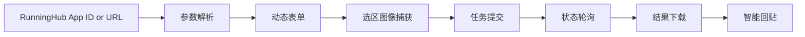

<div align="center">
  
  <h1>小T修图助手</h1>
  <p>RunningHub Photoshop Plugin</p>
  <p>把 RunningHub AI 工作流直接放进 Photoshop 的 UXP 插件。自动解析参数、执行任务、下载结果，并回贴到当前画布。</p>
  <p>
    
    
    
    
  </p>
</div>

<p align="center">
  <a href="#quick-start">快速上手</a> ·
  <a href="#feature-map">功能一览</a> ·
  <a href="#workflow">工作流</a> ·
  <a href="#integration">集成细节</a> ·
  <a href="#data-privacy">数据与隐私</a> ·
  <a href="#development">开发与调试</a>
</p>

> 在 Photoshop 内完成 RunningHub AI 应用的解析、参数填写、任务执行与结果回贴，适合高频、可复用、追求效率的修图场景。

<a name="specs"></a>
## 关键规格 / Specs

| 项目 | 值 |
| --- | --- |
| Host | Photoshop (UXP Manifest v5) |
| Min Photoshop | 23.0 |
| Version | V2.2.0 |

<a name="highlights"></a>
## 亮点 / Highlights
- 一键接入 RunningHub 应用，自动解析参数并生成动态表单
- 图像参数可直接从 PS 选区获取，支持预览与清除
- 提示词模板一键插入，适合高频重复任务
- 任务执行、轮询、下载与回贴一体化完成
- 智能回贴对齐主体位置，低置信度自动回退
- 打赏弹窗支持静态二维码展示与加载状态提示，提升小面板场景可用性
- 内置常用修图工具箱，启动即生成环境诊断报告

<a name="use-cases"></a>
## 适用场景 / Use Cases
- 将 RunningHub AI 应用嵌入 PS 修图流程
- 在 PS 内完成参数配置、任务提交与结果回贴
- 需要模板化提示词与快速试错的场景

<a name="quick-start"></a>
## 快速上手 / Quick Start
1. 安装：使用 Adobe UXP Developer Tool 添加插件，选择 `manifest.json`
2. 启动：在 Photoshop 中打开 “插件面板 -> 小T修图助手”
3. 配置：在 “设置” 保存 RunningHub API Key 并点击测试
4. 解析应用：输入 RunningHub 应用 ID 或 URL -> 解析 -> 保存到工作台
5. 运行任务：选择应用，捕获选区图像，填写参数，点击 “开始运行”
6. 查看结果：日志区查看进度，结果自动下载并回贴到当前文档

<a name="feature-map"></a>
## 功能一览 / Feature Map

| 模块 | 亮点 | 典型用途 |
| --- | --- | --- |
| Workspace | 动态参数表单、图像取样、模板插入 | 解析应用并执行任务 |
| Tools | 观察层、盖印、高斯模糊、锐化等 | 高频修图操作快捷入口 |
| Settings | API Key、应用管理、模板管理 | 初始配置与维护 |
| Diagnostics | 启动诊断、报告导出 | 环境与依赖排查 |

<details>
<summary><strong>Workspace 细节</strong></summary>

- 应用选择器：搜索、刷新与快速切换
- 动态参数：图像、文本、数字、选择、布尔等控件自动生成
- 图像输入：从 PS 选区获取，支持预览与清除
- 提示词模板：输入框可唤起模板面板
- 上传分辨率：无限制 / 4k / 2k / 1k 以缩短上传时间
- 回贴策略：普通(居中填满) 与 智能(主体对齐)
- 运行日志：支持复制与清空

</details>

<details>
<summary><strong>Tools 细节</strong></summary>

- 黑白观察层：创建黑白 + 曲线观察组
- 中性灰图层：50% 灰 + 柔光，用于加深减淡
- 盖印图层：等同 Ctrl+Alt+Shift+E
- 高斯模糊：调用原生对话框
- 锐化：调用智能锐化对话框
- 高反差保留：调用原生对话框
- 内容识别填充：需先建立选区

</details>

<details>
<summary><strong>Settings 细节</strong></summary>

- API Key：保存、显示与测试 RunningHub API Key
- 应用管理：解析、保存、编辑、删除，重复 ID 自动标记
- 解析调试：读取最近一次解析的 Debug 信息
- 提示词模板：新增、覆盖同名、删除模板
- 高级设置：轮询间隔(1-15s) 与超时(10-600s)
- 环境诊断：手动运行并查看摘要

</details>

<a name="workflow"></a>
## 工作流 / Workflow



<a name="integration"></a>
## 集成细节 / Integration

### RunningHub 解析与任务
- 解析端点：优先 `/api/webapp/apiCallDemo`，失败回退 `/uc/openapi/app` 等
- 参数规范化：自动推断类型、解析选项、优化标签
- AI App / Legacy 双通道：优先 AI App API，失败回退 Legacy
- 图片上传：支持 v2/legacy 上传接口，可按设置自动缩放
- 任务轮询：依据状态与超时配置轮询，失败有清晰提示

### 图像处理与回贴
- 选区捕获：有选区时裁剪导出，无选区时导出整幅画面
- 结果回贴：基于选区边界放置与对齐
- 智能对齐：基于内容分析计算缩放与偏移，低分数自动降级
- 兼容处理：异常或超时回退到普通回贴

<a name="data-privacy"></a>
## 数据与隐私 / Data & Privacy

| 类型 | 内容 |
| --- | --- |
| LocalStorage | `rh_api_key`, `rh_ai_apps_v2`, `rh_prompt_templates`, `rh_settings` |
| Parse Debug | `rh_last_parse_debug` |
| 网络请求 | 仅访问 RunningHub 域名 |

<a name="permissions"></a>
## 权限说明 / Permissions

| 权限 | 用途 |
| --- | --- |
| `localFileSystem: fullAccess` | 临时文件与诊断报告读写 |
| `launchProcess` | 打开外部链接(如打赏二维码) |
| `network` | 访问 RunningHub API 与资源域名 |

<a name="structure"></a>
## 项目结构 / Project Structure

```text
.
├─ index.html             # 面板 UI 结构
├─ index.js               # 启动与控制器初始化
├─ style.css              # UI 样式
├─ src/
│  ├─ controllers/        # 工作台 / 设置 / 工具箱控制器
│  ├─ services/           # RunningHub API、PS 操作、存储逻辑
│  ├─ diagnostics/        # 环境诊断
│  └─ shared/             # 输入规范与 DOM 工具
└─ tools/                 # 辅助脚本
```

<a name="development"></a>
## 开发与调试 / Development
- 无需构建步骤，直接由 UXP Developer Tool 加载
- 推荐入口：`index.html`, `index.js`, `src/controllers`, `src/services`
- 日志查看：使用 UXP Developer Console
- 解析调试：设置页提供 “Load Parse Debug”

<a name="faq"></a>
## 常见问题 / FAQ

<details>
<summary><strong>API Key 无效怎么办</strong></summary>

确认 RunningHub 后台生成的 API Key，账户余额与权限正常。

</details>

<details>
<summary><strong>解析失败怎么办</strong></summary>

尝试不同应用 URL/ID，或查看 Parse Debug 信息。

</details>

<details>
<summary><strong>任务超时怎么办</strong></summary>

提高超时设置或稍后在 RunningHub 任务列表查看。

</details>

<details>
<summary><strong>智能回贴不理想</strong></summary>

切换为 “普通” 策略。

</details>

<details>
<summary><strong>内容识别填充不可用</strong></summary>

确保有有效选区。

</details>

<a name="roadmap"></a>
## 路线图 / Roadmap
- 失败场景的手动参数编辑器
- 更多 PS 工具与预设

<a name="version"></a>
## 版本 / Version
- 当前版本：`V2.2.0` (见 `manifest.json`)


<a name="release-2-2-0"></a>
## Release 2.2.0
- Moved upload resolution limit entry from workspace header to Settings > Advanced.
- Default upload resolution policy is now unlimited, with migration for existing settings.
- Added safer upload resize fallback and request timeout handling for task submission stability.
- Fixed modal input occlusion issue (input/select/textarea piercing above overlay).
- Removed log copy button from workspace toolbar (manual copy remains available).
<a name="license"></a>
## 许可 / License
- Apache-2.0

<a name="support"></a>
## 支持与反馈 / Support
- GitHub Issues 或联系 QQ: 1048855084

