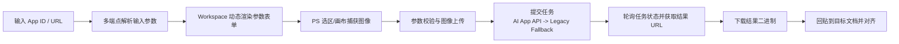
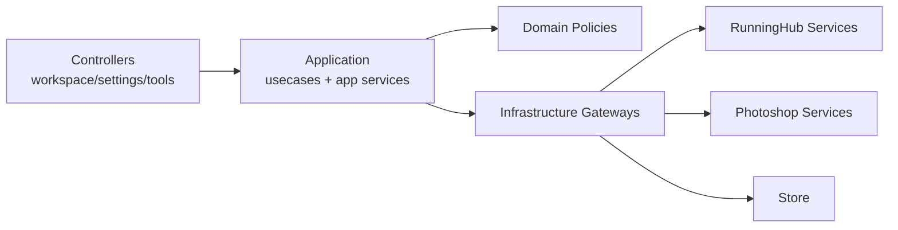

<div align="center">
  
  <h1>PixelRunner</h1>
  <p><strong>把 RunningHub AI 工作流直接塞进 Photoshop 面板。</strong></p>
  <p>从应用解析、参数填写、任务提交、结果下载到回贴，整条链路不离开 PS。</p>
  <p>
    
    
    
    
    
  </p>
</div>

<p align="center">
  
  
  
  
</p>

## 目录
- [项目定位](#项目定位)
- [功能总览（先看你能做什么）](#功能总览先看你能做什么)
- [完整工作流](#完整工作流)
- [功能细节](#功能细节)
- [稳定性与容错设计](#稳定性与容错设计)
- [技术实现（再讲怎么做到）](#技术实现再讲怎么做到)
- [安装与快速开始](#安装与快速开始)
- [开发与测试](#开发与测试)
- [项目结构](#项目结构)
- [数据与权限](#数据与权限)
- [FAQ](#faq)
- [License](#license)
- [Support](#support)

## 项目定位
PixelRunner 是一个 **Photoshop UXP 插件**，目标非常明确：

- 让 RunningHub 的 AI 工作流在 PS 内完成闭环，不再“网页和 PS 来回切”。
- 让高频修图流程可重复、可追踪、可扩展。
- 用工程化的方式处理真实生产问题：网络抖动、接口差异、任务超时、重复提交、回贴对齐偏差。

一句话概括：
> PixelRunner 不是一个“按钮集合”，而是一条可运行、可诊断、可维护的 AI 修图流水线。

## 功能总览（先看你能做什么）
| 模块 | 你能做什么 | 典型价值 |
| --- | --- | --- |
| Workspace | 选应用、填动态参数、捕获 PS 图像、提交任务、查看日志与任务摘要 | 主链路一站式完成 |
| Settings | API Key、应用解析与保存、模板管理、高级运行参数、诊断摘要 | 配置集中化、可复用 |
| Tools | 观察层、中性灰、盖印层、高斯模糊、锐化、高反差保留、内容识别填充、选择并遮住 | 高频修图动作一键化 |
| Diagnostics | 启动环境体检、解析调试摘要、诊断报告读取 | 问题排查可视化 |

### 一眼能记住的卖点
1. **真闭环**：从 RunningHub App 到最终回贴都在 Photoshop 内。
2. **真容错**：解析回退、提交双通道、上传多重回退、超时追踪恢复。
3. **真高频友好**：防抖防重、后台并发队列、任务摘要与日志联动。
4. **真工程化**：明确分层 + 依赖约束脚本 + 大量自动化测试。

## 完整工作流


## 功能细节
### 1) Workspace：主工作台
- **应用选择器（App Picker）**
  - 支持关键字过滤。
  - 当前应用高亮，支持快速切换和刷新。
  - 无应用时可直接跳转到 Settings 创建配置。
- **动态输入渲染**
  - 自动识别并渲染 `image / text / number / boolean / select`。
  - Prompt 类长文本支持模板注入、长度提示、粘贴保护。
  - 单字段输入渲染失败时自动降级 fallback 渲染，避免整页不可用。
- **图像输入联动 Photoshop**
  - 一键从当前选区或画布捕获图像。
  - 实时预览、支持清空与重采集。
  - 保存捕获上下文（文档 ID、捕获时间），用于后续精准回贴。
- **任务提交体验**
  - Run 按钮有清晰状态机：`IDLE -> SUBMITTING -> ACK`。
  - 支持后台队列执行，多任务可并发调度。
  - 任务摘要显示：运行中/排队/完成/失败/超时追踪数量。
- **运行日志**
  - 记录参数摘要、请求阶段、失败原因、回贴阶段。
  - Prompt 字段提交前自动记录长度与尾部预览，便于诊断“内容过长”问题。

### 2) Settings：配置中心
- **API Key 管理**
  - 本地保存，支持快速连通性测试。
  - Workspace 实时展示账号余额与 RH 币信息。
- **AI 应用解析与保存**
  - 输入 App ID 或 URL，自动解析参数结构。
  - 解析结果可保存为本地应用，支持编辑/删除/同步到 Workspace。
- **提示词模板管理**
  - 新增、覆盖、删除模板。
  - 支持 JSON 导入/导出（便于团队共享模板库）。
  - 支持多模板组合（上限控制）并进行长度校验。
- **高级参数**
  - 轮询间隔：`1-15s`
  - 任务超时：`10-600s`
  - 上传分辨率上限：`0 / 4096 / 2048 / 1024`
  - 上传自动重试：`0-5`
  - 云端任务并发：`1-100`
- **环境诊断读取**
  - 一键读取最近环境体检与解析调试摘要。
  - 直接在插件内看到可操作的诊断建议。

### 3) Tools：高频修图工具箱
- 图层辅助：
  - 黑白观察组（黑白 + 曲线）
  - 中性灰图层（50% 灰 + 柔光）
  - 盖印可见层（含兼容回退）
- 滤镜与修复：
  - 高斯模糊
  - 锐化（Smart Sharpen）
  - 高反差保留
  - 内容识别填充（要求已有选区）
- 合并操作：
  - 选择并遮住（菜单命令失败时自动 Action 回退，再次失败给出详细原因）

### 4) Diagnostics：环境体检与可观测性
- 启动阶段自动执行环境检查（Host/DOM/模块导出/网络/数据健康）。
- 报告支持：
  - 写入 `localStorage`
  - 写入 UXP Data Folder（JSON + TXT + latest 快照）
- 附带建议清单，帮助快速定位环境问题和依赖缺失。

## 稳定性与容错设计
| 机制 | 位置 | 作用 |
| --- | --- | --- |
| 多端点应用解析 | `src/services/runninghub-parser.js` | 主解析失败自动尝试 fallback 端点与多参数形式 |
| 任务提交双通道 | `submit-decision-strategy.js` | 优先 AI App API，失败自动回退 Legacy API |
| 上传弹性链路 | `upload-strategy.js` + `upload-edge-strategy.js` | 上传端点回退 + 指数退避重试 + 分辨率降级链 |
| 请求硬超时与取消 | `request-strategy.js` | 防止无响应请求拖死流程 |
| 轮询容错 | `runninghub-polling.js` | 识别 pending/failed 状态并稳态重试 |
| 防重复提交 | `application/services/run-guard.js` | 点击防抖 + 指纹去重 |
| 后台任务调度 | `application/services/job-scheduler.js` | 队列化执行与并发控制 |
| 超时追踪恢复 | `job-scheduler.js` + `run-workflow-controller.js` | 远端任务已创建时，本地超时后继续追踪 |
| 智能回贴降级 | `services/ps/place.js` + `alignment.js` | 智能对齐得分不足时自动回退普通策略 |

## 技术实现（再讲怎么做到）
### 架构分层


### 分层约束（硬规则）
- Controller 层禁止直接依赖 `services`。
- 必须通过 `application` / `infrastructure/gateways` 访问能力。
- 约束检查脚本：`scripts/check-controller-service-deps.js`。

### RunningHub 执行内核
`src/services/runninghub-runner/` 采用策略拆分，核心能力包括：

- 输入校验（必填、数值、布尔、图像）
- 文本/枚举/布尔 payload 规范化
- 图像上传（类型识别、尺寸缩放、失败重试、端点回退）
- AI App 提交与 Legacy 提交双通道决策
- 错误语义统一（错误码与可重试标记）
- 请求超时/取消控制

### RunningHub 解析内核
`src/services/runninghub-parser.js` + `src/services/runninghub-parser/*`

- 兼容多种返回结构与嵌套形态。
- 自动提取 `nodeInfoList`、推断参数类型、推断标签。
- 多候选输入阵列评分选择最佳解析结果。
- 记录 parse debug 到本地，支持 Settings 页面读取。

### Photoshop 回贴引擎
`src/services/ps/place.js` + `src/services/ps/alignment.js`

- 支持结果图自动放置与目标文档激活。
- 对齐模式内核支持 `normal / smart / smartEnhanced`。
- 智能模式进行内容分析、评分、阈值判断，低置信度自动降级。
- 支持回贴后几何修正与可选 mask 应用（智能模式）。

备注：
- 当前 Workspace 启动时会将策略同步为 `normal`（稳定优先）。
- `smart / smartEnhanced` 能力已在内核实现，可用于后续策略开放与兼容演进。

### 存储模型
主要本地键（`localStorage`）：

- `rh_api_key`
- `rh_ai_apps_v2`
- `rh_prompt_templates`
- `rh_settings`
- `rh_last_parse_debug`
- `rh_env_diagnostic_latest`

### 质量保障
- 自动化测试：`node --test`
- 依赖边界检查：`node scripts/check-controller-service-deps.js`
- 最近一次本地验证（2026-03-01）：
  - `node --test`：**347 passed, 0 failed**
  - 依赖边界检查：**passed**

## 安装与快速开始
1. 使用 Adobe UXP Developer Tool 加载本项目 `manifest.json`。
2. 在 Photoshop 打开插件面板 `PixelRunner`。
3. 进入 `Settings` 保存并测试 RunningHub API Key。
4. 输入 RunningHub App ID/URL，解析并保存应用。
5. 回到 `Workspace` 选择应用并填写参数（可捕获 PS 选区图像）。
6. 点击运行，等待结果自动下载并回贴到文档。

## 开发与测试
### 常用命令
```bash
node --test
node scripts/check-controller-service-deps.js
node --check index.js src/controllers/workspace-controller.js src/services/ps.js
```

### 开发建议
- 先改 `application` 和 `domain`，再接 UI。
- 新增网络链路时，同步补齐 runner 策略测试。
- 改 DOM ID 前先看 `workspace-init-controller` 和相关 contract test。

## 项目结构
```text
.
├── index.html / index.js / style.css
├── src/
│   ├── application/        # 用例编排与应用服务
│   ├── controllers/        # Workspace / Settings / Tools 控制器
│   ├── diagnostics/        # 环境诊断
│   ├── domain/             # 业务规则与策略约束
│   ├── infrastructure/     # Gateway 适配层
│   ├── services/           # RunningHub / Photoshop / Store 实现
│   └── shared/             # DOM / 输入 schema 等共享模块
├── scripts/               # 规则检查脚本
├── tests/                 # Node 测试
├── icons/
└── docs/
```

## 数据与权限
### Manifest 权限
- `localFileSystem: fullAccess`
- `launchProcess`: `http` / `https` / `file`
- `network`：
  - `https://www.runninghub.cn`
  - `https://runninghub.cn`
  - `https://rh-images.xiaoyaoyou.com`

### 隐私说明
- API Key 与配置默认只保存在本地存储中。
- 诊断报告优先用于本地排查，不会自动上传到第三方。

## FAQ
### 1. 为什么应用解析失败？
- 优先检查 API Key 是否有效。
- 尝试用 App ID 与完整 URL 各测一次。
- 在 Settings 中读取 Parse Debug，查看候选输入阵列与归一化结果。

### 2. 任务超时是不是就一定失败？
- 不一定。若远端任务已创建，本地会进入 `TIMEOUT_TRACKING` 继续轮询追踪。

### 3. 内容识别填充/选择并遮住无法运行？
- 先确认当前文档与选区状态。
- Photoshop 菜单命令不可用时，插件会尝试 Action 回退；仍失败会输出具体错误。

### 4. 提示词很长会怎样？
- Workspace 会给出长度预警（4000 字符阈值）。
- 输入框有硬上限保护，防止极端粘贴导致 UI 与请求异常。

## License
Apache-2.0

## Support
- GitHub Issues
- QQ: `1048855084`
