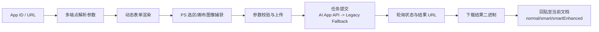
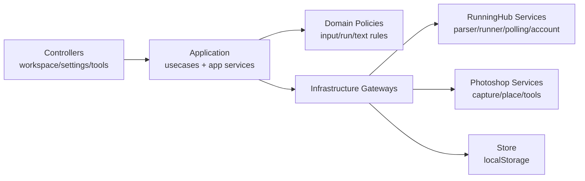

<div align="center">
  
  <h1>PixelRunner</h1>
  <p><strong>RunningHub × Photoshop (UXP) 一体化工作流插件</strong></p>
  <p>把“应用解析 → 参数填写 → 任务执行 → 结果回贴”压缩在同一个 Photoshop 面板中完成。</p>
  <p>
    
    
    
    
    
  </p>
</div>

<p align="center">
  
  
  
  
</p>

## 目录
- [项目定位](#项目定位)
- [核心优势](#核心优势)
- [功能地图](#功能地图)
- [快速开始](#快速开始)
- [完整工作流](#完整工作流)
- [稳定性与容错设计](#稳定性与容错设计)
- [架构设计](#架构设计)
- [关键模块说明](#关键模块说明)
- [开发与测试](#开发与测试)
- [数据与权限](#数据与权限)
- [FAQ](#faq)
- [License](#license)

## 项目定位
PixelRunner 面向两类高频场景：
- 在 Photoshop 内反复调用 RunningHub 应用进行批量修图/风格化
- 希望减少“复制参数、切网页、下载图片、拖回 PS”的流程损耗

插件的目标不是替代 Photoshop，而是把 AI 工作流嵌入你已有的 PS 操作链路，保留专业修图习惯，同时提升执行效率与稳定性。

## 核心优势
### 1. 真正的一体化闭环
- 从 RunningHub App 解析到结果回贴，全部在同一面板完成
- 图像输入可直接来自当前文档选区，无需手动导出中转
- 结果自动下载并回贴，减少重复文件操作

### 2. 面向生产的容错能力
- 应用解析多端点自动回退（主解析接口失败自动尝试 fallback）
- 任务提交支持 AI App API 与 Legacy API 双通道回退
- 上传支持分辨率候选链路、上传接口回退、指数退避重试
- 请求层统一超时与取消控制，避免“假死式等待”

### 3. 面向高频操作的交互设计
- Run Guard 防重复提交（双击防抖 + 指纹去重）
- 后台任务队列与并发调度（可配置并发数）
- 提示词模板支持单条插入和多条组合（上限控制）
- 运行日志和任务摘要可快速定位问题阶段

### 4. 可持续演进的工程结构
- 明确分层：`controllers -> application -> services`
- 通过脚本强制约束 controller 不直接依赖 services
- `runninghub-runner` 采用策略拆分，便于单测覆盖与增量扩展
- 启动环境诊断（Env Doctor）可输出报告，降低线上排障成本

## 功能地图
| 模块 | 你能做什么 | 典型价值 |
| --- | --- | --- |
| Workspace | 选择应用、动态参数填写、捕获图像、提交任务、查看日志 | 主工作流一次完成 |
| Settings | API Key 管理、应用解析与存储、模板管理、高级参数配置 | 配置集中化与可复用 |
| Tools | 观察层、中性灰、盖印层、高斯模糊、锐化、高反差保留、内容识别填充 | 高频修图动作快捷入口 |
| Diagnostics | 启动自检、读取解析调试信息、导出诊断摘要 | 快速定位环境与接口问题 |

### Workspace 特色
- 动态参数渲染：根据应用输入自动生成图像/文本/数值/布尔/枚举控件
- 图像输入联动：捕获选区后立即预览，可清除、可复用
- 回贴策略：`normal` / `smart` / `smartEnhanced`
- 任务摘要：实时展示运行、排队、成功、失败与超时跟踪数量

### Settings 特色
- API Key 测试：快速验证凭据状态与可用性
- 应用解析：支持 App ID / URL，解析结果可保存并回流工作台
- 模板管理：新增、覆盖、删除、导入/导出 JSON
- 高级参数：
  - 轮询间隔（1-15s）
  - 任务超时（10-600s）
  - 上传分辨率上限（无限制 / 4k / 2k / 1k）
  - 上传重试次数（0-5）
  - 云端并发数（1-100）

### Tools 特色
- 图层辅助：观察组、中性灰、盖印层
- 滤镜/修复：高斯模糊、锐化、高反差保留、内容识别填充
- 对原生能力友好：优先调用 Photoshop 原生命令并保留交互体验

## 快速开始
1. 使用 Adobe UXP Developer Tool 加载 `manifest.json`
2. 在 Photoshop 打开插件面板 `PixelRunner`
3. 在 `Settings` 保存并测试 RunningHub API Key
4. 输入 RunningHub 应用 ID 或 URL，解析并保存应用
5. 回到 `Workspace`，选择应用并按需捕获图像输入
6. 点击运行，等待任务完成并自动回贴结果

## 完整工作流


## 稳定性与容错设计
| 机制 | 位置 | 作用 |
| --- | --- | --- |
| 解析多端点回退 | `src/services/runninghub-parser.js` | 主解析失败时自动尝试备用端点，提高兼容性 |
| 双通道任务提交 | `src/services/runninghub-runner/submit-decision-strategy.js` | 优先 AI App API，失败自动回退 Legacy |
| 上传弹性链路 | `upload-edge-strategy.js` + `upload-strategy.js` | 分辨率候选链路 + 上传接口回退 + 指数退避重试 |
| 请求超时与取消 | `request-strategy.js` | 防止请求无响应导致流程卡死 |
| 轮询容错 | `runninghub-polling.js` | 识别 pending/failed 状态并给出明确分支 |
| 重复提交防护 | `application/services/run-guard.js` | 双击防抖 + 任务指纹去重 |
| 后台任务调度 | `application/services/job-scheduler.js` | 队列化执行与并发控制 |
| 超时恢复跟踪 | `job-scheduler.js` + `run-workflow-controller.js` | 远端已建任务但本地超时时可继续跟踪 |
| 智能回贴降级 | `services/ps/place.js` + `alignment.js` | 智能对齐低置信度自动回退普通策略 |
| 启动环境诊断 | `diagnostics/ps-env-doctor.js` | 自动产出诊断报告，减少排障时间 |

## 架构设计


### 分层约束（强制）
- `src/controllers/**/*.js` 不允许直接依赖 `src/services/*`
- 控制层能力需经由 `application` 或 `infrastructure/gateways`
- 检查命令：`node scripts/check-controller-service-deps.js`

## 关键模块说明
### 1) RunningHub Runner（策略化执行核心）
目录：`src/services/runninghub-runner/`

- `input-validation-strategy`：输入完整性和类型校验
- `payload-strategy`：参数转换、布尔/枚举/文本处理
- `upload-strategy`：图像标准化、压缩/缩放、重试上传
- `task-request-strategy`：任务请求体构建
- `submit-decision-strategy`：AI App 与 Legacy 提交决策
- `task-error-strategy` + `error-shape-strategy`：统一错误语义
- `request-strategy` + `request-executor-strategy`：超时、取消、统一请求执行

### 2) Photoshop Service
- `ps/capture.js`：选区捕获与 PNG 导出
- `ps/place.js`：结果回贴主流程
- `ps/alignment.js`：普通/智能/增强智能对齐与几何修正
- `ps/tools.js`：工具箱按钮动作封装
- `ps.js`：稳定 facade 导出

### 3) Diagnostics
- 启动阶段执行环境体检
- 检查 DOM、模块导出、网络连通、数据健康
- 输出 JSON/TXT 报告到 `localStorage` 与 UXP Data Folder

## 开发与测试
无需构建步骤，直接通过 UXP Developer Tool 调试。

### 常用命令
```bash
node --test
node scripts/check-controller-service-deps.js
node --check index.js src/controllers/workspace-controller.js src/services/ps.js
```

### 测试分布（当前）
- `tests/controllers`: 34
- `tests/services`: 22
- `tests/application`: 20
- `tests/domain`: 3
- `tests/scripts`: 1
- 合计：80

### 推荐发布前最小检查
1. `node scripts/check-controller-service-deps.js`
2. `node --test`
3. 手工验证主链路：解析应用 -> 运行任务 -> 结果回贴

## 项目结构
```text
.
├─ index.html / index.js / style.css
├─ src/
│  ├─ application/        # 用例编排与应用服务
│  ├─ controllers/        # Workspace / Settings / Tools 控制器
│  ├─ diagnostics/        # 环境诊断
│  ├─ domain/             # 业务规则与策略约束
│  ├─ infrastructure/     # gateway 适配层
│  ├─ services/           # RunningHub / Photoshop / Store 实现
│  └─ shared/             # DOM / schema 公共模块
├─ scripts/               # 规则检查脚本
└─ tests/                 # Node 测试
```

## 数据与权限
### 本地存储（localStorage）
- `rh_api_key`
- `rh_ai_apps_v2`
- `rh_prompt_templates`
- `rh_settings`
- `rh_last_parse_debug`
- `rh_env_diagnostic_latest`

### UXP 权限（manifest）
- `localFileSystem: fullAccess`
- `launchProcess`（`http` / `https` / `file`）
- `network`
  - `https://www.runninghub.cn`
  - `https://runninghub.cn`
  - `https://rh-images.xiaoyaoyou.com`

## FAQ
### Q1: API Key 测试失败怎么办？
- 确认 Key 是否有效、账号是否有权限或余额
- 在 Settings 中重新测试并查看日志提示

### Q2: 应用解析不到参数怎么办？
- 尝试使用 App ID 和完整 URL 各测试一次
- 在 Settings 读取 Parse Debug 结果定位字段结构

### Q3: 任务超时是否会直接丢失？
- 不一定。对于远端已创建任务，本地支持超时后继续跟踪（timeout tracking）

### Q4: 智能回贴不理想怎么办？
- 可切换回 `normal`，或在输入图像质量和构图上做约束

## License
Apache-2.0

## Support
- GitHub Issues
- QQ: `1048855084`
