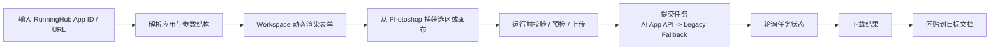

<div align="center">
  
  <h1>PixelRunner</h1>
  <p><strong>把 RunningHub 的 AI 工作流真正带进 Photoshop。</strong></p>
  <p>从应用解析、参数填写、图像捕获、任务提交，到结果下载和回贴，尽量把整条链路留在 PS 面板里完成。</p>
  <p>
    
    
    
    
    
  </p>
  <p><strong>GitHub 项目名：</strong>PixelRunner　|　<strong>Photoshop 面板名：</strong>小T修图助手</p>
</div>

<p align="center">
  
  
  
  
</p>

## 项目简介

PixelRunner 是一个面向 **Photoshop + RunningHub** 的 UXP 插件。

它不是简单把几个按钮塞进面板，而是把一条真实可用的 AI 修图链路做成产品化工作流：

- 在插件内解析 RunningHub App ID / URL
- 自动渲染参数表单，支持文本、数字、布尔、枚举和图片输入
- 直接从 Photoshop 当前文档或选区捕获图像
- 进行上传预检、自动压缩、上传回退与重试
- 提交云端任务，后台排队、并发调度、状态轮询
- 下载结果并回贴到目标文档
- 在失败、超时、取消、接口差异等情况下尽量保留可诊断性

如果你经常在 RunningHub 网页和 Photoshop 之间来回切，这个项目就是为了解决这件事。

## 这版 README 重点展示什么

相较于传统“功能清单式”介绍，这份 README 更强调当前版本真正已经具备的能力：

- 更完整的 Workspace 工作流
- 更工程化的 Settings 能力
- 更可用的日志、诊断、取消与超时跟踪
- 更稳定的上传链路和任务调度
- 更适合 GitHub 首页阅读的结构

## 核心亮点

### 1. 真正在 Photoshop 内闭环

- 应用解析、参数填写、图像捕获、运行和回贴都在面板里完成
- 不需要手工导出图片再回网页上传
- 对高频重复任务更友好

### 2. 不是“能跑一次”，而是“尽量稳定地跑”

- AI App API 失败时可自动回退到 Legacy 提交链路
- 上传前会做体积预检，并支持自动压缩、重试和端点回退
- 任务超时后不会立刻判死，已创建的远端任务会继续进入 `TIMEOUT_TRACKING`
- 支持本地取消和远端取消协同

### 3. 更适合生产环境的面板体验

- 应用、模板、API Key、高级设置集中在一个配置中心
- 工作区有运行日志、任务摘要、重复提交保护、并发调度
- 工具箱保留常用 Photoshop 高频操作入口

### 4. 代码层面是工程化的，不是拼脚本

- UI / Application / Domain / Infrastructure / Services 分层明确
- 有依赖边界检查脚本，约束 controller 不直接依赖 services
- 有较完整的 Node 侧自动化测试覆盖核心策略和用例

## 你现在能用它做什么

| 模块 | 当前能力 | 适合场景 |
| --- | --- | --- |
| Workspace | 选择应用、动态参数输入、捕获图像、运行任务、查看日志、取消任务、任务摘要 | 日常跑图、批量高频修图 |
| Settings | API Key、应用解析与保存、模板管理、高级设置、环境诊断摘要 | 初始化配置、团队复用、排障 |
| Tools | 黑白观察组、中性灰、盖印层、高斯模糊、锐化、高反差保留、内容识别填充、选择并遮住 | PS 内高频辅助操作 |
| Diagnostics | 启动环境体检、解析调试摘要、本地诊断报告 | 解析失败、运行异常、环境问题定位 |

## 典型工作流


```mermaid
flowchart LR
  A[输入 RunningHub App ID / URL] --> B[解析应用与参数结构]
  B --> C[Workspace 动态渲染表单]
  C --> D[从 Photoshop 捕获选区或画布]
  D --> E[运行前校验 / 预检 / 上传]
  E --> F[提交任务<br/>AI App API -> Legacy Fallback]
  F --> G[轮询任务状态]
  G --> H[下载结果]
  H --> I[回贴到目标文档]
```

## 功能设计概览

### Workspace

这是主工作台，也是当前版本变化最多、最值得展示的部分。

- 应用选择器支持搜索、切换、刷新与空状态引导
- 动态输入渲染支持 `image / text / number / boolean / select`
- Prompt 类字段支持模板注入、长度提示、长文本保护
- 图片输入支持从 Photoshop 当前上下文直接捕获
- Run 按钮有提交保护与去重逻辑，避免重复点击
- 后台任务支持排队、并发执行、取消、状态摘要刷新
- 日志会记录关键阶段，方便定位失败点

### Settings

Settings 不只是“存一个 API Key”，而是整个插件的配置中心。

- 保存并测试 RunningHub API Key
- 通过 App ID 或 URL 解析 RunningHub 应用
- 将解析结果保存到工作台复用
- 管理提示词模板，支持 JSON 导入 / 导出
- 配置轮询间隔、任务超时、上传重试、上传体积阈值、云端并发数
- 读取最近环境诊断与解析调试摘要

### Tools

Tools 保留了高频修图辅助能力，目的是减少你在主业务流之外的重复操作。

- 黑白观察组
- 中性灰图层
- 盖印可见层
- 高斯模糊
- Smart Sharpen
- 高反差保留
- Content-Aware Fill
- Select and Mask

### Diagnostics

这是这类插件很容易被忽略，但对真实使用最重要的部分之一。

- 启动阶段自动做环境检查
- 解析失败时保留 parse debug 摘要
- 报告可写入 `localStorage` 和 UXP Data Folder
- 有助于排查 API、结构变化、宿主环境和权限问题

## 当前版本值得特别提的能力变化

如果你是基于旧版 README 认识这个项目，这一版更值得关注下面这些方向：

- Workspace 已经不只是“运行按钮”，而是完整任务面板
- 任务队列、并发控制、取消和超时跟踪已经纳入主流程
- 上传链路加入了预检、自动压缩、重试和回退策略
- 模板和应用管理能力更完整，更适合长期使用
- 环境诊断和 parse debug 能力更成熟，方便定位异常
- UI 和交互体验做过一轮统一与性能优化，不再只是功能拼装

## 稳定性与容错思路

项目的核心思路不是假设外部环境永远稳定，而是默认它会抖动、超时、变化。

| 机制 | 位置 | 作用 |
| --- | --- | --- |
| 多端点应用解析 | `src/services/runninghub-parser.js` | 主解析失败时尝试 fallback 结构与候选路径 |
| 双通道任务提交 | `src/services/runninghub-runner/submit-decision-strategy.js` | 优先 AI App API，失败时自动尝试 Legacy |
| 上传预检与回退 | `src/services/runninghub-runner/upload-strategy.js` | 上传前拦截超限图片，并执行重试 / 回退 / 降级 |
| 请求超时与取消 | `src/services/runninghub-runner/request-strategy.js` | 统一超时与取消语义，避免请求拖死流程 |
| 后台任务调度 | `src/application/services/job-scheduler.js` | 管理排队、并发、取消和状态推进 |
| 超时跟踪恢复 | `src/application/services/job-scheduler.js` | 本地超时后继续跟踪已创建的远端任务 |
| 智能回贴降级 | `src/services/ps/place.js` | 对齐失败或置信度不足时回退到更稳妥策略 |

## 安装与快速开始

### 运行环境

- Adobe Photoshop `23+`
- UXP Manifest `v5`
- 可访问 RunningHub 对应网络域名
- 有可用的 RunningHub API Key

### 快速开始

1. 使用 Adobe UXP Developer Tool 加载项目根目录下的 `manifest.json`
2. 在 Photoshop 中打开面板 `小T修图助手`
3. 进入 `Settings` 保存并测试 API Key
4. 输入 RunningHub App ID 或 URL，完成解析并保存到工作台
5. 回到 `Workspace` 选择应用、填写参数或捕获图像
6. 点击运行，等待结果自动下载并回贴到文档

### 必要权限

当前 `manifest.json` 中声明了以下关键权限：

- `localFileSystem: fullAccess`
- `launchProcess`: `http` / `https` / `file`
- `network`:
  - `https://www.runninghub.cn`
  - `https://runninghub.cn`
  - `https://rh-images.xiaoyaoyou.com`

## 开发

### 常用命令

```bash
node --test
node scripts/check-controller-service-deps.js
node --check index.js src/controllers/workspace-controller.js src/services/ps.js
```

### 推荐阅读顺序

如果你是第一次接手这个仓库，建议按这个顺序看：

1. `index.html` 和 `style.css`，先了解面板结构与页面分区
2. `src/controllers/`，理解 Workspace / Settings / Tools 的入口行为
3. `src/application/`，看用例编排和任务调度
4. `src/services/runninghub-runner/`，看解析、上传、提交、轮询等核心策略
5. `src/services/ps/`，看 Photoshop 侧捕获和回贴

### 当前验证情况

- `node --test` 当前共跑出 `372` 个测试
- 本地最新执行结果为 `371 passed / 1 failed`
- 失败项是 `tests/modules/tools/tools-module.test.js`
- 失败原因是缺少模块：`src/modules/tools`

这意味着 README 描述基于当前主干代码能力整理，但仓库此刻并不是“零失败”测试状态。

## 项目结构

```text
.
├── index.html / index.js / style.css
├── src/
│   ├── application/        # 用例编排、任务调度、应用服务
│   ├── controllers/        # Workspace / Settings / Tools 控制器
│   ├── diagnostics/        # 环境体检与报告摘要
│   ├── domain/             # 领域规则与策略约束
│   ├── infrastructure/     # Gateway 适配层
│   ├── services/           # RunningHub / Photoshop / Store 实现
│   └── shared/             # 通用 DOM / schema / helper
├── tests/                  # Node 自动化测试
├── scripts/                # 规则检查脚本
├── docs/                   # 交接、执行方案、知识库
├── pages/                  # 本地帮助页 / 展示页
└── icons/
```

## 文档入口

- [新手问题知识库](docs/PixelRunner-%E6%96%B0%E6%89%8B%E9%97%AE%E9%A2%98%E7%9F%A5%E8%AF%86%E5%BA%93.md)
- [UI 与性能优化执行方案](docs/ui-performance-execution-plan.md)
- [工作流取消机制交接说明](docs/workflow-cancel-handoff.md)
- [RunningHub 快速上手页](pages/runninghub-guide.html)

## FAQ

### 这个项目名和面板名为什么不一样？

- 仓库名 / README 名：`PixelRunner`
- Photoshop 中显示的插件名：`小T修图助手`
- Workspace 顶部文案：`RunningHub AI 助手`

这是同一个插件的三个名字，不是三个不同项目。

### 适合什么用户？

- 经常在 Photoshop 里做 AI 修图或图生图的人
- 需要反复运行同类 RunningHub 应用的人
- 希望把流程沉淀到面板，而不是靠网页手工操作的人

### 现在最核心的设计目标是什么？

不是追求“功能越多越好”，而是让 RunningHub 到 Photoshop 的这一段链路更短、更稳、更容易排查。

## License

Apache-2.0

## Support

- GitHub Issues
- QQ: `1048855084`
