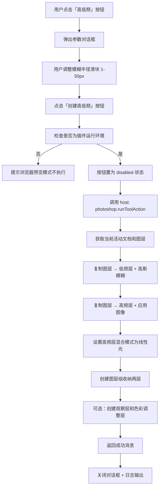

# 高低频（Frequency Separation）快捷入口实现计划（增强版）

## 一、功能概述

在 PixelRunner 的工具箱面板中新增「高低频」工具卡片，点击后弹出参数配置对话框，用户可调整模糊半径并预览效果，确认后一键执行完整的高低频分离操作。

## 二、完整的高低频图层结构

```
📁 高低频（图层组）
├── 📄 观察层（可选，黑白调整层，用于辅助观察纹理）
├── 📄 高频（纹理层）
│   ├── 混合模式：线性光
│   └── 内容：原图 - 低频（应用图像/减去）
├── 📄 低频（颜色层）
│   └── 内容：高斯模糊后的原图
├── 📄 色彩平衡（可选，调整层，剪贴到低频层）
├── 📄 曲线（可选，调整层，剪贴到低频层）
└── 📄 色相/饱和度（可选，调整层，剪贴到低频层）
```

### 各图层说明

| 图层 | 作用 | 说明 |
|------|------|------|
| **低频层** | 存储颜色和光影信息 | 原图高斯模糊，去除纹理细节 |
| **高频层** | 存储纹理和细节 | 原图减去低频层，混合模式设为线性光 |
| **观察层** | 辅助观察纹理效果 | 黑白调整层，可开关 |
| **色彩调整层** | 调色 | 曲线/色彩平衡/色相饱和度，剪贴到低频层 |

## 三、交互流程



## 四、涉及文件清单

| 文件 | 修改内容 |
|------|----------|
| `PixelRunnerV2.4.0/app.html` | 1. 在「图层辅助」分类中新增高低频工具项<br>2. 新增高低频参数对话框（`freqSepModal`） |
| `PixelRunnerV2.4.0/app.css` | 新增高低频对话框专用样式（`.freq-sep-modal-card`、`.freq-sep-slider-field` 等） |
| `PixelRunnerV2.4.0/src/host/photoshop/tool-actions.js` | 新增 `frequencySeparation` case，实现完整的高低频分离逻辑 |
| `PixelRunnerV2.4.0/src/webview/ui.js` | 1. 新增 `bindFreqSepActions()` 函数绑定对话框事件<br>2. 在 `toolConfigs` 中注册按钮（改为打开对话框） |
| `PixelRunnerV2.4.0/src/webview/main.js` | 在 DOMContentLoaded 中调用 `bindFreqSepActions()` |

## 五、详细实现

### 5.1 HTML 修改（app.html）

#### 5.1.1 工具卡片

在「图层辅助」分类中新增：

```html
<article class="tool-item">
  <div>
    <h4>高低频</h4>
    <p>分离为纹理层和颜色层，便于精修。</p>
  </div>
  <button id="btnFreqSep" class="mini-btn" type="button">创建</button>
</article>
```

同时将「图层辅助」的 `status-chip` 从 `2 项预置` 更新为 `3 项预置`。

#### 5.1.2 参数对话框

在 `</body>` 前新增模态对话框：

```html
<div id="freqSepModal" class="overlay-modal">
  <div id="freqSepBackdrop" class="overlay-backdrop"></div>
  <section class="overlay-card freq-sep-modal-card">
    <div class="card-head">
      <div>
        <p class="card-kicker">工具箱</p>
        <h3 class="card-title">高低频分离</h3>
      </div>
      <button id="freqSepModalClose" class="mini-btn" type="button">关闭</button>
    </div>

    <div class="freq-sep-description">
      <p class="subtle-note">将当前图层分离为低频（颜色/光影）和高频（纹理/细节），便于分别精修。</p>
    </div>

    <div class="freq-sep-params">
      <label class="field freq-sep-slider-field">
        <span class="freq-sep-param-line">
          <span class="field-label">模糊半径</span>
          <span id="freqSepRadiusValue" class="freq-sep-param-value">10</span>
          <span class="freq-sep-unit">px</span>
        </span>
        <input id="freqSepRadiusInput" class="field-input" type="range" min="1" max="50" step="1" value="10" />
      </label>
    </div>

    <div class="freq-sep-layer-options">
      <span class="field-label">附加图层</span>
      <label class="freq-sep-check-field">
        <input id="freqSepObserverToggle" type="checkbox" checked />
        <span>创建黑白观察层</span>
      </label>
      <label class="freq-sep-check-field">
        <input id="freqSepColorAdjustToggle" type="checkbox" checked />
        <span>创建色彩调整层组（曲线 + 色彩平衡 + 色相饱和度）</span>
      </label>
    </div>

    <div class="freq-sep-preview-hint">
      <p class="subtle-note">提示：模糊半径越大，低频层保留的颜色信息越多，高频层提取的纹理越少。建议值 5-15px。</p>
    </div>

    <div class="action-row freq-sep-actions">
      <button id="btnFreqSepCancel" class="secondary-btn" type="button">取消</button>
      <button id="btnFreqSepApply" class="primary-btn" type="button">创建高低频</button>
    </div>
  </section>
</div>
```

### 5.2 CSS 样式（app.css）

```css
.freq-sep-modal-card {
  width: min(92vw, 480px);
}

.freq-sep-description {
  padding: 0 2px;
}

.freq-sep-params {
  display: flex;
  flex-direction: column;
  gap: 6px;
  padding: 8px 10px;
  background: rgba(255, 255, 255, 0.03);
  border-radius: 10px;
}

.freq-sep-slider-field {
  gap: 4px;
}

.freq-sep-param-line {
  display: flex;
  align-items: center;
  gap: 6px;
}

.freq-sep-param-value {
  font-size: 13px;
  font-weight: 700;
  color: var(--accent);
  min-width: 24px;
  text-align: right;
}

.freq-sep-unit {
  font-size: 10px;
  color: var(--muted);
}

.freq-sep-layer-options {
  display: flex;
  flex-direction: column;
  gap: 4px;
  padding: 8px 10px;
  background: rgba(255, 255, 255, 0.03);
  border-radius: 10px;
}

.freq-sep-check-field {
  display: flex;
  align-items: center;
  gap: 6px;
  font-size: 12px;
  cursor: pointer;
}

.freq-sep-check-field input[type="checkbox"] {
  margin: 0;
}

.freq-sep-preview-hint {
  padding: 0 2px;
}

.freq-sep-actions {
  display: flex;
  gap: 8px;
  justify-content: flex-end;
}
```

### 5.3 后端逻辑（tool-actions.js）

在 `runModalToolAction()` 的 `switch` 中新增 `case "frequencySeparation"`：

**核心步骤：**

1. 获取当前活动文档和活动图层
2. 记录当前活动图层的引用（原始图层）
3. **创建低频层**：
   - 复制原始图层 → 命名为「低频」
   - 对低频层应用高斯模糊（半径 = payload.blurRadius，默认 10）
4. **创建高频层**：
   - 再次复制原始图层 → 命名为「高频」
   - 将高频层移到图层最上方
   - 对高频层执行「应用图像」操作：
     - 图层：低频层
     - 混合模式：减去
     - 缩放：2
     - 补偿：128
   - 将高频层混合模式设为「线性光」
5. **创建图层组**：
   - 创建图层组「高低频」
   - 将低频层和高频层移入组中
6. **可选：创建观察层**（payload.createObserver）
   - 在组内最上方创建黑白调整层「观察层」
7. **可选：创建色彩调整层组**（payload.createColorAdjust）
   - 在组内创建曲线调整层「曲线」，剪贴到低频层
   - 创建色彩平衡调整层「色彩平衡」，剪贴到低频层
   - 创建色相/饱和度调整层「色相/饱和度」，剪贴到低频层

**需要新增的辅助函数：**

```javascript
async function applyImageSubtract(action, sourceLayerId, scale = 2, offset = 128) {
  await action.batchPlay([{
    _obj: "applyImage",
    with: { _ref: "layer", _id: sourceLayerId },
    blending: { _enum: "blendMode", _value: "subtract" },
    scale,
    offset
  }], {});
}

async function createLayerGroup(action, name, fromLayerId, toLayerId) {
  await action.batchPlay([{
    _obj: "make",
    _target: [{ _ref: "layerSection" }],
    using: {
      _obj: "layerSection",
      name,
      from: { _ref: "layer", _id: fromLayerId },
      to: { _ref: "layer", _id: toLayerId }
    }
  }], {});
}

async function createClipAdjustmentLayer(action, layerName, adjustmentObj, clipToLayerId) {
  // 创建调整层并设置剪贴蒙版
}
```

### 5.4 前端注册（ui.js）

#### 5.4.1 修改 toolConfigs

将 `btnFreqSep` 的配置改为打开对话框而非直接执行：

```javascript
{ id: "btnFreqSep", type: "openModal", modalId: "freqSepModal" }
```

#### 5.4.2 新增 bindFreqSepActions()

```javascript
function bindFreqSepActions() {
  const runtime = modules.runtime;
  const modal = runtime.getById("freqSepModal");
  const backdrop = runtime.getById("freqSepBackdrop");
  const closeBtn = runtime.getById("freqSepModalClose");
  const cancelBtn = runtime.getById("btnFreqSepCancel");
  const applyBtn = runtime.getById("btnFreqSepApply");
  const radiusInput = runtime.getById("freqSepRadiusInput");
  const radiusValue = runtime.getById("freqSepRadiusValue");
  const observerToggle = runtime.getById("freqSepObserverToggle");
  const colorAdjustToggle = runtime.getById("freqSepColorAdjustToggle");

  // 更新半径显示
  if (radiusInput && radiusValue) {
    radiusInput.addEventListener("input", () => {
      radiusValue.textContent = radiusInput.value;
    });
  }

  // 打开对话框
  const openModal = () => {
    modules.workspace.setModalOpen("freqSepModal", true);
  };

  const closeModal = () => {
    modules.workspace.setModalOpen("freqSepModal", false);
  };

  // 关闭事件
  if (closeBtn) closeBtn.addEventListener("click", closeModal);
  if (cancelBtn) cancelBtn.addEventListener("click", closeModal);
  if (backdrop) {
    backdrop.addEventListener("click", (e) => {
      if (e.target === backdrop) closeModal();
    });
  }

  // 执行高低频
  if (applyBtn) {
    applyBtn.addEventListener("click", async () => {
      if (!runtime.isPluginRuntime()) {
        logToWorkspace("浏览器预览模式下不会执行工具动作", "info");
        return;
      }

      const blurRadius = parseInt(radiusInput?.value || "10", 10);
      const createObserver = observerToggle?.checked ?? true;
      const createColorAdjust = colorAdjustToggle?.checked ?? true;

      applyBtn.disabled = true;
      logToWorkspace("正在创建高低频分离...", "info");

      try {
        const result = await runtime.callHost("photoshop.runToolAction", [{
          action: "frequencySeparation",
          blurRadius,
          createObserver,
          createColorAdjust
        }], { timeoutMs: 60000 });

        logToWorkspace(result?.message || "已创建高低频分离图层组", "success");
        closeModal();
      } catch (error) {
        logToWorkspace(`高低频执行失败：${error.message}`, "error");
      } finally {
        applyBtn.disabled = false;
      }
    });
  }

  // 暴露 openModal 给 toolConfigs 使用
  return { openModal };
}
```

#### 5.4.3 修改 toolConfigs 处理逻辑

在 `bindToolActions()` 中，对于 `type === "openModal"` 的配置，绑定点击事件为打开对应的模态对话框。

### 5.5 main.js 修改

在 `DOMContentLoaded` 中调用 `modules.ui.bindFreqSepActions()`。

## 六、注意事项

1. 应用图像操作需要获取低频层的 layer ID（通过 batchPlay 返回结果获取）
2. 图层组创建需要确保图层顺序正确（低频在下，高频在上）
3. 色彩调整层需要使用剪贴蒙版（clip to layer）关联到低频层
4. 如果当前文档没有活动图层，应给出友好提示
5. 考虑 8bit/16bit 文档的兼容性
6. 对话框中的滑块值变化时实时更新显示数值
7. 创建完成后自动关闭对话框
