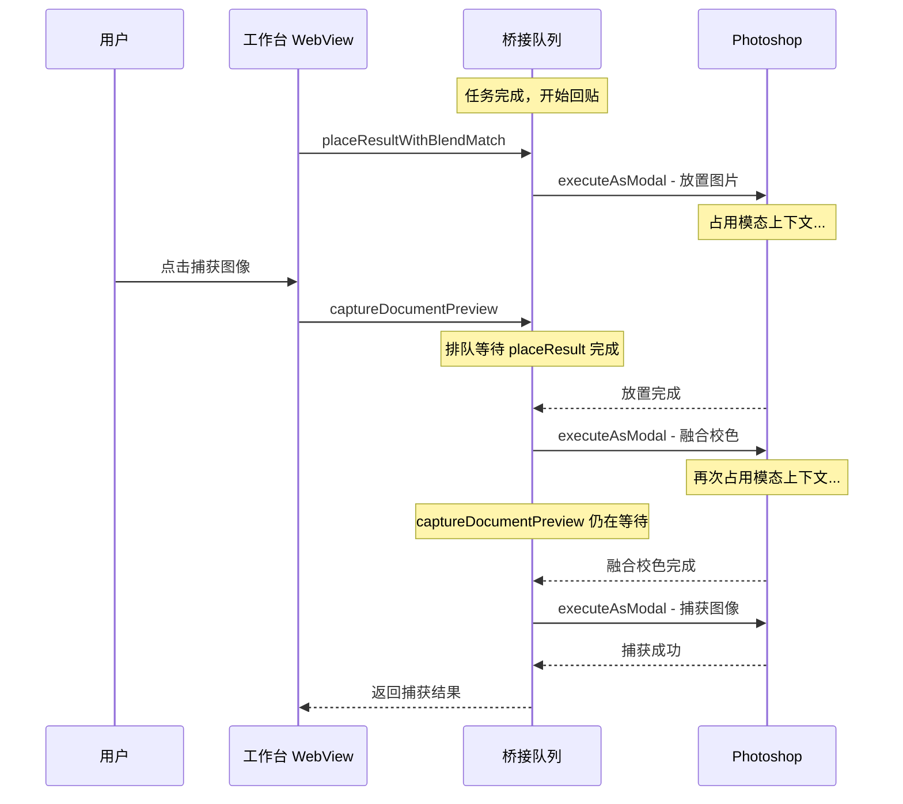

# 返图卡片回贴中无法获取图片 — 问题分析与修复建议

## 问题描述

用户反馈：当任务卡片处于「回贴中」状态时，工作台的当前应用操作页面无法从 Photoshop 获取图片运行下一个任务。据称之前可以正常操作。

---

## 根本原因分析

### 1. Photoshop 桥接操作全量串行排队

所有 Photoshop 操作通过 [`enqueuePhotoshopBridgeOperation()`](PixelRunner/src/host/main.js:49) 进入**同一串行队列**：

- `photoshop.captureDocumentPreview` ← 图像捕获
- `photoshop.placeResultFromUrl` ← 返图回贴
- `photoshop.placeResultWithBlendMatch` ← 返图回贴 + 融合校色
- `photoshop.getActiveDocumentInfo` ← 文档信息
- `photoshop.runToolAction` ← 工具操作
- `photoshop.deleteSelectionSnapshot` ← 清理快照

队列实现为 Promise 链式调用，**前一个操作未完成时，后续操作必须等待**。

### 2. 回贴操作的执行时间很长

[`placeImageFromUrl()`](PixelRunner/src/host/photoshop/service.js:1825) 包含以下步骤，均需在 Photoshop 的 `executeAsModal` 中执行：

1. 下载远程结果图 → 网络 IO
2. 解析图片格式和 PNG alpha 信息 → CPU 计算
3. 创建临时文件并写入磁盘 → IO
4. `executeAsModal` 执行放置 → Photoshop 操作
5. 对齐图层到选区 → Photoshop 操作
6. 应用蒙版 → Photoshop 操作

若启用「回贴自动校色」（[`placeResultWithBlendMatch`](PixelRunner/src/host/photoshop-bridge.js:60)），还会额外执行：

7. `runToolAction` → 又一次 `executeAsModal`
8. 融合校色全流程 → 大量 Photoshop 操作

### 3. `executeAsModal` 互斥限制

Photoshop 的 `core.executeAsModal` 是**互斥**的 — 同一时刻只能有一个模态操作运行。

即使桥接队列允许并发，Photoshop 本身也不允许捕获和放置同时执行。当回贴操作占据模态上下文时：

- [`captureDocumentPreviewInternal`](PixelRunner/src/host/photoshop/service.js:1576) 中的 `executeAsModal({ commandName: "PixelRunner Capture Preview" })` 会被拒绝
- 用户看到类似 "Photoshop is busy" / "modal state" 的错误

### 4. 回贴重试机制持续占用队列

[`flushPendingAutoPlacements()`](PixelRunner/src/webview/workspace.js:2598) 每 4 秒重试一次失败的回贴：

- 每次重试通过 `callHost` 调用 `placeResultFromUrl` / `placeResultWithBlendMatch`
- 每次调用都进入桥接队列，阻塞后续操作
- 若 Photoshop 处于模态状态（如液化），重试会持续阻塞

### 5. 捕获操作的双重保护

[`captureDocumentPreview()`](PixelRunner/src/host/photoshop/service.js:1807) 存在 `captureDocumentPreviewInFlight` 互斥锁：

```javascript
if (captureDocumentPreviewInFlight) {
  throw new Error("Photoshop 正在捕获上一份图像，请稍候再试");
}
```

加上桥接队列的串行化，捕获操作面临**两层阻塞**。

---

## 流程图



---

## 为何「之前可以」

最可能的原因是**回贴自动校色**功能的引入。在引入 `placeResultWithBlendMatch` 之前：

- 回贴只执行一次 `executeAsModal`（仅放置图层），耗时较短
- 没有融合校色的第二次 `executeAsModal` 调用
- 桥接队列被占用的时间窗口更小，用户捕获时机更容易插入

引入自动校色后，回贴变为两段连续的 `executeAsModal`，总占用时间翻倍甚至更长。

---

## 是否有必要修复

**有必要修复**，理由如下：

| 维度 | 影响 |
|------|------|
| 用户工作流 | 高频用户习惯「边等回贴边准备下一个任务的图像」，当前机制迫使等待 |
| 并发任务 | 插件本支持多任务并发，但回贴阻塞了捕获，使并发形同虚设 |
| 用户体验 | 回贴+校色可耗时 10-30 秒，期间完全无法操作 |
| 回归 | 用户反馈「之前可以」，说明这是一次功能退化 |

---

## 修复方案建议

### 方案 A：优先级调度 + 可中断桥接队列（推荐）

**思路**：改造桥接队列为优先级调度，捕获操作具有比回贴重试更高的优先级；当高优先级操作到达时，挂起低优先级的重试等待。

**改动点**：
- [`enqueuePhotoshopBridgeOperation`](PixelRunner/src/host/main.js:49) 增加 `priority` 参数
- `captureDocumentPreview` 调用时设置高优先级
- `pendingAutoPlacements` 重试设置为低优先级，且在捕获请求到达时暂停重试
- 首次 `autoPlaceResult` 保持正常优先级（不应被打断）

**优点**：根本性解决问题，且不改变 Photoshop 端逻辑
**风险**：队列重构复杂度中等，需要充分测试优先级反转场景

### 方案 B：分离捕获和放置的桥接队列

**思路**：为捕获操作和放置操作维护两个独立队列，捕获操作不必等待放置完成。

**改动点**：
- 新增 `enqueueCaptureBridgeOperation`，与 `enqueuePhotoshopBridgeOperation` 分离
- 捕获操作走独立队列

**优点**：概念清晰
**风险**：`executeAsModal` 本身互斥，两个队列的请求在 Photoshop 端仍会冲突 — 需要额外处理 Photoshop 端的模态互斥错误

### 方案 C：回贴延迟至空闲再执行

**思路**：任务完成后不立即执行回贴，而是等用户不操作（无捕获请求）时再自动触发。

**改动点**：
- [`autoPlaceResult`](PixelRunner/src/webview/workspace.js:2675) 改为延迟执行
- 当用户触发捕获时，暂停回贴队列
- 捕获完成后，恢复回贴队列

**优点**：改动最小，只需调整 webview 侧逻辑
**风险**：回贴延迟可能让用户以为结果丢失；需要良好 UI 反馈

### 方案 D：预捕获缓冲机制

**思路**：在开始回贴之前，自动捕获一份当前文档快照缓存起来。用户点击「捕获图像」时直接返回缓存，无需再调用 Photoshop。

**改动点**：
- 在 `autoPlaceResult` 前预调用 `captureDocumentPreview`
- 缓存结果供后续使用
- 缓存失效机制

**优点**：不改变队列逻辑，体验流畅
**风险**：预捕获增加额外开销；缓存可能与当前文档不同步；适用场景有限

---

## 推荐方案

**推荐方案 A + C 的组合**：

1. **短期（方案 C 思路）**：当检测到用户正在捕获图像时，暂停回贴重试，优先让捕获操作执行。这只需在 webview 层添加逻辑，风险低。
2. **中期（方案 A 思路）**：改造桥接队列为优先级调度，彻底解决操作阻塞问题。

这样的分阶段实施既降低了风险，又能快速缓解用户痛点。
